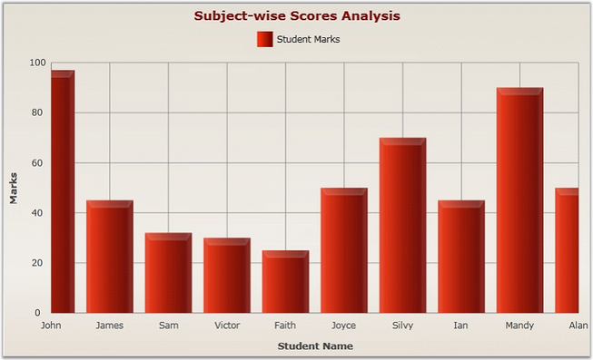
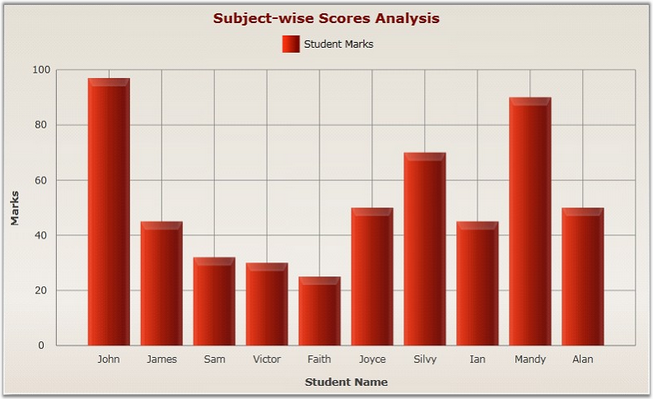

::: {style="DISPLAY: none"}
{#d2h_url_template}{#d2h_package_url style="WIDTH: 0px; DISPLAY: none; HEIGHT: 0px"}
:::

:::: {.d2h_secondary_topic style="PADDING-BOTTOM: 10pt; MARGIN: 0pt; PADDING-LEFT: 0pt; PADDING-RIGHT: 0pt; PADDING-TOP: 0pt"}
##### Range Calculation Mode {#range-calculation-mode style="tab-stops: 0pt"}

[]{style="COLOR: #15428b"} 

Range Calculation mode is used to calculate range values for the x-axis, based on the selected chart type. The RangeCalculationMode property of ChartAxis class is used to set the range calculation mode.

 

Some chart types require an additional value to be added to the range values, so that the series segments will not be hidden. For example, Column, Bar, Stacking Column and Stacking Bar Charts require additional values to display all their segments. On the other hand, Line, Area and Stacking Area Charts do not require additional values and can be rendered from the start value.

 

::: {align="center"}
+-----------------------------------+-----------------------------------------------------------------------------------------------------------------------------------------------------------------------------------------------------------------------------------------------------------+
| Chart Axis Property               | Description                                                                                                                                                                                                                                               |
+-----------------------------------+-----------------------------------------------------------------------------------------------------------------------------------------------------------------------------------------------------------------------------------------------------------+
| RangeCalculationMode              | This property is used to calculate range values for the x-axis of the Chart. It includes the following options.                                                                                                                                           |
|                                   |                                                                                                                                                                                                                                                           |
|                                   | **[]{style="COLOR: #15428b"}**                                                                                                                                                                                                                            |
|                                   |                                                                                                                                                                                                                                                           |
|                                   | [·      ]{style="FONT-FAMILY: Symbol"}AdjustAcrossChartTypes: All charts will have one plus interval added to the start and end of the axis to be consistent with the column chart.                                                                       |
|                                   |                                                                                                                                                                                                                                                           |
|                                   | [·      ]{style="FONT-FAMILY: Symbol"}ConsistentAcrossChartTypes: All charts will be drawn from the axis start point. In this case column charts will also be drawn with same range as other charts, making the first and last segments hidden partially. |
|                                   |                                                                                                                                                                                                                                                           |
|                                   | [·      ]{style="FONT-FAMILY: Symbol"}Default: Charts will be displayed in the AdjustAcrossChartTypes mode.                                                                                                                                               |
+-----------------------------------+-----------------------------------------------------------------------------------------------------------------------------------------------------------------------------------------------------------------------------------------------------------+
:::

**[]{style="COLOR: #15428b"}** 

The following code example illustrates how to set the Range Calculation mode for the Chart Axis.

[]{style="COLOR: #15428b"} 

+---------------------------------------------------------------------------------------------------------------------------------------------------------------------------------------------------------------------------------------------------------------------------------------------------------------------------------------------------------------------------------------------------------------------------------------------------------------------------------------------------------------------------------------------------------------------------------------------+
| [\[XAML\]]{style="FONT-FAMILY: 'Courier New'"}                                                                                                                                                                                                                                                                                                                                                                                                                                                                                                                                              |
|                                                                                                                                                                                                                                                                                                                                                                                                                                                                                                                                                                                             |
| []{style="FONT-FAMILY: 'Courier New'; COLOR: blue"}                                                                                                                                                                                                                                                                                                                                                                                                                                                                                                                                         |
|                                                                                                                                                                                                                                                                                                                                                                                                                                                                                                                                                                                             |
| [\<]{style="FONT-FAMILY: 'Courier New'; COLOR: blue"}[syncfusion]{style="FONT-FAMILY: 'Courier New'; COLOR: #a31515"}[:]{style="FONT-FAMILY: 'Courier New'; COLOR: blue"}[ChartArea]{style="FONT-FAMILY: 'Courier New'; COLOR: #a31515"}[\>]{style="FONT-FAMILY: 'Courier New'; COLOR: blue"}                                                                                                                                                                                                                                                                                               |
|                                                                                                                                                                                                                                                                                                                                                                                                                                                                                                                                                                                             |
| [    ]{style="FONT-FAMILY: 'Courier New'; COLOR: #a31515"}[\<]{style="FONT-FAMILY: 'Courier New'; COLOR: blue"}[syncfusion]{style="FONT-FAMILY: 'Courier New'; COLOR: #a31515"}[:]{style="FONT-FAMILY: 'Courier New'; COLOR: blue"}[ChartArea.PrimaryAxis]{style="FONT-FAMILY: 'Courier New'; COLOR: #a31515"}[\>]{style="FONT-FAMILY: 'Courier New'; COLOR: blue"}                                                                                                                                                                                                                         |
|                                                                                                                                                                                                                                                                                                                                                                                                                                                                                                                                                                                             |
| [        ]{style="FONT-FAMILY: 'Courier New'; COLOR: #a31515"}[\<]{style="FONT-FAMILY: 'Courier New'; COLOR: blue"}[syncfusion]{style="FONT-FAMILY: 'Courier New'; COLOR: #a31515"}[:]{style="FONT-FAMILY: 'Courier New'; COLOR: blue"}[ChartAxis]{style="FONT-FAMILY: 'Courier New'; COLOR: #a31515"}[ IsAutoSetRange]{style="FONT-FAMILY: 'Courier New'; COLOR: red"}[=\"True\"]{style="FONT-FAMILY: 'Courier New'; COLOR: blue"}[ RangeCalculationMode]{style="FONT-FAMILY: 'Courier New'; COLOR: red"}[=\"AdjustAcrossChartTypes\"/\>]{style="FONT-FAMILY: 'Courier New'; COLOR: blue"} |
|                                                                                                                                                                                                                                                                                                                                                                                                                                                                                                                                                                                             |
| [    ]{style="FONT-FAMILY: 'Courier New'; COLOR: #a31515"}[\</]{style="FONT-FAMILY: 'Courier New'; COLOR: blue"}[syncfusion]{style="FONT-FAMILY: 'Courier New'; COLOR: #a31515"}[:]{style="FONT-FAMILY: 'Courier New'; COLOR: blue"}[ChartArea.PrimaryAxis]{style="FONT-FAMILY: 'Courier New'; COLOR: #a31515"}[\>]{style="FONT-FAMILY: 'Courier New'; COLOR: blue"}                                                                                                                                                                                                                        |
|                                                                                                                                                                                                                                                                                                                                                                                                                                                                                                                                                                                             |
| [\</]{style="FONT-FAMILY: 'Courier New'; COLOR: blue"}[syncfusion]{style="FONT-FAMILY: 'Courier New'; COLOR: #a31515"}[:]{style="FONT-FAMILY: 'Courier New'; COLOR: blue"}[ChartArea]{style="FONT-FAMILY: 'Courier New'; COLOR: #a31515"}[\>]{style="FONT-FAMILY: 'Courier New'; COLOR: blue"}                                                                                                                                                                                                                                                                                              |
+---------------------------------------------------------------------------------------------------------------------------------------------------------------------------------------------------------------------------------------------------------------------------------------------------------------------------------------------------------------------------------------------------------------------------------------------------------------------------------------------------------------------------------------------------------------------------------------------+

[]{style="COLOR: #15428b"} 

+--------------------------------------------------------------------------------------------------------------------------------------------------------------------------------+
| [\[C#\]]{style="FONT-FAMILY: 'Courier New'"}                                                                                                                                   |
|                                                                                                                                                                                |
| []{style="FONT-FAMILY: 'Courier New'"}                                                                                                                                         |
|                                                                                                                                                                                |
| [// Create an instance for the Chart and Chart Area.]{style="FONT-FAMILY: 'Courier New'; COLOR: green"}                                                                        |
|                                                                                                                                                                                |
| [Chart]{style="FONT-FAMILY: 'Courier New'; COLOR: #2b91af"}[ chart = [new]{style="COLOR: blue"} [Chart]{style="COLOR: #2b91af"}();]{style="FONT-FAMILY: 'Courier New'"}        |
|                                                                                                                                                                                |
| [ChartArea]{style="FONT-FAMILY: 'Courier New'; COLOR: #2b91af"}[ area = [new]{style="COLOR: blue"} [ChartArea]{style="COLOR: #2b91af"}();]{style="FONT-FAMILY: 'Courier New'"} |
|                                                                                                                                                                                |
| [chart.Areas.Add(area);]{style="FONT-FAMILY: 'Courier New'"}                                                                                                                   |
|                                                                                                                                                                                |
| []{style="FONT-FAMILY: 'Courier New'"}                                                                                                                                         |
|                                                                                                                                                                                |
| [// Initialize the Range Calculation Mode values.]{style="FONT-FAMILY: 'Courier New'; COLOR: green"}                                                                           |
|                                                                                                                                                                                |
| [chart.Areas\[0\].PrimaryAxis.RangeCalculationMode = [RangeCalculationMode]{style="COLOR: #2b91af"}.ConsistentAcrossChartTypes;]{style="FONT-FAMILY: 'Courier New'"}           |
+--------------------------------------------------------------------------------------------------------------------------------------------------------------------------------+

[]{style="COLOR: #15428b"} 

{border="0"}

Figure 103: RangeCalculationMode = \"ConsistentAcrossChartType\"

[]{style="COLOR: #15428b"} 

{border="0"}

Figure 104: RangeCalculationMode = \"AdjustAcrossChartTypes\" (Default Mode)

 

[]{#p101} 

 

[]{#related-topics}
::::
