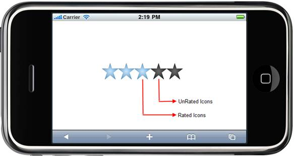

::: {style="DISPLAY: none"}
{#d2h_url_template} {#d2h_package_url style="WIDTH: 0px; DISPLAY: none; HEIGHT: 0px"}
:::

::::: {#nsbanner .d2h_main_nsbanner style="BORDER-BOTTOM: #999999 1px solid; POSITION: relative; PADDING-BOTTOM: 0px; BACKGROUND-COLOR: transparent; PADDING-LEFT: 0px; PADDING-RIGHT: 0px; DISPLAY: none; BORDER-TOP: #999999 1px solid; PADDING-TOP: 0px; LEFT: 0px"}
:::: {#TitleRow .d2h_main_titlerow style="PADDING-BOTTOM: 4px; BACKGROUND-COLOR: transparent; PADDING-LEFT: 22px; WIDTH: 100%; PADDING-RIGHT: 10px; DISPLAY: none; PADDING-TOP: 4px"}
::: {#ienav .d2h_main_ienav style="DISPLAY: none"}
{#D2HPrevious .D2HPreviousEnabled}  {#D2HNext .D2HNextEnabled}
:::
::::
:::::

:::: {#nstext .d2h_main_nstext style="PADDING-BOTTOM: 10px; BACKGROUND-COLOR: transparent; PADDING-LEFT: 22px; PADDING-RIGHT: 10px; HEIGHT: 100%; OVERFLOW: auto; PADDING-TOP: 5px" hasuserbackground="true" valign="bottom"}
::: {#d2h_breadcrumbs .d2h_breadcrumbs}
[Essential Studio User Guide Documentation](ms-xhelp:///?Id=12457748-09e3-4d74-a240-8e049cedf030){.d2h_breadcrumbsNormal} [ \> ]{.d2h_breadcrumbsLinkSeparator} [User Interface Edition](ms-xhelp:///?Id=c29296b7-531c-413b-a0ec-488ca1f7f669){.d2h_breadcrumbsNormal} [ \> ]{.d2h_breadcrumbsLinkSeparator} [Essential Mobile MVC](ms-xhelp:///?Id=74df42e3-5434-4590-9be6-3ae2f911cbbc){.d2h_breadcrumbsNormal} [ \> ]{.d2h_breadcrumbsLinkSeparator} [Essential Tools]{.d2h_breadcrumbsContentsOnly} [ \> ]{.d2h_breadcrumbsLinkSeparator} [Controls and Components](ms-xhelp:///?Id=143afae1-3f83-4d32-9bfa-92ed7022a696){.d2h_breadcrumbsNormal}
:::

## Rating {#rating style="tab-stops: 0pt"}

The Essential Tools Mobile rating control for ASP.NET MVC provides an intuitive rating experience that allows the end-user to select a number of stars that represent a rating.

 

Key Features

[·      ]{style="FONT-FAMILY: Symbol"}Full, half, and exact precision support

[·      ]{style="FONT-FAMILY: Symbol"}Horizontal and vertical orientation support

[·      ]{style="FONT-FAMILY: Symbol"}Editable and read-only mode support

[·      ]{style="FONT-FAMILY: Symbol"}Four built-in skins

 

Use Case scenarios

The rating control allows the end-user to select a number of stars that represent a rating.

[·      ]{style="FONT-FAMILY: Symbol"}The user can now experience precise ratings, instead of rounded-off values

[·      ]{style="FONT-FAMILY: Symbol"}You can customize the way the rating control works-

[o  ]{style="FONT-FAMILY: 'Courier New'"}The numerical data associated with each "star" control

[o  ]{style="FONT-FAMILY: 'Courier New'"}The skins for each rating control

 

Structure of the Rating Control

The following figure depicts the important sections of the rating control.

[ {border="0"} ]{style="FONT-SIZE: 12pt"}

Figure 97: Structure of Rating Control

*[]{style="FONT-FAMILY: 'Calibri','sans-serif'"}*  

More:

[ ]{#related-topics}

[{border="0" align="absMiddle"}Adding the Rating Control to an Mobile ASP.NET MVC application](ms-xhelp:///?Id=18b5cb4c-b1de-477b-8191-a36880b5c230){style="TEXT-DECORATION: none"}

[{border="0" align="absMiddle"}Concepts and Features](ms-xhelp:///?Id=71c5d09f-2f9b-46e4-a958-4afa53a8ed38){style="TEXT-DECORATION: none"}
::::
