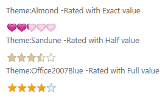

::: {style="DISPLAY: none"}
{#d2h_url_template}{#d2h_package_url style="WIDTH: 0px; DISPLAY: none; HEIGHT: 0px"}
:::

::::: {#nsbanner .d2h_main_nsbanner style="BORDER-BOTTOM: #999999 1px solid; POSITION: relative; PADDING-BOTTOM: 0px; BACKGROUND-COLOR: transparent; PADDING-LEFT: 0px; PADDING-RIGHT: 0px; DISPLAY: none; BORDER-TOP: #999999 1px solid; PADDING-TOP: 0px; LEFT: 0px"}
:::: {#TitleRow .d2h_main_titlerow style="PADDING-BOTTOM: 4px; BACKGROUND-COLOR: transparent; PADDING-LEFT: 22px; WIDTH: 100%; PADDING-RIGHT: 10px; DISPLAY: none; PADDING-TOP: 4px"}
::: {#ienav .d2h_main_ienav style="DISPLAY: none"}
{#D2HPrevious .D2HPreviousEnabled}  {#D2HNext .D2HNextEnabled}
:::
::::
:::::

:::: {#nstext .d2h_main_nstext style="PADDING-BOTTOM: 10px; BACKGROUND-COLOR: transparent; PADDING-LEFT: 22px; PADDING-RIGHT: 10px; HEIGHT: 100%; OVERFLOW: auto; PADDING-TOP: 5px" hasuserbackground="true" valign="bottom"}
::: {#d2h_breadcrumbs .d2h_breadcrumbs}
[Essential Studio User Guide Documentation](ms-xhelp:///?Id=12457748-09e3-4d74-a240-8e049cedf030){.d2h_breadcrumbsNormal}[ \> ]{.d2h_breadcrumbsLinkSeparator}[User Interface Edition](ms-xhelp:///?Id=c29296b7-531c-413b-a0ec-488ca1f7f669){.d2h_breadcrumbsNormal}[ \> ]{.d2h_breadcrumbsLinkSeparator}[Essential ASP.NET](ms-xhelp:///?Id=25c35330-c127-4dad-9a92-ed79dc7261a6){.d2h_breadcrumbsNormal}[ \> ]{.d2h_breadcrumbsLinkSeparator}[Essential Tools]{.d2h_breadcrumbsContentsOnly}[ \> ]{.d2h_breadcrumbsLinkSeparator}[Controls and Components](ms-xhelp:///?Id=99dc3762-3a6c-4306-b62b-5aa347ed3105){.d2h_breadcrumbsNormal}[ \> ]{.d2h_breadcrumbsLinkSeparator}[Notification Package](ms-xhelp:///?Id=29371862-8248-4f92-80cc-129b797d975c){.d2h_breadcrumbsNormal}
:::

### Rating Control in ASP.NET {#rating-control-in-asp.net style="tab-stops: 0pt"}

The Essential Tools rating control for ASP.NET Web provides an intuitive rating experience that allows the end-user to select a number of stars that represent a rating.

It[[ allows displaying a numeric variable with a \"star control\", which is useful when creating polls or in occasions when you want the user to rate various kinds of items.]{style="COLOR: black"}]{.apple-style-span}

Here are some of the key features of the rating control in ASP.NET-

[·      ]{style="FONT-FAMILY: Symbol"}Exact precision support for each rating icon (Full, Half, or exact)

[·      ]{style="FONT-FAMILY: Symbol"}Horizontal and vertical orientation support.

[·      ]{style="FONT-FAMILY: Symbol"}Editable and read-only mode support.

[·      ]{style="FONT-FAMILY: Symbol"}Auto-post-back support.

[·      ]{style="FONT-FAMILY: Symbol"}Reset button support.

[·      ]{style="FONT-FAMILY: Symbol"}Customizable rating

[·      ]{style="FONT-FAMILY: Symbol; COLOR: black"}Fourteen built-in skins.[]{style="COLOR: black"}

[·      ]{style="FONT-FAMILY: Symbol; COLOR: black"}Tool tip support[]{style="COLOR: black"}

 

Use Case Scenarios

The Rating control is used to elegantly visualize end-users\' ratings[[ ]{style="COLOR: black"}]{.apple-style-span}

[[·      ]{style="FONT-FAMILY: Symbol; COLOR: black"}]{.apple-style-span}[[The user can now experience precise ratings, instead of rounded-off values ]{style="COLOR: black"}]{.apple-style-span}

[[·      ]{style="FONT-FAMILY: Symbol; COLOR: black"}]{.apple-style-span}[[The user can reset the rating control whenever required]{style="COLOR: black"}]{.apple-style-span}

[[·      ]{style="FONT-FAMILY: Symbol; COLOR: black"}]{.apple-style-span}[[You can customize the way the rating control works, i.e.- ]{style="COLOR: black"}]{.apple-style-span}

[[o  ]{style="FONT-FAMILY: 'Courier New'; COLOR: black"}]{.apple-style-span}[[The numerical data associated with each "star" control,]{style="COLOR: black"}]{.apple-style-span}

[[o  ]{style="FONT-FAMILY: 'Courier New'; COLOR: black"}]{.apple-style-span}[[The skins for each rating control, ]{style="COLOR: black"}]{.apple-style-span}

[[o  ]{style="FONT-FAMILY: 'Courier New'; COLOR: black"}]{.apple-style-span}[[The way the rating icons look- this allows you to change the icon to anything else other than a star if you want to.]{style="COLOR: black"}]{.apple-style-span}

 

Appearance and Structure

The following figure gives you a basic idea of the structure and appearance of the Rating control in ASP.NET Tools-

{border="0"}

Figure 439: Rating Control with Exact, Half, and Full precision options, along with Icon customization

 

More:

[ ]{#related-topics}

[{border="0" align="absMiddle"}Adding Rating control to ASP.NET Tools](ms-xhelp:///?Id=de26a92f-cd90-4c89-8153-36d8dde7795b){style="TEXT-DECORATION: none"}

[{border="0" align="absMiddle"}Concepts and Features](ms-xhelp:///?Id=ba23dddc-1674-4374-8e05-65803a2413d6){style="TEXT-DECORATION: none"}
::::
