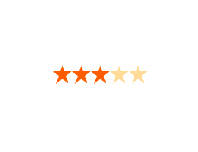
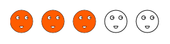

::: {style="DISPLAY: none"}
{#d2h_url_template}{#d2h_package_url style="WIDTH: 0px; DISPLAY: none; HEIGHT: 0px"}
:::

::: {.d2h_secondary_topic style="PADDING-BOTTOM: 10pt; MARGIN: 0pt; PADDING-LEFT: 0pt; PADDING-RIGHT: 0pt; PADDING-TOP: 0pt"}
#### Rating control in HTML5 {#rating-control-in-html5 style="tab-stops: 0pt"}

This feature allows you to easily customize the appearance of the rating control. This feature has been developed using HTML5, and rating customizations are updated completely on the client-side. This makes processes faster and gives you a better performance.

[The rating control allows the end-user to select a number of stars that represent a rating.]{style="COLOR: black"}

[You can customize -]{style="COLOR: black"}

[·      ]{style="FONT-FAMILY: Symbol; COLOR: black"}[The shapes used for rating- this allows you to change the shape to anything else other than a star if you want to---you can also add custom shapes that you would want to measure the rating by]{style="COLOR: black"}

[·      ]{style="FONT-FAMILY: Symbol; COLOR: black"}[The look and feel, (which also includes the dimensions of the shapes, spacing between the shapes, color, orientation, etc. used) of the Rating control in HTML5]{style="COLOR: black"}

The following figures give you a basic idea of the structure and appearance of Rating control in HTML5:

 

{border="0"}

Figure 185: Default Rating control in HTML5

 

{border="0"}

Figure 186: Rating control in HTML5 with vertical orientation, and heart shapes

 

 

{border="0"}

Figure 187: HTML5 rating with custom shapes and adjusted spacing

 

 

More:

[ ]{#related-topics}

[{border="0" align="absMiddle"}Where do I find Installed samples?](ms-xhelp:///?Id=777ea1d9-c178-4d6d-8a38-53f7c90b4b6c){style="TEXT-DECORATION: none"}

[{border="0" align="absMiddle"}Properties, Methods and Events tables](ms-xhelp:///?Id=f4f44d7c-2319-4519-8a6f-7360bec44d85){style="TEXT-DECORATION: none"}

[{border="0" align="absMiddle"}Adding Rating in HTML5 to an MVC application](ms-xhelp:///?Id=8d3f41d1-203e-4889-b1df-df3a0155f3e2){style="TEXT-DECORATION: none"}
:::
