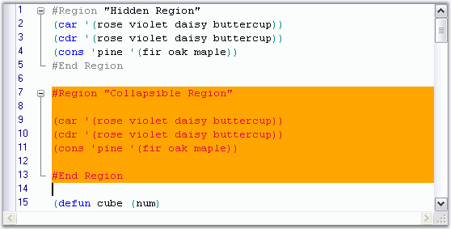

::: {style="DISPLAY: none"}
{#d2h_url_template}{#d2h_package_url style="WIDTH: 0px; DISPLAY: none; HEIGHT: 0px"}
:::

:::: {.d2h_secondary_topic style="PADDING-BOTTOM: 10pt; MARGIN: 0pt; PADDING-LEFT: 0pt; PADDING-RIGHT: 0pt; PADDING-TOP: 0pt"}
#### Read-Only Text {#read-only-text style="tab-stops: 0pt"}

 

Edit Control allows you to specify read-only regions in the code, i.e., regions that are uneditable. This can be achieved through the following methods.

 

::: {align="center"}
  --------------------- -----------------------------------------------
  Edit Control Method   Description
  MarkAsReadOnly        Sets text as read-only.
  RemoveReadOnly        Removes read-only status of specified region.
  --------------------- -----------------------------------------------
:::

 

+-------------------------------------------------------------------------------------------------------------------------------------------------------------------------------------------------------------------------------------------------------------------------------------------------------------------------+
| **[\[C#\]]{style="FONT-FAMILY: 'Courier New'; COLOR: black"}**                                                                                                                                                                                                                                                          |
|                                                                                                                                                                                                                                                                                                                         |
| []{style="FONT-FAMILY: 'Courier New'; COLOR: black"}                                                                                                                                                                                                                                                                    |
|                                                                                                                                                                                                                                                                                                                         |
| [// Specify a read-only region.]{style="FONT-FAMILY: 'Courier New'; COLOR: green"}                                                                                                                                                                                                                                      |
|                                                                                                                                                                                                                                                                                                                         |
| [this]{style="FONT-FAMILY: 'Courier New'; COLOR: blue"}[.editControl1.MarkAsReadOnly([this]{style="COLOR: blue"}.editControl1.Selection.Start, [this]{style="COLOR: blue"}.editControl1.Selection.End, [Color]{style="COLOR: teal"}.Orange, [Color]{style="COLOR: teal"}.Crimson);]{style="FONT-FAMILY: 'Courier New'"} |
|                                                                                                                                                                                                                                                                                                                         |
| []{style="FONT-FAMILY: 'Courier New'"}                                                                                                                                                                                                                                                                                  |
|                                                                                                                                                                                                                                                                                                                         |
| [// Reset a read-only region. ]{style="FONT-FAMILY: 'Courier New'; COLOR: green"}                                                                                                                                                                                                                                       |
|                                                                                                                                                                                                                                                                                                                         |
| [this]{style="FONT-FAMILY: 'Courier New'; COLOR: blue"}[.editControl1.RemoveReadOnly([this]{style="COLOR: blue"}.editControl1.Selection.Start, [this]{style="COLOR: blue"}.editControl1.Selection.End);]{style="FONT-FAMILY: 'Courier New'"}                                                                            |
+-------------------------------------------------------------------------------------------------------------------------------------------------------------------------------------------------------------------------------------------------------------------------------------------------------------------------+

[]{style="FONT-FAMILY: 'Trebuchet MS','sans-serif'; COLOR: #15428b; FONT-SIZE: 9pt"} 

+---------------------------------------------------------------------------------------------------------------------------------------------------------------------------------------------------------------------------------------------------------------------------------+
| **[\[VB.NET\]]{style="FONT-FAMILY: 'Courier New'; COLOR: black"}**                                                                                                                                                                                                              |
|                                                                                                                                                                                                                                                                                 |
| []{style="FONT-FAMILY: 'Courier New'; COLOR: black"}                                                                                                                                                                                                                            |
|                                                                                                                                                                                                                                                                                 |
| [\' Specify a read-only region.]{style="FONT-FAMILY: 'Courier New'; COLOR: green"}                                                                                                                                                                                              |
|                                                                                                                                                                                                                                                                                 |
| [Me]{style="FONT-FAMILY: 'Courier New'; COLOR: blue"}[.editControl1.MarkAsReadOnly([Me]{style="COLOR: blue"}.editControl1.Selection.Start, [Me]{style="COLOR: blue"}.editControl1.Selection.End, Color.Orange, Color.Crimson)             ]{style="FONT-FAMILY: 'Courier New'"} |
|                                                                                                                                                                                                                                                                                 |
| []{style="FONT-FAMILY: 'Courier New'; COLOR: blue"}                                                                                                                                                                                                                             |
|                                                                                                                                                                                                                                                                                 |
| [\' Reset a read-only region.]{style="FONT-FAMILY: 'Courier New'; COLOR: green"}                                                                                                                                                                                                |
|                                                                                                                                                                                                                                                                                 |
| [Me]{style="FONT-FAMILY: 'Courier New'; COLOR: blue"}[.editControl1.RemoveReadOnly([Me]{style="COLOR: blue"}.editControl1.Selection.Start, [Me]{style="COLOR: blue"}.editControl1.Selection.End)]{style="FONT-FAMILY: 'Courier New'"}                                           |
+---------------------------------------------------------------------------------------------------------------------------------------------------------------------------------------------------------------------------------------------------------------------------------+

 

The following screen shot shows a read-only region in the code section of the Edit Control.

 

{border="0"}

Figure 39: Read-Only Region with Orange Background and Crimson Text Color

 

A sample which demonstrates this feature is available in the following sample installation path.

 

***..\\My Documents\\Syncfusion\\EssentialStudio\\Version Number\\Windows\\Edit.Windows\\Samples\\2.0\\Advanced Editor Functions\\ TextRangeCustomizationDemo***

[]{#p55} 

[]{#related-topics}
::::
