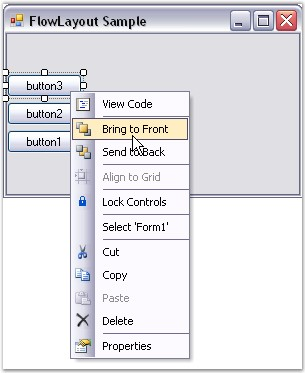
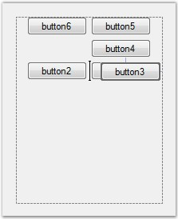
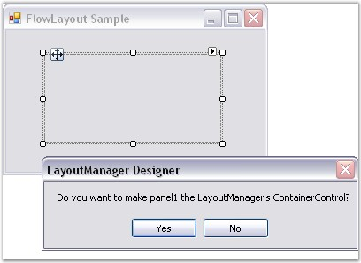
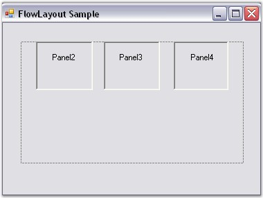
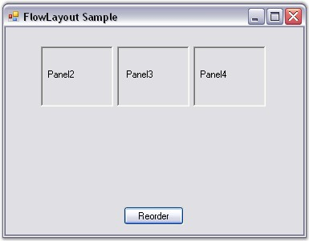
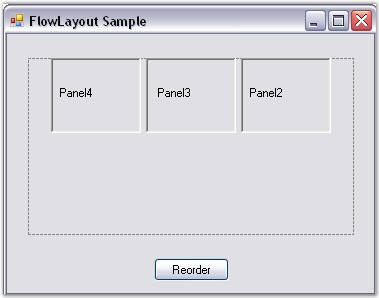

::: {style="DISPLAY: none"}
{#d2h_url_template}{#d2h_package_url style="WIDTH: 0px; DISPLAY: none; HEIGHT: 0px"}
:::

::: {.d2h_secondary_topic style="PADDING-BOTTOM: 10pt; MARGIN: 0pt; PADDING-LEFT: 0pt; PADDING-RIGHT: 0pt; PADDING-TOP: 0pt"}
##### Rearranging the Controls laid out by FlowLayout {#rearranging-the-controls-laid-out-by-flowlayout style="tab-stops: 0pt"}

[]{style="COLOR: #15428b"} 

The FlowLayout manager arranges the controls in the way it gets added into the Container collection.

[]{style="COLOR: #15428b"} 

Through Designer

[]{style="COLOR: #15428b"} 

[·      ]{style="FONT-FAMILY: Symbol"}You can rearrange the controls laid out by FlowLayout by right clicking the control and selecting the **Bring To Front** or **Send To Back** verbs in the designer.

[]{style="COLOR: #15428b"} 

{border="0"}

[]{style="COLOR: #15428b"} 

Figure 681: Rearranging Controls Through Design Time Verbs

**[]{style="COLOR: #15428b"}** 

[·      ]{style="FONT-FAMILY: Symbol"}Rearranging of Child controls of the FlowLayout can also be done by dragging and dropping them at design time.

[]{style="COLOR: #15428b"} 

{border="0"}

[]{style="COLOR: #15428b"} 

Figure 682: Dragging and Dropping Child Controls

[]{style="COLOR: #15428b"} 

Through Code

[]{style="COLOR: #15428b"} 

We can also programmatically change the order of the controls laid out by the Flowlayout. This can be done using the method given below.

[]{style="COLOR: #15428b"} 

[·      ]{style="FONT-FAMILY: Symbol"}Set up a form with Panel1 and drag the Flowlayout onto the Panel1 which would act as the Container control.

[]{style="COLOR: #15428b"} 

 {border="0"}

***[]{style="COLOR: #15428b"}*** 

Figure 683: Panel1 set as the Layout Manager\'s Container Control

[]{style="COLOR: #15428b"} 

[·      ]{style="FONT-FAMILY: Symbol"}Drag another three Panels onto the Panel1. The FlowLayout automatically arranges the Child controls as given below.

[]{style="COLOR: #15428b"} 

{border="0"}

***[]{style="COLOR: #15428b"}*** 

Figure 684: Child Panel controls (Panel2, Panel3, Panel4) automatically arranged by the Flow Layout Manager

[]{style="COLOR: #15428b"} 

[·      ]{style="FONT-FAMILY: Symbol"}Add a Button control for reordering the Child controls of Panel1 and in the Button_Click event give the following code snippet.

[]{style="COLOR: #15428b"} 

+------------------------------------------------------------------------------------------------------------------------------------------------------------------------------------------------------+
| **[\[C#\]]{style="FONT-FAMILY: 'Courier New'; COLOR: black"}**                                                                                                                                       |
|                                                                                                                                                                                                      |
| []{style="FONT-FAMILY: 'Courier New'; COLOR: black"}                                                                                                                                                 |
|                                                                                                                                                                                                      |
| [private]{style="FONT-FAMILY: 'Courier New'; COLOR: blue"}[ [void]{style="COLOR: blue"} button1_Click([object]{style="COLOR: blue"} sender, System.EventArgs e)]{style="FONT-FAMILY: 'Courier New'"} |
|                                                                                                                                                                                                      |
| [{]{style="FONT-FAMILY: 'Courier New'"}                                                                                                                                                              |
|                                                                                                                                                                                                      |
| [// Create a temporary collection of Panel\'s controls.]{style="FONT-FAMILY: 'Courier New'; COLOR: green"}                                                                                           |
|                                                                                                                                                                                                      |
| [ArrayList panelarr = [new]{style="COLOR: blue"} ArrayList();]{style="FONT-FAMILY: 'Courier New'"}                                                                                                   |
|                                                                                                                                                                                                      |
| [foreach]{style="FONT-FAMILY: 'Courier New'; COLOR: blue"}[ (Control ctrl [in]{style="COLOR: blue"} [this]{style="COLOR: blue"}.panel1.Controls)]{style="FONT-FAMILY: 'Courier New'"}                |
|                                                                                                                                                                                                      |
| [{]{style="FONT-FAMILY: 'Courier New'"}                                                                                                                                                              |
|                                                                                                                                                                                                      |
| [panelarr.Add(ctrl);]{style="FONT-FAMILY: 'Courier New'"}                                                                                                                                            |
|                                                                                                                                                                                                      |
| [}]{style="FONT-FAMILY: 'Courier New'"}                                                                                                                                                              |
|                                                                                                                                                                                                      |
| [this]{style="FONT-FAMILY: 'Courier New'; COLOR: blue"}[.panel1.Controls.Clear();]{style="FONT-FAMILY: 'Courier New'"}                                                                               |
|                                                                                                                                                                                                      |
| [// Reorder the panels.]{style="FONT-FAMILY: 'Courier New'; COLOR: green"}                                                                                                                           |
|                                                                                                                                                                                                      |
| [for]{style="FONT-FAMILY: 'Courier New'; COLOR: blue"}[ ([int]{style="COLOR: blue"} i=panelarr.Count-1; i\>=0; i\--)]{style="FONT-FAMILY: 'Courier New'"}                                            |
|                                                                                                                                                                                                      |
| [{]{style="FONT-FAMILY: 'Courier New'"}                                                                                                                                                              |
|                                                                                                                                                                                                      |
| [Panel pan = panelarr\[i\] [as]{style="COLOR: blue"} Panel;]{style="FONT-FAMILY: 'Courier New'"}                                                                                                     |
|                                                                                                                                                                                                      |
| [this]{style="FONT-FAMILY: 'Courier New'; COLOR: blue"}[.panel1.Controls.Add(pan);]{style="FONT-FAMILY: 'Courier New'"}                                                                              |
|                                                                                                                                                                                                      |
| [}]{style="FONT-FAMILY: 'Courier New'"}                                                                                                                                                              |
|                                                                                                                                                                                                      |
| [// Apply layout logic to all it\'s Child controls.]{style="FONT-FAMILY: 'Courier New'; COLOR: green"}                                                                                               |
|                                                                                                                                                                                                      |
| [this]{style="FONT-FAMILY: 'Courier New'; COLOR: blue"}[.panel1.PerformLayout();]{style="FONT-FAMILY: 'Courier New'"}                                                                                |
|                                                                                                                                                                                                      |
| [}]{style="FONT-FAMILY: 'Courier New'"}                                                                                                                                                              |
+------------------------------------------------------------------------------------------------------------------------------------------------------------------------------------------------------+

[]{style="COLOR: #15428b"} 

+-------------------------------------------------------------------------------------------------------------------------------------------------------------------------------------------------------------------------------------------------------------------------------------------------------------------+
| **[\[VB.NET\]]{style="FONT-FAMILY: 'Courier New'; COLOR: black"}**                                                                                                                                                                                                                                                |
|                                                                                                                                                                                                                                                                                                                   |
| []{style="FONT-FAMILY: 'Courier New'; COLOR: black"}                                                                                                                                                                                                                                                              |
|                                                                                                                                                                                                                                                                                                                   |
| [Private]{style="FONT-FAMILY: 'Courier New'; COLOR: blue"}[ [Sub]{style="COLOR: blue"} button1_Click([ByVal]{style="COLOR: blue"} sender [As]{style="COLOR: blue"} [Object]{style="COLOR: blue"}, [ByVal]{style="COLOR: blue"} e [As]{style="COLOR: blue"} System.EventArgs)]{style="FONT-FAMILY: 'Courier New'"} |
|                                                                                                                                                                                                                                                                                                                   |
| [\' Create a temporary collection of Panel\'s controls.]{style="FONT-FAMILY: 'Courier New'; COLOR: green"}                                                                                                                                                                                                        |
|                                                                                                                                                                                                                                                                                                                   |
| [Dim]{style="FONT-FAMILY: 'Courier New'; COLOR: blue"}[ panelarr [As]{style="COLOR: blue"} ArrayList = [New]{style="COLOR: blue"} ArrayList()]{style="FONT-FAMILY: 'Courier New'"}                                                                                                                                |
|                                                                                                                                                                                                                                                                                                                   |
| [For]{style="FONT-FAMILY: 'Courier New'; COLOR: blue"}[ [Each]{style="COLOR: blue"} ctrl [As]{style="COLOR: blue"} Control [In]{style="COLOR: blue"} [Me]{style="COLOR: blue"}.panel1.Controls]{style="FONT-FAMILY: 'Courier New'"}                                                                               |
|                                                                                                                                                                                                                                                                                                                   |
| [panelarr.Add(ctrl)]{style="FONT-FAMILY: 'Courier New'"}                                                                                                                                                                                                                                                          |
|                                                                                                                                                                                                                                                                                                                   |
| [Next]{style="FONT-FAMILY: 'Courier New'; COLOR: blue"}[ ctrl]{style="FONT-FAMILY: 'Courier New'"}                                                                                                                                                                                                                |
|                                                                                                                                                                                                                                                                                                                   |
| [Me]{style="FONT-FAMILY: 'Courier New'; COLOR: blue"}[.panel1.Controls.Clear()]{style="FONT-FAMILY: 'Courier New'"}                                                                                                                                                                                               |
|                                                                                                                                                                                                                                                                                                                   |
| [\'[Reorder the panels.]{style="COLOR: green"}]{style="FONT-FAMILY: 'Courier New'"}                                                                                                                                                                                                                               |
|                                                                                                                                                                                                                                                                                                                   |
| [For]{style="FONT-FAMILY: 'Courier New'; COLOR: blue"}[ i [As]{style="COLOR: blue"} [Integer]{style="COLOR: blue"} = panelarr.Count - 1 [To]{style="COLOR: blue"} 0 [Step]{style="COLOR: blue"} -1 ]{style="FONT-FAMILY: 'Courier New'"}                                                                          |
|                                                                                                                                                                                                                                                                                                                   |
| [Dim]{style="FONT-FAMILY: 'Courier New'; COLOR: blue"}[ pan [As]{style="COLOR: blue"} Panel = [CType]{style="COLOR: blue"}(IIf([TypeOf]{style="COLOR: blue"} panelarr(i) [Is]{style="COLOR: blue"} Panel, panelarr(i), [Nothing]{style="COLOR: blue"}), Panel)]{style="FONT-FAMILY: 'Courier New'"}               |
|                                                                                                                                                                                                                                                                                                                   |
| [Me]{style="FONT-FAMILY: 'Courier New'; COLOR: blue"}[.panel1.Controls.Add(pan)]{style="FONT-FAMILY: 'Courier New'"}                                                                                                                                                                                              |
|                                                                                                                                                                                                                                                                                                                   |
| [Next]{style="FONT-FAMILY: 'Courier New'; COLOR: blue"}[ i]{style="FONT-FAMILY: 'Courier New'"}                                                                                                                                                                                                                   |
|                                                                                                                                                                                                                                                                                                                   |
| [\'Apply layout logic to all it\'s Child controls.]{style="FONT-FAMILY: 'Courier New'; COLOR: green"}                                                                                                                                                                                                             |
|                                                                                                                                                                                                                                                                                                                   |
| [Me]{style="FONT-FAMILY: 'Courier New'; COLOR: blue"}[.panel1.PerformLayout()]{style="FONT-FAMILY: 'Courier New'"}                                                                                                                                                                                                |
|                                                                                                                                                                                                                                                                                                                   |
| [End]{style="FONT-FAMILY: 'Courier New'; COLOR: blue"}[ [Sub]{style="COLOR: blue"}]{style="FONT-FAMILY: 'Courier New'"}                                                                                                                                                                                           |
+-------------------------------------------------------------------------------------------------------------------------------------------------------------------------------------------------------------------------------------------------------------------------------------------------------------------+

[]{style="COLOR: #15428b"} 

{border="0"}

***[]{style="COLOR: #15428b"}*** 

Figure 685: Reorder button added to the Form

[]{style="COLOR: #15428b"} 

[·      ]{style="FONT-FAMILY: Symbol"}At run time when you click the Reorder button, the Panels 2, 3 and 4 will be rearranged in a different order.

[]{style="COLOR: #15428b"} 

{border="0"}

***[]{style="COLOR: #15428b"}*** 

Figure 686: Child Panel controls reordered on clicking the Reorder button at Run Time

[]{style="FONT-SIZE: 8pt"} 

See Also

[]{style="COLOR: #15428b"} 

[Rearranging the Controls laid out by GridLayout]{.UGHyperlink}[, ]{.UGHyperlink}[Rearranging the Controls laid out by GridBagLayout]{.UGHyperlink}[]{.UGHyperlink}

[]{#related-topics}
:::
