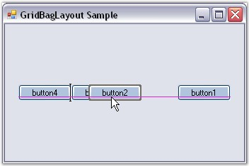

::: {style="DISPLAY: none"}
{#d2h_url_template}{#d2h_package_url style="WIDTH: 0px; DISPLAY: none; HEIGHT: 0px"}
:::

::: {.d2h_secondary_topic style="PADDING-BOTTOM: 10pt; MARGIN: 0pt; PADDING-LEFT: 0pt; PADDING-RIGHT: 0pt; PADDING-TOP: 0pt"}
##### Rearranging the Controls laid out by GridBagLayout[]{#p835} {#rearranging-the-controls-laid-out-by-gridbaglayout style="tab-stops: 0pt"}

[]{style="COLOR: #15428b"} 

Similar to the FlowLayout and GridLayout Managers, the Child controls of the GridBagLayout can also be rearranged by dragging and dropping them at design time.

[]{style="COLOR: #15428b"} 

{border="0"}

[]{style="COLOR: #15428b"} 

Figure 698: Dragging and Dropping Child Controls

[]{style="COLOR: #15428b"} 

See Also

[]{style="COLOR: #15428b"} 

[Rearranging the Controls laid out by FlowLayout]{.UGHyperlink}[, ]{.UGHyperlink}[Rearranging the Controls laid out by GridLayout]{.UGHyperlink}[]{.UGHyperlink}

[]{#related-topics}
:::
