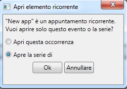

::: {style="DISPLAY: none"}
{#d2h_url_template}{#d2h_package_url style="WIDTH: 0px; DISPLAY: none; HEIGHT: 0px"}
:::

:::: {.d2h_secondary_topic style="PADDING-BOTTOM: 10pt; MARGIN: 0pt; PADDING-LEFT: 0pt; PADDING-RIGHT: 0pt; PADDING-TOP: 0pt"}
##### Recurrence Alert Window {#recurrence-alert-window style="tab-stops: 0pt"}

Table 9: Open Recurring Item

::: {align="center"}
  --------------------------------- ----------------------------------------------------------------------------------------
  Names in Resource File            Values
  RecurrenceAlertWindowHeader       Open the Recurring Item
  RecurrenceAlertWindowContent      Is it a Recurring Appointment? Do you want to open only this occurrence or the series?
  RecurrenceAlertWindowOpen         Open this Occurrence
  RecurrenceAlertWindowOpenSeries   Open the Series
  --------------------------------- ----------------------------------------------------------------------------------------
:::

 

{border="0"}

Figure 35: Open Recurring Item

[]{#related-topics}
::::
