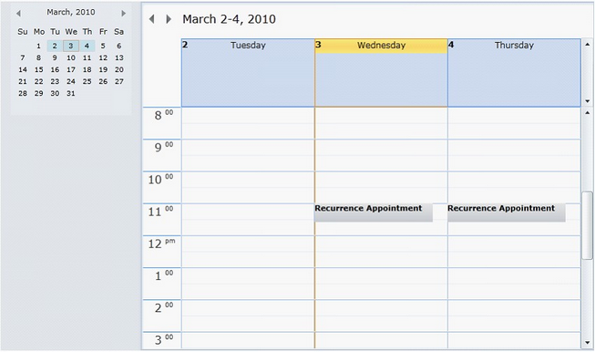

::: {style="DISPLAY: none"}
{#d2h_url_template}{#d2h_package_url style="WIDTH: 0px; DISPLAY: none; HEIGHT: 0px"}
:::

::::: {#nsbanner .d2h_main_nsbanner style="BORDER-BOTTOM: #999999 1px solid; POSITION: relative; PADDING-BOTTOM: 0px; BACKGROUND-COLOR: transparent; PADDING-LEFT: 0px; PADDING-RIGHT: 0px; DISPLAY: none; BORDER-TOP: #999999 1px solid; PADDING-TOP: 0px; LEFT: 0px"}
:::: {#TitleRow .d2h_main_titlerow style="PADDING-BOTTOM: 4px; BACKGROUND-COLOR: transparent; PADDING-LEFT: 22px; WIDTH: 100%; PADDING-RIGHT: 10px; DISPLAY: none; PADDING-TOP: 4px"}
::: {#ienav .d2h_main_ienav style="DISPLAY: none"}
{#D2HPrevious .D2HPreviousEnabled}  {#D2HNext .D2HNextEnabled}
:::
::::
:::::

::::: {#nstext .d2h_main_nstext style="PADDING-BOTTOM: 10px; BACKGROUND-COLOR: transparent; PADDING-LEFT: 22px; PADDING-RIGHT: 10px; HEIGHT: 100%; OVERFLOW: auto; PADDING-TOP: 5px" hasuserbackground="true" valign="bottom"}
::: {#d2h_breadcrumbs .d2h_breadcrumbs}
[Essential Studio User Guide Documentation](ms-xhelp:///?Id=12457748-09e3-4d74-a240-8e049cedf030){.d2h_breadcrumbsNormal}[ \> ]{.d2h_breadcrumbsLinkSeparator}[User Interface Edition](ms-xhelp:///?Id=c29296b7-531c-413b-a0ec-488ca1f7f669){.d2h_breadcrumbsNormal}[ \> ]{.d2h_breadcrumbsLinkSeparator}[Essential WPF](ms-xhelp:///?Id=7f4f82c5-151c-4262-94d0-75c4626c77bc){.d2h_breadcrumbsNormal}[ \> ]{.d2h_breadcrumbsLinkSeparator}[Essential Schedule]{.d2h_breadcrumbsContentsOnly}[ \> ]{.d2h_breadcrumbsLinkSeparator}[Concepts and Features](ms-xhelp:///?Id=7a8d4b17-d8b0-4ff4-a562-1b876329b0f4){.d2h_breadcrumbsNormal}[ \> ]{.d2h_breadcrumbsLinkSeparator}[Advanced Features](ms-xhelp:///?Id=090a8908-6461-4b90-8c67-12347fdd673c){.d2h_breadcrumbsNormal}
:::

### Recurrence Appointments {#recurrence-appointments style="tab-stops: 0pt"}

Recurrences appointments for Schedule WPF enable users to add appointment in multiple different dates or time slots.

 

Key Features

The following are the Key features of Recurrence Appointments

[·      ]{style="FONT-FAMILY: Symbol"}There are four different types of recurrences: They are:

[o  ]{style="FONT-FAMILY: 'Courier New'"}**Daily**

[o  ]{style="FONT-FAMILY: 'Courier New'"}**Weekly**

[o  ]{style="FONT-FAMILY: 'Courier New'"}**Monthly**

[o  ]{style="FONT-FAMILY: 'Courier New'"}**Yearly**

::: {style="BORDER-BOTTOM: windowtext 1pt solid; BORDER-LEFT: medium none; PADDING-BOTTOM: 1pt; MARGIN-TOP: 9pt; PADDING-LEFT: 0pt; PADDING-RIGHT: 0pt; MARGIN-BOTTOM: 9pt; BORDER-TOP: windowtext 1pt solid; BORDER-RIGHT: medium none; PADDING-TOP: 1pt"}
[{border="0"}]{style="FONT-FAMILY: 'Trebuchet MS','sans-serif'; COLOR: #15428b"}[***[Note]{style="LAYOUT-GRID-MODE: line"}***]{.NoteChar}[: ]{style="FONT-FAMILY: 'Trebuchet MS','sans-serif'; COLOR: #15428b"}Daily Recurrence Type is selected by Default.[]{style="FONT-FAMILY: 'Trebuchet MS','sans-serif'; COLOR: #15428b"}
:::

Basic properties

The Recurrence Appointment control exposes the following properties in the top level.

 

Option Features

[·      ]{style="FONT-FAMILY: Symbol"}**CurrentRecurrencePatternMode**---This enables users to choose any one of the Recurrence Type.

[·      ]{style="FONT-FAMILY: Symbol"}**EndOccurenceCount**---Provides the number of recurrences happen.

[·      ]{style="FONT-FAMILY: Symbol"}**EndRecurrenceTime**---This is a **Datetime** property which is used to disable recurrence appointment.

 

Recurrence Type Daily

[·      ]{style="FONT-FAMILY: Symbol"}**IsDailyCustomDays**---Set this to **true** to enable Recurrence Appointment.

[·      ]{style="FONT-FAMILY: Symbol"}**IsDailyCustomDays**---Set this to **false** to enable Recurrence Appointment on Week days alone.

[·      ]{style="FONT-FAMILY: Symbol"}**DailyDays**---Enables you to set number of day(s) the appointment is repeated.

 

Recurrence Type Weekly

[·      ]{style="FONT-FAMILY: Symbol"}**WeeklyWeeks**---Enables users to set number of week(s) the appointment is repeated in a particular day.

[·      ]{style="FONT-FAMILY: Symbol"}**IsWeeklySundaySelected---**Set this to **true** to enable every Sunday.

[·      ]{style="FONT-FAMILY: Symbol"}**IsWeeklyMondaySelected---**Set this to **true** to enable every Monday.

[·      ]{style="FONT-FAMILY: Symbol"}**IsWeeklyTuesdaySelected**---Set this to **true** to enable every Tuesday.

[·      ]{style="FONT-FAMILY: Symbol"}**IsWeeklyWednesdaySelected---**Set this to **true** to enable every Wednesday.

[·      ]{style="FONT-FAMILY: Symbol"}**IsWeeklyThursdaySelected---**Set this to **true** to enable every Thursday.

[·      ]{style="FONT-FAMILY: Symbol"}**IsWeeklyFridaySelected---**Set this to **true** to enable every Friday.

[·      ]{style="FONT-FAMILY: Symbol"}**IsWeeklySaturdaySelected---**Set this to **true** to enable every Saturday. 

 

Recurrence Type Monthly

[·      ]{style="FONT-FAMILY: Symbol"}**MonthlyMonth & MonthlyMonthMulti**---Enables users to set the number of Month(s) the appointment is repeated in a particular date.

[·      ]{style="FONT-FAMILY: Symbol"}**IsMonthlyCustomDays**---Set this to **true** to enable Recurrence Appointment for a particular date of the month.

[·      ]{style="FONT-FAMILY: Symbol"}**IsMonthlyCustomDays**---Set this to **false** to enable Recurrence Appointment for a particular day of week in the month.

 

Recurrence Type Yearly

[·      ]{style="FONT-FAMILY: Symbol"}**YearlyYear**---Enables you to set the number of Year(s) the appointment is repeated in a particular day.

[·      ]{style="FONT-FAMILY: Symbol"}**IsYearlyCustomDays**---Set this to **true** to enable Recurrence Appointment for a particular day in the particular month.

[·      ]{style="FONT-FAMILY: Symbol"}**IsYearlyCustomDays**---Set this to **false** to enable Recurrence Appointment for a particular day of week in the particular month[.]{style="FONT-FAMILY: 'Calibri','sans-serif'"}

 

Creating a Recurrence Appointments for Schedule Control

[·      ]{style="FONT-FAMILY: Symbol"}Add recurrence appointments to the Schedule control using the **Appointment** property.

 

Set **IsRecurrenceAppointment** to **true** to enable Appointment as Recurrence Appointment.

The following code illustrates this.

[]{style="FONT-FAMILY: 'Calibri','sans-serif'"} 

+--------------------------------------------------------------------------------------------------------------------------------------------------------------------------------------------------------------------------------------------------------------------------------------------------------------------------------------------------------------------------------------------------------+
| **[\[]{style="FONT-FAMILY: 'Calibri','sans-serif'; COLOR: black"}[XAML\]]{style="FONT-FAMILY: 'Calibri','sans-serif'"}**                                                                                                                                                                                                                                                                               |
|                                                                                                                                                                                                                                                                                                                                                                                                        |
| [\<]{style="FONT-FAMILY: 'Courier New'; COLOR: blue"}[schedule]{style="FONT-FAMILY: 'Courier New'; COLOR: #a31515"}[:]{style="FONT-FAMILY: 'Courier New'; COLOR: blue"}[Schedule.Appointments]{style="FONT-FAMILY: 'Courier New'; COLOR: #a31515"}[\>]{style="FONT-FAMILY: 'Courier New'; COLOR: blue"}                                                                                                |
|                                                                                                                                                                                                                                                                                                                                                                                                        |
| [    ]{style="FONT-FAMILY: 'Courier New'; COLOR: #a31515"}[\<]{style="FONT-FAMILY: 'Courier New'; COLOR: blue"}[schedule]{style="FONT-FAMILY: 'Courier New'; COLOR: #a31515"}[:]{style="FONT-FAMILY: 'Courier New'; COLOR: blue"}[ScheduleAppointmentCollection]{style="FONT-FAMILY: 'Courier New'; COLOR: #a31515"}[\>]{style="FONT-FAMILY: 'Courier New'; COLOR: blue"}                              |
|                                                                                                                                                                                                                                                                                                                                                                                                        |
| [       ]{style="FONT-FAMILY: 'Courier New'; COLOR: #a31515"}[\<]{style="FONT-FAMILY: 'Courier New'; COLOR: blue"}[schedule]{style="FONT-FAMILY: 'Courier New'; COLOR: #a31515"}[:]{style="FONT-FAMILY: 'Courier New'; COLOR: blue"}[ScheduleAppointment]{style="FONT-FAMILY: 'Courier New'; COLOR: #a31515"}[ ]{style="FONT-FAMILY: 'Courier New'; COLOR: #000066"}                                   |
|                                                                                                                                                                                                                                                                                                                                                                                                        |
| [            ]{style="FONT-FAMILY: 'Courier New'; COLOR: #000066"}[IsRecurrenceAppointment]{style="FONT-FAMILY: 'Courier New'; COLOR: red"}[=\"True\"]{style="FONT-FAMILY: 'Courier New'; COLOR: blue"}[ StartRecurrenceTime]{style="FONT-FAMILY: 'Courier New'; COLOR: red"}[=\"3/3/2010\"]{style="FONT-FAMILY: 'Courier New'; COLOR: blue"}[ ]{style="FONT-FAMILY: 'Courier New'; COLOR: #000066"}   |
|                                                                                                                                                                                                                                                                                                                                                                                                        |
| [            ]{style="FONT-FAMILY: 'Courier New'; COLOR: #000066"}[StartTime]{style="FONT-FAMILY: 'Courier New'; COLOR: red"}[=\"3/3/2010 11:00:00 AM\"]{style="FONT-FAMILY: 'Courier New'; COLOR: blue"}[ EndTime]{style="FONT-FAMILY: 'Courier New'; COLOR: red"}[=\"3/3/2010 11:30:00 AM\"]{style="FONT-FAMILY: 'Courier New'; COLOR: blue"}[ ]{style="FONT-FAMILY: 'Courier New'; COLOR: #000066"} |
|                                                                                                                                                                                                                                                                                                                                                                                                        |
| [            ]{style="FONT-FAMILY: 'Courier New'; COLOR: #000066"}[Subject]{style="FONT-FAMILY: 'Courier New'; COLOR: red"}[=\"Recurrence Appointment\"]{style="FONT-FAMILY: 'Courier New'; COLOR: blue"}[ Location]{style="FONT-FAMILY: 'Courier New'; COLOR: red"}[=\"Beach Road\" /\>]{style="FONT-FAMILY: 'Courier New'; COLOR: blue"}                                                             |
|                                                                                                                                                                                                                                                                                                                                                                                                        |
| [    ]{style="FONT-FAMILY: 'Courier New'; COLOR: #a31515"}[\</]{style="FONT-FAMILY: 'Courier New'; COLOR: blue"}[schedule]{style="FONT-FAMILY: 'Courier New'; COLOR: #a31515"}[:]{style="FONT-FAMILY: 'Courier New'; COLOR: blue"}[ScheduleAppointmentCollection]{style="FONT-FAMILY: 'Courier New'; COLOR: #a31515"}[\>]{style="FONT-FAMILY: 'Courier New'; COLOR: blue"}                             |
|                                                                                                                                                                                                                                                                                                                                                                                                        |
| [\</]{style="FONT-FAMILY: 'Courier New'; COLOR: blue"}[schedule]{style="FONT-FAMILY: 'Courier New'; COLOR: #a31515"}[:]{style="FONT-FAMILY: 'Courier New'; COLOR: blue"}[Schedule.Appointments]{style="FONT-FAMILY: 'Courier New'; COLOR: #a31515"}[\>]{style="FONT-FAMILY: 'Courier New'; COLOR: blue"}                                                                                               |
+--------------------------------------------------------------------------------------------------------------------------------------------------------------------------------------------------------------------------------------------------------------------------------------------------------------------------------------------------------------------------------------------------------+

[]{style="FONT-FAMILY: 'Calibri','sans-serif'"} 

When the code runs, the following output displays.

{border="0"}

Figure 25: Recurrence Appointment[]{#p22}

[]{#related-topics}
:::::
