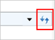

::: {style="DISPLAY: none"}
{#d2h_url_template}{#d2h_package_url style="WIDTH: 0px; DISPLAY: none; HEIGHT: 0px"}
:::

::: {.d2h_secondary_topic style="PADDING-BOTTOM: 10pt; MARGIN: 0pt; PADDING-LEFT: 0pt; PADDING-RIGHT: 0pt; PADDING-TOP: 0pt"}
#### Refresh Button {#refresh-button style="tab-stops: 0pt"}

The Refresh button enables the HierarchyNavigatorRefreshButtonClick event to initiate in the HierarchyNavigator control.

{border="0"}

 

Figure 577: Refresh button

[**[]{style="COLOR: #4f81bd; FONT-SIZE: 9pt"}**]{#_Ref262128090} 

+----------------------------------------------------------------------------------------------------------------------------------------------------------------------------------------------------------------------------------------------------------------------------------------------------------------------------------------------------------------------------------------------------------------------------------------------------------------------------+
| **[XAML]{style="FONT-FAMILY: 'Courier New'"}**[]{style="FONT-FAMILY: 'Courier New'; COLOR: blue"}                                                                                                                                                                                                                                                                                                                                                                          |
|                                                                                                                                                                                                                                                                                                                                                                                                                                                                            |
| []{style="FONT-FAMILY: 'Courier New'; COLOR: blue"}                                                                                                                                                                                                                                                                                                                                                                                                                        |
|                                                                                                                                                                                                                                                                                                                                                                                                                                                                            |
| [\<]{style="FONT-FAMILY: 'Courier New'; COLOR: blue"}[locals]{style="FONT-FAMILY: 'Courier New'; COLOR: #a31515"}[:]{style="FONT-FAMILY: 'Courier New'; COLOR: blue"}[HierarchyNavigator]{style="FONT-FAMILY: 'Courier New'; COLOR: #a31515"}[ HierarchyNavigatorRefreshButtonClick]{style="FONT-FAMILY: 'Courier New'; COLOR: red"}[=\"HierarchyNavigatorRefreshButtonClick\" /\>]{style="FONT-FAMILY: 'Courier New'; COLOR: blue"}[]{style="FONT-FAMILY: 'Courier New'"} |
+----------------------------------------------------------------------------------------------------------------------------------------------------------------------------------------------------------------------------------------------------------------------------------------------------------------------------------------------------------------------------------------------------------------------------------------------------------------------------+

**[]{style="FONT-FAMILY: 'Cambria','serif'; COLOR: #4f81bd"}** 

+----------------------------------------------------------------------------------------------------------------------------------------------------------------------------------------------------------+
| **[C#]{style="FONT-FAMILY: 'Courier New'"}**[]{style="FONT-FAMILY: 'Courier New'; COLOR: #2b91af"}                                                                                                       |
|                                                                                                                                                                                                          |
| []{style="FONT-FAMILY: 'Courier New'; COLOR: #2b91af"}                                                                                                                                                   |
|                                                                                                                                                                                                          |
| [HierarchyNavigator]{style="FONT-FAMILY: 'Courier New'; COLOR: #2b91af"}[ hierarchyNavigator = [new]{style="COLOR: blue"} [HierarchyNavigator]{style="COLOR: #2b91af"}();\                               |
| hierarchyNavigator.HierarchyNavigatorRefreshButtonClick += [new]{style="COLOR: blue"} [EventHandler]{style="COLOR: #2b91af"}(HierarchyNavigatorRefreshButtonClick);]{style="FONT-FAMILY: 'Courier New'"} |
+----------------------------------------------------------------------------------------------------------------------------------------------------------------------------------------------------------+

**[]{style="FONT-FAMILY: 'Cambria','serif'; COLOR: #4f81bd"}** 

+------------------------------------------------------------------------------------------------------------------------------------------------------------------------------------------------------------+
| **[C#]{style="FONT-FAMILY: 'Courier New'"}**[]{style="FONT-FAMILY: 'Courier New'; COLOR: blue"}                                                                                                            |
|                                                                                                                                                                                                            |
| []{style="FONT-FAMILY: 'Courier New'; COLOR: blue"}                                                                                                                                                        |
|                                                                                                                                                                                                            |
| [private]{style="FONT-FAMILY: 'Courier New'; COLOR: blue"}[ [void]{style="COLOR: blue"} HierarchyNavigatorRefreshButtonClick([object]{style="COLOR: blue"} sender, [EventArgs]{style="COLOR: #2b91af"} e)\ |
| {\                                                                                                                                                                                                         |
| [     //Occurs when Refresh Button Click]{style="COLOR: green"}\                                                                                                                                           |
| }]{style="FONT-FAMILY: 'Courier New'"}                                                                                                                                                                     |
+------------------------------------------------------------------------------------------------------------------------------------------------------------------------------------------------------------+

[]{#related-topics}
:::
