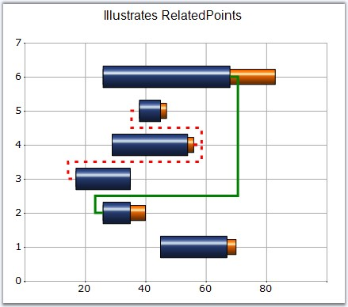

::: {style="DISPLAY: none"}
{#d2h_url_template}{#d2h_package_url style="WIDTH: 0px; DISPLAY: none; HEIGHT: 0px"}
:::

:::: {.d2h_secondary_topic style="PADDING-BOTTOM: 10pt; MARGIN: 0pt; PADDING-LEFT: 0pt; PADDING-RIGHT: 0pt; PADDING-TOP: 0pt"}
#### RelatedPoints {#relatedpoints style="tab-stops: 0pt"}

**[]{style="FONT-FAMILY: 'Trebuchet MS','sans-serif'; FONT-SIZE: 9pt"}** 

Lets you specify the relationship between two points in the Gantt chart type. This will render a line connecting the specified points.

[]{style="FONT-FAMILY: 'Trebuchet MS','sans-serif'; FONT-SIZE: 9pt"} 

::: {align="center"}
+---------------------------------------+-------------------------------------------------------------------------+
| **[]{style="FONT-FAMILY: 'Trebuchet MS','sans-serif'; FONT-SIZE: 9pt"}**                                        |
|                                                                                                                 |
| Details                                                                                                         |
+---------------------------------------+-------------------------------------------------------------------------+
| Possible Values                       | A ChartRelatedPointInfo object, which has the following properties:     |
|                                       |                                                                         |
|                                       | Color - Any Color Object                                                |
|                                       |                                                                         |
|                                       | Alignment - Any PenAlignment Property                                   |
|                                       |                                                                         |
|                                       | Points - Integer Array containing the points which are to be connected. |
|                                       |                                                                         |
|                                       | Count - Specifies the Number of points                                  |
|                                       |                                                                         |
|                                       | DashStyle - Any System.Drawing.Drawing2D.DashStyle                      |
|                                       |                                                                         |
|                                       | DashPattern - A Float array with two values                             |
|                                       |                                                                         |
|                                       | Width - Any Float value                                                 |
+---------------------------------------+-------------------------------------------------------------------------+
| Default Value                         | Color - Control Text Color                                              |
|                                       |                                                                         |
|                                       | Alignment - Center                                                      |
|                                       |                                                                         |
|                                       | Points - Null                                                           |
|                                       |                                                                         |
|                                       | Count - 0                                                               |
|                                       |                                                                         |
|                                       | DashStyle - Solid                                                       |
|                                       |                                                                         |
|                                       | DashPattern - Null                                                      |
|                                       |                                                                         |
|                                       | Width - 5.0f                                                            |
+---------------------------------------+-------------------------------------------------------------------------+
| 2D / 3D Limitations                   | No                                                                      |
+---------------------------------------+-------------------------------------------------------------------------+
| Applies to Chart Element              | Any Series and Points                                                   |
+---------------------------------------+-------------------------------------------------------------------------+
| Applies to Chart Types                | Gantt Chart                                                             |
+---------------------------------------+-------------------------------------------------------------------------+
:::

**[]{style="FONT-FAMILY: 'Trebuchet MS','sans-serif'; FONT-SIZE: 9pt"}** 

Here is sample code snippet using RelatedPoints.

[]{style="FONT-FAMILY: 'Trebuchet MS','sans-serif'; FONT-SIZE: 9pt"} 

+---------------------------------------------------------------------------------------------------------------------------------------------------------------------------------------------------------------------------------------+
| **[\[C#\]]{style="FONT-FAMILY: 'Courier New'; COLOR: black"}**                                                                                                                                                                        |
|                                                                                                                                                                                                                                       |
| **[]{style="FONT-FAMILY: 'Courier New'; COLOR: black"}**                                                                                                                                                                              |
|                                                                                                                                                                                                                                       |
| [// Related Points for first series]{style="FONT-FAMILY: 'Courier New'; COLOR: green"}                                                                                                                                                |
|                                                                                                                                                                                                                                       |
| [int]{style="FONT-FAMILY: 'Courier New'; COLOR: blue"}[\[\] ptIndices = [new]{style="COLOR: blue"} [int]{style="COLOR: blue"}\[\] {2,4}; ]{style="FONT-FAMILY: 'Courier New'"}                                                        |
|                                                                                                                                                                                                                                       |
| [this]{style="FONT-FAMILY: 'Courier New'; COLOR: blue"}[.ChartWebControl1.Series\[0\].Styles\[3\].RelatedPoints.Points = ptIndices;]{style="FONT-FAMILY: 'Courier New'"}                                                              |
|                                                                                                                                                                                                                                       |
| [this]{style="FONT-FAMILY: 'Courier New'; COLOR: blue"}[.ChartWebControl1.Series\[0\].Styles\[3\].RelatedPoints.Color = [Color]{style="COLOR: teal"}.Red;]{style="FONT-FAMILY: 'Courier New'"}                                        |
|                                                                                                                                                                                                                                       |
| [this]{style="FONT-FAMILY: 'Courier New'; COLOR: blue"}[.ChartWebControl1.Series\[0\].Styles\[3\].RelatedPoints.Alignment = System.Drawing.Drawing2D.[PenAlignment]{style="COLOR: teal"}.Right;]{style="FONT-FAMILY: 'Courier New'"}  |
|                                                                                                                                                                                                                                       |
| [this]{style="FONT-FAMILY: 'Courier New'; COLOR: blue"}[.ChartWebControl1.Series\[0\].Styles\[3\].RelatedPoints.DashStyle = System.Drawing.Drawing2D.[DashStyle]{style="COLOR: teal"}.Custom;]{style="FONT-FAMILY: 'Courier New'"}    |
|                                                                                                                                                                                                                                       |
| [this]{style="FONT-FAMILY: 'Courier New'; COLOR: blue"}[.ChartWebControl1.Series\[0\].Styles\[3\].RelatedPoints.Width = 3f;]{style="FONT-FAMILY: 'Courier New'"}                                                                      |
|                                                                                                                                                                                                                                       |
| [float]{style="FONT-FAMILY: 'Courier New'; COLOR: blue"}[\[\] dash = [new]{style="COLOR: blue"} [float]{style="COLOR: blue"}\[\] { 1.5f, 2.4f };]{style="FONT-FAMILY: 'Courier New'"}                                                 |
|                                                                                                                                                                                                                                       |
| [this]{style="FONT-FAMILY: 'Courier New'; COLOR: blue"}[.ChartWebControl1.Series\[0\].Styles\[3\].RelatedPoints.DashPattern = dash;]{style="FONT-FAMILY: 'Courier New'"}                                                              |
|                                                                                                                                                                                                                                       |
| []{style="FONT-FAMILY: 'Courier New'"}                                                                                                                                                                                                |
|                                                                                                                                                                                                                                       |
| [// Related Points for second series]{style="FONT-FAMILY: 'Courier New'; COLOR: green"}                                                                                                                                               |
|                                                                                                                                                                                                                                       |
| [int]{style="FONT-FAMILY: 'Courier New'; COLOR: blue"}[\[\] ptIndices = [new]{style="COLOR: blue"} [int]{style="COLOR: blue"}\[\] { 1 };]{style="FONT-FAMILY: 'Courier New'"}                                                         |
|                                                                                                                                                                                                                                       |
| [this]{style="FONT-FAMILY: 'Courier New'; COLOR: blue"}[.ChartWebControl1.Series\[1\].Styles\[5\].RelatedPoints.Points = ptIndices;]{style="FONT-FAMILY: 'Courier New'"}                                                              |
|                                                                                                                                                                                                                                       |
| [this]{style="FONT-FAMILY: 'Courier New'; COLOR: blue"}[.ChartWebControl1.Series\[1\].Styles\[5\].RelatedPoints.Color = [Color]{style="COLOR: teal"}.Green;]{style="FONT-FAMILY: 'Courier New'"}                                      |
|                                                                                                                                                                                                                                       |
| [this]{style="FONT-FAMILY: 'Courier New'; COLOR: blue"}[.ChartWebControl1.Series\[1\].Styles\[5\].RelatedPoints.Alignment = System.Drawing.Drawing2D.[PenAlignment]{style="COLOR: teal"}.Center;]{style="FONT-FAMILY: 'Courier New'"} |
|                                                                                                                                                                                                                                       |
| [this]{style="FONT-FAMILY: 'Courier New'; COLOR: blue"}[.ChartWebControl1.Series\[1\].Styles\[5\].RelatedPoints.DashStyle = System.Drawing.Drawing2D.[DashStyle]{style="COLOR: teal"}.Solid;]{style="FONT-FAMILY: 'Courier New'"}     |
|                                                                                                                                                                                                                                       |
| [this]{style="FONT-FAMILY: 'Courier New'; COLOR: blue"}[.ChartWebControl1.Series\[1\].Styles\[5\].RelatedPoints.Width = 3f;]{style="FONT-FAMILY: 'Courier New'"}                                                                      |
+---------------------------------------------------------------------------------------------------------------------------------------------------------------------------------------------------------------------------------------+

[]{style="FONT-FAMILY: 'Trebuchet MS','sans-serif'; FONT-SIZE: 9pt"} 

+--------------------------------------------------------------------------------------------------------------------------------------------------------------------------------------------------------------------------------------------------------------------------------------------------------------------------------------------------------------------------------------------------------------------------------------------------------------------------------+
| **[\[VB.NET\]]{style="FONT-FAMILY: 'Courier New'; COLOR: black"}**                                                                                                                                                                                                                                                                                                                                                                                                             |
|                                                                                                                                                                                                                                                                                                                                                                                                                                                                                |
| **[]{style="FONT-FAMILY: 'Courier New'; COLOR: black"}**                                                                                                                                                                                                                                                                                                                                                                                                                       |
|                                                                                                                                                                                                                                                                                                                                                                                                                                                                                |
| [\' Related Points for first series]{style="FONT-FAMILY: 'Courier New'; COLOR: green"}                                                                                                                                                                                                                                                                                                                                                                                         |
|                                                                                                                                                                                                                                                                                                                                                                                                                                                                                |
| [Dim]{style="FONT-FAMILY: 'Courier New'; COLOR: blue"}[ ]{style="FONT-FAMILY: 'Courier New'; COLOR: black"}[ptIndices[ ]{style="COLOR: black"}[As]{style="COLOR: blue"}[ ]{style="COLOR: black"}[Integer]{style="COLOR: blue"}[() =]{style="COLOR: black"}[ New Integer]{style="COLOR: blue"}[() {2,4}]{style="COLOR: black"}]{style="FONT-FAMILY: 'Courier New'"}                                                                                                             |
|                                                                                                                                                                                                                                                                                                                                                                                                                                                                                |
| [Me]{style="FONT-FAMILY: 'Courier New'; COLOR: blue"}[.ChartWebControl1.Series(0).Styles(3).RelatedPoints.Points = ]{style="FONT-FAMILY: 'Courier New'; COLOR: black"}[ptIndices]{style="FONT-FAMILY: 'Courier New'"}                                                                                                                                                                                                                                                          |
|                                                                                                                                                                                                                                                                                                                                                                                                                                                                                |
| [Me]{style="FONT-FAMILY: 'Courier New'; COLOR: blue"}[.ChartWebControl1.Series(0).Styles(3).RelatedPoints.Color = ]{style="FONT-FAMILY: 'Courier New'; COLOR: black"}[Color]{style="FONT-FAMILY: 'Courier New'; COLOR: teal"}[.Red]{style="FONT-FAMILY: 'Courier New'; COLOR: black"}                                                                                                                                                                                          |
|                                                                                                                                                                                                                                                                                                                                                                                                                                                                                |
| [Me]{style="FONT-FAMILY: 'Courier New'; COLOR: blue"}[.ChartWebControl1.Series(0).Styles(3).RelatedPoints.Alignment = System.Drawing.Drawing2D.]{style="FONT-FAMILY: 'Courier New'; COLOR: black"}[PenAlignment]{style="FONT-FAMILY: 'Courier New'; COLOR: teal"}[.Right]{style="FONT-FAMILY: 'Courier New'; COLOR: black"}                                                                                                                                                    |
|                                                                                                                                                                                                                                                                                                                                                                                                                                                                                |
| [Me]{style="FONT-FAMILY: 'Courier New'; COLOR: blue"}[.ChartWebControl1.Series(0).Styles(3).RelatedPoints.DashStyle = System.Drawing.Drawing2D.]{style="FONT-FAMILY: 'Courier New'; COLOR: black"}[DashStyle]{style="FONT-FAMILY: 'Courier New'; COLOR: teal"}[.Custom]{style="FONT-FAMILY: 'Courier New'; COLOR: black"}                                                                                                                                                      |
|                                                                                                                                                                                                                                                                                                                                                                                                                                                                                |
| [Me]{style="FONT-FAMILY: 'Courier New'; COLOR: blue"}[.ChartWebControl1.Series(0).Styles(3).RelatedPoints.Width = 3f]{style="FONT-FAMILY: 'Courier New'; COLOR: black"}                                                                                                                                                                                                                                                                                                        |
|                                                                                                                                                                                                                                                                                                                                                                                                                                                                                |
| [Dim]{style="FONT-FAMILY: 'Courier New'; COLOR: blue"}[ dash ]{style="FONT-FAMILY: 'Courier New'; COLOR: black"}[As]{style="FONT-FAMILY: 'Courier New'; COLOR: blue"}[ ]{style="FONT-FAMILY: 'Courier New'; COLOR: black"}[Single]{style="FONT-FAMILY: 'Courier New'; COLOR: blue"}[() = ]{style="FONT-FAMILY: 'Courier New'; COLOR: black"}[New Single]{style="FONT-FAMILY: 'Courier New'; COLOR: blue"}[() { 1.5f, 2.4f }]{style="FONT-FAMILY: 'Courier New'; COLOR: black"} |
|                                                                                                                                                                                                                                                                                                                                                                                                                                                                                |
| [Me]{style="FONT-FAMILY: 'Courier New'; COLOR: blue"}[.ChartWebControl1.Series(0).Styles(3).RelatedPoints.DashPattern = dash]{style="FONT-FAMILY: 'Courier New'; COLOR: black"}                                                                                                                                                                                                                                                                                                |
|                                                                                                                                                                                                                                                                                                                                                                                                                                                                                |
| [\' Related Points for second series]{style="FONT-FAMILY: 'Courier New'; COLOR: green"}                                                                                                                                                                                                                                                                                                                                                                                        |
|                                                                                                                                                                                                                                                                                                                                                                                                                                                                                |
| [Dim]{style="FONT-FAMILY: 'Courier New'; COLOR: blue"}[ ]{style="FONT-FAMILY: 'Courier New'; COLOR: black"}[ptIndices[ ]{style="COLOR: black"}[As Integer]{style="COLOR: blue"}[() = ]{style="COLOR: black"}[New Integer]{style="COLOR: blue"}[() { 1 }]{style="COLOR: black"}]{style="FONT-FAMILY: 'Courier New'"}                                                                                                                                                            |
|                                                                                                                                                                                                                                                                                                                                                                                                                                                                                |
| [Me]{style="FONT-FAMILY: 'Courier New'; COLOR: blue"}[.ChartWebControl1.Series(1).Styles(5).RelatedPoints.Points = ]{style="FONT-FAMILY: 'Courier New'; COLOR: black"}[ptIndices]{style="FONT-FAMILY: 'Courier New'"}                                                                                                                                                                                                                                                          |
|                                                                                                                                                                                                                                                                                                                                                                                                                                                                                |
| [Me]{style="FONT-FAMILY: 'Courier New'; COLOR: blue"}[.ChartWebControl1.Series(1).Styles(5).RelatedPoints.Color =]{style="FONT-FAMILY: 'Courier New'; COLOR: black"}[ ]{style="FONT-FAMILY: 'Courier New'; COLOR: olive"}[Color]{style="FONT-FAMILY: 'Courier New'; COLOR: teal"}[.Green]{style="FONT-FAMILY: 'Courier New'; COLOR: black"}                                                                                                                                    |
|                                                                                                                                                                                                                                                                                                                                                                                                                                                                                |
| [Me]{style="FONT-FAMILY: 'Courier New'; COLOR: blue"}[.ChartWebControl1.Series(1).Styles(5).RelatedPoints.Alignment = System.Drawing.Drawing2D.]{style="FONT-FAMILY: 'Courier New'; COLOR: black"}[PenAlignment]{style="FONT-FAMILY: 'Courier New'; COLOR: teal"}[.Center]{style="FONT-FAMILY: 'Courier New'; COLOR: black"}                                                                                                                                                   |
|                                                                                                                                                                                                                                                                                                                                                                                                                                                                                |
| [Me]{style="FONT-FAMILY: 'Courier New'; COLOR: blue"}[.ChartWebControl1.Series(1).Styles(5).RelatedPoints.DashStyle = System.Drawing.Drawing2D.]{style="FONT-FAMILY: 'Courier New'; COLOR: black"}[DashStyle]{style="FONT-FAMILY: 'Courier New'; COLOR: teal"}[.Solid]{style="FONT-FAMILY: 'Courier New'; COLOR: black"}                                                                                                                                                       |
|                                                                                                                                                                                                                                                                                                                                                                                                                                                                                |
| [Me]{style="FONT-FAMILY: 'Courier New'; COLOR: blue"}[.ChartWebControl1.Series(1).Styles(5).RelatedPoints.Width = 3f]{style="FONT-FAMILY: 'Courier New'; COLOR: black"}                                                                                                                                                                                                                                                                                                        |
+--------------------------------------------------------------------------------------------------------------------------------------------------------------------------------------------------------------------------------------------------------------------------------------------------------------------------------------------------------------------------------------------------------------------------------------------------------------------------------+

                                                                                                                                                                                   {border="0"}

**[]{style="FONT-FAMILY: 'Trebuchet MS','sans-serif'; FONT-SIZE: 9pt"}** 

Figure 178: Gantt Chart with RelatedPoints specified for certain Data Points

[]{style="FONT-FAMILY: 'Trebuchet MS','sans-serif'; FONT-SIZE: 9pt"} 

See Also

[]{style="FONT-FAMILY: 'Trebuchet MS','sans-serif'; FONT-SIZE: 9pt"} 

[Gantt Chart]{.UGHyperlink}[]{.UGHyperlink}

[]{#p139} 

[]{#related-topics}
::::
