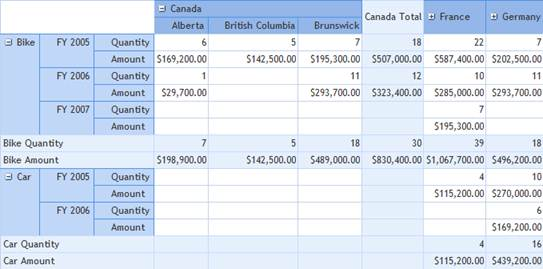
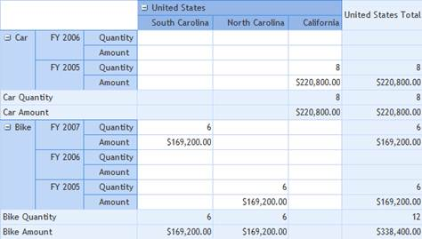
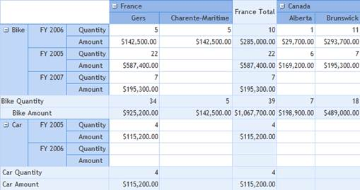

::: {style="DISPLAY: none"}
{#d2h_url_template}{#d2h_package_url style="WIDTH: 0px; DISPLAY: none; HEIGHT: 0px"}
:::

::::: {#nsbanner .d2h_main_nsbanner style="BORDER-BOTTOM: #999999 1px solid; POSITION: relative; PADDING-BOTTOM: 0px; BACKGROUND-COLOR: transparent; PADDING-LEFT: 0px; PADDING-RIGHT: 0px; DISPLAY: none; BORDER-TOP: #999999 1px solid; PADDING-TOP: 0px; LEFT: 0px"}
:::: {#TitleRow .d2h_main_titlerow style="PADDING-BOTTOM: 4px; BACKGROUND-COLOR: transparent; PADDING-LEFT: 22px; WIDTH: 100%; PADDING-RIGHT: 10px; DISPLAY: none; PADDING-TOP: 4px"}
::: {#ienav .d2h_main_ienav style="DISPLAY: none"}
{#D2HPrevious .D2HPreviousEnabled}  {#D2HNext .D2HNextEnabled}
:::
::::
:::::

:::: {#nstext .d2h_main_nstext style="PADDING-BOTTOM: 10px; BACKGROUND-COLOR: transparent; PADDING-LEFT: 22px; PADDING-RIGHT: 10px; HEIGHT: 100%; OVERFLOW: auto; PADDING-TOP: 5px" hasuserbackground="true" valign="bottom"}
::: {#d2h_breadcrumbs .d2h_breadcrumbs}
[Essential Studio User Guide Documentation](ms-xhelp:///?Id=12457748-09e3-4d74-a240-8e049cedf030){.d2h_breadcrumbsNormal}[ \> ]{.d2h_breadcrumbsLinkSeparator}[Business Intelligence Edition](ms-xhelp:///?Id=fdf33dd8-62b2-47b9-ad7b-fc50e590bca5){.d2h_breadcrumbsNormal}[ \> ]{.d2h_breadcrumbsLinkSeparator}[Essential BI ASP.NET](ms-xhelp:///?Id=99c6694e-59c3-4c59-abb5-ce9ce9a948bc){.d2h_breadcrumbsNormal}[ \> ]{.d2h_breadcrumbsLinkSeparator}[Essential BI Grid]{.d2h_breadcrumbsContentsOnly}[ \> ]{.d2h_breadcrumbsLinkSeparator}[Concepts and Features](ms-xhelp:///?Id=6745c49b-2e43-4f50-aaf9-6e9c42650969){.d2h_breadcrumbsNormal}
:::

## Relational Data Sorting {#relational-data-sorting style="tab-stops: 0pt"}

The relational data that are displayed in OLAP controls allow the user to set and view the column and row header in any one of the following formats:

[·      ]{style="FONT-FAMILY: Symbol"}Ascending (the default value)

[·      ]{style="FONT-FAMILY: Symbol"}Descending

[·      ]{style="FONT-FAMILY: Symbol"}Unspecified

 

The following code snippet illustrates setting the sort type for relational data:

+----------------------------------------------------------------------------------------------------------------------------------------------------------------------------------------------------------------------------------------------------------------------------------------------------------------+
| +------------------------------------------------------------------------------------------------------------------------------------------------------------------------------------------------------------------------------------------------------------------------------------------------------------+ |
| | **[\[C#\]]{style="FONT-FAMILY: 'Courier New'"}**                                                                                                                                                                                                                                                           | |
| |                                                                                                                                                                                                                                                                                                            | |
| | [this]{style="FONT-FAMILY: 'Courier New'; COLOR: blue"}[.olapGridControl1.OlapDataManager.RelationalDataSortOrder = ]{style="FONT-FAMILY: 'Courier New'"}[SortType]{style="LINE-HEIGHT: 115%; FONT-FAMILY: Consolas; COLOR: #2b91af; FONT-SIZE: 9.5pt"}[.UnSpecified;]{style="FONT-FAMILY: 'Courier New'"} | |
| +------------------------------------------------------------------------------------------------------------------------------------------------------------------------------------------------------------------------------------------------------------------------------------------------------------+ |
|                                                                                                                                                                                                                                                                                                                |
|                                                                                                                                                                                                                                                                                                                |
|                                                                                                                                                                                                                                                                                                                |
| +---------------------------------------------------------------------------------------------------------------------------------------------------------------------------------------------------------------------------------------------------------------------------------------------------------+    |
| | **[\[VB\]]{style="FONT-FAMILY: 'Courier New'"}**                                                                                                                                                                                                                                                        |    |
| |                                                                                                                                                                                                                                                                                                         |    |
| | [Me]{style="FONT-FAMILY: 'Courier New'; COLOR: blue"}[.olapGridControl1.OlapDataManager.RelationalDataSortOrder = ]{style="FONT-FAMILY: 'Courier New'"}[SortType]{style="LINE-HEIGHT: 115%; FONT-FAMILY: Consolas; COLOR: #2b91af; FONT-SIZE: 9.5pt"}[.UnSpecified]{style="FONT-FAMILY: 'Courier New'"} |    |
| +---------------------------------------------------------------------------------------------------------------------------------------------------------------------------------------------------------------------------------------------------------------------------------------------------------+    |
|                                                                                                                                                                                                                                                                                                                |
|                                                                                                                                                                                                                                                                                                                |
|                                                                                                                                                                                                                                                                                                                |
| {border="0"}                                                                                                                                                                                                                                                                      |
|                                                                                                                                                                                                                                                                                                                |
| Figure 35: Relational Data in Ascending Order                                                                                                                                                                                                                                                                  |
|                                                                                                                                                                                                                                                                                                                |
|                                                                                                                                                                                                                                                                                                                |
|                                                                                                                                                                                                                                                                                                                |
| {border="0"}                                                                                                                                                                                                                                                                      |
|                                                                                                                                                                                                                                                                                                                |
| Figure 36: Relational Data in Descending Order                                                                                                                                                                                                                                                                 |
|                                                                                                                                                                                                                                                                                                                |
|                                                                                                                                                                                                                                                                                                                |
|                                                                                                                                                                                                                                                                                                                |
| {border="0"}                                                                                                                                                                                                                                                                      |
|                                                                                                                                                                                                                                                                                                                |
| Figure 37: Relational Data in Unspecified Order                                                                                                                                                                                                                                                                |
|                                                                                                                                                                                                                                                                                                                |
| ****                                                                                                                                                                                                                                                                                                           |
|                                                                                                                                                                                                                                                                                                                |
| Tables for Property                                                                                                                                                                                                                                                                                            |
|                                                                                                                                                                                                                                                                                                                |
|                                                                                                                                                                                                                                                                                                                |
|                                                                                                                                                                                                                                                                                                                |
| Table 207: Property Table                                                                                                                                                                                                                                                                                      |
|                                                                                                                                                                                                                                                                                                                |
|   ------------------------------------------------- ----------------------------------------------------------------------------------------------------------------------------------------------------- ------------------------------------- -----------------------------------------                      |
|   **Property**                                      **Description**                                                                                                                                       **Type**                              **Data Type**                                                  |
|   [RelationalDataSortOrder]{style="COLOR: black"}   [Allows the column and row header order of relational data in the OLAP control to be set in  an arranged or unarranged order]{style="COLOR: black"}   [Server side]{style="COLOR: black"}   [Enum (SortType)]{style="COLOR: black"}                        |
|   ------------------------------------------------- ----------------------------------------------------------------------------------------------------------------------------------------------------- ------------------------------------- -----------------------------------------                      |
|                                                                                                                                                                                                                                                                                                                |
|                                                                                                                                                                                                                                                                                                                |
|                                                                                                                                                                                                                                                                                                                |
| Sample Link                                                                                                                                                                                                                                                                                                    |
|                                                                                                                                                                                                                                                                                                                |
| A demo of this feature is available in the following location:                                                                                                                                                                                                                                                 |
|                                                                                                                                                                                                                                                                                                                |
| **C:\\Users\\\<UserName\>\\AppData\\Local\\Syncfusion\\EssentialStudio\\x.x.x.x\\ BI\\Web\\OlapGrid.Web\\Samples\\3.5\\Relational DataBinding\\DataTable Support Demo**                                                                                                                                        |
+----------------------------------------------------------------------------------------------------------------------------------------------------------------------------------------------------------------------------------------------------------------------------------------------------------------+

[]{#related-topics}
::::
