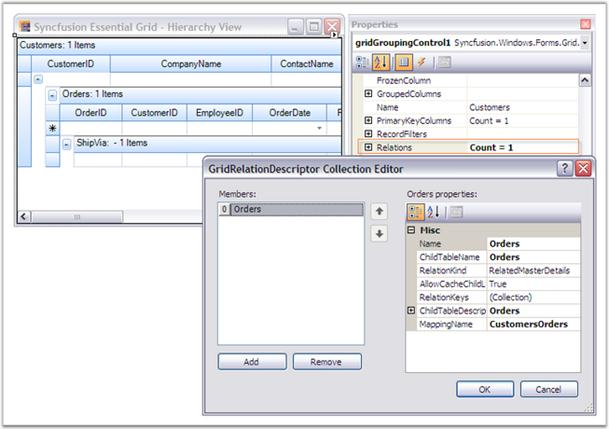
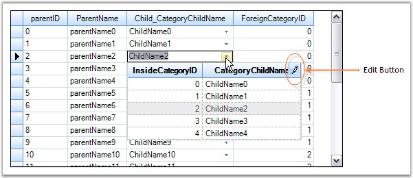
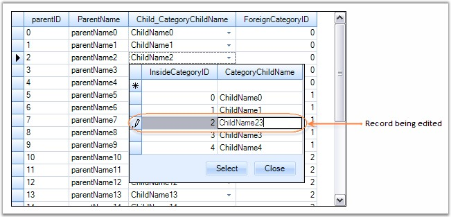
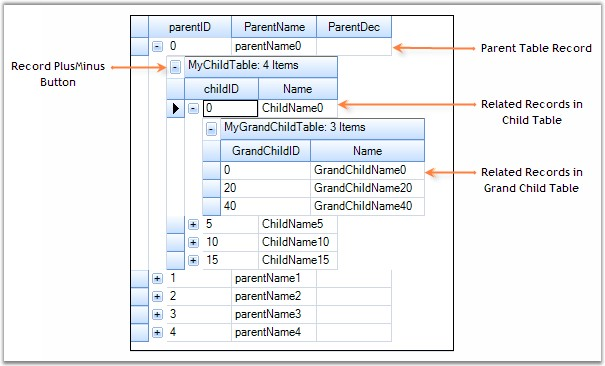
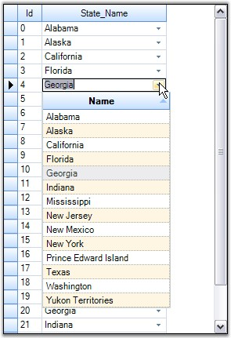
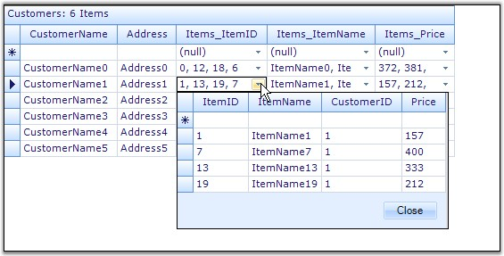
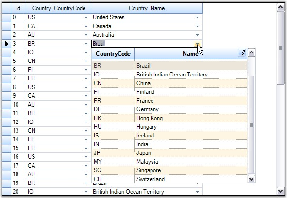
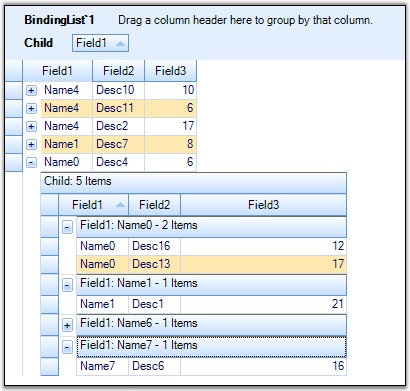

::: {style="DISPLAY: none"}
{#d2h_url_template}{#d2h_package_url style="WIDTH: 0px; DISPLAY: none; HEIGHT: 0px"}
:::

::::::::::: {.d2h_secondary_topic style="PADDING-BOTTOM: 10pt; MARGIN: 0pt; PADDING-LEFT: 0pt; PADDING-RIGHT: 0pt; PADDING-TOP: 0pt"}
##### Relations and Hierarchy {#relations-and-hierarchy style="tab-stops: 0pt"}

[]{style="FONT-FAMILY: 'Trebuchet MS','sans-serif'; COLOR: #15428b; FONT-SIZE: 9pt"} 

Grid Grouping control can display nested tables in a **hierarchy** using a master-detail configuration. In an hierarchical view, all the tables in the data source are inter-connected via relations. Generally a relation between any two tables can take any of the following forms: **1:1, 1:n, n:1** or **n:n**.

 

A grouping grid can automatically detect the data relations in a dataset for display. By default, a Relation is created for each such relation found in dataset. Hence the data relations defined in a dataset are sufficient enough for the grid to form the relations. No additional code is required in this case.

 

With nested tables, each record in the parent table will have an associated set of records in the child table. Every record in the relation is provided with a +/- button called **RecordPlusMinus** that can be expanded(as well as collapsed) to bring the underlying records in the child table into view. The number of tables that can be nested with relations using a Grid Grouping control is unlimited.

 

**Relations Collection**

 

The **TableDescriptor.Relations** collection defines relations for the table. By default a relation (**RelatedMasterDetails**) is created for each DataRelation found in a DataSet. Relations can either be related foreign key tables or nested child tables that can be expanded and collapsed. Each entry in this collection is owned by a RelationDescriptor that stores the details of a relation. All the RelationDescriptors for a given table is managed by the RelationDescriptor Collection which is returned by the TableDescriptor.Relations property.

 

The **TableDescriptor.RelationChildColumns** collection is internally initialized and contains the child key fields of the RelationDescriptor.RelationKeys collection of a RelationKind.RelatedMasterDetails relation. You should not modify this collection.

[]{style="FONT-FAMILY: 'Trebuchet MS','sans-serif'; COLOR: #15428b; FONT-SIZE: 9pt"} 

The **TableDescriptor.PrimaryKeyColumns** collection defines fields that form a unique primary key for the table. By default, the PrimaryKeyColumns collection is initialized from the child key fields of the RelationDescriptor.RelationKeys collection of a RelationKind.ForeignKeyReference relation. If the table is not a foreign table and a UniqueConstraint for a DataTable is present the collection is initialized with fields from that UniqueConstraint. Users can also manually modify the collection. If the table is the foreign table of a RelationKind.ForeignKeyReference relation, the parent table uses the fields that are defined in the PrimaryKeyColumns collection to lookup and identify records in the foreign table.

 

**Setting Up Relations Through Designer**

**[]{style="FONT-FAMILY: 'Verdana','sans-serif'; COLOR: #4a5c8c; FONT-SIZE: 8pt"}** 

After binding an hierarchical dataset to the grouping grid, you could find the TableDescriptor.Relations collection populated with values. These values represent the relationship between the parent and child tables.

[]{style="FONT-FAMILY: 'Trebuchet MS','sans-serif'; COLOR: #15428b; FONT-SIZE: 9pt"} 

{border="0"}

[]{style="FONT-FAMILY: 'Trebuchet MS','sans-serif'; COLOR: #15428b; FONT-SIZE: 9pt"} 

*[Figure ]{style="FONT-SIZE: 9pt"}[308]{style="FONT-SIZE: 9pt"}[: Setting Up Relations by using the GridRelationDescriptor Collection Editor]{style="FONT-SIZE: 9pt"}*

[]{style="FONT-FAMILY: 'Trebuchet MS','sans-serif'; COLOR: #15428b; FONT-SIZE: 9pt"} 

[]{style="FONT-FAMILY: 'Trebuchet MS','sans-serif'; COLOR: #15428b; FONT-SIZE: 9pt"} 

[]{style="FONT-FAMILY: 'Trebuchet MS','sans-serif'; COLOR: #15428b; FONT-SIZE: 9pt"} 

Properties

[]{style="FONT-FAMILY: 'Verdana','sans-serif'; FONT-SIZE: 8pt"} 

[Here is a brief description on the properties used to setup a relation.]{style="FONT-SIZE: 9pt"}

[]{style="FONT-FAMILY: 'Trebuchet MS','sans-serif'; COLOR: #15428b; FONT-SIZE: 9pt"} 

::: {align="center"}
+-----------------------------------+----------------------------------------------------------------------------------------------------------------+
| GridRelationDescriptor Property   | Description                                                                                                    |
+-----------------------------------+----------------------------------------------------------------------------------------------------------------+
| Name                              | Specifies the relation name.                                                                                   |
+-----------------------------------+----------------------------------------------------------------------------------------------------------------+
| ChildTableName                    | Specifies the name of the ChildTable.                                                                          |
+-----------------------------------+----------------------------------------------------------------------------------------------------------------+
| RelationKeys                      | Defines the mapping between the parent and child columns in a master-detail relation.                          |
+-----------------------------------+----------------------------------------------------------------------------------------------------------------+
| MappingName                       | Specifies the name of the PropertyDescriptor in the parent table that contains the details about the relation. |
+-----------------------------------+----------------------------------------------------------------------------------------------------------------+
| RelationKind                      | Specifies the type of the relation.                                                                            |
|                                   |                                                                                                                |
|                                   |                                                                                                                |
|                                   |                                                                                                                |
|                                   | The options included are as follows.                                                                           |
|                                   |                                                                                                                |
|                                   |                                                                                                                |
|                                   |                                                                                                                |
|                                   | [·      ]{style="FONT-FAMILY: Symbol"}RelatedMasterDetails                                                     |
|                                   |                                                                                                                |
|                                   | [·      ]{style="FONT-FAMILY: Symbol"}ForeignKeyReference                                                      |
|                                   |                                                                                                                |
|                                   | [·      ]{style="FONT-FAMILY: Symbol"}ForeignKey KeyWords                                                      |
|                                   |                                                                                                                |
|                                   | [·      ]{style="FONT-FAMILY: Symbol"}UniformChildList                                                         |
|                                   |                                                                                                                |
|                                   | [·      ]{style="FONT-FAMILY: Symbol"}ListItemReference                                                        |
+-----------------------------------+----------------------------------------------------------------------------------------------------------------+
| AllowCacheChildList               |                                                                                                                |
|                                   |                                                                                                                |
|                                   | [·      ]{style="FONT-FAMILY: Symbol"}Indicates whether the ChildList associated with a view can be cached.    |
|                                   |                                                                                                                |
|                                   | [·      ]{style="FONT-FAMILY: Symbol"}Used with UniformChildList relation.                                     |
|                                   |                                                                                                                |
|                                   |                                                                                                                |
+-----------------------------------+----------------------------------------------------------------------------------------------------------------+
| ChildTableDescriptor              | Specifies the table schema of Child Table.                                                                     |
+-----------------------------------+----------------------------------------------------------------------------------------------------------------+
:::

[]{style="FONT-FAMILY: 'Trebuchet MS','sans-serif'; COLOR: #15428b; FONT-SIZE: 9pt"} 

[]{style="FONT-FAMILY: 'Trebuchet MS','sans-serif'; COLOR: #15428b; FONT-SIZE: 9pt"} 

Different RelationKinds

 

Apart from the default Master-Detail type, Essential Grouping Grid supports a number of relations which could be enabled by specifying the relations manually in the grouping engine. In case of manual relations, the dataset does not need to have relations. This is the same approach that should be used if you want to setup relationships between independent IList collections.

[]{style="FONT-FAMILY: 'Trebuchet MS','sans-serif'; COLOR: #15428b; FONT-SIZE: 9pt"} 

Supported Relations

[]{style="FONT-FAMILY: 'Trebuchet MS','sans-serif'; COLOR: #15428b; FONT-SIZE: 9pt"} 

[[• ]{style="FONT-FAMILY: 'Arial Black','sans-serif'; COLOR: navy; FONT-SIZE: 12pt; TEXT-DECORATION: none; text-underline: none"}]{.UGHyperlink}[RelatedMasterDetails]{.UGHyperlink}[]{.UGHyperlink}

[[• ]{style="FONT-FAMILY: 'Arial Black','sans-serif'; COLOR: navy; FONT-SIZE: 12pt; TEXT-DECORATION: none; text-underline: none"}]{.UGHyperlink}[ForeignKeyReference]{.UGHyperlink}[]{.UGHyperlink}

[[• ]{style="FONT-FAMILY: 'Arial Black','sans-serif'; COLOR: navy; FONT-SIZE: 12pt; TEXT-DECORATION: none; text-underline: none"}]{.UGHyperlink}[ForeignKey KeyWords]{.UGHyperlink}[]{.UGHyperlink}

[[• ]{style="FONT-FAMILY: 'Arial Black','sans-serif'; COLOR: navy; FONT-SIZE: 12pt; TEXT-DECORATION: none; text-underline: none"}]{.UGHyperlink}[ListItemReference]{.UGHyperlink}[]{.UGHyperlink}

[[• ]{style="FONT-FAMILY: 'Arial Black','sans-serif'; COLOR: navy; FONT-SIZE: 12pt; TEXT-DECORATION: none; text-underline: none"}]{.UGHyperlink}[UniformChildList]{.UGHyperlink}[]{.UGHyperlink}

[]{style="FONT-FAMILY: 'Trebuchet MS','sans-serif'; COLOR: #15428b; FONT-SIZE: 9pt"} 

The ForeignKey DropDown

 

When a **Foreign Key** relation (a relation for looking up values into a related child table using a key) is used, the child records are displayed using a DropDownList. Using this foreign key drop down, you could be able to edit the record. Here are the screen shots of the foreign key drop down.

 

ForeignKey DropDown showing Edit Button (button with Pencil Icon) clicking which allows you to edit the list

**[]{style="FONT-FAMILY: 'Trebuchet MS','sans-serif'; COLOR: #15428b; FONT-SIZE: 9pt"}** 

{border="0"}

***[]{style="FONT-FAMILY: 'Trebuchet MS','sans-serif'; COLOR: #15428b; FONT-SIZE: 9pt"}*** 

*[Figure ]{style="FONT-SIZE: 9pt"}[309]{style="FONT-SIZE: 9pt"}[: Edit button in the ForeignKey DropDown]{style="FONT-SIZE: 9pt"}*

**[]{style="FONT-FAMILY: 'Trebuchet MS','sans-serif'; COLOR: #15428b; FONT-SIZE: 9pt"}** 

Below image shows the state after clicking the Edit button.

**[]{style="FONT-FAMILY: 'Trebuchet MS','sans-serif'; COLOR: #15428b; FONT-SIZE: 9pt"}** 

{border="0"}

***[]{style="FONT-FAMILY: 'Trebuchet MS','sans-serif'; COLOR: #15428b; FONT-SIZE: 9pt"}*** 

*[Figure ]{style="FONT-SIZE: 9pt"}[310]{style="FONT-SIZE: 9pt"}[: Editing Records by clicking the Edit Button in the ForeignKey DropDown]{style="FONT-SIZE: 9pt"}*

 

[]{#p440} 

 

###### []{#_Related_Master_Details}4.3.4.3.5.1 Related Master Details Relation {#related-master-details-relation style="tab-stops: 0pt"}

[]{style="FONT-FAMILY: 'Trebuchet MS','sans-serif'; COLOR: #15428b; FONT-SIZE: 9pt"} 

**RelatedMasterDetails** is a Master-Details relation where matching keys in columns in the parent and child tables, define a relationship between two tables. This a 1:n relation where each record in the child table can only belong to one parent record.

 

This section demonstrates how to manually specify the master-detail relations between three independent tables that have the primary key and foreign key column in common.

[]{style="FONT-FAMILY: 'Trebuchet MS','sans-serif'; COLOR: #15428b; FONT-SIZE: 9pt"} 

Steps to setup RelatedMasterDetails relation

**[]{style="COLOR: navy; FONT-SIZE: 9pt"}** 

1.   Setup three datatables that have primary and foreign key columns in common.

[]{style="FONT-SIZE: 8pt"} 

+---------------------------------------------------------------------------------------------------------------------------------------------------------------------------------------------------+
| **[\[C#\]]{style="FONT-FAMILY: 'Courier New'; COLOR: black"}**                                                                                                                                    |
|                                                                                                                                                                                                   |
| []{style="FONT-FAMILY: 'Courier New'; COLOR: black"}                                                                                                                                              |
|                                                                                                                                                                                                   |
| [private]{style="FONT-FAMILY: 'Courier New'; COLOR: blue"}[ [int]{style="COLOR: blue"} numberParentRows = 5;]{style="FONT-FAMILY: 'Courier New'"}                                                 |
|                                                                                                                                                                                                   |
| [private]{style="FONT-FAMILY: 'Courier New'; COLOR: blue"}[ [int]{style="COLOR: blue"} numberChildRows = 20;]{style="FONT-FAMILY: 'Courier New'"}                                                 |
|                                                                                                                                                                                                   |
| [private]{style="FONT-FAMILY: 'Courier New'; COLOR: blue"}[ [int]{style="COLOR: blue"} numberGrandChildRows = 50;]{style="FONT-FAMILY: 'Courier New'"}                                            |
|                                                                                                                                                                                                   |
| []{style="FONT-FAMILY: 'Courier New'"}                                                                                                                                                            |
|                                                                                                                                                                                                   |
| [// Create Parent Table.]{style="FONT-FAMILY: 'Courier New'; COLOR: green"}                                                                                                                       |
|                                                                                                                                                                                                   |
| [private]{style="FONT-FAMILY: 'Courier New'; COLOR: blue"}[ [DataTable]{style="COLOR: #2b91af"} GetParentTable()]{style="FONT-FAMILY: 'Courier New'"}                                             |
|                                                                                                                                                                                                   |
| [{]{style="FONT-FAMILY: 'Courier New'"}                                                                                                                                                           |
|                                                                                                                                                                                                   |
| [    [DataTable]{style="COLOR: #2b91af"} dt = [new]{style="COLOR: blue"} [DataTable]{style="COLOR: #2b91af"}([\"ParentTable\"]{style="COLOR: #a31515"});]{style="FONT-FAMILY: 'Courier New'"}     |
|                                                                                                                                                                                                   |
| []{style="FONT-FAMILY: 'Courier New'"}                                                                                                                                                            |
|                                                                                                                                                                                                   |
| [    dt.Columns.Add([new]{style="COLOR: blue"} [DataColumn]{style="COLOR: #2b91af"}([\"parentID\"]{style="COLOR: #a31515"}));]{style="FONT-FAMILY: 'Courier New'"}                                |
|                                                                                                                                                                                                   |
| [    dt.Columns.Add([new]{style="COLOR: blue"} [DataColumn]{style="COLOR: #2b91af"}([\"ParentName\"]{style="COLOR: #a31515"}));]{style="FONT-FAMILY: 'Courier New'"}                              |
|                                                                                                                                                                                                   |
| [    dt.Columns.Add([new]{style="COLOR: blue"} [DataColumn]{style="COLOR: #2b91af"}([\"ParentDec\"]{style="COLOR: #a31515"}));]{style="FONT-FAMILY: 'Courier New'"}                               |
|                                                                                                                                                                                                   |
| []{style="FONT-FAMILY: 'Courier New'"}                                                                                                                                                            |
|                                                                                                                                                                                                   |
| [    [for]{style="COLOR: blue"}([int]{style="COLOR: blue"} i = 0; i \< numberParentRows; i++)]{style="FONT-FAMILY: 'Courier New'"}                                                                |
|                                                                                                                                                                                                   |
| [    {]{style="FONT-FAMILY: 'Courier New'"}                                                                                                                                                       |
|                                                                                                                                                                                                   |
| [        [DataRow]{style="COLOR: #2b91af"} dr = dt.NewRow();]{style="FONT-FAMILY: 'Courier New'"}                                                                                                 |
|                                                                                                                                                                                                   |
| []{style="FONT-FAMILY: 'Courier New'"}                                                                                                                                                            |
|                                                                                                                                                                                                   |
| [        dr\[0\] = i;]{style="FONT-FAMILY: 'Courier New'"}                                                                                                                                        |
|                                                                                                                                                                                                   |
| [        dr\[1\] = [string]{style="COLOR: blue"}.Format([\"parentName{0}\"]{style="COLOR: #a31515"}, i);]{style="FONT-FAMILY: 'Courier New'"}                                                     |
|                                                                                                                                                                                                   |
| [        dr\[1\] = [string]{style="COLOR: blue"}.Format([\"parentName{0}\"]{style="COLOR: #a31515"}, i);]{style="FONT-FAMILY: 'Courier New'"}                                                     |
|                                                                                                                                                                                                   |
| [        dt.Rows.Add(dr);]{style="FONT-FAMILY: 'Courier New'"}                                                                                                                                    |
|                                                                                                                                                                                                   |
| [    }]{style="FONT-FAMILY: 'Courier New'"}                                                                                                                                                       |
|                                                                                                                                                                                                   |
| [    [return]{style="COLOR: blue"} dt;]{style="FONT-FAMILY: 'Courier New'"}                                                                                                                       |
|                                                                                                                                                                                                   |
| [}]{style="FONT-FAMILY: 'Courier New'"}                                                                                                                                                           |
|                                                                                                                                                                                                   |
| []{style="FONT-FAMILY: 'Courier New'"}                                                                                                                                                            |
|                                                                                                                                                                                                   |
| [// Create Child Table.]{style="FONT-FAMILY: 'Courier New'; COLOR: green"}                                                                                                                        |
|                                                                                                                                                                                                   |
| [private]{style="FONT-FAMILY: 'Courier New'; COLOR: blue"}[ [DataTable]{style="COLOR: #2b91af"} GetChildTable()]{style="FONT-FAMILY: 'Courier New'"}                                              |
|                                                                                                                                                                                                   |
| [{]{style="FONT-FAMILY: 'Courier New'"}                                                                                                                                                           |
|                                                                                                                                                                                                   |
| [    [DataTable]{style="COLOR: #2b91af"} dt = [new]{style="COLOR: blue"} [DataTable]{style="COLOR: #2b91af"}([\"ChildTable\"]{style="COLOR: #a31515"});]{style="FONT-FAMILY: 'Courier New'"}      |
|                                                                                                                                                                                                   |
| []{style="FONT-FAMILY: 'Courier New'"}                                                                                                                                                            |
|                                                                                                                                                                                                   |
| [    dt.Columns.Add([new]{style="COLOR: blue"} [DataColumn]{style="COLOR: #2b91af"}([\"childID\"]{style="COLOR: #a31515"}));]{style="FONT-FAMILY: 'Courier New'"}                                 |
|                                                                                                                                                                                                   |
| [    dt.Columns.Add([new]{style="COLOR: blue"} [DataColumn]{style="COLOR: #2b91af"}([\"Name\"]{style="COLOR: #a31515"}));]{style="FONT-FAMILY: 'Courier New'"}                                    |
|                                                                                                                                                                                                   |
| [    dt.Columns.Add([new]{style="COLOR: blue"} [DataColumn]{style="COLOR: #2b91af"}([\"ParentID\"]{style="COLOR: #a31515"}));]{style="FONT-FAMILY: 'Courier New'"}                                |
|                                                                                                                                                                                                   |
| [                  ]{style="FONT-FAMILY: 'Courier New'"}                                                                                                                                          |
|                                                                                                                                                                                                   |
| [    [for]{style="COLOR: blue"}([int]{style="COLOR: blue"} i = 0; i \< numberChildRows; i++)]{style="FONT-FAMILY: 'Courier New'"}                                                                 |
|                                                                                                                                                                                                   |
| [    {]{style="FONT-FAMILY: 'Courier New'"}                                                                                                                                                       |
|                                                                                                                                                                                                   |
| [        [DataRow]{style="COLOR: #2b91af"} dr = dt.NewRow();]{style="FONT-FAMILY: 'Courier New'"}                                                                                                 |
|                                                                                                                                                                                                   |
| [        dr\[0\] = i.ToString();]{style="FONT-FAMILY: 'Courier New'"}                                                                                                                             |
|                                                                                                                                                                                                   |
| [        dr\[1\] = [string]{style="COLOR: blue"}.Format([\"ChildName{0}\"]{style="COLOR: #a31515"},i);]{style="FONT-FAMILY: 'Courier New'"}                                                       |
|                                                                                                                                                                                                   |
| [        dr\[2\] = (i % numberParentRows).ToString();]{style="FONT-FAMILY: 'Courier New'"}                                                                                                        |
|                                                                                                                                                                                                   |
| [        dt.Rows.Add(dr);]{style="FONT-FAMILY: 'Courier New'"}                                                                                                                                    |
|                                                                                                                                                                                                   |
| [    }]{style="FONT-FAMILY: 'Courier New'"}                                                                                                                                                       |
|                                                                                                                                                                                                   |
| [    [return]{style="COLOR: blue"} dt;]{style="FONT-FAMILY: 'Courier New'"}                                                                                                                       |
|                                                                                                                                                                                                   |
| [}]{style="FONT-FAMILY: 'Courier New'"}                                                                                                                                                           |
|                                                                                                                                                                                                   |
| []{style="FONT-FAMILY: 'Courier New'"}                                                                                                                                                            |
|                                                                                                                                                                                                   |
| [// Create Grand Child Table.]{style="FONT-FAMILY: 'Courier New'; COLOR: green"}                                                                                                                  |
|                                                                                                                                                                                                   |
| [private]{style="FONT-FAMILY: 'Courier New'; COLOR: blue"}[ [DataTable]{style="COLOR: #2b91af"} GetGrandChildTable()]{style="FONT-FAMILY: 'Courier New'"}                                         |
|                                                                                                                                                                                                   |
| [{]{style="FONT-FAMILY: 'Courier New'"}                                                                                                                                                           |
|                                                                                                                                                                                                   |
| [    [DataTable]{style="COLOR: #2b91af"} dt = [new]{style="COLOR: blue"} [DataTable]{style="COLOR: #2b91af"}([\"GrandChildTable\"]{style="COLOR: #a31515"});]{style="FONT-FAMILY: 'Courier New'"} |
|                                                                                                                                                                                                   |
| []{style="FONT-FAMILY: 'Courier New'"}                                                                                                                                                            |
|                                                                                                                                                                                                   |
| [    dt.Columns.Add([new]{style="COLOR: blue"} [DataColumn]{style="COLOR: #2b91af"}([\"GrandChildID\"]{style="COLOR: #a31515"}));]{style="FONT-FAMILY: 'Courier New'"}                            |
|                                                                                                                                                                                                   |
| [    dt.Columns.Add([new]{style="COLOR: blue"} [DataColumn]{style="COLOR: #2b91af"}([\"Name\"]{style="COLOR: #a31515"}));]{style="FONT-FAMILY: 'Courier New'"}                                    |
|                                                                                                                                                                                                   |
| [    dt.Columns.Add([new]{style="COLOR: blue"} [DataColumn]{style="COLOR: #2b91af"}([\"ChildID\"]{style="COLOR: #a31515"}));]{style="FONT-FAMILY: 'Courier New'"}                                 |
|                                                                                                                                                                                                   |
| [                  ]{style="FONT-FAMILY: 'Courier New'"}                                                                                                                                          |
|                                                                                                                                                                                                   |
| [    [for]{style="COLOR: blue"}([int]{style="COLOR: blue"} i = 0; i \< numberGrandChildRows; i++)]{style="FONT-FAMILY: 'Courier New'"}                                                            |
|                                                                                                                                                                                                   |
| [    {]{style="FONT-FAMILY: 'Courier New'"}                                                                                                                                                       |
|                                                                                                                                                                                                   |
| [        [DataRow]{style="COLOR: #2b91af"} dr = dt.NewRow();]{style="FONT-FAMILY: 'Courier New'"}                                                                                                 |
|                                                                                                                                                                                                   |
| [        dr\[0\] = i.ToString();]{style="FONT-FAMILY: 'Courier New'"}                                                                                                                             |
|                                                                                                                                                                                                   |
| [        dr\[1\] = [string]{style="COLOR: blue"}.Format([\"GrandChildName{0}\"]{style="COLOR: #a31515"},i);]{style="FONT-FAMILY: 'Courier New'"}                                                  |
|                                                                                                                                                                                                   |
| [        dr\[2\] = (i % numberChildRows).ToString();]{style="FONT-FAMILY: 'Courier New'"}                                                                                                         |
|                                                                                                                                                                                                   |
| [        dt.Rows.Add(dr);]{style="FONT-FAMILY: 'Courier New'"}                                                                                                                                    |
|                                                                                                                                                                                                   |
| [    }]{style="FONT-FAMILY: 'Courier New'"}                                                                                                                                                       |
|                                                                                                                                                                                                   |
| [    [return]{style="COLOR: blue"} dt;]{style="FONT-FAMILY: 'Courier New'"}                                                                                                                       |
|                                                                                                                                                                                                   |
| [}]{style="FONT-FAMILY: 'Courier New'"}                                                                                                                                                           |
+---------------------------------------------------------------------------------------------------------------------------------------------------------------------------------------------------+

[]{style="FONT-FAMILY: 'Trebuchet MS','sans-serif'; COLOR: #15428b; FONT-SIZE: 9pt"} 

+---------------------------------------------------------------------------------------------------------------------------------------------------------------------------------------------------------------+
| **[\[VB.NET\]]{style="FONT-FAMILY: 'Courier New'; COLOR: black"}**                                                                                                                                            |
|                                                                                                                                                                                                               |
| []{style="FONT-FAMILY: 'Courier New'; COLOR: black"}                                                                                                                                                          |
|                                                                                                                                                                                                               |
| [Private]{style="FONT-FAMILY: 'Courier New'; COLOR: blue"}[ numberParentRows [As]{style="COLOR: blue"} [Integer]{style="COLOR: blue"} = 5]{style="FONT-FAMILY: 'Courier New'"}                                |
|                                                                                                                                                                                                               |
| [Private]{style="FONT-FAMILY: 'Courier New'; COLOR: blue"}[ numberChildRows [As]{style="COLOR: blue"} [Integer]{style="COLOR: blue"} = 20]{style="FONT-FAMILY: 'Courier New'"}                                |
|                                                                                                                                                                                                               |
| [Private]{style="FONT-FAMILY: 'Courier New'; COLOR: blue"}[ numberGrandChildRows [As]{style="COLOR: blue"} [Integer]{style="COLOR: blue"} = 50]{style="FONT-FAMILY: 'Courier New'"}                           |
|                                                                                                                                                                                                               |
| []{style="FONT-FAMILY: 'Courier New'"}                                                                                                                                                                        |
|                                                                                                                                                                                                               |
| [\' Create Parent Table.]{style="FONT-FAMILY: 'Courier New'; COLOR: green"}                                                                                                                                   |
|                                                                                                                                                                                                               |
| [Private]{style="FONT-FAMILY: 'Courier New'; COLOR: blue"}[ [Function]{style="COLOR: blue"} GetParentTable() [As]{style="COLOR: blue"} DataTable]{style="FONT-FAMILY: 'Courier New'"}                         |
|                                                                                                                                                                                                               |
| [Dim]{style="FONT-FAMILY: 'Courier New'; COLOR: blue"}[ dt [As]{style="COLOR: blue"} [New]{style="COLOR: blue"} DataTable([\"ParentTable\"]{style="COLOR: #a31515"})]{style="FONT-FAMILY: 'Courier New'"}     |
|                                                                                                                                                                                                               |
| []{style="FONT-FAMILY: 'Courier New'"}                                                                                                                                                                        |
|                                                                                                                                                                                                               |
| [dt.Columns.Add([New]{style="COLOR: blue"} DataColumn([\"parentID\"]{style="COLOR: #a31515"}))]{style="FONT-FAMILY: 'Courier New'"}                                                                           |
|                                                                                                                                                                                                               |
| [dt.Columns.Add([New]{style="COLOR: blue"} DataColumn([\"ParentName\"]{style="COLOR: #a31515"}))]{style="FONT-FAMILY: 'Courier New'"}                                                                         |
|                                                                                                                                                                                                               |
| [dt.Columns.Add([New]{style="COLOR: blue"} DataColumn([\"ParentDec\"]{style="COLOR: #a31515"}))]{style="FONT-FAMILY: 'Courier New'"}                                                                          |
|                                                                                                                                                                                                               |
| []{style="FONT-FAMILY: 'Courier New'"}                                                                                                                                                                        |
|                                                                                                                                                                                                               |
| [Dim]{style="FONT-FAMILY: 'Courier New'; COLOR: blue"}[ i [As]{style="COLOR: blue"} [Integer]{style="COLOR: blue"}]{style="FONT-FAMILY: 'Courier New'"}                                                       |
|                                                                                                                                                                                                               |
| [For]{style="FONT-FAMILY: 'Courier New'; COLOR: blue"}[ i = 0 [To]{style="COLOR: blue"} numberParentRows - 1]{style="FONT-FAMILY: 'Courier New'"}                                                             |
|                                                                                                                                                                                                               |
| [Dim]{style="FONT-FAMILY: 'Courier New'; COLOR: blue"}[ dr [As]{style="COLOR: blue"} DataRow = dt.NewRow()]{style="FONT-FAMILY: 'Courier New'"}                                                               |
|                                                                                                                                                                                                               |
| [dr(0) = i]{style="FONT-FAMILY: 'Courier New'"}                                                                                                                                                               |
|                                                                                                                                                                                                               |
| [dr(1) = [String]{style="COLOR: blue"}.Format([\"parentName{0}\"]{style="COLOR: #a31515"}, i)]{style="FONT-FAMILY: 'Courier New'"}                                                                            |
|                                                                                                                                                                                                               |
| [dr(1) = [String]{style="COLOR: blue"}.Format([\"parentName{0}\"]{style="COLOR: #a31515"}, i)]{style="FONT-FAMILY: 'Courier New'"}                                                                            |
|                                                                                                                                                                                                               |
| [dt.Rows.Add(dr)]{style="FONT-FAMILY: 'Courier New'"}                                                                                                                                                         |
|                                                                                                                                                                                                               |
| [Next]{style="FONT-FAMILY: 'Courier New'; COLOR: blue"}[ i]{style="FONT-FAMILY: 'Courier New'"}                                                                                                               |
|                                                                                                                                                                                                               |
| []{style="FONT-FAMILY: 'Courier New'"}                                                                                                                                                                        |
|                                                                                                                                                                                                               |
| [Return]{style="FONT-FAMILY: 'Courier New'; COLOR: blue"}[ dt]{style="FONT-FAMILY: 'Courier New'"}                                                                                                            |
|                                                                                                                                                                                                               |
| [End]{style="FONT-FAMILY: 'Courier New'; COLOR: blue"}[ [Function]{style="COLOR: blue"}]{style="FONT-FAMILY: 'Courier New'"}                                                                                  |
|                                                                                                                                                                                                               |
| []{style="FONT-FAMILY: 'Courier New'; COLOR: blue"}                                                                                                                                                           |
|                                                                                                                                                                                                               |
| [\' Create Child Table.]{style="FONT-FAMILY: 'Courier New'; COLOR: green"}                                                                                                                                    |
|                                                                                                                                                                                                               |
| [Private]{style="FONT-FAMILY: 'Courier New'; COLOR: blue"}[ [Function]{style="COLOR: blue"} GetChildTable() [As]{style="COLOR: blue"} DataTable]{style="FONT-FAMILY: 'Courier New'"}                          |
|                                                                                                                                                                                                               |
| [Dim]{style="FONT-FAMILY: 'Courier New'; COLOR: blue"}[ dt [As]{style="COLOR: blue"} [New]{style="COLOR: blue"} DataTable([\"ChildTable\"]{style="COLOR: #a31515"})]{style="FONT-FAMILY: 'Courier New'"}      |
|                                                                                                                                                                                                               |
| []{style="FONT-FAMILY: 'Courier New'"}                                                                                                                                                                        |
|                                                                                                                                                                                                               |
| [dt.Columns.Add([New]{style="COLOR: blue"} DataColumn([\"childID\"]{style="COLOR: #a31515"}))]{style="FONT-FAMILY: 'Courier New'"}                                                                            |
|                                                                                                                                                                                                               |
| [dt.Columns.Add([New]{style="COLOR: blue"} DataColumn([\"Name\"]{style="COLOR: #a31515"}))]{style="FONT-FAMILY: 'Courier New'"}                                                                               |
|                                                                                                                                                                                                               |
| [dt.Columns.Add([New]{style="COLOR: blue"} DataColumn([\"ParentID\"]{style="COLOR: #a31515"}))]{style="FONT-FAMILY: 'Courier New'"}                                                                           |
|                                                                                                                                                                                                               |
| [Dim]{style="FONT-FAMILY: 'Courier New'; COLOR: blue"}[ i [As]{style="COLOR: blue"} [Integer]{style="COLOR: blue"}]{style="FONT-FAMILY: 'Courier New'"}                                                       |
|                                                                                                                                                                                                               |
| [For]{style="FONT-FAMILY: 'Courier New'; COLOR: blue"}[ i = 0 [To]{style="COLOR: blue"} numberChildRows - 1]{style="FONT-FAMILY: 'Courier New'"}                                                              |
|                                                                                                                                                                                                               |
| [Dim]{style="FONT-FAMILY: 'Courier New'; COLOR: blue"}[ dr [As]{style="COLOR: blue"} DataRow = dt.NewRow()]{style="FONT-FAMILY: 'Courier New'"}                                                               |
|                                                                                                                                                                                                               |
| [dr(0) = i.ToString()]{style="FONT-FAMILY: 'Courier New'"}                                                                                                                                                    |
|                                                                                                                                                                                                               |
| [dr(1) = [String]{style="COLOR: blue"}.Format([\"ChildName{0}\"]{style="COLOR: #a31515"}, i)]{style="FONT-FAMILY: 'Courier New'"}                                                                             |
|                                                                                                                                                                                                               |
| [dr(2) = (i [Mod]{style="COLOR: blue"} numberParentRows).ToString()]{style="FONT-FAMILY: 'Courier New'"}                                                                                                      |
|                                                                                                                                                                                                               |
| [dt.Rows.Add(dr)]{style="FONT-FAMILY: 'Courier New'"}                                                                                                                                                         |
|                                                                                                                                                                                                               |
| [Next]{style="FONT-FAMILY: 'Courier New'; COLOR: blue"}[ i]{style="FONT-FAMILY: 'Courier New'"}                                                                                                               |
|                                                                                                                                                                                                               |
| []{style="FONT-FAMILY: 'Courier New'"}                                                                                                                                                                        |
|                                                                                                                                                                                                               |
| [Return]{style="FONT-FAMILY: 'Courier New'; COLOR: blue"}[ dt]{style="FONT-FAMILY: 'Courier New'"}                                                                                                            |
|                                                                                                                                                                                                               |
| [End]{style="FONT-FAMILY: 'Courier New'; COLOR: blue"}[ [Function]{style="COLOR: blue"}]{style="FONT-FAMILY: 'Courier New'"}                                                                                  |
|                                                                                                                                                                                                               |
| []{style="FONT-FAMILY: 'Courier New'; COLOR: blue"}                                                                                                                                                           |
|                                                                                                                                                                                                               |
| [\' Create Grand Child Table.]{style="FONT-FAMILY: 'Courier New'; COLOR: green"}                                                                                                                              |
|                                                                                                                                                                                                               |
| [Private]{style="FONT-FAMILY: 'Courier New'; COLOR: blue"}[ [Function]{style="COLOR: blue"} GetGrandChildTable() [As]{style="COLOR: blue"} DataTable]{style="FONT-FAMILY: 'Courier New'"}                     |
|                                                                                                                                                                                                               |
| [Dim]{style="FONT-FAMILY: 'Courier New'; COLOR: blue"}[ dt [As]{style="COLOR: blue"} [New]{style="COLOR: blue"} DataTable([\"GrandChildTable\"]{style="COLOR: #a31515"})]{style="FONT-FAMILY: 'Courier New'"} |
|                                                                                                                                                                                                               |
| []{style="FONT-FAMILY: 'Courier New'"}                                                                                                                                                                        |
|                                                                                                                                                                                                               |
| [dt.Columns.Add([New]{style="COLOR: blue"} DataColumn([\"GrandChildID\"]{style="COLOR: #a31515"}))]{style="FONT-FAMILY: 'Courier New'"}                                                                       |
|                                                                                                                                                                                                               |
| [dt.Columns.Add([New]{style="COLOR: blue"} DataColumn([\"Name\"]{style="COLOR: #a31515"}))]{style="FONT-FAMILY: 'Courier New'"}                                                                               |
|                                                                                                                                                                                                               |
| [dt.Columns.Add([New]{style="COLOR: blue"} DataColumn([\"ChildID\"]{style="COLOR: #a31515"}))]{style="FONT-FAMILY: 'Courier New'"}                                                                            |
|                                                                                                                                                                                                               |
| [Dim]{style="FONT-FAMILY: 'Courier New'; COLOR: blue"}[ i [As]{style="COLOR: blue"} [Integer]{style="COLOR: blue"}]{style="FONT-FAMILY: 'Courier New'"}                                                       |
|                                                                                                                                                                                                               |
| [For]{style="FONT-FAMILY: 'Courier New'; COLOR: blue"}[ i = 0 [To]{style="COLOR: blue"} numberGrandChildRows - 1]{style="FONT-FAMILY: 'Courier New'"}                                                         |
|                                                                                                                                                                                                               |
| [Dim]{style="FONT-FAMILY: 'Courier New'; COLOR: blue"}[ dr [As]{style="COLOR: blue"} DataRow = dt.NewRow()]{style="FONT-FAMILY: 'Courier New'"}                                                               |
|                                                                                                                                                                                                               |
| [dr(0) = i.ToString()]{style="FONT-FAMILY: 'Courier New'"}                                                                                                                                                    |
|                                                                                                                                                                                                               |
| [dr(1) = [String]{style="COLOR: blue"}.Format([\"GrandChildName{0}\"]{style="COLOR: #a31515"}, i)]{style="FONT-FAMILY: 'Courier New'"}                                                                        |
|                                                                                                                                                                                                               |
| [dr(2) = (i [Mod]{style="COLOR: blue"} numberChildRows).ToString()]{style="FONT-FAMILY: 'Courier New'"}                                                                                                       |
|                                                                                                                                                                                                               |
| [dt.Rows.Add(dr)]{style="FONT-FAMILY: 'Courier New'"}                                                                                                                                                         |
|                                                                                                                                                                                                               |
| [Next]{style="FONT-FAMILY: 'Courier New'; COLOR: blue"}[ i]{style="FONT-FAMILY: 'Courier New'"}                                                                                                               |
|                                                                                                                                                                                                               |
| []{style="FONT-FAMILY: 'Courier New'"}                                                                                                                                                                        |
|                                                                                                                                                                                                               |
| [Return]{style="FONT-FAMILY: 'Courier New'; COLOR: blue"}[ dt]{style="FONT-FAMILY: 'Courier New'"}                                                                                                            |
|                                                                                                                                                                                                               |
| [End]{style="FONT-FAMILY: 'Courier New'; COLOR: blue"}[ [Function]{style="COLOR: blue"}]{style="FONT-FAMILY: 'Courier New'"}                                                                                  |
+---------------------------------------------------------------------------------------------------------------------------------------------------------------------------------------------------------------+

[]{style="FONT-FAMILY: 'Trebuchet MS','sans-serif'; COLOR: #15428b; FONT-SIZE: 9pt"} 

2.   Manually set up relationships between the tables and add the relation to the parent and child tables.

[]{style="FONT-SIZE: 8pt"} 

+-----------------------------------------------------------------------------------------------------------------------------------------------------------------------------------------------------------------------------------------+
| **[\[C#\]]{style="FONT-FAMILY: 'Courier New'; COLOR: black"}**                                                                                                                                                                          |
|                                                                                                                                                                                                                                         |
| []{style="FONT-FAMILY: 'Courier New'; COLOR: black"}                                                                                                                                                                                    |
|                                                                                                                                                                                                                                         |
| [GridRelationDescriptor]{style="FONT-FAMILY: 'Courier New'; COLOR: #2b91af"}[ parentToChildRelationDescriptor = [new]{style="COLOR: blue"} [GridRelationDescriptor]{style="COLOR: #2b91af"}();]{style="FONT-FAMILY: 'Courier New'"}     |
|                                                                                                                                                                                                                                         |
| []{style="FONT-FAMILY: 'Courier New'"}                                                                                                                                                                                                  |
|                                                                                                                                                                                                                                         |
| [// Same as SourceListSetEntry.Name for Child Table.]{style="FONT-FAMILY: 'Courier New'; COLOR: green"}                                                                                                                                 |
|                                                                                                                                                                                                                                         |
| [parentToChildRelationDescriptor.ChildTableName = [\"MyChildTable\"]{style="COLOR: #a31515"};]{style="FONT-FAMILY: 'Courier New'"}                                                                                                      |
|                                                                                                                                                                                                                                         |
| [parentToChildRelationDescriptor.RelationKind = [RelationKind]{style="COLOR: #2b91af"}.RelatedMasterDetails;]{style="FONT-FAMILY: 'Courier New'"}                                                                                       |
|                                                                                                                                                                                                                                         |
| [parentToChildRelationDescriptor.RelationKeys.Add([\"parentID\"]{style="COLOR: #a31515"}, [\"ParentID\"]{style="COLOR: #a31515"});]{style="FONT-FAMILY: 'Courier New'"}                                                                 |
|                                                                                                                                                                                                                                         |
| []{style="FONT-FAMILY: 'Courier New'"}                                                                                                                                                                                                  |
|                                                                                                                                                                                                                                         |
| [// Add relation to Parent Table.]{style="FONT-FAMILY: 'Courier New'; COLOR: green"}                                                                                                                                                    |
|                                                                                                                                                                                                                                         |
| [gridGroupingControl1.TableDescriptor.Relations.Add(parentToChildRelationDescriptor);]{style="FONT-FAMILY: 'Courier New'"}                                                                                                              |
|                                                                                                                                                                                                                                         |
| []{style="FONT-FAMILY: 'Courier New'"}                                                                                                                                                                                                  |
|                                                                                                                                                                                                                                         |
| [GridRelationDescriptor]{style="FONT-FAMILY: 'Courier New'; COLOR: #2b91af"}[ childToGrandChildRelationDescriptor = [new]{style="COLOR: blue"} [GridRelationDescriptor]{style="COLOR: #2b91af"}();]{style="FONT-FAMILY: 'Courier New'"} |
|                                                                                                                                                                                                                                         |
| []{style="FONT-FAMILY: 'Courier New'"}                                                                                                                                                                                                  |
|                                                                                                                                                                                                                                         |
| [// Same as SourceListSetEntry.Name for Grand Child Table.]{style="FONT-FAMILY: 'Courier New'; COLOR: green"}                                                                                                                           |
|                                                                                                                                                                                                                                         |
| [childToGrandChildRelationDescriptor.ChildTableName = [\"MyGrandChildTable\"]{style="COLOR: #a31515"};]{style="FONT-FAMILY: 'Courier New'"}                                                                                             |
|                                                                                                                                                                                                                                         |
| [childToGrandChildRelationDescriptor.RelationKind = [RelationKind]{style="COLOR: #2b91af"}.RelatedMasterDetails;]{style="FONT-FAMILY: 'Courier New'"}                                                                                   |
|                                                                                                                                                                                                                                         |
| [childToGrandChildRelationDescriptor.RelationKeys.Add([\"childID\"]{style="COLOR: #a31515"}, [\"ChildID\"]{style="COLOR: #a31515"});]{style="FONT-FAMILY: 'Courier New'"}                                                               |
|                                                                                                                                                                                                                                         |
| []{style="FONT-FAMILY: 'Courier New'"}                                                                                                                                                                                                  |
|                                                                                                                                                                                                                                         |
| [// Add relation to Child Table.]{style="FONT-FAMILY: 'Courier New'; COLOR: green"}                                                                                                                                                     |
|                                                                                                                                                                                                                                         |
| [parentToChildRelationDescriptor.ChildTableDescriptor.Relations.Add(childToGrandChildRelationDescriptor);]{style="FONT-FAMILY: 'Courier New'"}                                                                                          |
+-----------------------------------------------------------------------------------------------------------------------------------------------------------------------------------------------------------------------------------------+

[]{style="FONT-FAMILY: 'Trebuchet MS','sans-serif'; COLOR: #15428b; FONT-SIZE: 9pt"} 

+----------------------------------------------------------------------------------------------------------------------------------------------------------------------------------------------------------------+
| **[\[VB.NET\]]{style="FONT-FAMILY: 'Courier New'; COLOR: black"}**                                                                                                                                             |
|                                                                                                                                                                                                                |
| []{style="FONT-FAMILY: 'Courier New'; COLOR: black"}                                                                                                                                                           |
|                                                                                                                                                                                                                |
| [Dim]{style="FONT-FAMILY: 'Courier New'; COLOR: blue"}[ parentToChildRelationDescriptor [As]{style="COLOR: blue"} [New]{style="COLOR: blue"} GridRelationDescriptor()]{style="FONT-FAMILY: 'Courier New'"}     |
|                                                                                                                                                                                                                |
| []{style="FONT-FAMILY: 'Courier New'; COLOR: green"}                                                                                                                                                           |
|                                                                                                                                                                                                                |
| [\' Same as SourceListSetEntry.Name for Child Table.]{style="FONT-FAMILY: 'Courier New'; COLOR: green"}                                                                                                        |
|                                                                                                                                                                                                                |
| [parentToChildRelationDescriptor.ChildTableName = [\"MyChildTable\"]{style="COLOR: #a31515"}]{style="FONT-FAMILY: 'Courier New'"}                                                                              |
|                                                                                                                                                                                                                |
| [parentToChildRelationDescriptor.RelationKind = RelationKind.RelatedMasterDetails]{style="FONT-FAMILY: 'Courier New'"}                                                                                         |
|                                                                                                                                                                                                                |
| [parentToChildRelationDescriptor.RelationKeys.Add([\"parentID\"]{style="COLOR: #a31515"}, [\"ParentID\"]{style="COLOR: #a31515"})]{style="FONT-FAMILY: 'Courier New'"}                                         |
|                                                                                                                                                                                                                |
| []{style="FONT-FAMILY: 'Courier New'"}                                                                                                                                                                         |
|                                                                                                                                                                                                                |
| [\' Add relation to Parent Table.]{style="FONT-FAMILY: 'Courier New'; COLOR: green"}                                                                                                                           |
|                                                                                                                                                                                                                |
| [gridGroupingControl1.TableDescriptor.Relations.Add(parentToChildRelationDescriptor)]{style="FONT-FAMILY: 'Courier New'"}                                                                                      |
|                                                                                                                                                                                                                |
| []{style="FONT-FAMILY: 'Courier New'"}                                                                                                                                                                         |
|                                                                                                                                                                                                                |
| [Dim]{style="FONT-FAMILY: 'Courier New'; COLOR: blue"}[ childToGrandChildRelationDescriptor [As]{style="COLOR: blue"} [New]{style="COLOR: blue"} GridRelationDescriptor()]{style="FONT-FAMILY: 'Courier New'"} |
|                                                                                                                                                                                                                |
| []{style="FONT-FAMILY: 'Courier New'; COLOR: green"}                                                                                                                                                           |
|                                                                                                                                                                                                                |
| [\' Same as SourceListSetEntry.Name for Grand Child Table.]{style="FONT-FAMILY: 'Courier New'; COLOR: green"}                                                                                                  |
|                                                                                                                                                                                                                |
| [childToGrandChildRelationDescriptor.ChildTableName = [\"MyGrandChildTable\"]{style="COLOR: #a31515"}]{style="FONT-FAMILY: 'Courier New'"}                                                                     |
|                                                                                                                                                                                                                |
| [childToGrandChildRelationDescriptor.RelationKind = RelationKind.RelatedMasterDetails]{style="FONT-FAMILY: 'Courier New'"}                                                                                     |
|                                                                                                                                                                                                                |
| [childToGrandChildRelationDescriptor.RelationKeys.Add([\"childID\"]{style="COLOR: #a31515"}, [\"ChildID\"]{style="COLOR: #a31515"})]{style="FONT-FAMILY: 'Courier New'"}                                       |
|                                                                                                                                                                                                                |
| []{style="FONT-FAMILY: 'Courier New'"}                                                                                                                                                                         |
|                                                                                                                                                                                                                |
| [\' Add relation to Child Table.]{style="FONT-FAMILY: 'Courier New'; COLOR: green"}                                                                                                                            |
|                                                                                                                                                                                                                |
| [parentToChildRelationDescriptor.ChildTableDescriptor.Relations.Add(childToGrandChildRelationDescriptor)]{style="FONT-FAMILY: 'Courier New'"}                                                                  |
+----------------------------------------------------------------------------------------------------------------------------------------------------------------------------------------------------------------+

[]{style="FONT-FAMILY: 'Trebuchet MS','sans-serif'; COLOR: #15428b; FONT-SIZE: 9pt"} 

3.   Register the datatables with Engine.SourceListSet so that the RelationDescriptor can resolve the name.

[]{style="FONT-SIZE: 8pt"} 

+----------------------------------------------------------------------------------------------------------------------------------------------------------------------------------------------------------------+
| **[\[C#\]]{style="FONT-FAMILY: 'Courier New'; COLOR: black"}**                                                                                                                                                 |
|                                                                                                                                                                                                                |
| []{style="FONT-FAMILY: 'Courier New'; COLOR: black"}                                                                                                                                                           |
|                                                                                                                                                                                                                |
| [this]{style="FONT-FAMILY: 'Courier New'; COLOR: blue"}[.gridGroupingControl1.Engine.SourceListSet.Add([\"MyParentTable\"]{style="COLOR: #a31515"}, parentTable);]{style="FONT-FAMILY: 'Courier New'"}         |
|                                                                                                                                                                                                                |
| [this]{style="FONT-FAMILY: 'Courier New'; COLOR: blue"}[.gridGroupingControl1.Engine.SourceListSet.Add([\"MyChildTable\"]{style="COLOR: #a31515"}, childTable);]{style="FONT-FAMILY: 'Courier New'"}           |
|                                                                                                                                                                                                                |
| [this]{style="FONT-FAMILY: 'Courier New'; COLOR: blue"}[.gridGroupingControl1.Engine.SourceListSet.Add([\"MyGrandChildTable\"]{style="COLOR: #a31515"}, grandChildTable);]{style="FONT-FAMILY: 'Courier New'"} |
+----------------------------------------------------------------------------------------------------------------------------------------------------------------------------------------------------------------+

[]{style="FONT-FAMILY: 'Trebuchet MS','sans-serif'; COLOR: #15428b; FONT-SIZE: 9pt"} 

+-------------------------------------------------------------------------------------------------------------------------------------------------------------------------------------------------------------+
| **[\[VB.NET\]]{style="FONT-FAMILY: 'Courier New'; COLOR: black"}**                                                                                                                                          |
|                                                                                                                                                                                                             |
| []{style="FONT-FAMILY: 'Courier New'; COLOR: black"}                                                                                                                                                        |
|                                                                                                                                                                                                             |
| [Me]{style="FONT-FAMILY: 'Courier New'; COLOR: blue"}[.gridGroupingControl1.Engine.SourceListSet.Add([\"MyParentTable\"]{style="COLOR: #a31515"}, parentTable)]{style="FONT-FAMILY: 'Courier New'"}         |
|                                                                                                                                                                                                             |
| [Me]{style="FONT-FAMILY: 'Courier New'; COLOR: blue"}[.gridGroupingControl1.Engine.SourceListSet.Add([\"MyChildTable\"]{style="COLOR: #a31515"}, ChildTable)]{style="FONT-FAMILY: 'Courier New'"}           |
|                                                                                                                                                                                                             |
| [Me]{style="FONT-FAMILY: 'Courier New'; COLOR: blue"}[.gridGroupingControl1.Engine.SourceListSet.Add([\"MyGrandChildTable\"]{style="COLOR: #a31515"}, grandChildTable)]{style="FONT-FAMILY: 'Courier New'"} |
+-------------------------------------------------------------------------------------------------------------------------------------------------------------------------------------------------------------+

[]{style="FONT-FAMILY: 'Trebuchet MS','sans-serif'; COLOR: #15428b; FONT-SIZE: 9pt"} 

4.   Finally bind the hierarchical data source, which has been created through the above steps, to a grouping grid by assigning the parent table to the datasource.

[]{style="FONT-SIZE: 8pt"} 

+----------------------------------------------------------------------------------------------------------------------------------------------+
| **[\[C#\]]{style="FONT-FAMILY: 'Courier New'; COLOR: black"}**                                                                               |
|                                                                                                                                              |
| []{style="FONT-FAMILY: 'Courier New'; COLOR: black"}                                                                                         |
|                                                                                                                                              |
| [this]{style="FONT-FAMILY: 'Courier New'; COLOR: blue"}[.gridGroupingControl1.DataSource = parentTable;]{style="FONT-FAMILY: 'Courier New'"} |
+----------------------------------------------------------------------------------------------------------------------------------------------+

[]{style="FONT-FAMILY: 'Trebuchet MS','sans-serif'; COLOR: #15428b; FONT-SIZE: 9pt"} 

+-------------------------------------------------------------------------------------------------------------------------------------------+
| **[\[VB.NET\]]{style="FONT-FAMILY: 'Courier New'; COLOR: black"}**                                                                        |
|                                                                                                                                           |
| []{style="FONT-FAMILY: 'Courier New'; COLOR: black"}                                                                                      |
|                                                                                                                                           |
| [Me]{style="FONT-FAMILY: 'Courier New'; COLOR: blue"}[.gridGroupingControl1.DataSource = parentTable]{style="FONT-FAMILY: 'Courier New'"} |
+-------------------------------------------------------------------------------------------------------------------------------------------+

[]{style="FONT-FAMILY: 'Trebuchet MS','sans-serif'; COLOR: #15428b; FONT-SIZE: 9pt"} 

5.   When you run the sample, you could find the tables connected with Master-Details relation.

[]{style="FONT-SIZE: 8pt"} 

{border="0"}

[]{style="FONT-FAMILY: 'Trebuchet MS','sans-serif'; COLOR: #15428b; FONT-SIZE: 9pt"} 

*[Figure ]{style="FONT-SIZE: 9pt"}[311]{style="FONT-SIZE: 9pt"}[: RelatedMasterDetails Relation]{style="FONT-SIZE: 9pt"}*

[]{style="FONT-FAMILY: 'Trebuchet MS','sans-serif'; COLOR: #15428b; FONT-SIZE: 9pt"} 

::: {style="BORDER-BOTTOM: windowtext 1pt solid; BORDER-LEFT: medium none; PADDING-BOTTOM: 1pt; MARGIN-TOP: 9pt; PADDING-LEFT: 0pt; PADDING-RIGHT: 0pt; MARGIN-BOTTOM: 9pt; BORDER-TOP: windowtext 1pt solid; BORDER-RIGHT: medium none; PADDING-TOP: 1pt"}
{border="0"}Note: For more details, refer the following browser sample:
:::

[]{style="FONT-FAMILY: 'Trebuchet MS','sans-serif'; COLOR: #15428b; FONT-SIZE: 9pt"} 

::: {style="BORDER-BOTTOM: windowtext 1pt solid; BORDER-LEFT: medium none; PADDING-BOTTOM: 1pt; MARGIN-TOP: 9pt; PADDING-LEFT: 0pt; PADDING-RIGHT: 0pt; MARGIN-BOTTOM: 9pt; BORDER-TOP: windowtext 1pt solid; BORDER-RIGHT: medium none; PADDING-TOP: 1pt"}
\<Install Location\>\\Syncfusion\\EssentialStudio\\\[Version Number\]\\Windows\\Grid.Grouping.Windows\\Samples\\2.0\\Relations And Hierarchy\\Related Master Details Demo
:::

 

[]{#p441} 

 

###### []{#_Foreign_Key_Reference}4.3.4.3.5.2 Foreign Key Reference Relation {#foreign-key-reference-relation style="tab-stops: 0pt"}

[]{style="FONT-FAMILY: 'Trebuchet MS','sans-serif'; COLOR: #15428b; FONT-SIZE: 9pt"} 

**ForeignKeyReference** is a foreign-key relation for looking up values where an id column in the main table can be used to look up a record in a related table. This is an n:1 relation where multiple records in the parent table can reference the same record in the related table. Fields in the related table can be referenced using a \'.\' dot in the FieldDescriptor.MappingName of the main table.

 

**Steps to setup ForeignKeyReference relation**

 

This section sets up a foreignkeyreference relation between a data table and the collection **USStates**. The data table represents the Parent Table of the relation and the USStates collection serves as the related child list where in the values can be looked up using a key. The collection derives from ArrayList in which every item is an **USState** object having two properties named **Key** and **Name**. It also defines a method named **CreateDefaultCollection()** that returns an instance of itself populated with a set of values.

 

A foreignkeyreference relation can be set up between the lists by defining a relation descriptor with its attributes carrying the relation details and adding this descriptor to the Relations collection of the main table.

 

The following steps demonstrate this process.

[]{style="FONT-FAMILY: 'Trebuchet MS','sans-serif'; COLOR: #15428b; FONT-SIZE: 9pt"} 

1.   Create a collection named **USStates** in which each entry stores a **USState** object.

[]{style="FONT-FAMILY: 'Trebuchet MS','sans-serif'; COLOR: #15428b; FONT-SIZE: 9pt"} 

+--------------------------------------------------------------------------------------------------------------------------------------------------------------------------------------------------------------------------+
| **[\[C#\]]{style="FONT-FAMILY: 'Courier New'; COLOR: black"}**                                                                                                                                                           |
|                                                                                                                                                                                                                          |
| []{style="FONT-FAMILY: 'Courier New'; COLOR: black"}                                                                                                                                                                     |
|                                                                                                                                                                                                                          |
| [// US States Collection.]{style="FONT-FAMILY: 'Courier New'; COLOR: green"}                                                                                                                                             |
|                                                                                                                                                                                                                          |
| [\[[Serializable]{style="COLOR: #2b91af"}\]]{style="FONT-FAMILY: 'Courier New'"}                                                                                                                                         |
|                                                                                                                                                                                                                          |
| [public]{style="FONT-FAMILY: 'Courier New'; COLOR: blue"}[ [class]{style="COLOR: blue"} [USStatesCollection]{style="COLOR: #2b91af"} : [ArrayList]{style="COLOR: #2b91af"}]{style="FONT-FAMILY: 'Courier New'"}          |
|                                                                                                                                                                                                                          |
| [{]{style="FONT-FAMILY: 'Courier New'"}                                                                                                                                                                                  |
|                                                                                                                                                                                                                          |
| [    [public]{style="COLOR: blue"} [new]{style="COLOR: blue"} [USState]{style="COLOR: #2b91af"} [this]{style="COLOR: blue"}\[[int]{style="COLOR: blue"} index\]]{style="FONT-FAMILY: 'Courier New'"}                     |
|                                                                                                                                                                                                                          |
| [    {]{style="FONT-FAMILY: 'Courier New'"}                                                                                                                                                                              |
|                                                                                                                                                                                                                          |
| [        [get]{style="COLOR: blue"}]{style="FONT-FAMILY: 'Courier New'"}                                                                                                                                                 |
|                                                                                                                                                                                                                          |
| [        {]{style="FONT-FAMILY: 'Courier New'"}                                                                                                                                                                          |
|                                                                                                                                                                                                                          |
| [            [return]{style="COLOR: blue"} ([USState]{style="COLOR: #2b91af"}) [base]{style="COLOR: blue"}\[index\];]{style="FONT-FAMILY: 'Courier New'"}                                                                |
|                                                                                                                                                                                                                          |
| [        }]{style="FONT-FAMILY: 'Courier New'"}                                                                                                                                                                          |
|                                                                                                                                                                                                                          |
| [        [set]{style="COLOR: blue"}]{style="FONT-FAMILY: 'Courier New'"}                                                                                                                                                 |
|                                                                                                                                                                                                                          |
| [        {]{style="FONT-FAMILY: 'Courier New'"}                                                                                                                                                                          |
|                                                                                                                                                                                                                          |
| [            [base]{style="COLOR: blue"}\[index\] = [value]{style="COLOR: blue"};]{style="FONT-FAMILY: 'Courier New'"}                                                                                                   |
|                                                                                                                                                                                                                          |
| [        }]{style="FONT-FAMILY: 'Courier New'"}                                                                                                                                                                          |
|                                                                                                                                                                                                                          |
| [    }]{style="FONT-FAMILY: 'Courier New'"}                                                                                                                                                                              |
|                                                                                                                                                                                                                          |
| []{style="FONT-FAMILY: 'Courier New'"}                                                                                                                                                                                   |
|                                                                                                                                                                                                                          |
| [    [public]{style="COLOR: blue"} [static]{style="COLOR: blue"} [USStatesCollection]{style="COLOR: #2b91af"} CreateDefaultCollection()]{style="FONT-FAMILY: 'Courier New'"}                                             |
|                                                                                                                                                                                                                          |
| [    {]{style="FONT-FAMILY: 'Courier New'"}                                                                                                                                                                              |
|                                                                                                                                                                                                                          |
| [        [USStatesCollection]{style="COLOR: #2b91af"} states = [new]{style="COLOR: blue"} [USStatesCollection]{style="COLOR: #2b91af"}();]{style="FONT-FAMILY: 'Courier New'"}                                           |
|                                                                                                                                                                                                                          |
| [        states.Add([new]{style="COLOR: blue"} [USState]{style="COLOR: #2b91af"}([\"AL\"]{style="COLOR: #a31515"}, [\"Alabama\"]{style="COLOR: #a31515"}));]{style="FONT-FAMILY: 'Courier New'"}                         |
|                                                                                                                                                                                                                          |
| [        states.Add([new]{style="COLOR: blue"} [USState]{style="COLOR: #2b91af"}([\"AK\"]{style="COLOR: #a31515"}, [\"Alaska\"]{style="COLOR: #a31515"}));]{style="FONT-FAMILY: 'Courier New'"}                          |
|                                                                                                                                                                                                                          |
| [        states.Add([new]{style="COLOR: blue"} [USState]{style="COLOR: #2b91af"}([\"CA\"]{style="COLOR: #a31515"}, [\"California\"]{style="COLOR: #a31515"}));]{style="FONT-FAMILY: 'Courier New'"}                      |
|                                                                                                                                                                                                                          |
| [        states.Add([new]{style="COLOR: blue"} [USState]{style="COLOR: #2b91af"}([\"FL\"]{style="COLOR: #a31515"}, [\"Florida\"]{style="COLOR: #a31515"}));]{style="FONT-FAMILY: 'Courier New'"}                         |
|                                                                                                                                                                                                                          |
| [        states.Add([new]{style="COLOR: blue"} [USState]{style="COLOR: #2b91af"}([\"GA\"]{style="COLOR: #a31515"}, [\"Georgia\"]{style="COLOR: #a31515"}));]{style="FONT-FAMILY: 'Courier New'"}                         |
|                                                                                                                                                                                                                          |
| [        states.Add([new]{style="COLOR: blue"} [USState]{style="COLOR: #2b91af"}([\"IN\"]{style="COLOR: #a31515"}, [\"Indiana\"]{style="COLOR: #a31515"}));]{style="FONT-FAMILY: 'Courier New'"}                         |
|                                                                                                                                                                                                                          |
| [        states.Add([new]{style="COLOR: blue"} [USState]{style="COLOR: #2b91af"}([\"MS\"]{style="COLOR: #a31515"}, [\"Mississippi\"]{style="COLOR: #a31515"}));]{style="FONT-FAMILY: 'Courier New'"}                     |
|                                                                                                                                                                                                                          |
| [        states.Add([new]{style="COLOR: blue"} [USState]{style="COLOR: #2b91af"}([\"NJ\"]{style="COLOR: #a31515"}, [\"New Jersey\"]{style="COLOR: #a31515"}));]{style="FONT-FAMILY: 'Courier New'"}                      |
|                                                                                                                                                                                                                          |
| [        states.Add([new]{style="COLOR: blue"} [USState]{style="COLOR: #2b91af"}([\"NM\"]{style="COLOR: #a31515"}, [\"New Mexico\"]{style="COLOR: #a31515"}));]{style="FONT-FAMILY: 'Courier New'"}                      |
|                                                                                                                                                                                                                          |
| [        states.Add([new]{style="COLOR: blue"} [USState]{style="COLOR: #2b91af"}([\"NY\"]{style="COLOR: #a31515"}, [\"New York\"]{style="COLOR: #a31515"}));]{style="FONT-FAMILY: 'Courier New'"}                        |
|                                                                                                                                                                                                                          |
| [        states.Add([new]{style="COLOR: blue"} [USState]{style="COLOR: #2b91af"}([\"TX\"]{style="COLOR: #a31515"}, [\"Texas\"]{style="COLOR: #a31515"}));]{style="FONT-FAMILY: 'Courier New'"}                           |
|                                                                                                                                                                                                                          |
| [        states.Add([new]{style="COLOR: blue"} [USState]{style="COLOR: #2b91af"}([\"WA\"]{style="COLOR: #a31515"}, [\"Washington\"]{style="COLOR: #a31515"}));]{style="FONT-FAMILY: 'Courier New'"}                      |
|                                                                                                                                                                                                                          |
| [        states.Add([new]{style="COLOR: blue"} [USState]{style="COLOR: #2b91af"}([\"PE\"]{style="COLOR: #a31515"}, [\"Prince Edward Island\"]{style="COLOR: #a31515"}));]{style="FONT-FAMILY: 'Courier New'"}            |
|                                                                                                                                                                                                                          |
| [        states.Add([new]{style="COLOR: blue"} [USState]{style="COLOR: #2b91af"}([\"YT\"]{style="COLOR: #a31515"}, [\"Yukon Territories\"]{style="COLOR: #a31515"}));]{style="FONT-FAMILY: 'Courier New'"}               |
|                                                                                                                                                                                                                          |
| [        [return]{style="COLOR: blue"} states;]{style="FONT-FAMILY: 'Courier New'"}                                                                                                                                      |
|                                                                                                                                                                                                                          |
| [    }]{style="FONT-FAMILY: 'Courier New'"}                                                                                                                                                                              |
|                                                                                                                                                                                                                          |
| []{style="FONT-FAMILY: 'Courier New'"}                                                                                                                                                                                   |
|                                                                                                                                                                                                                          |
| [    [public]{style="COLOR: blue"} [override]{style="COLOR: blue"} [bool]{style="COLOR: blue"} IsReadOnly]{style="FONT-FAMILY: 'Courier New'"}                                                                           |
|                                                                                                                                                                                                                          |
| [    {]{style="FONT-FAMILY: 'Courier New'"}                                                                                                                                                                              |
|                                                                                                                                                                                                                          |
| [        [get]{style="COLOR: blue"}]{style="FONT-FAMILY: 'Courier New'"}                                                                                                                                                 |
|                                                                                                                                                                                                                          |
| [        {]{style="FONT-FAMILY: 'Courier New'"}                                                                                                                                                                          |
|                                                                                                                                                                                                                          |
| [            [return]{style="COLOR: blue"} [true]{style="COLOR: blue"};]{style="FONT-FAMILY: 'Courier New'"}                                                                                                             |
|                                                                                                                                                                                                                          |
| [        }]{style="FONT-FAMILY: 'Courier New'"}                                                                                                                                                                          |
|                                                                                                                                                                                                                          |
| [    }]{style="FONT-FAMILY: 'Courier New'"}                                                                                                                                                                              |
|                                                                                                                                                                                                                          |
| []{style="FONT-FAMILY: 'Courier New'"}                                                                                                                                                                                   |
|                                                                                                                                                                                                                          |
| [    [public]{style="COLOR: blue"} [override]{style="COLOR: blue"} [bool]{style="COLOR: blue"} IsFixedSize]{style="FONT-FAMILY: 'Courier New'"}                                                                          |
|                                                                                                                                                                                                                          |
| [    {]{style="FONT-FAMILY: 'Courier New'"}                                                                                                                                                                              |
|                                                                                                                                                                                                                          |
| [        [get]{style="COLOR: blue"}]{style="FONT-FAMILY: 'Courier New'"}                                                                                                                                                 |
|                                                                                                                                                                                                                          |
| [        {]{style="FONT-FAMILY: 'Courier New'"}                                                                                                                                                                          |
|                                                                                                                                                                                                                          |
| [            [return]{style="COLOR: blue"} [true]{style="COLOR: blue"};]{style="FONT-FAMILY: 'Courier New'"}                                                                                                             |
|                                                                                                                                                                                                                          |
| [        }]{style="FONT-FAMILY: 'Courier New'"}                                                                                                                                                                          |
|                                                                                                                                                                                                                          |
| [    }]{style="FONT-FAMILY: 'Courier New'"}                                                                                                                                                                              |
|                                                                                                                                                                                                                          |
| []{style="FONT-FAMILY: 'Courier New'"}                                                                                                                                                                                   |
|                                                                                                                                                                                                                          |
| [}]{style="FONT-FAMILY: 'Courier New'"}                                                                                                                                                                                  |
|                                                                                                                                                                                                                          |
| []{style="FONT-FAMILY: 'Courier New'"}                                                                                                                                                                                   |
|                                                                                                                                                                                                                          |
| [// US State Class.]{style="FONT-FAMILY: 'Courier New'; COLOR: green"}                                                                                                                                                   |
|                                                                                                                                                                                                                          |
| [\[[Serializable]{style="COLOR: #2b91af"}\]]{style="FONT-FAMILY: 'Courier New'"}                                                                                                                                         |
|                                                                                                                                                                                                                          |
| [public]{style="FONT-FAMILY: 'Courier New'; COLOR: blue"}[ [class]{style="COLOR: blue"} [USState]{style="COLOR: #2b91af"}]{style="FONT-FAMILY: 'Courier New'"}                                                           |
|                                                                                                                                                                                                                          |
| [{]{style="FONT-FAMILY: 'Courier New'"}                                                                                                                                                                                  |
|                                                                                                                                                                                                                          |
| [    [private]{style="COLOR: blue"} [string]{style="COLOR: blue"} \_code;]{style="FONT-FAMILY: 'Courier New'"}                                                                                                           |
|                                                                                                                                                                                                                          |
| [    [private]{style="COLOR: blue"} [string]{style="COLOR: blue"} \_name;]{style="FONT-FAMILY: 'Courier New'"}                                                                                                           |
|                                                                                                                                                                                                                          |
| []{style="FONT-FAMILY: 'Courier New'"}                                                                                                                                                                                   |
|                                                                                                                                                                                                                          |
| [    [public]{style="COLOR: blue"}  USState()]{style="FONT-FAMILY: 'Courier New'"}                                                                                                                                       |
|                                                                                                                                                                                                                          |
| [    {]{style="FONT-FAMILY: 'Courier New'"}                                                                                                                                                                              |
|                                                                                                                                                                                                                          |
| [    }]{style="FONT-FAMILY: 'Courier New'"}                                                                                                                                                                              |
|                                                                                                                                                                                                                          |
| []{style="FONT-FAMILY: 'Courier New'"}                                                                                                                                                                                   |
|                                                                                                                                                                                                                          |
| [    [public]{style="COLOR: blue"}  USState([string]{style="COLOR: blue"} key, [string]{style="COLOR: blue"} name)]{style="FONT-FAMILY: 'Courier New'"}                                                                  |
|                                                                                                                                                                                                                          |
| [    {]{style="FONT-FAMILY: 'Courier New'"}                                                                                                                                                                              |
|                                                                                                                                                                                                                          |
| [        [this]{style="COLOR: blue"}.\_code = key;]{style="FONT-FAMILY: 'Courier New'"}                                                                                                                                  |
|                                                                                                                                                                                                                          |
| [        [this]{style="COLOR: blue"}.\_name = name;]{style="FONT-FAMILY: 'Courier New'"}                                                                                                                                 |
|                                                                                                                                                                                                                          |
| [    }]{style="FONT-FAMILY: 'Courier New'"}                                                                                                                                                                              |
|                                                                                                                                                                                                                          |
| []{style="FONT-FAMILY: 'Courier New'"}                                                                                                                                                                                   |
|                                                                                                                                                                                                                          |
| [    \[[Browsable]{style="COLOR: #2b91af"}([true]{style="COLOR: blue"})\]]{style="FONT-FAMILY: 'Courier New'"}                                                                                                           |
|                                                                                                                                                                                                                          |
| [    [public]{style="COLOR: blue"} [string]{style="COLOR: blue"} Key]{style="FONT-FAMILY: 'Courier New'"}                                                                                                                |
|                                                                                                                                                                                                                          |
| [    {]{style="FONT-FAMILY: 'Courier New'"}                                                                                                                                                                              |
|                                                                                                                                                                                                                          |
| [        [get]{style="COLOR: blue"}]{style="FONT-FAMILY: 'Courier New'"}                                                                                                                                                 |
|                                                                                                                                                                                                                          |
| [        {]{style="FONT-FAMILY: 'Courier New'"}                                                                                                                                                                          |
|                                                                                                                                                                                                                          |
| [            [return]{style="COLOR: blue"} \_code;]{style="FONT-FAMILY: 'Courier New'"}                                                                                                                                  |
|                                                                                                                                                                                                                          |
| [        }]{style="FONT-FAMILY: 'Courier New'"}                                                                                                                                                                          |
|                                                                                                                                                                                                                          |
| [        [set]{style="COLOR: blue"}]{style="FONT-FAMILY: 'Courier New'"}                                                                                                                                                 |
|                                                                                                                                                                                                                          |
| [        {]{style="FONT-FAMILY: 'Courier New'"}                                                                                                                                                                          |
|                                                                                                                                                                                                                          |
| [            \_code = [value]{style="COLOR: blue"};]{style="FONT-FAMILY: 'Courier New'"}                                                                                                                                 |
|                                                                                                                                                                                                                          |
| [        }]{style="FONT-FAMILY: 'Courier New'"}                                                                                                                                                                          |
|                                                                                                                                                                                                                          |
| [    }]{style="FONT-FAMILY: 'Courier New'"}                                                                                                                                                                              |
|                                                                                                                                                                                                                          |
| []{style="FONT-FAMILY: 'Courier New'"}                                                                                                                                                                                   |
|                                                                                                                                                                                                                          |
| [    \[[Browsable]{style="COLOR: #2b91af"}([true]{style="COLOR: blue"})\]]{style="FONT-FAMILY: 'Courier New'"}                                                                                                           |
|                                                                                                                                                                                                                          |
| [    [public]{style="COLOR: blue"} [string]{style="COLOR: blue"} Name]{style="FONT-FAMILY: 'Courier New'"}                                                                                                               |
|                                                                                                                                                                                                                          |
| [    {]{style="FONT-FAMILY: 'Courier New'"}                                                                                                                                                                              |
|                                                                                                                                                                                                                          |
| [          [get]{style="COLOR: blue"}]{style="FONT-FAMILY: 'Courier New'"}                                                                                                                                               |
|                                                                                                                                                                                                                          |
| [        {]{style="FONT-FAMILY: 'Courier New'"}                                                                                                                                                                          |
|                                                                                                                                                                                                                          |
| [            [return]{style="COLOR: blue"} \_name ;]{style="FONT-FAMILY: 'Courier New'"}                                                                                                                                 |
|                                                                                                                                                                                                                          |
| [        }]{style="FONT-FAMILY: 'Courier New'"}                                                                                                                                                                          |
|                                                                                                                                                                                                                          |
| [        [set]{style="COLOR: blue"}]{style="FONT-FAMILY: 'Courier New'"}                                                                                                                                                 |
|                                                                                                                                                                                                                          |
| [        {]{style="FONT-FAMILY: 'Courier New'"}                                                                                                                                                                          |
|                                                                                                                                                                                                                          |
| [            \_name = [value]{style="COLOR: blue"};]{style="FONT-FAMILY: 'Courier New'"}                                                                                                                                 |
|                                                                                                                                                                                                                          |
| [        }]{style="FONT-FAMILY: 'Courier New'"}                                                                                                                                                                          |
|                                                                                                                                                                                                                          |
| [    }]{style="FONT-FAMILY: 'Courier New'"}                                                                                                                                                                              |
|                                                                                                                                                                                                                          |
| []{style="FONT-FAMILY: 'Courier New'"}                                                                                                                                                                                   |
|                                                                                                                                                                                                                          |
| [    [public]{style="COLOR: blue"} [override]{style="COLOR: blue"} [string]{style="COLOR: blue"} ToString()]{style="FONT-FAMILY: 'Courier New'"}                                                                         |
|                                                                                                                                                                                                                          |
| [    {]{style="FONT-FAMILY: 'Courier New'"}                                                                                                                                                                              |
|                                                                                                                                                                                                                          |
| [        [return]{style="COLOR: blue"} [this]{style="COLOR: blue"}.\_name + [\"(\"]{style="COLOR: #a31515"} + [this]{style="COLOR: blue"}.\_code + [\")\"]{style="COLOR: #a31515"};]{style="FONT-FAMILY: 'Courier New'"} |
|                                                                                                                                                                                                                          |
| [    }]{style="FONT-FAMILY: 'Courier New'"}                                                                                                                                                                              |
|                                                                                                                                                                                                                          |
| [}]{style="FONT-FAMILY: 'Courier New'"}                                                                                                                                                                                  |
+--------------------------------------------------------------------------------------------------------------------------------------------------------------------------------------------------------------------------+

[]{style="FONT-FAMILY: 'Trebuchet MS','sans-serif'; COLOR: #15428b; FONT-SIZE: 9pt"} 

+------------------------------------------------------------------------------------------------------------------------------------------------------------------------------------------------------------------------------------------------------------------------------------------------------+
| **[\[VB.NET\]]{style="FONT-FAMILY: 'Courier New'; COLOR: black"}**                                                                                                                                                                                                                                   |
|                                                                                                                                                                                                                                                                                                      |
| []{style="FONT-FAMILY: 'Courier New'; COLOR: black"}                                                                                                                                                                                                                                                 |
|                                                                                                                                                                                                                                                                                                      |
| [\' US States Collection.]{style="FONT-FAMILY: 'Courier New'; COLOR: green"}                                                                                                                                                                                                                         |
|                                                                                                                                                                                                                                                                                                      |
| [\<Serializable()\>  \_]{style="FONT-FAMILY: 'Courier New'"}                                                                                                                                                                                                                                         |
|                                                                                                                                                                                                                                                                                                      |
| [Public]{style="FONT-FAMILY: 'Courier New'; COLOR: blue"}[ [Class]{style="COLOR: blue"} USStatesCollection]{style="FONT-FAMILY: 'Courier New'"}                                                                                                                                                      |
|                                                                                                                                                                                                                                                                                                      |
| [Inherits]{style="FONT-FAMILY: 'Courier New'; COLOR: blue"}[ ArrayList]{style="FONT-FAMILY: 'Courier New'"}                                                                                                                                                                                          |
|                                                                                                                                                                                                                                                                                                      |
| [        ]{style="FONT-FAMILY: 'Courier New'"}                                                                                                                                                                                                                                                       |
|                                                                                                                                                                                                                                                                                                      |
| [Default]{style="FONT-FAMILY: 'Courier New'; COLOR: blue"}[ [Public]{style="COLOR: blue"} [Shadows]{style="COLOR: blue"} [Property]{style="COLOR: blue"} Item(index [As]{style="COLOR: blue"} [Integer]{style="COLOR: blue"}) [As]{style="COLOR: blue"} USState]{style="FONT-FAMILY: 'Courier New'"} |
|                                                                                                                                                                                                                                                                                                      |
| [Get]{style="FONT-FAMILY: 'Courier New'; COLOR: blue"}                                                                                                                                                                                                                                               |
|                                                                                                                                                                                                                                                                                                      |
| [Return]{style="FONT-FAMILY: 'Courier New'; COLOR: blue"}[ [CType]{style="COLOR: blue"}([MyBase]{style="COLOR: blue"}.Item(index), USState)]{style="FONT-FAMILY: 'Courier New'"}                                                                                                                     |
|                                                                                                                                                                                                                                                                                                      |
| [End]{style="FONT-FAMILY: 'Courier New'; COLOR: blue"}[ [Get]{style="COLOR: blue"}]{style="FONT-FAMILY: 'Courier New'"}                                                                                                                                                                              |
|                                                                                                                                                                                                                                                                                                      |
| [Set]{style="FONT-FAMILY: 'Courier New'; COLOR: blue"}                                                                                                                                                                                                                                               |
|                                                                                                                                                                                                                                                                                                      |
| [MyBase]{style="FONT-FAMILY: 'Courier New'; COLOR: blue"}[.Item(index) = Value]{style="FONT-FAMILY: 'Courier New'"}                                                                                                                                                                                  |
|                                                                                                                                                                                                                                                                                                      |
| [End]{style="FONT-FAMILY: 'Courier New'; COLOR: blue"}[ [Set]{style="COLOR: blue"}]{style="FONT-FAMILY: 'Courier New'"}                                                                                                                                                                              |
|                                                                                                                                                                                                                                                                                                      |
| [End]{style="FONT-FAMILY: 'Courier New'; COLOR: blue"}[ [Property]{style="COLOR: blue"}        ]{style="FONT-FAMILY: 'Courier New'"}                                                                                                                                                                 |
|                                                                                                                                                                                                                                                                                                      |
| [        ]{style="FONT-FAMILY: 'Courier New'"}                                                                                                                                                                                                                                                       |
|                                                                                                                                                                                                                                                                                                      |
| [Public]{style="FONT-FAMILY: 'Courier New'; COLOR: blue"}[ [Shared]{style="COLOR: blue"} [Function]{style="COLOR: blue"} CreateDefaultCollection() [As]{style="COLOR: blue"} USStatesCollection]{style="FONT-FAMILY: 'Courier New'"}                                                                 |
|                                                                                                                                                                                                                                                                                                      |
| [      [Dim]{style="COLOR: blue"} states [As]{style="COLOR: blue"} [New]{style="COLOR: blue"} USStatesCollection()]{style="FONT-FAMILY: 'Courier New'"}                                                                                                                                              |
|                                                                                                                                                                                                                                                                                                      |
| [      states.Add([New]{style="COLOR: blue"} USState([\"AL\"]{style="COLOR: #a31515"}, [\"Alabama\"]{style="COLOR: #a31515"}))]{style="FONT-FAMILY: 'Courier New'"}                                                                                                                                  |
|                                                                                                                                                                                                                                                                                                      |
| [      states.Add([New]{style="COLOR: blue"} USState([\"AK\"]{style="COLOR: #a31515"}, [\"Alaska\"]{style="COLOR: #a31515"}))]{style="FONT-FAMILY: 'Courier New'"}                                                                                                                                   |
|                                                                                                                                                                                                                                                                                                      |
| [      states.Add([New]{style="COLOR: blue"} USState([\"CA\"]{style="COLOR: #a31515"}, [\"California\"]{style="COLOR: #a31515"}))]{style="FONT-FAMILY: 'Courier New'"}                                                                                                                               |
|                                                                                                                                                                                                                                                                                                      |
| [      states.Add([New]{style="COLOR: blue"} USState([\"FL\"]{style="COLOR: #a31515"}, [\"Florida\"]{style="COLOR: #a31515"}))]{style="FONT-FAMILY: 'Courier New'"}                                                                                                                                  |
|                                                                                                                                                                                                                                                                                                      |
| [      states.Add([New]{style="COLOR: blue"} USState([\"GA\"]{style="COLOR: #a31515"}, [\"Georgia\"]{style="COLOR: #a31515"}))]{style="FONT-FAMILY: 'Courier New'"}                                                                                                                                  |
|                                                                                                                                                                                                                                                                                                      |
| [      states.Add([New]{style="COLOR: blue"} USState([\"IN\"]{style="COLOR: #a31515"}, [\"Indiana\"]{style="COLOR: #a31515"}))]{style="FONT-FAMILY: 'Courier New'"}                                                                                                                                  |
|                                                                                                                                                                                                                                                                                                      |
| [      states.Add([New]{style="COLOR: blue"} USState([\"MS\"]{style="COLOR: #a31515"}, [\"Mississippi\"]{style="COLOR: #a31515"}))]{style="FONT-FAMILY: 'Courier New'"}                                                                                                                              |
|                                                                                                                                                                                                                                                                                                      |
| [      states.Add([New]{style="COLOR: blue"} USState([\"NJ\"]{style="COLOR: #a31515"}, [\"New Jersey\"]{style="COLOR: #a31515"}))]{style="FONT-FAMILY: 'Courier New'"}                                                                                                                               |
|                                                                                                                                                                                                                                                                                                      |
| [      states.Add([New]{style="COLOR: blue"} USState([\"NM\"]{style="COLOR: #a31515"}, [\"New Mexico\"]{style="COLOR: #a31515"}))]{style="FONT-FAMILY: 'Courier New'"}                                                                                                                               |
|                                                                                                                                                                                                                                                                                                      |
| [      states.Add([New]{style="COLOR: blue"} USState([\"NY\"]{style="COLOR: #a31515"}, [\"New York\"]{style="COLOR: #a31515"}))]{style="FONT-FAMILY: 'Courier New'"}                                                                                                                                 |
|                                                                                                                                                                                                                                                                                                      |
| [      states.Add([New]{style="COLOR: blue"} USState([\"TX\"]{style="COLOR: #a31515"}, [\"Texas\"]{style="COLOR: #a31515"}))]{style="FONT-FAMILY: 'Courier New'"}                                                                                                                                    |
|                                                                                                                                                                                                                                                                                                      |
| [      states.Add([New]{style="COLOR: blue"} USState([\"WA\"]{style="COLOR: #a31515"}, [\"Washington\"]{style="COLOR: #a31515"}))]{style="FONT-FAMILY: 'Courier New'"}                                                                                                                               |
|                                                                                                                                                                                                                                                                                                      |
| [      states.Add([New]{style="COLOR: blue"} USState([\"PE\"]{style="COLOR: #a31515"}, [\"Prince Edward Island\"]{style="COLOR: #a31515"}))]{style="FONT-FAMILY: 'Courier New'"}                                                                                                                     |
|                                                                                                                                                                                                                                                                                                      |
| [      states.Add([New]{style="COLOR: blue"} USState([\"YT\"]{style="COLOR: #a31515"}, [\"Yukon Territories\"]{style="COLOR: #a31515"}))]{style="FONT-FAMILY: 'Courier New'"}                                                                                                                        |
|                                                                                                                                                                                                                                                                                                      |
| [      Return]{style="FONT-FAMILY: 'Courier New'; COLOR: blue"}[ states]{style="FONT-FAMILY: 'Courier New'"}                                                                                                                                                                                         |
|                                                                                                                                                                                                                                                                                                      |
| [End]{style="FONT-FAMILY: 'Courier New'; COLOR: blue"}[ [Function]{style="COLOR: blue"}]{style="FONT-FAMILY: 'Courier New'"}                                                                                                                                                                         |
|                                                                                                                                                                                                                                                                                                      |
| []{style="FONT-FAMILY: 'Courier New'; COLOR: blue"}                                                                                                                                                                                                                                                  |
|                                                                                                                                                                                                                                                                                                      |
| [Public]{style="FONT-FAMILY: 'Courier New'; COLOR: blue"}[ [Overrides]{style="COLOR: blue"} [ReadOnly]{style="COLOR: blue"} [Property]{style="COLOR: blue"} IsReadOnly() [As]{style="COLOR: blue"} [Boolean]{style="COLOR: blue"}]{style="FONT-FAMILY: 'Courier New'"}                               |
|                                                                                                                                                                                                                                                                                                      |
| [Get]{style="FONT-FAMILY: 'Courier New'; COLOR: blue"}                                                                                                                                                                                                                                               |
|                                                                                                                                                                                                                                                                                                      |
| [Return]{style="FONT-FAMILY: 'Courier New'; COLOR: blue"}[ [True]{style="COLOR: blue"}]{style="FONT-FAMILY: 'Courier New'"}                                                                                                                                                                          |
|                                                                                                                                                                                                                                                                                                      |
| [End]{style="FONT-FAMILY: 'Courier New'; COLOR: blue"}[ [Get]{style="COLOR: blue"}]{style="FONT-FAMILY: 'Courier New'"}                                                                                                                                                                              |
|                                                                                                                                                                                                                                                                                                      |
| [End]{style="FONT-FAMILY: 'Courier New'; COLOR: blue"}[ [Property]{style="COLOR: blue"}]{style="FONT-FAMILY: 'Courier New'"}                                                                                                                                                                         |
|                                                                                                                                                                                                                                                                                                      |
| [        ]{style="FONT-FAMILY: 'Courier New'"}                                                                                                                                                                                                                                                       |
|                                                                                                                                                                                                                                                                                                      |
| [Public]{style="FONT-FAMILY: 'Courier New'; COLOR: blue"}[ [Overrides]{style="COLOR: blue"} [ReadOnly]{style="COLOR: blue"} [Property]{style="COLOR: blue"} IsFixedSize() [As]{style="COLOR: blue"} [Boolean]{style="COLOR: blue"}]{style="FONT-FAMILY: 'Courier New'"}                              |
|                                                                                                                                                                                                                                                                                                      |
| [Get]{style="FONT-FAMILY: 'Courier New'; COLOR: blue"}                                                                                                                                                                                                                                               |
|                                                                                                                                                                                                                                                                                                      |
| [Return]{style="FONT-FAMILY: 'Courier New'; COLOR: blue"}[ [True]{style="COLOR: blue"}]{style="FONT-FAMILY: 'Courier New'"}                                                                                                                                                                          |
|                                                                                                                                                                                                                                                                                                      |
| [End]{style="FONT-FAMILY: 'Courier New'; COLOR: blue"}[ [Get]{style="COLOR: blue"}]{style="FONT-FAMILY: 'Courier New'"}                                                                                                                                                                              |
|                                                                                                                                                                                                                                                                                                      |
| [End]{style="FONT-FAMILY: 'Courier New'; COLOR: blue"}[ [Property]{style="COLOR: blue"}]{style="FONT-FAMILY: 'Courier New'"}                                                                                                                                                                         |
|                                                                                                                                                                                                                                                                                                      |
| [End]{style="FONT-FAMILY: 'Courier New'; COLOR: blue"}[ [Class]{style="COLOR: blue"}]{style="FONT-FAMILY: 'Courier New'"}                                                                                                                                                                            |
|                                                                                                                                                                                                                                                                                                      |
| []{style="FONT-FAMILY: 'Courier New'; COLOR: blue"}                                                                                                                                                                                                                                                  |
|                                                                                                                                                                                                                                                                                                      |
| [\' US State Class.]{style="FONT-FAMILY: 'Courier New'; COLOR: green"}                                                                                                                                                                                                                               |
|                                                                                                                                                                                                                                                                                                      |
| [\<Serializable()\>  \_]{style="FONT-FAMILY: 'Courier New'"}                                                                                                                                                                                                                                         |
|                                                                                                                                                                                                                                                                                                      |
| [Public]{style="FONT-FAMILY: 'Courier New'; COLOR: blue"}[ [Class]{style="COLOR: blue"} USState]{style="FONT-FAMILY: 'Courier New'"}                                                                                                                                                                 |
|                                                                                                                                                                                                                                                                                                      |
| [Private]{style="FONT-FAMILY: 'Courier New'; COLOR: blue"}[ \_code [As]{style="COLOR: blue"} [String]{style="COLOR: blue"}]{style="FONT-FAMILY: 'Courier New'"}                                                                                                                                      |
|                                                                                                                                                                                                                                                                                                      |
| [Private]{style="FONT-FAMILY: 'Courier New'; COLOR: blue"}[ \_name [As]{style="COLOR: blue"} [String]{style="COLOR: blue"}]{style="FONT-FAMILY: 'Courier New'"}                                                                                                                                      |
|                                                                                                                                                                                                                                                                                                      |
| [        ]{style="FONT-FAMILY: 'Courier New'"}                                                                                                                                                                                                                                                       |
|                                                                                                                                                                                                                                                                                                      |
| [Public]{style="FONT-FAMILY: 'Courier New'; COLOR: blue"}[ [Sub]{style="COLOR: blue"} [New]{style="COLOR: blue"}()]{style="FONT-FAMILY: 'Courier New'"}                                                                                                                                              |
|                                                                                                                                                                                                                                                                                                      |
| [End]{style="FONT-FAMILY: 'Courier New'; COLOR: blue"}[ [Sub]{style="COLOR: blue"}]{style="FONT-FAMILY: 'Courier New'"}                                                                                                                                                                              |
|                                                                                                                                                                                                                                                                                                      |
| [        ]{style="FONT-FAMILY: 'Courier New'"}                                                                                                                                                                                                                                                       |
|                                                                                                                                                                                                                                                                                                      |
| [Public]{style="FONT-FAMILY: 'Courier New'; COLOR: blue"}[ [Sub]{style="COLOR: blue"} [New]{style="COLOR: blue"}(key [As]{style="COLOR: blue"} [String]{style="COLOR: blue"}, name [As]{style="COLOR: blue"} [String]{style="COLOR: blue"})]{style="FONT-FAMILY: 'Courier New'"}                     |
|                                                                                                                                                                                                                                                                                                      |
| [Me]{style="FONT-FAMILY: 'Courier New'; COLOR: blue"}[.\_code = key]{style="FONT-FAMILY: 'Courier New'"}                                                                                                                                                                                             |
|                                                                                                                                                                                                                                                                                                      |
| [Me]{style="FONT-FAMILY: 'Courier New'; COLOR: blue"}[.\_name = name]{style="FONT-FAMILY: 'Courier New'"}                                                                                                                                                                                            |
|                                                                                                                                                                                                                                                                                                      |
| [End]{style="FONT-FAMILY: 'Courier New'; COLOR: blue"}[ [Sub]{style="COLOR: blue"}]{style="FONT-FAMILY: 'Courier New'"}                                                                                                                                                                              |
|                                                                                                                                                                                                                                                                                                      |
| [        ]{style="FONT-FAMILY: 'Courier New'"}                                                                                                                                                                                                                                                       |
|                                                                                                                                                                                                                                                                                                      |
| [\<Browsable([True]{style="COLOR: blue"})\>  \_]{style="FONT-FAMILY: 'Courier New'"}                                                                                                                                                                                                                 |
|                                                                                                                                                                                                                                                                                                      |
| [Public]{style="FONT-FAMILY: 'Courier New'; COLOR: blue"}[ [Property]{style="COLOR: blue"} Key() [As]{style="COLOR: blue"} [String]{style="COLOR: blue"}]{style="FONT-FAMILY: 'Courier New'"}                                                                                                        |
|                                                                                                                                                                                                                                                                                                      |
| [Get]{style="FONT-FAMILY: 'Courier New'; COLOR: blue"}                                                                                                                                                                                                                                               |
|                                                                                                                                                                                                                                                                                                      |
| [Return]{style="FONT-FAMILY: 'Courier New'; COLOR: blue"}[ \_code]{style="FONT-FAMILY: 'Courier New'"}                                                                                                                                                                                               |
|                                                                                                                                                                                                                                                                                                      |
| [End]{style="FONT-FAMILY: 'Courier New'; COLOR: blue"}[ [Get]{style="COLOR: blue"}]{style="FONT-FAMILY: 'Courier New'"}                                                                                                                                                                              |
|                                                                                                                                                                                                                                                                                                      |
| [Set]{style="FONT-FAMILY: 'Courier New'; COLOR: blue"}                                                                                                                                                                                                                                               |
|                                                                                                                                                                                                                                                                                                      |
| [\_code = value]{style="FONT-FAMILY: 'Courier New'"}                                                                                                                                                                                                                                                 |
|                                                                                                                                                                                                                                                                                                      |
| [End]{style="FONT-FAMILY: 'Courier New'; COLOR: blue"}[ [Set]{style="COLOR: blue"}]{style="FONT-FAMILY: 'Courier New'"}                                                                                                                                                                              |
|                                                                                                                                                                                                                                                                                                      |
| [End]{style="FONT-FAMILY: 'Courier New'; COLOR: blue"}[ [Property]{style="COLOR: blue"}]{style="FONT-FAMILY: 'Courier New'"}                                                                                                                                                                         |
|                                                                                                                                                                                                                                                                                                      |
| [        ]{style="FONT-FAMILY: 'Courier New'"}                                                                                                                                                                                                                                                       |
|                                                                                                                                                                                                                                                                                                      |
| [\<Browsable([True]{style="COLOR: blue"})\>  \_]{style="FONT-FAMILY: 'Courier New'"}                                                                                                                                                                                                                 |
|                                                                                                                                                                                                                                                                                                      |
| [Public]{style="FONT-FAMILY: 'Courier New'; COLOR: blue"}[ [Property]{style="COLOR: blue"} Name() [As]{style="COLOR: blue"} [String]{style="COLOR: blue"}]{style="FONT-FAMILY: 'Courier New'"}                                                                                                       |
|                                                                                                                                                                                                                                                                                                      |
| [Get]{style="FONT-FAMILY: 'Courier New'; COLOR: blue"}                                                                                                                                                                                                                                               |
|                                                                                                                                                                                                                                                                                                      |
| [Return]{style="FONT-FAMILY: 'Courier New'; COLOR: blue"}[ \_name]{style="FONT-FAMILY: 'Courier New'"}                                                                                                                                                                                               |
|                                                                                                                                                                                                                                                                                                      |
| [End]{style="FONT-FAMILY: 'Courier New'; COLOR: blue"}[ [Get]{style="COLOR: blue"}]{style="FONT-FAMILY: 'Courier New'"}                                                                                                                                                                              |
|                                                                                                                                                                                                                                                                                                      |
| [Set]{style="FONT-FAMILY: 'Courier New'; COLOR: blue"}                                                                                                                                                                                                                                               |
|                                                                                                                                                                                                                                                                                                      |
| [\_name = value]{style="FONT-FAMILY: 'Courier New'"}                                                                                                                                                                                                                                                 |
|                                                                                                                                                                                                                                                                                                      |
| [End]{style="FONT-FAMILY: 'Courier New'; COLOR: blue"}[ [Set]{style="COLOR: blue"}]{style="FONT-FAMILY: 'Courier New'"}                                                                                                                                                                              |
|                                                                                                                                                                                                                                                                                                      |
| [End]{style="FONT-FAMILY: 'Courier New'; COLOR: blue"}[ [Property]{style="COLOR: blue"}]{style="FONT-FAMILY: 'Courier New'"}                                                                                                                                                                         |
|                                                                                                                                                                                                                                                                                                      |
| [        ]{style="FONT-FAMILY: 'Courier New'"}                                                                                                                                                                                                                                                       |
|                                                                                                                                                                                                                                                                                                      |
| [Public]{style="FONT-FAMILY: 'Courier New'; COLOR: blue"}[ [Overrides]{style="COLOR: blue"} [Function]{style="COLOR: blue"} ToString() [As]{style="COLOR: blue"} [String]{style="COLOR: blue"}]{style="FONT-FAMILY: 'Courier New'"}                                                                  |
|                                                                                                                                                                                                                                                                                                      |
| [Return]{style="FONT-FAMILY: 'Courier New'; COLOR: blue"}[ [Me]{style="COLOR: blue"}.\_name + [\"(\"]{style="COLOR: #a31515"} + [Me]{style="COLOR: blue"}.\_code + [\")\"]{style="COLOR: #a31515"}]{style="FONT-FAMILY: 'Courier New'"}                                                              |
|                                                                                                                                                                                                                                                                                                      |
| [End]{style="FONT-FAMILY: 'Courier New'; COLOR: blue"}[ [Function]{style="COLOR: blue"}]{style="FONT-FAMILY: 'Courier New'"}                                                                                                                                                                         |
|                                                                                                                                                                                                                                                                                                      |
| [End]{style="FONT-FAMILY: 'Courier New'; COLOR: blue"}[ [Class]{style="COLOR: blue"}]{style="FONT-FAMILY: 'Courier New'"}                                                                                                                                                                            |
+------------------------------------------------------------------------------------------------------------------------------------------------------------------------------------------------------------------------------------------------------------------------------------------------------+

[]{style="FONT-FAMILY: 'Trebuchet MS','sans-serif'; COLOR: #15428b; FONT-SIZE: 9pt"} 

2.   Create an object of USStates and add this object into the SourceListSet with a lookup name.

[]{style="FONT-FAMILY: 'Trebuchet MS','sans-serif'; COLOR: #15428b; FONT-SIZE: 9pt"} 

+------------------------------------------------------------------------------------------------------------------------------------------------------------------------------------------------+
| **[\[C#\]]{style="FONT-FAMILY: 'Courier New'; COLOR: black"}**                                                                                                                                 |
|                                                                                                                                                                                                |
| []{style="FONT-FAMILY: 'Courier New'; COLOR: black"}                                                                                                                                           |
|                                                                                                                                                                                                |
| [USStatesCollection usStates = USStatesCollection.CreateDefaultCollection();]{style="FONT-FAMILY: 'Courier New'"}                                                                              |
|                                                                                                                                                                                                |
| [this]{style="FONT-FAMILY: 'Courier New'; COLOR: blue"}[.gridGroupingControl1.Engine.SourceListSet.Add([\"USStates\"]{style="COLOR: #a31515"}, usStates);]{style="FONT-FAMILY: 'Courier New'"} |
+------------------------------------------------------------------------------------------------------------------------------------------------------------------------------------------------+

[]{style="FONT-FAMILY: 'Trebuchet MS','sans-serif'; COLOR: #15428b; FONT-SIZE: 9pt"} 

+---------------------------------------------------------------------------------------------------------------------------------------------------------------------------------------------------+
| **[\[VB.NET\]]{style="FONT-FAMILY: 'Courier New'; COLOR: black"}**                                                                                                                                |
|                                                                                                                                                                                                   |
| []{style="FONT-FAMILY: 'Courier New'; COLOR: black"}                                                                                                                                              |
|                                                                                                                                                                                                   |
| [Dim]{style="FONT-FAMILY: 'Courier New'; COLOR: blue"}[ usStates [As]{style="COLOR: blue"} USStatesCollection = USStatesCollection.CreateDefaultCollection()]{style="FONT-FAMILY: 'Courier New'"} |
|                                                                                                                                                                                                   |
| [Me]{style="FONT-FAMILY: 'Courier New'; COLOR: blue"}[.gridGroupingControl1.Engine.SourceListSet.Add([\"USStates\"]{style="COLOR: #a31515"}, usStates)]{style="FONT-FAMILY: 'Courier New'"}       |
+---------------------------------------------------------------------------------------------------------------------------------------------------------------------------------------------------+

[]{style="FONT-FAMILY: 'Trebuchet MS','sans-serif'; COLOR: #15428b; FONT-SIZE: 9pt"} 

3.   Creates a datatable with the **Key** from **USState** as one of the columns.

[]{style="FONT-FAMILY: 'Trebuchet MS','sans-serif'; COLOR: #15428b; FONT-SIZE: 9pt"} 

+---------------------------------------------------------------------------------------------------------------------------------------------------------------------------------+
| **[\[C#\]]{style="FONT-FAMILY: 'Courier New'; COLOR: black"}**                                                                                                                  |
|                                                                                                                                                                                 |
| []{style="FONT-FAMILY: 'Courier New'; COLOR: black"}                                                                                                                            |
|                                                                                                                                                                                 |
| [DataTable]{style="FONT-FAMILY: 'Courier New'; COLOR: #2b91af"}[ table = [new]{style="COLOR: blue"} [DataTable]{style="COLOR: #2b91af"}();]{style="FONT-FAMILY: 'Courier New'"} |
|                                                                                                                                                                                 |
| [table.Columns.Add([\"Id\"]{style="COLOR: #a31515"}, [typeof]{style="COLOR: blue"}([string]{style="COLOR: blue"}));]{style="FONT-FAMILY: 'Courier New'"}                        |
|                                                                                                                                                                                 |
| [table.Columns.Add([\"State\"]{style="COLOR: #a31515"}, [typeof]{style="COLOR: blue"}([string]{style="COLOR: blue"}));]{style="FONT-FAMILY: 'Courier New'"}                     |
|                                                                                                                                                                                 |
| []{style="FONT-FAMILY: 'Courier New'"}                                                                                                                                          |
|                                                                                                                                                                                 |
| [// Adding rows.]{style="FONT-FAMILY: 'Courier New'; COLOR: green"}                                                                                                             |
|                                                                                                                                                                                 |
| [for]{style="FONT-FAMILY: 'Courier New'; COLOR: blue"}[ ([int]{style="COLOR: blue"} i = 0; i \< 25; i++)]{style="FONT-FAMILY: 'Courier New'"}                                   |
|                                                                                                                                                                                 |
| [{]{style="FONT-FAMILY: 'Courier New'"}                                                                                                                                         |
|                                                                                                                                                                                 |
| [    table.Rows.Add(table.NewRow());]{style="FONT-FAMILY: 'Courier New'"}                                                                                                       |
|                                                                                                                                                                                 |
| [    table.Rows\[i\]\[0\] = i;]{style="FONT-FAMILY: 'Courier New'"}                                                                                                             |
|                                                                                                                                                                                 |
| [    table.Rows\[i\]\[1\] = usStates\[i % 8\].Key;]{style="FONT-FAMILY: 'Courier New'"}                                                                                         |
|                                                                                                                                                                                 |
| [}]{style="FONT-FAMILY: 'Courier New'"}                                                                                                                                         |
+---------------------------------------------------------------------------------------------------------------------------------------------------------------------------------+

[]{style="FONT-FAMILY: 'Trebuchet MS','sans-serif'; COLOR: #15428b; FONT-SIZE: 9pt"} 

+---------------------------------------------------------------------------------------------------------------------------------------------------------------------+
| **[\[VB.NET\]]{style="FONT-FAMILY: 'Courier New'; COLOR: black"}**                                                                                                  |
|                                                                                                                                                                     |
| []{style="FONT-FAMILY: 'Courier New'; COLOR: black"}                                                                                                                |
|                                                                                                                                                                     |
| [Dim]{style="FONT-FAMILY: 'Courier New'; COLOR: blue"}[ table [As]{style="COLOR: blue"} [New]{style="COLOR: blue"} DataTable()]{style="FONT-FAMILY: 'Courier New'"} |
|                                                                                                                                                                     |
| [table.Columns.Add([\"Id\"]{style="COLOR: #a31515"}, [GetType]{style="COLOR: blue"}([String]{style="COLOR: blue"}))]{style="FONT-FAMILY: 'Courier New'"}            |
|                                                                                                                                                                     |
| [table.Columns.Add([\"State\"]{style="COLOR: #a31515"}, [GetType]{style="COLOR: blue"}([String]{style="COLOR: blue"}))]{style="FONT-FAMILY: 'Courier New'"}         |
|                                                                                                                                                                     |
| [            ]{style="FONT-FAMILY: 'Courier New'"}                                                                                                                  |
|                                                                                                                                                                     |
| [\' Adding rows.]{style="FONT-FAMILY: 'Courier New'; COLOR: green"}                                                                                                 |
|                                                                                                                                                                     |
| [Dim]{style="FONT-FAMILY: 'Courier New'; COLOR: blue"}[ i [As]{style="COLOR: blue"} [Integer]{style="COLOR: blue"}]{style="FONT-FAMILY: 'Courier New'"}             |
|                                                                                                                                                                     |
| [For]{style="FONT-FAMILY: 'Courier New'; COLOR: blue"}[ i = 0 [To]{style="COLOR: blue"} 24]{style="FONT-FAMILY: 'Courier New'"}                                     |
|                                                                                                                                                                     |
| [table.Rows.Add(table.NewRow())]{style="FONT-FAMILY: 'Courier New'"}                                                                                                |
|                                                                                                                                                                     |
| [table.Rows(i)(0) = i]{style="FONT-FAMILY: 'Courier New'"}                                                                                                          |
|                                                                                                                                                                     |
| [table.Rows(i)(1) = usStates((i [Mod]{style="COLOR: blue"} 8)).Key]{style="FONT-FAMILY: 'Courier New'"}                                                             |
|                                                                                                                                                                     |
| [Next]{style="FONT-FAMILY: 'Courier New'; COLOR: blue"}[ i]{style="FONT-FAMILY: 'Courier New'"}                                                                     |
+---------------------------------------------------------------------------------------------------------------------------------------------------------------------+

[]{style="FONT-FAMILY: 'Trebuchet MS','sans-serif'; COLOR: #15428b; FONT-SIZE: 9pt"} 

4.   Establish the ForeignKeyReference relationship.

[]{style="FONT-FAMILY: 'Trebuchet MS','sans-serif'; COLOR: #15428b; FONT-SIZE: 9pt"} 

+----------------------------------------------------------------------------------------------------------------------------------------------------------------------------------------------------------------+
| **[\[C#\]]{style="FONT-FAMILY: 'Courier New'; COLOR: black"}**                                                                                                                                                 |
|                                                                                                                                                                                                                |
| []{style="FONT-FAMILY: 'Courier New'; COLOR: black"}                                                                                                                                                           |
|                                                                                                                                                                                                                |
| [GridTableDescriptor]{style="FONT-FAMILY: 'Courier New'; COLOR: #2b91af"}[ mainTd = [this]{style="COLOR: blue"}.gridGroupingControl1.TableDescriptor;]{style="FONT-FAMILY: 'Courier New'"}                     |
|                                                                                                                                                                                                                |
| []{style="FONT-FAMILY: 'Courier New'"}                                                                                                                                                                         |
|                                                                                                                                                                                                                |
| [GridRelationDescriptor]{style="FONT-FAMILY: 'Courier New'; COLOR: #2b91af"}[ usStatesRd = [new]{style="COLOR: blue"} [GridRelationDescriptor]{style="COLOR: #2b91af"}();]{style="FONT-FAMILY: 'Courier New'"} |
|                                                                                                                                                                                                                |
| [usStatesRd.Name = [\"State\"]{style="COLOR: #a31515"};]{style="FONT-FAMILY: 'Courier New'"}                                                                                                                   |
|                                                                                                                                                                                                                |
| [usStatesRd.RelationKind = [RelationKind]{style="COLOR: #2b91af"}.ForeignKeyReference;]{style="FONT-FAMILY: 'Courier New'"}                                                                                    |
|                                                                                                                                                                                                                |
| []{style="FONT-FAMILY: 'Courier New'"}                                                                                                                                                                         |
|                                                                                                                                                                                                                |
| [// SourceListSet name for look up.]{style="FONT-FAMILY: 'Courier New'; COLOR: green"}                                                                                                                         |
|                                                                                                                                                                                                                |
| [usStatesRd.ChildTableName = [\"USStates\"]{style="COLOR: #a31515"};  ]{style="FONT-FAMILY: 'Courier New'"}                                                                                                    |
|                                                                                                                                                                                                                |
| [usStatesRd.RelationKeys.Add([\"State\"]{style="COLOR: #a31515"}, [\"Key\"]{style="COLOR: #a31515"});]{style="FONT-FAMILY: 'Courier New'"}                                                                     |
|                                                                                                                                                                                                                |
| []{style="FONT-FAMILY: 'Courier New'"}                                                                                                                                                                         |
|                                                                                                                                                                                                                |
| [// Format ChildList.]{style="FONT-FAMILY: 'Courier New'; COLOR: green"}                                                                                                                                       |
|                                                                                                                                                                                                                |
| [usStatesRd.ChildTableDescriptor.Appearance.AlternateRecordFieldCell.BackColor = [Color]{style="COLOR: #2b91af"}.FromArgb(255, 245, 227);]{style="FONT-FAMILY: 'Courier New'"}                                 |
|                                                                                                                                                                                                                |
| []{style="FONT-FAMILY: 'Courier New'"}                                                                                                                                                                         |
|                                                                                                                                                                                                                |
| [// To hide the Key column.]{style="FONT-FAMILY: 'Courier New'; COLOR: green"}                                                                                                                                 |
|                                                                                                                                                                                                                |
| [usStatesRd.ChildTableDescriptor.VisibleColumns.Add([\"Name\"]{style="COLOR: #a31515"});]{style="FONT-FAMILY: 'Courier New'"}                                                                                  |
|                                                                                                                                                                                                                |
| [usStatesRd.ChildTableDescriptor.SortedColumns.Add([\"Name\"]{style="COLOR: #a31515"});]{style="FONT-FAMILY: 'Courier New'"}                                                                                   |
|                                                                                                                                                                                                                |
| [usStatesRd.ChildTableDescriptor.AllowEdit = [false]{style="COLOR: blue"};]{style="FONT-FAMILY: 'Courier New'"}                                                                                                |
|                                                                                                                                                                                                                |
| []{style="FONT-FAMILY: 'Courier New'"}                                                                                                                                                                         |
|                                                                                                                                                                                                                |
| [// Disallow users to modify states.]{style="FONT-FAMILY: 'Courier New'; COLOR: green"}                                                                                                                        |
|                                                                                                                                                                                                                |
| [usStatesRd.ChildTableDescriptor.AllowNew = [false]{style="COLOR: blue"};]{style="FONT-FAMILY: 'Courier New'"}                                                                                                 |
|                                                                                                                                                                                                                |
| []{style="FONT-FAMILY: 'Courier New'"}                                                                                                                                                                         |
|                                                                                                                                                                                                                |
| [mainTd.Relations.Add(usStatesRd);]{style="FONT-FAMILY: 'Courier New'"}                                                                                                                                        |
|                                                                                                                                                                                                                |
| []{style="FONT-FAMILY: 'Courier New'"}                                                                                                                                                                         |
|                                                                                                                                                                                                                |
| [// Assign data source.]{style="FONT-FAMILY: 'Courier New'; COLOR: green"}                                                                                                                                     |
|                                                                                                                                                                                                                |
| [this]{style="FONT-FAMILY: 'Courier New'; COLOR: blue"}[.gridGroupingControl1.DataSource = table;]{style="FONT-FAMILY: 'Courier New'"}                                                                         |
|                                                                                                                                                                                                                |
| [mainTd.Name = [\"ForeignKeyReference\"]{style="COLOR: #a31515"};]{style="FONT-FAMILY: 'Courier New'"}                                                                                                         |
+----------------------------------------------------------------------------------------------------------------------------------------------------------------------------------------------------------------+

[]{style="FONT-FAMILY: 'Trebuchet MS','sans-serif'; COLOR: #15428b; FONT-SIZE: 9pt"} 

+--------------------------------------------------------------------------------------------------------------------------------------------------------------------------------------------------------------------+
| **[\[VB.NET\]]{style="FONT-FAMILY: 'Courier New'; COLOR: black"}**                                                                                                                                                 |
|                                                                                                                                                                                                                    |
| []{style="FONT-FAMILY: 'Courier New'; COLOR: black"}                                                                                                                                                               |
|                                                                                                                                                                                                                    |
| [Dim]{style="FONT-FAMILY: 'Courier New'; COLOR: blue"}[ mainTd [As]{style="COLOR: blue"} GridTableDescriptor = [Me]{style="COLOR: blue"}.gridGroupingControl1.TableDescriptor]{style="FONT-FAMILY: 'Courier New'"} |
|                                                                                                                                                                                                                    |
| []{style="FONT-FAMILY: 'Courier New'"}                                                                                                                                                                             |
|                                                                                                                                                                                                                    |
| [Dim]{style="FONT-FAMILY: 'Courier New'; COLOR: blue"}[ usStatesRd [As]{style="COLOR: blue"} [New]{style="COLOR: blue"} GridRelationDescriptor()]{style="FONT-FAMILY: 'Courier New'"}                              |
|                                                                                                                                                                                                                    |
| [usStatesRd.Name = [\"State\"]{style="COLOR: #a31515"}]{style="FONT-FAMILY: 'Courier New'"}                                                                                                                        |
|                                                                                                                                                                                                                    |
| [usStatesRd.RelationKind = RelationKind.ForeignKeyReference]{style="FONT-FAMILY: 'Courier New'"}                                                                                                                   |
|                                                                                                                                                                                                                    |
| []{style="FONT-FAMILY: 'Courier New'"}                                                                                                                                                                             |
|                                                                                                                                                                                                                    |
| [\' SourceListSet name for look up.]{style="FONT-FAMILY: 'Courier New'; COLOR: green"}                                                                                                                             |
|                                                                                                                                                                                                                    |
| [usStatesRd.ChildTableName = [\"USStates\"]{style="COLOR: #a31515"}]{style="FONT-FAMILY: 'Courier New'"}                                                                                                           |
|                                                                                                                                                                                                                    |
| [usStatesRd.RelationKeys.Add([\"State\"]{style="COLOR: #a31515"}, [\"Key\"]{style="COLOR: #a31515"})]{style="FONT-FAMILY: 'Courier New'"}                                                                          |
|                                                                                                                                                                                                                    |
| []{style="FONT-FAMILY: 'Courier New'; COLOR: green"}                                                                                                                                                               |
|                                                                                                                                                                                                                    |
| [\' Format ChildList.]{style="FONT-FAMILY: 'Courier New'; COLOR: green"}                                                                                                                                           |
|                                                                                                                                                                                                                    |
| [usStatesRd.ChildTableDescriptor.Appearance.AlternateRecordFieldCell.BackColor = Color.FromArgb(255, 245, 227)]{style="FONT-FAMILY: 'Courier New'"}                                                                |
|                                                                                                                                                                                                                    |
| []{style="FONT-FAMILY: 'Courier New'"}                                                                                                                                                                             |
|                                                                                                                                                                                                                    |
| [\' To hide the Key Column.]{style="FONT-FAMILY: 'Courier New'; COLOR: green"}                                                                                                                                     |
|                                                                                                                                                                                                                    |
| [usStatesRd.ChildTableDescriptor.VisibleColumns.Add([\"Name\"]{style="COLOR: #a31515"})]{style="FONT-FAMILY: 'Courier New'"}                                                                                       |
|                                                                                                                                                                                                                    |
| [usStatesRd.ChildTableDescriptor.SortedColumns.Add([\"Name\"]{style="COLOR: #a31515"})]{style="FONT-FAMILY: 'Courier New'"}                                                                                        |
|                                                                                                                                                                                                                    |
| [usStatesRd.ChildTableDescriptor.AllowEdit = [False]{style="COLOR: blue"}]{style="FONT-FAMILY: 'Courier New'"}                                                                                                     |
|                                                                                                                                                                                                                    |
| []{style="FONT-FAMILY: 'Courier New'; COLOR: blue"}                                                                                                                                                                |
|                                                                                                                                                                                                                    |
| [\' Disallow users to modify states.]{style="FONT-FAMILY: 'Courier New'; COLOR: green"}                                                                                                                            |
|                                                                                                                                                                                                                    |
| [usStatesRd.ChildTableDescriptor.AllowNew = [False]{style="COLOR: blue"}]{style="FONT-FAMILY: 'Courier New'"}                                                                                                      |
|                                                                                                                                                                                                                    |
| []{style="FONT-FAMILY: 'Courier New'"}                                                                                                                                                                             |
|                                                                                                                                                                                                                    |
| [mainTd.Relations.Add(usStatesRd)]{style="FONT-FAMILY: 'Courier New'"}                                                                                                                                             |
|                                                                                                                                                                                                                    |
| []{style="FONT-FAMILY: 'Courier New'; COLOR: green"}                                                                                                                                                               |
|                                                                                                                                                                                                                    |
| [\' Assign data source.]{style="FONT-FAMILY: 'Courier New'; COLOR: green"}                                                                                                                                         |
|                                                                                                                                                                                                                    |
| [Me]{style="FONT-FAMILY: 'Courier New'; COLOR: blue"}[.gridGroupingControl1.DataSource = table]{style="FONT-FAMILY: 'Courier New'"}                                                                                |
|                                                                                                                                                                                                                    |
| [mainTd.Name = [\"ForeignKeyReference\"]{style="COLOR: #a31515"}]{style="FONT-FAMILY: 'Courier New'"}                                                                                                              |
+--------------------------------------------------------------------------------------------------------------------------------------------------------------------------------------------------------------------+

[]{style="FONT-FAMILY: 'Trebuchet MS','sans-serif'; COLOR: #15428b; FONT-SIZE: 9pt"} 

5.   Here is a sample output that displays a look up child list for the data column **State** with value **Georgia.**

**[]{style="FONT-FAMILY: 'Trebuchet MS','sans-serif'; COLOR: #15428b; FONT-SIZE: 9pt"}** 

{border="0"}

[]{style="FONT-FAMILY: 'Trebuchet MS','sans-serif'; COLOR: #15428b; FONT-SIZE: 9pt"} 

*[Figure ]{style="FONT-SIZE: 9pt"}[312]{style="FONT-SIZE: 9pt"}[: ForeignKeyReference Relation]{style="FONT-SIZE: 9pt"}*

[]{style="FONT-FAMILY: 'Trebuchet MS','sans-serif'; COLOR: #15428b; FONT-SIZE: 9pt"} 

::: {style="BORDER-BOTTOM: windowtext 1pt solid; BORDER-LEFT: medium none; PADDING-BOTTOM: 1pt; MARGIN-TOP: 9pt; PADDING-LEFT: 0pt; PADDING-RIGHT: 0pt; MARGIN-BOTTOM: 9pt; BORDER-TOP: windowtext 1pt solid; BORDER-RIGHT: medium none; PADDING-TOP: 1pt"}
{border="0"}Note: For more details, refer the following browser sample:

 

\<Install Location\>\\Syncfusion\\EssentialStudio\\\[Version Number\]\\Windows\\Grid.Grouping.Windows\\Samples\\2.0\\Relations And Hierarchy\\Foreign-Key Reference Demo
:::

[]{style="FONT-FAMILY: 'Trebuchet MS','sans-serif'; COLOR: #15428b; FONT-SIZE: 9pt"} 

GridForeignKeyHelper

[]{style="FONT-SIZE: 9pt"} 

GridForeignKeyHelper is a helper class that makes it easy for the users to use foreign key relations to do foreign key look ups. With this class available, the users can easily hook up a foreign table by a single method call instead of going through all the steps described above.

 

The GridForeignKeyHelper class exposes a static method called SetupForeignTableLookUp that accepts grouping grid, main table, foreign table, main table column, foreign table value column and foreign table display column and sets up the Foreign Key relation using these parameter values.

[]{style="FONT-FAMILY: 'Trebuchet MS','sans-serif'; COLOR: #15428b; FONT-SIZE: 9pt"} 

+--------------------------------------------------------------------------------------------------------------------------------------------------------------------------------------------------------------------------------------------------------------------------------------------------------+
| **[\[C#\]]{style="FONT-FAMILY: 'Courier New'; COLOR: black"}**                                                                                                                                                                                                                                         |
|                                                                                                                                                                                                                                                                                                        |
| []{style="FONT-FAMILY: 'Courier New'; COLOR: #15428b"}                                                                                                                                                                                                                                                 |
|                                                                                                                                                                                                                                                                                                        |
| [string]{style="FONT-FAMILY: 'Courier New'; COLOR: blue"}[ valueColInMainTable = [\"Country\"]{style="COLOR: #a31515"}, valueColInForeignTable = [\"CountryCode\"]{style="COLOR: #a31515"}, displayColInForeignTable = [\"CountryName\"]{style="COLOR: #a31515"};]{style="FONT-FAMILY: 'Courier New'"} |
|                                                                                                                                                                                                                                                                                                        |
| [GridForeignKeyHelper.SetupForeignTableLookUp(gridGroupingControl1, valueColInMainTable, countries, valueColInForeignTable, displayColInForeignTable);]{style="FONT-FAMILY: 'Courier New'"}                                                                                                            |
+--------------------------------------------------------------------------------------------------------------------------------------------------------------------------------------------------------------------------------------------------------------------------------------------------------+

[]{style="FONT-FAMILY: 'Trebuchet MS','sans-serif'; COLOR: #15428b; FONT-SIZE: 9pt"} 

+-----------------------------------------------------------------------------------------------------------------------------------------------------------------------------------------------------------------------------------------------------------------------------------------------------------------------------------------------+
| **[\[VB.NET\]]{style="FONT-FAMILY: 'Courier New'; COLOR: black"}**                                                                                                                                                                                                                                                                            |
|                                                                                                                                                                                                                                                                                                                                               |
| []{style="FONT-FAMILY: 'Courier New'; COLOR: black"}                                                                                                                                                                                                                                                                                          |
|                                                                                                                                                                                                                                                                                                                                               |
| [Dim]{style="FONT-FAMILY: 'Courier New'; COLOR: blue"}[ valueColInMainTable [As]{style="COLOR: blue"} [String]{style="COLOR: blue"} = [\"Country\"]{style="COLOR: #a31515"}, valueColInForeignTable [As]{style="COLOR: blue"} [String]{style="COLOR: blue"} = [\"CountryCode\"]{style="COLOR: #a31515"},]{style="FONT-FAMILY: 'Courier New'"} |
|                                                                                                                                                                                                                                                                                                                                               |
| [displayColInForeignTable [As]{style="COLOR: blue"} [String]{style="COLOR: blue"} = [\"CountryName\"]{style="COLOR: #a31515"}]{style="FONT-FAMILY: 'Courier New'"}                                                                                                                                                                            |
|                                                                                                                                                                                                                                                                                                                                               |
| [GridForeignKeyHelper.SetupForeignTableLookUp(gridGroupingControl1, valueColInMainTable, countries, valueColInForeignTable, displayColInForeignTable)]{style="FONT-FAMILY: 'Courier New'"}                                                                                                                                                    |
+-----------------------------------------------------------------------------------------------------------------------------------------------------------------------------------------------------------------------------------------------------------------------------------------------------------------------------------------------+

 

[]{#p442} 

 

###### []{#_Foreign_Key_KeyWords}4.3.4.3.5.3 Foreign Key KeyWords Relation {#foreign-key-keywords-relation style="tab-stops: 0pt"}

[]{style="FONT-FAMILY: 'Trebuchet MS','sans-serif'; COLOR: #15428b; FONT-SIZE: 9pt"} 

**ForeignKeyKeyWords** is a unique relation kind which, is offered by the grouping engine. It is a foreign key relation where matching keys in the columns of the parent and child table define a relationship between the two tables. This is an m:n relation. Field summaries of the related child table can be referenced using a '.' dot in the FieldDescriptor.MappingName of the main table. This relation kind allows you to have multi-valued columns in the grid.

 

**Example**

**[]{style="FONT-FAMILY: 'Verdana','sans-serif'; COLOR: #4a5c8c; FONT-SIZE: 8pt"}** 

Say you have a Customers table. Each customer can have a list of purchased items. With MasterDetails, for a given customer, the underlying child list (the list of items purchased by that customer) will be displayed in a separate table once the RecordPlusMinus button is clicked. Instead if you want to view the entire record along with the related child records in a single row, then ForeignKeyKeyWords would be the right choice to use.

 

The following example illustrates creation of ForeignKeyKeyWords relation.

[]{style="FONT-FAMILY: 'Trebuchet MS','sans-serif'; COLOR: #15428b; FONT-SIZE: 9pt"} 

1.   Create two data tables Customers and Items and add a list of records into them.

[]{style="FONT-FAMILY: 'Courier New'; COLOR: #15428b"} 

+---------------------------------------------------------------------------------------------------------------------------------------------------------------------------------------------+
| **[\[C#\]]{style="FONT-FAMILY: 'Courier New'; COLOR: black"}**                                                                                                                              |
|                                                                                                                                                                                             |
| []{style="FONT-FAMILY: 'Courier New'; COLOR: black"}                                                                                                                                        |
|                                                                                                                                                                                             |
| [private]{style="FONT-FAMILY: 'Courier New'; COLOR: blue"}[ [int]{style="COLOR: blue"} numberParentRows = 6;]{style="FONT-FAMILY: 'Courier New'"}                                           |
|                                                                                                                                                                                             |
| [private]{style="FONT-FAMILY: 'Courier New'; COLOR: blue"}[ [int]{style="COLOR: blue"} numberChildRows = 20;]{style="FONT-FAMILY: 'Courier New'"}                                           |
|                                                                                                                                                                                             |
| []{style="FONT-FAMILY: 'Courier New'"}                                                                                                                                                      |
|                                                                                                                                                                                             |
| [private]{style="FONT-FAMILY: 'Courier New'; COLOR: blue"}[ [DataTable]{style="COLOR: #2b91af"} GetParentTable()]{style="FONT-FAMILY: 'Courier New'"}                                       |
|                                                                                                                                                                                             |
| [{]{style="FONT-FAMILY: 'Courier New'"}                                                                                                                                                     |
|                                                                                                                                                                                             |
| [    [DataTable]{style="COLOR: #2b91af"} dt = [new]{style="COLOR: blue"} [DataTable]{style="COLOR: #2b91af"}([\"Customers\"]{style="COLOR: #a31515"});]{style="FONT-FAMILY: 'Courier New'"} |
|                                                                                                                                                                                             |
| []{style="FONT-FAMILY: 'Courier New'"}                                                                                                                                                      |
|                                                                                                                                                                                             |
| [    dt.Columns.Add([new]{style="COLOR: blue"} [DataColumn]{style="COLOR: #2b91af"}([\"customerID\"]{style="COLOR: #a31515"}));]{style="FONT-FAMILY: 'Courier New'"}                        |
|                                                                                                                                                                                             |
| [    dt.Columns.Add([new]{style="COLOR: blue"} [DataColumn]{style="COLOR: #2b91af"}([\"CustomerName\"]{style="COLOR: #a31515"}));]{style="FONT-FAMILY: 'Courier New'"}                      |
|                                                                                                                                                                                             |
| [    dt.Columns.Add([new]{style="COLOR: blue"} [DataColumn]{style="COLOR: #2b91af"}([\"Address\"]{style="COLOR: #a31515"}));]{style="FONT-FAMILY: 'Courier New'"}                           |
|                                                                                                                                                                                             |
| []{style="FONT-FAMILY: 'Courier New'"}                                                                                                                                                      |
|                                                                                                                                                                                             |
| [    [for]{style="COLOR: blue"}([int]{style="COLOR: blue"} i = 0; i \< numberParentRows; ++i)]{style="FONT-FAMILY: 'Courier New'"}                                                          |
|                                                                                                                                                                                             |
| [    {]{style="FONT-FAMILY: 'Courier New'"}                                                                                                                                                 |
|                                                                                                                                                                                             |
| [        [DataRow]{style="COLOR: #2b91af"} dr = dt.NewRow();]{style="FONT-FAMILY: 'Courier New'"}                                                                                           |
|                                                                                                                                                                                             |
| [        dr\[0\] = i;]{style="FONT-FAMILY: 'Courier New'"}                                                                                                                                  |
|                                                                                                                                                                                             |
| [        dr\[1\] = [string]{style="COLOR: blue"}.Format([\"CustomerName{0}\"]{style="COLOR: #a31515"}, i);]{style="FONT-FAMILY: 'Courier New'"}                                             |
|                                                                                                                                                                                             |
| [        dr\[2\] = [string]{style="COLOR: blue"}.Format([\"Address{0}\"]{style="COLOR: #a31515"}, i);]{style="FONT-FAMILY: 'Courier New'"}                                                  |
|                                                                                                                                                                                             |
| [        dt.Rows.Add(dr);]{style="FONT-FAMILY: 'Courier New'"}                                                                                                                              |
|                                                                                                                                                                                             |
| [    }]{style="FONT-FAMILY: 'Courier New'"}                                                                                                                                                 |
|                                                                                                                                                                                             |
| []{style="FONT-FAMILY: 'Courier New'"}                                                                                                                                                      |
|                                                                                                                                                                                             |
| [    [return]{style="COLOR: blue"} dt;]{style="FONT-FAMILY: 'Courier New'"}                                                                                                                 |
|                                                                                                                                                                                             |
| [}]{style="FONT-FAMILY: 'Courier New'"}                                                                                                                                                     |
|                                                                                                                                                                                             |
| []{style="FONT-FAMILY: 'Courier New'"}                                                                                                                                                      |
|                                                                                                                                                                                             |
| [private]{style="FONT-FAMILY: 'Courier New'; COLOR: blue"}[ [DataTable]{style="COLOR: #2b91af"} GetChildTable()]{style="FONT-FAMILY: 'Courier New'"}                                        |
|                                                                                                                                                                                             |
| [{]{style="FONT-FAMILY: 'Courier New'"}                                                                                                                                                     |
|                                                                                                                                                                                             |
| [    [DataTable]{style="COLOR: #2b91af"} dt = [new]{style="COLOR: blue"} [DataTable]{style="COLOR: #2b91af"}([\"Items\"]{style="COLOR: #a31515"});]{style="FONT-FAMILY: 'Courier New'"}     |
|                                                                                                                                                                                             |
| []{style="FONT-FAMILY: 'Courier New'"}                                                                                                                                                      |
|                                                                                                                                                                                             |
| [    dt.Columns.Add([new]{style="COLOR: blue"} [DataColumn]{style="COLOR: #2b91af"}([\"ItemID\"]{style="COLOR: #a31515"})); ]{style="FONT-FAMILY: 'Courier New'"}                           |
|                                                                                                                                                                                             |
| [    dt.Columns.Add([new]{style="COLOR: blue"} [DataColumn]{style="COLOR: #2b91af"}([\"ItemName\"]{style="COLOR: #a31515"}));]{style="FONT-FAMILY: 'Courier New'"}                          |
|                                                                                                                                                                                             |
| [    dt.Columns.Add([new]{style="COLOR: blue"} [DataColumn]{style="COLOR: #2b91af"}([\"CustomerID\"]{style="COLOR: #a31515"}));]{style="FONT-FAMILY: 'Courier New'"}                        |
|                                                                                                                                                                                             |
| [    dt.Columns.Add([new]{style="COLOR: blue"} [DataColumn]{style="COLOR: #2b91af"}([\"Price\"]{style="COLOR: #a31515"})); ]{style="FONT-FAMILY: 'Courier New'"}                            |
|                                                                                                                                                                                             |
| [    [Random]{style="COLOR: #2b91af"} rand = [new]{style="COLOR: blue"} [Random]{style="COLOR: #2b91af"}();]{style="FONT-FAMILY: 'Courier New'"}                                            |
|                                                                                                                                                                                             |
| [    [for]{style="COLOR: blue"}([int]{style="COLOR: blue"} i = 0; i \< numberChildRows; ++i)]{style="FONT-FAMILY: 'Courier New'"}                                                           |
|                                                                                                                                                                                             |
| [    {]{style="FONT-FAMILY: 'Courier New'"}                                                                                                                                                 |
|                                                                                                                                                                                             |
| [        [DataRow]{style="COLOR: #2b91af"} dr = dt.NewRow();]{style="FONT-FAMILY: 'Courier New'"}                                                                                           |
|                                                                                                                                                                                             |
| [        dr\[0\] = i.ToString();]{style="FONT-FAMILY: 'Courier New'"}                                                                                                                       |
|                                                                                                                                                                                             |
| [        dr\[1\] = [string]{style="COLOR: blue"}.Format([\"ItemName{0}\"]{style="COLOR: #a31515"},i);]{style="FONT-FAMILY: 'Courier New'"}                                                  |
|                                                                                                                                                                                             |
| [        dr\[2\] = (i % numberParentRows).ToString();]{style="FONT-FAMILY: 'Courier New'"}                                                                                                  |
|                                                                                                                                                                                             |
| [        dr\[3\] = rand.Next(500).ToString();]{style="FONT-FAMILY: 'Courier New'"}                                                                                                          |
|                                                                                                                                                                                             |
| [        dt.Rows.Add(dr);]{style="FONT-FAMILY: 'Courier New'"}                                                                                                                              |
|                                                                                                                                                                                             |
| [    }]{style="FONT-FAMILY: 'Courier New'"}                                                                                                                                                 |
|                                                                                                                                                                                             |
| [            ]{style="FONT-FAMILY: 'Courier New'"}                                                                                                                                          |
|                                                                                                                                                                                             |
| [    [return]{style="COLOR: blue"} dt;]{style="FONT-FAMILY: 'Courier New'"}                                                                                                                 |
|                                                                                                                                                                                             |
| [}]{style="FONT-FAMILY: 'Courier New'"}                                                                                                                                                     |
+---------------------------------------------------------------------------------------------------------------------------------------------------------------------------------------------+

[]{style="FONT-FAMILY: 'Trebuchet MS','sans-serif'; COLOR: #15428b; FONT-SIZE: 9pt"} 

+---------------------------------------------------------------------------------------------------------------------------------------------------------------------------------------------------------------------+
| **[\[VB.NET\]]{style="FONT-FAMILY: 'Courier New'; COLOR: black"}**                                                                                                                                                  |
|                                                                                                                                                                                                                     |
| []{style="FONT-FAMILY: 'Courier New'; COLOR: black"}                                                                                                                                                                |
|                                                                                                                                                                                                                     |
| [Private]{style="FONT-FAMILY: 'Courier New'; COLOR: blue"}[ numberParentRows [As]{style="COLOR: blue"} [Integer]{style="COLOR: blue"} = 6]{style="FONT-FAMILY: 'Courier New'"}                                      |
|                                                                                                                                                                                                                     |
| [Private]{style="FONT-FAMILY: 'Courier New'; COLOR: blue"}[ numberChildRows [As]{style="COLOR: blue"} [Integer]{style="COLOR: blue"} = 20]{style="FONT-FAMILY: 'Courier New'"}                                      |
|                                                                                                                                                                                                                     |
| []{style="FONT-FAMILY: 'Courier New'"}                                                                                                                                                                              |
|                                                                                                                                                                                                                     |
| [Private]{style="FONT-FAMILY: 'Courier New'; COLOR: blue"}[ [Function]{style="COLOR: blue"} GetParentTable() [As]{style="COLOR: blue"} DataTable]{style="FONT-FAMILY: 'Courier New'"}                               |
|                                                                                                                                                                                                                     |
| [Dim]{style="FONT-FAMILY: 'Courier New'; COLOR: blue"}[ dt [As]{style="COLOR: blue"} DataTable = [New]{style="COLOR: blue"} DataTable([\"Customers\"]{style="COLOR: #a31515"})]{style="FONT-FAMILY: 'Courier New'"} |
|                                                                                                                                                                                                                     |
| []{style="FONT-FAMILY: 'Courier New'"}                                                                                                                                                                              |
|                                                                                                                                                                                                                     |
| [dt.Columns.Add([New]{style="COLOR: blue"} DataColumn([\"customerID\"]{style="COLOR: #a31515"}))]{style="FONT-FAMILY: 'Courier New'"}                                                                               |
|                                                                                                                                                                                                                     |
| [dt.Columns.Add([New]{style="COLOR: blue"} DataColumn([\"CustomerName\"]{style="COLOR: #a31515"}))]{style="FONT-FAMILY: 'Courier New'"}                                                                             |
|                                                                                                                                                                                                                     |
| [dt.Columns.Add([New]{style="COLOR: blue"} DataColumn([\"Address\"]{style="COLOR: #a31515"}))]{style="FONT-FAMILY: 'Courier New'"}                                                                                  |
|                                                                                                                                                                                                                     |
| []{style="FONT-FAMILY: 'Courier New'"}                                                                                                                                                                              |
|                                                                                                                                                                                                                     |
| [Dim]{style="FONT-FAMILY: 'Courier New'; COLOR: blue"}[ i [As]{style="COLOR: blue"} [Integer]{style="COLOR: blue"} = 0]{style="FONT-FAMILY: 'Courier New'"}                                                         |
|                                                                                                                                                                                                                     |
| []{style="FONT-FAMILY: 'Courier New'"}                                                                                                                                                                              |
|                                                                                                                                                                                                                     |
| [Do]{style="FONT-FAMILY: 'Courier New'; COLOR: blue"}[ [While]{style="COLOR: blue"} i \< numberParentRows]{style="FONT-FAMILY: 'Courier New'"}                                                                      |
|                                                                                                                                                                                                                     |
| [Dim]{style="FONT-FAMILY: 'Courier New'; COLOR: blue"}[ dr [As]{style="COLOR: blue"} DataRow = dt.NewRow()]{style="FONT-FAMILY: 'Courier New'"}                                                                     |
|                                                                                                                                                                                                                     |
| [dr(0) = i]{style="FONT-FAMILY: 'Courier New'"}                                                                                                                                                                     |
|                                                                                                                                                                                                                     |
| [dr(1) = [String]{style="COLOR: blue"}.Format([\"CustomerName{0}\"]{style="COLOR: #a31515"}, i)]{style="FONT-FAMILY: 'Courier New'"}                                                                                |
|                                                                                                                                                                                                                     |
| [dr(2) = [String]{style="COLOR: blue"}.Format([\"Address{0}\"]{style="COLOR: #a31515"}, i)]{style="FONT-FAMILY: 'Courier New'"}                                                                                     |
|                                                                                                                                                                                                                     |
| [dt.Rows.Add(dr)]{style="FONT-FAMILY: 'Courier New'"}                                                                                                                                                               |
|                                                                                                                                                                                                                     |
| [i += 1]{style="FONT-FAMILY: 'Courier New'"}                                                                                                                                                                        |
|                                                                                                                                                                                                                     |
| [Loop]{style="FONT-FAMILY: 'Courier New'; COLOR: blue"}                                                                                                                                                             |
|                                                                                                                                                                                                                     |
| [Return]{style="FONT-FAMILY: 'Courier New'; COLOR: blue"}[ dt]{style="FONT-FAMILY: 'Courier New'"}                                                                                                                  |
|                                                                                                                                                                                                                     |
| [End]{style="FONT-FAMILY: 'Courier New'; COLOR: blue"}[ [Function]{style="COLOR: blue"}]{style="FONT-FAMILY: 'Courier New'"}                                                                                        |
|                                                                                                                                                                                                                     |
| []{style="FONT-FAMILY: 'Courier New'; COLOR: blue"}                                                                                                                                                                 |
|                                                                                                                                                                                                                     |
| [Private]{style="FONT-FAMILY: 'Courier New'; COLOR: blue"}[ [Function]{style="COLOR: blue"} GetChildTable() [As]{style="COLOR: blue"} DataTable]{style="FONT-FAMILY: 'Courier New'"}                                |
|                                                                                                                                                                                                                     |
| [Dim]{style="FONT-FAMILY: 'Courier New'; COLOR: blue"}[ dt [As]{style="COLOR: blue"} DataTable = [New]{style="COLOR: blue"} DataTable([\"Items\"]{style="COLOR: #a31515"})]{style="FONT-FAMILY: 'Courier New'"}     |
|                                                                                                                                                                                                                     |
| []{style="FONT-FAMILY: 'Courier New'"}                                                                                                                                                                              |
|                                                                                                                                                                                                                     |
| [dt.Columns.Add([New]{style="COLOR: blue"} DataColumn([\"ItemID\"]{style="COLOR: #a31515"}))]{style="FONT-FAMILY: 'Courier New'"}                                                                                   |
|                                                                                                                                                                                                                     |
| [dt.Columns.Add([New]{style="COLOR: blue"} DataColumn([\"ItemName\"]{style="COLOR: #a31515"}))]{style="FONT-FAMILY: 'Courier New'"}                                                                                 |
|                                                                                                                                                                                                                     |
| [dt.Columns.Add([New]{style="COLOR: blue"} DataColumn([\"CustomerID\"]{style="COLOR: #a31515"}))]{style="FONT-FAMILY: 'Courier New'"}                                                                               |
|                                                                                                                                                                                                                     |
| [dt.Columns.Add([New]{style="COLOR: blue"} DataColumn([\"Price\"]{style="COLOR: #a31515"}))]{style="FONT-FAMILY: 'Courier New'"}                                                                                    |
|                                                                                                                                                                                                                     |
| [Dim]{style="FONT-FAMILY: 'Courier New'; COLOR: blue"}[ rand [As]{style="COLOR: blue"} Random = [New]{style="COLOR: blue"} Random()]{style="FONT-FAMILY: 'Courier New'"}                                            |
|                                                                                                                                                                                                                     |
| [Dim]{style="FONT-FAMILY: 'Courier New'; COLOR: blue"}[ i [As]{style="COLOR: blue"} [Integer]{style="COLOR: blue"} = 0]{style="FONT-FAMILY: 'Courier New'"}                                                         |
|                                                                                                                                                                                                                     |
| [Do]{style="FONT-FAMILY: 'Courier New'; COLOR: blue"}[ [While]{style="COLOR: blue"} i \< numberChildRows]{style="FONT-FAMILY: 'Courier New'"}                                                                       |
|                                                                                                                                                                                                                     |
| [Dim]{style="FONT-FAMILY: 'Courier New'; COLOR: blue"}[ dr [As]{style="COLOR: blue"} DataRow = dt.NewRow()]{style="FONT-FAMILY: 'Courier New'"}                                                                     |
|                                                                                                                                                                                                                     |
| [dr(0) = i.ToString()]{style="FONT-FAMILY: 'Courier New'"}                                                                                                                                                          |
|                                                                                                                                                                                                                     |
| [dr(1) = [String]{style="COLOR: blue"}.Format([\"ItemName{0}\"]{style="COLOR: #a31515"}, i)]{style="FONT-FAMILY: 'Courier New'"}                                                                                    |
|                                                                                                                                                                                                                     |
| [dr(2) = (i [Mod]{style="COLOR: blue"} numberParentRows).ToString()]{style="FONT-FAMILY: 'Courier New'"}                                                                                                            |
|                                                                                                                                                                                                                     |
| [dr(3) = rand.Next(500).ToString()]{style="FONT-FAMILY: 'Courier New'"}                                                                                                                                             |
|                                                                                                                                                                                                                     |
| [dt.Rows.Add(dr)]{style="FONT-FAMILY: 'Courier New'"}                                                                                                                                                               |
|                                                                                                                                                                                                                     |
| [i += 1]{style="FONT-FAMILY: 'Courier New'"}                                                                                                                                                                        |
|                                                                                                                                                                                                                     |
| [Loop]{style="FONT-FAMILY: 'Courier New'; COLOR: blue"}                                                                                                                                                             |
|                                                                                                                                                                                                                     |
| [Return]{style="FONT-FAMILY: 'Courier New'; COLOR: blue"}[ dt]{style="FONT-FAMILY: 'Courier New'"}                                                                                                                  |
|                                                                                                                                                                                                                     |
| [End]{style="FONT-FAMILY: 'Courier New'; COLOR: blue"}[ [Function]{style="COLOR: blue"}]{style="FONT-FAMILY: 'Courier New'"}                                                                                        |
+---------------------------------------------------------------------------------------------------------------------------------------------------------------------------------------------------------------------+

[]{style="FONT-FAMILY: 'Trebuchet MS','sans-serif'; COLOR: #15428b; FONT-SIZE: 9pt"} 

2.   Register the child table (Items) into the SourceListSet of the grouping engine.

[]{style="FONT-FAMILY: 'Trebuchet MS','sans-serif'; COLOR: #15428b; FONT-SIZE: 9pt"} 

+-----------------------------------------------------------------------------------------------------------------------------------------------------------------------------------------------+
| **[\[C#\]]{style="FONT-FAMILY: 'Courier New'; COLOR: black"}**                                                                                                                                |
|                                                                                                                                                                                               |
| []{style="FONT-FAMILY: 'Courier New'; COLOR: black"}                                                                                                                                          |
|                                                                                                                                                                                               |
| [DataTable]{style="FONT-FAMILY: 'Courier New'; COLOR: #2b91af"}[ parentTable = GetParentTable();]{style="FONT-FAMILY: 'Courier New'"}                                                         |
|                                                                                                                                                                                               |
| [DataTable]{style="FONT-FAMILY: 'Courier New'; COLOR: #2b91af"}[ childTable = GetChildTable();]{style="FONT-FAMILY: 'Courier New'"}                                                           |
|                                                                                                                                                                                               |
| []{style="FONT-FAMILY: 'Courier New'"}                                                                                                                                                        |
|                                                                                                                                                                                               |
| [this]{style="FONT-FAMILY: 'Courier New'; COLOR: blue"}[.gridGroupingControl1.Engine.SourceListSet.Add([\"Items\"]{style="COLOR: #a31515"}, childTable);]{style="FONT-FAMILY: 'Courier New'"} |
+-----------------------------------------------------------------------------------------------------------------------------------------------------------------------------------------------+

[]{style="FONT-FAMILY: 'Trebuchet MS','sans-serif'; COLOR: #15428b; FONT-SIZE: 9pt"} 

+--------------------------------------------------------------------------------------------------------------------------------------------------------------------------------------------+
| **[\[VB.NET\]]{style="FONT-FAMILY: 'Courier New'; COLOR: black"}**                                                                                                                         |
|                                                                                                                                                                                            |
| []{style="FONT-FAMILY: 'Courier New'; COLOR: black"}                                                                                                                                       |
|                                                                                                                                                                                            |
| [Dim ]{style="FONT-FAMILY: 'Courier New'; COLOR: blue"}[parentTable [As ]{style="COLOR: blue"}DataTable = GetParentTable()]{style="FONT-FAMILY: 'Courier New'"}                            |
|                                                                                                                                                                                            |
| [Dim ]{style="FONT-FAMILY: 'Courier New'; COLOR: blue"}[childTable [As ]{style="COLOR: blue"}DataTable = GetChildTable()]{style="FONT-FAMILY: 'Courier New'"}                              |
|                                                                                                                                                                                            |
| []{style="FONT-FAMILY: 'Courier New'"}                                                                                                                                                     |
|                                                                                                                                                                                            |
| [Me]{style="FONT-FAMILY: 'Courier New'; COLOR: blue"}[.gridGroupingControl1.Engine.SourceListSet.Add([\"Items\"]{style="COLOR: #a31515"}, childTable)]{style="FONT-FAMILY: 'Courier New'"} |
+--------------------------------------------------------------------------------------------------------------------------------------------------------------------------------------------+

[]{style="FONT-FAMILY: 'Trebuchet MS','sans-serif'; COLOR: #15428b; FONT-SIZE: 9pt"} 

3.   Assign the datasource to the grid.

[]{style="FONT-FAMILY: 'Trebuchet MS','sans-serif'; COLOR: #15428b; FONT-SIZE: 9pt"} 

+----------------------------------------------------------------------------------------------------------------------------------------------+
| **[\[C#\]]{style="FONT-FAMILY: 'Courier New'; COLOR: black"}**                                                                               |
|                                                                                                                                              |
| []{style="FONT-FAMILY: 'Courier New'; COLOR: black"}                                                                                         |
|                                                                                                                                              |
| [this]{style="FONT-FAMILY: 'Courier New'; COLOR: blue"}[.gridGroupingControl1.DataSource = parentTable;]{style="FONT-FAMILY: 'Courier New'"} |
+----------------------------------------------------------------------------------------------------------------------------------------------+

[]{style="FONT-FAMILY: 'Trebuchet MS','sans-serif'; COLOR: #15428b; FONT-SIZE: 9pt"} 

+-------------------------------------------------------------------------------------------------------------------------------------------+
| **[\[VB.NET\]]{style="FONT-FAMILY: 'Courier New'; COLOR: black"}**                                                                        |
|                                                                                                                                           |
| []{style="FONT-FAMILY: 'Courier New'; COLOR: black"}                                                                                      |
|                                                                                                                                           |
| [Me]{style="FONT-FAMILY: 'Courier New'; COLOR: blue"}[.gridGroupingControl1.DataSource = parentTable]{style="FONT-FAMILY: 'Courier New'"} |
+-------------------------------------------------------------------------------------------------------------------------------------------+

[]{style="FONT-FAMILY: 'Trebuchet MS','sans-serif'; COLOR: #15428b; FONT-SIZE: 9pt"} 

4.   Establish ForeignKeyKeyWords relationship between the tables.

[]{style="FONT-FAMILY: 'Trebuchet MS','sans-serif'; COLOR: #15428b; FONT-SIZE: 9pt"} 

+-------------------------------------------------------------------------------------------------------------------------------------------------------------------------------------------------------------------+
| **[\[C#\]]{style="FONT-FAMILY: 'Courier New'; COLOR: black"}**                                                                                                                                                    |
|                                                                                                                                                                                                                   |
| []{style="FONT-FAMILY: 'Courier New'; COLOR: black"}                                                                                                                                                              |
|                                                                                                                                                                                                                   |
| [GridRelationDescriptor]{style="FONT-FAMILY: 'Courier New'; COLOR: #2b91af"}[ childRelation = [new]{style="COLOR: blue"} [GridRelationDescriptor]{style="COLOR: #2b91af"}();]{style="FONT-FAMILY: 'Courier New'"} |
|                                                                                                                                                                                                                   |
| [childRelation.RelationKind = [RelationKind]{style="COLOR: #2b91af"}.ForeignKeyKeyWords;]{style="FONT-FAMILY: 'Courier New'"}                                                                                     |
|                                                                                                                                                                                                                   |
| []{style="FONT-FAMILY: 'Courier New'"}                                                                                                                                                                            |
|                                                                                                                                                                                                                   |
| [// SourceListSet name for look up.]{style="FONT-FAMILY: 'Courier New'; COLOR: green"}                                                                                                                            |
|                                                                                                                                                                                                                   |
| [childRelation.ChildTableName = [\"Items\"]{style="COLOR: #a31515"}; ]{style="FONT-FAMILY: 'Courier New'"}                                                                                                        |
|                                                                                                                                                                                                                   |
| [childRelation.RelationKeys.Add([\"customerID\"]{style="COLOR: #a31515"}, [\"CustomerID\"]{style="COLOR: #a31515"});]{style="FONT-FAMILY: 'Courier New'"}                                                         |
|                                                                                                                                                                                                                   |
| [childRelation.ChildTableDescriptor.AllowEdit = [true]{style="COLOR: blue"};]{style="FONT-FAMILY: 'Courier New'"}                                                                                                 |
|                                                                                                                                                                                                                   |
| [childRelation.ChildTableDescriptor.AllowNew = [true]{style="COLOR: blue"};]{style="FONT-FAMILY: 'Courier New'"}                                                                                                  |
|                                                                                                                                                                                                                   |
| [this]{style="FONT-FAMILY: 'Courier New'; COLOR: blue"}[.gridGroupingControl1.TableDescriptor.Relations.Add(childRelation);]{style="FONT-FAMILY: 'Courier New'"}                                                  |
+-------------------------------------------------------------------------------------------------------------------------------------------------------------------------------------------------------------------+

[]{style="FONT-FAMILY: 'Trebuchet MS','sans-serif'; COLOR: #15428b; FONT-SIZE: 9pt"} 

+-------------------------------------------------------------------------------------------------------------------------------------------------------------------------------------------------------------------+
| **[\[VB.NET\]]{style="FONT-FAMILY: 'Courier New'; COLOR: black"}**                                                                                                                                                |
|                                                                                                                                                                                                                   |
| []{style="FONT-FAMILY: 'Courier New'; COLOR: black"}                                                                                                                                                              |
|                                                                                                                                                                                                                   |
| [Dim]{style="FONT-FAMILY: 'Courier New'; COLOR: blue"}[ childRelation [As]{style="COLOR: blue"} GridRelationDescriptor = [New]{style="COLOR: blue"} GridRelationDescriptor()]{style="FONT-FAMILY: 'Courier New'"} |
|                                                                                                                                                                                                                   |
| [childRelation.RelationKind = RelationKind.ForeignKeyKeyWords]{style="FONT-FAMILY: 'Courier New'"}                                                                                                                |
|                                                                                                                                                                                                                   |
| []{style="FONT-FAMILY: 'Courier New'"}                                                                                                                                                                            |
|                                                                                                                                                                                                                   |
| [\' SourceListSet name for look up.]{style="FONT-FAMILY: 'Courier New'; COLOR: green"}                                                                                                                            |
|                                                                                                                                                                                                                   |
| [childRelation.ChildTableName = [\"Items\"]{style="COLOR: #a31515"}]{style="FONT-FAMILY: 'Courier New'"}                                                                                                          |
|                                                                                                                                                                                                                   |
| [childRelation.RelationKeys.Add([\"customerID\"]{style="COLOR: #a31515"}, [\"CustomerID\"]{style="COLOR: #a31515"})]{style="FONT-FAMILY: 'Courier New'"}                                                          |
|                                                                                                                                                                                                                   |
| [childRelation.ChildTableDescriptor.AllowEdit = [True]{style="COLOR: blue"};]{style="FONT-FAMILY: 'Courier New'"}                                                                                                 |
|                                                                                                                                                                                                                   |
| [childRelation.ChildTableDescriptor.AllowNew = [True]{style="COLOR: blue"};]{style="FONT-FAMILY: 'Courier New'"}                                                                                                  |
|                                                                                                                                                                                                                   |
| [Me]{style="FONT-FAMILY: 'Courier New'; COLOR: blue"}[.gridGroupingControl1.TableDescriptor.Relations.Add(childRelation)]{style="FONT-FAMILY: 'Courier New'"}                                                     |
+-------------------------------------------------------------------------------------------------------------------------------------------------------------------------------------------------------------------+

[]{style="FONT-FAMILY: 'Trebuchet MS','sans-serif'; COLOR: #15428b; FONT-SIZE: 9pt"} 

5.   Here is a sample output.

[]{style="FONT-SIZE: 8pt"} 

{border="0"}

[]{style="FONT-FAMILY: 'Trebuchet MS','sans-serif'; COLOR: #15428b; FONT-SIZE: 9pt"} 

*[Figure ]{style="FONT-SIZE: 9pt"}[313]{style="FONT-SIZE: 9pt"}[: ForeignKeyKeyWords Relation]{style="FONT-SIZE: 9pt"}*

[]{style="FONT-FAMILY: 'Trebuchet MS','sans-serif'; COLOR: #15428b; FONT-SIZE: 9pt"} 

::: {style="BORDER-BOTTOM: windowtext 1pt solid; BORDER-LEFT: medium none; PADDING-BOTTOM: 1pt; MARGIN-TOP: 9pt; PADDING-LEFT: 0pt; PADDING-RIGHT: 0pt; MARGIN-BOTTOM: 9pt; BORDER-TOP: windowtext 1pt solid; BORDER-RIGHT: medium none; PADDING-TOP: 1pt"}
{border="0"}Note: For more details, refer the following browser sample:

 

\<Install Location\>\\Syncfusion\\EssentialStudio\\\[Version Number\]\\Windows\\Grid.Grouping.Windows\\Samples\\2.0\\Relations And Hierarchy\\Employee Territory Order Demo
:::

 

[]{#p443} 

 

###### []{#_ListItem_Reference_Relation}4.3.4.3.5.4 ListItem Reference Relation {#listitem-reference-relation style="tab-stops: 0pt"}

[]{style="FONT-FAMILY: 'Trebuchet MS','sans-serif'; COLOR: #15428b; FONT-SIZE: 9pt"} 

**ListItemReference** is an object reference relation for looking up values from a strong typed collection. Like ForeignKeyReference, it is also an n:1 relation where multiple records in the parent table can reference the same record in the related table. One difference between the ForeignKeyReference and ListItemReference is that the former uses a key to look up the values where as the later uses an object to look up the values in a nested collection.

 

**Steps to setup ListItemReference relation**

 

This section sets up a ListItemReference relation between a data table and the collection **Countries**. The data table represents the Parent Table of the relation and the Countries collection serves as the related child list where in the values can be looked up using an object of the child list. The collection derives from ArrayList in which every item is a **Country** object having two properties, **CountryCode** and **Name**. It also defines a method named **CreateDefaultCollection()** that returns an instance of itself populated with a set of values.

 

This relation kind can be set up by defining a relation descriptor with its attributes carrying the relation details and adding this descriptor to the Relations collection of the main table.

 

The following steps demonstrate this process.

[]{style="FONT-FAMILY: 'Trebuchet MS','sans-serif'; COLOR: #15428b; FONT-SIZE: 9pt"} 

1.   Create a collection named **Countries** in which each entry stores a **Country** object.

[]{style="FONT-FAMILY: 'Trebuchet MS','sans-serif'; COLOR: #15428b; FONT-SIZE: 9pt"} 

+----------------------------------------------------------------------------------------------------------------------------------------------------------------------------------------------------------------------------+
| **[\[C#\]]{style="FONT-FAMILY: 'Courier New'; COLOR: black"}**                                                                                                                                                             |
|                                                                                                                                                                                                                            |
| []{style="FONT-FAMILY: 'Courier New'; COLOR: black"}                                                                                                                                                                       |
|                                                                                                                                                                                                                            |
| [// Countries Collection.]{style="FONT-FAMILY: 'Courier New'; COLOR: green"}                                                                                                                                               |
|                                                                                                                                                                                                                            |
| [\[[Serializable]{style="COLOR: #2b91af"}\]]{style="FONT-FAMILY: 'Courier New'"}                                                                                                                                           |
|                                                                                                                                                                                                                            |
| [public]{style="FONT-FAMILY: 'Courier New'; COLOR: blue"}[ [class]{style="COLOR: blue"} [CountriesCollection]{style="COLOR: #2b91af"} : [ArrayList]{style="COLOR: #2b91af"}]{style="FONT-FAMILY: 'Courier New'"}           |
|                                                                                                                                                                                                                            |
| [{]{style="FONT-FAMILY: 'Courier New'"}                                                                                                                                                                                    |
|                                                                                                                                                                                                                            |
| [    [public]{style="COLOR: blue"} [new]{style="COLOR: blue"} [Country]{style="COLOR: #2b91af"} [this]{style="COLOR: blue"}\[[int]{style="COLOR: blue"} index\]]{style="FONT-FAMILY: 'Courier New'"}                       |
|                                                                                                                                                                                                                            |
| [    {]{style="FONT-FAMILY: 'Courier New'"}                                                                                                                                                                                |
|                                                                                                                                                                                                                            |
| [        [get]{style="COLOR: blue"}]{style="FONT-FAMILY: 'Courier New'"}                                                                                                                                                   |
|                                                                                                                                                                                                                            |
| [        {]{style="FONT-FAMILY: 'Courier New'"}                                                                                                                                                                            |
|                                                                                                                                                                                                                            |
| [            [return]{style="COLOR: blue"} ([Country]{style="COLOR: #2b91af"}) [base]{style="COLOR: blue"}\[index\];]{style="FONT-FAMILY: 'Courier New'"}                                                                  |
|                                                                                                                                                                                                                            |
| [        }]{style="FONT-FAMILY: 'Courier New'"}                                                                                                                                                                            |
|                                                                                                                                                                                                                            |
| [        [set]{style="COLOR: blue"}]{style="FONT-FAMILY: 'Courier New'"}                                                                                                                                                   |
|                                                                                                                                                                                                                            |
| [        {]{style="FONT-FAMILY: 'Courier New'"}                                                                                                                                                                            |
|                                                                                                                                                                                                                            |
| [            [base]{style="COLOR: blue"}\[index\] = [value]{style="COLOR: blue"};]{style="FONT-FAMILY: 'Courier New'"}                                                                                                     |
|                                                                                                                                                                                                                            |
| [        }]{style="FONT-FAMILY: 'Courier New'"}                                                                                                                                                                            |
|                                                                                                                                                                                                                            |
| [    }]{style="FONT-FAMILY: 'Courier New'"}                                                                                                                                                                                |
|                                                                                                                                                                                                                            |
| []{style="FONT-FAMILY: 'Courier New'"}                                                                                                                                                                                     |
|                                                                                                                                                                                                                            |
| [    [public]{style="COLOR: blue"} [static]{style="COLOR: blue"} [CountriesCollection]{style="COLOR: #2b91af"} CreateDefaultCollection()]{style="FONT-FAMILY: 'Courier New'"}                                              |
|                                                                                                                                                                                                                            |
| [    {]{style="FONT-FAMILY: 'Courier New'"}                                                                                                                                                                                |
|                                                                                                                                                                                                                            |
| [        [CountriesCollection]{style="COLOR: #2b91af"} countries = [new]{style="COLOR: blue"} [CountriesCollection]{style="COLOR: #2b91af"}();]{style="FONT-FAMILY: 'Courier New'"}                                        |
|                                                                                                                                                                                                                            |
| [        countries.Add([new]{style="COLOR: blue"} [Country]{style="COLOR: #2b91af"}([\"US\"]{style="COLOR: #a31515"}, [\"United States\"]{style="COLOR: #a31515"}));]{style="FONT-FAMILY: 'Courier New'"}                  |
|                                                                                                                                                                                                                            |
| [        countries.Add([new]{style="COLOR: blue"} [Country]{style="COLOR: #2b91af"}([\"CA\"]{style="COLOR: #a31515"}, [\"Canada\"]{style="COLOR: #a31515"}));]{style="FONT-FAMILY: 'Courier New'"}                         |
|                                                                                                                                                                                                                            |
| [        countries.Add([new]{style="COLOR: blue"} [Country]{style="COLOR: #2b91af"}([\"AU\"]{style="COLOR: #a31515"}, [\"Australia\"]{style="COLOR: #a31515"}));]{style="FONT-FAMILY: 'Courier New'"}                      |
|                                                                                                                                                                                                                            |
| [        countries.Add([new]{style="COLOR: blue"} [Country]{style="COLOR: #2b91af"}([\"BR\"]{style="COLOR: #a31515"}, [\"Brazil\"]{style="COLOR: #a31515"}));]{style="FONT-FAMILY: 'Courier New'"}                         |
|                                                                                                                                                                                                                            |
| [        countries.Add([new]{style="COLOR: blue"} [Country]{style="COLOR: #2b91af"}([\"IO\"]{style="COLOR: #a31515"}, [\"British Indian Ocean Territory\"]{style="COLOR: #a31515"}));]{style="FONT-FAMILY: 'Courier New'"} |
|                                                                                                                                                                                                                            |
| [        countries.Add([new]{style="COLOR: blue"} [Country]{style="COLOR: #2b91af"}([\"CN\"]{style="COLOR: #a31515"}, [\"China\"]{style="COLOR: #a31515"}));]{style="FONT-FAMILY: 'Courier New'"}                          |
|                                                                                                                                                                                                                            |
| [        countries.Add([new]{style="COLOR: blue"} [Country]{style="COLOR: #2b91af"}([\"FI\"]{style="COLOR: #a31515"}, [\"Finland\"]{style="COLOR: #a31515"}));]{style="FONT-FAMILY: 'Courier New'"}                        |
|                                                                                                                                                                                                                            |
| [        countries.Add([new]{style="COLOR: blue"} [Country]{style="COLOR: #2b91af"}([\"FR\"]{style="COLOR: #a31515"}, [\"France\"]{style="COLOR: #a31515"}));]{style="FONT-FAMILY: 'Courier New'"}                         |
|                                                                                                                                                                                                                            |
| [        countries.Add([new]{style="COLOR: blue"} [Country]{style="COLOR: #2b91af"}([\"DE\"]{style="COLOR: #a31515"}, [\"Germany\"]{style="COLOR: #a31515"}));]{style="FONT-FAMILY: 'Courier New'"}                        |
|                                                                                                                                                                                                                            |
| [        countries.Add([new]{style="COLOR: blue"} [Country]{style="COLOR: #2b91af"}([\"HK\"]{style="COLOR: #a31515"}, [\"Hong Kong\"]{style="COLOR: #a31515"}));]{style="FONT-FAMILY: 'Courier New'"}                      |
|                                                                                                                                                                                                                            |
| [        countries.Add([new]{style="COLOR: blue"} [Country]{style="COLOR: #2b91af"}([\"HU\"]{style="COLOR: #a31515"}, [\"Hungary\"]{style="COLOR: #a31515"}));]{style="FONT-FAMILY: 'Courier New'"}                        |
|                                                                                                                                                                                                                            |
| [        countries.Add([new]{style="COLOR: blue"} [Country]{style="COLOR: #2b91af"}([\"IS\"]{style="COLOR: #a31515"}, [\"Iceland\"]{style="COLOR: #a31515"}));]{style="FONT-FAMILY: 'Courier New'"}                        |
|                                                                                                                                                                                                                            |
| [        countries.Add([new]{style="COLOR: blue"} [Country]{style="COLOR: #2b91af"}([\"IN\"]{style="COLOR: #a31515"}, [\"India\"]{style="COLOR: #a31515"}));]{style="FONT-FAMILY: 'Courier New'"}                          |
|                                                                                                                                                                                                                            |
| [        countries.Add([new]{style="COLOR: blue"} [Country]{style="COLOR: #2b91af"}([\"JP\"]{style="COLOR: #a31515"}, [\"Japan\"]{style="COLOR: #a31515"}));]{style="FONT-FAMILY: 'Courier New'"}                          |
|                                                                                                                                                                                                                            |
| [        countries.Add([new]{style="COLOR: blue"} [Country]{style="COLOR: #2b91af"}([\"MY\"]{style="COLOR: #a31515"}, [\"Malaysia\"]{style="COLOR: #a31515"}));]{style="FONT-FAMILY: 'Courier New'"}                       |
|                                                                                                                                                                                                                            |
| [        countries.Add([new]{style="COLOR: blue"} [Country]{style="COLOR: #2b91af"}([\"SG\"]{style="COLOR: #a31515"}, [\"Singapore\"]{style="COLOR: #a31515"}));]{style="FONT-FAMILY: 'Courier New'"}                      |
|                                                                                                                                                                                                                            |
| [        countries.Add([new]{style="COLOR: blue"} [Country]{style="COLOR: #2b91af"}([\"CH\"]{style="COLOR: #a31515"}, [\"Switzerland\"]{style="COLOR: #a31515"}));]{style="FONT-FAMILY: 'Courier New'"}                    |
|                                                                                                                                                                                                                            |
| [        [return]{style="COLOR: blue"} countries;]{style="FONT-FAMILY: 'Courier New'"}                                                                                                                                     |
|                                                                                                                                                                                                                            |
| [    }]{style="FONT-FAMILY: 'Courier New'"}                                                                                                                                                                                |
|                                                                                                                                                                                                                            |
| []{style="FONT-FAMILY: 'Courier New'"}                                                                                                                                                                                     |
|                                                                                                                                                                                                                            |
| [    [public]{style="COLOR: blue"} [override]{style="COLOR: blue"} [bool]{style="COLOR: blue"} IsReadOnly]{style="FONT-FAMILY: 'Courier New'"}                                                                             |
|                                                                                                                                                                                                                            |
| [    {]{style="FONT-FAMILY: 'Courier New'"}                                                                                                                                                                                |
|                                                                                                                                                                                                                            |
| [        [get]{style="COLOR: blue"}]{style="FONT-FAMILY: 'Courier New'"}                                                                                                                                                   |
|                                                                                                                                                                                                                            |
| [        {]{style="FONT-FAMILY: 'Courier New'"}                                                                                                                                                                            |
|                                                                                                                                                                                                                            |
| [            [return]{style="COLOR: blue"} [true]{style="COLOR: blue"};]{style="FONT-FAMILY: 'Courier New'"}                                                                                                               |
|                                                                                                                                                                                                                            |
| [        }]{style="FONT-FAMILY: 'Courier New'"}                                                                                                                                                                            |
|                                                                                                                                                                                                                            |
| [    }]{style="FONT-FAMILY: 'Courier New'"}                                                                                                                                                                                |
|                                                                                                                                                                                                                            |
| []{style="FONT-FAMILY: 'Courier New'"}                                                                                                                                                                                     |
|                                                                                                                                                                                                                            |
| [    [public]{style="COLOR: blue"} [override]{style="COLOR: blue"} [bool]{style="COLOR: blue"} IsFixedSize]{style="FONT-FAMILY: 'Courier New'"}                                                                            |
|                                                                                                                                                                                                                            |
| [    {]{style="FONT-FAMILY: 'Courier New'"}                                                                                                                                                                                |
|                                                                                                                                                                                                                            |
| [        [get]{style="COLOR: blue"}]{style="FONT-FAMILY: 'Courier New'"}                                                                                                                                                   |
|                                                                                                                                                                                                                            |
| [        {]{style="FONT-FAMILY: 'Courier New'"}                                                                                                                                                                            |
|                                                                                                                                                                                                                            |
| [            [return]{style="COLOR: blue"} [true]{style="COLOR: blue"};]{style="FONT-FAMILY: 'Courier New'"}                                                                                                               |
|                                                                                                                                                                                                                            |
| [        }]{style="FONT-FAMILY: 'Courier New'"}                                                                                                                                                                            |
|                                                                                                                                                                                                                            |
| [    }]{style="FONT-FAMILY: 'Courier New'"}                                                                                                                                                                                |
|                                                                                                                                                                                                                            |
| []{style="FONT-FAMILY: 'Courier New'"}                                                                                                                                                                                     |
|                                                                                                                                                                                                                            |
| [}]{style="FONT-FAMILY: 'Courier New'"}                                                                                                                                                                                    |
|                                                                                                                                                                                                                            |
| []{style="FONT-FAMILY: 'Courier New'"}                                                                                                                                                                                     |
|                                                                                                                                                                                                                            |
| [// Country Class.]{style="FONT-FAMILY: 'Courier New'; COLOR: green"}                                                                                                                                                      |
|                                                                                                                                                                                                                            |
| [\[[Serializable]{style="COLOR: #2b91af"}\]]{style="FONT-FAMILY: 'Courier New'"}                                                                                                                                           |
|                                                                                                                                                                                                                            |
| [public]{style="FONT-FAMILY: 'Courier New'; COLOR: blue"}[ [class]{style="COLOR: blue"} [Country]{style="COLOR: #2b91af"}]{style="FONT-FAMILY: 'Courier New'"}                                                             |
|                                                                                                                                                                                                                            |
| [{]{style="FONT-FAMILY: 'Courier New'"}                                                                                                                                                                                    |
|                                                                                                                                                                                                                            |
| [    [private]{style="COLOR: blue"} [string]{style="COLOR: blue"} \_code;]{style="FONT-FAMILY: 'Courier New'"}                                                                                                             |
|                                                                                                                                                                                                                            |
| [    [private]{style="COLOR: blue"} [string]{style="COLOR: blue"} \_name;]{style="FONT-FAMILY: 'Courier New'"}                                                                                                             |
|                                                                                                                                                                                                                            |
| []{style="FONT-FAMILY: 'Courier New'"}                                                                                                                                                                                     |
|                                                                                                                                                                                                                            |
| [    [public]{style="COLOR: blue"}  Country()]{style="FONT-FAMILY: 'Courier New'"}                                                                                                                                         |
|                                                                                                                                                                                                                            |
| [    {]{style="FONT-FAMILY: 'Courier New'"}                                                                                                                                                                                |
|                                                                                                                                                                                                                            |
| [    }]{style="FONT-FAMILY: 'Courier New'"}                                                                                                                                                                                |
|                                                                                                                                                                                                                            |
| []{style="FONT-FAMILY: 'Courier New'"}                                                                                                                                                                                     |
|                                                                                                                                                                                                                            |
| [    [public]{style="COLOR: blue"}  Country([string]{style="COLOR: blue"} strCode, [string]{style="COLOR: blue"} strName)]{style="FONT-FAMILY: 'Courier New'"}                                                             |
|                                                                                                                                                                                                                            |
| [    {]{style="FONT-FAMILY: 'Courier New'"}                                                                                                                                                                                |
|                                                                                                                                                                                                                            |
| [        [this]{style="COLOR: blue"}.\_code = strCode;]{style="FONT-FAMILY: 'Courier New'"}                                                                                                                                |
|                                                                                                                                                                                                                            |
| [        [this]{style="COLOR: blue"}.\_name = strName;]{style="FONT-FAMILY: 'Courier New'"}                                                                                                                                |
|                                                                                                                                                                                                                            |
| [    }]{style="FONT-FAMILY: 'Courier New'"}                                                                                                                                                                                |
|                                                                                                                                                                                                                            |
| []{style="FONT-FAMILY: 'Courier New'"}                                                                                                                                                                                     |
|                                                                                                                                                                                                                            |
| [    \[[Browsable]{style="COLOR: #2b91af"}([true]{style="COLOR: blue"})\]]{style="FONT-FAMILY: 'Courier New'"}                                                                                                             |
|                                                                                                                                                                                                                            |
| [    [public]{style="COLOR: blue"} [string]{style="COLOR: blue"} CountryCode]{style="FONT-FAMILY: 'Courier New'"}                                                                                                          |
|                                                                                                                                                                                                                            |
| [    {]{style="FONT-FAMILY: 'Courier New'"}                                                                                                                                                                                |
|                                                                                                                                                                                                                            |
| [        [get]{style="COLOR: blue"}]{style="FONT-FAMILY: 'Courier New'"}                                                                                                                                                   |
|                                                                                                                                                                                                                            |
| [        {]{style="FONT-FAMILY: 'Courier New'"}                                                                                                                                                                            |
|                                                                                                                                                                                                                            |
| [            [return]{style="COLOR: blue"} \_code;]{style="FONT-FAMILY: 'Courier New'"}                                                                                                                                    |
|                                                                                                                                                                                                                            |
| [        }]{style="FONT-FAMILY: 'Courier New'"}                                                                                                                                                                            |
|                                                                                                                                                                                                                            |
| [        [set]{style="COLOR: blue"}]{style="FONT-FAMILY: 'Courier New'"}                                                                                                                                                   |
|                                                                                                                                                                                                                            |
| [        {]{style="FONT-FAMILY: 'Courier New'"}                                                                                                                                                                            |
|                                                                                                                                                                                                                            |
| [            \_code = [value]{style="COLOR: blue"};]{style="FONT-FAMILY: 'Courier New'"}                                                                                                                                   |
|                                                                                                                                                                                                                            |
| [        }]{style="FONT-FAMILY: 'Courier New'"}                                                                                                                                                                            |
|                                                                                                                                                                                                                            |
| [    }]{style="FONT-FAMILY: 'Courier New'"}                                                                                                                                                                                |
|                                                                                                                                                                                                                            |
| []{style="FONT-FAMILY: 'Courier New'"}                                                                                                                                                                                     |
|                                                                                                                                                                                                                            |
| [    \[[Browsable]{style="COLOR: #2b91af"}([true]{style="COLOR: blue"})\]]{style="FONT-FAMILY: 'Courier New'"}                                                                                                             |
|                                                                                                                                                                                                                            |
| [    [public]{style="COLOR: blue"} [string]{style="COLOR: blue"} Name]{style="FONT-FAMILY: 'Courier New'"}                                                                                                                 |
|                                                                                                                                                                                                                            |
| [    {]{style="FONT-FAMILY: 'Courier New'"}                                                                                                                                                                                |
|                                                                                                                                                                                                                            |
| [        [get]{style="COLOR: blue"}]{style="FONT-FAMILY: 'Courier New'"}                                                                                                                                                   |
|                                                                                                                                                                                                                            |
| [        {]{style="FONT-FAMILY: 'Courier New'"}                                                                                                                                                                            |
|                                                                                                                                                                                                                            |
| [            [return]{style="COLOR: blue"} \_name ;]{style="FONT-FAMILY: 'Courier New'"}                                                                                                                                   |
|                                                                                                                                                                                                                            |
| [        }]{style="FONT-FAMILY: 'Courier New'"}                                                                                                                                                                            |
|                                                                                                                                                                                                                            |
| [        [set]{style="COLOR: blue"}]{style="FONT-FAMILY: 'Courier New'"}                                                                                                                                                   |
|                                                                                                                                                                                                                            |
| [        {]{style="FONT-FAMILY: 'Courier New'"}                                                                                                                                                                            |
|                                                                                                                                                                                                                            |
| [            \_name = [value]{style="COLOR: blue"};]{style="FONT-FAMILY: 'Courier New'"}                                                                                                                                   |
|                                                                                                                                                                                                                            |
| [        }]{style="FONT-FAMILY: 'Courier New'"}                                                                                                                                                                            |
|                                                                                                                                                                                                                            |
| [    }]{style="FONT-FAMILY: 'Courier New'"}                                                                                                                                                                                |
|                                                                                                                                                                                                                            |
| []{style="FONT-FAMILY: 'Courier New'"}                                                                                                                                                                                     |
|                                                                                                                                                                                                                            |
| [    [public]{style="COLOR: blue"} [override]{style="COLOR: blue"} [string]{style="COLOR: blue"} ToString()]{style="FONT-FAMILY: 'Courier New'"}                                                                           |
|                                                                                                                                                                                                                            |
| [    {]{style="FONT-FAMILY: 'Courier New'"}                                                                                                                                                                                |
|                                                                                                                                                                                                                            |
| [        [return]{style="COLOR: blue"} [this]{style="COLOR: blue"}.\_name + [\"(\"]{style="COLOR: #a31515"} + [this]{style="COLOR: blue"}.\_code + [\")\"]{style="COLOR: #a31515"};]{style="FONT-FAMILY: 'Courier New'"}   |
|                                                                                                                                                                                                                            |
| [    }]{style="FONT-FAMILY: 'Courier New'"}                                                                                                                                                                                |
|                                                                                                                                                                                                                            |
| [}]{style="FONT-FAMILY: 'Courier New'"}                                                                                                                                                                                    |
+----------------------------------------------------------------------------------------------------------------------------------------------------------------------------------------------------------------------------+

[]{style="FONT-FAMILY: 'Trebuchet MS','sans-serif'; COLOR: #15428b; FONT-SIZE: 9pt"} 

+------------------------------------------------------------------------------------------------------------------------------------------------------------------------------------------------------------------------------------------------------------------------------------------------------+
| **[\[VB.NET\]]{style="FONT-FAMILY: 'Courier New'; COLOR: black"}**                                                                                                                                                                                                                                   |
|                                                                                                                                                                                                                                                                                                      |
| []{style="FONT-FAMILY: 'Courier New'; COLOR: black"}                                                                                                                                                                                                                                                 |
|                                                                                                                                                                                                                                                                                                      |
| [\'Countries Collection]{style="FONT-FAMILY: 'Courier New'; COLOR: green"}                                                                                                                                                                                                                           |
|                                                                                                                                                                                                                                                                                                      |
| [\<Serializable()\>  \_]{style="FONT-FAMILY: 'Courier New'"}                                                                                                                                                                                                                                         |
|                                                                                                                                                                                                                                                                                                      |
| [Public]{style="FONT-FAMILY: 'Courier New'; COLOR: blue"}[ [Class]{style="COLOR: blue"} CountriesCollection]{style="FONT-FAMILY: 'Courier New'"}                                                                                                                                                     |
|                                                                                                                                                                                                                                                                                                      |
| [Inherits]{style="FONT-FAMILY: 'Courier New'; COLOR: blue"}[ ArrayList]{style="FONT-FAMILY: 'Courier New'"}                                                                                                                                                                                          |
|                                                                                                                                                                                                                                                                                                      |
| [        ]{style="FONT-FAMILY: 'Courier New'"}                                                                                                                                                                                                                                                       |
|                                                                                                                                                                                                                                                                                                      |
| [Default]{style="FONT-FAMILY: 'Courier New'; COLOR: blue"}[ [Public]{style="COLOR: blue"} [Shadows]{style="COLOR: blue"} [Property]{style="COLOR: blue"} Item(index [As]{style="COLOR: blue"} [Integer]{style="COLOR: blue"}) [As]{style="COLOR: blue"} Country]{style="FONT-FAMILY: 'Courier New'"} |
|                                                                                                                                                                                                                                                                                                      |
| [Get]{style="FONT-FAMILY: 'Courier New'; COLOR: blue"}                                                                                                                                                                                                                                               |
|                                                                                                                                                                                                                                                                                                      |
| [Return]{style="FONT-FAMILY: 'Courier New'; COLOR: blue"}[ [CType]{style="COLOR: blue"}([MyBase]{style="COLOR: blue"}.Item(index), Country)]{style="FONT-FAMILY: 'Courier New'"}                                                                                                                     |
|                                                                                                                                                                                                                                                                                                      |
| [End]{style="FONT-FAMILY: 'Courier New'; COLOR: blue"}[ [Get]{style="COLOR: blue"}]{style="FONT-FAMILY: 'Courier New'"}                                                                                                                                                                              |
|                                                                                                                                                                                                                                                                                                      |
| [Set]{style="FONT-FAMILY: 'Courier New'; COLOR: blue"}                                                                                                                                                                                                                                               |
|                                                                                                                                                                                                                                                                                                      |
| [MyBase]{style="FONT-FAMILY: 'Courier New'; COLOR: blue"}[.Item(index) = Value]{style="FONT-FAMILY: 'Courier New'"}                                                                                                                                                                                  |
|                                                                                                                                                                                                                                                                                                      |
| [End]{style="FONT-FAMILY: 'Courier New'; COLOR: blue"}[ [Set]{style="COLOR: blue"}]{style="FONT-FAMILY: 'Courier New'"}                                                                                                                                                                              |
|                                                                                                                                                                                                                                                                                                      |
| [End]{style="FONT-FAMILY: 'Courier New'; COLOR: blue"}[ [Property]{style="COLOR: blue"}        ]{style="FONT-FAMILY: 'Courier New'"}                                                                                                                                                                 |
|                                                                                                                                                                                                                                                                                                      |
| [        ]{style="FONT-FAMILY: 'Courier New'"}                                                                                                                                                                                                                                                       |
|                                                                                                                                                                                                                                                                                                      |
| [Public]{style="FONT-FAMILY: 'Courier New'; COLOR: blue"}[ [Shared]{style="COLOR: blue"} [Function]{style="COLOR: blue"} CreateDefaultCollection() [As]{style="COLOR: blue"} CountriesCollection]{style="FONT-FAMILY: 'Courier New'"}                                                                |
|                                                                                                                                                                                                                                                                                                      |
| [      [Dim]{style="COLOR: blue"} countries [As]{style="COLOR: blue"} [New]{style="COLOR: blue"} CountriesCollection()]{style="FONT-FAMILY: 'Courier New'"}                                                                                                                                          |
|                                                                                                                                                                                                                                                                                                      |
| [      countries.Add([New]{style="COLOR: blue"} Country([\"US\"]{style="COLOR: #a31515"}, [\"United States\"]{style="COLOR: #a31515"}))]{style="FONT-FAMILY: 'Courier New'"}                                                                                                                         |
|                                                                                                                                                                                                                                                                                                      |
| [      countries.Add([New]{style="COLOR: blue"} Country([\"CA\"]{style="COLOR: #a31515"}, [\"Canada\"]{style="COLOR: #a31515"}))]{style="FONT-FAMILY: 'Courier New'"}                                                                                                                                |
|                                                                                                                                                                                                                                                                                                      |
| [      countries.Add([New]{style="COLOR: blue"} Country([\"AU\"]{style="COLOR: #a31515"}, [\"Australia\"]{style="COLOR: #a31515"}))]{style="FONT-FAMILY: 'Courier New'"}                                                                                                                             |
|                                                                                                                                                                                                                                                                                                      |
| [      countries.Add([New]{style="COLOR: blue"} Country([\"BR\"]{style="COLOR: #a31515"}, [\"Brazil\"]{style="COLOR: #a31515"}))]{style="FONT-FAMILY: 'Courier New'"}                                                                                                                                |
|                                                                                                                                                                                                                                                                                                      |
| [      countries.Add([New]{style="COLOR: blue"} Country([\"IO\"]{style="COLOR: #a31515"}, [\"British Indian Ocean Territory\"]{style="COLOR: #a31515"}))]{style="FONT-FAMILY: 'Courier New'"}                                                                                                        |
|                                                                                                                                                                                                                                                                                                      |
| [      countries.Add([New]{style="COLOR: blue"} Country([\"CN\"]{style="COLOR: #a31515"}, [\"China\"]{style="COLOR: #a31515"}))]{style="FONT-FAMILY: 'Courier New'"}                                                                                                                                 |
|                                                                                                                                                                                                                                                                                                      |
| [      countries.Add([New]{style="COLOR: blue"} Country([\"FI\"]{style="COLOR: #a31515"}, [\"Finland\"]{style="COLOR: #a31515"}))]{style="FONT-FAMILY: 'Courier New'"}                                                                                                                               |
|                                                                                                                                                                                                                                                                                                      |
| [      countries.Add([New]{style="COLOR: blue"} Country([\"FR\"]{style="COLOR: #a31515"}, [\"France\"]{style="COLOR: #a31515"}))]{style="FONT-FAMILY: 'Courier New'"}                                                                                                                                |
|                                                                                                                                                                                                                                                                                                      |
| [      countries.Add([New]{style="COLOR: blue"} Country([\"DE\"]{style="COLOR: #a31515"}, [\"Germany\"]{style="COLOR: #a31515"}))]{style="FONT-FAMILY: 'Courier New'"}                                                                                                                               |
|                                                                                                                                                                                                                                                                                                      |
| [      countries.Add([New]{style="COLOR: blue"} Country([\"HK\"]{style="COLOR: #a31515"}, [\"Hong Kong\"]{style="COLOR: #a31515"}))]{style="FONT-FAMILY: 'Courier New'"}                                                                                                                             |
|                                                                                                                                                                                                                                                                                                      |
| [      countries.Add([New]{style="COLOR: blue"} Country([\"HU\"]{style="COLOR: #a31515"}, [\"Hungary\"]{style="COLOR: #a31515"}))]{style="FONT-FAMILY: 'Courier New'"}                                                                                                                               |
|                                                                                                                                                                                                                                                                                                      |
| [      countries.Add([New]{style="COLOR: blue"} Country([\"IS\"]{style="COLOR: #a31515"}, [\"Iceland\"]{style="COLOR: #a31515"}))]{style="FONT-FAMILY: 'Courier New'"}                                                                                                                               |
|                                                                                                                                                                                                                                                                                                      |
| [      countries.Add([New]{style="COLOR: blue"} Country([\"IN\"]{style="COLOR: #a31515"}, [\"India\"]{style="COLOR: #a31515"}))]{style="FONT-FAMILY: 'Courier New'"}                                                                                                                                 |
|                                                                                                                                                                                                                                                                                                      |
| [      countries.Add([New]{style="COLOR: blue"} Country([\"JP\"]{style="COLOR: #a31515"}, [\"Japan\"]{style="COLOR: #a31515"}))]{style="FONT-FAMILY: 'Courier New'"}                                                                                                                                 |
|                                                                                                                                                                                                                                                                                                      |
| [      countries.Add([New]{style="COLOR: blue"} Country([\"MY\"]{style="COLOR: #a31515"}, [\"Malaysia\"]{style="COLOR: #a31515"}))]{style="FONT-FAMILY: 'Courier New'"}                                                                                                                              |
|                                                                                                                                                                                                                                                                                                      |
| [      countries.Add([New]{style="COLOR: blue"} Country([\"SG\"]{style="COLOR: #a31515"}, [\"Singapore\"]{style="COLOR: #a31515"}))]{style="FONT-FAMILY: 'Courier New'"}                                                                                                                             |
|                                                                                                                                                                                                                                                                                                      |
| [      countries.Add([New]{style="COLOR: blue"} Country([\"CH\"]{style="COLOR: #a31515"}, [\"Switzerland\"]{style="COLOR: #a31515"}))]{style="FONT-FAMILY: 'Courier New'"}                                                                                                                           |
|                                                                                                                                                                                                                                                                                                      |
| [      [Return]{style="COLOR: blue"} countries]{style="FONT-FAMILY: 'Courier New'"}                                                                                                                                                                                                                  |
|                                                                                                                                                                                                                                                                                                      |
| [End]{style="FONT-FAMILY: 'Courier New'; COLOR: blue"}[ [Function]{style="COLOR: blue"}]{style="FONT-FAMILY: 'Courier New'"}                                                                                                                                                                         |
|                                                                                                                                                                                                                                                                                                      |
| []{style="FONT-FAMILY: 'Courier New'; COLOR: blue"}                                                                                                                                                                                                                                                  |
|                                                                                                                                                                                                                                                                                                      |
| [Public]{style="FONT-FAMILY: 'Courier New'; COLOR: blue"}[ [Overrides]{style="COLOR: blue"} [ReadOnly]{style="COLOR: blue"} [Property]{style="COLOR: blue"} IsReadOnly() [As]{style="COLOR: blue"} [Boolean]{style="COLOR: blue"}]{style="FONT-FAMILY: 'Courier New'"}                               |
|                                                                                                                                                                                                                                                                                                      |
| [Get]{style="FONT-FAMILY: 'Courier New'; COLOR: blue"}                                                                                                                                                                                                                                               |
|                                                                                                                                                                                                                                                                                                      |
| [Return]{style="FONT-FAMILY: 'Courier New'; COLOR: blue"}[ [True]{style="COLOR: blue"}]{style="FONT-FAMILY: 'Courier New'"}                                                                                                                                                                          |
|                                                                                                                                                                                                                                                                                                      |
| [End]{style="FONT-FAMILY: 'Courier New'; COLOR: blue"}[ [Get]{style="COLOR: blue"}]{style="FONT-FAMILY: 'Courier New'"}                                                                                                                                                                              |
|                                                                                                                                                                                                                                                                                                      |
| [End]{style="FONT-FAMILY: 'Courier New'; COLOR: blue"}[ [Property]{style="COLOR: blue"}]{style="FONT-FAMILY: 'Courier New'"}                                                                                                                                                                         |
|                                                                                                                                                                                                                                                                                                      |
| [        ]{style="FONT-FAMILY: 'Courier New'"}                                                                                                                                                                                                                                                       |
|                                                                                                                                                                                                                                                                                                      |
| [        ]{style="FONT-FAMILY: 'Courier New'"}                                                                                                                                                                                                                                                       |
|                                                                                                                                                                                                                                                                                                      |
| [Public]{style="FONT-FAMILY: 'Courier New'; COLOR: blue"}[ [Overrides]{style="COLOR: blue"} [ReadOnly]{style="COLOR: blue"} [Property]{style="COLOR: blue"} IsFixedSize() [As]{style="COLOR: blue"} [Boolean]{style="COLOR: blue"}]{style="FONT-FAMILY: 'Courier New'"}                              |
|                                                                                                                                                                                                                                                                                                      |
| [Get]{style="FONT-FAMILY: 'Courier New'; COLOR: blue"}                                                                                                                                                                                                                                               |
|                                                                                                                                                                                                                                                                                                      |
| [Return]{style="FONT-FAMILY: 'Courier New'; COLOR: blue"}[ [True]{style="COLOR: blue"}]{style="FONT-FAMILY: 'Courier New'"}                                                                                                                                                                          |
|                                                                                                                                                                                                                                                                                                      |
| [End]{style="FONT-FAMILY: 'Courier New'; COLOR: blue"}[ [Get]{style="COLOR: blue"}]{style="FONT-FAMILY: 'Courier New'"}                                                                                                                                                                              |
|                                                                                                                                                                                                                                                                                                      |
| [End]{style="FONT-FAMILY: 'Courier New'; COLOR: blue"}[ [Property]{style="COLOR: blue"}]{style="FONT-FAMILY: 'Courier New'"}                                                                                                                                                                         |
|                                                                                                                                                                                                                                                                                                      |
| [End]{style="FONT-FAMILY: 'Courier New'; COLOR: blue"}[ [Class]{style="COLOR: blue"}]{style="FONT-FAMILY: 'Courier New'"}                                                                                                                                                                            |
|                                                                                                                                                                                                                                                                                                      |
| []{style="FONT-FAMILY: 'Courier New'; COLOR: blue"}                                                                                                                                                                                                                                                  |
|                                                                                                                                                                                                                                                                                                      |
| [\' Country Class.]{style="FONT-FAMILY: 'Courier New'; COLOR: green"}                                                                                                                                                                                                                                |
|                                                                                                                                                                                                                                                                                                      |
| [\<Serializable()\>  \_]{style="FONT-FAMILY: 'Courier New'"}                                                                                                                                                                                                                                         |
|                                                                                                                                                                                                                                                                                                      |
| [Public]{style="FONT-FAMILY: 'Courier New'; COLOR: blue"}[ [Class]{style="COLOR: blue"} Country]{style="FONT-FAMILY: 'Courier New'"}                                                                                                                                                                 |
|                                                                                                                                                                                                                                                                                                      |
| [Private]{style="FONT-FAMILY: 'Courier New'; COLOR: blue"}[ \_code [As]{style="COLOR: blue"} [String]{style="COLOR: blue"}]{style="FONT-FAMILY: 'Courier New'"}                                                                                                                                      |
|                                                                                                                                                                                                                                                                                                      |
| [Private]{style="FONT-FAMILY: 'Courier New'; COLOR: blue"}[ \_name [As]{style="COLOR: blue"} [String]{style="COLOR: blue"}]{style="FONT-FAMILY: 'Courier New'"}                                                                                                                                      |
|                                                                                                                                                                                                                                                                                                      |
| [        ]{style="FONT-FAMILY: 'Courier New'"}                                                                                                                                                                                                                                                       |
|                                                                                                                                                                                                                                                                                                      |
| [Public]{style="FONT-FAMILY: 'Courier New'; COLOR: blue"}[ [Sub]{style="COLOR: blue"} [New]{style="COLOR: blue"}()]{style="FONT-FAMILY: 'Courier New'"}                                                                                                                                              |
|                                                                                                                                                                                                                                                                                                      |
| [End]{style="FONT-FAMILY: 'Courier New'; COLOR: blue"}[ [Sub]{style="COLOR: blue"}]{style="FONT-FAMILY: 'Courier New'"}                                                                                                                                                                              |
|                                                                                                                                                                                                                                                                                                      |
| [        ]{style="FONT-FAMILY: 'Courier New'"}                                                                                                                                                                                                                                                       |
|                                                                                                                                                                                                                                                                                                      |
| [Public]{style="FONT-FAMILY: 'Courier New'; COLOR: blue"}[ [Sub]{style="COLOR: blue"} [New]{style="COLOR: blue"}(strCode [As]{style="COLOR: blue"} [String]{style="COLOR: blue"}, strName [As]{style="COLOR: blue"} [String]{style="COLOR: blue"})]{style="FONT-FAMILY: 'Courier New'"}              |
|                                                                                                                                                                                                                                                                                                      |
| [Me]{style="FONT-FAMILY: 'Courier New'; COLOR: blue"}[.\_code = strCode]{style="FONT-FAMILY: 'Courier New'"}                                                                                                                                                                                         |
|                                                                                                                                                                                                                                                                                                      |
| [Me]{style="FONT-FAMILY: 'Courier New'; COLOR: blue"}[.\_name = strName]{style="FONT-FAMILY: 'Courier New'"}                                                                                                                                                                                         |
|                                                                                                                                                                                                                                                                                                      |
| [End]{style="FONT-FAMILY: 'Courier New'; COLOR: blue"}[ [Sub]{style="COLOR: blue"}]{style="FONT-FAMILY: 'Courier New'"}                                                                                                                                                                              |
|                                                                                                                                                                                                                                                                                                      |
| [        ]{style="FONT-FAMILY: 'Courier New'"}                                                                                                                                                                                                                                                       |
|                                                                                                                                                                                                                                                                                                      |
| [\<Browsable([True]{style="COLOR: blue"})\>  \_]{style="FONT-FAMILY: 'Courier New'"}                                                                                                                                                                                                                 |
|                                                                                                                                                                                                                                                                                                      |
| [Public]{style="FONT-FAMILY: 'Courier New'; COLOR: blue"}[ [Property]{style="COLOR: blue"} CountryCode() [As]{style="COLOR: blue"} [String]{style="COLOR: blue"}]{style="FONT-FAMILY: 'Courier New'"}                                                                                                |
|                                                                                                                                                                                                                                                                                                      |
| [Get]{style="FONT-FAMILY: 'Courier New'; COLOR: blue"}                                                                                                                                                                                                                                               |
|                                                                                                                                                                                                                                                                                                      |
| [Return]{style="FONT-FAMILY: 'Courier New'; COLOR: blue"}[ \_code]{style="FONT-FAMILY: 'Courier New'"}                                                                                                                                                                                               |
|                                                                                                                                                                                                                                                                                                      |
| [End]{style="FONT-FAMILY: 'Courier New'; COLOR: blue"}[ [Get]{style="COLOR: blue"}]{style="FONT-FAMILY: 'Courier New'"}                                                                                                                                                                              |
|                                                                                                                                                                                                                                                                                                      |
| [Set]{style="FONT-FAMILY: 'Courier New'; COLOR: blue"}                                                                                                                                                                                                                                               |
|                                                                                                                                                                                                                                                                                                      |
| [\_code = value]{style="FONT-FAMILY: 'Courier New'"}                                                                                                                                                                                                                                                 |
|                                                                                                                                                                                                                                                                                                      |
| [End]{style="FONT-FAMILY: 'Courier New'; COLOR: blue"}[ [Set]{style="COLOR: blue"}]{style="FONT-FAMILY: 'Courier New'"}                                                                                                                                                                              |
|                                                                                                                                                                                                                                                                                                      |
| [End]{style="FONT-FAMILY: 'Courier New'; COLOR: blue"}[ [Property]{style="COLOR: blue"}]{style="FONT-FAMILY: 'Courier New'"}                                                                                                                                                                         |
|                                                                                                                                                                                                                                                                                                      |
| [        ]{style="FONT-FAMILY: 'Courier New'"}                                                                                                                                                                                                                                                       |
|                                                                                                                                                                                                                                                                                                      |
| [\<Browsable([True]{style="COLOR: blue"})\>  \_]{style="FONT-FAMILY: 'Courier New'"}                                                                                                                                                                                                                 |
|                                                                                                                                                                                                                                                                                                      |
| [Public]{style="FONT-FAMILY: 'Courier New'; COLOR: blue"}[ [Property]{style="COLOR: blue"} Name() [As]{style="COLOR: blue"} [String]{style="COLOR: blue"}]{style="FONT-FAMILY: 'Courier New'"}                                                                                                       |
|                                                                                                                                                                                                                                                                                                      |
| [Get]{style="FONT-FAMILY: 'Courier New'; COLOR: blue"}                                                                                                                                                                                                                                               |
|                                                                                                                                                                                                                                                                                                      |
| [Return]{style="FONT-FAMILY: 'Courier New'; COLOR: blue"}[ \_name]{style="FONT-FAMILY: 'Courier New'"}                                                                                                                                                                                               |
|                                                                                                                                                                                                                                                                                                      |
| [End]{style="FONT-FAMILY: 'Courier New'; COLOR: blue"}[ [Get]{style="COLOR: blue"}]{style="FONT-FAMILY: 'Courier New'"}                                                                                                                                                                              |
|                                                                                                                                                                                                                                                                                                      |
| [Set]{style="FONT-FAMILY: 'Courier New'; COLOR: blue"}                                                                                                                                                                                                                                               |
|                                                                                                                                                                                                                                                                                                      |
| [\_name = value]{style="FONT-FAMILY: 'Courier New'"}                                                                                                                                                                                                                                                 |
|                                                                                                                                                                                                                                                                                                      |
| [End]{style="FONT-FAMILY: 'Courier New'; COLOR: blue"}[ [Set]{style="COLOR: blue"}]{style="FONT-FAMILY: 'Courier New'"}                                                                                                                                                                              |
|                                                                                                                                                                                                                                                                                                      |
| [End]{style="FONT-FAMILY: 'Courier New'; COLOR: blue"}[ [Property]{style="COLOR: blue"}]{style="FONT-FAMILY: 'Courier New'"}                                                                                                                                                                         |
|                                                                                                                                                                                                                                                                                                      |
| [        ]{style="FONT-FAMILY: 'Courier New'"}                                                                                                                                                                                                                                                       |
|                                                                                                                                                                                                                                                                                                      |
| [Public]{style="FONT-FAMILY: 'Courier New'; COLOR: blue"}[ [Overrides]{style="COLOR: blue"} [Function]{style="COLOR: blue"} ToString() [As]{style="COLOR: blue"} [String]{style="COLOR: blue"}]{style="FONT-FAMILY: 'Courier New'"}                                                                  |
|                                                                                                                                                                                                                                                                                                      |
| [Return]{style="FONT-FAMILY: 'Courier New'; COLOR: blue"}[ [Me]{style="COLOR: blue"}.\_name + [\"(\"]{style="COLOR: #a31515"} + [Me]{style="COLOR: blue"}.\_code + [\")\"]{style="COLOR: #a31515"}]{style="FONT-FAMILY: 'Courier New'"}                                                              |
|                                                                                                                                                                                                                                                                                                      |
| [End]{style="FONT-FAMILY: 'Courier New'; COLOR: blue"}[ [Function]{style="COLOR: blue"}]{style="FONT-FAMILY: 'Courier New'"}                                                                                                                                                                         |
|                                                                                                                                                                                                                                                                                                      |
| [End]{style="FONT-FAMILY: 'Courier New'; COLOR: blue"}[ [Class]{style="COLOR: blue"}]{style="FONT-FAMILY: 'Courier New'"}                                                                                                                                                                            |
+------------------------------------------------------------------------------------------------------------------------------------------------------------------------------------------------------------------------------------------------------------------------------------------------------+

[]{style="FONT-FAMILY: 'Trebuchet MS','sans-serif'; COLOR: #15428b; FONT-SIZE: 9pt"} 

2.   Create an object of USStates and add this object into the SourceListSet with a lookup name.

[]{style="FONT-FAMILY: 'Trebuchet MS','sans-serif'; COLOR: #15428b; FONT-SIZE: 9pt"} 

+--------------------------------------------------------------------------------------------------------------------------------------------------------------------------------------------------+
| **[\[C#\]]{style="FONT-FAMILY: 'Courier New'; COLOR: black"}**                                                                                                                                   |
|                                                                                                                                                                                                  |
| []{style="FONT-FAMILY: 'Courier New'; COLOR: teal"}                                                                                                                                              |
|                                                                                                                                                                                                  |
| [CountriesCollection countries = CountriesCollection.CreateDefaultCollection();]{style="FONT-FAMILY: 'Courier New'"}                                                                             |
|                                                                                                                                                                                                  |
| [this]{style="FONT-FAMILY: 'Courier New'; COLOR: blue"}[.gridGroupingControl1.Engine.SourceListSet.Add([\"Countries\"]{style="COLOR: #a31515"}, countries);]{style="FONT-FAMILY: 'Courier New'"} |
+--------------------------------------------------------------------------------------------------------------------------------------------------------------------------------------------------+

[]{style="FONT-FAMILY: 'Trebuchet MS','sans-serif'; COLOR: #15428b; FONT-SIZE: 9pt"} 

+------------------------------------------------------------------------------------------------------------------------------------------------------------------------------------------------------+
| **[\[VB.NET\]]{style="FONT-FAMILY: 'Courier New'; COLOR: black"}**                                                                                                                                   |
|                                                                                                                                                                                                      |
| []{style="FONT-FAMILY: 'Courier New'; COLOR: black"}                                                                                                                                                 |
|                                                                                                                                                                                                      |
| [Dim]{style="FONT-FAMILY: 'Courier New'; COLOR: blue"}[ countries [As]{style="COLOR: blue"} CountriesCollection = CountriesCollection.CreateDefaultCollection()]{style="FONT-FAMILY: 'Courier New'"} |
|                                                                                                                                                                                                      |
| [Me]{style="FONT-FAMILY: 'Courier New'; COLOR: blue"}[.gridGroupingControl1.Engine.SourceListSet.Add([\"Countries\"]{style="COLOR: #a31515"}, countries)]{style="FONT-FAMILY: 'Courier New'"}        |
+------------------------------------------------------------------------------------------------------------------------------------------------------------------------------------------------------+

[]{style="FONT-FAMILY: 'Trebuchet MS','sans-serif'; COLOR: #15428b; FONT-SIZE: 9pt"} 

3.   Create a datatable with one of the columns is of type **Country**.

[]{style="FONT-FAMILY: 'Trebuchet MS','sans-serif'; COLOR: #15428b; FONT-SIZE: 9pt"} 

+---------------------------------------------------------------------------------------------------------------------------------------------------------------------------------+
| **[\[C#\]]{style="FONT-FAMILY: 'Courier New'; COLOR: black"}**                                                                                                                  |
|                                                                                                                                                                                 |
| []{style="FONT-FAMILY: 'Courier New'; COLOR: black"}                                                                                                                            |
|                                                                                                                                                                                 |
| [DataTable]{style="FONT-FAMILY: 'Courier New'; COLOR: #2b91af"}[ table = [new]{style="COLOR: blue"} [DataTable]{style="COLOR: #2b91af"}();]{style="FONT-FAMILY: 'Courier New'"} |
|                                                                                                                                                                                 |
| [table.Columns.Add([\"Id\"]{style="COLOR: #a31515"}, [typeof]{style="COLOR: blue"}([string]{style="COLOR: blue"}));]{style="FONT-FAMILY: 'Courier New'"}                        |
|                                                                                                                                                                                 |
| [table.Columns.Add([\"Country\"]{style="COLOR: #a31515"}, [typeof]{style="COLOR: blue"}(Country));]{style="FONT-FAMILY: 'Courier New'"}                                         |
|                                                                                                                                                                                 |
| []{style="FONT-FAMILY: 'Courier New'"}                                                                                                                                          |
|                                                                                                                                                                                 |
| [// Adding Rows.]{style="FONT-FAMILY: 'Courier New'; COLOR: green"}                                                                                                             |
|                                                                                                                                                                                 |
| [for]{style="FONT-FAMILY: 'Courier New'; COLOR: blue"}[ ([int]{style="COLOR: blue"} i = 0; i \< 25; i++)]{style="FONT-FAMILY: 'Courier New'"}                                   |
|                                                                                                                                                                                 |
| [{]{style="FONT-FAMILY: 'Courier New'"}                                                                                                                                         |
|                                                                                                                                                                                 |
| [    table.Rows.Add(table.NewRow());]{style="FONT-FAMILY: 'Courier New'"}                                                                                                       |
|                                                                                                                                                                                 |
| [    table.Rows\[i\]\[0\] = i;]{style="FONT-FAMILY: 'Courier New'"}                                                                                                             |
|                                                                                                                                                                                 |
| [    table.Rows\[i\]\[1\] = countries\[i % 8\];]{style="FONT-FAMILY: 'Courier New'"}                                                                                            |
|                                                                                                                                                                                 |
| [}]{style="FONT-FAMILY: 'Courier New'"}                                                                                                                                         |
+---------------------------------------------------------------------------------------------------------------------------------------------------------------------------------+

[]{style="FONT-FAMILY: 'Trebuchet MS','sans-serif'; COLOR: #15428b; FONT-SIZE: 9pt"} 

+---------------------------------------------------------------------------------------------------------------------------------------------------------------------+
| **[\[VB.NET\]]{style="FONT-FAMILY: 'Courier New'; COLOR: black"}**                                                                                                  |
|                                                                                                                                                                     |
| []{style="FONT-FAMILY: 'Courier New'; COLOR: black"}                                                                                                                |
|                                                                                                                                                                     |
| [Dim]{style="FONT-FAMILY: 'Courier New'; COLOR: blue"}[ table [As]{style="COLOR: blue"} [New]{style="COLOR: blue"} DataTable()]{style="FONT-FAMILY: 'Courier New'"} |
|                                                                                                                                                                     |
| [table.Columns.Add([\"Id\"]{style="COLOR: #a31515"}, [GetType]{style="COLOR: blue"}([String]{style="COLOR: blue"}))]{style="FONT-FAMILY: 'Courier New'"}            |
|                                                                                                                                                                     |
| [table.Columns.Add([\"Country\"]{style="COLOR: #a31515"}, [GetType]{style="COLOR: blue"}(Country))]{style="FONT-FAMILY: 'Courier New'"}                             |
|                                                                                                                                                                     |
| []{style="FONT-FAMILY: 'Courier New'"}                                                                                                                              |
|                                                                                                                                                                     |
| [\' Adding Rows.]{style="FONT-FAMILY: 'Courier New'; COLOR: green"}                                                                                                 |
|                                                                                                                                                                     |
| [Dim]{style="FONT-FAMILY: 'Courier New'; COLOR: blue"}[ i [As]{style="COLOR: blue"} [Integer]{style="COLOR: blue"}]{style="FONT-FAMILY: 'Courier New'"}             |
|                                                                                                                                                                     |
| [For]{style="FONT-FAMILY: 'Courier New'; COLOR: blue"}[ i = 0 [To]{style="COLOR: blue"} 24]{style="FONT-FAMILY: 'Courier New'"}                                     |
|                                                                                                                                                                     |
| [table.Rows.Add(table.NewRow())]{style="FONT-FAMILY: 'Courier New'"}                                                                                                |
|                                                                                                                                                                     |
| [table.Rows(i)(0) = i]{style="FONT-FAMILY: 'Courier New'"}                                                                                                          |
|                                                                                                                                                                     |
| [table.Rows(i)(1) = countries((i [Mod]{style="COLOR: blue"} 8))]{style="FONT-FAMILY: 'Courier New'"}                                                                |
|                                                                                                                                                                     |
| [Next]{style="FONT-FAMILY: 'Courier New'; COLOR: blue"}[ i]{style="FONT-FAMILY: 'Courier New'"}                                                                     |
+---------------------------------------------------------------------------------------------------------------------------------------------------------------------+

[]{style="FONT-FAMILY: 'Trebuchet MS','sans-serif'; COLOR: #15428b; FONT-SIZE: 9pt"} 

4.   Establish the ForeignKeyReference relationship.

[]{style="FONT-FAMILY: 'Trebuchet MS','sans-serif'; COLOR: #15428b; FONT-SIZE: 9pt"} 

+-----------------------------------------------------------------------------------------------------------------------------------------------------------------------------------------------------------------+
| **[\[C#\]]{style="FONT-FAMILY: 'Courier New'; COLOR: black"}**                                                                                                                                                  |
|                                                                                                                                                                                                                 |
| []{style="FONT-FAMILY: 'Courier New'; COLOR: black"}                                                                                                                                                            |
|                                                                                                                                                                                                                 |
| [GridTableDescriptor]{style="FONT-FAMILY: 'Courier New'; COLOR: #2b91af"}[ mainTd = [this]{style="COLOR: blue"}.gridGroupingControl1.TableDescriptor;]{style="FONT-FAMILY: 'Courier New'"}                      |
|                                                                                                                                                                                                                 |
| []{style="FONT-FAMILY: 'Courier New'"}                                                                                                                                                                          |
|                                                                                                                                                                                                                 |
| [GridRelationDescriptor]{style="FONT-FAMILY: 'Courier New'; COLOR: #2b91af"}[ countriesRd = [new]{style="COLOR: blue"} [GridRelationDescriptor]{style="COLOR: #2b91af"}();]{style="FONT-FAMILY: 'Courier New'"} |
|                                                                                                                                                                                                                 |
| [countriesRd.Name = [\"Country\"]{style="COLOR: #a31515"};]{style="FONT-FAMILY: 'Courier New'"}                                                                                                                 |
|                                                                                                                                                                                                                 |
| [countriesRd.MappingName = [\"Country\"]{style="COLOR: #a31515"};]{style="FONT-FAMILY: 'Courier New'"}                                                                                                          |
|                                                                                                                                                                                                                 |
| [countriesRd.RelationKind = [RelationKind]{style="COLOR: #2b91af"}.ListItemReference;]{style="FONT-FAMILY: 'Courier New'"}                                                                                      |
|                                                                                                                                                                                                                 |
| []{style="FONT-FAMILY: 'Courier New'"}                                                                                                                                                                          |
|                                                                                                                                                                                                                 |
| [// SourceListSet name for look up.]{style="FONT-FAMILY: 'Courier New'; COLOR: green"}                                                                                                                          |
|                                                                                                                                                                                                                 |
| [countriesRd.ChildTableName = [\"Countries\"]{style="COLOR: #a31515"};  ]{style="FONT-FAMILY: 'Courier New'"}                                                                                                   |
|                                                                                                                                                                                                                 |
| []{style="FONT-FAMILY: 'Courier New'; COLOR: green"}                                                                                                                                                            |
|                                                                                                                                                                                                                 |
| [// Format ChildList.]{style="FONT-FAMILY: 'Courier New'; COLOR: green"}                                                                                                                                        |
|                                                                                                                                                                                                                 |
| [countriesRd.ChildTableDescriptor.Appearance.AlternateRecordFieldCell.BackColor = [Color]{style="COLOR: #2b91af"}.FromArgb(255, 245, 227);]{style="FONT-FAMILY: 'Courier New'"}                                 |
|                                                                                                                                                                                                                 |
| []{style="FONT-FAMILY: 'Courier New'"}                                                                                                                                                                          |
|                                                                                                                                                                                                                 |
| [// To hide the Key column.]{style="FONT-FAMILY: 'Courier New'; COLOR: green"}                                                                                                                                  |
|                                                                                                                                                                                                                 |
| [countriesRd.ChildTableDescriptor.VisibleColumns.Add([\"Name\"]{style="COLOR: #a31515"});]{style="FONT-FAMILY: 'Courier New'"}                                                                                  |
|                                                                                                                                                                                                                 |
| [countriesRd.ChildTableDescriptor.SortedColumns.Add([\"Name\"]{style="COLOR: #a31515"});]{style="FONT-FAMILY: 'Courier New'"}                                                                                   |
|                                                                                                                                                                                                                 |
| [countriesRd.ChildTableDescriptor.AllowEdit = [true]{style="COLOR: blue"};]{style="FONT-FAMILY: 'Courier New'"}                                                                                                 |
|                                                                                                                                                                                                                 |
| []{style="FONT-FAMILY: 'Courier New'"}                                                                                                                                                                          |
|                                                                                                                                                                                                                 |
| [// Disallow users to modify states.]{style="FONT-FAMILY: 'Courier New'; COLOR: green"}                                                                                                                         |
|                                                                                                                                                                                                                 |
| [countriesRd.ChildTableDescriptor.AllowNew = [true]{style="COLOR: blue"};]{style="FONT-FAMILY: 'Courier New'"}                                                                                                  |
|                                                                                                                                                                                                                 |
| []{style="FONT-FAMILY: 'Courier New'"}                                                                                                                                                                          |
|                                                                                                                                                                                                                 |
| [mainTd.Relations.Add(countriesRd);]{style="FONT-FAMILY: 'Courier New'"}                                                                                                                                        |
|                                                                                                                                                                                                                 |
| []{style="FONT-FAMILY: 'Courier New'"}                                                                                                                                                                          |
|                                                                                                                                                                                                                 |
| [// Assign data source.]{style="FONT-FAMILY: 'Courier New'; COLOR: green"}                                                                                                                                      |
|                                                                                                                                                                                                                 |
| [this]{style="FONT-FAMILY: 'Courier New'; COLOR: blue"}[.gridGroupingControl1.DataSource = table;]{style="FONT-FAMILY: 'Courier New'"}                                                                          |
|                                                                                                                                                                                                                 |
| [mainTd.Name = [\"ListItemReference\"]{style="COLOR: #a31515"};]{style="FONT-FAMILY: 'Courier New'"}                                                                                                            |
+-----------------------------------------------------------------------------------------------------------------------------------------------------------------------------------------------------------------+

[]{style="FONT-FAMILY: 'Trebuchet MS','sans-serif'; COLOR: #15428b; FONT-SIZE: 9pt"} 

+--------------------------------------------------------------------------------------------------------------------------------------------------------------------------------------------------------------------+
| **[\[VB.NET\]]{style="FONT-FAMILY: 'Courier New'; COLOR: black"}**                                                                                                                                                 |
|                                                                                                                                                                                                                    |
| []{style="FONT-FAMILY: 'Courier New'; COLOR: black"}                                                                                                                                                               |
|                                                                                                                                                                                                                    |
| [Dim]{style="FONT-FAMILY: 'Courier New'; COLOR: blue"}[ mainTd [As]{style="COLOR: blue"} GridTableDescriptor = [Me]{style="COLOR: blue"}.gridGroupingControl1.TableDescriptor]{style="FONT-FAMILY: 'Courier New'"} |
|                                                                                                                                                                                                                    |
| []{style="FONT-FAMILY: 'Courier New'"}                                                                                                                                                                             |
|                                                                                                                                                                                                                    |
| [Dim]{style="FONT-FAMILY: 'Courier New'; COLOR: blue"}[ countriesRd [As]{style="COLOR: blue"} [New]{style="COLOR: blue"} GridRelationDescriptor()]{style="FONT-FAMILY: 'Courier New'"}                             |
|                                                                                                                                                                                                                    |
| [countriesRd.Name = [\"Country\"]{style="COLOR: #a31515"}]{style="FONT-FAMILY: 'Courier New'"}                                                                                                                     |
|                                                                                                                                                                                                                    |
| [countriesRd.MappingName = [\"Country\"]{style="COLOR: #a31515"}]{style="FONT-FAMILY: 'Courier New'"}                                                                                                              |
|                                                                                                                                                                                                                    |
| [countriesRd.RelationKind = RelationKind.ListItemReference]{style="FONT-FAMILY: 'Courier New'"}                                                                                                                    |
|                                                                                                                                                                                                                    |
| []{style="FONT-FAMILY: 'Courier New'"}                                                                                                                                                                             |
|                                                                                                                                                                                                                    |
| [\' SourceListSet name for look up.]{style="FONT-FAMILY: 'Courier New'; COLOR: green"}                                                                                                                             |
|                                                                                                                                                                                                                    |
| [countriesRd.ChildTableName = [\"Countries\"]{style="COLOR: #a31515"} ]{style="FONT-FAMILY: 'Courier New'"}                                                                                                        |
|                                                                                                                                                                                                                    |
| []{style="FONT-FAMILY: 'Courier New'; COLOR: green"}                                                                                                                                                               |
|                                                                                                                                                                                                                    |
| [\' Format ChildList.]{style="FONT-FAMILY: 'Courier New'; COLOR: green"}                                                                                                                                           |
|                                                                                                                                                                                                                    |
| [countriesRd.ChildTableDescriptor.Appearance.AlternateRecordFieldCell.BackColor = Color.FromArgb(255, 245, 227)]{style="FONT-FAMILY: 'Courier New'"}                                                               |
|                                                                                                                                                                                                                    |
| [        ]{style="FONT-FAMILY: 'Courier New'"}                                                                                                                                                                     |
|                                                                                                                                                                                                                    |
| [\' To hide the Key Column.]{style="FONT-FAMILY: 'Courier New'; COLOR: green"}                                                                                                                                     |
|                                                                                                                                                                                                                    |
| [countriesRd.ChildTableDescriptor.VisibleColumns.Add([\"Name\"]{style="COLOR: #a31515"})]{style="FONT-FAMILY: 'Courier New'"}                                                                                      |
|                                                                                                                                                                                                                    |
| [countriesRd.ChildTableDescriptor.SortedColumns.Add([\"Name\"]{style="COLOR: #a31515"})]{style="FONT-FAMILY: 'Courier New'"}                                                                                       |
|                                                                                                                                                                                                                    |
| [countriesRd.ChildTableDescriptor.AllowEdit = [True]{style="COLOR: blue"}]{style="FONT-FAMILY: 'Courier New'"}                                                                                                     |
|                                                                                                                                                                                                                    |
| []{style="FONT-FAMILY: 'Courier New'; COLOR: blue"}                                                                                                                                                                |
|                                                                                                                                                                                                                    |
| [\' Disallow users to modify states.]{style="FONT-FAMILY: 'Courier New'; COLOR: green"}                                                                                                                            |
|                                                                                                                                                                                                                    |
| [countriesRd.ChildTableDescriptor.AllowNew = [True]{style="COLOR: blue"}]{style="FONT-FAMILY: 'Courier New'"}                                                                                                      |
|                                                                                                                                                                                                                    |
| []{style="FONT-FAMILY: 'Courier New'; COLOR: green"}                                                                                                                                                               |
|                                                                                                                                                                                                                    |
| [mainTd.Relations.Add(countriesRd)]{style="FONT-FAMILY: 'Courier New'"}                                                                                                                                            |
|                                                                                                                                                                                                                    |
| []{style="FONT-FAMILY: 'Courier New'"}                                                                                                                                                                             |
|                                                                                                                                                                                                                    |
| [\' Assign data source.]{style="FONT-FAMILY: 'Courier New'; COLOR: green"}                                                                                                                                         |
|                                                                                                                                                                                                                    |
| [Me]{style="FONT-FAMILY: 'Courier New'; COLOR: blue"}[.gridGroupingControl1.DataSource = Table]{style="FONT-FAMILY: 'Courier New'"}                                                                                |
|                                                                                                                                                                                                                    |
| [mainTd.Name = [\"ListItemReference\"]{style="COLOR: #a31515"}]{style="FONT-FAMILY: 'Courier New'"}                                                                                                                |
+--------------------------------------------------------------------------------------------------------------------------------------------------------------------------------------------------------------------+

[]{style="FONT-FAMILY: 'Trebuchet MS','sans-serif'; COLOR: #15428b; FONT-SIZE: 9pt"} 

5.   Here is a sample output that displays a look up child list for the data column **Country** with value **Brazil**.

**[]{style="FONT-FAMILY: 'Trebuchet MS','sans-serif'; COLOR: #15428b; FONT-SIZE: 9pt"}** 

{border="0"}

[]{style="FONT-FAMILY: 'Trebuchet MS','sans-serif'; COLOR: #15428b; FONT-SIZE: 9pt"} 

*[Figure ]{style="FONT-SIZE: 9pt"}[314]{style="FONT-SIZE: 9pt"}[: ListItemReference Relation]{style="FONT-SIZE: 9pt"}*

[]{style="FONT-FAMILY: 'Trebuchet MS','sans-serif'; COLOR: #15428b; FONT-SIZE: 9pt"} 

::: {style="BORDER-BOTTOM: windowtext 1pt solid; BORDER-LEFT: medium none; PADDING-BOTTOM: 1pt; MARGIN-TOP: 9pt; PADDING-LEFT: 0pt; PADDING-RIGHT: 0pt; MARGIN-BOTTOM: 9pt; BORDER-TOP: windowtext 1pt solid; BORDER-RIGHT: medium none; PADDING-TOP: 1pt"}
{border="0"}Note: For more details, refer the following browser sample:

 

\<Install Location\>\\Syncfusion\\EssentialStudio\\\[Version Number\]\\Windows\\Grid.Grouping.Windows\\Samples\\2.0\\Relations And Hierarchy\\List Item Reference Demo
:::

 

[]{#p444} 

 

###### []{#_Uniform_Child_List}4.3.4.3.5.5 Uniform Child List Relation {#uniform-child-list-relation style="tab-stops: 0pt"}

[]{style="FONT-FAMILY: 'Trebuchet MS','sans-serif'; COLOR: #15428b; FONT-SIZE: 9pt"} 

**UniformChildList** relation can be used to map nested strong typed collection inside a parent collection. If a public property is an object, then it will be displayed in a Nested Table. The collection in the below example consists of two kinds of objects, **ParentObj** and **ChildObj**, where every ParentObj is associated with a collection of ChildObjs and it is represented by the public property named **\'Child\'**. Hence a nested table is always created to display the associated children for a given parent.

[]{style="FONT-FAMILY: 'Trebuchet MS','sans-serif'; COLOR: #15428b; FONT-SIZE: 9pt"} 

Example

[]{style="FONT-FAMILY: 'Trebuchet MS','sans-serif'; COLOR: #15428b; FONT-SIZE: 9pt"} 

1.   Create a class(ChildObj) whose instances form the child table records.

[]{style="FONT-FAMILY: 'Trebuchet MS','sans-serif'; COLOR: #15428b; FONT-SIZE: 9pt"} 

+--------------------------------------------------------------------------------------------------------------------------------------------------------------------------------------------------------------------+
| **[\[C#\]]{style="FONT-FAMILY: 'Courier New'; COLOR: black"}**                                                                                                                                                     |
|                                                                                                                                                                                                                    |
| []{style="FONT-FAMILY: 'Courier New'; COLOR: #15428b"}                                                                                                                                                             |
|                                                                                                                                                                                                                    |
| [public]{style="FONT-FAMILY: 'Courier New'; COLOR: blue"}[ [class]{style="COLOR: blue"} [ChildObj]{style="COLOR: #2b91af"} : [INotifyPropertyChanged]{style="COLOR: #2b91af"}]{style="FONT-FAMILY: 'Courier New'"} |
|                                                                                                                                                                                                                    |
| [{]{style="FONT-FAMILY: 'Courier New'"}                                                                                                                                                                            |
|                                                                                                                                                                                                                    |
| [    [private]{style="COLOR: blue"} [string]{style="COLOR: blue"} f1, f2;]{style="FONT-FAMILY: 'Courier New'"}                                                                                                     |
|                                                                                                                                                                                                                    |
| [    [private]{style="COLOR: blue"} [int]{style="COLOR: blue"} f3;]{style="FONT-FAMILY: 'Courier New'"}                                                                                                            |
|                                                                                                                                                                                                                    |
| []{style="FONT-FAMILY: 'Courier New'"}                                                                                                                                                                             |
|                                                                                                                                                                                                                    |
| [    [public]{style="COLOR: blue"} ChildObj([string]{style="COLOR: blue"} f1, [string]{style="COLOR: blue"} f2, [int]{style="COLOR: blue"} f3) {]{style="FONT-FAMILY: 'Courier New'"}                              |
|                                                                                                                                                                                                                    |
| [        [this]{style="COLOR: blue"}.f1 = f1;]{style="FONT-FAMILY: 'Courier New'"}                                                                                                                                 |
|                                                                                                                                                                                                                    |
| [        [this]{style="COLOR: blue"}.f2 = f2;]{style="FONT-FAMILY: 'Courier New'"}                                                                                                                                 |
|                                                                                                                                                                                                                    |
| [        [this]{style="COLOR: blue"}.f3 = f3;]{style="FONT-FAMILY: 'Courier New'"}                                                                                                                                 |
|                                                                                                                                                                                                                    |
| [    }]{style="FONT-FAMILY: 'Courier New'"}                                                                                                                                                                        |
|                                                                                                                                                                                                                    |
| []{style="FONT-FAMILY: 'Courier New'"}                                                                                                                                                                             |
|                                                                                                                                                                                                                    |
| [    [public]{style="COLOR: blue"} [string]{style="COLOR: blue"} Field1]{style="FONT-FAMILY: 'Courier New'"}                                                                                                       |
|                                                                                                                                                                                                                    |
| [    {]{style="FONT-FAMILY: 'Courier New'"}                                                                                                                                                                        |
|                                                                                                                                                                                                                    |
| [        [get]{style="COLOR: blue"} { [return]{style="COLOR: blue"} f1; }]{style="FONT-FAMILY: 'Courier New'"}                                                                                                     |
|                                                                                                                                                                                                                    |
| [        [set]{style="COLOR: blue"}]{style="FONT-FAMILY: 'Courier New'"}                                                                                                                                           |
|                                                                                                                                                                                                                    |
| [        {]{style="FONT-FAMILY: 'Courier New'"}                                                                                                                                                                    |
|                                                                                                                                                                                                                    |
| [            [if]{style="COLOR: blue"} (f1 != [value]{style="COLOR: blue"})]{style="FONT-FAMILY: 'Courier New'"}                                                                                                   |
|                                                                                                                                                                                                                    |
| [            {]{style="FONT-FAMILY: 'Courier New'"}                                                                                                                                                                |
|                                                                                                                                                                                                                    |
| [                f1 = [value]{style="COLOR: blue"};]{style="FONT-FAMILY: 'Courier New'"}                                                                                                                           |
|                                                                                                                                                                                                                    |
| [                RaisePropertyChanged([\"Field1\"]{style="COLOR: #a31515"});]{style="FONT-FAMILY: 'Courier New'"}                                                                                                  |
|                                                                                                                                                                                                                    |
| [            }]{style="FONT-FAMILY: 'Courier New'"}                                                                                                                                                                |
|                                                                                                                                                                                                                    |
| [        }]{style="FONT-FAMILY: 'Courier New'"}                                                                                                                                                                    |
|                                                                                                                                                                                                                    |
| [    }]{style="FONT-FAMILY: 'Courier New'"}                                                                                                                                                                        |
|                                                                                                                                                                                                                    |
| []{style="FONT-FAMILY: 'Courier New'"}                                                                                                                                                                             |
|                                                                                                                                                                                                                    |
| [    [public]{style="COLOR: blue"} [string]{style="COLOR: blue"} Field2]{style="FONT-FAMILY: 'Courier New'"}                                                                                                       |
|                                                                                                                                                                                                                    |
| [    {]{style="FONT-FAMILY: 'Courier New'"}                                                                                                                                                                        |
|                                                                                                                                                                                                                    |
| [        [get]{style="COLOR: blue"} { [return]{style="COLOR: blue"} f2; }]{style="FONT-FAMILY: 'Courier New'"}                                                                                                     |
|                                                                                                                                                                                                                    |
| [        [set]{style="COLOR: blue"}]{style="FONT-FAMILY: 'Courier New'"}                                                                                                                                           |
|                                                                                                                                                                                                                    |
| [        {]{style="FONT-FAMILY: 'Courier New'"}                                                                                                                                                                    |
|                                                                                                                                                                                                                    |
| [            [if]{style="COLOR: blue"} (f2 != [value]{style="COLOR: blue"})]{style="FONT-FAMILY: 'Courier New'"}                                                                                                   |
|                                                                                                                                                                                                                    |
| [            {]{style="FONT-FAMILY: 'Courier New'"}                                                                                                                                                                |
|                                                                                                                                                                                                                    |
| [                f2 = [value]{style="COLOR: blue"};]{style="FONT-FAMILY: 'Courier New'"}                                                                                                                           |
|                                                                                                                                                                                                                    |
| [                RaisePropertyChanged([\"Field2\"]{style="COLOR: #a31515"});]{style="FONT-FAMILY: 'Courier New'"}                                                                                                  |
|                                                                                                                                                                                                                    |
| [            }]{style="FONT-FAMILY: 'Courier New'"}                                                                                                                                                                |
|                                                                                                                                                                                                                    |
| [        }]{style="FONT-FAMILY: 'Courier New'"}                                                                                                                                                                    |
|                                                                                                                                                                                                                    |
| [    }]{style="FONT-FAMILY: 'Courier New'"}                                                                                                                                                                        |
|                                                                                                                                                                                                                    |
| []{style="FONT-FAMILY: 'Courier New'"}                                                                                                                                                                             |
|                                                                                                                                                                                                                    |
| [    [public]{style="COLOR: blue"} [int]{style="COLOR: blue"} Field3]{style="FONT-FAMILY: 'Courier New'"}                                                                                                          |
|                                                                                                                                                                                                                    |
| [    {]{style="FONT-FAMILY: 'Courier New'"}                                                                                                                                                                        |
|                                                                                                                                                                                                                    |
| [        [get]{style="COLOR: blue"} { [return]{style="COLOR: blue"} f3; }]{style="FONT-FAMILY: 'Courier New'"}                                                                                                     |
|                                                                                                                                                                                                                    |
| [        [set]{style="COLOR: blue"}]{style="FONT-FAMILY: 'Courier New'"}                                                                                                                                           |
|                                                                                                                                                                                                                    |
| [        {]{style="FONT-FAMILY: 'Courier New'"}                                                                                                                                                                    |
|                                                                                                                                                                                                                    |
| [            [if]{style="COLOR: blue"} (f3 != [value]{style="COLOR: blue"})]{style="FONT-FAMILY: 'Courier New'"}                                                                                                   |
|                                                                                                                                                                                                                    |
| [            {]{style="FONT-FAMILY: 'Courier New'"}                                                                                                                                                                |
|                                                                                                                                                                                                                    |
| [                f3 = [value]{style="COLOR: blue"};]{style="FONT-FAMILY: 'Courier New'"}                                                                                                                           |
|                                                                                                                                                                                                                    |
| [                RaisePropertyChanged([\"Field3\"]{style="COLOR: #a31515"});]{style="FONT-FAMILY: 'Courier New'"}                                                                                                  |
|                                                                                                                                                                                                                    |
| [            }]{style="FONT-FAMILY: 'Courier New'"}                                                                                                                                                                |
|                                                                                                                                                                                                                    |
| [        }]{style="FONT-FAMILY: 'Courier New'"}                                                                                                                                                                    |
|                                                                                                                                                                                                                    |
| [    }]{style="FONT-FAMILY: 'Courier New'"}                                                                                                                                                                        |
|                                                                                                                                                                                                                    |
| []{style="FONT-FAMILY: 'Courier New'"}                                                                                                                                                                             |
|                                                                                                                                                                                                                    |
| [    [void]{style="COLOR: blue"} RaisePropertyChanged([string]{style="COLOR: blue"} name)]{style="FONT-FAMILY: 'Courier New'"}                                                                                     |
|                                                                                                                                                                                                                    |
| [    {]{style="FONT-FAMILY: 'Courier New'"}                                                                                                                                                                        |
|                                                                                                                                                                                                                    |
| [        [if]{style="COLOR: blue"} (PropertyChanged != [null]{style="COLOR: blue"})]{style="FONT-FAMILY: 'Courier New'"}                                                                                           |
|                                                                                                                                                                                                                    |
| [            PropertyChanged([this]{style="COLOR: blue"}, [new]{style="COLOR: blue"} [PropertyChangedEventArgs]{style="COLOR: #2b91af"}(name));]{style="FONT-FAMILY: 'Courier New'"}                               |
|                                                                                                                                                                                                                    |
| [    }]{style="FONT-FAMILY: 'Courier New'"}                                                                                                                                                                        |
|                                                                                                                                                                                                                    |
| []{style="FONT-FAMILY: 'Courier New'"}                                                                                                                                                                             |
|                                                                                                                                                                                                                    |
| [    [public]{style="COLOR: blue"} [event]{style="COLOR: blue"} [PropertyChangedEventHandler]{style="COLOR: #2b91af"} PropertyChanged;]{style="FONT-FAMILY: 'Courier New'"}                                        |
|                                                                                                                                                                                                                    |
| [}]{style="FONT-FAMILY: 'Courier New'"}                                                                                                                                                                            |
+--------------------------------------------------------------------------------------------------------------------------------------------------------------------------------------------------------------------+

[]{style="FONT-FAMILY: 'Trebuchet MS','sans-serif'; COLOR: #15428b; FONT-SIZE: 9pt"} 

+-----------------------------------------------------------------------------------------------------------------------------------------------------------------------------------------------------------------------------------------------------------------------------------------------------------------------------------------------------------------------------------------------------------+
| **[\[VB.NET\]]{style="FONT-FAMILY: 'Courier New'; COLOR: black"}**                                                                                                                                                                                                                                                                                                                                        |
|                                                                                                                                                                                                                                                                                                                                                                                                           |
| []{style="FONT-FAMILY: 'Courier New'; COLOR: black"}                                                                                                                                                                                                                                                                                                                                                      |
|                                                                                                                                                                                                                                                                                                                                                                                                           |
| [Public]{style="FONT-FAMILY: 'Courier New'; COLOR: blue"}[ [Class]{style="COLOR: blue"} ChildObj : [Implements]{style="COLOR: blue"} INotifyPropertyChanged]{style="FONT-FAMILY: 'Courier New'"}                                                                                                                                                                                                          |
|                                                                                                                                                                                                                                                                                                                                                                                                           |
| []{style="FONT-FAMILY: 'Courier New'"}                                                                                                                                                                                                                                                                                                                                                                    |
|                                                                                                                                                                                                                                                                                                                                                                                                           |
| [    [Private]{style="COLOR: blue"} f1, f2 [As]{style="COLOR: blue"} [String]{style="COLOR: blue"}]{style="FONT-FAMILY: 'Courier New'"}                                                                                                                                                                                                                                                                   |
|                                                                                                                                                                                                                                                                                                                                                                                                           |
| [    [Private]{style="COLOR: blue"} f3 [As]{style="COLOR: blue"} [Integer]{style="COLOR: blue"}]{style="FONT-FAMILY: 'Courier New'"}                                                                                                                                                                                                                                                                      |
|                                                                                                                                                                                                                                                                                                                                                                                                           |
| []{style="FONT-FAMILY: 'Courier New'; COLOR: blue"}                                                                                                                                                                                                                                                                                                                                                       |
|                                                                                                                                                                                                                                                                                                                                                                                                           |
| [    [Public]{style="COLOR: blue"} [Sub]{style="COLOR: blue"} [New]{style="COLOR: blue"}([ByVal]{style="COLOR: blue"} f1 [As]{style="COLOR: blue"} [String]{style="COLOR: blue"}, [ByVal]{style="COLOR: blue"} f2 [As]{style="COLOR: blue"} [String]{style="COLOR: blue"}, [ByVal]{style="COLOR: blue"} f3 [As]{style="COLOR: blue"} [Integer]{style="COLOR: blue"})]{style="FONT-FAMILY: 'Courier New'"} |
|                                                                                                                                                                                                                                                                                                                                                                                                           |
| [        [Me]{style="COLOR: blue"}.f1 = f1]{style="FONT-FAMILY: 'Courier New'"}                                                                                                                                                                                                                                                                                                                           |
|                                                                                                                                                                                                                                                                                                                                                                                                           |
| [        [Me]{style="COLOR: blue"}.f2 = f2]{style="FONT-FAMILY: 'Courier New'"}                                                                                                                                                                                                                                                                                                                           |
|                                                                                                                                                                                                                                                                                                                                                                                                           |
| [        [Me]{style="COLOR: blue"}.f3 = f3]{style="FONT-FAMILY: 'Courier New'"}                                                                                                                                                                                                                                                                                                                           |
|                                                                                                                                                                                                                                                                                                                                                                                                           |
| [    [End]{style="COLOR: blue"} [Sub]{style="COLOR: blue"}]{style="FONT-FAMILY: 'Courier New'"}                                                                                                                                                                                                                                                                                                           |
|                                                                                                                                                                                                                                                                                                                                                                                                           |
| []{style="FONT-FAMILY: 'Courier New'; COLOR: blue"}                                                                                                                                                                                                                                                                                                                                                       |
|                                                                                                                                                                                                                                                                                                                                                                                                           |
| [    [Public]{style="COLOR: blue"} [Property]{style="COLOR: blue"} Field1() [As]{style="COLOR: blue"} [String]{style="COLOR: blue"}]{style="FONT-FAMILY: 'Courier New'"}                                                                                                                                                                                                                                  |
|                                                                                                                                                                                                                                                                                                                                                                                                           |
| [        [Get]{style="COLOR: blue"}]{style="FONT-FAMILY: 'Courier New'"}                                                                                                                                                                                                                                                                                                                                  |
|                                                                                                                                                                                                                                                                                                                                                                                                           |
| [            [Return]{style="COLOR: blue"} f1]{style="FONT-FAMILY: 'Courier New'"}                                                                                                                                                                                                                                                                                                                        |
|                                                                                                                                                                                                                                                                                                                                                                                                           |
| [        [End]{style="COLOR: blue"} [Get]{style="COLOR: blue"}]{style="FONT-FAMILY: 'Courier New'"}                                                                                                                                                                                                                                                                                                       |
|                                                                                                                                                                                                                                                                                                                                                                                                           |
| [        [Set]{style="COLOR: blue"}([ByVal]{style="COLOR: blue"} value [As]{style="COLOR: blue"} [String]{style="COLOR: blue"})]{style="FONT-FAMILY: 'Courier New'"}                                                                                                                                                                                                                                      |
|                                                                                                                                                                                                                                                                                                                                                                                                           |
| [            [If]{style="COLOR: blue"} f1 \<\> value [Then]{style="COLOR: blue"}]{style="FONT-FAMILY: 'Courier New'"}                                                                                                                                                                                                                                                                                     |
|                                                                                                                                                                                                                                                                                                                                                                                                           |
| [                f1 = value]{style="FONT-FAMILY: 'Courier New'"}                                                                                                                                                                                                                                                                                                                                          |
|                                                                                                                                                                                                                                                                                                                                                                                                           |
| [                RaisePropertyChanged([\"Field1\"]{style="COLOR: #a31515"})]{style="FONT-FAMILY: 'Courier New'"}                                                                                                                                                                                                                                                                                          |
|                                                                                                                                                                                                                                                                                                                                                                                                           |
| [            [End]{style="COLOR: blue"} [If]{style="COLOR: blue"}]{style="FONT-FAMILY: 'Courier New'"}                                                                                                                                                                                                                                                                                                    |
|                                                                                                                                                                                                                                                                                                                                                                                                           |
| [        [End]{style="COLOR: blue"} [Set]{style="COLOR: blue"}]{style="FONT-FAMILY: 'Courier New'"}                                                                                                                                                                                                                                                                                                       |
|                                                                                                                                                                                                                                                                                                                                                                                                           |
| [    [End]{style="COLOR: blue"} [Property]{style="COLOR: blue"}]{style="FONT-FAMILY: 'Courier New'"}                                                                                                                                                                                                                                                                                                      |
|                                                                                                                                                                                                                                                                                                                                                                                                           |
| []{style="FONT-FAMILY: 'Courier New'; COLOR: blue"}                                                                                                                                                                                                                                                                                                                                                       |
|                                                                                                                                                                                                                                                                                                                                                                                                           |
| []{style="FONT-FAMILY: 'Courier New'; COLOR: blue"}                                                                                                                                                                                                                                                                                                                                                       |
|                                                                                                                                                                                                                                                                                                                                                                                                           |
| [    [Public]{style="COLOR: blue"} [Property]{style="COLOR: blue"} Field2() [As]{style="COLOR: blue"} [String]{style="COLOR: blue"}]{style="FONT-FAMILY: 'Courier New'"}                                                                                                                                                                                                                                  |
|                                                                                                                                                                                                                                                                                                                                                                                                           |
| [        [Get]{style="COLOR: blue"}]{style="FONT-FAMILY: 'Courier New'"}                                                                                                                                                                                                                                                                                                                                  |
|                                                                                                                                                                                                                                                                                                                                                                                                           |
| [            [Return]{style="COLOR: blue"} f2]{style="FONT-FAMILY: 'Courier New'"}                                                                                                                                                                                                                                                                                                                        |
|                                                                                                                                                                                                                                                                                                                                                                                                           |
| [        [End]{style="COLOR: blue"} [Get]{style="COLOR: blue"}]{style="FONT-FAMILY: 'Courier New'"}                                                                                                                                                                                                                                                                                                       |
|                                                                                                                                                                                                                                                                                                                                                                                                           |
| [        [Set]{style="COLOR: blue"}([ByVal]{style="COLOR: blue"} value [As]{style="COLOR: blue"} [String]{style="COLOR: blue"})]{style="FONT-FAMILY: 'Courier New'"}                                                                                                                                                                                                                                      |
|                                                                                                                                                                                                                                                                                                                                                                                                           |
| [            [If]{style="COLOR: blue"} f2 \<\> value [Then]{style="COLOR: blue"}]{style="FONT-FAMILY: 'Courier New'"}                                                                                                                                                                                                                                                                                     |
|                                                                                                                                                                                                                                                                                                                                                                                                           |
| [                f2 = value]{style="FONT-FAMILY: 'Courier New'"}                                                                                                                                                                                                                                                                                                                                          |
|                                                                                                                                                                                                                                                                                                                                                                                                           |
| [                RaisePropertyChanged([\"Field2\"]{style="COLOR: #a31515"})]{style="FONT-FAMILY: 'Courier New'"}                                                                                                                                                                                                                                                                                          |
|                                                                                                                                                                                                                                                                                                                                                                                                           |
| [            [End]{style="COLOR: blue"} [If]{style="COLOR: blue"}]{style="FONT-FAMILY: 'Courier New'"}                                                                                                                                                                                                                                                                                                    |
|                                                                                                                                                                                                                                                                                                                                                                                                           |
| [        [End]{style="COLOR: blue"} [Set]{style="COLOR: blue"}]{style="FONT-FAMILY: 'Courier New'"}                                                                                                                                                                                                                                                                                                       |
|                                                                                                                                                                                                                                                                                                                                                                                                           |
| [    [End]{style="COLOR: blue"} [Property]{style="COLOR: blue"}]{style="FONT-FAMILY: 'Courier New'"}                                                                                                                                                                                                                                                                                                      |
|                                                                                                                                                                                                                                                                                                                                                                                                           |
| []{style="FONT-FAMILY: 'Courier New'; COLOR: blue"}                                                                                                                                                                                                                                                                                                                                                       |
|                                                                                                                                                                                                                                                                                                                                                                                                           |
| []{style="FONT-FAMILY: 'Courier New'; COLOR: blue"}                                                                                                                                                                                                                                                                                                                                                       |
|                                                                                                                                                                                                                                                                                                                                                                                                           |
| [    [Public]{style="COLOR: blue"} [Property]{style="COLOR: blue"} Field3() [As]{style="COLOR: blue"} [Integer]{style="COLOR: blue"}]{style="FONT-FAMILY: 'Courier New'"}                                                                                                                                                                                                                                 |
|                                                                                                                                                                                                                                                                                                                                                                                                           |
| [        [Get]{style="COLOR: blue"}]{style="FONT-FAMILY: 'Courier New'"}                                                                                                                                                                                                                                                                                                                                  |
|                                                                                                                                                                                                                                                                                                                                                                                                           |
| [            [Return]{style="COLOR: blue"} f3]{style="FONT-FAMILY: 'Courier New'"}                                                                                                                                                                                                                                                                                                                        |
|                                                                                                                                                                                                                                                                                                                                                                                                           |
| [        [End]{style="COLOR: blue"} [Get]{style="COLOR: blue"}]{style="FONT-FAMILY: 'Courier New'"}                                                                                                                                                                                                                                                                                                       |
|                                                                                                                                                                                                                                                                                                                                                                                                           |
| [        [Set]{style="COLOR: blue"}([ByVal]{style="COLOR: blue"} value [As]{style="COLOR: blue"} [Integer]{style="COLOR: blue"})]{style="FONT-FAMILY: 'Courier New'"}                                                                                                                                                                                                                                     |
|                                                                                                                                                                                                                                                                                                                                                                                                           |
| [            [If]{style="COLOR: blue"} f3 \<\> value [Then]{style="COLOR: blue"}]{style="FONT-FAMILY: 'Courier New'"}                                                                                                                                                                                                                                                                                     |
|                                                                                                                                                                                                                                                                                                                                                                                                           |
| [                f3 = value]{style="FONT-FAMILY: 'Courier New'"}                                                                                                                                                                                                                                                                                                                                          |
|                                                                                                                                                                                                                                                                                                                                                                                                           |
| [                RaisePropertyChanged([\"Field3\"]{style="COLOR: #a31515"})]{style="FONT-FAMILY: 'Courier New'"}                                                                                                                                                                                                                                                                                          |
|                                                                                                                                                                                                                                                                                                                                                                                                           |
| [            [End]{style="COLOR: blue"} [If]{style="COLOR: blue"}]{style="FONT-FAMILY: 'Courier New'"}                                                                                                                                                                                                                                                                                                    |
|                                                                                                                                                                                                                                                                                                                                                                                                           |
| [        [End]{style="COLOR: blue"} [Set]{style="COLOR: blue"}]{style="FONT-FAMILY: 'Courier New'"}                                                                                                                                                                                                                                                                                                       |
|                                                                                                                                                                                                                                                                                                                                                                                                           |
| [    [End]{style="COLOR: blue"} [Property]{style="COLOR: blue"}]{style="FONT-FAMILY: 'Courier New'"}                                                                                                                                                                                                                                                                                                      |
|                                                                                                                                                                                                                                                                                                                                                                                                           |
| []{style="FONT-FAMILY: 'Courier New'; COLOR: blue"}                                                                                                                                                                                                                                                                                                                                                       |
|                                                                                                                                                                                                                                                                                                                                                                                                           |
| [    [Sub]{style="COLOR: blue"} RaisePropertyChanged([ByVal]{style="COLOR: blue"} name [As]{style="COLOR: blue"} [String]{style="COLOR: blue"})]{style="FONT-FAMILY: 'Courier New'"}                                                                                                                                                                                                                      |
|                                                                                                                                                                                                                                                                                                                                                                                                           |
| [        [RaiseEvent]{style="COLOR: blue"} PropertyChanged([Me]{style="COLOR: blue"}, [New]{style="COLOR: blue"} PropertyChangedEventArgs(name))]{style="FONT-FAMILY: 'Courier New'"}                                                                                                                                                                                                                     |
|                                                                                                                                                                                                                                                                                                                                                                                                           |
| [    [End]{style="COLOR: blue"} [Sub]{style="COLOR: blue"}]{style="FONT-FAMILY: 'Courier New'"}                                                                                                                                                                                                                                                                                                           |
|                                                                                                                                                                                                                                                                                                                                                                                                           |
| []{style="FONT-FAMILY: 'Courier New'; COLOR: green"}                                                                                                                                                                                                                                                                                                                                                      |
|                                                                                                                                                                                                                                                                                                                                                                                                           |
| [    [Public]{style="COLOR: blue"} [Event]{style="COLOR: blue"} PropertyChanged [As]{style="COLOR: blue"} PropertyChangedEventHandler [Implements]{style="COLOR: blue"} INotifyPropertyChanged.PropertyChanged]{style="FONT-FAMILY: 'Courier New'"}                                                                                                                                                       |
|                                                                                                                                                                                                                                                                                                                                                                                                           |
| []{style="FONT-FAMILY: 'Courier New'"}                                                                                                                                                                                                                                                                                                                                                                    |
|                                                                                                                                                                                                                                                                                                                                                                                                           |
| [End]{style="FONT-FAMILY: 'Courier New'; COLOR: blue"}[ [Class]{style="COLOR: blue"}]{style="FONT-FAMILY: 'Courier New'"}                                                                                                                                                                                                                                                                                 |
+-----------------------------------------------------------------------------------------------------------------------------------------------------------------------------------------------------------------------------------------------------------------------------------------------------------------------------------------------------------------------------------------------------------+

[]{style="FONT-FAMILY: 'Trebuchet MS','sans-serif'; COLOR: #15428b; FONT-SIZE: 9pt"} 

2.   Create another class(ParentObj) that contains a reference to the above class (ChildObj). The instances of this class make the parent records. Both the classes implement the INotifyPropertyChanged interface in order to get notified of any property changes.

[]{style="FONT-FAMILY: 'Trebuchet MS','sans-serif'; COLOR: #15428b; FONT-SIZE: 9pt"} 

+------------------------------------------------------------------------------------------------------------------------------------------------------------------------------------------------------------------------------------+
| **[\[C#\]]{style="FONT-FAMILY: 'Courier New'; COLOR: black"}**                                                                                                                                                                     |
|                                                                                                                                                                                                                                    |
| []{style="FONT-FAMILY: 'Courier New'; COLOR: #15428b"}                                                                                                                                                                             |
|                                                                                                                                                                                                                                    |
| [public]{style="FONT-FAMILY: 'Courier New'; COLOR: blue"}[ [class]{style="COLOR: blue"} [ParentObj]{style="COLOR: #2b91af"} : [INotifyPropertyChanged]{style="COLOR: #2b91af"}]{style="FONT-FAMILY: 'Courier New'"}                |
|                                                                                                                                                                                                                                    |
| [{]{style="FONT-FAMILY: 'Courier New'"}                                                                                                                                                                                            |
|                                                                                                                                                                                                                                    |
| [    [private]{style="COLOR: blue"} [string]{style="COLOR: blue"} f1, f2;]{style="FONT-FAMILY: 'Courier New'"}                                                                                                                     |
|                                                                                                                                                                                                                                    |
| [    [private]{style="COLOR: blue"} [int]{style="COLOR: blue"} f3;]{style="FONT-FAMILY: 'Courier New'"}                                                                                                                            |
|                                                                                                                                                                                                                                    |
| [    [private]{style="COLOR: blue"} [BindingList]{style="COLOR: #2b91af"}\<ChildObj\> childObj = [new]{style="COLOR: blue"} [BindingList]{style="COLOR: #2b91af"}\<ChildObj\>();]{style="FONT-FAMILY: 'Courier New'"}              |
|                                                                                                                                                                                                                                    |
| []{style="FONT-FAMILY: 'Courier New'"}                                                                                                                                                                                             |
|                                                                                                                                                                                                                                    |
| [    [public]{style="COLOR: blue"} ParentObj([string]{style="COLOR: blue"} f1, [string]{style="COLOR: blue"} f2, [int]{style="COLOR: blue"} f3, [params]{style="COLOR: blue"} ChildObj\[\] c)]{style="FONT-FAMILY: 'Courier New'"} |
|                                                                                                                                                                                                                                    |
| [    {]{style="FONT-FAMILY: 'Courier New'"}                                                                                                                                                                                        |
|                                                                                                                                                                                                                                    |
| [        [this]{style="COLOR: blue"}.f1 = f1;]{style="FONT-FAMILY: 'Courier New'"}                                                                                                                                                 |
|                                                                                                                                                                                                                                    |
| [        [this]{style="COLOR: blue"}.f2 = f2;]{style="FONT-FAMILY: 'Courier New'"}                                                                                                                                                 |
|                                                                                                                                                                                                                                    |
| [        [this]{style="COLOR: blue"}.f3 = f3;]{style="FONT-FAMILY: 'Courier New'"}                                                                                                                                                 |
|                                                                                                                                                                                                                                    |
| [        [foreach]{style="COLOR: blue"}(ChildObj i [in]{style="COLOR: blue"} c)]{style="FONT-FAMILY: 'Courier New'"}                                                                                                               |
|                                                                                                                                                                                                                                    |
| [            childObj.Add(i);]{style="FONT-FAMILY: 'Courier New'"}                                                                                                                                                                 |
|                                                                                                                                                                                                                                    |
| [    }]{style="FONT-FAMILY: 'Courier New'"}                                                                                                                                                                                        |
|                                                                                                                                                                                                                                    |
| []{style="FONT-FAMILY: 'Courier New'"}                                                                                                                                                                                             |
|                                                                                                                                                                                                                                    |
| [    [public]{style="COLOR: blue"} [string]{style="COLOR: blue"} Field1]{style="FONT-FAMILY: 'Courier New'"}                                                                                                                       |
|                                                                                                                                                                                                                                    |
| [    {]{style="FONT-FAMILY: 'Courier New'"}                                                                                                                                                                                        |
|                                                                                                                                                                                                                                    |
| [        [get]{style="COLOR: blue"} { [return]{style="COLOR: blue"} f1; }]{style="FONT-FAMILY: 'Courier New'"}                                                                                                                     |
|                                                                                                                                                                                                                                    |
| [        [set]{style="COLOR: blue"}]{style="FONT-FAMILY: 'Courier New'"}                                                                                                                                                           |
|                                                                                                                                                                                                                                    |
| [        {]{style="FONT-FAMILY: 'Courier New'"}                                                                                                                                                                                    |
|                                                                                                                                                                                                                                    |
| [            [if]{style="COLOR: blue"} (f1 != [value]{style="COLOR: blue"}) ]{style="FONT-FAMILY: 'Courier New'"}                                                                                                                  |
|                                                                                                                                                                                                                                    |
| [            { ]{style="FONT-FAMILY: 'Courier New'"}                                                                                                                                                                               |
|                                                                                                                                                                                                                                    |
| [                f1 = [value]{style="COLOR: blue"}; ]{style="FONT-FAMILY: 'Courier New'"}                                                                                                                                          |
|                                                                                                                                                                                                                                    |
| [                RaisePropertyChanged([\"Field1\"]{style="COLOR: #a31515"}); ]{style="FONT-FAMILY: 'Courier New'"}                                                                                                                 |
|                                                                                                                                                                                                                                    |
| [            }]{style="FONT-FAMILY: 'Courier New'"}                                                                                                                                                                                |
|                                                                                                                                                                                                                                    |
| [        }]{style="FONT-FAMILY: 'Courier New'"}                                                                                                                                                                                    |
|                                                                                                                                                                                                                                    |
| [    }]{style="FONT-FAMILY: 'Courier New'"}                                                                                                                                                                                        |
|                                                                                                                                                                                                                                    |
| []{style="FONT-FAMILY: 'Courier New'"}                                                                                                                                                                                             |
|                                                                                                                                                                                                                                    |
| [    [public]{style="COLOR: blue"} [string]{style="COLOR: blue"} Field2]{style="FONT-FAMILY: 'Courier New'"}                                                                                                                       |
|                                                                                                                                                                                                                                    |
| [    {]{style="FONT-FAMILY: 'Courier New'"}                                                                                                                                                                                        |
|                                                                                                                                                                                                                                    |
| [        [get]{style="COLOR: blue"} { [return]{style="COLOR: blue"} f2; }]{style="FONT-FAMILY: 'Courier New'"}                                                                                                                     |
|                                                                                                                                                                                                                                    |
| [        [set]{style="COLOR: blue"}]{style="FONT-FAMILY: 'Courier New'"}                                                                                                                                                           |
|                                                                                                                                                                                                                                    |
| [        {]{style="FONT-FAMILY: 'Courier New'"}                                                                                                                                                                                    |
|                                                                                                                                                                                                                                    |
| [            [if]{style="COLOR: blue"} (f2 != [value]{style="COLOR: blue"})]{style="FONT-FAMILY: 'Courier New'"}                                                                                                                   |
|                                                                                                                                                                                                                                    |
| [            {]{style="FONT-FAMILY: 'Courier New'"}                                                                                                                                                                                |
|                                                                                                                                                                                                                                    |
| [                f2 = [value]{style="COLOR: blue"};]{style="FONT-FAMILY: 'Courier New'"}                                                                                                                                           |
|                                                                                                                                                                                                                                    |
| [                RaisePropertyChanged([\"Field2\"]{style="COLOR: #a31515"});]{style="FONT-FAMILY: 'Courier New'"}                                                                                                                  |
|                                                                                                                                                                                                                                    |
| [            }]{style="FONT-FAMILY: 'Courier New'"}                                                                                                                                                                                |
|                                                                                                                                                                                                                                    |
| [        }]{style="FONT-FAMILY: 'Courier New'"}                                                                                                                                                                                    |
|                                                                                                                                                                                                                                    |
| [    }]{style="FONT-FAMILY: 'Courier New'"}                                                                                                                                                                                        |
|                                                                                                                                                                                                                                    |
| []{style="FONT-FAMILY: 'Courier New'"}                                                                                                                                                                                             |
|                                                                                                                                                                                                                                    |
| [    [public]{style="COLOR: blue"} [int]{style="COLOR: blue"} Field3 {]{style="FONT-FAMILY: 'Courier New'"}                                                                                                                        |
|                                                                                                                                                                                                                                    |
| [        [get]{style="COLOR: blue"} { [return]{style="COLOR: blue"} f3; }]{style="FONT-FAMILY: 'Courier New'"}                                                                                                                     |
|                                                                                                                                                                                                                                    |
| [        [set]{style="COLOR: blue"}]{style="FONT-FAMILY: 'Courier New'"}                                                                                                                                                           |
|                                                                                                                                                                                                                                    |
| [        {]{style="FONT-FAMILY: 'Courier New'"}                                                                                                                                                                                    |
|                                                                                                                                                                                                                                    |
| [            [if]{style="COLOR: blue"} (f3 != [value]{style="COLOR: blue"})]{style="FONT-FAMILY: 'Courier New'"}                                                                                                                   |
|                                                                                                                                                                                                                                    |
| [            {]{style="FONT-FAMILY: 'Courier New'"}                                                                                                                                                                                |
|                                                                                                                                                                                                                                    |
| [                f3 = [value]{style="COLOR: blue"};]{style="FONT-FAMILY: 'Courier New'"}                                                                                                                                           |
|                                                                                                                                                                                                                                    |
| [                RaisePropertyChanged([\"Field3\"]{style="COLOR: #a31515"});]{style="FONT-FAMILY: 'Courier New'"}                                                                                                                  |
|                                                                                                                                                                                                                                    |
| [            }]{style="FONT-FAMILY: 'Courier New'"}                                                                                                                                                                                |
|                                                                                                                                                                                                                                    |
| [        }]{style="FONT-FAMILY: 'Courier New'"}                                                                                                                                                                                    |
|                                                                                                                                                                                                                                    |
| [    }]{style="FONT-FAMILY: 'Courier New'"}                                                                                                                                                                                        |
|                                                                                                                                                                                                                                    |
| []{style="FONT-FAMILY: 'Courier New'"}                                                                                                                                                                                             |
|                                                                                                                                                                                                                                    |
| [    [public]{style="COLOR: blue"} [BindingList]{style="COLOR: #2b91af"}\<ChildObj\> Child {]{style="FONT-FAMILY: 'Courier New'"}                                                                                                  |
|                                                                                                                                                                                                                                    |
| [        [get]{style="COLOR: blue"} { [return]{style="COLOR: blue"} childObj;  }]{style="FONT-FAMILY: 'Courier New'"}                                                                                                              |
|                                                                                                                                                                                                                                    |
| [    }]{style="FONT-FAMILY: 'Courier New'"}                                                                                                                                                                                        |
|                                                                                                                                                                                                                                    |
| []{style="FONT-FAMILY: 'Courier New'"}                                                                                                                                                                                             |
|                                                                                                                                                                                                                                    |
| [    [void]{style="COLOR: blue"} RaisePropertyChanged([string]{style="COLOR: blue"} name)]{style="FONT-FAMILY: 'Courier New'"}                                                                                                     |
|                                                                                                                                                                                                                                    |
| [    {]{style="FONT-FAMILY: 'Courier New'"}                                                                                                                                                                                        |
|                                                                                                                                                                                                                                    |
| [        [if]{style="COLOR: blue"} (PropertyChanged != [null]{style="COLOR: blue"})]{style="FONT-FAMILY: 'Courier New'"}                                                                                                           |
|                                                                                                                                                                                                                                    |
| [            PropertyChanged([this]{style="COLOR: blue"}, [new]{style="COLOR: blue"} [PropertyChangedEventArgs]{style="COLOR: #2b91af"}(name));]{style="FONT-FAMILY: 'Courier New'"}                                               |
|                                                                                                                                                                                                                                    |
| [    }]{style="FONT-FAMILY: 'Courier New'"}                                                                                                                                                                                        |
|                                                                                                                                                                                                                                    |
| []{style="FONT-FAMILY: 'Courier New'"}                                                                                                                                                                                             |
|                                                                                                                                                                                                                                    |
| [    [public]{style="COLOR: blue"} [event]{style="COLOR: blue"} [PropertyChangedEventHandler]{style="COLOR: #2b91af"} PropertyChanged;]{style="FONT-FAMILY: 'Courier New'"}                                                        |
|                                                                                                                                                                                                                                    |
| [}]{style="FONT-FAMILY: 'Courier New'"}                                                                                                                                                                                            |
+------------------------------------------------------------------------------------------------------------------------------------------------------------------------------------------------------------------------------------+

[]{style="FONT-FAMILY: 'Trebuchet MS','sans-serif'; COLOR: #15428b; FONT-SIZE: 9pt"} 

+------------------------------------------------------------------------------------------------------------------------------------------------------------------------------------------------------------------------------------------------------------------------------------------------------------------------------------------------------------------------------------------------------------------------------------------------------------------------------------------------------------------+
| **[\[VB.NET\]]{style="FONT-FAMILY: 'Courier New'; COLOR: black"}**                                                                                                                                                                                                                                                                                                                                                                                                                                               |
|                                                                                                                                                                                                                                                                                                                                                                                                                                                                                                                  |
| []{style="FONT-FAMILY: 'Courier New'; COLOR: black"}                                                                                                                                                                                                                                                                                                                                                                                                                                                             |
|                                                                                                                                                                                                                                                                                                                                                                                                                                                                                                                  |
| [Public]{style="FONT-FAMILY: 'Courier New'; COLOR: blue"}[ [Class]{style="COLOR: blue"} ParentObj : [Implements]{style="COLOR: blue"} INotifyPropertyChanged]{style="FONT-FAMILY: 'Courier New'"}                                                                                                                                                                                                                                                                                                                |
|                                                                                                                                                                                                                                                                                                                                                                                                                                                                                                                  |
| []{style="FONT-FAMILY: 'Courier New'"}                                                                                                                                                                                                                                                                                                                                                                                                                                                                           |
|                                                                                                                                                                                                                                                                                                                                                                                                                                                                                                                  |
| [    [Private]{style="COLOR: blue"} f1, f2 [As]{style="COLOR: blue"} [String]{style="COLOR: blue"}]{style="FONT-FAMILY: 'Courier New'"}                                                                                                                                                                                                                                                                                                                                                                          |
|                                                                                                                                                                                                                                                                                                                                                                                                                                                                                                                  |
| [    [Private]{style="COLOR: blue"} f3 [As]{style="COLOR: blue"} [Integer]{style="COLOR: blue"}]{style="FONT-FAMILY: 'Courier New'"}                                                                                                                                                                                                                                                                                                                                                                             |
|                                                                                                                                                                                                                                                                                                                                                                                                                                                                                                                  |
| [    [Private]{style="COLOR: blue"} childObj [As]{style="COLOR: blue"} BindingList([Of]{style="COLOR: blue"} ChildObj) = [New]{style="COLOR: blue"} BindingList([Of]{style="COLOR: blue"} ChildObj)()]{style="FONT-FAMILY: 'Courier New'"}                                                                                                                                                                                                                                                                       |
|                                                                                                                                                                                                                                                                                                                                                                                                                                                                                                                  |
| []{style="FONT-FAMILY: 'Courier New'"}                                                                                                                                                                                                                                                                                                                                                                                                                                                                           |
|                                                                                                                                                                                                                                                                                                                                                                                                                                                                                                                  |
| [    [Public]{style="COLOR: blue"} [Sub]{style="COLOR: blue"} [New]{style="COLOR: blue"}([ByVal]{style="COLOR: blue"} f1 [As]{style="COLOR: blue"} [String]{style="COLOR: blue"}, [ByVal]{style="COLOR: blue"} f2 [As]{style="COLOR: blue"} [String]{style="COLOR: blue"}, [ByVal]{style="COLOR: blue"} f3 [As]{style="COLOR: blue"} [Integer]{style="COLOR: blue"}, [ByVal]{style="COLOR: blue"} [ParamArray]{style="COLOR: blue"} c [As]{style="COLOR: blue"} ChildObj())]{style="FONT-FAMILY: 'Courier New'"} |
|                                                                                                                                                                                                                                                                                                                                                                                                                                                                                                                  |
| [        [Me]{style="COLOR: blue"}.f1 = f1]{style="FONT-FAMILY: 'Courier New'"}                                                                                                                                                                                                                                                                                                                                                                                                                                  |
|                                                                                                                                                                                                                                                                                                                                                                                                                                                                                                                  |
| [        [Me]{style="COLOR: blue"}.f2 = f2]{style="FONT-FAMILY: 'Courier New'"}                                                                                                                                                                                                                                                                                                                                                                                                                                  |
|                                                                                                                                                                                                                                                                                                                                                                                                                                                                                                                  |
| [        [Me]{style="COLOR: blue"}.f3 = f3]{style="FONT-FAMILY: 'Courier New'"}                                                                                                                                                                                                                                                                                                                                                                                                                                  |
|                                                                                                                                                                                                                                                                                                                                                                                                                                                                                                                  |
| [        [For]{style="COLOR: blue"} [Each]{style="COLOR: blue"} i [As]{style="COLOR: blue"} ChildObj [In]{style="COLOR: blue"} c]{style="FONT-FAMILY: 'Courier New'"}                                                                                                                                                                                                                                                                                                                                            |
|                                                                                                                                                                                                                                                                                                                                                                                                                                                                                                                  |
| [            childObj.Add(i)]{style="FONT-FAMILY: 'Courier New'"}                                                                                                                                                                                                                                                                                                                                                                                                                                                |
|                                                                                                                                                                                                                                                                                                                                                                                                                                                                                                                  |
| [        [Next]{style="COLOR: blue"} i]{style="FONT-FAMILY: 'Courier New'"}                                                                                                                                                                                                                                                                                                                                                                                                                                      |
|                                                                                                                                                                                                                                                                                                                                                                                                                                                                                                                  |
| [    [End]{style="COLOR: blue"} [Sub]{style="COLOR: blue"}]{style="FONT-FAMILY: 'Courier New'"}                                                                                                                                                                                                                                                                                                                                                                                                                  |
|                                                                                                                                                                                                                                                                                                                                                                                                                                                                                                                  |
| []{style="FONT-FAMILY: 'Courier New'; COLOR: blue"}                                                                                                                                                                                                                                                                                                                                                                                                                                                              |
|                                                                                                                                                                                                                                                                                                                                                                                                                                                                                                                  |
| [    [Public]{style="COLOR: blue"} [Property]{style="COLOR: blue"} Field1() [As]{style="COLOR: blue"} [String]{style="COLOR: blue"}]{style="FONT-FAMILY: 'Courier New'"}                                                                                                                                                                                                                                                                                                                                         |
|                                                                                                                                                                                                                                                                                                                                                                                                                                                                                                                  |
| [        [Get]{style="COLOR: blue"}]{style="FONT-FAMILY: 'Courier New'"}                                                                                                                                                                                                                                                                                                                                                                                                                                         |
|                                                                                                                                                                                                                                                                                                                                                                                                                                                                                                                  |
| [            [Return]{style="COLOR: blue"} f1]{style="FONT-FAMILY: 'Courier New'"}                                                                                                                                                                                                                                                                                                                                                                                                                               |
|                                                                                                                                                                                                                                                                                                                                                                                                                                                                                                                  |
| [        [End]{style="COLOR: blue"} [Get]{style="COLOR: blue"}]{style="FONT-FAMILY: 'Courier New'"}                                                                                                                                                                                                                                                                                                                                                                                                              |
|                                                                                                                                                                                                                                                                                                                                                                                                                                                                                                                  |
| [        [Set]{style="COLOR: blue"}([ByVal]{style="COLOR: blue"} value [As]{style="COLOR: blue"} [String]{style="COLOR: blue"})]{style="FONT-FAMILY: 'Courier New'"}                                                                                                                                                                                                                                                                                                                                             |
|                                                                                                                                                                                                                                                                                                                                                                                                                                                                                                                  |
| [            [If]{style="COLOR: blue"} f1 \<\> value [Then]{style="COLOR: blue"}]{style="FONT-FAMILY: 'Courier New'"}                                                                                                                                                                                                                                                                                                                                                                                            |
|                                                                                                                                                                                                                                                                                                                                                                                                                                                                                                                  |
| [                f1 = value]{style="FONT-FAMILY: 'Courier New'"}                                                                                                                                                                                                                                                                                                                                                                                                                                                 |
|                                                                                                                                                                                                                                                                                                                                                                                                                                                                                                                  |
| [                RaisePropertyChanged([\"Field1\"]{style="COLOR: #a31515"})]{style="FONT-FAMILY: 'Courier New'"}                                                                                                                                                                                                                                                                                                                                                                                                 |
|                                                                                                                                                                                                                                                                                                                                                                                                                                                                                                                  |
| [            [End]{style="COLOR: blue"} [If]{style="COLOR: blue"}]{style="FONT-FAMILY: 'Courier New'"}                                                                                                                                                                                                                                                                                                                                                                                                           |
|                                                                                                                                                                                                                                                                                                                                                                                                                                                                                                                  |
| [        [End]{style="COLOR: blue"} [Set]{style="COLOR: blue"}]{style="FONT-FAMILY: 'Courier New'"}                                                                                                                                                                                                                                                                                                                                                                                                              |
|                                                                                                                                                                                                                                                                                                                                                                                                                                                                                                                  |
| [    [End]{style="COLOR: blue"} [Property]{style="COLOR: blue"}]{style="FONT-FAMILY: 'Courier New'"}                                                                                                                                                                                                                                                                                                                                                                                                             |
|                                                                                                                                                                                                                                                                                                                                                                                                                                                                                                                  |
| []{style="FONT-FAMILY: 'Courier New'; COLOR: blue"}                                                                                                                                                                                                                                                                                                                                                                                                                                                              |
|                                                                                                                                                                                                                                                                                                                                                                                                                                                                                                                  |
| [    [Public]{style="COLOR: blue"} [Property]{style="COLOR: blue"} Field2() [As]{style="COLOR: blue"} [String]{style="COLOR: blue"}]{style="FONT-FAMILY: 'Courier New'"}                                                                                                                                                                                                                                                                                                                                         |
|                                                                                                                                                                                                                                                                                                                                                                                                                                                                                                                  |
| [        [Get]{style="COLOR: blue"}]{style="FONT-FAMILY: 'Courier New'"}                                                                                                                                                                                                                                                                                                                                                                                                                                         |
|                                                                                                                                                                                                                                                                                                                                                                                                                                                                                                                  |
| [            [Return]{style="COLOR: blue"} f2]{style="FONT-FAMILY: 'Courier New'"}                                                                                                                                                                                                                                                                                                                                                                                                                               |
|                                                                                                                                                                                                                                                                                                                                                                                                                                                                                                                  |
| [        [End]{style="COLOR: blue"} [Get]{style="COLOR: blue"}]{style="FONT-FAMILY: 'Courier New'"}                                                                                                                                                                                                                                                                                                                                                                                                              |
|                                                                                                                                                                                                                                                                                                                                                                                                                                                                                                                  |
| [        [Set]{style="COLOR: blue"}([ByVal]{style="COLOR: blue"} value [As]{style="COLOR: blue"} [String]{style="COLOR: blue"})]{style="FONT-FAMILY: 'Courier New'"}                                                                                                                                                                                                                                                                                                                                             |
|                                                                                                                                                                                                                                                                                                                                                                                                                                                                                                                  |
| [            [If]{style="COLOR: blue"} f2 \<\> value [Then]{style="COLOR: blue"}]{style="FONT-FAMILY: 'Courier New'"}                                                                                                                                                                                                                                                                                                                                                                                            |
|                                                                                                                                                                                                                                                                                                                                                                                                                                                                                                                  |
| [                f2 = value]{style="FONT-FAMILY: 'Courier New'"}                                                                                                                                                                                                                                                                                                                                                                                                                                                 |
|                                                                                                                                                                                                                                                                                                                                                                                                                                                                                                                  |
| [                RaisePropertyChanged([\"Field2\"]{style="COLOR: #a31515"})]{style="FONT-FAMILY: 'Courier New'"}                                                                                                                                                                                                                                                                                                                                                                                                 |
|                                                                                                                                                                                                                                                                                                                                                                                                                                                                                                                  |
| [            [End]{style="COLOR: blue"} [If]{style="COLOR: blue"}]{style="FONT-FAMILY: 'Courier New'"}                                                                                                                                                                                                                                                                                                                                                                                                           |
|                                                                                                                                                                                                                                                                                                                                                                                                                                                                                                                  |
| [        [End]{style="COLOR: blue"} [Set]{style="COLOR: blue"}]{style="FONT-FAMILY: 'Courier New'"}                                                                                                                                                                                                                                                                                                                                                                                                              |
|                                                                                                                                                                                                                                                                                                                                                                                                                                                                                                                  |
| [    [End]{style="COLOR: blue"} [Property]{style="COLOR: blue"}]{style="FONT-FAMILY: 'Courier New'"}                                                                                                                                                                                                                                                                                                                                                                                                             |
|                                                                                                                                                                                                                                                                                                                                                                                                                                                                                                                  |
| []{style="FONT-FAMILY: 'Courier New'; COLOR: blue"}                                                                                                                                                                                                                                                                                                                                                                                                                                                              |
|                                                                                                                                                                                                                                                                                                                                                                                                                                                                                                                  |
| [    [Public]{style="COLOR: blue"} [Property]{style="COLOR: blue"} Field3() [As]{style="COLOR: blue"} [Integer]{style="COLOR: blue"}]{style="FONT-FAMILY: 'Courier New'"}                                                                                                                                                                                                                                                                                                                                        |
|                                                                                                                                                                                                                                                                                                                                                                                                                                                                                                                  |
| [        [Get]{style="COLOR: blue"}]{style="FONT-FAMILY: 'Courier New'"}                                                                                                                                                                                                                                                                                                                                                                                                                                         |
|                                                                                                                                                                                                                                                                                                                                                                                                                                                                                                                  |
| [            [Return]{style="COLOR: blue"} f3]{style="FONT-FAMILY: 'Courier New'"}                                                                                                                                                                                                                                                                                                                                                                                                                               |
|                                                                                                                                                                                                                                                                                                                                                                                                                                                                                                                  |
| [        [End]{style="COLOR: blue"} [Get]{style="COLOR: blue"}]{style="FONT-FAMILY: 'Courier New'"}                                                                                                                                                                                                                                                                                                                                                                                                              |
|                                                                                                                                                                                                                                                                                                                                                                                                                                                                                                                  |
| [        [Set]{style="COLOR: blue"}([ByVal]{style="COLOR: blue"} value [As]{style="COLOR: blue"} [Integer]{style="COLOR: blue"})]{style="FONT-FAMILY: 'Courier New'"}                                                                                                                                                                                                                                                                                                                                            |
|                                                                                                                                                                                                                                                                                                                                                                                                                                                                                                                  |
| [            [If]{style="COLOR: blue"} f3 \<\> value [Then]{style="COLOR: blue"}]{style="FONT-FAMILY: 'Courier New'"}                                                                                                                                                                                                                                                                                                                                                                                            |
|                                                                                                                                                                                                                                                                                                                                                                                                                                                                                                                  |
| [                f3 = value]{style="FONT-FAMILY: 'Courier New'"}                                                                                                                                                                                                                                                                                                                                                                                                                                                 |
|                                                                                                                                                                                                                                                                                                                                                                                                                                                                                                                  |
| [                RaisePropertyChanged([\"Field3\"]{style="COLOR: #a31515"})]{style="FONT-FAMILY: 'Courier New'"}                                                                                                                                                                                                                                                                                                                                                                                                 |
|                                                                                                                                                                                                                                                                                                                                                                                                                                                                                                                  |
| [            [End]{style="COLOR: blue"} [If]{style="COLOR: blue"}]{style="FONT-FAMILY: 'Courier New'"}                                                                                                                                                                                                                                                                                                                                                                                                           |
|                                                                                                                                                                                                                                                                                                                                                                                                                                                                                                                  |
| [        [End]{style="COLOR: blue"} [Set]{style="COLOR: blue"}]{style="FONT-FAMILY: 'Courier New'"}                                                                                                                                                                                                                                                                                                                                                                                                              |
|                                                                                                                                                                                                                                                                                                                                                                                                                                                                                                                  |
| [    [End]{style="COLOR: blue"} [Property]{style="COLOR: blue"}]{style="FONT-FAMILY: 'Courier New'"}                                                                                                                                                                                                                                                                                                                                                                                                             |
|                                                                                                                                                                                                                                                                                                                                                                                                                                                                                                                  |
| []{style="FONT-FAMILY: 'Courier New'; COLOR: blue"}                                                                                                                                                                                                                                                                                                                                                                                                                                                              |
|                                                                                                                                                                                                                                                                                                                                                                                                                                                                                                                  |
| [    [Public]{style="COLOR: blue"} [ReadOnly]{style="COLOR: blue"} [Property]{style="COLOR: blue"} Child() [As]{style="COLOR: blue"} BindingList([Of]{style="COLOR: blue"} ChildObj)]{style="FONT-FAMILY: 'Courier New'"}                                                                                                                                                                                                                                                                                        |
|                                                                                                                                                                                                                                                                                                                                                                                                                                                                                                                  |
| [        [Get]{style="COLOR: blue"}]{style="FONT-FAMILY: 'Courier New'"}                                                                                                                                                                                                                                                                                                                                                                                                                                         |
|                                                                                                                                                                                                                                                                                                                                                                                                                                                                                                                  |
| [            [Return]{style="COLOR: blue"} childObj]{style="FONT-FAMILY: 'Courier New'"}                                                                                                                                                                                                                                                                                                                                                                                                                         |
|                                                                                                                                                                                                                                                                                                                                                                                                                                                                                                                  |
| [        [End]{style="COLOR: blue"} [Get]{style="COLOR: blue"}]{style="FONT-FAMILY: 'Courier New'"}                                                                                                                                                                                                                                                                                                                                                                                                              |
|                                                                                                                                                                                                                                                                                                                                                                                                                                                                                                                  |
| [    [End]{style="COLOR: blue"} [Property]{style="COLOR: blue"}]{style="FONT-FAMILY: 'Courier New'"}                                                                                                                                                                                                                                                                                                                                                                                                             |
|                                                                                                                                                                                                                                                                                                                                                                                                                                                                                                                  |
| []{style="FONT-FAMILY: 'Courier New'; COLOR: blue"}                                                                                                                                                                                                                                                                                                                                                                                                                                                              |
|                                                                                                                                                                                                                                                                                                                                                                                                                                                                                                                  |
| [    [Sub]{style="COLOR: blue"} RaisePropertyChanged([ByVal]{style="COLOR: blue"} name [As]{style="COLOR: blue"} [String]{style="COLOR: blue"})]{style="FONT-FAMILY: 'Courier New'"}                                                                                                                                                                                                                                                                                                                             |
|                                                                                                                                                                                                                                                                                                                                                                                                                                                                                                                  |
| [        [RaiseEvent]{style="COLOR: blue"} PropertyChanged([Me]{style="COLOR: blue"}, [New]{style="COLOR: blue"} PropertyChangedEventArgs(name))]{style="FONT-FAMILY: 'Courier New'"}                                                                                                                                                                                                                                                                                                                            |
|                                                                                                                                                                                                                                                                                                                                                                                                                                                                                                                  |
| [    [End]{style="COLOR: blue"} [Sub]{style="COLOR: blue"}]{style="FONT-FAMILY: 'Courier New'"}                                                                                                                                                                                                                                                                                                                                                                                                                  |
|                                                                                                                                                                                                                                                                                                                                                                                                                                                                                                                  |
| []{style="FONT-FAMILY: 'Courier New'; COLOR: green"}                                                                                                                                                                                                                                                                                                                                                                                                                                                             |
|                                                                                                                                                                                                                                                                                                                                                                                                                                                                                                                  |
| [    [Public]{style="COLOR: blue"} [Event]{style="COLOR: blue"} PropertyChanged [As]{style="COLOR: blue"} PropertyChangedEventHandler [Implements]{style="COLOR: blue"} INotifyPropertyChanged.PropertyChanged]{style="FONT-FAMILY: 'Courier New'"}                                                                                                                                                                                                                                                              |
|                                                                                                                                                                                                                                                                                                                                                                                                                                                                                                                  |
| [End]{style="FONT-FAMILY: 'Courier New'; COLOR: blue"}[ [Class]{style="COLOR: blue"}]{style="FONT-FAMILY: 'Courier New'"}                                                                                                                                                                                                                                                                                                                                                                                        |
+------------------------------------------------------------------------------------------------------------------------------------------------------------------------------------------------------------------------------------------------------------------------------------------------------------------------------------------------------------------------------------------------------------------------------------------------------------------------------------------------------------------+

[]{style="FONT-FAMILY: 'Trebuchet MS','sans-serif'; COLOR: #15428b; FONT-SIZE: 9pt"} 

3.   Generate the collection using BindingList class which implements the ListChanged events in itself so that the grid can listen to those events when the list is changed. Add few items into the collection.

[]{style="FONT-SIZE: 8pt"} 

+-----------------------------------------------------------------------------------------------------------------------------------------------------------------------------------------------------------------------------------------------------------------------------------------+
| **[\[C#\]]{style="FONT-FAMILY: 'Courier New'; COLOR: black"}**                                                                                                                                                                                                                          |
|                                                                                                                                                                                                                                                                                         |
| []{style="FONT-FAMILY: 'Courier New'; COLOR: black"}                                                                                                                                                                                                                                    |
|                                                                                                                                                                                                                                                                                         |
| [BindingList]{style="FONT-FAMILY: 'Courier New'; COLOR: #2b91af"}[\<ParentObj\> topList = [new]{style="COLOR: blue"} [BindingList]{style="COLOR: #2b91af"}\<ParentObj\>();]{style="FONT-FAMILY: 'Courier New'"}                                                                         |
|                                                                                                                                                                                                                                                                                         |
| [BindingList]{style="FONT-FAMILY: 'Courier New'; COLOR: #2b91af"}[\<ChildObj\> childList = [new]{style="COLOR: blue"} [BindingList]{style="COLOR: #2b91af"}\<ChildObj\>();]{style="FONT-FAMILY: 'Courier New'"}                                                                         |
|                                                                                                                                                                                                                                                                                         |
| []{style="FONT-FAMILY: 'Courier New'"}                                                                                                                                                                                                                                                  |
|                                                                                                                                                                                                                                                                                         |
| [Random]{style="FONT-FAMILY: 'Courier New'; COLOR: #2b91af"}[ r = [new]{style="COLOR: blue"} [Random]{style="COLOR: #2b91af"}();]{style="FONT-FAMILY: 'Courier New'"}                                                                                                                   |
|                                                                                                                                                                                                                                                                                         |
| [for]{style="FONT-FAMILY: 'Courier New'; COLOR: blue"}[ ([int]{style="COLOR: blue"} i = 0; i \< 30; i++)]{style="FONT-FAMILY: 'Courier New'"}                                                                                                                                           |
|                                                                                                                                                                                                                                                                                         |
| [childList.Add([new]{style="COLOR: blue"} ChildObj([string]{style="COLOR: blue"}.Format([\"Name{0}\"]{style="COLOR: #a31515"}, r.Next(10)), [string]{style="COLOR: blue"}.Format([\"Desc{0}\"]{style="COLOR: #a31515"}, r.Next(20)), r.Next(30)));]{style="FONT-FAMILY: 'Courier New'"} |
|                                                                                                                                                                                                                                                                                         |
| []{style="FONT-FAMILY: 'Courier New'"}                                                                                                                                                                                                                                                  |
|                                                                                                                                                                                                                                                                                         |
| [for]{style="FONT-FAMILY: 'Courier New'; COLOR: blue"}[ ([int]{style="COLOR: blue"} i = 0; i \< 5; i++)]{style="FONT-FAMILY: 'Courier New'"}                                                                                                                                            |
|                                                                                                                                                                                                                                                                                         |
| [{]{style="FONT-FAMILY: 'Courier New'"}                                                                                                                                                                                                                                                 |
|                                                                                                                                                                                                                                                                                         |
| [topList.Add([new]{style="COLOR: blue"} ParentObj([string]{style="COLOR: blue"}.Format([\"Name{0}\"]{style="COLOR: #a31515"}, r.Next(5)), [string]{style="COLOR: blue"}.Format([\"Desc{0}\"]{style="COLOR: #a31515"}, r.Next(15)), r.Next(20)));]{style="FONT-FAMILY: 'Courier New'"}   |
|                                                                                                                                                                                                                                                                                         |
| [for]{style="FONT-FAMILY: 'Courier New'; COLOR: blue"}[ ([int]{style="COLOR: blue"} j = i \* 5; j \< (i \* 5) + 5; j++)]{style="FONT-FAMILY: 'Courier New'"}                                                                                                                            |
|                                                                                                                                                                                                                                                                                         |
| [topList\[i\].Child.Add(childList\[j\]);]{style="FONT-FAMILY: 'Courier New'"}                                                                                                                                                                                                           |
|                                                                                                                                                                                                                                                                                         |
| [}]{style="FONT-FAMILY: 'Courier New'"}                                                                                                                                                                                                                                                 |
+-----------------------------------------------------------------------------------------------------------------------------------------------------------------------------------------------------------------------------------------------------------------------------------------+

[]{style="FONT-FAMILY: 'Trebuchet MS','sans-serif'; COLOR: #15428b; FONT-SIZE: 9pt"} 

+-----------------------------------------------------------------------------------------------------------------------------------------------------------------------------------------------------------------------------------------------------------------------------------------------------------------+
| **[\[VB.NET\]]{style="FONT-FAMILY: 'Courier New'; COLOR: black"}**                                                                                                                                                                                                                                              |
|                                                                                                                                                                                                                                                                                                                 |
| []{style="FONT-FAMILY: 'Courier New'; COLOR: #15428b"}                                                                                                                                                                                                                                                          |
|                                                                                                                                                                                                                                                                                                                 |
| [Private]{style="FONT-FAMILY: 'Courier New'; COLOR: blue"}[ topList [As]{style="COLOR: blue"} BindingList([Of]{style="COLOR: blue"} UniformChildList_2005.ParentObj) = [New]{style="COLOR: blue"} BindingList([Of]{style="COLOR: blue"} UniformChildList_2005.ParentObj)()]{style="FONT-FAMILY: 'Courier New'"} |
|                                                                                                                                                                                                                                                                                                                 |
| [Private]{style="FONT-FAMILY: 'Courier New'; COLOR: blue"}[ childList [As]{style="COLOR: blue"} BindingList([Of]{style="COLOR: blue"} UniformChildList_2005.ChildObj) = [New]{style="COLOR: blue"} BindingList([Of]{style="COLOR: blue"} UniformChildList_2005.ChildObj)()]{style="FONT-FAMILY: 'Courier New'"} |
|                                                                                                                                                                                                                                                                                                                 |
| []{style="FONT-FAMILY: 'Courier New'"}                                                                                                                                                                                                                                                                          |
|                                                                                                                                                                                                                                                                                                                 |
| [Private]{style="FONT-FAMILY: 'Courier New'; COLOR: blue"}[ r [As]{style="COLOR: blue"} Random = [New]{style="COLOR: blue"} Random()]{style="FONT-FAMILY: 'Courier New'"}                                                                                                                                       |
|                                                                                                                                                                                                                                                                                                                 |
| [For]{style="FONT-FAMILY: 'Courier New'; COLOR: blue"}[ i [As]{style="COLOR: blue"} [Integer]{style="COLOR: blue"} = 0 [To]{style="COLOR: blue"} 29]{style="FONT-FAMILY: 'Courier New'"}                                                                                                                        |
|                                                                                                                                                                                                                                                                                                                 |
| [childList.Add([New]{style="COLOR: blue"} UniformChildList_2005.ChildObj([String]{style="COLOR: blue"}.Format([\"Name{0}\"]{style="COLOR: #a31515"}, r.Next(10)), [String]{style="COLOR: blue"}.Format([\"Desc{0}\"]{style="COLOR: #a31515"}, r.Next(20)), r.Next(30)))]{style="FONT-FAMILY: 'Courier New'"}    |
|                                                                                                                                                                                                                                                                                                                 |
| [Next]{style="FONT-FAMILY: 'Courier New'; COLOR: blue"}[ i]{style="FONT-FAMILY: 'Courier New'"}                                                                                                                                                                                                                 |
|                                                                                                                                                                                                                                                                                                                 |
| []{style="FONT-FAMILY: 'Courier New'"}                                                                                                                                                                                                                                                                          |
|                                                                                                                                                                                                                                                                                                                 |
| [For]{style="FONT-FAMILY: 'Courier New'; COLOR: blue"}[ i [As]{style="COLOR: blue"} [Integer]{style="COLOR: blue"} = 0 [To]{style="COLOR: blue"} 4]{style="FONT-FAMILY: 'Courier New'"}                                                                                                                         |
|                                                                                                                                                                                                                                                                                                                 |
| [topList.Add([New]{style="COLOR: blue"} UniformChildList_2005.ParentObj([String]{style="COLOR: blue"}.Format([\"Name{0}\"]{style="COLOR: #a31515"}, r.Next(5)), [String]{style="COLOR: blue"}.Format([\"Desc{0}\"]{style="COLOR: #a31515"}, r.Next(15)), r.Next(20)))]{style="FONT-FAMILY: 'Courier New'"}      |
|                                                                                                                                                                                                                                                                                                                 |
| [Dim]{style="FONT-FAMILY: 'Courier New'; COLOR: blue"}[ j [As]{style="COLOR: blue"} [Integer]{style="COLOR: blue"} = i \* 5]{style="FONT-FAMILY: 'Courier New'"}                                                                                                                                                |
|                                                                                                                                                                                                                                                                                                                 |
| [Do]{style="FONT-FAMILY: 'Courier New'; COLOR: blue"}[ [While]{style="COLOR: blue"} j \< (i \* 5) + 5]{style="FONT-FAMILY: 'Courier New'"}                                                                                                                                                                      |
|                                                                                                                                                                                                                                                                                                                 |
| [topList(i).Child.Add(childList(j))]{style="FONT-FAMILY: 'Courier New'"}                                                                                                                                                                                                                                        |
|                                                                                                                                                                                                                                                                                                                 |
| [j += 1]{style="FONT-FAMILY: 'Courier New'"}                                                                                                                                                                                                                                                                    |
|                                                                                                                                                                                                                                                                                                                 |
| [Loop]{style="FONT-FAMILY: 'Courier New'; COLOR: blue"}                                                                                                                                                                                                                                                         |
|                                                                                                                                                                                                                                                                                                                 |
| [Next]{style="FONT-FAMILY: 'Courier New'; COLOR: blue"}[ i]{style="FONT-FAMILY: 'Courier New'"}                                                                                                                                                                                                                 |
+-----------------------------------------------------------------------------------------------------------------------------------------------------------------------------------------------------------------------------------------------------------------------------------------------------------------+

[]{style="FONT-FAMILY: 'Trebuchet MS','sans-serif'; COLOR: #15428b; FONT-SIZE: 9pt"} 

4.   Assign the above collection to the datasource of grouping grid.

[]{style="FONT-FAMILY: 'Trebuchet MS','sans-serif'; COLOR: #15428b; FONT-SIZE: 9pt"} 

+----------------------------------------------------------------------------------+
| **[\[C#\]]{style="FONT-FAMILY: 'Courier New'; COLOR: black"}**                   |
|                                                                                  |
| []{style="FONT-FAMILY: 'Courier New'; COLOR: #15428b"}                           |
|                                                                                  |
| [gridGroupingControl1.DataSource = topList;]{style="FONT-FAMILY: 'Courier New'"} |
+----------------------------------------------------------------------------------+

[]{style="FONT-FAMILY: 'Trebuchet MS','sans-serif'; COLOR: #15428b; FONT-SIZE: 9pt"} 

+---------------------------------------------------------------------------------+
| **[\[VB.NET\]]{style="FONT-FAMILY: 'Courier New'; COLOR: black"}**              |
|                                                                                 |
| []{style="FONT-FAMILY: 'Courier New'; COLOR: #15428b"}                          |
|                                                                                 |
| [GridGroupingControl1.DataSource = topList]{style="FONT-FAMILY: 'Courier New'"} |
+---------------------------------------------------------------------------------+

[]{style="FONT-FAMILY: 'Trebuchet MS','sans-serif'; COLOR: #15428b; FONT-SIZE: 9pt"} 

5.   Establish UniformChildList relation kind.

[]{style="FONT-SIZE: 8pt"} 

+--------------------------------------------------------------------------------------------------------------------------------------------------------------------------------------------------------------+
| **[\[C#\]]{style="FONT-FAMILY: 'Courier New'; COLOR: black"}**                                                                                                                                               |
|                                                                                                                                                                                                              |
| []{style="FONT-FAMILY: 'Courier New'; COLOR: black"}                                                                                                                                                         |
|                                                                                                                                                                                                              |
| [GridRelationDescriptor]{style="FONT-FAMILY: 'Courier New'; COLOR: #2b91af"}[ relation = [new]{style="COLOR: blue"} [GridRelationDescriptor]{style="COLOR: #2b91af"}();]{style="FONT-FAMILY: 'Courier New'"} |
|                                                                                                                                                                                                              |
| [relation.RelationKind = [RelationKind]{style="COLOR: #2b91af"}.UniformChildList;]{style="FONT-FAMILY: 'Courier New'"}                                                                                       |
|                                                                                                                                                                                                              |
| [relation.MappingName = [\"Child\"]{style="COLOR: #a31515"};]{style="FONT-FAMILY: 'Courier New'"}                                                                                                            |
|                                                                                                                                                                                                              |
| [relation.Name = [\"Child\"]{style="COLOR: #a31515"};]{style="FONT-FAMILY: 'Courier New'"}                                                                                                                   |
|                                                                                                                                                                                                              |
| [relation.ChildTableName = [\"ChildTable\"]{style="COLOR: #a31515"};]{style="FONT-FAMILY: 'Courier New'"}                                                                                                    |
|                                                                                                                                                                                                              |
| [gridGroupingControl1.TableDescriptor.Relations.Add(relation);]{style="FONT-FAMILY: 'Courier New'"}                                                                                                          |
|                                                                                                                                                                                                              |
| []{style="FONT-FAMILY: 'Courier New'"}                                                                                                                                                                       |
|                                                                                                                                                                                                              |
| [this]{style="FONT-FAMILY: 'Courier New'; COLOR: blue"}[.gridGroupingControl1.ShowGroupDropArea = [true]{style="COLOR: blue"};]{style="FONT-FAMILY: 'Courier New'"}                                          |
|                                                                                                                                                                                                              |
| [GridTable]{style="FONT-FAMILY: 'Courier New'; COLOR: #2b91af"}[ chiltTable = gridGroupingControl1.GetTable([\"ChildTable\"]{style="COLOR: #a31515"});]{style="FONT-FAMILY: 'Courier New'"}                  |
|                                                                                                                                                                                                              |
| [this]{style="FONT-FAMILY: 'Courier New'; COLOR: blue"}[.gridGroupingControl1.AddGroupDropArea(chiltTable);]{style="FONT-FAMILY: 'Courier New'"}                                                             |
|                                                                                                                                                                                                              |
| [chiltTable.TableDescriptor.GroupedColumns.Add([\"Field1\"]{style="COLOR: #a31515"});]{style="FONT-FAMILY: 'Courier New'"}                                                                                   |
+--------------------------------------------------------------------------------------------------------------------------------------------------------------------------------------------------------------+

[]{style="FONT-FAMILY: 'Trebuchet MS','sans-serif'; COLOR: #15428b; FONT-SIZE: 9pt"} 

+-----------------------------------------------------------------------------------------------------------------------------------------------------------------------------------------------------------------------+
| **[\[VB.NET\]]{style="FONT-FAMILY: 'Courier New'; COLOR: black"}**                                                                                                                                                    |
|                                                                                                                                                                                                                       |
| []{style="FONT-FAMILY: 'Courier New'; COLOR: black"}                                                                                                                                                                  |
|                                                                                                                                                                                                                       |
| [Dim]{style="FONT-FAMILY: 'Courier New'; COLOR: blue"}[ relation [As]{style="COLOR: blue"} GridRelationDescriptor = [New]{style="COLOR: blue"} GridRelationDescriptor()]{style="FONT-FAMILY: 'Courier New'"}          |
|                                                                                                                                                                                                                       |
| [relation.RelationKind = RelationKind.UniformChildList]{style="FONT-FAMILY: 'Courier New'"}                                                                                                                           |
|                                                                                                                                                                                                                       |
| [relation.MappingName = [\"Child\"]{style="COLOR: #a31515"}]{style="FONT-FAMILY: 'Courier New'"}                                                                                                                      |
|                                                                                                                                                                                                                       |
| [relation.Name = [\"Child\"]{style="COLOR: #a31515"}]{style="FONT-FAMILY: 'Courier New'"}                                                                                                                             |
|                                                                                                                                                                                                                       |
| [relation.ChildTableName = [\"ChildTable\"]{style="COLOR: #a31515"}]{style="FONT-FAMILY: 'Courier New'"}                                                                                                              |
|                                                                                                                                                                                                                       |
| [gridGroupingControl1.TableDescriptor.Relations.Add(relation)]{style="FONT-FAMILY: 'Courier New'"}                                                                                                                    |
|                                                                                                                                                                                                                       |
| []{style="FONT-FAMILY: 'Courier New'"}                                                                                                                                                                                |
|                                                                                                                                                                                                                       |
| [Me]{style="FONT-FAMILY: 'Courier New'; COLOR: blue"}[.gridGroupingControl1.ShowGroupDropArea = [True]{style="COLOR: blue"}]{style="FONT-FAMILY: 'Courier New'"}                                                      |
|                                                                                                                                                                                                                       |
| [Dim]{style="FONT-FAMILY: 'Courier New'; COLOR: blue"}[ chiltTable [As]{style="COLOR: blue"} GridTable = gridGroupingControl1.GetTable([\"ChildTable\"]{style="COLOR: #a31515"})]{style="FONT-FAMILY: 'Courier New'"} |
|                                                                                                                                                                                                                       |
| [Me]{style="FONT-FAMILY: 'Courier New'; COLOR: blue"}[.gridGroupingControl1.AddGroupDropArea(chiltTable)]{style="FONT-FAMILY: 'Courier New'"}                                                                         |
|                                                                                                                                                                                                                       |
| [chiltTable.TableDescriptor.GroupedColumns.Add([\"Field1\"]{style="COLOR: #a31515"})]{style="FONT-FAMILY: 'Courier New'"}                                                                                             |
+-----------------------------------------------------------------------------------------------------------------------------------------------------------------------------------------------------------------------+

[]{style="FONT-FAMILY: 'Trebuchet MS','sans-serif'; COLOR: #15428b; FONT-SIZE: 9pt"} 

6.   Here is a sample output.

[]{style="FONT-FAMILY: 'Trebuchet MS','sans-serif'; FONT-SIZE: 9pt"} 

{border="0"}

[]{style="FONT-FAMILY: 'Trebuchet MS','sans-serif'; COLOR: #15428b; FONT-SIZE: 9pt"} 

*[Figure ]{style="FONT-SIZE: 9pt"}[315]{style="FONT-SIZE: 9pt"}[: UniformChildList Relation]{style="FONT-SIZE: 9pt"}*

[]{style="FONT-FAMILY: 'Trebuchet MS','sans-serif'; COLOR: #15428b; FONT-SIZE: 9pt"} 

::: {style="BORDER-BOTTOM: windowtext 1pt solid; BORDER-LEFT: medium none; PADDING-BOTTOM: 1pt; MARGIN-TOP: 9pt; PADDING-LEFT: 0pt; PADDING-RIGHT: 0pt; MARGIN-BOTTOM: 9pt; BORDER-TOP: windowtext 1pt solid; BORDER-RIGHT: medium none; PADDING-TOP: 1pt"}
{border="0"}Note: For more details, refer the following browser sample:

 

\<Install Location\>\\Syncfusion\\EssentialStudio\\\[Version Number\]\\Windows\\Grid.Grouping.Windows\\Samples\\2.0\\Relations And Hierarchy\\Uniform Child List Demo
:::

 

[]{#p445} 

 

###### 4.3.4.3.5.6 Working with Relations {#working-with-relations style="tab-stops: 0pt"}

[]{style="FONT-FAMILY: 'Trebuchet MS','sans-serif'; COLOR: #15428b; FONT-SIZE: 9pt"} 

This section discusses how to handle the related tables in certain scenarios. It also describes the properties and events used for this purpose.

 

**AutoPopulateRelations Property**

 

It specifies if the relations should be automatically generated when you assign DataSource, with a DataTable with constraints or a DataSet with relations defined. It is true by default.

[]{style="FONT-FAMILY: 'Trebuchet MS','sans-serif'; COLOR: #15428b; FONT-SIZE: 9pt"} 

+--------------------------------------------------------------------------------------------------------------------------------------------------------------------------+
| **[\[C#\]]{style="FONT-FAMILY: 'Courier New'; COLOR: black"}**                                                                                                           |
|                                                                                                                                                                          |
| []{style="FONT-FAMILY: 'Courier New'; COLOR: black"}                                                                                                                     |
|                                                                                                                                                                          |
| [this]{style="FONT-FAMILY: 'Courier New'; COLOR: blue"}[.gridGroupingControl1.AutoPopulateRelations = [false]{style="COLOR: blue"};]{style="FONT-FAMILY: 'Courier New'"} |
+--------------------------------------------------------------------------------------------------------------------------------------------------------------------------+

[]{style="FONT-FAMILY: 'Trebuchet MS','sans-serif'; COLOR: #15428b; FONT-SIZE: 9pt"} 

+-----------------------------------------------------------------------------------------------------------------------------------------------------------------------+
| **[\[VB.NET\]]{style="FONT-FAMILY: 'Courier New'; COLOR: black"}**                                                                                                    |
|                                                                                                                                                                       |
| []{style="FONT-FAMILY: 'Courier New'; COLOR: black"}                                                                                                                  |
|                                                                                                                                                                       |
| [Me]{style="FONT-FAMILY: 'Courier New'; COLOR: blue"}[.gridGroupingControl1.AutoPopulateRelations = [False]{style="COLOR: blue"}]{style="FONT-FAMILY: 'Courier New'"} |
+-----------------------------------------------------------------------------------------------------------------------------------------------------------------------+

[]{style="FONT-FAMILY: 'Trebuchet MS','sans-serif'; COLOR: #15428b; FONT-SIZE: 9pt"} 

ShowRelationFields Property

[]{style="FONT-SIZE: 9pt"} 

[When a foreign key relation (or related collection) is used, this property controls the display of the dependent fields from a related table in the main table.]{style="FONT-SIZE: 9pt"}

[]{style="FONT-FAMILY: 'Trebuchet MS','sans-serif'; COLOR: #15428b; FONT-SIZE: 9pt"} 

Possible Options

**[]{style="COLOR: black; FONT-SIZE: 8pt"}** 

::: {align="center"}
+-----------------------------------+------------------------------------------------------------------------------------------------------------------------------+
| Property                          | Description                                                                                                                  |
+-----------------------------------+------------------------------------------------------------------------------------------------------------------------------+
| ShowRelationFields                | Displays the dependent fields from a related table in the main table. It includes the following options.                     |
|                                   |                                                                                                                              |
|                                   |                                                                                                                              |
|                                   |                                                                                                                              |
|                                   | [·      ]{style="FONT-FAMILY: Symbol"}**Hide**-Hides all the fields.                                                         |
|                                   |                                                                                                                              |
|                                   | [·      ]{style="FONT-FAMILY: Symbol"}**ShowAllRelatedFields**-Shows all related fields including Primary and Foreign Keys.  |
|                                   |                                                                                                                              |
|                                   | [·      ]{style="FONT-FAMILY: Symbol"}**ShowDisplayFieldsOnly**-Shows only dependent fields; Hides Primary and Foreign Keys. |
+-----------------------------------+------------------------------------------------------------------------------------------------------------------------------+
:::

[]{style="FONT-FAMILY: 'Trebuchet MS','sans-serif'; COLOR: #15428b; FONT-SIZE: 9pt"} 

Default value is ShowDisplayFieldsOnly.

[]{style="FONT-FAMILY: 'Trebuchet MS','sans-serif'; COLOR: #15428b; FONT-SIZE: 9pt"} 

+------------------------------------------------------------------------------------------------------------------------------------------------------------------------------------------------------------+
| **[\[C#\]]{style="FONT-FAMILY: 'Courier New'; COLOR: black"}**                                                                                                                                             |
|                                                                                                                                                                                                            |
| []{style="FONT-FAMILY: 'Courier New'; COLOR: black"}                                                                                                                                                       |
|                                                                                                                                                                                                            |
| [this]{style="FONT-FAMILY: 'Courier New'; COLOR: blue"}[.gridGroupingControl1.ShowRelationFields = [ShowRelationFields]{style="COLOR: #2b91af"}.ShowAllRelatedFields;]{style="FONT-FAMILY: 'Courier New'"} |
+------------------------------------------------------------------------------------------------------------------------------------------------------------------------------------------------------------+

[]{style="FONT-FAMILY: 'Trebuchet MS','sans-serif'; COLOR: #15428b; FONT-SIZE: 9pt"} 

+--------------------------------------------------------------------------------------------------------------------------------------------------------------------------------+
| **[\[VB.NET\]]{style="FONT-FAMILY: 'Courier New'; COLOR: black"}**                                                                                                             |
|                                                                                                                                                                                |
| []{style="FONT-FAMILY: 'Courier New'; COLOR: black"}                                                                                                                           |
|                                                                                                                                                                                |
| [Me]{style="FONT-FAMILY: 'Courier New'; COLOR: blue"}[.gridGroupingControl1.ShowRelationFields = ShowRelationFields.ShowAllRelatedFields;]{style="FONT-FAMILY: 'Courier New'"} |
+--------------------------------------------------------------------------------------------------------------------------------------------------------------------------------+

[]{style="FONT-FAMILY: 'Trebuchet MS','sans-serif'; COLOR: #15428b; FONT-SIZE: 9pt"} 

MaxNestedCollectionRecursionLevel Property

[]{style="FONT-SIZE: 9pt"} 

When nested collection is used, this property specifies the number of levels of recursion allowed when self-relations are detected. Below settings lets the grid to loop through up to four recursion levels.

[]{style="FONT-FAMILY: 'Trebuchet MS','sans-serif'; COLOR: #15428b; FONT-SIZE: 9pt"} 

+----------------------------------------------------------------------------------------------------------------------------------------------------------------+
| **[\[C#\]]{style="FONT-FAMILY: 'Courier New'; COLOR: black"}**                                                                                                 |
|                                                                                                                                                                |
| []{style="FONT-FAMILY: 'Courier New'; COLOR: black"}                                                                                                           |
|                                                                                                                                                                |
| [this]{style="FONT-FAMILY: 'Courier New'; COLOR: blue"}[.gridGroupingControl1.Engine.MaxNestedCollectionRecurseLevel = 4;]{style="FONT-FAMILY: 'Courier New'"} |
+----------------------------------------------------------------------------------------------------------------------------------------------------------------+

[]{style="FONT-FAMILY: 'Trebuchet MS','sans-serif'; COLOR: #15428b; FONT-SIZE: 9pt"} 

+-------------------------------------------------------------------------------------------------------------------------------------------------------------+
| **[\[VB.NET\]]{style="FONT-FAMILY: 'Courier New'; COLOR: black"}**                                                                                          |
|                                                                                                                                                             |
| []{style="FONT-FAMILY: 'Courier New'; COLOR: black"}                                                                                                        |
|                                                                                                                                                             |
| [Me]{style="FONT-FAMILY: 'Courier New'; COLOR: blue"}[.gridGroupingControl1.Engine.MaxNestedCollectionRecurseLevel = 4]{style="FONT-FAMILY: 'Courier New'"} |
+-------------------------------------------------------------------------------------------------------------------------------------------------------------+

[]{style="FONT-FAMILY: 'Trebuchet MS','sans-serif'; COLOR: #15428b; FONT-SIZE: 9pt"} 

QueryShowRelationDisplayFields Event

[]{style="FONT-SIZE: 9pt"} 

It is raised for every foreign-key relation. It allows you to control at run-time related fields of the child table should be added to the FieldDescriptorCollection. Inside this event, you can check for specific fields and set e.Cancel to true to avoid adding those fields.

[]{style="FONT-FAMILY: 'Trebuchet MS','sans-serif'; COLOR: #15428b; FONT-SIZE: 9pt"} 

+----------------------------------------------------------------------------------------------------------------------------------------------------------------------------------------------------------------------------------------------------------------------------------------------+
| **[\[C#\]]{style="FONT-FAMILY: 'Courier New'; COLOR: black"}**                                                                                                                                                                                                                               |
|                                                                                                                                                                                                                                                                                              |
| []{style="FONT-FAMILY: 'Courier New'; COLOR: black"}                                                                                                                                                                                                                                         |
|                                                                                                                                                                                                                                                                                              |
| [this]{style="FONT-FAMILY: 'Courier New'; COLOR: blue"}[.gridGroupingControl1.Engine.QueryShowRelationDisplayFields += [new]{style="COLOR: blue"} [QueryShowRelationFieldsEventHandler]{style="COLOR: #2b91af"}(Engine_QueryShowRelationDisplayFields);]{style="FONT-FAMILY: 'Courier New'"} |
|                                                                                                                                                                                                                                                                                              |
| []{style="FONT-FAMILY: 'Courier New'"}                                                                                                                                                                                                                                                       |
|                                                                                                                                                                                                                                                                                              |
| [void]{style="FONT-FAMILY: 'Courier New'; COLOR: blue"}[ Engine_QueryShowRelationDisplayFields([object]{style="COLOR: blue"} sender, [QueryShowRelationFieldsEventArgs]{style="COLOR: #2b91af"} e)]{style="FONT-FAMILY: 'Courier New'"}                                                      |
|                                                                                                                                                                                                                                                                                              |
| [{]{style="FONT-FAMILY: 'Courier New'"}                                                                                                                                                                                                                                                      |
|                                                                                                                                                                                                                                                                                              |
| [if]{style="FONT-FAMILY: 'Courier New'; COLOR: blue"}[ (e.Relation.ChildTableName == [\"Countries\"]{style="COLOR: #a31515"})]{style="FONT-FAMILY: 'Courier New'"}                                                                                                                           |
|                                                                                                                                                                                                                                                                                              |
| [{]{style="FONT-FAMILY: 'Courier New'"}                                                                                                                                                                                                                                                      |
|                                                                                                                                                                                                                                                                                              |
| [e.ShowRelationFields = [ShowRelationFields]{style="COLOR: #2b91af"}.Hide;]{style="FONT-FAMILY: 'Courier New'"}                                                                                                                                                                              |
|                                                                                                                                                                                                                                                                                              |
| [}]{style="FONT-FAMILY: 'Courier New'"}                                                                                                                                                                                                                                                      |
|                                                                                                                                                                                                                                                                                              |
| [}]{style="FONT-FAMILY: 'Courier New'"}                                                                                                                                                                                                                                                      |
+----------------------------------------------------------------------------------------------------------------------------------------------------------------------------------------------------------------------------------------------------------------------------------------------+

[]{style="FONT-FAMILY: 'Trebuchet MS','sans-serif'; COLOR: #15428b; FONT-SIZE: 9pt"} 

+-----------------------------------------------------------------------------------------------------------------------------------------------------------------------------------------------------------------------------------------------------------------------------------------------------------------------------------------------------------+
| **[\[VB.NET\]]{style="FONT-FAMILY: 'Courier New'; COLOR: black"}**                                                                                                                                                                                                                                                                                        |
|                                                                                                                                                                                                                                                                                                                                                           |
| []{style="FONT-FAMILY: 'Courier New'; COLOR: black"}                                                                                                                                                                                                                                                                                                      |
|                                                                                                                                                                                                                                                                                                                                                           |
| [AddHandler]{style="FONT-FAMILY: 'Courier New'; COLOR: blue"}[ gridGroupingControl1.Engine.QueryShowRelationDisplayFields, [AddressOf]{style="COLOR: blue"} Engine_QueryShowRelationDisplayFields]{style="FONT-FAMILY: 'Courier New'"}                                                                                                                    |
|                                                                                                                                                                                                                                                                                                                                                           |
| []{style="FONT-FAMILY: 'Courier New'"}                                                                                                                                                                                                                                                                                                                    |
|                                                                                                                                                                                                                                                                                                                                                           |
| [Private]{style="FONT-FAMILY: 'Courier New'; COLOR: blue"}[ [Sub]{style="COLOR: blue"} Engine_QueryShowRelationDisplayFields([ByVal]{style="COLOR: blue"} sender [As]{style="COLOR: blue"} [Object]{style="COLOR: blue"}, [ByVal]{style="COLOR: blue"} e [As]{style="COLOR: blue"} QueryShowRelationFieldsEventArgs)]{style="FONT-FAMILY: 'Courier New'"} |
|                                                                                                                                                                                                                                                                                                                                                           |
| [If]{style="FONT-FAMILY: 'Courier New'; COLOR: blue"}[ e.Relation.ChildTableName = [\"Countries\"]{style="COLOR: #a31515"} [Then]{style="COLOR: blue"}]{style="FONT-FAMILY: 'Courier New'"}                                                                                                                                                               |
|                                                                                                                                                                                                                                                                                                                                                           |
| [e.ShowRelationFields = ShowRelationFields.Hide]{style="FONT-FAMILY: 'Courier New'"}                                                                                                                                                                                                                                                                      |
|                                                                                                                                                                                                                                                                                                                                                           |
| [End]{style="FONT-FAMILY: 'Courier New'; COLOR: blue"}[ [If]{style="COLOR: blue"}]{style="FONT-FAMILY: 'Courier New'"}                                                                                                                                                                                                                                    |
|                                                                                                                                                                                                                                                                                                                                                           |
| [End]{style="FONT-FAMILY: 'Courier New'; COLOR: blue"}[ [Sub]{style="COLOR: blue"}]{style="FONT-FAMILY: 'Courier New'"}                                                                                                                                                                                                                                   |
+-----------------------------------------------------------------------------------------------------------------------------------------------------------------------------------------------------------------------------------------------------------------------------------------------------------------------------------------------------------+

[]{style="FONT-FAMILY: 'Trebuchet MS','sans-serif'; COLOR: #15428b; FONT-SIZE: 9pt"} 

QueryShowField Event

[]{style="FONT-SIZE: 9pt"} 

It gets fired for every field in the Field Descriptor Collection of the individual tables in the dataset. It lets you control over the population of field descriptors. Using this event, you can check for specific fields and cancel the population of desired fields at runtime.

[]{style="FONT-FAMILY: 'Trebuchet MS','sans-serif'; COLOR: #15428b; FONT-SIZE: 9pt"} 

+-----------------------------------------------------------------------------------------------------------------------------------------------------------------------------------------------------------------------------------------------------+
| **[\[C#\]]{style="FONT-FAMILY: 'Courier New'; COLOR: black"}**                                                                                                                                                                                      |
|                                                                                                                                                                                                                                                     |
| []{style="FONT-FAMILY: 'Courier New'; COLOR: black"}                                                                                                                                                                                                |
|                                                                                                                                                                                                                                                     |
| [this]{style="FONT-FAMILY: 'Courier New'; COLOR: blue"}[.gridGroupingControl1.Engine.QueryShowField += [new]{style="COLOR: blue"} [QueryShowFieldEventHandler]{style="COLOR: #2b91af"}(Engine_QueryShowField);]{style="FONT-FAMILY: 'Courier New'"} |
|                                                                                                                                                                                                                                                     |
| []{style="FONT-FAMILY: 'Courier New'"}                                                                                                                                                                                                              |
|                                                                                                                                                                                                                                                     |
| [void]{style="FONT-FAMILY: 'Courier New'; COLOR: blue"}[ Engine_QueryShowField([object]{style="COLOR: blue"} sender, [QueryShowFieldEventArgs]{style="COLOR: #2b91af"} e)]{style="FONT-FAMILY: 'Courier New'"}                                      |
|                                                                                                                                                                                                                                                     |
| [{]{style="FONT-FAMILY: 'Courier New'"}                                                                                                                                                                                                             |
|                                                                                                                                                                                                                                                     |
| [    [if]{style="COLOR: blue"} (e.Field.Name == [\"GrandChildID\"]{style="COLOR: #a31515"})]{style="FONT-FAMILY: 'Courier New'"}                                                                                                                    |
|                                                                                                                                                                                                                                                     |
| [    e.Cancel = [true]{style="COLOR: blue"};]{style="FONT-FAMILY: 'Courier New'"}                                                                                                                                                                   |
|                                                                                                                                                                                                                                                     |
| [}]{style="FONT-FAMILY: 'Courier New'"}                                                                                                                                                                                                             |
+-----------------------------------------------------------------------------------------------------------------------------------------------------------------------------------------------------------------------------------------------------+

[]{style="FONT-FAMILY: 'Trebuchet MS','sans-serif'; COLOR: #15428b; FONT-SIZE: 9pt"} 

+------------------------------------------------------------------------------------------------------------------------------------------------------------------------------------------------------------------------------------------------------------------------------------+
| **[\[VB.NET\]]{style="FONT-FAMILY: 'Courier New'; COLOR: black"}**                                                                                                                                                                                                                 |
|                                                                                                                                                                                                                                                                                    |
| []{style="FONT-FAMILY: 'Courier New'; COLOR: black"}                                                                                                                                                                                                                               |
|                                                                                                                                                                                                                                                                                    |
| [AddHandler]{style="FONT-FAMILY: 'Courier New'; COLOR: blue"}[ ]{style="FONT-FAMILY: 'Courier New'; COLOR: black"}[gridGroupingControl1.Engine.QueryShowField, [AddressOf]{style="COLOR: blue"} Engine_QueryShowField]{style="FONT-FAMILY: 'Courier New'"}                         |
|                                                                                                                                                                                                                                                                                    |
| []{style="FONT-FAMILY: 'Courier New'"}                                                                                                                                                                                                                                             |
|                                                                                                                                                                                                                                                                                    |
| [Private Sub ]{style="FONT-FAMILY: 'Courier New'; COLOR: blue"}[Engine_QueryShowField([ByVal ]{style="COLOR: blue"}sender[ As ]{style="COLOR: blue"}Object,[ ByVal ]{style="COLOR: blue"}e[ As]{style="COLOR: blue"} QueryShowFieldEventArgs)]{style="FONT-FAMILY: 'Courier New'"} |
|                                                                                                                                                                                                                                                                                    |
| [If ]{style="FONT-FAMILY: 'Courier New'; COLOR: blue"}[e.Field.Name =[ ]{style="COLOR: blue"}[\"GrandChildID\"]{style="COLOR: #a31515"}[ Then]{style="COLOR: blue"}]{style="FONT-FAMILY: 'Courier New'"}                                                                           |
|                                                                                                                                                                                                                                                                                    |
| [e.Cancel =[ True]{style="COLOR: blue"}]{style="FONT-FAMILY: 'Courier New'"}                                                                                                                                                                                                       |
|                                                                                                                                                                                                                                                                                    |
| [End If]{style="FONT-FAMILY: 'Courier New'; COLOR: blue"}                                                                                                                                                                                                                          |
|                                                                                                                                                                                                                                                                                    |
| [End Sub]{style="FONT-FAMILY: 'Courier New'; COLOR: blue"}                                                                                                                                                                                                                         |
+------------------------------------------------------------------------------------------------------------------------------------------------------------------------------------------------------------------------------------------------------------------------------------+

 

**QueryAddRelation Event**

 

It is invoked for every relation that is being added to the RelationDescriptorCollection. By setting e.Cancel to true, you can avoid specific relations being added.

[]{style="FONT-SIZE: 8pt"} 

+-----------------------------------------------------------------------------------------------------------------------------------------------------------------------------------------------------------------------------------------------------------+
| **[\[C#\]]{style="FONT-FAMILY: 'Courier New'; COLOR: black"}**                                                                                                                                                                                            |
|                                                                                                                                                                                                                                                           |
| []{style="FONT-FAMILY: 'Courier New'; COLOR: black"}                                                                                                                                                                                                      |
|                                                                                                                                                                                                                                                           |
| [this]{style="FONT-FAMILY: 'Courier New'; COLOR: blue"}[.gridGroupingControl1.Engine.QueryAddRelation += [new]{style="COLOR: blue"} [QueryAddRelationEventHandler]{style="COLOR: #2b91af"}(Engine_QueryAddRelation);]{style="FONT-FAMILY: 'Courier New'"} |
|                                                                                                                                                                                                                                                           |
| []{style="FONT-FAMILY: 'Courier New'"}                                                                                                                                                                                                                    |
|                                                                                                                                                                                                                                                           |
| [void]{style="FONT-FAMILY: 'Courier New'; COLOR: blue"}[ Engine_QueryAddRelation([object]{style="COLOR: blue"} sender, [QueryAddRelationEventArgs]{style="COLOR: #2b91af"} e)]{style="FONT-FAMILY: 'Courier New'"}                                        |
|                                                                                                                                                                                                                                                           |
| [{]{style="FONT-FAMILY: 'Courier New'"}                                                                                                                                                                                                                   |
|                                                                                                                                                                                                                                                           |
| [    [Console]{style="COLOR: #2b91af"}.WriteLine(e.Relation.Name);]{style="FONT-FAMILY: 'Courier New'"}                                                                                                                                                   |
|                                                                                                                                                                                                                                                           |
| [}]{style="FONT-FAMILY: 'Courier New'"}                                                                                                                                                                                                                   |
+-----------------------------------------------------------------------------------------------------------------------------------------------------------------------------------------------------------------------------------------------------------+

[]{style="FONT-FAMILY: 'Trebuchet MS','sans-serif'; COLOR: #15428b; FONT-SIZE: 9pt"} 

+----------------------------------------------------------------------------------------------------------------------------------------------------------------------------------------------------------------------------------------------------------------------------------------+
| **[\[VB.NET\]]{style="FONT-FAMILY: 'Courier New'; COLOR: black"}**                                                                                                                                                                                                                     |
|                                                                                                                                                                                                                                                                                        |
| []{style="FONT-FAMILY: 'Courier New'; COLOR: black"}                                                                                                                                                                                                                                   |
|                                                                                                                                                                                                                                                                                        |
| [AddHandler]{style="FONT-FAMILY: 'Courier New'; COLOR: blue"}[ ]{style="FONT-FAMILY: 'Courier New'; COLOR: black"}[gridGroupingControl1.Engine.QueryAddRelation, [AddressOf]{style="COLOR: blue"} Engine_QueryAddRelation]{style="FONT-FAMILY: 'Courier New'"}                         |
|                                                                                                                                                                                                                                                                                        |
| []{style="FONT-FAMILY: 'Courier New'"}                                                                                                                                                                                                                                                 |
|                                                                                                                                                                                                                                                                                        |
| [Private Sub ]{style="FONT-FAMILY: 'Courier New'; COLOR: blue"}[Engine_QueryAddRelation([ByVal ]{style="COLOR: blue"}sender[ As ]{style="COLOR: blue"}Object,[ ByVal ]{style="COLOR: blue"}e[ As ]{style="COLOR: blue"}QueryAddRelationEventArgs)]{style="FONT-FAMILY: 'Courier New'"} |
|                                                                                                                                                                                                                                                                                        |
| [Console.WriteLine(e.Relation.Name)]{style="FONT-FAMILY: 'Courier New'"}                                                                                                                                                                                                               |
|                                                                                                                                                                                                                                                                                        |
| [End Sub]{style="FONT-FAMILY: 'Courier New'; COLOR: blue"}                                                                                                                                                                                                                             |
+----------------------------------------------------------------------------------------------------------------------------------------------------------------------------------------------------------------------------------------------------------------------------------------+

 

QueryShowNestedPropertiesFields Event

 

It is called when there exists nested properties in the bound datasource. With the help of this event, you can determine if the individual fields in the nested property should be displayed.

[]{style="FONT-SIZE: 8pt"} 

+--------------------------------------------------------------------------------------------------------------------------------------------------------------------------------------------------------------------------------------------------------------------------------------------------------+
| **[\[C#\]]{style="FONT-FAMILY: 'Courier New'; COLOR: black"}**                                                                                                                                                                                                                                         |
|                                                                                                                                                                                                                                                                                                        |
| []{style="FONT-FAMILY: 'Courier New'; COLOR: black"}                                                                                                                                                                                                                                                   |
|                                                                                                                                                                                                                                                                                                        |
| [this]{style="FONT-FAMILY: 'Courier New'; COLOR: blue"}[.gridGroupingControl1.Engine.QueryShowNestedPropertiesFields += [new]{style="COLOR: blue"} [QueryShowNestedPropertiesFieldsEventHandler]{style="COLOR: #2b91af"}(Engine_QueryShowNestedPropertiesFields);]{style="FONT-FAMILY: 'Courier New'"} |
|                                                                                                                                                                                                                                                                                                        |
| []{style="FONT-FAMILY: 'Courier New'"}                                                                                                                                                                                                                                                                 |
|                                                                                                                                                                                                                                                                                                        |
| [void]{style="FONT-FAMILY: 'Courier New'; COLOR: blue"}[ Engine_QueryShowNestedPropertiesFields([object]{style="COLOR: blue"} sender, [QueryShowNestedPropertiesFieldsEventArgs]{style="COLOR: #2b91af"} e)]{style="FONT-FAMILY: 'Courier New'"}                                                       |
|                                                                                                                                                                                                                                                                                                        |
| [{]{style="FONT-FAMILY: 'Courier New'"}                                                                                                                                                                                                                                                                |
|                                                                                                                                                                                                                                                                                                        |
| [    [if]{style="COLOR: blue"} (e.PropertyDescriptor.PropertyType == [typeof]{style="COLOR: blue"}(BaseClass))]{style="FONT-FAMILY: 'Courier New'"}                                                                                                                                                    |
|                                                                                                                                                                                                                                                                                                        |
| [    e.Cancel = [true]{style="COLOR: blue"};]{style="FONT-FAMILY: 'Courier New'"}                                                                                                                                                                                                                      |
|                                                                                                                                                                                                                                                                                                        |
| [}]{style="FONT-FAMILY: 'Courier New'"}                                                                                                                                                                                                                                                                |
+--------------------------------------------------------------------------------------------------------------------------------------------------------------------------------------------------------------------------------------------------------------------------------------------------------+

[]{style="FONT-FAMILY: 'Trebuchet MS','sans-serif'; COLOR: #15428b; FONT-SIZE: 9pt"} 

+----------------------------------------------------------------------------------------------------------------------------------------------------------------------------------------------------------------------------------------------------------------------------------------------------------------------+
| **[\[VB.NET\]]{style="FONT-FAMILY: 'Courier New'; COLOR: black"}**                                                                                                                                                                                                                                                   |
|                                                                                                                                                                                                                                                                                                                      |
| []{style="FONT-FAMILY: 'Courier New'; COLOR: black"}                                                                                                                                                                                                                                                                 |
|                                                                                                                                                                                                                                                                                                                      |
| [AddHandler]{style="FONT-FAMILY: 'Courier New'; COLOR: blue"}[ ]{style="FONT-FAMILY: 'Courier New'; COLOR: black"}[gridGroupingControl1.Engine.QueryShowNestedPropertiesFields, [AddressOf]{style="COLOR: blue"} Engine_QueryShowNestedPropertiesFields]{style="FONT-FAMILY: 'Courier New'"}                         |
|                                                                                                                                                                                                                                                                                                                      |
| []{style="FONT-FAMILY: 'Courier New'"}                                                                                                                                                                                                                                                                               |
|                                                                                                                                                                                                                                                                                                                      |
| [Private Sub ]{style="FONT-FAMILY: 'Courier New'; COLOR: blue"}[Engine_QueryShowNestedPropertiesFields([ByVal ]{style="COLOR: blue"}sender[ As ]{style="COLOR: blue"}Object,[ ByVal ]{style="COLOR: blue"}e[ As ]{style="COLOR: blue"}QueryShowNestedPropertiesFieldsEventArgs)]{style="FONT-FAMILY: 'Courier New'"} |
|                                                                                                                                                                                                                                                                                                                      |
| [If ]{style="FONT-FAMILY: 'Courier New'; COLOR: blue"}[e.PropertyDescriptor.PropertyType[ Is GetType]{style="COLOR: blue"}(BaseClass)[ Then]{style="COLOR: blue"}]{style="FONT-FAMILY: 'Courier New'"}                                                                                                               |
|                                                                                                                                                                                                                                                                                                                      |
| [e.Cancel =[ True]{style="COLOR: blue"}]{style="FONT-FAMILY: 'Courier New'"}                                                                                                                                                                                                                                         |
|                                                                                                                                                                                                                                                                                                                      |
| [End If]{style="FONT-FAMILY: 'Courier New'; COLOR: blue"}                                                                                                                                                                                                                                                            |
|                                                                                                                                                                                                                                                                                                                      |
| [End Sub]{style="FONT-FAMILY: 'Courier New'; COLOR: blue"}                                                                                                                                                                                                                                                           |
+----------------------------------------------------------------------------------------------------------------------------------------------------------------------------------------------------------------------------------------------------------------------------------------------------------------------+

 

[]{#p446} 

 

[]{#related-topics}
:::::::::::
