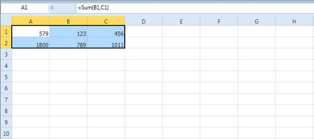
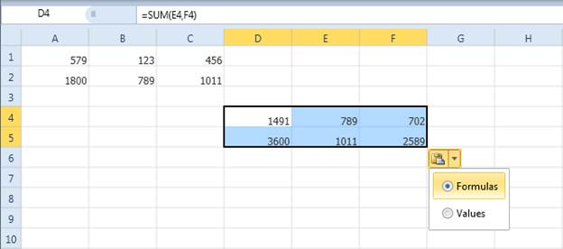

::: {style="DISPLAY: none"}
{#d2h_url_template}{#d2h_package_url style="WIDTH: 0px; DISPLAY: none; HEIGHT: 0px"}
:::

::: {.d2h_secondary_topic style="PADDING-BOTTOM: 10pt; MARGIN: 0pt; PADDING-LEFT: 0pt; PADDING-RIGHT: 0pt; PADDING-TOP: 0pt"}
##### Relative Reference Copy and Paste {#relative-reference-copy-and-paste style="TEXT-ALIGN: justify; tab-stops: 0pt"}

If you copy and paste cells within the Spreadsheet control, then the cell styles will be preserved, and also the formula references will be automatically updated in the pasted cells.

If you are pasting the date in the spreadsheet cells, it will show a small pop-up with two options: one for pasting the formula, and one for pasting the value. By default, when you paste the copied formula cell, it will paste the formula in that cell. By using this pop-up, you can change this formula to a value.

 

{border="0"}

Figure 36: Copying Fomulas in the Spreadsheet

 

{border="0"}

Figure 37: Options for Pasting from Clipboard as Formula or Value

[]{style="COLOR: #c00000"} 

[]{#related-topics}
:::
