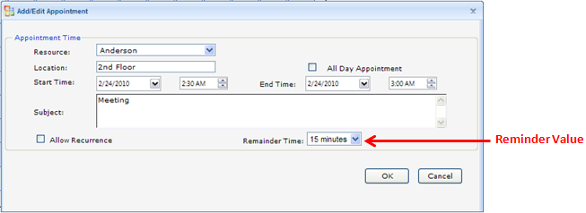
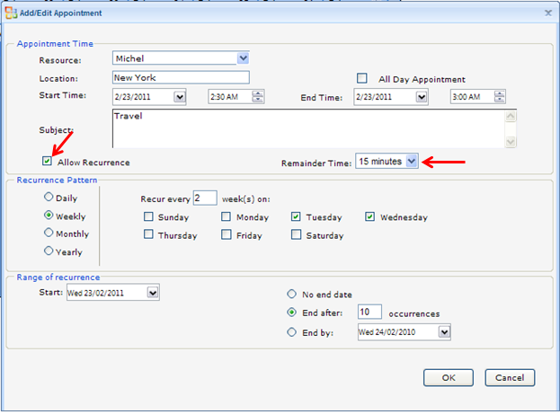
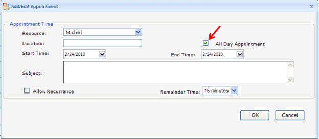
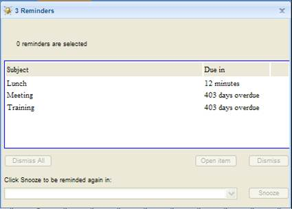
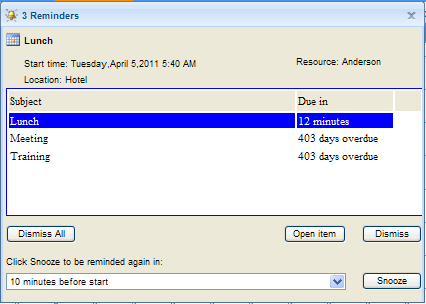

::: {style="DISPLAY: none"}
{#d2h_url_template}{#d2h_package_url style="WIDTH: 0px; DISPLAY: none; HEIGHT: 0px"}
:::

::::: {#nsbanner .d2h_main_nsbanner style="BORDER-BOTTOM: #999999 1px solid; POSITION: relative; PADDING-BOTTOM: 0px; BACKGROUND-COLOR: transparent; PADDING-LEFT: 0px; PADDING-RIGHT: 0px; DISPLAY: none; BORDER-TOP: #999999 1px solid; PADDING-TOP: 0px; LEFT: 0px"}
:::: {#TitleRow .d2h_main_titlerow style="PADDING-BOTTOM: 4px; BACKGROUND-COLOR: transparent; PADDING-LEFT: 22px; WIDTH: 100%; PADDING-RIGHT: 10px; DISPLAY: none; PADDING-TOP: 4px"}
::: {#ienav .d2h_main_ienav style="DISPLAY: none"}
{#D2HPrevious .D2HPreviousEnabled}  {#D2HNext .D2HNextEnabled}
:::
::::
:::::

:::::: {#nstext .d2h_main_nstext style="PADDING-BOTTOM: 10px; BACKGROUND-COLOR: transparent; PADDING-LEFT: 22px; PADDING-RIGHT: 10px; HEIGHT: 100%; OVERFLOW: auto; PADDING-TOP: 5px" hasuserbackground="true" valign="bottom"}
::: {#d2h_breadcrumbs .d2h_breadcrumbs}
[Essential Studio User Guide Documentation](ms-xhelp:///?Id=12457748-09e3-4d74-a240-8e049cedf030){.d2h_breadcrumbsNormal}[ \> ]{.d2h_breadcrumbsLinkSeparator}[User Interface Edition](ms-xhelp:///?Id=c29296b7-531c-413b-a0ec-488ca1f7f669){.d2h_breadcrumbsNormal}[ \> ]{.d2h_breadcrumbsLinkSeparator}[Essential ASP.NET](ms-xhelp:///?Id=25c35330-c127-4dad-9a92-ed79dc7261a6){.d2h_breadcrumbsNormal}[ \> ]{.d2h_breadcrumbsLinkSeparator}[Essential Schedule]{.d2h_breadcrumbsContentsOnly}[ \> ]{.d2h_breadcrumbsLinkSeparator}[Concepts and Features](ms-xhelp:///?Id=64869483-f57f-4838-b322-b1a3d1ce8e40){.d2h_breadcrumbsNormal}[ \> ]{.d2h_breadcrumbsLinkSeparator}[Appointments](ms-xhelp:///?Id=8545e8cf-5b26-43a2-932f-f0087c9a1e0a){.d2h_breadcrumbsNormal}
:::

### Reminder Appointments {#reminder-appointments style="tab-stops: 0pt"}

 

Schedule control provides support for Reminder Appointments. This feature is used to show Reminder Dialog when the Reminder Time of an appointment is reached or when the appointment start time is reached.  Schedule Reminder also supports Recurrence Appointment and all-day appointments.

 

 Use Case Scenarios

Reminder Appointmnets help the Users to:

[·      ]{style="FONT-FAMILY: Symbol"}Design a Reminder Dialog like Outlook Reminder

[·      ]{style="FONT-FAMILY: Symbol"}Open the Reminder Dialog when Reminder time of an appointment is reached

[·      ]{style="FONT-FAMILY: Symbol"}Reminder Support for all types of Recurrence appointment

[·      ]{style="FONT-FAMILY: Symbol; COLOR: black"}[We can postpone the Reminder time for the due-in appointments by using Snooze]{style="COLOR: black"}

[·      ]{style="FONT-FAMILY: Symbol; COLOR: black"}[For overdue Appointments we can postpone the reminder after the Chosen snooze time]{style="COLOR: black"}

[·      ]{style="FONT-FAMILY: Symbol"}Dismiss and Dismiss All should Remove Reminder for selected and all appointment respectively.

[·      ]{style="FONT-FAMILY: Symbol"}Open Item should display Add/Edit Appointment Window of the selected appointment.

 

Adding Reminder Appointment

[·      ]{style="FONT-FAMILY: Symbol"}Through Code

To add a Reminder Appointment through code use **Reminder** and **ReminderValue** Properties.

 

+--------------------------------------------------------------------------------------------------------------------------------------------------------------------------------------------------------------------------------------------------------------------------------------------------------------------------------------------------------------------------------------------------------------------------------------------------------------------------------------------------------------------------------------------------------------------------------------------------------------+
| [ ]{style="FONT-FAMILY: 'Times New Roman','serif'"}**[\[ASPX\]]{style="FONT-FAMILY: 'Courier New'"}**                                                                                                                                                                                                                                                                                                                                                                                                                                                                                                        |
|                                                                                                                                                                                                                                                                                                                                                                                                                                                                                                                                                                                                              |
| [\<]{style="FONT-FAMILY: 'Courier New'; COLOR: blue"}[Appointments]{style="FONT-FAMILY: 'Courier New'; COLOR: #a31515"}[\>]{style="FONT-FAMILY: 'Courier New'; COLOR: blue"}                                                                                                                                                                                                                                                                                                                                                                                                                                 |
|                                                                                                                                                                                                                                                                                                                                                                                                                                                                                                                                                                                                              |
| [            [\<]{style="COLOR: blue"}[syncfusion]{style="COLOR: #a31515"}[:]{style="COLOR: blue"}[ScheduleWebAppointment]{style="COLOR: #a31515"}  [Reminder]{style="COLOR: red"} [=]{style="COLOR: blue"} [\"true\"]{style="COLOR: blue"} [ReminderValue]{style="COLOR: red"} [=]{style="COLOR: blue"} [\"15\"]{style="COLOR: blue"} [StartTime]{style="COLOR: red"}[=\"02/26/2010 01:00:00\"]{style="COLOR: blue"} [EndTime]{style="COLOR: red"}[=\"02/26/2010 02:00:00\"]{style="COLOR: blue"} [Subject]{style="COLOR: red"}[=\"Training\"/\>]{style="COLOR: blue"}]{style="FONT-FAMILY: 'Courier New'"} |
|                                                                                                                                                                                                                                                                                                                                                                                                                                                                                                                                                                                                              |
| [\</]{style="FONT-FAMILY: 'Courier New'; COLOR: blue"}[Appointments]{style="FONT-FAMILY: 'Courier New'; COLOR: #a31515"}[\>]{style="FONT-FAMILY: 'Courier New'; COLOR: blue"}[]{style="FONT-FAMILY: 'Courier New'"}                                                                                                                                                                                                                                                                                                                                                                                          |
+--------------------------------------------------------------------------------------------------------------------------------------------------------------------------------------------------------------------------------------------------------------------------------------------------------------------------------------------------------------------------------------------------------------------------------------------------------------------------------------------------------------------------------------------------------------------------------------------------------------+

[]{style="FONT-FAMILY: 'Times New Roman','serif'; FONT-SIZE: 12pt"} 

+---------------------------------------------------------------------------------------------------------------------------------------------------------------------------------------------------------+
| **[\[C#\]]{style="FONT-FAMILY: 'Courier New'"}**[]{style="FONT-FAMILY: 'Times New Roman','serif'"}                                                                                                      |
|                                                                                                                                                                                                         |
| [ScheduleWebAppointment]{style="FONT-FAMILY: 'Courier New'; COLOR: #2b91af"}[ app = [new]{style="COLOR: blue"} [ScheduleWebAppointment]{style="COLOR: #2b91af"}();]{style="FONT-FAMILY: 'Courier New'"} |
|                                                                                                                                                                                                         |
| [Schedule1.Appointments.Add(app);]{style="FONT-FAMILY: 'Courier New'"}                                                                                                                                  |
|                                                                                                                                                                                                         |
| [app.Reminder = [true]{style="COLOR: blue"};]{style="FONT-FAMILY: 'Courier New'"}                                                                                                                       |
|                                                                                                                                                                                                         |
| [app.ReminderValue = 5;]{style="FONT-FAMILY: 'Courier New'"}[]{style="FONT-FAMILY: 'Times New Roman','serif'"}                                                                                          |
+---------------------------------------------------------------------------------------------------------------------------------------------------------------------------------------------------------+

 

+-----------------------------------------------------------------------------------------------------------------------------------------------------------------------------------------------------------------------------------------------------------+
| [ ]{style="FONT-FAMILY: 'Times New Roman','serif'"}**[\[VB\]]{style="FONT-FAMILY: 'Courier New'"}**                                                                                                                                                       |
|                                                                                                                                                                                                                                                           |
| [Private]{style="FONT-FAMILY: 'Courier New'; COLOR: blue"}[ app [As]{style="COLOR: blue"} Syncfusion.Web.UI.WebControls.ScheduleControl.ScheduleWebAppointment = [New]{style="COLOR: blue"} ScheduleWebAppointment()]{style="FONT-FAMILY: 'Courier New'"} |
|                                                                                                                                                                                                                                                           |
| [Scheduler1.Appointments.Add(app1)]{style="FONT-FAMILY: 'Courier New'"}                                                                                                                                                                                   |
|                                                                                                                                                                                                                                                           |
| [app.Reminder = [true]{style="COLOR: blue"}]{style="FONT-FAMILY: 'Courier New'"}                                                                                                                                                                          |
|                                                                                                                                                                                                                                                           |
| [app.ReminderValue = 15]{style="FONT-FAMILY: 'Courier New'"}[]{style="FONT-FAMILY: 'Times New Roman','serif'"}                                                                                                                                            |
+-----------------------------------------------------------------------------------------------------------------------------------------------------------------------------------------------------------------------------------------------------------+

[   ]{style="FONT-FAMILY: 'Courier New'"}[]{style="FONT-FAMILY: 'Myriad Pro','sans-serif'"}

[·      ]{style="FONT-FAMILY: Symbol"}Through Callback

 

It is also possible to add reminder Appointment through CallBack by double-clicking the schedule cells. Add/Edit Appointment dialog will pop-up as shown below.

 

{border="0"}

Figure 76:Add/Edit Appointment Dialog

 

Properties

Table 2: Reminder Properties

::: {align="center"}
  --------------- -------------------------------------- ------------- ----------- -----------------
  Property        Description                            Type          Data Type   Reference links
  Reminder        Denotes the Reminder Appointment       Server-Side   Boolean     NA
  ReminderValue   Denotes the Reminder Time in minutes   Server-Side   Integer     NA
  --------------- -------------------------------------- ------------- ----------- -----------------
:::

**[]{style="FONT-FAMILY: 'Calibri','sans-serif'; COLOR: black"}** 

[]{#_Freeze_Panes}Reminder Support

Reminder Feature also supports for recurrence appointment and All-day Appointment.

 

Table 3: Reminder Dialog Feature

::: {align="center"}
  ---------------------------------------------------- -------------------------------------------------------------------------
  Reminder Dialog Features                             Description
  Open Item / On Double Click an appointment in list   It will open the Edit Appointment Dialog for selected Appointment.
  Snooze for due in Appointments                       We can postpone the reminder time for the due In appointments
  Snooze for overdue Appointments                      We can postpone the reminder to show after the Chosen snooze time
  Dismiss                                              Dismiss is used to remove the reminder for selected appointment
  DismissAll                                           DismissAll is used to Remove Reminder for all the reminder appointments
  ---------------------------------------------------- -------------------------------------------------------------------------
:::

 

Reminder for Recurrence Appointment

Reminder Feature also supports Recurrence Appointment. The Reminder Dialog will show when the next recurrence appointment reminder time is reached, till then the Reminder Dialog will have the last overdue appointment in the list.

{border="0"}

Figure 77: Reminder for Recurrence Appointment

**[]{style="FONT-FAMILY: 'Myriad Pro','sans-serif'"}** 

Reminder for All-Day Appointment

Reminder Feature also supports All-Day Appointments.

 

{border="0"}

Figure 78: Reminder For All-Day Appointment

 

Appearance

Initially the Reminder dialog appears as shown below when the reminder time reached. The dialog title contains the number of reminder appointment in due time.

 

 

{border="0"}

Figure 79: Reminder Dialog before selecting Appointment

 

On clicking the Appointment in the list it should display **Subject, Start Time, Resource name and Location** of the selected appointment on top as shown below.

 

{border="0"}

Figure 80: Reminder Dialog after selecting Appointment

 

Sample Link

To access a Toolbar Customization sample:

1.   Open the Syncfusion Dashboard.

2.   Select User Interface.

3.   Click the ASP.NET drop-down list and select Explore Samples.

[4.    ]{style="FONT-FAMILY: 'Calibri','sans-serif'; FONT-SIZE: 11pt"}Navigate to **Schedule.Web** -\> **Basic Features -\> Reminder Demo.**[]{style="FONT-FAMILY: 'Calibri','sans-serif'; FONT-SIZE: 11pt"}

 

[]{#related-topics}
::::::
