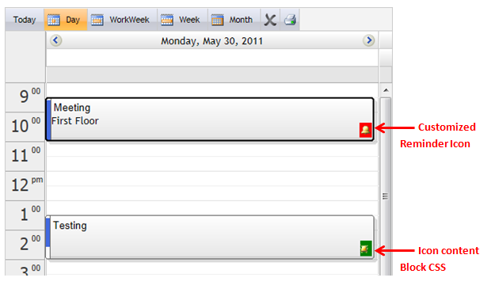

::: {style="DISPLAY: none"}
{#d2h_url_template}{#d2h_package_url style="WIDTH: 0px; DISPLAY: none; HEIGHT: 0px"}
:::

::::: {#nsbanner .d2h_main_nsbanner style="BORDER-BOTTOM: #999999 1px solid; POSITION: relative; PADDING-BOTTOM: 0px; BACKGROUND-COLOR: transparent; PADDING-LEFT: 0px; PADDING-RIGHT: 0px; DISPLAY: none; BORDER-TOP: #999999 1px solid; PADDING-TOP: 0px; LEFT: 0px"}
:::: {#TitleRow .d2h_main_titlerow style="PADDING-BOTTOM: 4px; BACKGROUND-COLOR: transparent; PADDING-LEFT: 22px; WIDTH: 100%; PADDING-RIGHT: 10px; DISPLAY: none; PADDING-TOP: 4px"}
::: {#ienav .d2h_main_ienav style="DISPLAY: none"}
{#D2HPrevious .D2HPreviousEnabled}  {#D2HNext .D2HNextEnabled}
:::
::::
:::::

:::: {#nstext .d2h_main_nstext style="PADDING-BOTTOM: 10px; BACKGROUND-COLOR: transparent; PADDING-LEFT: 22px; PADDING-RIGHT: 10px; HEIGHT: 100%; OVERFLOW: auto; PADDING-TOP: 5px" hasuserbackground="true" valign="bottom"}
::: {#d2h_breadcrumbs .d2h_breadcrumbs}
[Essential Studio User Guide Documentation](ms-xhelp:///?Id=12457748-09e3-4d74-a240-8e049cedf030){.d2h_breadcrumbsNormal}[ \> ]{.d2h_breadcrumbsLinkSeparator}[User Interface Edition](ms-xhelp:///?Id=c29296b7-531c-413b-a0ec-488ca1f7f669){.d2h_breadcrumbsNormal}[ \> ]{.d2h_breadcrumbsLinkSeparator}[Essential ASP.NET](ms-xhelp:///?Id=25c35330-c127-4dad-9a92-ed79dc7261a6){.d2h_breadcrumbsNormal}[ \> ]{.d2h_breadcrumbsLinkSeparator}[Essential Schedule]{.d2h_breadcrumbsContentsOnly}[ \> ]{.d2h_breadcrumbsLinkSeparator}[Concepts and Features](ms-xhelp:///?Id=64869483-f57f-4838-b322-b1a3d1ce8e40){.d2h_breadcrumbsNormal}[ \> ]{.d2h_breadcrumbsLinkSeparator}[Icon Customization](ms-xhelp:///?Id=1557ca34-ca4d-4231-b093-c1acab617a6a){.d2h_breadcrumbsNormal}
:::

### Reminder Icon Customization {#reminder-icon-customization style="tab-stops: 0pt"}

1.   Add a Reminder Appointment.

2.   Customize the Reminder Icon and its content block (i.e div block) using the properties as shown in the below code.

 

+-------------------------------------------------------------------------------------------------------------------------------------------------------------------------------------------------------------------------------------------------------------------------------------------------------------------------------------------------------------------------------------------------------------------------------------------------------------------------------------------------------------------------------------------------------------------------------------------------------------------------------------------------------------------------------------------------------------------------------------------------------+
| [\[ASPX\]]{style="FONT-FAMILY: 'Courier New'; COLOR: blue"}                                                                                                                                                                                                                                                                                                                                                                                                                                                                                                                                                                                                                                                                                           |
|                                                                                                                                                                                                                                                                                                                                                                                                                                                                                                                                                                                                                                                                                                                                                       |
| [        [\<]{style="COLOR: blue"}[Appointments]{style="COLOR: #a31515"}[\>]{style="COLOR: blue"}]{style="FONT-FAMILY: 'Courier New'"}                                                                                                                                                                                                                                                                                                                                                                                                                                                                                                                                                                                                                |
|                                                                                                                                                                                                                                                                                                                                                                                                                                                                                                                                                                                                                                                                                                                                                       |
| [            [\<]{style="COLOR: blue"}[syncfusion]{style="COLOR: #a31515"}[:]{style="COLOR: blue"}[ScheduleWebAppointment]{style="COLOR: #a31515"} [Reminder]{style="COLOR: red"}[=\"true\"]{style="COLOR: blue"} [ReminderCssClass]{style="COLOR: red"}[=\"remcss\"]{style="COLOR: blue"} [ReminderIconUrl]{style="COLOR: red"}[=\"Images/Alerts.png\"]{style="COLOR: blue"} [LocationValue]{style="COLOR: red"}[=\"First Floor\"]{style="COLOR: blue"} [EndTime]{style="COLOR: red"}[=\"05/30/2011 11:00:00\"]{style="COLOR: blue"} [StartTime]{style="COLOR: red"}[=\"05/30/2011 09:35:31\"]{style="COLOR: blue"} [Subject]{style="COLOR: red"}[=\"Meeting\"]{style="COLOR: blue"} [/\>]{style="COLOR: blue"}]{style="FONT-FAMILY: 'Courier New'"} |
|                                                                                                                                                                                                                                                                                                                                                                                                                                                                                                                                                                                                                                                                                                                                                       |
| [            [\<]{style="COLOR: blue"}[syncfusion]{style="COLOR: #a31515"}[:]{style="COLOR: blue"}[ScheduleWebAppointment]{style="COLOR: #a31515"} [Reminder]{style="COLOR: red"}[=\"true\"]{style="COLOR: blue"} [ReminderCssClass]{style="COLOR: red"}[=\"green\"]{style="COLOR: blue"} [ReminderIconUrl]{style="COLOR: red"}[=\"Images/alert.png\"]{style="COLOR: blue"} [EndTime]{style="COLOR: red"}[=\"05/30/2011 14:35:31\"]{style="COLOR: blue"} [StartTime]{style="COLOR: red"}[=\"05/30/2011 13:35:31\"]{style="COLOR: blue"} [Subject]{style="COLOR: red"}[=\"Testing\"]{style="COLOR: blue"} [UniqueID]{style="COLOR: red"}[=\"1\"]{style="COLOR: blue"} [/\>]{style="COLOR: blue"}]{style="FONT-FAMILY: 'Courier New'"}                  |
|                                                                                                                                                                                                                                                                                                                                                                                                                                                                                                                                                                                                                                                                                                                                                       |
| [        [\</]{style="COLOR: blue"}[Appointments]{style="COLOR: #a31515"}[\>]{style="COLOR: blue"}]{style="FONT-FAMILY: 'Courier New'"}                                                                                                                                                                                                                                                                                                                                                                                                                                                                                                                                                                                                               |
|                                                                                                                                                                                                                                                                                                                                                                                                                                                                                                                                                                                                                                                                                                                                                       |
|                                                                                                                                                                                                                                                                                                                                                                                                                                                                                                                                                                                                                                                                                                                                                       |
+-------------------------------------------------------------------------------------------------------------------------------------------------------------------------------------------------------------------------------------------------------------------------------------------------------------------------------------------------------------------------------------------------------------------------------------------------------------------------------------------------------------------------------------------------------------------------------------------------------------------------------------------------------------------------------------------------------------------------------------------------------+

 

+--------------------------------------------------------------------------------------------------------------------------+
| []{style="FONT-FAMILY: 'Courier New'; COLOR: blue"}                                                                      |
|                                                                                                                          |
| [\[C#\]]{style="FONT-FAMILY: 'Courier New'; COLOR: blue"}                                                                |
|                                                                                                                          |
| [  Appoint.Reminder = [true]{style="COLOR: blue"};]{style="FONT-FAMILY: 'Courier New'"}                                  |
|                                                                                                                          |
| [        Appoint.ReminderIconUrl = [\"Images/Alerts.png\"]{style="COLOR: #a31515"};]{style="FONT-FAMILY: 'Courier New'"} |
|                                                                                                                          |
| [        Appoint.ReminderCssClass = [\"remcss\"]{style="COLOR: #a31515"};]{style="FONT-FAMILY: 'Courier New'"}           |
|                                                                                                                          |
|                                                                                                                          |
+--------------------------------------------------------------------------------------------------------------------------+

 

+--------------------------------------------------------------------------------------------------------------------------------------+
|                                                                                                                                      |
|                                                                                                                                      |
| [\[VB\]]{style="FONT-FAMILY: 'Courier New'; COLOR: blue"}                                                                            |
|                                                                                                                                      |
| [  Appoint.Reminder = [true]{style="COLOR: blue"}]{style="FONT-FAMILY: 'Courier New'"}                                               |
|                                                                                                                                      |
| [        Appoint.ReminderIconUrl = [\"Images/Alerts.png\"]{style="COLOR: #a31515"}]{style="FONT-FAMILY: 'Courier New'"}              |
|                                                                                                                                      |
| [        Appoint.ReminderCssClass = [\"remcss\"]{style="COLOR: #a31515"}[]{style="COLOR: blue"}]{style="FONT-FAMILY: 'Courier New'"} |
|                                                                                                                                      |
|                                                                                                                                      |
+--------------------------------------------------------------------------------------------------------------------------------------+

 

3.   Build and run the application you will get the required output

 

 

{border="0"}

Figure 111: Reminder Icon Customization**[]{style="FONT-STYLE: normal"}**

 

[]{#related-topics}
::::
