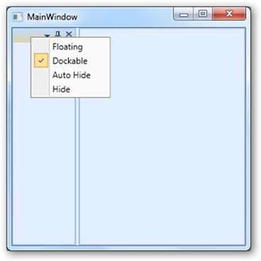

::: {style="DISPLAY: none"}
{#d2h_url_template}{#d2h_package_url style="WIDTH: 0px; DISPLAY: none; HEIGHT: 0px"}
:::

::: {.d2h_secondary_topic style="PADDING-BOTTOM: 10pt; MARGIN: 0pt; PADDING-LEFT: 0pt; PADDING-RIGHT: 0pt; PADDING-TOP: 0pt"}
#### Remove Individual Menu Items {#remove-individual-menu-items style="tab-stops: 0pt"}

 

We can remove individual MenuItem in ContextMenu using the following properties.  The removal can be done by right clicking on it.

[]{style="FONT-FAMILY: 'Trebuchet MS','sans-serif'; COLOR: #15428b; FONT-SIZE: 9pt"} 

[·      ]{style="FONT-FAMILY: Symbol"}ShowHiddenMenuItem

[·      ]{style="FONT-FAMILY: Symbol"}ShowFloatingMenuItem

[·      ]{style="FONT-FAMILY: Symbol"}ShowFloatingMenuItem

[·      ]{style="FONT-FAMILY: Symbol"}ShowDockableMenuItem

[·      ]{style="FONT-FAMILY: Symbol"}ShowTabbedMenuItem

[·      ]{style="FONT-FAMILY: Symbol"}ShowTabbedMenuItem

[·      ]{style="FONT-FAMILY: Symbol"}ShowAutoHiddenMenuItem

[·      ]{style="FONT-FAMILY: Symbol"}ShowDocumentMenuItem

[·      ]{style="FONT-FAMILY: Symbol"}ShowCloseMenuItem

[·      ]{style="FONT-FAMILY: Symbol"}ShowHorizontalTabGroupMenuItem

[·      ]{style="FONT-FAMILY: Symbol"}ShowVerticalTabGroupMenuItem

[·      ]{style="FONT-FAMILY: Symbol"}ShowMovetoNextTabGroupMenuItem

[·      ]{style="FONT-FAMILY: Symbol"}ShowMovetoPreviousTabGroupMenuItem

[·      ]{style="FONT-FAMILY: Symbol"}ShowRestoreMenuItem

[·      ]{style="FONT-FAMILY: Symbol"}ShowMoveMenuItem

[·      ]{style="FONT-FAMILY: Symbol"}ShowResizeMenuItem

[·      ]{style="FONT-FAMILY: Symbol"}ShowMinimizeMenuItem

[·      ]{style="FONT-FAMILY: Symbol"}ShowMaximizedMenuItem

[]{style="FONT-FAMILY: 'Trebuchet MS','sans-serif'; COLOR: #15428b; FONT-SIZE: 9pt"} 

The below code shows how to disable Tabbed menu item using **ShowTabbedMenuItem** attached property

 

+----------------------------------------------------------------------------------------------------------------------------------------------------------------------------------------------------------------------------------------------------------------------------------------------------------------------------------------------------------------------------------------------------------------------------------------------------------------------------------------------------------------------------------------------------------------------------------------------------------+
| **[\[XAML\]]{style="FONT-FAMILY: 'Courier New'"}**                                                                                                                                                                                                                                                                                                                                                                                                                                                                                                                                                       |
|                                                                                                                                                                                                                                                                                                                                                                                                                                                                                                                                                                                                          |
| [\<]{style="FONT-FAMILY: 'Courier New'; COLOR: blue"}[syncfusion]{style="FONT-FAMILY: 'Courier New'; COLOR: #a31515"}[:]{style="FONT-FAMILY: 'Courier New'; COLOR: blue"}[DockingManager]{style="FONT-FAMILY: 'Courier New'; COLOR: #a31515"}[\>]{style="FONT-FAMILY: 'Courier New'; COLOR: blue"}[]{style="FONT-FAMILY: 'Courier New'"}                                                                                                                                                                                                                                                                 |
|                                                                                                                                                                                                                                                                                                                                                                                                                                                                                                                                                                                                          |
| [     ]{style="FONT-FAMILY: 'Courier New'; COLOR: #a31515"}[\<]{style="FONT-FAMILY: 'Courier New'; COLOR: blue"}[Grid]{style="FONT-FAMILY: 'Courier New'; COLOR: #a31515"}[ Name]{style="FONT-FAMILY: 'Courier New'; COLOR: red"}[=\"grid1\"]{style="FONT-FAMILY: 'Courier New'; COLOR: blue"}[ syncfusion]{style="FONT-FAMILY: 'Courier New'; COLOR: red"}[:]{style="FONT-FAMILY: 'Courier New'; COLOR: blue"}[DockingManager.ShowTabbedMenuItem]{style="FONT-FAMILY: 'Courier New'; COLOR: red"}[=\"False\"/\>]{style="FONT-FAMILY: 'Courier New'; COLOR: blue"}[]{style="FONT-FAMILY: 'Courier New'"} |
|                                                                                                                                                                                                                                                                                                                                                                                                                                                                                                                                                                                                          |
| [  ]{style="FONT-FAMILY: 'Courier New'; COLOR: #a31515"}[\</]{style="FONT-FAMILY: 'Courier New'; COLOR: blue"}[syncfusion]{style="FONT-FAMILY: 'Courier New'; COLOR: #a31515"}[:]{style="FONT-FAMILY: 'Courier New'; COLOR: blue"}[DockingManager]{style="FONT-FAMILY: 'Courier New'; COLOR: #a31515"}[\>]{style="FONT-FAMILY: 'Courier New'; COLOR: blue"}                                                                                                                                                                                                                                              |
+----------------------------------------------------------------------------------------------------------------------------------------------------------------------------------------------------------------------------------------------------------------------------------------------------------------------------------------------------------------------------------------------------------------------------------------------------------------------------------------------------------------------------------------------------------------------------------------------------------+

[]{style="FONT-FAMILY: 'Times New Roman','serif'; FONT-SIZE: 12pt"} 

+--------------------------------------------------------------------------------------------------------------------------------------------------------------------------------------------------+
| **[\[C#\]]{style="FONT-FAMILY: 'Times New Roman','serif'; FONT-SIZE: 12pt"}**                                                                                                                    |
|                                                                                                                                                                                                  |
| [DockingManager]{style="FONT-FAMILY: Consolas; COLOR: #2b91af; FONT-SIZE: 9.5pt"}[.SetShowTabbedMenuItem(grid1, [false]{style="COLOR: blue"});]{style="FONT-FAMILY: Consolas; FONT-SIZE: 9.5pt"} |
+--------------------------------------------------------------------------------------------------------------------------------------------------------------------------------------------------+

 

{border="0"}

Figure 388 : ShowDockableMenuItem

                                                                        

Similarly you can use other properties to disable corresponding MeniItems.

 

[]{#related-topics}
:::
