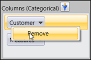
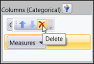

::: {style="DISPLAY: none"}
{#d2h_url_template} {#d2h_package_url style="WIDTH: 0px; DISPLAY: none; HEIGHT: 0px"}
:::

::: {.d2h_secondary_topic style="PADDING-BOTTOM: 10pt; MARGIN: 0pt; PADDING-LEFT: 0pt; PADDING-RIGHT: 0pt; PADDING-TOP: 0pt"}
#### Removing element form an axis {#removing-element-form-an-axis style="tab-stops: 0pt"}

 

There are two ways to remove an element form the axis.

1.   Through the context menu of the element

2.   Through the popup menu of the element

***[]{style="FONT-FAMILY: 'Trebuchet MS','sans-serif'; COLOR: #15428b; FONT-SIZE: 9pt"}***  

Context Menu:

 By right clicking the element a context menu will appear containing the remove option. By clicking the remove option that element will be removed from the axis and the current report.

***[]{style="FONT-FAMILY: 'Calibri','sans-serif'"}***  

{border="0"}

Figure 32: Removing element through Context Menu**[]{style="FONT-STYLE: normal; FONT-FAMILY: 'Calibri','sans-serif'"}**

 

{border="0"}

Figure 33: Removing through Popup

**Popup Menu:**

We can remove the element by clicking the Delete menu in the popup, which will appear when we place the mouse over the element.

[]{#related-topics}
:::
