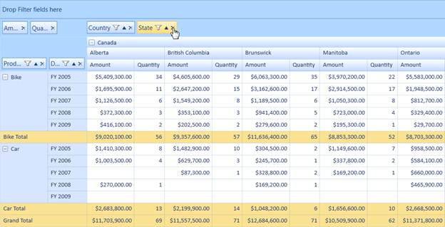

::: {style="DISPLAY: none"}
{#d2h_url_template} {#d2h_package_url style="WIDTH: 0px; DISPLAY: none; HEIGHT: 0px"}
:::

:::: {.d2h_secondary_topic style="PADDING-BOTTOM: 10pt; MARGIN: 0pt; PADDING-LEFT: 0pt; PADDING-RIGHT: 0pt; PADDING-TOP: 0pt"}
#### Removing Fields from Grouping Area {#removing-fields-from-grouping-area style="tab-stops: 0pt"}

 

Essential PivotGrid provides a remove button for fields in grouping area. This helps you to remove the fields from *Grouping Area.* Removed fields will be stored in the*PivotTable Field List* dialog for later use. Instead of dragging the field from *Grouping Area*, you can click the remove button to achieve this.

 

Table 5: Property Table

::: {align="center"}
  ------------- ------------------------ ------------ ----------- -----------------
  Property      Description              Type         Data Type   Reference links
  AllowRemove   Enables remove button.   Dependency   Boolean     NA
  ------------- ------------------------ ------------ ----------- -----------------
:::

[]{style="FONT-FAMILY: 'Calibri','sans-serif'; COLOR: black"} 

Enabling Remove Button

 

To add the remove button for fields in grouping area, set the *AllowRemove* property to true. By default this is set to false.

The following code illustrates how to enable the remove button:

 

+------------------------------------------------------------------------------------------------------------------------------------------------------------------+
| **[\[C#\]]{style="FONT-FAMILY: 'Courier New'"}**                                                                                                                 |
|                                                                                                                                                                  |
| [this]{style="FONT-FAMILY: 'Courier New'; COLOR: blue"} [.pivotGrid1.GroupingBar.AllowRemove = [true]{style="COLOR: blue"};]{style="FONT-FAMILY: 'Courier New'"} |
+------------------------------------------------------------------------------------------------------------------------------------------------------------------+

 

+---------------------------------------------------------------------------------------------------------------------------------------------------------------+
| **[\[VB\]]{style="FONT-FAMILY: 'Courier New'"}**                                                                                                              |
|                                                                                                                                                               |
| [Me]{style="FONT-FAMILY: 'Courier New'; COLOR: blue"} [.pivotGrid1.GroupingBar.AllowRemove = [True]{style="COLOR: blue"}]{style="FONT-FAMILY: 'Courier New'"} |
+---------------------------------------------------------------------------------------------------------------------------------------------------------------+

 

{border="0"}

Figure 31: Remove Button Added

**[]{style="COLOR: #e36c0a"}**  

10. 

Sample Link

A demo of this feature is available in the following location:

 

**Windows 7/Vista:**

*SystemDrive:\\Users\\\<user_name\>\\AppData\\Local\\Syncfusion\\EssentialStudio\\\<version_number\>\\BI\\WPF\\PivotAnalysis.Wpf\\Samples\\Grouping Bar\\Grouping Bar Demo*

 

**Windows XP:**

*SystemDrive:\\Syncfusion\\EssentialStudio\\\<version_number\>\\ BI\\WPF\\PivotAnalysis.Wpf\\Samples\\Grouping Bar\\Grouping Bar* Demo

 

[]{#related-topics}
::::
