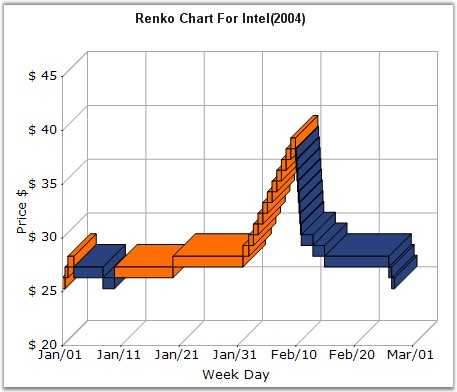

::: {style="DISPLAY: none"}
{#d2h_url_template}{#d2h_package_url style="WIDTH: 0px; DISPLAY: none; HEIGHT: 0px"}
:::

:::: {.d2h_secondary_topic style="PADDING-BOTTOM: 10pt; MARGIN: 0pt; PADDING-LEFT: 0pt; PADDING-RIGHT: 0pt; PADDING-TOP: 0pt"}
#### Renko Chart {#renko-chart style="tab-stops: 0pt"}

 

Renko charting method is thought to have acquired its name from \"renga\" which is the Japanese word for bricks. Renko Charts were introduced by Steve Nison. Renko (Bricks) are drawn equal in size for a determined amount. A brick is drawn in the direction of the prior move only if prices move by a minimum amount. If prices change by the determined amount or more, a new brick is drawn. If prices change by less than the determined amount (specified by **ReversalAmount**), the new price is ignored. The default value of ReversalAmount is 1.

 

If the new closing price penetrates the previous bricks closing price in the opposite direction a trend reversal highlighted by the change in color of the bricks happens. Use the **PriceUpColor** to indicate bullish trend and **PriceDownColor** to indicate bearish trend.

 

Since a Renko chart isolates the underlying trends by filtering out the minor ups and downs, Renko charts are excellent in determining support and resistance levels. 

 

{border="0"}

 

Figure 78: Chart displaying Renko Series

 

 

 

 

Chart Details

 

::: {align="center"}
+-------------------------------------+-------------------------------------+
|                                                                           |
|                                                                           |
| Details                                                                   |
+-------------------------------------+-------------------------------------+
|                                     |                                     |
|                                     |                                     |
| **Number of Y values per point**    | 1                                   |
+-------------------------------------+-------------------------------------+
|                                     |                                     |
|                                     |                                     |
| **Number of Series         **       | One                                 |
+-------------------------------------+-------------------------------------+
|                                     |                                     |
|                                     |                                     |
| **Cannot be Combined with   **      | Pie, Bar                            |
+-------------------------------------+-------------------------------------+
:::

 

Renko series can be added to the chart using the following code.

 

+-------------------------------------------------------------------------------------------------------------------------------------------------------------------------------------------------------------------------------------------------------------+
| **[\[C#\]]{style="FONT-FAMILY: 'Courier New'; COLOR: black"}**                                                                                                                                                                                              |
|                                                                                                                                                                                                                                                             |
| []{style="COLOR: black; FONT-SIZE: 12pt"}                                                                                                                                                                                                                   |
|                                                                                                                                                                                                                                                             |
| [// Create chart series and add data points into it.]{style="FONT-FAMILY: 'Courier New'; COLOR: green"}[   ]{style="COLOR: black; FONT-SIZE: 12pt"}                                                                                                         |
|                                                                                                                                                                                                                                                             |
| [ChartSeries series = ]{style="FONT-FAMILY: 'Courier New'; COLOR: black"}[this]{style="FONT-FAMILY: 'Courier New'; COLOR: blue"}[.chartControl1.Model.NewSeries (\"Series Name\",ChartSeriesType.Renko);]{style="FONT-FAMILY: 'Courier New'; COLOR: black"} |
|                                                                                                                                                                                                                                                             |
| [series.Points.Add (0, 1);]{style="FONT-FAMILY: 'Courier New'; COLOR: black"}                                                                                                                                                                               |
|                                                                                                                                                                                                                                                             |
| [series.Points.Add (1, 3);]{style="FONT-FAMILY: 'Courier New'; COLOR: black"}                                                                                                                                                                               |
|                                                                                                                                                                                                                                                             |
| [series.Points.Add (2, 4);]{style="FONT-FAMILY: 'Courier New'; COLOR: black"}                                                                                                                                                                               |
|                                                                                                                                                                                                                                                             |
| [series.ReversalAmount = 1.0;]{style="FONT-FAMILY: 'Courier New'; COLOR: black"}                                                                                                                                                                            |
|                                                                                                                                                                                                                                                             |
| []{style="FONT-FAMILY: 'Courier New'; COLOR: black"}                                                                                                                                                                                                        |
|                                                                                                                                                                                                                                                             |
| [// Add the series to the chart series collection.]{style="FONT-FAMILY: 'Courier New'; COLOR: green"}                                                                                                                                                       |
|                                                                                                                                                                                                                                                             |
| [this]{style="FONT-FAMILY: 'Courier New'; COLOR: blue"}[.chartControl1.Series.Add (series);]{style="FONT-FAMILY: 'Courier New'; COLOR: black"}                                                                                                              |
+-------------------------------------------------------------------------------------------------------------------------------------------------------------------------------------------------------------------------------------------------------------+

 

+----------------------------------------------------------------------------------------------------------------------------------------------------------------------------------------------------------------------------------------------------------------------------------------------------------------------------------------------------------------------------------------------------------------------------+
| **[\[VB.NET\]]{style="FONT-FAMILY: 'Courier New'; COLOR: black"}**                                                                                                                                                                                                                                                                                                                                                         |
|                                                                                                                                                                                                                                                                                                                                                                                                                            |
| []{style="COLOR: black; FONT-SIZE: 12pt"}                                                                                                                                                                                                                                                                                                                                                                                  |
|                                                                                                                                                                                                                                                                                                                                                                                                                            |
| [\' Create chart series and add data points into it.]{style="FONT-FAMILY: 'Courier New'; COLOR: green"}                                                                                                                                                                                                                                                                                                                    |
|                                                                                                                                                                                                                                                                                                                                                                                                                            |
| [Dim]{style="FONT-FAMILY: 'Courier New'; COLOR: blue"}[ series ]{style="FONT-FAMILY: 'Courier New'; COLOR: black"}[As]{style="FONT-FAMILY: 'Courier New'; COLOR: blue"}[ ChartSeries = ]{style="FONT-FAMILY: 'Courier New'; COLOR: black"}[Me]{style="FONT-FAMILY: 'Courier New'; COLOR: blue"}[.chartControl1.Model.NewSeries (\"Series Name\",ChartSeriesType.Renko) ]{style="FONT-FAMILY: 'Courier New'; COLOR: black"} |
|                                                                                                                                                                                                                                                                                                                                                                                                                            |
| [series.Points.Add (0, 1)]{style="FONT-FAMILY: 'Courier New'; COLOR: black"}                                                                                                                                                                                                                                                                                                                                               |
|                                                                                                                                                                                                                                                                                                                                                                                                                            |
| [series.Points.Add (1, 3)]{style="FONT-FAMILY: 'Courier New'; COLOR: black"}                                                                                                                                                                                                                                                                                                                                               |
|                                                                                                                                                                                                                                                                                                                                                                                                                            |
| [series.Points.Add (2, 4)]{style="FONT-FAMILY: 'Courier New'; COLOR: black"}                                                                                                                                                                                                                                                                                                                                               |
|                                                                                                                                                                                                                                                                                                                                                                                                                            |
| [series.ReversalAmount = 1.0]{style="FONT-FAMILY: 'Courier New'; COLOR: black"}                                                                                                                                                                                                                                                                                                                                            |
|                                                                                                                                                                                                                                                                                                                                                                                                                            |
| []{style="FONT-FAMILY: 'Courier New'; COLOR: black"}                                                                                                                                                                                                                                                                                                                                                                       |
|                                                                                                                                                                                                                                                                                                                                                                                                                            |
| [\' Add the series to the chart series collection.]{style="FONT-FAMILY: 'Courier New'; COLOR: green"}                                                                                                                                                                                                                                                                                                                      |
|                                                                                                                                                                                                                                                                                                                                                                                                                            |
| [Me]{style="FONT-FAMILY: 'Courier New'; COLOR: blue"}[.chartControl1.Series.Add (series)]{style="FONT-FAMILY: 'Courier New'; COLOR: black"}                                                                                                                                                                                                                                                                                |
+----------------------------------------------------------------------------------------------------------------------------------------------------------------------------------------------------------------------------------------------------------------------------------------------------------------------------------------------------------------------------------------------------------------------------+

 

+--------------------------------------------------------------------------------------------------------------------------------------------------------------------------------------------------------------------------------------------------------------+
| []{style="FONT-FAMILY: 'Segoe UI','sans-serif'; COLOR: black"}                                                                                                                                                                                               |
|                                                                                                                                                                                                                                                              |
| Customization Options                                                                                                                                                                                                                                        |
+--------------------------------------------------------------------------------------------------------------------------------------------------------------------------------------------------------------------------------------------------------------+
| Border[,]{style="COLOR: blue"} ColorsMode, DarkLightPower, DisplayShadow, DisplayText, DrawSeriesNameInDepth, ElementBorders, ImageIndex, Images, PriceDownColor                                                                                             |
|                                                                                                                                                                                                                                                              |
| PriceUpColor, ReversalAmount, Spacing Between Series, ShadowInterior, ShadowOffset, ShadowOffset, FancyToolTip, Font, Interior, LegendItem, Name, PointsToolTipFormatSmartLabels, Summary, Text, TextColor, TextFormat, TextOffset, TextOrientation, Visible |
+--------------------------------------------------------------------------------------------------------------------------------------------------------------------------------------------------------------------------------------------------------------+

[]{#p64} 

 

[]{#related-topics}
::::
