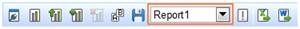
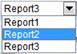
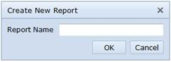
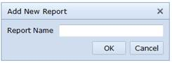
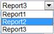
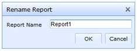
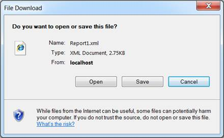
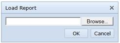

::: {style="DISPLAY: none"}
{#d2h_url_template}{#d2h_package_url style="WIDTH: 0px; DISPLAY: none; HEIGHT: 0px"}
:::

::::: {#nsbanner .d2h_main_nsbanner style="BORDER-BOTTOM: #999999 1px solid; POSITION: relative; PADDING-BOTTOM: 0px; BACKGROUND-COLOR: transparent; PADDING-LEFT: 0px; PADDING-RIGHT: 0px; DISPLAY: none; BORDER-TOP: #999999 1px solid; PADDING-TOP: 0px; LEFT: 0px"}
:::: {#TitleRow .d2h_main_titlerow style="PADDING-BOTTOM: 4px; BACKGROUND-COLOR: transparent; PADDING-LEFT: 22px; WIDTH: 100%; PADDING-RIGHT: 10px; DISPLAY: none; PADDING-TOP: 4px"}
::: {#ienav .d2h_main_ienav style="DISPLAY: none"}
{#D2HPrevious .D2HPreviousEnabled}  {#D2HNext .D2HNextEnabled}
:::
::::
:::::

:::: {#nstext .d2h_main_nstext style="PADDING-BOTTOM: 10px; BACKGROUND-COLOR: transparent; PADDING-LEFT: 22px; PADDING-RIGHT: 10px; HEIGHT: 100%; OVERFLOW: auto; PADDING-TOP: 5px" hasuserbackground="true" valign="bottom"}
::: {#d2h_breadcrumbs .d2h_breadcrumbs}
[Essential Studio User Guide Documentation](ms-xhelp:///?Id=12457748-09e3-4d74-a240-8e049cedf030){.d2h_breadcrumbsNormal}[ \> ]{.d2h_breadcrumbsLinkSeparator}[Business Intelligence Edition](ms-xhelp:///?Id=fdf33dd8-62b2-47b9-ad7b-fc50e590bca5){.d2h_breadcrumbsNormal}[ \> ]{.d2h_breadcrumbsLinkSeparator}[Essential BI ASP.NET](ms-xhelp:///?Id=99c6694e-59c3-4c59-abb5-ce9ce9a948bc){.d2h_breadcrumbsNormal}[ \> ]{.d2h_breadcrumbsLinkSeparator}[Essential BI Client]{.d2h_breadcrumbsContentsOnly}[ \> ]{.d2h_breadcrumbsLinkSeparator}[Getting Started](ms-xhelp:///?Id=d67227c0-bba2-4943-acc1-d5c64f70f90b){.d2h_breadcrumbsNormal}[ \> ]{.d2h_breadcrumbsLinkSeparator}[Appearance and Structure of the control](ms-xhelp:///?Id=5eefc693-d23d-481b-92b8-6a7d9ff5439b){.d2h_breadcrumbsNormal}
:::

### Report {#report style="tab-stops: 0pt"}

Report List

**Report List** will hold all the reports of the current session of the OLAP Client control.

{border="0"}

 

{border="0"}

 

Figure 28: Report List

On report change

When we make a change in the report, all the controls will get populated with the data contained in the selected report.

The Cube Dimension Browser will get populated with the cube data mentioned in the selected report.

Each axis in the Axis Element Builder will get loaded with the appropriate element mentioned in the selected report.

The Chart and Grid will reflect the output of the selected report.

 

[]{#_Creating_a_new}Creating a new report

On clicking **Create a new report**, a dialog appears asking for the report name and on the **Ok** event a new report is added to the existing **Report List** clearing all the existing report(s).

[]{style="FONT-SIZE: 12pt"} 

{border="0"}

 

Figure 29: Creating a new report

[]{style="FONT-SIZE: 12pt"} 

{border="0"}

 

Figure 30: Report Name

 

 

This can also be done through an **API** which is mentioned in the following code snippet.

+------------------------------------------------------------------------------------------------------------------------------+
| **[\[C#\]]{style="FONT-FAMILY: 'Courier New'"}**                                                                             |
|                                                                                                                              |
| [this]{style="FONT-FAMILY: 'Courier New'; COLOR: blue"}[.olapClient1.CreateNewReport();]{style="FONT-FAMILY: 'Courier New'"} |
+------------------------------------------------------------------------------------------------------------------------------+

 

 

+---------------------------------------------------------------------------------------------------------------------------+
| **[\[VB\]]{style="FONT-FAMILY: 'Courier New'"}**                                                                          |
|                                                                                                                           |
| [Me]{style="FONT-FAMILY: 'Courier New'; COLOR: blue"}[.olapClient1.CreateNewReport()]{style="FONT-FAMILY: 'Courier New'"} |
+---------------------------------------------------------------------------------------------------------------------------+

 

Adding a new report

On clicking **Add a new report**, a dialog appears asking for the report name and on the **Ok** event a new report is added to the existing report list.

[]{style="FONT-SIZE: 12pt"} 

{border="0"}

 

Figure 31: Add a new report

[]{style="FONT-SIZE: 12pt"} 

{border="0"}

 

Figure 32: Report Name

[]{#_Removing_a_report}Removing a report

On clicking **Remove the selected report**, the current report is removed. If only one report is available in the report list, then it will be automatically disabled.

[]{style="FONT-SIZE: 12pt"} 

{border="0"}

 

Figure 33: Remove the selected report

[]{style="FONT-SIZE: 12pt"} 

{border="0"}

 

Figure 34: Selecting the desired report for deletion

 

This can also be done through an **API** which is mentioned in the following code snippet.

+---------------------------------------------------------------------------------------------------------------------------+
| **[\[C#\]]{style="FONT-FAMILY: 'Courier New'"}**                                                                          |
|                                                                                                                           |
| [this]{style="FONT-FAMILY: 'Courier New'; COLOR: blue"}[.olapClient1.RemoveReport();]{style="FONT-FAMILY: 'Courier New'"} |
+---------------------------------------------------------------------------------------------------------------------------+

 

+-------------------------------------------------------------------------------------------------------------------------+
| **[\[VB\]]{style="FONT-FAMILY: 'Courier New'"}**                                                                        |
|                                                                                                                         |
| [Me]{style="FONT-FAMILY: 'Courier New'; COLOR: blue"}[.olapClient1.RemoveReport ()]{style="FONT-FAMILY: 'Courier New'"} |
+-------------------------------------------------------------------------------------------------------------------------+

 

 

Renaming a report

On clicking **Rename the selected report**, a dialog appears asking for a new report name to replace the existing report name.

[]{style="FONT-SIZE: 12pt"} 

{border="0"}

 

Figure 35: Rename the selected report

 

{border="0"}

 

Figure 36: Report Name

[]{#_Saving_a_report}Saving a report

**Save the current report** stores the current report set contained in the report list in a user specified location.

{border="0"}

 

Figure 37: Save the current report

{border="0"}

 

Figure 38[: Saving the report]{style="FONT-FAMILY: 'Cambria','serif'; COLOR: black"}

This can also be done through an **API** which is mentioned in the following code snippet.

+----------------------------------------------------------------------------------------------------------------------------+
| **[\[C#\]]{style="FONT-FAMILY: 'Courier New'"}**                                                                           |
|                                                                                                                            |
| [this]{style="FONT-FAMILY: 'Courier New'; COLOR: blue"}[.olapClient1.SaveReportSet();]{style="FONT-FAMILY: 'Courier New'"} |
+----------------------------------------------------------------------------------------------------------------------------+

 

 

+--------------------------------------------------------------------------+
| **[\[VB\]]{style="FONT-FAMILY: 'Courier New'"}**                         |
|                                                                          |
| **[Me.olapClient1.SaveReportSet()]{style="FONT-FAMILY: 'Courier New'"}** |
+--------------------------------------------------------------------------+

 

[]{#_Loading_a_report}Loading a report

**Load saved report** option in the toolbar loads a report from the user specified location and binds it in the report list as well as in the *chart and grid* controls.

{border="0"}

{border="0"}

 

Figure 39: Loading a report

[]{#related-topics}
::::
