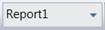
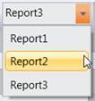

::: {style="DISPLAY: none"}
{#d2h_url_template} {#d2h_package_url style="WIDTH: 0px; DISPLAY: none; HEIGHT: 0px"}
:::

::::: {#nsbanner .d2h_main_nsbanner style="BORDER-BOTTOM: #999999 1px solid; POSITION: relative; PADDING-BOTTOM: 0px; BACKGROUND-COLOR: transparent; PADDING-LEFT: 0px; PADDING-RIGHT: 0px; DISPLAY: none; BORDER-TOP: #999999 1px solid; PADDING-TOP: 0px; LEFT: 0px"}
:::: {#TitleRow .d2h_main_titlerow style="PADDING-BOTTOM: 4px; BACKGROUND-COLOR: transparent; PADDING-LEFT: 22px; WIDTH: 100%; PADDING-RIGHT: 10px; DISPLAY: none; PADDING-TOP: 4px"}
::: {#ienav .d2h_main_ienav style="DISPLAY: none"}
{#D2HPrevious .D2HPreviousEnabled}  {#D2HNext .D2HNextEnabled}
:::
::::
:::::

:::: {#nstext .d2h_main_nstext style="PADDING-BOTTOM: 10px; BACKGROUND-COLOR: transparent; PADDING-LEFT: 22px; PADDING-RIGHT: 10px; HEIGHT: 100%; OVERFLOW: auto; PADDING-TOP: 5px" hasuserbackground="true" valign="bottom"}
::: {#d2h_breadcrumbs .d2h_breadcrumbs}
[Essential Studio User Guide Documentation](ms-xhelp:///?Id=12457748-09e3-4d74-a240-8e049cedf030){.d2h_breadcrumbsNormal} [ \> ]{.d2h_breadcrumbsLinkSeparator} [Business Intelligence Edition](ms-xhelp:///?Id=fdf33dd8-62b2-47b9-ad7b-fc50e590bca5){.d2h_breadcrumbsNormal} [ \> ]{.d2h_breadcrumbsLinkSeparator} [Essential BI WPF](ms-xhelp:///?Id=41e3d586-d922-4a01-8272-679fe4ae7343){.d2h_breadcrumbsNormal} [ \> ]{.d2h_breadcrumbsLinkSeparator} [Essential BI Client]{.d2h_breadcrumbsContentsOnly} [ \> ]{.d2h_breadcrumbsLinkSeparator} [Getting Started](ms-xhelp:///?Id=e2ccfc7e-65d6-4d37-b63a-4d82606af0e4){.d2h_breadcrumbsNormal} [ \> ]{.d2h_breadcrumbsLinkSeparator} [OLAP Client WPF Elements](ms-xhelp:///?Id=3a1e8d38-9b4a-4c83-89c0-4214cc149c24){.d2h_breadcrumbsNormal}
:::

### Report {#report style="tab-stops: 0pt"}

 

The OLAP Client Organizes the OLAP Report of the current session in Report List. Report List will hold all the reports of the current session of the OLAP Client. When we add a new report the report will be added to the report list. If we remove a list, the currently selected report will be removed from the report list.

{border="0"}

Figure 14: Report List

 

{border="0"}

Figure 15: Report List

 

More:

[ ]{#related-topics}

[{border="0" align="absMiddle"}On Report Selection Change](ms-xhelp:///?Id=9612ab9b-0886-4a79-bf0f-be6e14b820ef){style="TEXT-DECORATION: none"}

[{border="0" align="absMiddle"}Creating a new report](ms-xhelp:///?Id=bd9183d3-c075-49d2-994e-41791c69af8f){style="TEXT-DECORATION: none"}

[{border="0" align="absMiddle"}Adding Report](ms-xhelp:///?Id=087d2329-deef-41b1-b218-8800f4adcc6a){style="TEXT-DECORATION: none"}

[{border="0" align="absMiddle"}Renaming Report](ms-xhelp:///?Id=6b56643e-3900-459b-89d1-deb1ab797ee9){style="TEXT-DECORATION: none"}

[{border="0" align="absMiddle"}Removing Report](ms-xhelp:///?Id=91ab6769-147c-4321-9d48-0db3357ed43d){style="TEXT-DECORATION: none"}

[{border="0" align="absMiddle"}Saving Report](ms-xhelp:///?Id=f55792d4-92f5-4ddb-b2f0-dc7ae8a6f220){style="TEXT-DECORATION: none"}

[{border="0" align="absMiddle"}Saving As Report](ms-xhelp:///?Id=6afee5e9-a791-44c5-a81c-f9993abfec26){style="TEXT-DECORATION: none"}

[{border="0" align="absMiddle"}Loading Report](ms-xhelp:///?Id=4513f314-952c-4586-979c-e49651f9f983){style="TEXT-DECORATION: none"}

[{border="0" align="absMiddle"}ShowReportButtons](ms-xhelp:///?Id=d26625e6-31fc-4fe1-8f28-5d098c06b6a0){style="TEXT-DECORATION: none"}
::::
