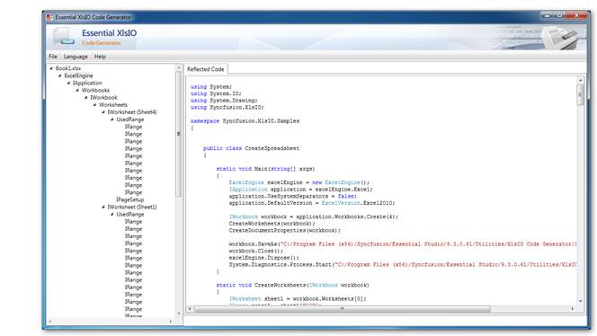

::: {style="DISPLAY: none"}
{#d2h_url_template}{#d2h_package_url style="WIDTH: 0px; DISPLAY: none; HEIGHT: 0px"}
:::

::::: {#nsbanner .d2h_main_nsbanner style="BORDER-BOTTOM: #999999 1px solid; POSITION: relative; PADDING-BOTTOM: 0px; BACKGROUND-COLOR: transparent; PADDING-LEFT: 0px; PADDING-RIGHT: 0px; DISPLAY: none; BORDER-TOP: #999999 1px solid; PADDING-TOP: 0px; LEFT: 0px"}
:::: {#TitleRow .d2h_main_titlerow style="PADDING-BOTTOM: 4px; BACKGROUND-COLOR: transparent; PADDING-LEFT: 22px; WIDTH: 100%; PADDING-RIGHT: 10px; DISPLAY: none; PADDING-TOP: 4px"}
::: {#ienav .d2h_main_ienav style="DISPLAY: none"}
{#D2HPrevious .D2HPreviousEnabled}  {#D2HNext .D2HNextEnabled}
:::
::::
:::::

:::: {#nstext .d2h_main_nstext style="PADDING-BOTTOM: 10px; BACKGROUND-COLOR: transparent; PADDING-LEFT: 22px; PADDING-RIGHT: 10px; HEIGHT: 100%; OVERFLOW: auto; PADDING-TOP: 5px" hasuserbackground="true" valign="bottom"}
::: {#d2h_breadcrumbs .d2h_breadcrumbs}
[Essential Studio User Guide Documentation](ms-xhelp:///?Id=12457748-09e3-4d74-a240-8e049cedf030){.d2h_breadcrumbsNormal}[ \> ]{.d2h_breadcrumbsLinkSeparator}[Essential Common](ms-xhelp:///?Id=2bfe10b6-fac1-4f91-a173-04db314f10c3){.d2h_breadcrumbsNormal}[ \> ]{.d2h_breadcrumbsLinkSeparator}[Add-ons](ms-xhelp:///?Id=bd6b1945-5009-4638-865b-b8cd9fc956dc){.d2h_breadcrumbsNormal}
:::

## Reporting Add-ons {#reporting-add-ons style="tab-stops: 0pt"}

Reporting Edition provides the following add-ons:

[·      ]{style="FONT-FAMILY: Symbol"}Document Explorer Utility

[·      ]{style="FONT-FAMILY: Symbol"}Formula Validator

[·      ]{style="FONT-FAMILY: Symbol"}XlsIO Code Generator

 

Document Explorer Utility

For details about Document Explorer utility, refer to [Document Explorer](ms-xhelp:///?Id=25c3be8f-2601-46c3-a58c-72def88a2811). 

 

Formula Validator

For details about Formula Validator, refer to [Formula Validator](ms-xhelp:///?Id=1632aaf6-f3bd-424f-b481-91e7485a6972).

 

XlsIO Code Generator

 

XlsIO Code Generator helps to generate the equivalent code using XlsIO API for the existing Excel documents that are generated using Essential XlsIO and MS Excel. The spreadsheets generated using the following MS Excel versions can be generated with code using XlsIO Code generator:

[·      ]{style="FONT-FAMILY: Symbol"}Excel 97- 2003 workbook\[xls\]

[·      ]{style="FONT-FAMILY: Symbol"}Excel Workbook\[2007 & 2010\]\[xlsx\]

[·      ]{style="FONT-FAMILY: Symbol"}Excel 97-2003 template\[xlt\]

[·      ]{style="FONT-FAMILY: Symbol"}Excel Workbook template\[xltx\]

 

The code can be generated for C# and VB languages.

{border="0"}

Figure 146: XlsIO Code Generator

 

Requirements

This utility requires Essential XlsIO WPF version installed in the machine to run.

Dependent assemblies are:

[·      ]{style="FONT-FAMILY: Symbol"}Syncfusion.Compression.Base

[·      ]{style="FONT-FAMILY: Symbol"}Syncfusion.XlsIO.Base

 

Usage

[·      ]{style="FONT-FAMILY: Symbol"}Spreadsheet Viewer

 

To generate the code for an Excel file, click **File**-\>**Open**. The entire spreadsheet is now open and available for generating the code in the **Code Viewer** Tab.

 

[·      ]{style="FONT-FAMILY: Symbol"}Spreadsheet Tree

 

The contents available in the spreadsheet will be split and converted to an equivalent code. These converted codes are then displayed in their hierarchy of implementation. By clicking on the particular node, the equivalent code will be generated and displayed in the Viewer tab.

 

[·      ]{style="FONT-FAMILY: Symbol"}Language

The generated code can be viewed in either VB or C#, which can be selected from the Menu bar.

 

[·      ]{style="FONT-FAMILY: Symbol"}Save

The generated code can be saved to the desired language by selecting the save option available under the file menu.

[]{#related-topics}
::::
