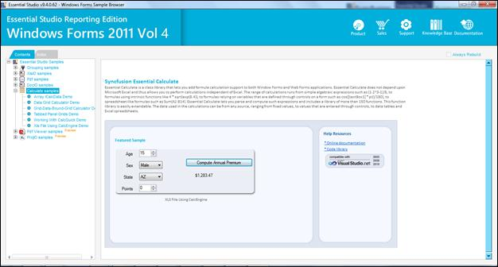
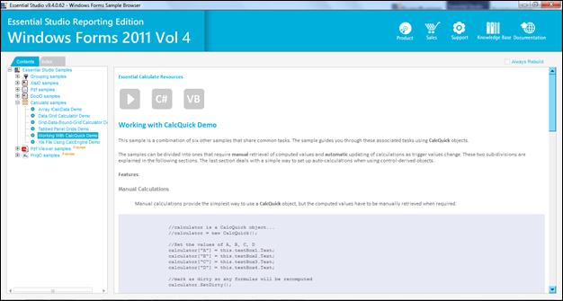

::: {style="DISPLAY: none"}
{#d2h_url_template}{#d2h_package_url style="WIDTH: 0px; DISPLAY: none; HEIGHT: 0px"}
:::

::: {.d2h_secondary_topic style="PADDING-BOTTOM: 10pt; MARGIN: 0pt; PADDING-LEFT: 0pt; PADDING-RIGHT: 0pt; PADDING-TOP: 0pt"}
#### Resetting Keys by using Calculate Engine {#resetting-keys-by-using-calculate-engine style="tab-stops: 0pt"}

This method provides support for resetting keys (which happens backend) using Calculate Engine.

The user can reset or clear the keys by using this method.

 

Samples Installation Location:

 

CalcQuick WF samples are installed under the following location:

C:\\Syncfusion\\EssentialStudio\\\<Version Number\>\\Windows\\Calculate.Windows\\Samples \\2.0\\Working With CalcQuick Demo

 

Viewing Samples:

1.   Follow steps 1 to 2 of viewing Windows samples in section **2.2 Samples and Installation**.

 

{border="0"}

Figure 32: WF Edition Sample Browser

 

2.   Select **Working With CalcQuick Demo** from the samples provided and browse through the features.

{border="0"}

Figure 33: Working With CalcQuick Demo

 

More:

[ ]{#related-topics}

[{border="0" align="absMiddle"}Methods](ms-xhelp:///?Id=fc0bd637-8e77-4b7b-a391-af1e2ff4155d){style="TEXT-DECORATION: none"}
:::
