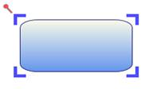

::: {style="DISPLAY: none"}
{#d2h_url_template}{#d2h_package_url style="WIDTH: 0px; DISPLAY: none; HEIGHT: 0px"}
:::

::::: {#nsbanner .d2h_main_nsbanner style="BORDER-BOTTOM: #999999 1px solid; POSITION: relative; PADDING-BOTTOM: 0px; BACKGROUND-COLOR: transparent; PADDING-LEFT: 0px; PADDING-RIGHT: 0px; DISPLAY: none; BORDER-TOP: #999999 1px solid; PADDING-TOP: 0px; LEFT: 0px"}
:::: {#TitleRow .d2h_main_titlerow style="PADDING-BOTTOM: 4px; BACKGROUND-COLOR: transparent; PADDING-LEFT: 22px; WIDTH: 100%; PADDING-RIGHT: 10px; DISPLAY: none; PADDING-TOP: 4px"}
::: {#ienav .d2h_main_ienav style="DISPLAY: none"}
{#D2HPrevious .D2HPreviousEnabled}  {#D2HNext .D2HNextEnabled}
:::
::::
:::::

::::: {#nstext .d2h_main_nstext style="PADDING-BOTTOM: 10px; BACKGROUND-COLOR: transparent; PADDING-LEFT: 22px; PADDING-RIGHT: 10px; HEIGHT: 100%; OVERFLOW: auto; PADDING-TOP: 5px" hasuserbackground="true" valign="bottom"}
::: {#d2h_breadcrumbs .d2h_breadcrumbs}
[Essential Studio User Guide Documentation](ms-xhelp:///?Id=12457748-09e3-4d74-a240-8e049cedf030){.d2h_breadcrumbsNormal}[ \> ]{.d2h_breadcrumbsLinkSeparator}[User Interface Edition](ms-xhelp:///?Id=c29296b7-531c-413b-a0ec-488ca1f7f669){.d2h_breadcrumbsNormal}[ \> ]{.d2h_breadcrumbsLinkSeparator}[Essential WPF](ms-xhelp:///?Id=7f4f82c5-151c-4262-94d0-75c4626c77bc){.d2h_breadcrumbsNormal}[ \> ]{.d2h_breadcrumbsLinkSeparator}[Essential Diagram]{.d2h_breadcrumbsContentsOnly}[ \> ]{.d2h_breadcrumbsLinkSeparator}[Concepts and Features](ms-xhelp:///?Id=8625d466-6e21-495a-b811-4ecee754da81){.d2h_breadcrumbsNormal}[ \> ]{.d2h_breadcrumbsLinkSeparator}[Nodes](ms-xhelp:///?Id=7e75e8aa-0313-4d05-b2e7-d5794d3d90fd){.d2h_breadcrumbsNormal}
:::

### Resize Handler Customization {#resize-handler-customization style="tab-stops: 0pt"}

This feature provides different styles for Resize Handler. This enables you to customize the complete look and feel of the eight resize handler.

 

Use Case Scenarios

The appearance of the Resizer Handler can be effectively changed by applying different styles to the Thumb, using the Resize Handler Customization. 

 

Creating Custom Style for Resize Handler

The Resize Handler consists of eight Resizer Thumbs. You can set different styles to a ResizerThumb by using the Resize Handler Properties.

 

Follow the below steps to create custom styles for Resize Handler.

Step1: Creating Style for ResizerThumb

Prepare styles with template for each ResizerThumb.

     

[·      ]{style="FONT-FAMILY: Symbol"}Through XAML.

The following code illustrates how to create the style for ResizerThumb

 

+-----------------------------------------------------------------------------------------------------------------------------------------------------------------------------------------------------------------------------------------------------------------------------------------------------------------------------------------------------------------------------------------------------------------------------------------------------------------------+
| **[\[XAML\]]{style="FONT-FAMILY: 'Courier New'"}**                                                                                                                                                                                                                                                                                                                                                                                                                    |
|                                                                                                                                                                                                                                                                                                                                                                                                                                                                       |
| **[]{style="FONT-FAMILY: 'Courier New'"}**                                                                                                                                                                                                                                                                                                                                                                                                                            |
|                                                                                                                                                                                                                                                                                                                                                                                                                                                                       |
| [      [\<]{style="COLOR: blue"}[Style ]{style="COLOR: #a31515"}[x]{style="COLOR: red"}[:]{style="COLOR: blue"}[Key]{style="COLOR: red"}[=\"TopLeftCornerResizerThump\"]{style="COLOR: blue"} [ TargetType]{style="COLOR: red"}[=\"syncfusion:ResizerThumb\" \>]{style="COLOR: blue"}]{style="FONT-FAMILY: 'Courier New'"}                                                                                                                                            |
|                                                                                                                                                                                                                                                                                                                                                                                                                                                                       |
| [      [   ]{style="COLOR: #a31515"}[\<]{style="COLOR: blue"}[Setter]{style="COLOR: #a31515"}[ Property]{style="COLOR: red"}[=\"SnapsToDevicePixels\"]{style="COLOR: blue"}[ Value]{style="COLOR: red"}[=\"True\"/\>]{style="COLOR: blue"}]{style="FONT-FAMILY: 'Courier New'"}                                                                                                                                                                                       |
|                                                                                                                                                                                                                                                                                                                                                                                                                                                                       |
| [      [   ]{style="COLOR: #a31515"}[\<]{style="COLOR: blue"}[Setter]{style="COLOR: #a31515"}[ Property]{style="COLOR: red"}[=\"OverridesDefaultStyle\"]{style="COLOR: blue"}[ Value]{style="COLOR: red"}[=\"true\"/\>]{style="COLOR: blue"}]{style="FONT-FAMILY: 'Courier New'"}                                                                                                                                                                                     |
|                                                                                                                                                                                                                                                                                                                                                                                                                                                                       |
| [      [   ]{style="COLOR: #a31515"}[\<]{style="COLOR: blue"}[Setter]{style="COLOR: #a31515"}[ Property]{style="COLOR: red"}[=\"IsTabStop\"]{style="COLOR: blue"}[ Value]{style="COLOR: red"}[=\"false\"/\>]{style="COLOR: blue"}]{style="FONT-FAMILY: 'Courier New'"}                                                                                                                                                                                                |
|                                                                                                                                                                                                                                                                                                                                                                                                                                                                       |
| [      [   ]{style="COLOR: #a31515"}[\<]{style="COLOR: blue"}[Setter]{style="COLOR: #a31515"}[ Property]{style="COLOR: red"}[=\"Focusable\"]{style="COLOR: blue"}[ Value]{style="COLOR: red"}[=\"false\"/\>]{style="COLOR: blue"}]{style="FONT-FAMILY: 'Courier New'"}                                                                                                                                                                                                |
|                                                                                                                                                                                                                                                                                                                                                                                                                                                                       |
| [      [   ]{style="COLOR: #a31515"}[\<]{style="COLOR: blue"}[Setter]{style="COLOR: #a31515"}[ Property]{style="COLOR: red"}[=\"Height\"]{style="COLOR: blue"}[ Value]{style="COLOR: red"}[=\"15\"/\>]{style="COLOR: blue"}]{style="FONT-FAMILY: 'Courier New'"}                                                                                                                                                                                                      |
|                                                                                                                                                                                                                                                                                                                                                                                                                                                                       |
| [      [   ]{style="COLOR: #a31515"}[\<]{style="COLOR: blue"}[Setter]{style="COLOR: #a31515"}[ Property]{style="COLOR: red"}[=\"Width\"]{style="COLOR: blue"}[ Value]{style="COLOR: red"}[=\"15\"/\>]{style="COLOR: blue"}]{style="FONT-FAMILY: 'Courier New'"}                                                                                                                                                                                                       |
|                                                                                                                                                                                                                                                                                                                                                                                                                                                                       |
| [      [   ]{style="COLOR: #a31515"}[\<]{style="COLOR: blue"}[Setter]{style="COLOR: #a31515"}[ Property]{style="COLOR: red"}[=\"Cursor\"]{style="COLOR: blue"}[ Value]{style="COLOR: red"}[=\"SizeNWSE\"/\>]{style="COLOR: blue"}]{style="FONT-FAMILY: 'Courier New'"}                                                                                                                                                                                                |
|                                                                                                                                                                                                                                                                                                                                                                                                                                                                       |
| [      [   ]{style="COLOR: #a31515"}[\<]{style="COLOR: blue"}[Setter]{style="COLOR: #a31515"}[ Property]{style="COLOR: red"}[=\"Margin\"]{style="COLOR: blue"}[ Value]{style="COLOR: red"}[=\"-3 -3 0 0\"/\>]{style="COLOR: blue"}]{style="FONT-FAMILY: 'Courier New'"}                                                                                                                                                                                               |
|                                                                                                                                                                                                                                                                                                                                                                                                                                                                       |
| [      [   ]{style="COLOR: #a31515"}[\<]{style="COLOR: blue"}[Setter]{style="COLOR: #a31515"}[ Property]{style="COLOR: red"}[=\"VerticalAlignment\"]{style="COLOR: blue"}[ Value]{style="COLOR: red"}[=\"Top\"/\>]{style="COLOR: blue"}]{style="FONT-FAMILY: 'Courier New'"}                                                                                                                                                                                          |
|                                                                                                                                                                                                                                                                                                                                                                                                                                                                       |
| [      [   ]{style="COLOR: #a31515"}[\<]{style="COLOR: blue"}[Setter]{style="COLOR: #a31515"}[ Property]{style="COLOR: red"}[=\"HorizontalAlignment\"]{style="COLOR: blue"}[ Value]{style="COLOR: red"}[=\"Left\"/\>]{style="COLOR: blue"}]{style="FONT-FAMILY: 'Courier New'"}                                                                                                                                                                                       |
|                                                                                                                                                                                                                                                                                                                                                                                                                                                                       |
| [      [    ]{style="COLOR: #a31515"}[\<]{style="COLOR: blue"}[Setter]{style="COLOR: #a31515"}[ Property]{style="COLOR: red"}[=\"Template\"\>]{style="COLOR: blue"}]{style="FONT-FAMILY: 'Courier New'"}                                                                                                                                                                                                                                                              |
|                                                                                                                                                                                                                                                                                                                                                                                                                                                                       |
| [      [    ]{style="COLOR: #a31515"}[\<]{style="COLOR: blue"}[Setter.Value]{style="COLOR: #a31515"}[\>]{style="COLOR: blue"}]{style="FONT-FAMILY: 'Courier New'"}                                                                                                                                                                                                                                                                                                    |
|                                                                                                                                                                                                                                                                                                                                                                                                                                                                       |
| [      [      ]{style="COLOR: #a31515"}[\<]{style="COLOR: blue"}[ControlTemplate]{style="COLOR: #a31515"}[ TargetType]{style="COLOR: red"}[=\"syncfusion:ResizerThumb\"\>]{style="COLOR: blue"}]{style="FONT-FAMILY: 'Courier New'"}                                                                                                                                                                                                                                  |
|                                                                                                                                                                                                                                                                                                                                                                                                                                                                       |
| [      [         ]{style="COLOR: #a31515"}[\<]{style="COLOR: blue"}[Grid]{style="COLOR: #a31515"}[\>]{style="COLOR: blue"}]{style="FONT-FAMILY: 'Courier New'"}                                                                                                                                                                                                                                                                                                       |
|                                                                                                                                                                                                                                                                                                                                                                                                                                                                       |
| [      [          ]{style="COLOR: #a31515"}[\<]{style="COLOR: blue"}[Rectangle]{style="COLOR: #a31515"}[ HorizontalAlignment]{style="COLOR: red"}[=\"Stretch\" ]{style="COLOR: blue"}[Margin]{style="COLOR: red"}[=\"{]{style="COLOR: blue"}[TemplateBinding]{style="COLOR: #a31515"}[ Margin]{style="COLOR: red"}[}\"]{style="COLOR: blue"}]{style="FONT-FAMILY: 'Courier New'"}                                                                                     |
|                                                                                                                                                                                                                                                                                                                                                                                                                                                                       |
| [      ]{style="FONT-FAMILY: 'Courier New'; COLOR: red"}[         [   VerticalAlignment]{style="COLOR: red"}[=\"{]{style="COLOR: blue"}[TemplateBinding]{style="COLOR: #a31515"}[ VerticalAlignment]{style="COLOR: red"}[}\" ]{style="COLOR: blue"}[StrokeDashCap]{style="COLOR: red"}[=\"Flat\"                                       ]{style="COLOR: blue"}[     ]{style="COLOR: red"}             [     ]{style="COLOR: red"}]{style="FONT-FAMILY: 'Courier New'"} |
|                                                                                                                                                                                                                                                                                                                                                                                                                                                                       |
| [      [            Cursor]{style="COLOR: red"}[=\"{]{style="COLOR: blue"}[TemplateBinding]{style="COLOR: #a31515"}[ Cursor]{style="COLOR: red"}[}\" ]{style="COLOR: blue"}[x]{style="COLOR: red"}[:]{style="COLOR: blue"}[Name]{style="COLOR: red"}[=\"PART_ReseizerThumb3\" ]{style="COLOR: blue"}[Stroke]{style="COLOR: red"}[=\"Blue\"]{style="COLOR: blue"}]{style="FONT-FAMILY: 'Courier New'"}                                                                 |
|                                                                                                                                                                                                                                                                                                                                                                                                                                                                       |
| [                  StrokeStartLineCap]{style="FONT-FAMILY: 'Courier New'; COLOR: red"}[=\"Round\" ]{style="FONT-FAMILY: 'Courier New'; COLOR: blue"}[StrokeThickness]{style="FONT-FAMILY: 'Courier New'; COLOR: red"}[=\"5\"/\>]{style="FONT-FAMILY: 'Courier New'; COLOR: blue"}[]{style="FONT-FAMILY: 'Courier New'; COLOR: red"}                                                                                                                                   |
|                                                                                                                                                                                                                                                                                                                                                                                                                                                                       |
| [      [          ]{style="COLOR: #a31515"}[\<]{style="COLOR: blue"}[Rectangle]{style="COLOR: #a31515"}[ HorizontalAlignment]{style="COLOR: red"}[=\"{]{style="COLOR: blue"}[TemplateBinding]{style="COLOR: #a31515"}[ HorizontalAlignment]{style="COLOR: red"}[}\"]{style="COLOR: blue"}]{style="FONT-FAMILY: 'Courier New'"}                                                                                                                                        |
|                                                                                                                                                                                                                                                                                                                                                                                                                                                                       |
| [               [   VerticalAlignment]{style="COLOR: red"}[=\"Stretch\"]{style="COLOR: blue"}[ Cursor]{style="COLOR: red"}[=\"{]{style="COLOR: blue"}[TemplateBinding]{style="COLOR: #a31515"}[ Cursor]{style="COLOR: red"}[}\" ]{style="COLOR: blue"}[Stroke]{style="COLOR: red"}[=\"Blue\"]{style="COLOR: blue"}]{style="FONT-FAMILY: 'Courier New'"}                                                                                                               |
|                                                                                                                                                                                                                                                                                                                                                                                                                                                                       |
| [      ]{style="FONT-FAMILY: 'Courier New'; COLOR: red"}[            [x]{style="COLOR: red"}[:]{style="COLOR: blue"}[Name]{style="COLOR: red"}[=\"PART_ReseizerThumb2\"]{style="COLOR: blue"} [ StrokeDashCap]{style="COLOR: red"}[=\"Flat\"]{style="COLOR: blue"}[ StrokeThickness]{style="COLOR: red"}[=\"5\"]{style="COLOR: blue"}[      ]{style="COLOR: red"}]{style="FONT-FAMILY: 'Courier New'"}                                                                |
|                                                                                                                                                                                                                                                                                                                                                                                                                                                                       |
| [      [            StrokeStartLineCap]{style="COLOR: red"}[=\"Round\"]{style="COLOR: blue"}[ Margin]{style="COLOR: red"}[=\"{]{style="COLOR: blue"}[TemplateBinding]{style="COLOR: #a31515"}[ Margin]{style="COLOR: red"}[}\"/\>]{style="COLOR: blue"}]{style="FONT-FAMILY: 'Courier New'"}                                                                                                                                                                          |
|                                                                                                                                                                                                                                                                                                                                                                                                                                                                       |
| [      [           ]{style="COLOR: #a31515"}[\</]{style="COLOR: blue"}[Grid]{style="COLOR: #a31515"}[\>]{style="COLOR: blue"}]{style="FONT-FAMILY: 'Courier New'"}                                                                                                                                                                                                                                                                                                    |
|                                                                                                                                                                                                                                                                                                                                                                                                                                                                       |
| [      [         ]{style="COLOR: #a31515"}[\</]{style="COLOR: blue"}[ControlTemplate]{style="COLOR: #a31515"}[\>]{style="COLOR: blue"}]{style="FONT-FAMILY: 'Courier New'"}                                                                                                                                                                                                                                                                                           |
|                                                                                                                                                                                                                                                                                                                                                                                                                                                                       |
| [      [     ]{style="COLOR: #a31515"}[\</]{style="COLOR: blue"}[Setter.Value]{style="COLOR: #a31515"}[\>]{style="COLOR: blue"}]{style="FONT-FAMILY: 'Courier New'"}                                                                                                                                                                                                                                                                                                  |
|                                                                                                                                                                                                                                                                                                                                                                                                                                                                       |
| [      ]{style="FONT-FAMILY: 'Courier New'; COLOR: blue"}[  ]{style="FONT-FAMILY: 'Courier New'; COLOR: #a31515"}[\</]{style="FONT-FAMILY: 'Courier New'; COLOR: blue"}[Setter]{style="FONT-FAMILY: 'Courier New'; COLOR: #a31515"}[\>]{style="FONT-FAMILY: 'Courier New'; COLOR: blue"}                                                                                                                                                                              |
|                                                                                                                                                                                                                                                                                                                                                                                                                                                                       |
| [\</]{style="FONT-FAMILY: 'Courier New'; COLOR: blue"}[Style]{style="FONT-FAMILY: 'Courier New'; COLOR: #a31515"}[\>]{style="FONT-FAMILY: 'Courier New'; COLOR: blue"}[]{style="FONT-FAMILY: 'Courier New'"}                                                                                                                                                                                                                                                          |
+-----------------------------------------------------------------------------------------------------------------------------------------------------------------------------------------------------------------------------------------------------------------------------------------------------------------------------------------------------------------------------------------------------------------------------------------------------------------------+

 

Step2:  Assign the Style to Node

[·      ]{style="FONT-FAMILY: Symbol"}Through XAML.

 

The following code illustrates how to assign the Resize Handler Style to Node

+---------------------------------------------------------------------------------------------------------------------------------------------------------------------------------------------------------------------------------------------------------------------------------------------------------------------------------------------------------------------------------------------------------------------------------------------------------------------------------------------------------------------------------------------------+
| **[\[XAML\]]{style="FONT-FAMILY: 'Courier New'"}**                                                                                                                                                                                                                                                                                                                                                                                                                                                                                                |
|                                                                                                                                                                                                                                                                                                                                                                                                                                                                                                                                                   |
| [      ]{style="FONT-FAMILY: 'Courier New'"}                                                                                                                                                                                                                                                                                                                                                                                                                                                                                                      |
|                                                                                                                                                                                                                                                                                                                                                                                                                                                                                                                                                   |
| [      \<]{style="FONT-FAMILY: 'Courier New'; COLOR: blue"}[Style]{style="FONT-FAMILY: 'Courier New'; COLOR: #a31515"}[ TargetType]{style="FONT-FAMILY: 'Courier New'; COLOR: red"}[=\"syncfusion:Node\"\>]{style="FONT-FAMILY: 'Courier New'; COLOR: blue"}                                                                                                                                                                                                                                                                                      |
|                                                                                                                                                                                                                                                                                                                                                                                                                                                                                                                                                   |
| [      \<]{style="FONT-FAMILY: 'Courier New'; COLOR: blue"}[Setter]{style="FONT-FAMILY: 'Courier New'; COLOR: #a31515"}[ Property]{style="FONT-FAMILY: 'Courier New'; COLOR: red"}[=\"TopResizer\"]{style="FONT-FAMILY: 'Courier New'; COLOR: blue"}[ Value]{style="FONT-FAMILY: 'Courier New'; COLOR: red"}[=\"{]{style="FONT-FAMILY: 'Courier New'; COLOR: blue"}[StaticResource]{style="FONT-FAMILY: 'Courier New'; COLOR: #a31515"}[ [ TopResizerThump]{style="COLOR: red"}[}\"/\>]{style="COLOR: blue"}]{style="FONT-FAMILY: 'Courier New'"} |
|                                                                                                                                                                                                                                                                                                                                                                                                                                                                                                                                                   |
| [      [\<]{style="COLOR: blue"}[Setter]{style="COLOR: #a31515"}[ Property]{style="COLOR: red"}[=\"LeftResizer\"]{style="COLOR: blue"}[ Value]{style="COLOR: red"}[=\"{]{style="COLOR: blue"}[StaticResource]{style="COLOR: #a31515"}[ LeftResizerThump]{style="COLOR: red"}[}\"/\>]{style="COLOR: blue"}]{style="FONT-FAMILY: 'Courier New'"}                                                                                                                                                                                                    |
|                                                                                                                                                                                                                                                                                                                                                                                                                                                                                                                                                   |
| [      [\<]{style="COLOR: blue"}[Setter]{style="COLOR: #a31515"}[ Property]{style="COLOR: red"}[=\"RightResizer\"]{style="COLOR: blue"}[ Value]{style="COLOR: red"}[=\"{]{style="COLOR: blue"}[StaticResource]{style="COLOR: #a31515"}[ RightResizerThump]{style="COLOR: red"}[}\"/\>]{style="COLOR: blue"}]{style="FONT-FAMILY: 'Courier New'"}                                                                                                                                                                                                  |
|                                                                                                                                                                                                                                                                                                                                                                                                                                                                                                                                                   |
| [      [\<]{style="COLOR: blue"}[Setter]{style="COLOR: #a31515"}[ Property]{style="COLOR: red"}[=\"BottomResizer\"]{style="COLOR: blue"}[ Value]{style="COLOR: red"}[=\"{]{style="COLOR: blue"}[StaticResource]{style="COLOR: #a31515"}[ BottomResizerThump]{style="COLOR: red"}[}\"/\>]{style="COLOR: blue"}]{style="FONT-FAMILY: 'Courier New'"}                                                                                                                                                                                                |
|                                                                                                                                                                                                                                                                                                                                                                                                                                                                                                                                                   |
| [      [\<]{style="COLOR: blue"}[Setter]{style="COLOR: #a31515"}[ Property]{style="COLOR: red"}[=\"TopLeftCornerResizer\"]{style="COLOR: blue"}[ Value]{style="COLOR: red"}[=\"{]{style="COLOR: blue"}[StaticResource ]{style="COLOR: #a31515"}[TopLeftCornerResizerThump]{style="COLOR: red"}[}\"/\>]{style="COLOR: blue"}]{style="FONT-FAMILY: 'Courier New'"}                                                                                                                                                                                  |
|                                                                                                                                                                                                                                                                                                                                                                                                                                                                                                                                                   |
| [      [\<]{style="COLOR: blue"}[Setter]{style="COLOR: #a31515"}[ Property]{style="COLOR: red"}[=\"TopRightCornerResizer\"]{style="COLOR: blue"} [Value]{style="COLOR: red"}[=\"{]{style="COLOR: blue"}[StaticResource]{style="COLOR: #a31515"}[ TopRightCornerResizerThump]{style="COLOR: red"}[}\"/\>]{style="COLOR: blue"}]{style="FONT-FAMILY: 'Courier New'"}                                                                                                                                                                                |
|                                                                                                                                                                                                                                                                                                                                                                                                                                                                                                                                                   |
| [      [\<]{style="COLOR: blue"}[Setter]{style="COLOR: #a31515"}[ Property]{style="COLOR: red"}[=\"BottomLeftCornerResizer\"]{style="COLOR: blue"}[ Value]{style="COLOR: red"}[=\"{]{style="COLOR: blue"}[StaticResource]{style="COLOR: #a31515"}[ BottomLeftCornerResizerThump]{style="COLOR: red"}[}\"/\>]{style="COLOR: blue"}]{style="FONT-FAMILY: 'Courier New'"}                                                                                                                                                                            |
|                                                                                                                                                                                                                                                                                                                                                                                                                                                                                                                                                   |
| [      \<]{style="FONT-FAMILY: 'Courier New'; COLOR: blue"}[Setter]{style="FONT-FAMILY: 'Courier New'; COLOR: #a31515"}[ Property]{style="FONT-FAMILY: 'Courier New'; COLOR: red"}[=\"BottomRightCornerResizer\"]{style="FONT-FAMILY: 'Courier New'; COLOR: blue"}[ [Value]{style="COLOR: red"}[=\"{]{style="COLOR: blue"}[StaticResource]{style="COLOR: #a31515"}[ BottomRightCornerResizerThump]{style="COLOR: red"}[}\"/\>]{style="COLOR: blue"}]{style="FONT-FAMILY: 'Courier New'"}                                                          |
|                                                                                                                                                                                                                                                                                                                                                                                                                                                                                                                                                   |
| [\</]{style="FONT-FAMILY: 'Courier New'; COLOR: blue"}[Style]{style="FONT-FAMILY: 'Courier New'; COLOR: #a31515"}[\>]{style="FONT-FAMILY: 'Courier New'; COLOR: blue"}[]{style="FONT-FAMILY: 'Courier New'"}                                                                                                                                                                                                                                                                                                                                      |
+---------------------------------------------------------------------------------------------------------------------------------------------------------------------------------------------------------------------------------------------------------------------------------------------------------------------------------------------------------------------------------------------------------------------------------------------------------------------------------------------------------------------------------------------------+

 

[·      ]{style="FONT-FAMILY: Symbol"}Through Code behind\[C#\]

 

The following code illustrates how to assign the Resize Handler Style to Node

+----------------------------------------------------------------------------------------------------------------------------------------------------------------------------------------------------------------------------------------------------------------------------+
| **[\[C#\]]{style="FONT-FAMILY: 'Courier New'; COLOR: black"}**[ ]{style="FONT-FAMILY: 'Courier New'; COLOR: #2b91af"}                                                                                                                                                      |
|                                                                                                                                                                                                                                                                            |
| []{style="FONT-FAMILY: 'Courier New'; COLOR: #2b91af"}                                                                                                                                                                                                                     |
|                                                                                                                                                                                                                                                                            |
| [Node]{style="FONT-FAMILY: 'Courier New'; COLOR: #2b91af"}[ n = shape [as]{style="COLOR: blue"} [Node]{style="COLOR: #2b91af"}; ]{style="FONT-FAMILY: 'Courier New'"}[]{style="FONT-FAMILY: 'Courier New'; COLOR: #2b91af"}                                                |
|                                                                                                                                                                                                                                                                            |
| [n.TopResizer = [this.]{style="COLOR: #2b91af"}Resources\[[\"TopResizerThump\"]{style="COLOR: #a31515"}\] [as]{style="COLOR: blue"} [Style]{style="COLOR: #2b91af"};]{style="FONT-FAMILY: 'Courier New'"}[]{style="FONT-FAMILY: 'Courier New'; COLOR: #2b91af"}            |
|                                                                                                                                                                                                                                                                            |
| [n.LeftResizer =[this]{style="COLOR: #4bacc6"}.Resources\[[\"LeftResizerThump\"]{style="COLOR: #a31515"}\] [as]{style="COLOR: blue"} [Style]{style="COLOR: #2b91af"};]{style="FONT-FAMILY: 'Courier New'"}                                                                 |
|                                                                                                                                                                                                                                                                            |
| [n.RightResizer =[this]{style="COLOR: #4bacc6"}.Resources\[[\"RightResizerThump\"]{style="COLOR: #a31515"}\] [as]{style="COLOR: blue"} [Style]{style="COLOR: #2b91af"};]{style="FONT-FAMILY: 'Courier New'"}                                                               |
|                                                                                                                                                                                                                                                                            |
| [n.BottomResizer =[this]{style="COLOR: #4bacc6"}.Resources\[[\"BottomResizerThump\"]{style="COLOR: #a31515"}\] [as]{style="COLOR: blue"} [Style]{style="COLOR: #2b91af"};]{style="FONT-FAMILY: 'Courier New'"}                                                             |
|                                                                                                                                                                                                                                                                            |
| [n.TopLeftCornerResizer =[this]{style="COLOR: #4bacc6"}.Resources\[[\"TopLeftCornerResizerThump\"]{style="COLOR: #a31515"}\] [as]{style="COLOR: blue"} [Style]{style="COLOR: #2b91af"};]{style="FONT-FAMILY: 'Courier New'"}                                               |
|                                                                                                                                                                                                                                                                            |
| [n.TopRightCornerResizer =[this]{style="COLOR: #4bacc6"}.Resources\[[\"TopRightCornerResizerThump\"]{style="COLOR: #a31515"}\] [as]{style="COLOR: blue"} [Style]{style="COLOR: #2b91af"};]{style="FONT-FAMILY: 'Courier New'"}                                             |
|                                                                                                                                                                                                                                                                            |
| [n.BottomLeftCornerResizer =[this]{style="COLOR: #4bacc6"}.Resources\[[\"BottomLeftCornerResizerThump\"]{style="COLOR: #a31515"}\] [as]{style="COLOR: blue"} [Style]{style="COLOR: #2b91af"};]{style="FONT-FAMILY: 'Courier New'"}                                         |
|                                                                                                                                                                                                                                                                            |
| [n.BottomRightCornerResizer =[this]{style="COLOR: #4bacc6"}.Resources\[[\"BottomRightCornerResizerThump\"]{style="COLOR: #a31515"}\] [as]{style="COLOR: blue"} [Style]{style="COLOR: #2b91af"};]{style="FONT-FAMILY: 'Courier New'"}[]{style="FONT-FAMILY: 'Courier New'"} |
+----------------------------------------------------------------------------------------------------------------------------------------------------------------------------------------------------------------------------------------------------------------------------+

 

+---------------------------------------------------------------------------------------------------------------------------------------------------------------------------------------------------------------------------------+
| **[\[VB\]]{style="FONT-FAMILY: 'Courier New'; COLOR: black"}**[ ]{style="FONT-FAMILY: 'Courier New'; COLOR: #2b91af"}                                                                                                           |
|                                                                                                                                                                                                                                 |
| []{style="FONT-FAMILY: 'Courier New'; COLOR: blue"}                                                                                                                                                                             |
|                                                                                                                                                                                                                                 |
| [Dim]{style="FONT-FAMILY: 'Courier New'; COLOR: blue"}[ n [As]{style="COLOR: blue"} [Node]{style="COLOR: #2b91af"} = [TryCast]{style="COLOR: blue"}(Shape, [Node]{style="COLOR: #2b91af"})]{style="FONT-FAMILY: 'Courier New'"} |
|                                                                                                                                                                                                                                 |
| [n.TopResizer = [TryCast]{style="COLOR: blue"}(Me.Resources(\"TopResizerThump\"), Style)]{style="FONT-FAMILY: 'Courier New'"}                                                                                                   |
|                                                                                                                                                                                                                                 |
| [n.LeftResizer =TryCast(Me.Resources(\"LeftResizerThump\"), Style)]{style="FONT-FAMILY: 'Courier New'"}                                                                                                                         |
|                                                                                                                                                                                                                                 |
| [n.RightResizer =TryCast(Me.Resources(\"RightResizerThump\"), Style)]{style="FONT-FAMILY: 'Courier New'"}                                                                                                                       |
|                                                                                                                                                                                                                                 |
| [n.BottomResizer =TryCast(Me.Resources(\"BottomResizerThump\"), Style)]{style="FONT-FAMILY: 'Courier New'"}                                                                                                                     |
|                                                                                                                                                                                                                                 |
| [n.TopLeftCornerResizer =TryCast(Me.Resources(\"TopLeftCornerResizerThump\"), Style)]{style="FONT-FAMILY: 'Courier New'"}                                                                                                       |
|                                                                                                                                                                                                                                 |
| [n.TopRightCornerResizer =TryCast(Me.Resources(\"TopRightCornerResizerThump\"), Style)]{style="FONT-FAMILY: 'Courier New'"}                                                                                                     |
|                                                                                                                                                                                                                                 |
| [n.BottomLeftCornerResizer =TryCast(Me.Resources(\"BottomLeftCornerResizerThump\"), Style)]{style="FONT-FAMILY: 'Courier New'"}                                                                                                 |
|                                                                                                                                                                                                                                 |
| [n.BottomRightCornerResizer =TryCast(Me.Resources(\"BottomRightCornerResizerThump\"), Style)]{style="FONT-FAMILY: 'Courier New'"}[]{style="FONT-FAMILY: 'Courier New'"}                                                         |
+---------------------------------------------------------------------------------------------------------------------------------------------------------------------------------------------------------------------------------+

 

Setting ResizerThumb Template as null

ResizerThumb will not be visible When the ResizerThumb Template value as Null

 

The following code illustrates how to set the ResizerThumb Template to Null

+--------------------------------------------------------------------------------------------------------------------------------------------------------------------------------------------------------------------------------------------------------------------------------------------------------------------------------------------------------------------------------------------------------------------------------------------------------------------------------------------------------------------------------------------------------------------------------------------------------------------+
| **[\[XMAL\]]{style="FONT-FAMILY: 'Courier New'"}**                                                                                                                                                                                                                                                                                                                                                                                                                                                                                                                                                                 |
|                                                                                                                                                                                                                                                                                                                                                                                                                                                                                                                                                                                                                    |
| **[]{style="FONT-FAMILY: 'Courier New'"}**                                                                                                                                                                                                                                                                                                                                                                                                                                                                                                                                                                         |
|                                                                                                                                                                                                                                                                                                                                                                                                                                                                                                                                                                                                                    |
| [      \<]{style="FONT-FAMILY: 'Courier New'; COLOR: blue"}[Style]{style="FONT-FAMILY: 'Courier New'; COLOR: #a31515"}[ x]{style="FONT-FAMILY: 'Courier New'; COLOR: red"}[:]{style="FONT-FAMILY: 'Courier New'; COLOR: blue"}[Key]{style="FONT-FAMILY: 'Courier New'; COLOR: red"}[=\"TopResizerThump\"]{style="FONT-FAMILY: 'Courier New'; COLOR: blue"}[ TargetType]{style="FONT-FAMILY: 'Courier New'; COLOR: red"}[=\"syncfusion:ResizerThumb\"\>]{style="FONT-FAMILY: 'Courier New'; COLOR: blue"}[ ]{style="FONT-FAMILY: 'Courier New'; COLOR: #a31515"}[]{style="FONT-FAMILY: 'Courier New'; COLOR: blue"} |
|                                                                                                                                                                                                                                                                                                                                                                                                                                                                                                                                                                                                                    |
| [      [       \<]{style="COLOR: blue"}[Setter]{style="COLOR: #a31515"}[ Property]{style="COLOR: red"}[=\"Template\"]{style="COLOR: blue"}[ Value]{style="COLOR: red"}[=\"{]{style="COLOR: blue"}[x]{style="COLOR: #a31515"}[:]{style="COLOR: blue"}[Null]{style="COLOR: #a31515"}[}\"\>]{style="COLOR: blue"}]{style="FONT-FAMILY: 'Courier New'"}                                                                                                                                                                                                                                                                |
|                                                                                                                                                                                                                                                                                                                                                                                                                                                                                                                                                                                                                    |
| [      ]{style="FONT-FAMILY: 'Courier New'; COLOR: blue"}[       ]{style="FONT-FAMILY: 'Courier New'; COLOR: #a31515"}[\</]{style="FONT-FAMILY: 'Courier New'; COLOR: blue"}[Setter]{style="FONT-FAMILY: 'Courier New'; COLOR: #a31515"}[\>]{style="FONT-FAMILY: 'Courier New'; COLOR: blue"}                                                                                                                                                                                                                                                                                                                      |
|                                                                                                                                                                                                                                                                                                                                                                                                                                                                                                                                                                                                                    |
| [\</]{style="FONT-FAMILY: 'Courier New'; COLOR: blue"}[Style]{style="FONT-FAMILY: 'Courier New'; COLOR: #a31515"}[\>]{style="FONT-FAMILY: 'Courier New'; COLOR: blue"}[]{style="FONT-FAMILY: 'Courier New'"}                                                                                                                                                                                                                                                                                                                                                                                                       |
+--------------------------------------------------------------------------------------------------------------------------------------------------------------------------------------------------------------------------------------------------------------------------------------------------------------------------------------------------------------------------------------------------------------------------------------------------------------------------------------------------------------------------------------------------------------------------------------------------------------------+

 

Following is a sample screenshot of customized resizer that has only four corners.

{border="0"}

Figure 49:Custom Style

 

Tables for Properties, Methods, and Events

 

Properties

 

Table 27: ResizeHandler Property/ies Table

::: {align="center"}
  -------------------- --------------------------------------------------------------------- --------------------- --------------------------------- ------------------------------
  Property             Description                                                            Type                 Data Type                         Reference links
  TopResizer           Gets or sets a value of TopResizer Style for Resize Handler           Dependency property   Style[]{style="COLOR: #c00000"}   No[]{style="COLOR: #c00000"}
  BottomResizer        Gets or sets a value of BottomResizer Style for Resize Handler        Dependency property   Style                             No
  LeftResizer          Gets or sets a value of LeftResizer Style for  Resize Handler         Dependency property   Style                             No
  RightResizer         Gets or sets a value of RightResizer Style for Resize Handle          Dependency property   Style                             No
  TopLeftResizer       Gets or sets a value of TopLeftResizer Style for Resize Handler       Dependency property   Style                             No
  TopRightResizer      Gets or sets a value of TopRightResizer Style for Resize Handler      Dependency property   Style                             No
  BottomLeftResizer    Gets or sets a value of BottomLeftResizer Style for  Resize Handler   Dependency property   Style                             No
  BottomRightResizer   Gets or sets a value of BottomRightResizer Style for Resize Handler   Dependency property   Style                             No
  -------------------- --------------------------------------------------------------------- --------------------- --------------------------------- ------------------------------
:::

 

Sample Link

To view sample,

1.   Open the WPF sample browser from the dashboard.

2.   Navigate to WPF Diagram -\> Editable Diagram-\>ResizerCustomization Demo

[]{style="FONT-FAMILY: 'Myriad Pro','sans-serif'"} 

 

[]{#related-topics}
:::::
