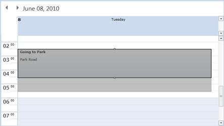

::: {style="DISPLAY: none"}
{#d2h_url_template}{#d2h_package_url style="WIDTH: 0px; DISPLAY: none; HEIGHT: 0px"}
:::

::: {.d2h_secondary_topic style="PADDING-BOTTOM: 10pt; MARGIN: 0pt; PADDING-LEFT: 0pt; PADDING-RIGHT: 0pt; PADDING-TOP: 0pt"}
#### Resizing Appointment {#resizing-appointment style="tab-stops: 0pt"}

The ability to resize appointments in Essential Schedule enables you to extend the time slot of an appointment by dragging its top or bottom sizing handle. The start time and end time of an appointment will change respective to this resizing.

[·      ]{style="FONT-FAMILY: Symbol"}To enable all appointments to be resized, set the **AllowResize** property in the **Schedule** class to **true**.

[·      ]{style="FONT-FAMILY: Symbol"}To enable resizing for a particular appointment, set the **AllowResize** property in the **ScheduleAppointment** class to **true**.[]{style="FONT-FAMILY: 'Times New Roman','serif'"}

[]{style="FONT-FAMILY: 'Times New Roman','serif'"} 

{border="0"}

 

Figure 20: Resizing an Appointment[]{style="FONT-FAMILY: 'Times New Roman','serif'"}

[]{#related-topics}
:::
