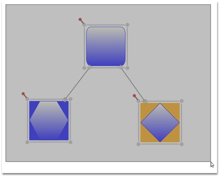

::: {style="DISPLAY: none"}
{#d2h_url_template}{#d2h_package_url style="WIDTH: 0px; DISPLAY: none; HEIGHT: 0px"}
:::

:::: {.d2h_secondary_topic style="PADDING-BOTTOM: 10pt; MARGIN: 0pt; PADDING-LEFT: 0pt; PADDING-RIGHT: 0pt; PADDING-TOP: 0pt"}
#### Resizing a Single Node on Multiple Selection {#resizing-a-single-node-on-multiple-selection style="tab-stops: 0pt"}

 

Multiple items on the drawing area can be selected.

 

Multiple selections can be performed by the following steps.

[]{style="FONT-FAMILY: 'Trebuchet MS','sans-serif'; COLOR: #15428b; FONT-SIZE: 9pt"} 

[·      ]{style="FONT-FAMILY: Symbol"}Items on the drawing area are selected only if they fall within the bounds of the drag adorner.

[·      ]{style="FONT-FAMILY: Symbol"}The drag adorner is displayed when the user clicks anywhere on the page and starts dragging the pointer.

[·      ]{style="FONT-FAMILY: Symbol"}The rectangle is formed with the drag start-point as one of its points, and the point where the mouse button was released as its second point, defines the drag adorner\'s bounds.

[·      ]{style="FONT-FAMILY: Symbol"}Nodes connected to one or more nodes are selected only if one of the connected nodes is also within the drag adorner bounds. The nodes and the connector connecting them act as a single selection.

[]{style="FONT-FAMILY: 'Trebuchet MS','sans-serif'; COLOR: #15428b; FONT-SIZE: 9pt"} 

::: {style="BORDER-BOTTOM: windowtext 1pt solid; BORDER-LEFT: medium none; PADDING-BOTTOM: 1pt; MARGIN-TOP: 9pt; PADDING-LEFT: 0pt; PADDING-RIGHT: 0pt; MARGIN-BOTTOM: 9pt; BORDER-TOP: windowtext 1pt solid; BORDER-RIGHT: medium none; PADDING-TOP: 1pt"}
{border="0"}Note: Resizing or moving any one item affects the other items by the same factor. However, rotating affects only the current node.
:::

[]{style="FONT-FAMILY: 'Trebuchet MS','sans-serif'; COLOR: #15428b; FONT-SIZE: 9pt"} 

{border="0"}

Figure 36: Multiple Selections**[]{style="FONT-STYLE: normal; FONT-FAMILY: 'Trebuchet MS','sans-serif'; COLOR: #15428b"}**

 

[]{#p29} 

[]{#related-topics}
::::
