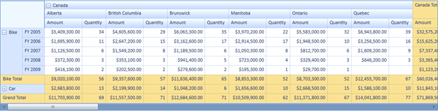
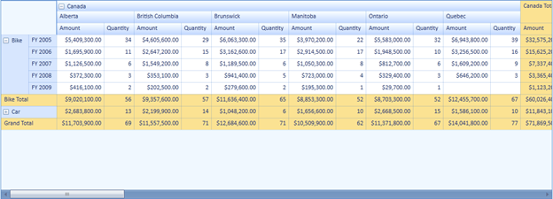

::: {style="DISPLAY: none"}
{#d2h_url_template} {#d2h_package_url style="WIDTH: 0px; DISPLAY: none; HEIGHT: 0px"}
:::

:::: {.d2h_secondary_topic style="PADDING-BOTTOM: 10pt; MARGIN: 0pt; PADDING-LEFT: 0pt; PADDING-RIGHT: 0pt; PADDING-TOP: 0pt"}
#### Resizing the PivotGrid to fit its content {#resizing-the-pivotgrid-to-fit-its-content style="tab-stops: 0pt"}

 

PivotGrid provides support for resizing the grid to fit its content while group expanding and collapsing the groups. The grid will be resized after refreshing the page.

 

Use Case Scenarios

 

This feature will be useful to provide more space to display the controls sharing its parent control during group collapse operation**.**

 

Properties

 

Table 10: Property Table

::: {align="center"}
  ---------------------- ------------------------------------------------------------- ------------ ----------- -----------------
  Property               Description                                                   Type         Data Type   Reference links
  ResizePivotGridToFit   Resizes the PivotGrid according to the content of the grid.   Dependency   Boolean     NA
  ---------------------- ------------------------------------------------------------- ------------ ----------- -----------------
:::

[]{style="FONT-FAMILY: 'Calibri','sans-serif'; COLOR: black"} 

Enabling Resizing Pivot Grid

You can enable or disable this feature using the *ResizePivotGridToFit* property.  To enable resizing, set this property to true. To disable resizing, set this property to false.  By default this is set to false.

 

The following code illustrates how to enable resizing to fit the content, when you expand or collapse the PivotGrid group:

 

+----------------------------------------------------------------------------------------------------------------------------------------------------------------------------------------------------+
| \[C#\]                                                                                                                                                                                             |
|                                                                                                                                                                                                    |
|                                                                                                                                                                                                    |
|                                                                                                                                                                                                    |
| [this]{style="FONT-FAMILY: 'Courier New'; COLOR: blue; FONT-SIZE: 9.5pt"} [.pivotGrid1.ResizePivotGridToFit = [true]{style="COLOR: blue"}; ]{style="FONT-FAMILY: 'Courier New'; FONT-SIZE: 9.5pt"} |
+----------------------------------------------------------------------------------------------------------------------------------------------------------------------------------------------------+

 

+------------------------------------------------------------------------------------------------------------------------------------------------------------------------------------------------+
| [\[VB\]]{style="FONT-FAMILY: 'Courier New'"}                                                                                                                                                   |
|                                                                                                                                                                                                |
|                                                                                                                                                                                                |
|                                                                                                                                                                                                |
| [Me]{style="FONT-FAMILY: 'Courier New'; COLOR: blue; FONT-SIZE: 9.5pt"} [.pivotGrid1.ResizePivotGridToFit = [True]{style="COLOR: blue"}]{style="FONT-FAMILY: 'Courier New'; FONT-SIZE: 9.5pt"} |
+------------------------------------------------------------------------------------------------------------------------------------------------------------------------------------------------+

 

{border="0"}

Figure 36: Control Resized

 

 

The following code illustrates how to disable resizing to fit the content, when you expand or collapse the PivotGrid group:

 

+----------------------------------------------------------------------------------------------------------------------------------------------------------------------------------------------------+
| \[C#\]                                                                                                                                                                                             |
|                                                                                                                                                                                                    |
|                                                                                                                                                                                                    |
|                                                                                                                                                                                                    |
| [this]{style="FONT-FAMILY: 'Courier New'; COLOR: blue; FONT-SIZE: 9.5pt"} [.pivotGrid1.ResizePivotGridToFit = [false]{style="COLOR: blue"};]{style="FONT-FAMILY: 'Courier New'; FONT-SIZE: 9.5pt"} |
+----------------------------------------------------------------------------------------------------------------------------------------------------------------------------------------------------+

 

+-------------------------------------------------------------------------------------------------------------------------------------------------------------------------------------------------+
| \[VB\]                                                                                                                                                                                          |
|                                                                                                                                                                                                 |
|                                                                                                                                                                                                 |
|                                                                                                                                                                                                 |
| [Me]{style="FONT-FAMILY: 'Courier New'; COLOR: blue; FONT-SIZE: 9.5pt"} [.pivotGrid1.ResizePivotGridToFit = [False]{style="COLOR: blue"}]{style="FONT-FAMILY: 'Courier New'; FONT-SIZE: 9.5pt"} |
+-------------------------------------------------------------------------------------------------------------------------------------------------------------------------------------------------+

 

 

{border="0"}

Figure 37: Control not Resized

 

 

Sample Link

To view samples:

1.   Open **Syncfusion Dashboard**.

2.   Select **BI \> WPF**.

3.   Click **Run Samples**.

4.   Navigate to **PivotGrid** **\> Product Showcase \> Pivot Grid Demo.**

 

[]{#related-topics}
::::
