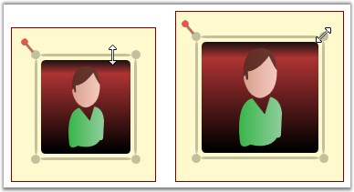

::: {style="DISPLAY: none"}
{#d2h_url_template}{#d2h_package_url style="WIDTH: 0px; DISPLAY: none; HEIGHT: 0px"}
:::

::: {.d2h_secondary_topic style="PADDING-BOTTOM: 10pt; MARGIN: 0pt; PADDING-LEFT: 0pt; PADDING-RIGHT: 0pt; PADDING-TOP: 0pt"}
#### Resizing through the Resize handle {#resizing-through-the-resize-handle style="tab-stops: 0pt"}

Resizing a node affects the node\'s width and height. To resize a node, follow the steps below.

[]{style="FONT-FAMILY: 'Trebuchet MS','sans-serif'; COLOR: #15428b; FONT-SIZE: 9pt"} 

[·      ]{style="FONT-FAMILY: Symbol"}Select the node that is to be resized.

[·      ]{style="FONT-FAMILY: Symbol"}Move the pointer to the edge that you want to resize.

[·      ]{style="FONT-FAMILY: Symbol"}The cursor will change to one with two arrows.

[·      ]{style="FONT-FAMILY: Symbol"}Now drag the edge to the size you want. The node\'s height and width will correspondingly change.

 

{border="0"}

Figure 36: Node Resizing Illustrated[]{style="FONT-FAMILY: 'Trebuchet MS','sans-serif'; COLOR: #15428b"}

[]{style="FONT-FAMILY: 'Trebuchet MS','sans-serif'; COLOR: #15428b; FONT-SIZE: 9pt"} 

To resize both the width and height by the same factor, click and drag the corners of the resize adorner.

[]{#p26} 

[]{#_How_to_Rotate}AllowResize

The **AllowResize** property can be used to enable/disable the node resizing.\
\
When this property is set to **True**, it is possible to resize the node. Otherwise the node cannot be resized.\
The default value is **True**.

 

The **AllowResize** property can be set in the following way.

[]{style="FONT-FAMILY: 'Trebuchet MS','sans-serif'; COLOR: #15428b; FONT-SIZE: 9pt"} 

+-------------------------------------------------------------------------------------------------------------------------------------------------------------------------------------------------------------------------------+
| **[\[C#\]]{style="FONT-FAMILY: 'Courier New'; COLOR: black"}**                                                                                                                                                                |
|                                                                                                                                                                                                                               |
| [\                                                                                                                                                                                                                            |
| ]{style="FONT-FAMILY: 'Courier New'; COLOR: black"}[Node]{style="FONT-FAMILY: 'Courier New'; COLOR: #2b91af"}[ nodeobject = [new]{style="COLOR: blue"} [Node]{style="COLOR: #2b91af"}();]{style="FONT-FAMILY: 'Courier New'"} |
|                                                                                                                                                                                                                               |
| [nodeobject.AllowResize = [false]{style="COLOR: blue"};]{style="FONT-FAMILY: 'Courier New'"}                                                                                                                                  |
+-------------------------------------------------------------------------------------------------------------------------------------------------------------------------------------------------------------------------------+

 

+--------------------------------------------------------------------------------------------------------------------------------------------------------------------------------------------------------------------------------------------------+
| **[\[VB\]]{style="FONT-FAMILY: 'Courier New'; COLOR: black"}**                                                                                                                                                                                   |
|                                                                                                                                                                                                                                                  |
| [\                                                                                                                                                                                                                                               |
| ]{style="FONT-FAMILY: 'Courier New'; COLOR: black"}[Dim]{style="FONT-FAMILY: 'Courier New'; COLOR: blue"}[ nodeobject [As]{style="COLOR: blue"} [New]{style="COLOR: blue"} [Node]{style="COLOR: #2b91af"}()]{style="FONT-FAMILY: 'Courier New'"} |
|                                                                                                                                                                                                                                                  |
| [nodeobject.AllowResize = [False]{style="COLOR: blue"}]{style="FONT-FAMILY: 'Courier New'"}[]{style="FONT-FAMILY: 'Courier New'"}                                                                                                                |
+--------------------------------------------------------------------------------------------------------------------------------------------------------------------------------------------------------------------------------------------------+

 

[]{#related-topics}
:::
