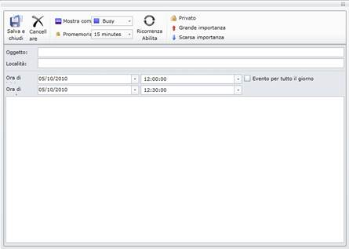
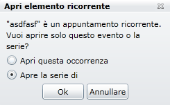
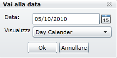
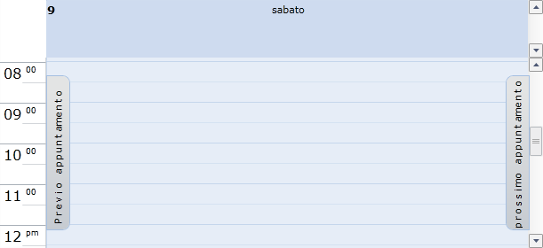
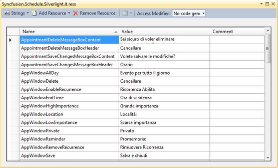

::: {style="DISPLAY: none"}
{#d2h_url_template}{#d2h_package_url style="WIDTH: 0px; DISPLAY: none; HEIGHT: 0px"}
:::

::::: {#nsbanner .d2h_main_nsbanner style="BORDER-BOTTOM: #999999 1px solid; POSITION: relative; PADDING-BOTTOM: 0px; BACKGROUND-COLOR: transparent; PADDING-LEFT: 0px; PADDING-RIGHT: 0px; DISPLAY: none; BORDER-TOP: #999999 1px solid; PADDING-TOP: 0px; LEFT: 0px"}
:::: {#TitleRow .d2h_main_titlerow style="PADDING-BOTTOM: 4px; BACKGROUND-COLOR: transparent; PADDING-LEFT: 22px; WIDTH: 100%; PADDING-RIGHT: 10px; DISPLAY: none; PADDING-TOP: 4px"}
::: {#ienav .d2h_main_ienav style="DISPLAY: none"}
{#D2HPrevious .D2HPreviousEnabled}  {#D2HNext .D2HNextEnabled}
:::
::::
:::::

::::::::::: {#nstext .d2h_main_nstext style="PADDING-BOTTOM: 10px; BACKGROUND-COLOR: transparent; PADDING-LEFT: 22px; PADDING-RIGHT: 10px; HEIGHT: 100%; OVERFLOW: auto; PADDING-TOP: 5px" hasuserbackground="true" valign="bottom"}
::: {#d2h_breadcrumbs .d2h_breadcrumbs}
[Essential Studio User Guide Documentation](ms-xhelp:///?Id=12457748-09e3-4d74-a240-8e049cedf030){.d2h_breadcrumbsNormal}[ \> ]{.d2h_breadcrumbsLinkSeparator}[User Interface Edition](ms-xhelp:///?Id=c29296b7-531c-413b-a0ec-488ca1f7f669){.d2h_breadcrumbsNormal}[ \> ]{.d2h_breadcrumbsLinkSeparator}[Essential Silverlight](ms-xhelp:///?Id=66221bd1-ba2e-43c2-94a7-618f50e01d24){.d2h_breadcrumbsNormal}[ \> ]{.d2h_breadcrumbsLinkSeparator}[Essential Schedule]{.d2h_breadcrumbsContentsOnly}[ \> ]{.d2h_breadcrumbsLinkSeparator}[Schedule Control](ms-xhelp:///?Id=641660d5-c458-4c5d-9615-332d1a8eb458){.d2h_breadcrumbsNormal}[ \> ]{.d2h_breadcrumbsLinkSeparator}[Localization Support for Schedule Control](ms-xhelp:///?Id=0d657654-c6c2-4ef3-bc78-bbc0848ef83c){.d2h_breadcrumbsNormal}
:::

### Resource Names and its Default Values {#resource-names-and-its-default-values style="tab-stops: 0pt"}

The following tables represent the resource names and their default values (en-US Culture). You should have the same names present in the following tables and change the values based on the new culture you wish you have, in your resource file.

**[]{style="LINE-HEIGHT: 150%; FONT-FAMILY: 'Trebuchet MS','sans-serif'; COLOR: #15428b; FONT-SIZE: 9pt"}** 

Appointment Window

 

::: {align="center"}
  Names in Resource File      Values
  --------------------------- ---------------------
  AppWindowSave               Save and Close
  AppWindowDelete             Delete
  AppWindowShowAs             Show As
  AppWindowReminder           Reminder
  AppWindowEnableRecurrence   Enable Recurrence
  AppWindowRemoveRecurrence   Remove Recurrence
  AppWindowPrivate            Private
  AppWindowHighImportance     High Importance
  AppWindowLowImportance      Low Importance
  AppWindowSubject            Subject
  AppWindowLocation           Location
  AppWindowStartTime          StartTime
  AppWindowEndTime            EndTime
  AppWindowAllDay             All day event
  RecurrencePattern           Recurrence Pattern
  RecurrenceDaily             Daily
  RecurrenceWeekly            Weekly
  RecurrenceMonthly           Monthly
  RecurrenceYearly            Yearly
  RecurrenceRange             Range of recurrence
  RecurrenceStart             Start
  RecurrenceNoEndDate         No End Date
  RecurrenceEndAfter          End after
  RecurrenceEndBy             End by
  RecurrenceOccurences        Occurrences
  RecurrenceEvery             Every
  RecurrenceDays              Day(s)
  RecurrenceEveryWeekday      Every Weekday
  RecurrenceRecurEvery        Recur every
  RecurrenceWeeksOn           Week(s)on
  RecurrenceSunday            Sunday
  RecurrenceMonday            Monday
  RecurrenceTuesday           Tuesday
  RecurrenceWednesday         Wednesday
  RecurrenceThursday          Thursday
  RecurrenceFriday            Friday
  RecurrenceSaturday          Saturday
  RecurrenceDay               Day
  RecurrenceOfEvery           Of every
  RecurrenceMonths            Month(s)
  RecurrenceThe               The
  RecurrenceOn                On
  RecurrenceOnThe             On the
  RecurrenceOf                Of
  RecurrenceYears             Year(s)
:::

 

{border="0"}

 

Figure 59:  Appointment Window in Italian Culture

 

"Delete" Message Box

 

::: {align="center"}
  ------------------------------------ --------------------------------------------------
  Names in Resource File               Values
  AppointmentDeleteMessageBoxContent   Are you sure you want to delete the Appointment?
  AppointmentDeleteMessageBoxHeader    Delete
  ------------------------------------ --------------------------------------------------
:::

 

{border="0"}

Figure 60:  Message when Deleting

 

 

"Save Changes" Message Box

 

::: {align="center"}
  ----------------------------------------- ----------------------------------
  Names in Resource File                    Values
  AppointmentSaveChangesMessageBoxContent   Do you want to save the changes?
  AppointmentSaveChangesMessageBoxHeader    Schedule
  ----------------------------------------- ----------------------------------
:::

 

{border="0"}

 

Figure 61:  Message when Saving Changes

 

Recurrence Alert Window

 

::: {align="center"}
  --------------------------------- ----------------------------------------------------------------------------------------
  Names in Resource File            Values
  RecurrenceAlertWindowHeader       Open the Recurring Item
  RecurrenceAlertWindowContent      Is it a Recurring Appointment? Do you want to open only this occurrence or the series?
  RecurrenceAlertWindowOpen         Open this Occurrence
  RecurrenceAlertWindowOpenSeries   Open the Series
  --------------------------------- ----------------------------------------------------------------------------------------
:::

 

{border="0"}

 

Figure 62: Open Recurring Item

 

"Go to Date" Window

 

::: {align="center"}
  ------------------------ ------------
  Names in Resource File   Values
  GoToDateWindowHeader     Go to Date
  GoToDateWindowDate       Date
  GoToDateWindowShowIn     Show In
  ------------------------ ------------
:::

 

 

{border="0"}

 

Figure 63: Go to Date

 

Window - Common

 

::: {align="center"}
  ------------------------ --------
  Names in Resource File   Values
  Ok                       Ok
  Cancel                   Cancel
  ------------------------ --------
:::

 

"Next/Previous" Navigation Button

**[]{style="FONT-SIZE: 9pt"}** 

::: {align="center"}
  ------------------------ ----------------------
  Names in Resource File   Values
  NextAppointment          Next Appointment
  PreviousAppointment      Previous Appointment
  ------------------------ ----------------------
:::

 

 

{border="0"}

 

Figure 64: Next and Previous Appointment Navigation Button

 

Adding Localization to an Application

The following steps explain the implementation of Localization in applications.

**[]{style="FONT-FAMILY: 'Trebuchet MS','sans-serif'; COLOR: #15428b; FONT-SIZE: 9pt"}** 

Creating an Application

This involves creating a Silverlight application and adding Schedule to it.

**[]{style="FONT-FAMILY: 'Trebuchet MS','sans-serif'; COLOR: #15428b; FONT-SIZE: 9pt"}** 

**[]{style="FONT-FAMILY: 'Trebuchet MS','sans-serif'; COLOR: #15428b; FONT-SIZE: 9pt"}** 

Creating a Resource file

To create a Resource File:

1.   Create a folder named "**Resources**" in the application.

Create a resource file (Resx file) and name it "**Syncfusion.Schedule.Silverlight**.\<*your culture info name*\>.resx" e.g. Syncfusion.Schedule.Silverlight.it.resx.

Use the above mentioned naming convention, as it is mandatory. The following screenshot explains creating a Resource file.

 

{border="0"}

 

Figure 65: Adding the Resources File to the Application

 

2.   Select the **String** option in the Resource file. This is explained in the following screenshot.

[]{style="FONT-FAMILY: 'Trebuchet MS','sans-serif'; COLOR: #15428b; FONT-SIZE: 9pt"} 

{border="0"}

Figure 66: Adding String Resources to the resx file

 

3.   Enter the name and value in the Resource file.

The names used in Grid are given in the [Property]() table.

The following screenshot explains the same.

 

{border="0"}*[]{style="COLOR: #1f497d; FONT-SIZE: 9pt"}*

 

Figure 67: Screenshot of the Filled String Resources (Language: Italian)

 

Setting the Culture Information in the Application

Set the culture information in the application before the InitializeComponent() method is called. Now,  application is set to UKEnglish Culture info. The following code snippet explains setting a culture to a WPF application.

 

+---------------------------------------------------------------------------------------------------------------------------------------------------------------------------------------------------------------------------------------------------+
| **[CS (MainPage.xaml.cs)]{style="FONT-FAMILY: 'Courier New'"}**                                                                                                                                                                                   |
+---------------------------------------------------------------------------------------------------------------------------------------------------------------------------------------------------------------------------------------------------+
| [public]{style="FONT-FAMILY: 'Courier New'; COLOR: blue"}[ MainPage()]{style="FONT-FAMILY: 'Courier New'"}                                                                                                                                        |
|                                                                                                                                                                                                                                                   |
| [{]{style="FONT-FAMILY: 'Courier New'"}                                                                                                                                                                                                           |
|                                                                                                                                                                                                                                                   |
| [System.Threading.[Thread]{style="COLOR: #2b91af"}.CurrentThread.CurrentUICulture = [new]{style="COLOR: blue"} System.Globalization.[CultureInfo]{style="COLOR: #2b91af"}([\"Ja\"]{style="COLOR: #a31515"});]{style="FONT-FAMILY: 'Courier New'"} |
|                                                                                                                                                                                                                                                   |
| []{style="FONT-FAMILY: 'Courier New'"}                                                                                                                                                                                                            |
|                                                                                                                                                                                                                                                   |
| [InitializeComponent();]{style="FONT-FAMILY: 'Courier New'"}                                                                                                                                                                                      |
|                                                                                                                                                                                                                                                   |
| [}]{style="FONT-FAMILY: 'Courier New'"}                                                                                                                                                                                                           |
+---------------------------------------------------------------------------------------------------------------------------------------------------------------------------------------------------------------------------------------------------+

Or

+---------------------------------------------------------------------------------------------------------------------------------------------------------------------------------------------------------------------------------------------------+
| **[CS (App.xaml.cs)]{style="FONT-FAMILY: 'Courier New'"}**                                                                                                                                                                                        |
+---------------------------------------------------------------------------------------------------------------------------------------------------------------------------------------------------------------------------------------------------+
| [private]{style="FONT-FAMILY: 'Courier New'; COLOR: blue"}[ [void]{style="COLOR: blue"} Application_Startup([object]{style="COLOR: blue"} sender, [StartupEventArgs]{style="COLOR: #2b91af"} e)]{style="FONT-FAMILY: 'Courier New'"}              |
|                                                                                                                                                                                                                                                   |
| [{]{style="FONT-FAMILY: 'Courier New'"}                                                                                                                                                                                                           |
|                                                                                                                                                                                                                                                   |
| [System.Threading.[Thread]{style="COLOR: #2b91af"}.CurrentThread.CurrentUICulture = [new]{style="COLOR: blue"} System.Globalization.[CultureInfo]{style="COLOR: #2b91af"}([\"Ja\"]{style="COLOR: #a31515"});]{style="FONT-FAMILY: 'Courier New'"} |
|                                                                                                                                                                                                                                                   |
| [this]{style="FONT-FAMILY: 'Courier New'; COLOR: blue"}[.RootVisual = [new]{style="COLOR: blue"} [MainPage]{style="COLOR: #2b91af"}();]{style="FONT-FAMILY: 'Courier New'"}                                                                       |
|                                                                                                                                                                                                                                                   |
| [}]{style="FONT-FAMILY: 'Courier New'"}**[]{style="FONT-FAMILY: 'Courier New'"}**                                                                                                                                                                 |
+---------------------------------------------------------------------------------------------------------------------------------------------------------------------------------------------------------------------------------------------------+

 

 

[]{#related-topics}
:::::::::::
