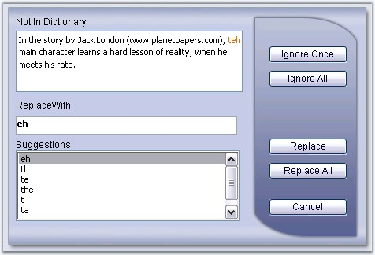

::: {style="DISPLAY: none"}
{#d2h_url_template}{#d2h_package_url style="WIDTH: 0px; DISPLAY: none; HEIGHT: 0px"}
:::

::::: {.d2h_secondary_topic style="PADDING-BOTTOM: 10pt; MARGIN: 0pt; PADDING-LEFT: 0pt; PADDING-RIGHT: 0pt; PADDING-TOP: 0pt"}
##### Restricted Search {#restricted-search style="MARGIN-LEFT: 1.8pt; tab-stops: 1.8pt"}

[]{style="FONT-FAMILY: 'Trebuchet MS','sans-serif'; COLOR: #15428b; FONT-SIZE: 9pt"} 

The spell checking engine can also be customized to ignore certain text or words from being spell checked. By setting the respective properties, these words will be overlooked and will not indicate them as misspelled words. This option will be effective when there are lot of email id\'s and address, filenames, htmltags, combination of words and numbers, combination of upper and lower case words are used frequently in the document.

[]{style="FONT-FAMILY: 'Trebuchet MS','sans-serif'; COLOR: #15428b; FONT-SIZE: 9pt"} 

::: {style="BORDER-BOTTOM: windowtext 1pt solid; BORDER-LEFT: medium none; PADDING-BOTTOM: 1pt; MARGIN: 9pt 0pt 9pt 1.8pt; PADDING-LEFT: 0pt; PADDING-RIGHT: 0pt; BORDER-TOP: windowtext 1pt solid; BORDER-RIGHT: medium none; PADDING-TOP: 1pt"}
{border="0"}Note: Spell check can be performed only on the required part of the input text, by selecting that part in the textbox, which performs spell check on the selected text alone.
:::

[]{style="FONT-FAMILY: 'Trebuchet MS','sans-serif'; COLOR: #15428b; FONT-SIZE: 9pt"} 

::: {align="center"}
+-----------------------------------+------------------------------------------------------------------------------------------------------------------+
|                                   |                                                                                                                  |
|                                   |                                                                                                                  |
| Property                          | Description                                                                                                      |
+-----------------------------------+------------------------------------------------------------------------------------------------------------------+
| ExcludeEmailAddress               | Specifies whether or not to ignore email address during spell check. Default value is True.                      |
+-----------------------------------+------------------------------------------------------------------------------------------------------------------+
| ExcludeFilenames                  | Specifies whether or not to ignore file names during spell check. Default value is True.                         |
+-----------------------------------+------------------------------------------------------------------------------------------------------------------+
| ExcludeHtmlTags                   | Specifies whether or not to ignore html tags during spell check. Default value is True.                          |
+-----------------------------------+------------------------------------------------------------------------------------------------------------------+
| ExcludeInternetAddress            | Specifies whether or not to ignore internet address during spell check. Default value is True.                   |
+-----------------------------------+------------------------------------------------------------------------------------------------------------------+
| ExcludeRepeatedWords              | Specifies whether or not to ignore repeated words during spell check. Default value is False.                    |
+-----------------------------------+------------------------------------------------------------------------------------------------------------------+
| ExcludeWordsInMixedCase           | Specifies whether or not to ignore mixed case words during spell check.  Default value is False.                 |
+-----------------------------------+------------------------------------------------------------------------------------------------------------------+
| ExcludeWordsInUpperCase           | Specifies whether or not to ignore uppercase words during spell check. Default value is True.                    |
+-----------------------------------+------------------------------------------------------------------------------------------------------------------+
| ExcludeWordsWithNumbers           | Specifies whether or not to spell check numbers or words with numbers during spell check. Default value is True. |
+-----------------------------------+------------------------------------------------------------------------------------------------------------------+
:::

[]{style="FONT-FAMILY: 'Trebuchet MS','sans-serif'; COLOR: #15428b; FONT-SIZE: 9pt"} 

{border="0"}

[]{style="FONT-FAMILY: 'Trebuchet MS','sans-serif'; COLOR: #15428b; FONT-SIZE: 9pt"} 

Figure 91: URL being skipped on setting ExcludeInternetAddress

[]{style="FONT-FAMILY: 'Trebuchet MS','sans-serif'; COLOR: #15428b; FONT-SIZE: 9pt"} 

Programmatically the exclude properties can be set as follows.

[]{style="FONT-FAMILY: 'Trebuchet MS','sans-serif'; COLOR: #15428b; FONT-SIZE: 9pt"} 

+-------------------------------------------------------------------------------------------------------------------------+
| **[\[C#\]]{style="FONT-FAMILY: 'Courier New'; FONT-SIZE: 9pt"}**                                                        |
|                                                                                                                         |
| **[]{style="FONT-FAMILY: 'Courier New'; FONT-SIZE: 9pt"}**                                                              |
|                                                                                                                         |
| [SpellCheck.ExcludeEmailAddress = [true]{style="COLOR: blue"};]{style="FONT-FAMILY: 'Courier New'; FONT-SIZE: 9pt"}     |
|                                                                                                                         |
| [SpellCheck.ExcludeFileNames = [true]{style="COLOR: blue"};]{style="FONT-FAMILY: 'Courier New'; FONT-SIZE: 9pt"}        |
|                                                                                                                         |
| [SpellCheck.ExcludeHtmlTags = [true]{style="COLOR: blue"};]{style="FONT-FAMILY: 'Courier New'; FONT-SIZE: 9pt"}         |
|                                                                                                                         |
| [SpellCheck.ExcludeInternetAddress = [true]{style="COLOR: blue"};]{style="FONT-FAMILY: 'Courier New'; FONT-SIZE: 9pt"}  |
|                                                                                                                         |
| [SpellCheck.ExcludeRepeatedWords = [true]{style="COLOR: blue"};]{style="FONT-FAMILY: 'Courier New'; FONT-SIZE: 9pt"}    |
|                                                                                                                         |
| [SpellCheck.ExcludeWordsInMixedCase = [true]{style="COLOR: blue"};]{style="FONT-FAMILY: 'Courier New'; FONT-SIZE: 9pt"} |
|                                                                                                                         |
| [SpellCheck.ExcludeWordsInUpperCase = [true]{style="COLOR: blue"};]{style="FONT-FAMILY: 'Courier New'; FONT-SIZE: 9pt"} |
|                                                                                                                         |
| [SpellCheck.ExcludeWordsWithNumbers = [true]{style="COLOR: blue"};]{style="FONT-FAMILY: 'Courier New'; FONT-SIZE: 9pt"} |
+-------------------------------------------------------------------------------------------------------------------------+

[]{style="FONT-FAMILY: 'Trebuchet MS','sans-serif'; COLOR: #15428b; FONT-SIZE: 9pt"} 

+---------------------------------------------------------------------------------------------------------------------------------------------------------------------------------------------------+
| **[\[VB\]]{style="FONT-FAMILY: 'Courier New'; FONT-SIZE: 9pt"}**                                                                                                                                  |
|                                                                                                                                                                                                   |
| **[]{style="FONT-FAMILY: 'Courier New'; FONT-SIZE: 9pt"}**                                                                                                                                        |
|                                                                                                                                                                                                   |
| [Private]{style="FONT-FAMILY: 'Courier New'; COLOR: blue; FONT-SIZE: 9pt"}[ SpellCheck.ExcludeEmailAddress = [True]{style="COLOR: blue"}]{style="FONT-FAMILY: 'Courier New'; FONT-SIZE: 9pt"}     |
|                                                                                                                                                                                                   |
| [Private]{style="FONT-FAMILY: 'Courier New'; COLOR: blue; FONT-SIZE: 9pt"}[ SpellCheck.ExcludeFileNames = [True]{style="COLOR: blue"}]{style="FONT-FAMILY: 'Courier New'; FONT-SIZE: 9pt"}        |
|                                                                                                                                                                                                   |
| [Private]{style="FONT-FAMILY: 'Courier New'; COLOR: blue; FONT-SIZE: 9pt"}[ SpellCheck.ExcludeHtmlTags = [True]{style="COLOR: blue"}]{style="FONT-FAMILY: 'Courier New'; FONT-SIZE: 9pt"}         |
|                                                                                                                                                                                                   |
| [Private]{style="FONT-FAMILY: 'Courier New'; COLOR: blue; FONT-SIZE: 9pt"}[ SpellCheck.ExcludeInternetAddress = [True]{style="COLOR: blue"}]{style="FONT-FAMILY: 'Courier New'; FONT-SIZE: 9pt"}  |
|                                                                                                                                                                                                   |
| [Private]{style="FONT-FAMILY: 'Courier New'; COLOR: blue; FONT-SIZE: 9pt"}[ SpellCheck.ExcludeRepeatedWords = [True]{style="COLOR: blue"}]{style="FONT-FAMILY: 'Courier New'; FONT-SIZE: 9pt"}    |
|                                                                                                                                                                                                   |
| [Private]{style="FONT-FAMILY: 'Courier New'; COLOR: blue; FONT-SIZE: 9pt"}[ SpellCheck.ExcludeWordsInMixedCase = [True]{style="COLOR: blue"}]{style="FONT-FAMILY: 'Courier New'; FONT-SIZE: 9pt"} |
|                                                                                                                                                                                                   |
| [Private]{style="FONT-FAMILY: 'Courier New'; COLOR: blue; FONT-SIZE: 9pt"}[ SpellCheck.ExcludeWordsInUpperCase = [True]{style="COLOR: blue"}]{style="FONT-FAMILY: 'Courier New'; FONT-SIZE: 9pt"} |
|                                                                                                                                                                                                   |
| [Private]{style="FONT-FAMILY: 'Courier New'; COLOR: blue; FONT-SIZE: 9pt"}[ SpellCheck.ExcludeWordsWithNumbers = [True]{style="COLOR: blue"}]{style="FONT-FAMILY: 'Courier New'; FONT-SIZE: 9pt"} |
+---------------------------------------------------------------------------------------------------------------------------------------------------------------------------------------------------+

 

 

[]{#related-topics}
:::::
