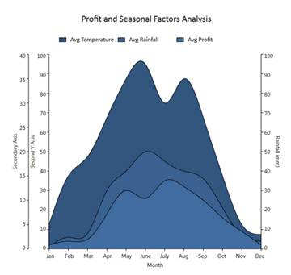

::: {style="DISPLAY: none"}
{#d2h_url_template}{#d2h_package_url style="WIDTH: 0px; DISPLAY: none; HEIGHT: 0px"}
:::

:::: {.d2h_secondary_topic style="PADDING-BOTTOM: 10pt; MARGIN: 0pt; PADDING-LEFT: 0pt; PADDING-RIGHT: 0pt; PADDING-TOP: 0pt"}
##### Retaining Axis Position {#retaining-axis-position style="tab-stops: 0pt"}

Essential Chart for WPF enables users to retain the axis position of the primary and secondary axis when multiple axes are added in a chart area.

 

Adding Support for Retaining Axis Position

Set the **IsRetainAxisPosition** property to **True to add** axes in the order they are added to the chart area. The following code illustrates this. 

 

+----------------------------------------------------------------------------------------------+
| **[\[Xaml\]]{style="FONT-FAMILY: 'Courier New'"}**                                           |
|                                                                                              |
| **[]{style="FONT-FAMILY: 'Courier New'"}**                                                   |
|                                                                                              |
| [\<syncfusion:ChartArea IsRetainAxisPosition=\"True\"\>]{style="FONT-FAMILY: 'Courier New'"} |
+----------------------------------------------------------------------------------------------+

 

When the code runs, the following output displays.

 

{border="0"}

Figure 202: IsRetainAxisPosition is True.

 

Set **IsRetainAxisPosition** is **False** to add axes in reverse order.

 

{border="0"}

Figure 203: IsRetainAxisPosition is False

**[]{style="FONT-FAMILY: 'Trebuchet MS','sans-serif'; COLOR: #15428b; FONT-SIZE: 9pt"}** 

Table 141: Property Details

::: {align="center"}
+----------------------+------------------------------------------------------+------------------+---------------------+-------------------------------+
| Name of Property     | Description                                          | Type of Property | Value It Accepts    | Property Syntax               |
|                      |                                                      |                  |                     |                               |
|                      |                                                      |                  |                     |                               |
+----------------------+------------------------------------------------------+------------------+---------------------+-------------------------------+
| IsRetainAxisPosition | Determines the order of arranging the multiple axes. | Dependency       | Bool or True/False. | IsRetainAxisPosition=\"True\" |
+----------------------+------------------------------------------------------+------------------+---------------------+-------------------------------+
:::

 

[]{#related-topics}
::::
