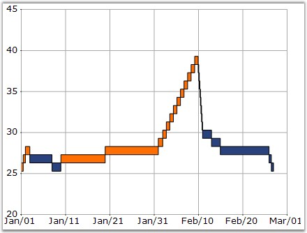
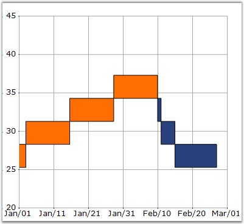

::: {style="DISPLAY: none"}
{#d2h_url_template}{#d2h_package_url style="WIDTH: 0px; DISPLAY: none; HEIGHT: 0px"}
:::

:::: {.d2h_secondary_topic style="PADDING-BOTTOM: 10pt; MARGIN: 0pt; PADDING-LEFT: 0pt; PADDING-RIGHT: 0pt; PADDING-TOP: 0pt"}
#### ReversalAmount {#reversalamount style="tab-stops: 0pt"}

 

Gets or sets the reversal amount for financial charts.

 

::: {align="center"}
+-------------------------------------+-------------------------------------------------------------------------+
|                                                                                                               |
|                                                                                                               |
| Details                                                                                                       |
+-------------------------------------+-------------------------------------------------------------------------+
| **Possible Values**                 | Any numeric value                                                       |
+-------------------------------------+-------------------------------------------------------------------------+
| **Default Value    **               | **1**                                                                   |
+-------------------------------------+-------------------------------------------------------------------------+
| **2D / 3D Limitations**             | No                                                                      |
+-------------------------------------+-------------------------------------------------------------------------+
| **Applies to Chart Element**        | Any Series                                                              |
+-------------------------------------+-------------------------------------------------------------------------+
| **Applies to Chart Types**          | Kagi Chart, Three Line Break Chart, Point and Figure Chart, Renko Chart |
+-------------------------------------+-------------------------------------------------------------------------+
:::

 

Here is code snippet using ReversalAmount in Renko Chart.

 

{border="0"}

 

Figure 185: Renko Chart with default ReversalAmount = \"1\"

 

+--------------------------------------------------------------------------------+
| **[\[C#\]]{style="FONT-FAMILY: 'Courier New'; COLOR: black"}**                 |
|                                                                                |
| **[]{style="FONT-FAMILY: 'Courier New'; COLOR: black"}**                       |
|                                                                                |
| [series.ReversalAmount = 3;]{style="FONT-FAMILY: 'Courier New'; COLOR: black"} |
+--------------------------------------------------------------------------------+

 

+------------------------------------------------------------------------------------------------------------------------------------------+
| **[\[VB.NET\]]{style="FONT-FAMILY: 'Courier New'; COLOR: black"}**                                                                       |
|                                                                                                                                          |
| **[]{style="FONT-FAMILY: 'Courier New'; COLOR: black"}**                                                                                 |
|                                                                                                                                          |
| [Private]{style="FONT-FAMILY: 'Courier New'; COLOR: blue"}[ series.ReversalAmount = 3]{style="FONT-FAMILY: 'Courier New'; COLOR: black"} |
+------------------------------------------------------------------------------------------------------------------------------------------+

 

{border="0"}

 

Figure 186: Renko Chart with ReversalAmount = \"3\"

 

 

See Also

 

[]{#p139}[[Kagi Chart]{style="COLOR: blue"}]{.UGHyperlink}, [Point and Figure Chart]{.UGHyperlink}, [Three Line Break Chart]{.UGHyperlink}, [Renko Chart]{.UGHyperlink}

 

 

[]{#related-topics}
::::
