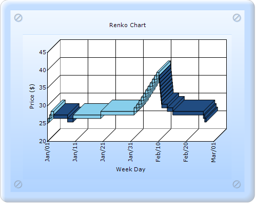
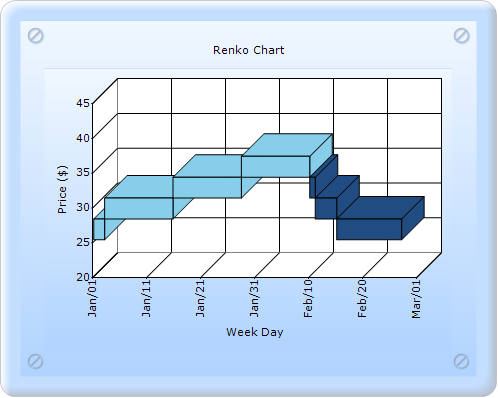
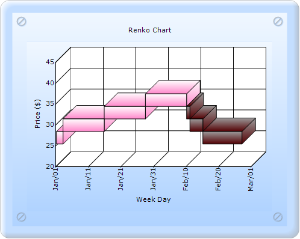
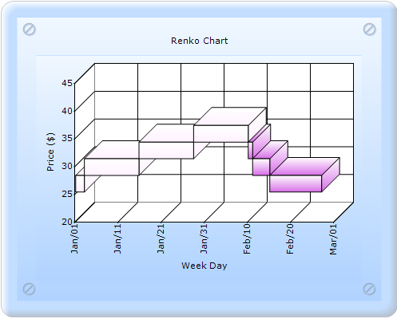

::: {style="DISPLAY: none"}
{#d2h_url_template}{#d2h_package_url style="WIDTH: 0px; DISPLAY: none; HEIGHT: 0px"}
:::

:::::: {.d2h_secondary_topic style="PADDING-BOTTOM: 10pt; MARGIN: 0pt; PADDING-LEFT: 0pt; PADDING-RIGHT: 0pt; PADDING-TOP: 0pt"}
#### ReversalAmount, ColorsMode and DarkLightPower {#reversalamount-colorsmode-and-darklightpower style="tab-stops: 0pt"}

**[]{style="FONT-FAMILY: 'Calibri','sans-serif'"}** 

ReversalAmount:

ReversalAmount gets or sets the reversal amount for the Financial charts.

::: {align="center"}
+------------------------------+------------------------------------------------------------------------------+
| Details                                                                                                     |
+------------------------------+------------------------------------------------------------------------------+
| Possible values              | Any numeric value.                                                           |
+------------------------------+------------------------------------------------------------------------------+
| Default value                | 1                                                                            |
+------------------------------+------------------------------------------------------------------------------+
| 2D/3D limitations            | No                                                                           |
+------------------------------+------------------------------------------------------------------------------+
| Application to chart element | Any series                                                                   |
+------------------------------+------------------------------------------------------------------------------+
| Application to chart types   | Kagi chart, Three Line Break chart, Point and Figure chart, and Renko chart. |
+------------------------------+------------------------------------------------------------------------------+
:::

**[]{style="FONT-FAMILY: 'Calibri','sans-serif'"}** 

{border="0"}

Figure 235: Renko chart with default ReversalAmount value

[]{style="FONT-FAMILY: 'Calibri','sans-serif'"} 

{border="0"}

Figure 236: Renko chart with ReversalAmount value 3.0

ColorsMode

ColorsMode gets or sets the ColorsMode of the boxes in the Financial chart types.

::: {align="center"}
+-------------------------------------+---------------------------------------------------------------------+
| Details                                                                                                   |
+-------------------------------------+---------------------------------------------------------------------+
| Possible values                     | **DarkLight** - Draws series data points as a DarkLight colorsmode. |
|                                     |                                                                     |
|                                     | **Fixed** - Draws series data points as a Fixed colorsmode.         |
|                                     |                                                                     |
|                                     | **Mixed** - Draws series data points as a Mixed colorsmode.         |
+-------------------------------------+---------------------------------------------------------------------+
| Default value                       | Fixed                                                               |
+-------------------------------------+---------------------------------------------------------------------+
| 2D/3D limitations                   | None                                                                |
+-------------------------------------+---------------------------------------------------------------------+
| Application to chart element        | All series                                                          |
+-------------------------------------+---------------------------------------------------------------------+
| Application to chart types          | Renko chart (Financial chart)                                       |
+-------------------------------------+---------------------------------------------------------------------+
:::

**[]{style="FONT-FAMILY: 'Calibri','sans-serif'"}** 

{border="0"}

Figure 237: Renko chart with ColorsMode DarkLight

{border="0"}

Figure 238: Renko chart with ColorsMode Mixed

DarkLightPower

DarkLightPower gets or sets the intensity of the dark and light colors used in the DarkLight color mode.

 

::: {align="center"}
+------------------------------+--------------------------------+
| Details                                                       |
+------------------------------+--------------------------------+
| Possible values              | Ranges from 0 to 255 bytes.    |
+------------------------------+--------------------------------+
| Default value                | 100                            |
+------------------------------+--------------------------------+
| 2D/3D limitations            | No                             |
+------------------------------+--------------------------------+
| Application to chart element | All series                     |
+------------------------------+--------------------------------+
| Application to chart types   | Renko chart (Financial charts) |
+------------------------------+--------------------------------+
:::

 

{border="0"}

Figure 239: Renko chart with DarklightPower 200

[]{style="FONT-FAMILY: 'Calibri','sans-serif'"} 

Implementation:

Renko chart with ColorsMode, DarkLightPower, and ReversalAmount can be created through two ways:

[·      ]{style="FONT-FAMILY: Symbol"}Builder

[·      ]{style="FONT-FAMILY: Symbol"}ChartModel

More:

[ ]{#related-topics}

[{border="0" align="absMiddle"}Builder](ms-xhelp:///?Id=13ebc830-3b62-4dd5-9f12-b8195ed174df){style="TEXT-DECORATION: none"}

[{border="0" align="absMiddle"}ChartModel](ms-xhelp:///?Id=b284ab35-46a9-4b23-82d9-7661424ff90d){style="TEXT-DECORATION: none"}
::::::
