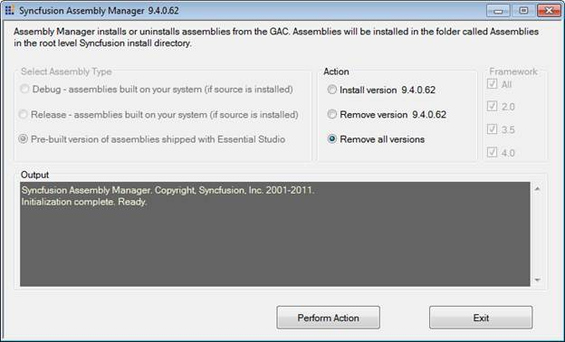

::: {style="DISPLAY: none"}
{#d2h_url_template}{#d2h_package_url style="WIDTH: 0px; DISPLAY: none; HEIGHT: 0px"}
:::

::::: {#nsbanner .d2h_main_nsbanner style="BORDER-BOTTOM: #999999 1px solid; POSITION: relative; PADDING-BOTTOM: 0px; BACKGROUND-COLOR: transparent; PADDING-LEFT: 0px; PADDING-RIGHT: 0px; DISPLAY: none; BORDER-TOP: #999999 1px solid; PADDING-TOP: 0px; LEFT: 0px"}
:::: {#TitleRow .d2h_main_titlerow style="PADDING-BOTTOM: 4px; BACKGROUND-COLOR: transparent; PADDING-LEFT: 22px; WIDTH: 100%; PADDING-RIGHT: 10px; DISPLAY: none; PADDING-TOP: 4px"}
::: {#ienav .d2h_main_ienav style="DISPLAY: none"}
{#D2HPrevious .D2HPreviousEnabled}  {#D2HNext .D2HNextEnabled}
:::
::::
:::::

:::::: {#nstext .d2h_main_nstext style="PADDING-BOTTOM: 10px; BACKGROUND-COLOR: transparent; PADDING-LEFT: 22px; PADDING-RIGHT: 10px; HEIGHT: 100%; OVERFLOW: auto; PADDING-TOP: 5px" hasuserbackground="true" valign="bottom"}
::: {#d2h_breadcrumbs .d2h_breadcrumbs}
[Essential Studio User Guide Documentation](ms-xhelp:///?Id=12457748-09e3-4d74-a240-8e049cedf030){.d2h_breadcrumbsNormal}[ \> ]{.d2h_breadcrumbsLinkSeparator}[Essential Common](ms-xhelp:///?Id=2bfe10b6-fac1-4f91-a173-04db314f10c3){.d2h_breadcrumbsNormal}[ \> ]{.d2h_breadcrumbsLinkSeparator}[Installation and Deployment](ms-xhelp:///?Id=edacfc75-68a5-4518-870d-ce716c583177){.d2h_breadcrumbsNormal}[ \> ]{.d2h_breadcrumbsLinkSeparator}[Patches](ms-xhelp:///?Id=c25f7147-28f2-46c2-bedf-511bdbabe8b3){.d2h_breadcrumbsNormal}
:::

### Reverting a Patch {#reverting-a-patch style="tab-stops: 0pt"}

The patch install will take a backup of the release assemblies and store them in the *Backup Assemblies* folder. The patch assemblies will also be stored in the *Patch* folder.  You can revert back if needed.

[]{style="FONT-FAMILY: 'Trebuchet MS','sans-serif'; COLOR: #004f8a; FONT-SIZE: 9pt"} 

Revert back to Release assemblies

[]{style="FONT-FAMILY: 'Trebuchet MS','sans-serif'; COLOR: #004f8a; FONT-SIZE: 9pt"} 

The following are the steps to revert to the release assemblies:

[]{style="FONT-FAMILY: 'Trebuchet MS','sans-serif'; COLOR: #004f8a; FONT-SIZE: 9pt"} 

1.   Copy the release assemblies from the **Backup Assemblies** folder.

2.   Paste them in the **precompiledassemblies** folder.

3.   Open **Dashboard \> Utility \> Assembly Management \> Assembly Manager**.

 

{border="0"}

Figure 42: Assembly Manager

 

4.   Select **Remove all** **versions** radio button.

5.   Click **Perform Action**. All versions will be removed.

6.   Select **Install version x.x.x.x.**

::: {style="BORDER-BOTTOM: windowtext 1pt solid; BORDER-LEFT: medium none; PADDING-BOTTOM: 1pt; MARGIN-TOP: 9pt; PADDING-LEFT: 0pt; PADDING-RIGHT: 0pt; MARGIN-BOTTOM: 9pt; BORDER-TOP: windowtext 1pt solid; BORDER-RIGHT: medium none; PADDING-TOP: 1pt"}
{border="0"}Note: x.x.x.x has to be replaced with the corresponding Essential Studio Version.
:::

7.   Click **Perform Action**. The assemblies of specific version will be configured in your machine.

 

::: {style="BORDER-BOTTOM: windowtext 1pt solid; BORDER-LEFT: medium none; PADDING-BOTTOM: 1pt; MARGIN-TOP: 9pt; PADDING-LEFT: 0pt; PADDING-RIGHT: 0pt; MARGIN-BOTTOM: 9pt; BORDER-TOP: windowtext 1pt solid; BORDER-RIGHT: medium none; PADDING-TOP: 1pt"}
{border="0"}Note: You can also revert to a specific patch assemblies by copying the patch assemblies from the Patch folder and add them in the precompiledassemblies folder.

 
:::

[]{#related-topics}
::::::
