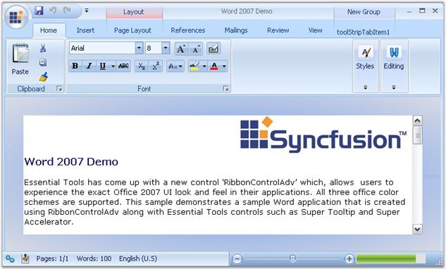

::: {style="DISPLAY: none"}
{#d2h_url_template}{#d2h_package_url style="WIDTH: 0px; DISPLAY: none; HEIGHT: 0px"}
:::

::: {.d2h_secondary_topic style="PADDING-BOTTOM: 10pt; MARGIN: 0pt; PADDING-LEFT: 0pt; PADDING-RIGHT: 0pt; PADDING-TOP: 0pt"}
#### RibbonControlAdv {#ribboncontroladv style="tab-stops: 0pt"}

 

[]{#p1099}RibbonControlAdv added to the Office2007 now comes with a couple of features and customization properties which presents the control with a great look and feel like MS Office 2007. This user guide explains all the controls that can be added to the RibbonControlAdv in detail.

[]{style="COLOR: #15428b"} 

{border="0"}

[]{style="COLOR: #15428b"} 

***[]{style="COLOR: #15428b"}*** 

Figure 1298: RibbonControlAdv in Office2007 - Illustrated

 

More:

[ ]{#related-topics}

[{border="0" align="absMiddle"}Overview](ms-xhelp:///?Id=f3c9b08c-73df-4dbb-8e1b-9221aa62f6ee){style="TEXT-DECORATION: none"}

[{border="0" align="absMiddle"}Ribbon Form](ms-xhelp:///?Id=6b88bc6c-b615-441e-9faa-0122a0a4b0cf){style="TEXT-DECORATION: none"}

[{border="0" align="absMiddle"}Ribbon Control Items](ms-xhelp:///?Id=bd358e34-d90e-4afd-baf1-355ebc64f7e9){style="TEXT-DECORATION: none"}

[{border="0" align="absMiddle"}Concepts and Features](ms-xhelp:///?Id=0ad402d8-0f50-481b-8bbf-b276cec2ac68){style="TEXT-DECORATION: none"}

[{border="0" align="absMiddle"}Events And Methods](ms-xhelp:///?Id=924da35f-de30-4dbb-a50c-c941f6c86dac){style="TEXT-DECORATION: none"}
:::
