::: {style="DISPLAY: none"}
{#d2h_url_template}{#d2h_package_url style="WIDTH: 0px; DISPLAY: none; HEIGHT: 0px"}
:::

::::::::::::::::::::::::::::::::::::::::::::::::::::::: {.d2h_secondary_topic style="PADDING-BOTTOM: 10pt; MARGIN: 0pt; PADDING-LEFT: 0pt; PADDING-RIGHT: 0pt; PADDING-TOP: 0pt"}
##### Ribbon Control Items {#ribbon-control-items style="tab-stops: 0pt"}

[]{style="COLOR: #15428b"} 

This section discusses the following Ribbon Control Items.

 

###### []{#_Office_Menu_Button}3.15.1.2.3.1        Office Menu Button {#office-menu-button style="tab-stops: 0pt"}

[]{style="COLOR: #15428b"} 

The RibbonControlAdv has the office menu button at the top left corner of the form. Controls can be added to the panels of the office menu button dropdown through designer without a single piece of code.

[]{style="COLOR: #15428b"} 

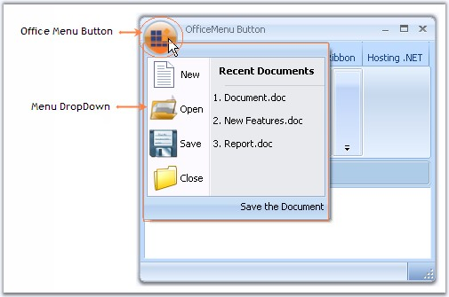{border="0"}

[]{style="COLOR: #15428b"} 

Figure 1306: Office Menu button with DropDown

[]{style="COLOR: #15428b"} 

 

[]{#_MenuButton_Drop_Down}3.15.1.2.3.1.1     MenuButton Drop Down

[]{style="COLOR: #15428b"} 

When the OfficeMenuButton is clicked, ToolStripDropDown is displayed. This dropdown can be customized through designer as well as through code.

 

**Through Designer Using Menu Panels**

[]{style="COLOR: #15428b"} 

RibbonControlAdv lets you add customized ToolStrip items in the OfficeMenu button dropdown with the help of the menu panels.

 

The panels are:

[]{style="COLOR: #15428b"} 

[·      ]{style="FONT-FAMILY: Symbol"}Aux Panel

[·      ]{style="FONT-FAMILY: Symbol"}Main Panel

[·      ]{style="FONT-FAMILY: Symbol"}System Panel

[]{style="COLOR: #15428b"} 

[{border="0"}]{style="COLOR: #15428b"}[]{style="COLOR: #15428b"}

[]{style="COLOR: #15428b"} 

Figure 1307: OfficeMenu Button DropDown displaying Menu Panels

[]{style="COLOR: #15428b"} 

Adding ToolStrip Items to the Panels

 

Each Panel has Items property which invokes the Items Collection Editor. Using this editor you can add the toolstrip items easily.

[]{style="COLOR: #15428b"} 

::: {align="center"}
  ---------- -----------------------------------------------------------------------------------
  Property   Description
  Items      Lets you open Items Collection Editor using which you can add items to the panel.
  ---------- -----------------------------------------------------------------------------------
:::

[]{style="COLOR: #15428b"} 

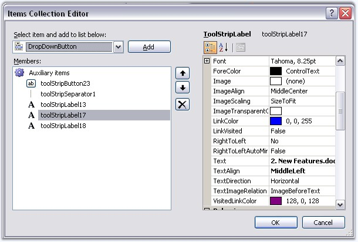{border="0"}

[]{style="COLOR: #15428b"} 

***[]{style="COLOR: #15428b"}*** 

Figure 1308: Items Collection Editor

***[]{style="COLOR: black; FONT-SIZE: 8pt"}*** 

Programmatically Adding a ToolStripDropDown

[]{style="COLOR: #15428b"} 

ToolStripDropDown can be added programmatically using **ToolStripDropDown** class and then assigning it to the **RibbonControlAdv.MenuDropDownButton** property as follows.

[]{style="COLOR: #15428b"} 

::: {align="center"}
  -------------------- --------------------------------------------------------------------------------------
  Property             Description
  MenuButtonDropDown   Gets / Sets ToolStripDropDown to be displayed, when the OfficeMenuButton is clicked.
  -------------------- --------------------------------------------------------------------------------------
:::

[]{style="COLOR: #15428b"} 

+-----------------------------------------------------------------------------------------------------------------------------------------------------------------------------------------------------------------------------+
| **[\[C#\]]{style="FONT-FAMILY: 'Courier New'; COLOR: black"}**                                                                                                                                                              |
|                                                                                                                                                                                                                             |
| []{style="COLOR: black"}                                                                                                                                                                                                    |
|                                                                                                                                                                                                                             |
| [// Initialize a ToolStripDropDown button.]{style="FONT-FAMILY: 'Courier New'; COLOR: green"}                                                                                                                               |
|                                                                                                                                                                                                                             |
| [ToolStripDropDown]{style="FONT-FAMILY: 'Courier New'; COLOR: teal"}[ dropDown = [new]{style="COLOR: blue"} [ToolStripDropDown]{style="COLOR: teal"}();]{style="FONT-FAMILY: 'Courier New'"}                                |
|                                                                                                                                                                                                                             |
| []{style="FONT-FAMILY: 'Courier New'"}                                                                                                                                                                                      |
|                                                                                                                                                                                                                             |
| [//Initialize the controls that are to be added in the panel.]{style="FONT-FAMILY: 'Courier New'; COLOR: green"}                                                                                                            |
|                                                                                                                                                                                                                             |
| [ToolStripButton]{style="FONT-FAMILY: 'Courier New'; COLOR: teal"}[ newBtn = [new]{style="COLOR: blue"} [ToolStripButton]{style="COLOR: teal"}([\"&New\"]{style="COLOR: maroon"});]{style="FONT-FAMILY: 'Courier New'"}     |
|                                                                                                                                                                                                                             |
| [ToolStripButton]{style="FONT-FAMILY: 'Courier New'; COLOR: teal"}[ openBtn = [new]{style="COLOR: blue"} [ToolStripButton]{style="COLOR: teal"}([\"&Open\"]{style="COLOR: maroon"});]{style="FONT-FAMILY: 'Courier New'"}   |
|                                                                                                                                                                                                                             |
| [ToolStripButton]{style="FONT-FAMILY: 'Courier New'; COLOR: teal"}[ saveBtn = [new]{style="COLOR: blue"} [ToolStripButton]{style="COLOR: teal"}([\"&Save\"]{style="COLOR: maroon"});]{style="FONT-FAMILY: 'Courier New'"}   |
|                                                                                                                                                                                                                             |
| [ToolStripButton]{style="FONT-FAMILY: 'Courier New'; COLOR: teal"}[ closeBtn = [new]{style="COLOR: blue"} [ToolStripButton]{style="COLOR: teal"}([\"&Close\"]{style="COLOR: maroon"});]{style="FONT-FAMILY: 'Courier New'"} |
|                                                                                                                                                                                                                             |
| []{style="FONT-FAMILY: 'Courier New'"}                                                                                                                                                                                      |
|                                                                                                                                                                                                                             |
| [// Initialize a new panel (Panel 1)]{style="FONT-FAMILY: 'Courier New'; COLOR: green"}                                                                                                                                     |
|                                                                                                                                                                                                                             |
| [ToolStripPanelItem]{style="FONT-FAMILY: 'Courier New'; COLOR: teal"}[ panel1 = [new]{style="COLOR: blue"} [ToolStripPanelItem]{style="COLOR: teal"}();]{style="FONT-FAMILY: 'Courier New'"}                                |
|                                                                                                                                                                                                                             |
| [panel1.Items.Add(newBtn);]{style="FONT-FAMILY: 'Courier New'"}                                                                                                                                                             |
|                                                                                                                                                                                                                             |
| [panel1.Items.Add(openBtn);]{style="FONT-FAMILY: 'Courier New'"}                                                                                                                                                            |
|                                                                                                                                                                                                                             |
| [panel1.Items.Add(saveBtn);]{style="FONT-FAMILY: 'Courier New'"}                                                                                                                                                            |
|                                                                                                                                                                                                                             |
| [panel1.Items.Add(closeBtn);]{style="FONT-FAMILY: 'Courier New'"}                                                                                                                                                           |
|                                                                                                                                                                                                                             |
| []{style="FONT-FAMILY: 'Courier New'"}                                                                                                                                                                                      |
|                                                                                                                                                                                                                             |
| [// Set the row count.]{style="FONT-FAMILY: 'Courier New'; COLOR: green"}                                                                                                                                                   |
|                                                                                                                                                                                                                             |
| [panel1.RowCount = 9;]{style="FONT-FAMILY: 'Courier New'"}                                                                                                                                                                  |
|                                                                                                                                                                                                                             |
| []{style="FONT-FAMILY: 'Courier New'"}                                                                                                                                                                                      |
|                                                                                                                                                                                                                             |
| [//Settings for the buttons]{style="FONT-FAMILY: 'Courier New'; COLOR: green"}                                                                                                                                              |
|                                                                                                                                                                                                                             |
| [foreach]{style="FONT-FAMILY: 'Courier New'; COLOR: blue"}[ ([ToolStripButton]{style="COLOR: teal"} btn [in]{style="COLOR: blue"} panel1.Items)]{style="FONT-FAMILY: 'Courier New'"}                                        |
|                                                                                                                                                                                                                             |
| [{]{style="FONT-FAMILY: 'Courier New'"}                                                                                                                                                                                     |
|                                                                                                                                                                                                                             |
| [    btn.AutoSize = [false]{style="COLOR: blue"};]{style="FONT-FAMILY: 'Courier New'"}                                                                                                                                      |
|                                                                                                                                                                                                                             |
| [    btn.Size = [new]{style="COLOR: blue"} [Size]{style="COLOR: teal"}(170, 35);]{style="FONT-FAMILY: 'Courier New'"}                                                                                                       |
|                                                                                                                                                                                                                             |
| [    btn.ImageAlign = [ContentAlignment]{style="COLOR: teal"}.MiddleLeft;]{style="FONT-FAMILY: 'Courier New'"}                                                                                                              |
|                                                                                                                                                                                                                             |
| [    btn.TextAlign = [ContentAlignment]{style="COLOR: teal"}.MiddleLeft;]{style="FONT-FAMILY: 'Courier New'"}                                                                                                               |
|                                                                                                                                                                                                                             |
| [    btn.ImageScaling = [ToolStripItemImageScaling]{style="COLOR: teal"}.None;]{style="FONT-FAMILY: 'Courier New'"}                                                                                                         |
|                                                                                                                                                                                                                             |
| [}]{style="FONT-FAMILY: 'Courier New'"}                                                                                                                                                                                     |
|                                                                                                                                                                                                                             |
| []{style="FONT-FAMILY: 'Courier New'"}                                                                                                                                                                                      |
|                                                                                                                                                                                                                             |
| [// Add the panel into the items of the ToolStripDropDown.]{style="FONT-FAMILY: 'Courier New'; COLOR: green"}                                                                                                               |
|                                                                                                                                                                                                                             |
| [dropDown.Items.Add(panel1);]{style="FONT-FAMILY: 'Courier New'"}                                                                                                                                                           |
|                                                                                                                                                                                                                             |
| []{style="FONT-FAMILY: 'Courier New'"}                                                                                                                                                                                      |
|                                                                                                                                                                                                                             |
| [// Set the MenuButtonDropDown property of the RibbonControlAdv.]{style="FONT-FAMILY: 'Courier New'; COLOR: green"}                                                                                                         |
|                                                                                                                                                                                                                             |
| [this]{style="FONT-FAMILY: 'Courier New'; COLOR: blue"}[.ribbonControlAdv1.MenuButtonDropDown = dropDown;]{style="FONT-FAMILY: 'Courier New'"}                                                                              |
+-----------------------------------------------------------------------------------------------------------------------------------------------------------------------------------------------------------------------------+

[]{style="COLOR: #15428b"} 

+-----------------------------------------------------------------------------------------------------------------------------------------------------------------------------------------------------------------+
| **[\[VB.NET\]]{style="FONT-FAMILY: 'Courier New'; COLOR: black"}**                                                                                                                                              |
|                                                                                                                                                                                                                 |
| []{style="COLOR: black"}                                                                                                                                                                                        |
|                                                                                                                                                                                                                 |
| [\' Initialize a ToolStripDropDown button. ]{style="FONT-FAMILY: 'Courier New'; COLOR: green"}                                                                                                                  |
|                                                                                                                                                                                                                 |
| [Dim]{style="FONT-FAMILY: 'Courier New'; COLOR: blue"}[ dropDown [As]{style="COLOR: blue"} [New]{style="COLOR: blue"} ToolStripDropDown()]{style="FONT-FAMILY: 'Courier New'"}                                  |
|                                                                                                                                                                                                                 |
| []{style="FONT-FAMILY: 'Courier New'"}                                                                                                                                                                          |
|                                                                                                                                                                                                                 |
| [\'Initialize the controls that are to be added in the panel. ]{style="FONT-FAMILY: 'Courier New'; COLOR: green"}                                                                                               |
|                                                                                                                                                                                                                 |
| [Dim]{style="FONT-FAMILY: 'Courier New'; COLOR: blue"}[ newBtn [As]{style="COLOR: blue"} [New]{style="COLOR: blue"} ToolStripButton([\"&New\"]{style="COLOR: maroon"})]{style="FONT-FAMILY: 'Courier New'"}     |
|                                                                                                                                                                                                                 |
| [Dim]{style="FONT-FAMILY: 'Courier New'; COLOR: blue"}[ openBtn [As]{style="COLOR: blue"} [New]{style="COLOR: blue"} ToolStripButton([\"&Open\"]{style="COLOR: maroon"})]{style="FONT-FAMILY: 'Courier New'"}   |
|                                                                                                                                                                                                                 |
| [Dim]{style="FONT-FAMILY: 'Courier New'; COLOR: blue"}[ saveBtn [As]{style="COLOR: blue"} [New]{style="COLOR: blue"} ToolStripButton([\"&Save\"]{style="COLOR: maroon"})]{style="FONT-FAMILY: 'Courier New'"}   |
|                                                                                                                                                                                                                 |
| [Dim]{style="FONT-FAMILY: 'Courier New'; COLOR: blue"}[ closeBtn [As]{style="COLOR: blue"} [New]{style="COLOR: blue"} ToolStripButton([\"&Close\"]{style="COLOR: maroon"})]{style="FONT-FAMILY: 'Courier New'"} |
|                                                                                                                                                                                                                 |
| []{style="FONT-FAMILY: 'Courier New'"}                                                                                                                                                                          |
|                                                                                                                                                                                                                 |
| [\' Initialize a new panel (Panel 1) ]{style="FONT-FAMILY: 'Courier New'; COLOR: green"}                                                                                                                        |
|                                                                                                                                                                                                                 |
| [Dim]{style="FONT-FAMILY: 'Courier New'; COLOR: blue"}[ panel1 [As]{style="COLOR: blue"} [New]{style="COLOR: blue"} ToolStripPanelItem()]{style="FONT-FAMILY: 'Courier New'"}                                   |
|                                                                                                                                                                                                                 |
| [panel1.Items.Add(newBtn) ]{style="FONT-FAMILY: 'Courier New'"}                                                                                                                                                 |
|                                                                                                                                                                                                                 |
| [panel1.Items.Add(openBtn) ]{style="FONT-FAMILY: 'Courier New'"}                                                                                                                                                |
|                                                                                                                                                                                                                 |
| [panel1.Items.Add(saveBtn) ]{style="FONT-FAMILY: 'Courier New'"}                                                                                                                                                |
|                                                                                                                                                                                                                 |
| [panel1.Items.Add(closeBtn) ]{style="FONT-FAMILY: 'Courier New'"}                                                                                                                                               |
|                                                                                                                                                                                                                 |
| []{style="FONT-FAMILY: 'Courier New'"}                                                                                                                                                                          |
|                                                                                                                                                                                                                 |
| [\' Set the row count. ]{style="FONT-FAMILY: 'Courier New'; COLOR: green"}                                                                                                                                      |
|                                                                                                                                                                                                                 |
| [panel1.RowCount = 9 ]{style="FONT-FAMILY: 'Courier New'"}                                                                                                                                                      |
|                                                                                                                                                                                                                 |
| []{style="FONT-FAMILY: 'Courier New'"}                                                                                                                                                                          |
|                                                                                                                                                                                                                 |
| [\'Settings for the buttons ]{style="FONT-FAMILY: 'Courier New'; COLOR: green"}                                                                                                                                 |
|                                                                                                                                                                                                                 |
| [For]{style="FONT-FAMILY: 'Courier New'; COLOR: blue"}[ [Each]{style="COLOR: blue"} btn [As]{style="COLOR: blue"} ToolStripButton [In]{style="COLOR: blue"} panel1.Items ]{style="FONT-FAMILY: 'Courier New'"}  |
|                                                                                                                                                                                                                 |
| [    btn.AutoSize = [False]{style="COLOR: blue"} ]{style="FONT-FAMILY: 'Courier New'"}                                                                                                                          |
|                                                                                                                                                                                                                 |
| [    btn.Size = [New]{style="COLOR: blue"} Size(170, 35) ]{style="FONT-FAMILY: 'Courier New'"}                                                                                                                  |
|                                                                                                                                                                                                                 |
| [    btn.ImageAlign = ContentAlignment.MiddleLeft ]{style="FONT-FAMILY: 'Courier New'"}                                                                                                                         |
|                                                                                                                                                                                                                 |
| [    btn.TextAlign = ContentAlignment.MiddleLeft ]{style="FONT-FAMILY: 'Courier New'"}                                                                                                                          |
|                                                                                                                                                                                                                 |
| [    btn.ImageScaling = ToolStripItemImageScaling.None ]{style="FONT-FAMILY: 'Courier New'"}                                                                                                                    |
|                                                                                                                                                                                                                 |
| [Next]{style="FONT-FAMILY: 'Courier New'; COLOR: blue"}[ ]{style="FONT-FAMILY: 'Courier New'"}                                                                                                                  |
|                                                                                                                                                                                                                 |
| []{style="FONT-FAMILY: 'Courier New'"}                                                                                                                                                                          |
|                                                                                                                                                                                                                 |
| [\' Add the panel into the items of the ToolStripDropDown. ]{style="FONT-FAMILY: 'Courier New'; COLOR: green"}                                                                                                  |
|                                                                                                                                                                                                                 |
| [dropDown.Items.Add(panel1) ]{style="FONT-FAMILY: 'Courier New'"}                                                                                                                                               |
|                                                                                                                                                                                                                 |
| []{style="FONT-FAMILY: 'Courier New'"}                                                                                                                                                                          |
|                                                                                                                                                                                                                 |
| [\' Set the MenuButtonDropDown property of the RibbonControlAdv. ]{style="FONT-FAMILY: 'Courier New'; COLOR: green"}                                                                                            |
|                                                                                                                                                                                                                 |
| [Me]{style="FONT-FAMILY: 'Courier New'; COLOR: blue"}[.ribbonControlAdv1.MenuButtonDropDown = dropDown]{style="FONT-FAMILY: 'Courier New'"}[]{style="FONT-FAMILY: 'Courier New'"}                               |
+-----------------------------------------------------------------------------------------------------------------------------------------------------------------------------------------------------------------+

***[]{style="COLOR: black; FONT-SIZE: 8pt"}*** 

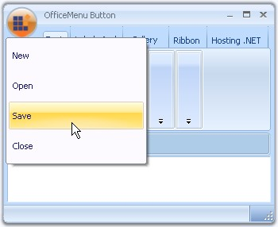{border="0"}

[]{style="COLOR: #15428b"} 

***[]{style="COLOR: #15428b"}*** 

Figure 1309: ToolStripButtons Added Programmatically

**[]{style="COLOR: #15428b"}** 

Adding ContextMenuStripEx as OfficeMenuDropDown

 

You can also display a ContextMenuStrip in the OfficeMenu button dropdown. This can be done by assigning a custom ContextMenuStrip to the RibbonControlAdv.MenuButtonDropDown property.

[]{style="COLOR: #15428b"} 

+-----------------------------------------------------------------------------------------------------------------------------------------------------------------------------------------------------------------------------+
| []{#p1105}**[\[C#\]]{style="FONT-FAMILY: 'Courier New'; COLOR: black"}**                                                                                                                                                    |
|                                                                                                                                                                                                                             |
| []{style="COLOR: #15428b"}                                                                                                                                                                                                  |
|                                                                                                                                                                                                                             |
| [this]{style="FONT-FAMILY: 'Courier New'; COLOR: blue"}[.ribbonControlAdv1.MenuButtonDropDown = [this]{style="COLOR: blue"}.contextMenuStripEx1;]{style="FONT-FAMILY: 'Courier New'"}[]{style="FONT-FAMILY: 'Courier New'"} |
+-----------------------------------------------------------------------------------------------------------------------------------------------------------------------------------------------------------------------------+

[]{style="COLOR: #15428b"} 

+------------------------------------------------------------------------------------------------------------------------------------------------------------------------------------------------------------------------+
| **[\[VB.NET\]]{style="FONT-FAMILY: 'Courier New'; COLOR: black"}**                                                                                                                                                     |
|                                                                                                                                                                                                                        |
| []{style="COLOR: #15428b"}                                                                                                                                                                                             |
|                                                                                                                                                                                                                        |
| [Me]{style="FONT-FAMILY: 'Courier New'; COLOR: blue"}[.ribbonControlAdv1.MenuButtonDropDown = [Me]{style="COLOR: blue"}.contextMenuStripEx1]{style="FONT-FAMILY: 'Courier New'"}[]{style="FONT-FAMILY: 'Courier New'"} |
+------------------------------------------------------------------------------------------------------------------------------------------------------------------------------------------------------------------------+

[]{style="COLOR: #15428b"} 

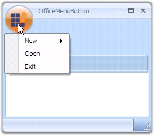{border="0"}

[]{style="COLOR: #15428b"} 

Figure 1310: OfficeMenuButton displaying ContextMenuStripEx as the DropDown

[]{style="COLOR: #15428b"} 

See Also

[]{style="COLOR: #15428b"} 

[[Properties]{.UGHyperlink}](../../../../../../../../Documents%20and%20Settings/sylviap/Desktop/Tools%20-%20Part%202.docx#_Properties)[, ]{.UGHyperlink}[[Adding Items to the DropDown]{.UGHyperlink}](../../../../../../../../Documents%20and%20Settings/sylviap/Desktop/Tools%20-%20Part%202.docx#_Adding_Items_to)[, ]{.UGHyperlink}[[ToolTips]{.UGHyperlink}](../../../../../../../../Documents%20and%20Settings/sylviap/Desktop/Tools%20-%20Part%202.docx#_Tooltips)[]{.UGHyperlink}

 

 

3.15.1.2.3.1.1.1  Properties

[]{style="COLOR: #15428b"} 

Panel Text

[]{style="COLOR: #15428b"} 

Text for the MenuButtonDropDown panels and its font style can be specified using the below properties.

[]{style="COLOR: #15428b"} 

::: {align="center"}
  ---------- -----------------------------------
  Property   Description
  Text       Sets text for the panel.
  Font       Sets the Font style for the text.
  ---------- -----------------------------------
:::

[]{style="COLOR: #15428b"} 

+--------------------------------------------------------------------------------------------------------------------------------------------------------------------------------------------------------------------------------------------------------------------------------------------------------------------------------------------+
| **[\[]{style="FONT-FAMILY: 'Courier New'; COLOR: black"}[C#\]]{style="FONT-FAMILY: 'Courier New'; COLOR: black"}[]{style="FONT-FAMILY: 'Courier New'; COLOR: black"}**                                                                                                                                                                     |
|                                                                                                                                                                                                                                                                                                                                            |
| []{style="COLOR: black"}                                                                                                                                                                                                                                                                                                                   |
|                                                                                                                                                                                                                                                                                                                                            |
| [this]{style="FONT-FAMILY: 'Courier New'; COLOR: blue"}[.ribbonControlAdv1.OfficeMenu.AuxPanel.Text = [\"Recent Documents\"]{style="COLOR: maroon"};]{style="FONT-FAMILY: 'Courier New'"}                                                                                                                                                  |
|                                                                                                                                                                                                                                                                                                                                            |
| [this]{style="FONT-FAMILY: 'Courier New'; COLOR: blue"}[.ribbonControlAdv1.OfficeMenu.AuxPanel.]{style="FONT-FAMILY: 'Courier New'"}[Font ]{style="FONT-FAMILY: 'Courier New'"}[= [new]{style="COLOR: blue"} System.Drawing.[Font]{style="COLOR: teal"}([\"Verdana\"]{style="COLOR: maroon"}, 8.25F);]{style="FONT-FAMILY: 'Courier New'"} |
+--------------------------------------------------------------------------------------------------------------------------------------------------------------------------------------------------------------------------------------------------------------------------------------------------------------------------------------------+

[]{style="COLOR: #15428b"} 

+-----------------------------------------------------------------------------------------------------------------------------------------------------------------------------------------------------------------------------------------------------------------------------+
| **[\[VB.NET\]]{style="FONT-FAMILY: 'Courier New'; COLOR: black"}**                                                                                                                                                                                                          |
|                                                                                                                                                                                                                                                                             |
| []{style="COLOR: #15428b"}                                                                                                                                                                                                                                                  |
|                                                                                                                                                                                                                                                                             |
| [Me]{style="FONT-FAMILY: 'Courier New'; COLOR: blue"}[.ribbonControlAdv1.OfficeMenu.AuxPanel.Text = [\"Recent Documents\"]{style="COLOR: maroon"} ]{style="FONT-FAMILY: 'Courier New'"}                                                                                     |
|                                                                                                                                                                                                                                                                             |
| [Me]{style="FONT-FAMILY: 'Courier New'; COLOR: blue"}[.ribbonControlAdv1.OfficeMenu.AuxPanel.Font = [New]{style="COLOR: blue"} System.Drawing.Font([\"Verdana\"]{style="COLOR: maroon"}, 8.25F) ]{style="FONT-FAMILY: 'Courier New'"}[]{style="FONT-FAMILY: 'Courier New'"} |
+-----------------------------------------------------------------------------------------------------------------------------------------------------------------------------------------------------------------------------------------------------------------------------+

[]{style="COLOR: #15428b"} 

Adding Separator and Minimum Size Settings

[]{style="COLOR: #15428b"} 

The property which adds a line separator between the toolstrip items and the property which sets the minimum size for the panels is as follows.

[]{style="COLOR: #15428b"} 

::: {align="center"}
  ----------------- --------------------------------------------------
  Property          Description
  SeparatorIndent   Inserts a line separator between the menu items.
  MinimumSize       Specifies minimum size for the panels.
  ----------------- --------------------------------------------------
:::

**[]{style="COLOR: #15428b"}** 

+----------------------------------------------------------------------------------------------------------------------------------------------------------------------------------------------------------------------------------+
| **[\[]{style="FONT-FAMILY: 'Courier New'; COLOR: black"}[C#\]]{style="FONT-FAMILY: 'Courier New'; COLOR: black"}[]{style="FONT-FAMILY: 'Courier New'; COLOR: black"}**                                                           |
|                                                                                                                                                                                                                                  |
| []{style="COLOR: #15428b"}                                                                                                                                                                                                       |
|                                                                                                                                                                                                                                  |
| [this]{style="FONT-FAMILY: 'Courier New'; COLOR: blue"}[.ribbonControlAdv1.OfficeMenu.MainPanel.SeparatorIndent = 15;]{style="FONT-FAMILY: 'Courier New'"}                                                                       |
|                                                                                                                                                                                                                                  |
| [this]{style="FONT-FAMILY: 'Courier New'; COLOR: blue"}[.ribbonControlAdv1.OfficeMenu.AuxPanel.MinimumSize = [new]{style="COLOR: blue"} System.Drawing.[Size]{style="COLOR: teal"}(30, 30);]{style="FONT-FAMILY: 'Courier New'"} |
+----------------------------------------------------------------------------------------------------------------------------------------------------------------------------------------------------------------------------------+

[]{#p1106}[]{style="COLOR: #15428b"} 

+----------------------------------------------------------------------------------------------------------------------------------------------------------------------------------------------------------------------------------------------+
| **[\[VB.NET\]]{style="FONT-FAMILY: 'Courier New'; COLOR: black"}**                                                                                                                                                                           |
|                                                                                                                                                                                                                                              |
| []{style="COLOR: #15428b"}                                                                                                                                                                                                                   |
|                                                                                                                                                                                                                                              |
| [Me]{style="FONT-FAMILY: 'Courier New'; COLOR: blue"}[.]{style="FONT-FAMILY: 'Courier New'; COLOR: black"}[ribbonControlAdv1.OfficeMenu.MainPanel.SeparatorIndent = 15]{style="FONT-FAMILY: 'Courier New'"}                                  |
|                                                                                                                                                                                                                                              |
| [Me]{style="FONT-FAMILY: 'Courier New'; COLOR: blue"}[.ribbonControlAdv1.OfficeMenu.AuxPanel.MinimumSize = [New]{style="COLOR: blue"} System.Drawing.Size(30, 30)]{style="FONT-FAMILY: 'Courier New'"}[]{style="FONT-FAMILY: 'Courier New'"} |
+----------------------------------------------------------------------------------------------------------------------------------------------------------------------------------------------------------------------------------------------+

 

 

[]{#_Adding_Items_to}3.15.1.2.3.1.1.2  Adding Items to the Dropdown

[]{style="COLOR: #15428b"} 

The ToolStrip Items which can be added to the Menu Panels, using the Panel\'s Items Collection Editor dialog are as follows.

[]{style="COLOR: #15428b"} 

[·      ]{style="FONT-FAMILY: Symbol"}Button -- Adds button to the panel.

[·      ]{style="FONT-FAMILY: Symbol"}Label -- Adds label to the panel.

[·      ]{style="FONT-FAMILY: Symbol"}SplitButton -- Adds a button with a split appearance.

[·      ]{style="FONT-FAMILY: Symbol"}DropDownButton -- Adds drop down button.

[·      ]{style="FONT-FAMILY: Symbol"}Separator -- Adds a line separator in the panel.

[·      ]{style="FONT-FAMILY: Symbol"}ComboBox -- Adds a combo box.

[·      ]{style="FONT-FAMILY: Symbol"}Textbox -- Adds a textbox.

[·      ]{style="FONT-FAMILY: Symbol"}ProgressBar -- Adds a progress bar to the panel.

[·      ]{style="FONT-FAMILY: Symbol"}CheckBox -- Added a checkbox.

[·      ]{style="FONT-FAMILY: Symbol"}RadioButton -- Adds a radio button.

[·      ]{style="FONT-FAMILY: Symbol"}OfficeButton -- Adds an office button.

[·      ]{style="FONT-FAMILY: Symbol"}OfficeDropDownButton -- Adds a office dropdown button.

[·      ]{style="FONT-FAMILY: Symbol"}OfficeSplitButton -- Adds a Office split button.

[·      ]{style="FONT-FAMILY: Symbol"}SplitButtonEx -- Adds SplitButtonEx control item.

[·      ]{style="FONT-FAMILY: Symbol"}PanelItem - Adds panel items.

[·      ]{style="FONT-FAMILY: Symbol"}Gallery -- Add Gallery item.

**[]{style="COLOR: #15428b"}** 

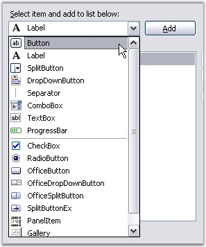{border="0"}

[]{style="COLOR: #15428b"} 

Figure 1311: ToolStrip Items

**[]{style="COLOR: #15428b"}** 

[]{style="COLOR: #15428b"} 

The properties of [[ToolStripItems]{.UGHyperlink}](../../../../../../../../Documents%20and%20Settings/sylviap/Desktop/Tools%20-%20Part%202.docx#_ToolStripItems) are available in Items Collection Editor which lets you customize the appearance of the items.

[]{style="COLOR: #15428b"} 

See Also

[]{style="COLOR: #15428b"} 

[[OfficeButton Properties]{.UGHyperlink}](../../../../../../../../Documents%20and%20Settings/sylviap/Desktop/Tools%20-%20Part%202.docx#_OfficeButton_Properties)[]{style="COLOR: black"}

 

 

[]{#_OfficeButton_Properties}3.15.1.2.3.1.1.2.1 OfficeButton Properties

[]{style="COLOR: #15428b"} 

This section discusses the properties of Office button toolstrip items.

[]{style="COLOR: #15428b"} 

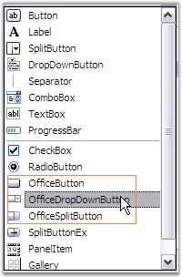{border="0"}

[]{style="COLOR: #15428b"} 

***[]{style="COLOR: #15428b"}*** 

Figure 1312: OfficeButton ToolStripItems in the Items Collection Editor

**[]{style="COLOR: #15428b"}** 

Common Properties for the Office buttons

**[]{style="COLOR: #15428b"}** 

::: {align="center"}
+-----------------------------------+-----------------------------------------------------------------------------------------------------------+
| Property                          | Description                                                                                               |
+-----------------------------------+-----------------------------------------------------------------------------------------------------------+
| Text                              | Sets the text for the item.                                                                               |
+-----------------------------------+-----------------------------------------------------------------------------------------------------------+
| TextAlign                         | Specifies the alignment of the text in the item.                                                          |
+-----------------------------------+-----------------------------------------------------------------------------------------------------------+
| TextDirection                     | Sets the direction of the text in the item. The options are,                                              |
|                                   |                                                                                                           |
|                                   |                                                                                                           |
|                                   |                                                                                                           |
|                                   | [·      ]{style="FONT-FAMILY: Symbol"}Horizontal,                                                         |
|                                   |                                                                                                           |
|                                   | [·      ]{style="FONT-FAMILY: Symbol"}Vertical90 and                                                      |
|                                   |                                                                                                           |
|                                   | [·      ]{style="FONT-FAMILY: Symbol"}Vertical270.                                                        |
+-----------------------------------+-----------------------------------------------------------------------------------------------------------+
| TextImageRelation                 | Represents image and text relation.                                                                       |
+-----------------------------------+-----------------------------------------------------------------------------------------------------------+
| DisplayStyle                      | Sets the display style of the item. The options are,                                                      |
|                                   |                                                                                                           |
|                                   |                                                                                                           |
|                                   |                                                                                                           |
|                                   | [·      ]{style="FONT-FAMILY: Symbol"}*Text* - Displays only text,                                        |
|                                   |                                                                                                           |
|                                   | [·      ]{style="FONT-FAMILY: Symbol"}*Image* - Displays only image,                                      |
|                                   |                                                                                                           |
|                                   | [·      ]{style="FONT-FAMILY: Symbol"}*ImageAndText* - Displays image and the text in the office button.  |
+-----------------------------------+-----------------------------------------------------------------------------------------------------------+
| Font                              | Sets the font style for the text in the item.                                                             |
+-----------------------------------+-----------------------------------------------------------------------------------------------------------+
| ForeColor                         | Sets the forecolor for the display text.                                                                  |
+-----------------------------------+-----------------------------------------------------------------------------------------------------------+
| Image                             | Sets the image for the item.                                                                              |
+-----------------------------------+-----------------------------------------------------------------------------------------------------------+
| ImageAlign                        | Sets the alignment of the image.                                                                          |
+-----------------------------------+-----------------------------------------------------------------------------------------------------------+
| ImageScaling                      | Specifies the scaling of the image whether SizeToFit or None.                                             |
+-----------------------------------+-----------------------------------------------------------------------------------------------------------+
| ImageTransparentColor             | Represents the transparent color for the image.                                                           |
+-----------------------------------+-----------------------------------------------------------------------------------------------------------+
| Visible                           | Sets the visibility of the toolstrip item.                                                                |
+-----------------------------------+-----------------------------------------------------------------------------------------------------------+
| AutoTooltip                       | Lets you to specify whether the tooltip text is taken from the Text property or the ToolTipText property. |
|                                   |                                                                                                           |
|                                   |                                                                                                           |
|                                   |                                                                                                           |
|                                   | [·      ]{style="FONT-FAMILY: Symbol"}*True* - Tooltip text is taken from the Text property,              |
|                                   |                                                                                                           |
|                                   | [·      ]{style="FONT-FAMILY: Symbol"}*False* - Tooltip text is taken from the ToolTipText property.      |
|                                   |                                                                                                           |
|                                   |                                                                                                           |
|                                   |                                                                                                           |
|                                   | OfficeMenu.ShowItemToolTips should be true for this setting to be effective.                              |
+-----------------------------------+-----------------------------------------------------------------------------------------------------------+
| ToolTipText                       | Sets the tooltip text when AutoTooltip is false and ShowItemToolTips is true.                             |
+-----------------------------------+-----------------------------------------------------------------------------------------------------------+
| Enabled                           | Enables / Disables the item.                                                                              |
+-----------------------------------+-----------------------------------------------------------------------------------------------------------+
| Alignment                         | Sets the alignment for the ToolStrip item.                                                                |
+-----------------------------------+-----------------------------------------------------------------------------------------------------------+
:::

**[]{style="COLOR: #15428b"}** 

Office Button

[]{style="COLOR: #15428b"} 

::: {align="center"}
  -------------- ------------------------------------------------------------------------------------
  Property       Description
  Checked        Specifies whether the Office button should be checked, when the application loads.
  CheckState     Specifies the check state, whether checked, unchecked or indeterminate.
  CheckOnClick   Indicates whether the button should be checked on a mouse click.
  -------------- ------------------------------------------------------------------------------------
:::

**[]{style="COLOR: #15428b"}** 

OfficeSplitButton

**[]{style="COLOR: #15428b"}** 

The following properties are specific to OfficeSplitButton.

[]{style="COLOR: #15428b"} 

::: {align="center"}
  --------------- -----------------------------------
  Property        Description
  DropDownFont    Sets the font for the dropdown.
  DropDownText    Sets the dropdown text.
  DropDownItems   Specifies the drop down items.
  DropDownWidth   Shows / hides the dropdown arrow.
  --------------- -----------------------------------
:::

**[]{style="COLOR: #15428b"}** 

In OfficeSplitButton, the image and the text together will look split from the arrow as shown in the image below.

[]{style="COLOR: #15428b"} 

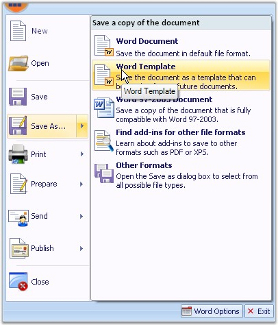{border="0"}

[]{style="COLOR: #15428b"} 

***[]{style="COLOR: #15428b"}*** 

Figure 1313: Office SplitButton

 

OfficeDropDownButton

 

The following properties are specific to OfficeDropDownButton.

[]{style="COLOR: #15428b"} 

::: {align="center"}
  ------------------- -----------------------------------
  Property            Description
  DropDownFont        Sets the font for the dropdown.
  DropDownText        Sets the dropdown text.
  DropDownItems       Specifies the drop down items.
  ShowDropDownArrow   Shows / hides the dropdown arrow.
  ------------------- -----------------------------------
:::

**[]{style="COLOR: #15428b"}** 

**[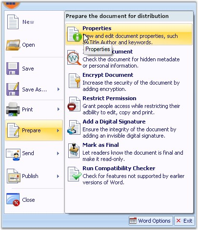{border="0"}]{style="COLOR: #15428b"}[]{style="COLOR: #15428b"}**

**[]{style="COLOR: #15428b"}** 

***[]{style="COLOR: #15428b"}*** 

Figure 1314: Office DropDown Button

 

 

3.15.1.2.3.1.1.3  Tooltips

[]{style="COLOR: #15428b"} 

OfficeMenuButton can show a [[SuperToolTip]{.UGHyperlink}](../../../../../../../../Documents%20and%20Settings/sylviap/Desktop/Tools%20-%20Part%202.docx#_SuperToolTip) at run time. It can be added using **RibbonControlAdv.MenuButtonToolTip on SuperToolTip1** property through Designer or by calling the **SetMenuButtonToolTip** method of the SuperToolTip control.

[]{style="COLOR: #15428b"} 

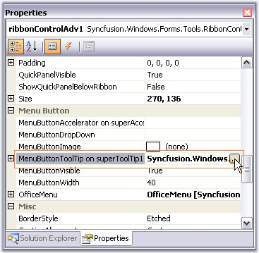{border="0"}

[]{style="COLOR: #15428b"} 

Figure 1315: SuperToolTip Extended property for OfficeMenuButton

**[]{style="COLOR: #15428b"}** 

::: {style="BORDER-BOTTOM: windowtext 1pt solid; BORDER-LEFT: medium none; PADDING-BOTTOM: 1pt; MARGIN: 9pt 0pt 9pt 18pt; PADDING-LEFT: 0pt; PADDING-RIGHT: 0pt; BORDER-TOP: windowtext 1pt solid; BORDER-RIGHT: medium none; PADDING-TOP: 1pt"}
{border="0"} Note: The above extended property will be available only when your application has a SuperToolTip control.
:::

[]{style="COLOR: #15428b"} 

+--------------------------------------------------------------------------------------------------------------------------------------------------------------------------------------------------------------------------------------+
| **[\[C#\]]{style="FONT-FAMILY: 'Courier New'; COLOR: black"}**                                                                                                                                                                       |
|                                                                                                                                                                                                                                      |
| []{style="COLOR: #15428b"}                                                                                                                                                                                                           |
|                                                                                                                                                                                                                                      |
| [this]{style="FONT-FAMILY: 'Courier New'; COLOR: blue"}[.superToolTip1.SetMenuButtonToolTip([this]{style="COLOR: blue"}.ribbonControlAdv1, toolTipInfo1);]{style="FONT-FAMILY: 'Courier New'"}[]{style="FONT-FAMILY: 'Courier New'"} |
+--------------------------------------------------------------------------------------------------------------------------------------------------------------------------------------------------------------------------------------+

[]{style="COLOR: #15428b"} 

+-------------------------------------------------------------------------------------------------------------------------------------------------------------------------------------------+
| **[\[VB.NET\]]{style="FONT-FAMILY: 'Courier New'; COLOR: black"}**                                                                                                                        |
|                                                                                                                                                                                           |
| []{style="COLOR: #15428b"}                                                                                                                                                                |
|                                                                                                                                                                                           |
| [Me]{style="FONT-FAMILY: 'Courier New'; COLOR: blue"}[.superToolTip1.SetMenuButtonToolTip([Me]{style="COLOR: blue"}.ribbonControlAdv1, toolTipInfo1)]{style="FONT-FAMILY: 'Courier New'"} |
+-------------------------------------------------------------------------------------------------------------------------------------------------------------------------------------------+

[]{style="COLOR: #15428b"} 

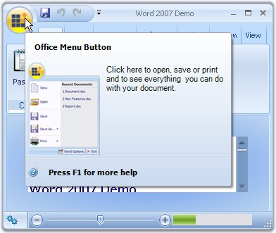{border="0"}

[]{style="COLOR: #15428b"} 

***[]{style="COLOR: #15428b"}*** 

Figure 1316: SuperToolTip Displayed for OfficeMenuButton

\
ToolTips for ToolStrip Items in DropDown

 

Tooltips for the items can be enabled using ShowItemToolTips property.

 

Text for the tooltips can be specified in ToolTipText property of the respective ToolStrip items.

[]{style="COLOR: #15428b"} 

+-------------------------------------------------------------------------------------------------------------------------------------------------------------------------------------------------------+
| **[\[C#\]]{style="FONT-FAMILY: 'Courier New'; COLOR: black"}**                                                                                                                                        |
|                                                                                                                                                                                                       |
| []{style="COLOR: #15428b"}                                                                                                                                                                            |
|                                                                                                                                                                                                       |
| [//Enabling Tooltips for the menu items]{style="FONT-FAMILY: 'Courier New'; COLOR: green"}                                                                                                            |
|                                                                                                                                                                                                       |
| [this]{style="FONT-FAMILY: 'Courier New'; COLOR: blue"}[.ribbonControlAdv1.OfficeMenu.ShowItemToolTips = [true]{style="COLOR: blue"};]{style="FONT-FAMILY: 'Courier New'"}                            |
|                                                                                                                                                                                                       |
| []{style="FONT-FAMILY: 'Courier New'"}                                                                                                                                                                |
|                                                                                                                                                                                                       |
| [//Setting ToolTip text for ToolStripButton1]{style="FONT-FAMILY: 'Courier New'; COLOR: green"}                                                                                                       |
|                                                                                                                                                                                                       |
| [this]{style="FONT-FAMILY: 'Courier New'; COLOR: blue"}[.toolStripButton1.ToolTipText = [\"Open\"]{style="COLOR: maroon"};]{style="FONT-FAMILY: 'Courier New'"}[]{style="FONT-FAMILY: 'Courier New'"} |
+-------------------------------------------------------------------------------------------------------------------------------------------------------------------------------------------------------+

[]{#p1107}[]{style="COLOR: #15428b"} 

+-------------------------------------------------------------------------------------------------------------------------------------------------------------------------------------------------------------------+
| **[\[VB.NET\]]{style="FONT-FAMILY: 'Courier New'; COLOR: black"}**                                                                                                                                                |
|                                                                                                                                                                                                                   |
| []{style="COLOR: #15428b"}                                                                                                                                                                                        |
|                                                                                                                                                                                                                   |
| [\'Enabling Tooltips for the menu items]{style="FONT-FAMILY: 'Courier New'; COLOR: green"}                                                                                                                        |
|                                                                                                                                                                                                                   |
| [Me]{style="FONT-FAMILY: 'Courier New'; COLOR: blue"}[.ribbonControlAdv1.OfficeMenu.ShowItemToolTips = [True]{style="COLOR: blue"}]{style="FONT-FAMILY: 'Courier New'"}                                           |
|                                                                                                                                                                                                                   |
| []{style="FONT-FAMILY: 'Courier New'; COLOR: blue"}                                                                                                                                                               |
|                                                                                                                                                                                                                   |
| [\'Setting ToolTip text for ToolStripButton1]{style="FONT-FAMILY: 'Courier New'; COLOR: green"}                                                                                                                   |
|                                                                                                                                                                                                                   |
| [Me]{style="FONT-FAMILY: 'Courier New'; COLOR: blue"}[.toolStripButton1.ToolTipText = [\"Open\"]{style="COLOR: maroon"}]{style="FONT-FAMILY: 'Courier New'"}[]{style="FONT-FAMILY: 'Courier New'; COLOR: maroon"} |
+-------------------------------------------------------------------------------------------------------------------------------------------------------------------------------------------------------------------+

**[]{style="COLOR: #15428b"}** 

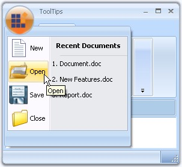{border="0"}

**[]{style="COLOR: #15428b"}** 

Figure 1317: Tooltip set for \"Open\" ToolStripButton Item

**[]{style="COLOR: #15428b"}** 

See Also

**[]{style="COLOR: #15428b"}** 

[[ToolStripItems]{.UGHyperlink}](../../../../../../../../Documents%20and%20Settings/sylviap/Desktop/Tools%20-%20Part%202.docx#_ToolStripItems)[]{.UGHyperlink}

 

 

[]{#_MenuButton_Settings}3.15.1.2.3.1.2     MenuButton Settings

[]{style="COLOR: #15428b"} 

The following properties controls the appearance of the Menu button.

[]{style="COLOR: #15428b"} 

::: {align="center"}
  ------------------- --------------------------------------------------
  Property            Description
  MenuButtonVisible   Sets the visibility of the OfficeMenuButton.
  MenuButtonImage     Gets or sets the image for the OfficeMenuButton.
  MenuButtonWidth     Specifies the width of the menu button.
  ------------------- --------------------------------------------------
:::

[]{style="COLOR: #15428b"} 

+--------------------------------------------------------------------------------------------------------------------------------------------------------------------------------------------------------------------------------------------------------------+
| **[\[C#\]]{style="FONT-FAMILY: 'Courier New'; COLOR: black"}**                                                                                                                                                                                               |
|                                                                                                                                                                                                                                                              |
| []{style="COLOR: #15428b"}                                                                                                                                                                                                                                   |
|                                                                                                                                                                                                                                                              |
| [//Sets the visibility of the Menu Button]{style="FONT-FAMILY: 'Courier New'; COLOR: green"}                                                                                                                                                                 |
|                                                                                                                                                                                                                                                              |
| [this]{style="FONT-FAMILY: 'Courier New'; COLOR: blue"}[.ribbonControlAdv1.MenuButtonVisible = [true]{style="COLOR: blue"};]{style="FONT-FAMILY: 'Courier New'"}                                                                                             |
|                                                                                                                                                                                                                                                              |
| []{style="FONT-FAMILY: 'Courier New'"}                                                                                                                                                                                                                       |
|                                                                                                                                                                                                                                                              |
| [//Sets image for the Menu Button]{style="FONT-FAMILY: 'Courier New'; COLOR: green"}                                                                                                                                                                         |
|                                                                                                                                                                                                                                                              |
| [Image img = Image.FromFile(Application.StartupPath + @\"\\image.png\");]{style="FONT-FAMILY: 'Courier New'; COLOR: black"}                                                                                                                                  |
|                                                                                                                                                                                                                                                              |
| [this]{style="FONT-FAMILY: 'Courier New'; COLOR: blue"}[.]{style="FONT-FAMILY: 'Courier New'; COLOR: black"}[ribbonControlAdv1.MenuButtonImage = img]{style="FONT-FAMILY: 'Courier New'; COLOR: black"}[;]{style="FONT-FAMILY: 'Courier New'; COLOR: black"} |
|                                                                                                                                                                                                                                                              |
| []{style="FONT-FAMILY: 'Courier New'; COLOR: black"}                                                                                                                                                                                                         |
|                                                                                                                                                                                                                                                              |
| [//Sets width of the Menu Button]{style="FONT-FAMILY: 'Courier New'; COLOR: green"}                                                                                                                                                                          |
|                                                                                                                                                                                                                                                              |
| [this]{style="FONT-FAMILY: 'Courier New'; COLOR: blue"}[.ribbonControlAdv1.MenuButtonWidth = 50;]{style="FONT-FAMILY: 'Courier New'; COLOR: black"}[]{style="FONT-FAMILY: 'Courier New'; COLOR: black"}                                                      |
+--------------------------------------------------------------------------------------------------------------------------------------------------------------------------------------------------------------------------------------------------------------+

[]{style="COLOR: #15428b"} 

+----------------------------------------------------------------------------------------------------------------------------------------------------------------------------------------------------------------------------------------------------------------------------------------------+
| **[\[VB.NET\]]{style="FONT-FAMILY: 'Courier New'; COLOR: black"}**                                                                                                                                                                                                                           |
|                                                                                                                                                                                                                                                                                              |
| []{style="COLOR: #15428b"}                                                                                                                                                                                                                                                                   |
|                                                                                                                                                                                                                                                                                              |
| [\'Sets the visibility of the Menu Button]{style="FONT-FAMILY: 'Courier New'; COLOR: green"}                                                                                                                                                                                                 |
|                                                                                                                                                                                                                                                                                              |
| [Me]{style="FONT-FAMILY: 'Courier New'; COLOR: blue"}[.ribbonControlAdv1.MenuButtonVisible = [True]{style="COLOR: blue"}]{style="FONT-FAMILY: 'Courier New'"}                                                                                                                                |
|                                                                                                                                                                                                                                                                                              |
| []{style="FONT-FAMILY: 'Courier New'; COLOR: blue"}                                                                                                                                                                                                                                          |
|                                                                                                                                                                                                                                                                                              |
| [\'Sets image for the Menu Button]{style="FONT-FAMILY: 'Courier New'; COLOR: green"}                                                                                                                                                                                                         |
|                                                                                                                                                                                                                                                                                              |
| [Dim]{style="FONT-FAMILY: 'Courier New'; COLOR: blue"}[ img ]{style="FONT-FAMILY: 'Courier New'; COLOR: black"}[As]{style="FONT-FAMILY: 'Courier New'; COLOR: blue"}[ Image =  Image.FromFile(Application.StartupPath + \"\\image.png\") ]{style="FONT-FAMILY: 'Courier New'; COLOR: black"} |
|                                                                                                                                                                                                                                                                                              |
| [Me]{style="FONT-FAMILY: 'Courier New'; COLOR: blue"}[.ribbonControlAdv1.MenuButtonImage = img]{style="FONT-FAMILY: 'Courier New'; COLOR: black"}                                                                                                                                            |
|                                                                                                                                                                                                                                                                                              |
| []{style="FONT-FAMILY: 'Courier New'; COLOR: black"}                                                                                                                                                                                                                                         |
|                                                                                                                                                                                                                                                                                              |
| [\'Sets width of the Menu Button]{style="FONT-FAMILY: 'Courier New'; COLOR: green"}                                                                                                                                                                                                          |
|                                                                                                                                                                                                                                                                                              |
| [Me]{style="FONT-FAMILY: 'Courier New'; COLOR: blue"}[.ribbonControlAdv1.MenuButtonWidth = 50]{style="FONT-FAMILY: 'Courier New'; COLOR: black"}[]{style="FONT-FAMILY: 'Courier New'; COLOR: black"}                                                                                         |
+----------------------------------------------------------------------------------------------------------------------------------------------------------------------------------------------------------------------------------------------------------------------------------------------+

**[]{style="COLOR: #15428b"}** 

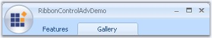{border="0"}

[]{style="COLOR: #15428b"} 

Figure 1318: MenuButton with Image; MenuButtonWidth = \"50\"

 

MenuButtonAccelerator

 

When the SuperAccelerator component is added to the form, an extender property MenuButtonAccelerator on superAccelerator will be added to the RibbonControlAdv properties, where the user can add the key for MenuButton.

[]{style="COLOR: #15428b"} 

+-----------------------------------------------------------------------------------------------------------------------------------------------------------------------------------------------------------------------------------------------------------------+
| []{#p1108}**[\[C#\]]{style="FONT-FAMILY: 'Courier New'; COLOR: black"}**                                                                                                                                                                                        |
|                                                                                                                                                                                                                                                                 |
| []{style="COLOR: #15428b"}                                                                                                                                                                                                                                      |
|                                                                                                                                                                                                                                                                 |
| [this]{style="FONT-FAMILY: 'Courier New'; COLOR: blue"}[.superAccelerator1.SetMenuButtonAccelerator([this]{style="COLOR: blue"}.ribbonControlAdv1, [\"F\"]{style="COLOR: maroon"}); ]{style="FONT-FAMILY: 'Courier New'"}[]{style="FONT-FAMILY: 'Courier New'"} |
+-----------------------------------------------------------------------------------------------------------------------------------------------------------------------------------------------------------------------------------------------------------------+

[]{style="COLOR: #15428b"} 

+----------------------------------------------------------------------------------------------------------------------------------------------------------------------------------------------------------------------------------+
| **[\[VB.NET\]]{style="FONT-FAMILY: 'Courier New'; COLOR: black"}**                                                                                                                                                               |
|                                                                                                                                                                                                                                  |
| []{style="COLOR: #15428b"}                                                                                                                                                                                                       |
|                                                                                                                                                                                                                                  |
| [Me]{style="FONT-FAMILY: 'Courier New'; COLOR: blue"}[.superAccelerator1.SetMenuButtonAccelerator([Me]{style="COLOR: blue"}.ribbonControlAdv1, \"F\")]{style="FONT-FAMILY: 'Courier New'"}[]{style="FONT-FAMILY: 'Courier New'"} |
+----------------------------------------------------------------------------------------------------------------------------------------------------------------------------------------------------------------------------------+

**[]{style="COLOR: #15428b"}** 

At run time when you press Alt key, the menu button will display \"F\" key as shown in the image.

[]{style="COLOR: #15428b"} 

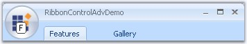{border="0"}

[]{style="COLOR: #15428b"} 

Figure 1319: SuperAccelerator set for MenuButton

 

###### []{#_ToolStripTabItem}3.15.1.2.3.2        ToolStripTabItem {#toolstriptabitem style="tab-stops: 0pt"}

[]{style="COLOR: #15428b"} 

RibbonControlAdv lets you to create ToolStripTabItems easily using the smart tag. It also adds a RibbonPanel to which [ToolStripItems]{style="COLOR: black"} can be added.

[]{style="COLOR: #15428b"} 

[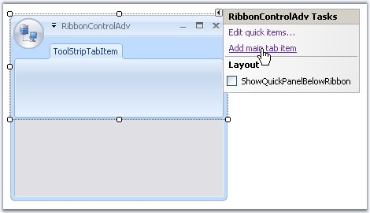{border="0"}]{style="COLOR: #15428b"}[]{style="COLOR: #15428b"}

[]{style="COLOR: #15428b"} 

***[]{style="COLOR: #15428b"}*** 

Figure 1320: Adding ToolStripTabItem Through Smart Tag in Designer

[]{style="COLOR: #15428b"} 

A new TabItem can be added to the RibbonControlAdv programmatically using the **AddMainItem** method. Create a ToolStripTabItem and then add it to the RibbonControlAdv using the below method.

[]{style="COLOR: #15428b"} 

+------------------------------------------------------------------------------------------------------------------------------------------------------------------------------------------------------------------------+
| **[\[C#\]]{style="FONT-FAMILY: 'Courier New'; COLOR: black"}**                                                                                                                                                         |
|                                                                                                                                                                                                                        |
| []{style="COLOR: #15428b"}                                                                                                                                                                                             |
|                                                                                                                                                                                                                        |
| [// Adding a new Tab Item]{style="FONT-FAMILY: 'Courier New'; COLOR: green"}                                                                                                                                           |
|                                                                                                                                                                                                                        |
| [//Declare and initialize a ToolStripTabItem]{style="FONT-FAMILY: 'Courier New'; COLOR: green"}                                                                                                                        |
|                                                                                                                                                                                                                        |
| [private]{style="FONT-FAMILY: 'Courier New'; COLOR: blue"}[ Syncfusion.Windows.Forms.Tools.[ToolStripTabItem]{style="COLOR: teal"} toolStripTabItem1;]{style="FONT-FAMILY: 'Courier New'"}                             |
|                                                                                                                                                                                                                        |
| [this]{style="FONT-FAMILY: 'Courier New'; COLOR: blue"}[.toolStripTabItem1 = [new]{style="COLOR: blue"} Syncfusion.Windows.Forms.Tools.[ToolStripTabItem]{style="COLOR: teal"}();]{style="FONT-FAMILY: 'Courier New'"} |
|                                                                                                                                                                                                                        |
| []{style="FONT-FAMILY: 'Courier New'"}                                                                                                                                                                                 |
|                                                                                                                                                                                                                        |
| [//Add the tab item to the RibbonControlAdv]{style="FONT-FAMILY: 'Courier New'; COLOR: green"}                                                                                                                         |
|                                                                                                                                                                                                                        |
| [this]{style="FONT-FAMILY: 'Courier New'; COLOR: blue"}[.ribbonControlAdv1.Header.AddMainItem([this]{style="COLOR: blue"}.toolStripTabItem1);]{style="FONT-FAMILY: 'Courier New'"}                                     |
+------------------------------------------------------------------------------------------------------------------------------------------------------------------------------------------------------------------------+

[]{style="COLOR: #15428b"} 

+---------------------------------------------------------------------------------------------------------------------------------------------------------------------------------------------------------------------+
| **[\[VB.NET\]]{style="FONT-FAMILY: 'Courier New'; COLOR: black"}**                                                                                                                                                  |
|                                                                                                                                                                                                                     |
| []{style="COLOR: #15428b"}                                                                                                                                                                                          |
|                                                                                                                                                                                                                     |
| [\'Adding a new Tab Item]{style="FONT-FAMILY: 'Courier New'; COLOR: green"}                                                                                                                                         |
|                                                                                                                                                                                                                     |
| [\'Declare and initialize a ToolStripTabItem]{style="FONT-FAMILY: 'Courier New'; COLOR: green"}                                                                                                                     |
|                                                                                                                                                                                                                     |
| [Private]{style="FONT-FAMILY: 'Courier New'; COLOR: blue"}[ toolStripTabItem1 [As]{style="COLOR: blue"} Syncfusion.Windows.Forms.Tools.ToolStripTabItem]{style="FONT-FAMILY: 'Courier New'"}                        |
|                                                                                                                                                                                                                     |
| [Me]{style="FONT-FAMILY: 'Courier New'; COLOR: blue"}[.toolStripTabItem1 = [New]{style="COLOR: blue"} Syncfusion.Windows.Forms.Tools.ToolStripTabItem ]{style="FONT-FAMILY: 'Courier New'"}                         |
|                                                                                                                                                                                                                     |
| []{style="FONT-FAMILY: 'Courier New'"}                                                                                                                                                                              |
|                                                                                                                                                                                                                     |
| [\'Add the tab item to the RibbonControlAdv]{style="FONT-FAMILY: 'Courier New'; COLOR: green"}                                                                                                                      |
|                                                                                                                                                                                                                     |
| [Me]{style="FONT-FAMILY: 'Courier New'; COLOR: blue"}[.ribbonControlAdv1.Header.AddMainItem([Me]{style="COLOR: blue"}.toolStripTabItem1)]{style="FONT-FAMILY: 'Courier New'"}[]{style="FONT-FAMILY: 'Courier New'"} |
+---------------------------------------------------------------------------------------------------------------------------------------------------------------------------------------------------------------------+

[]{style="COLOR: #15428b"} 

The following sections discusses various appearance and behavior settings for the ToolStripTabItem.

[]{style="COLOR: #15428b"} 

[·      ]{style="FONT-FAMILY: Symbol"}Foreground Settings

[·      ]{style="FONT-FAMILY: Symbol"}Image Settings

[·      ]{style="FONT-FAMILY: Symbol"}Ribbon Panel

[·      ]{style="FONT-FAMILY: Symbol"}Keyboard Shortcut

[·      ]{style="FONT-FAMILY: Symbol"}Appearance and Behavior Settings

 

 

3.15.1.2.3.2.1     Foreground Settings

 

**Text Settings**

 

The following properties lets you to edit and control the behavior of the text in the ToolStripTabItem.

 

::: {align="center"}
+-----------------------------------+--------------------------------------------------------------------------------------------------------------------------------+
| Property                          | Description                                                                                                                    |
+-----------------------------------+--------------------------------------------------------------------------------------------------------------------------------+
| Text                              | Text for the ToolStripTabItem.                                                                                                 |
+-----------------------------------+--------------------------------------------------------------------------------------------------------------------------------+
| TextAlign                         | Alignment of the text in a ToolStripTabItem. The different content alignments are,                                             |
|                                   |                                                                                                                                |
|                                   |                                                                                                                                |
|                                   |                                                                                                                                |
|                                   | [·      ]{style="FONT-FAMILY: Symbol"}*BottomCenter* - Vertically aligned at bottom, horizontally aligned at center.           |
|                                   |                                                                                                                                |
|                                   | [·      ]{style="FONT-FAMILY: Symbol"}*BottomLeft* - Vertically aligned at bottom, horizontally aligned at left.               |
|                                   |                                                                                                                                |
|                                   | [·      ]{style="FONT-FAMILY: Symbol"}*BottomRight* - Vertically aligned at bottom, horizontally aligned at Right.             |
|                                   |                                                                                                                                |
|                                   | [·      ]{style="FONT-FAMILY: Symbol"}*MiddleCenter* - Vertically aligned at Middle, horizontally aligned at Center. (Default) |
|                                   |                                                                                                                                |
|                                   | [·      ]{style="FONT-FAMILY: Symbol"}*MiddleLeft* - Vertically aligned at Middle, horizontally aligned at Left.               |
|                                   |                                                                                                                                |
|                                   | [·      ]{style="FONT-FAMILY: Symbol"}*MiddleRight* - Vertically aligned at Middle, horizontally aligned at Right.             |
|                                   |                                                                                                                                |
|                                   | [·      ]{style="FONT-FAMILY: Symbol"}*TopCenter* - Vertically aligned at Top, horizontally aligned at Center.                 |
|                                   |                                                                                                                                |
|                                   | [·      ]{style="FONT-FAMILY: Symbol"}*TopLeft* - Vertically aligned at Top, horizontally aligned at Left.                     |
|                                   |                                                                                                                                |
|                                   | [·      ]{style="FONT-FAMILY: Symbol"}*TopRight* - Vertically aligned at Top, horizontally aligned at Right.                   |
+-----------------------------------+--------------------------------------------------------------------------------------------------------------------------------+
| TextDirection                     | Direction of drawing the text.                                                                                                 |
|                                   |                                                                                                                                |
|                                   |                                                                                                                                |
|                                   |                                                                                                                                |
|                                   | [·      ]{style="FONT-FAMILY: Symbol"}*Horizontal* - specifies horizontal text orientation; (Default)                          |
|                                   |                                                                                                                                |
|                                   | [·      ]{style="FONT-FAMILY: Symbol"}*Inherit* - specifies that the text direction is inherited from the parent control;      |
|                                   |                                                                                                                                |
|                                   | [·      ]{style="FONT-FAMILY: Symbol"}*Vertical270* - specifies that the text is rotated 270 degrees;                          |
|                                   |                                                                                                                                |
|                                   | [·      ]{style="FONT-FAMILY: Symbol"}*Vertical90* - specifies that the text is rotated 90 degrees.                            |
+-----------------------------------+--------------------------------------------------------------------------------------------------------------------------------+
| TextImageRelation                 | Relative location of the image to the text in the ToolStripTabItem. See [Image Settings]{style="COLOR: black"}.                |
|                                   |                                                                                                                                |
|                                   |                                                                                                                                |
|                                   |                                                                                                                                |
|                                   | The various options available are,                                                                                             |
|                                   |                                                                                                                                |
|                                   |                                                                                                                                |
|                                   |                                                                                                                                |
|                                   | [·      ]{style="FONT-FAMILY: Symbol"}*Overlay,*                                                                               |
|                                   |                                                                                                                                |
|                                   | [·      ]{style="FONT-FAMILY: Symbol"}*ImageAboveText, (Default)*                                                              |
|                                   |                                                                                                                                |
|                                   | [·      ]{style="FONT-FAMILY: Symbol"}*TextAboveImage,*                                                                        |
|                                   |                                                                                                                                |
|                                   | [·      ]{style="FONT-FAMILY: Symbol"}*ImageBeforeText and*                                                                    |
|                                   |                                                                                                                                |
|                                   | [·      ]{style="FONT-FAMILY: Symbol"}*TextBeforeImage.*                                                                       |
+-----------------------------------+--------------------------------------------------------------------------------------------------------------------------------+
| DisplayStyle                      | Specifies whether image and text are rendered. The options are,                                                                |
|                                   |                                                                                                                                |
|                                   |                                                                                                                                |
|                                   |                                                                                                                                |
|                                   | [·      ]{style="FONT-FAMILY: Symbol"}Text,                                                                                    |
|                                   |                                                                                                                                |
|                                   | [·      ]{style="FONT-FAMILY: Symbol"}Image and                                                                                |
|                                   |                                                                                                                                |
|                                   | [·      ]{style="FONT-FAMILY: Symbol"}ImageAndText.(Default)                                                                   |
+-----------------------------------+--------------------------------------------------------------------------------------------------------------------------------+
:::

[]{style="COLOR: #15428b"} 

+--------------------------------------------------------------------------------------------------------------------------------------------------------------------------------------------------------------------+
| **[\[C#\]]{style="FONT-FAMILY: 'Courier New'; COLOR: black"}**                                                                                                                                                     |
|                                                                                                                                                                                                                    |
| []{style="COLOR: #15428b"}                                                                                                                                                                                         |
|                                                                                                                                                                                                                    |
| [this]{style="FONT-FAMILY: 'Courier New'; COLOR: blue"}[.toolStripTabItem1.Text = [\"Features\"]{style="COLOR: maroon"};]{style="FONT-FAMILY: 'Courier New'"}                                                      |
|                                                                                                                                                                                                                    |
| [this]{style="FONT-FAMILY: 'Courier New'; COLOR: blue"}[.toolStripTabItem1.TextAlign = System.Drawing.[ContentAlignment]{style="COLOR: teal"}.MiddleLeft;]{style="FONT-FAMILY: 'Courier New'"}                     |
|                                                                                                                                                                                                                    |
| [this]{style="FONT-FAMILY: 'Courier New'; COLOR: blue"}[.toolStripTabItem1.TextDirection = System.Windows.Forms.[ToolStripTextDirection]{style="COLOR: teal"}.Horizontal;]{style="FONT-FAMILY: 'Courier New'"}     |
|                                                                                                                                                                                                                    |
| [this]{style="FONT-FAMILY: 'Courier New'; COLOR: blue"}[.toolStripTabItem1.TextImageRelation = System.Windows.Forms.[TextImageRelation]{style="COLOR: teal"}.ImageBeforeText;]{style="FONT-FAMILY: 'Courier New'"} |
|                                                                                                                                                                                                                    |
| [this]{style="FONT-FAMILY: 'Courier New'; COLOR: blue"}[.toolStripTabItem1.DisplayStyle = [ToolStripItemDisplayStyle]{style="COLOR: teal"}.ImageAndText;]{style="FONT-FAMILY: 'Courier New'"}                      |
+--------------------------------------------------------------------------------------------------------------------------------------------------------------------------------------------------------------------+

[]{style="COLOR: #15428b"} 

+-----------------------------------------------------------------------------------------------------------------------------------------------------------------------------------------------------------------------------------+
| **[\[VB.NET\]]{style="FONT-FAMILY: 'Courier New'; COLOR: black"}**                                                                                                                                                                |
|                                                                                                                                                                                                                                   |
| []{style="COLOR: #15428b"}                                                                                                                                                                                                        |
|                                                                                                                                                                                                                                   |
| [Me]{style="FONT-FAMILY: 'Courier New'; COLOR: blue"}[.toolStripTabItem1.Text = [\"Features\"]{style="COLOR: maroon"}]{style="FONT-FAMILY: 'Courier New'"}                                                                        |
|                                                                                                                                                                                                                                   |
| [Me]{style="FONT-FAMILY: 'Courier New'; COLOR: blue"}[.toolStripTabItem1.TextAlign = System.Drawing.[ContentAlignment]{style="COLOR: black"}.MiddleLeft]{style="FONT-FAMILY: 'Courier New'"}                                      |
|                                                                                                                                                                                                                                   |
| [Me]{style="FONT-FAMILY: 'Courier New'; COLOR: blue"}[.toolStripTabItem1.TextDirection = System.Windows.Forms.[ToolStripTextDirection]{style="COLOR: black"}.Horizontal]{style="FONT-FAMILY: 'Courier New'"}                      |
|                                                                                                                                                                                                                                   |
| [Me]{style="FONT-FAMILY: 'Courier New'; COLOR: blue"}[.toolStripTabItem1.TextImageRelation = System.Windows.Forms.[TextImageRelation]{style="COLOR: black"}.ImageBeforeText]{style="FONT-FAMILY: 'Courier New'"}                  |
|                                                                                                                                                                                                                                   |
| [Me]{style="FONT-FAMILY: 'Courier New'; COLOR: blue"}[.toolStripTabItem1.DisplayStyle = [ToolStripItemDisplayStyle]{style="COLOR: black"}.ImageAndText]{style="FONT-FAMILY: 'Courier New'"}[]{style="FONT-FAMILY: 'Courier New'"} |
+-----------------------------------------------------------------------------------------------------------------------------------------------------------------------------------------------------------------------------------+

[]{style="COLOR: #15428b"} 

The appearance of the text can be controlled using the below properties.

[]{style="COLOR: #15428b"} 

::: {align="center"}
  -------------------- -------------------------------
  []{#p1109}Property   Description
  Font                 Set Font Style for the text.
  ForeColor            Sets fore color for the text.
  -------------------- -------------------------------
:::

[]{style="COLOR: #15428b"} 

+--------------------------------------------------------------------------------------------------------------------------------------------------------------------------------------------------------------------------------------------------------------------------------------------------+
| **[\[C#\]]{style="FONT-FAMILY: 'Courier New'; COLOR: black"}**                                                                                                                                                                                                                                   |
|                                                                                                                                                                                                                                                                                                  |
| []{style="COLOR: #15428b"}                                                                                                                                                                                                                                                                       |
|                                                                                                                                                                                                                                                                                                  |
| [this]{style="FONT-FAMILY: 'Courier New'; COLOR: blue"}[.toolStripTabItem1.Font = [new]{style="COLOR: blue"} System.Drawing.[Font]{style="COLOR: teal"}([\"Verdana\"]{style="COLOR: maroon"}, 8.25F, System.Drawing.[FontStyle]{style="COLOR: teal"}.Bold);]{style="FONT-FAMILY: 'Courier New'"} |
|                                                                                                                                                                                                                                                                                                  |
| [this]{style="FONT-FAMILY: 'Courier New'; COLOR: blue"}[.toolStripTabItem1.ForeColor = System.Drawing.[Color]{style="COLOR: teal"}.SteelBlue;]{style="FONT-FAMILY: 'Courier New'"}                                                                                                               |
+--------------------------------------------------------------------------------------------------------------------------------------------------------------------------------------------------------------------------------------------------------------------------------------------------+

[]{style="COLOR: #15428b"} 

+-------------------------------------------------------------------------------------------------------------------------------------------------------------------------------------------------------------------------------------------------------------------------------------------------+
| **[\[VB.NET\]]{style="FONT-FAMILY: 'Courier New'; COLOR: black"}**                                                                                                                                                                                                                              |
|                                                                                                                                                                                                                                                                                                 |
| []{style="COLOR: #15428b"}                                                                                                                                                                                                                                                                      |
|                                                                                                                                                                                                                                                                                                 |
| [Me]{style="FONT-FAMILY: 'Courier New'; COLOR: blue"}[.toolStripTabItem1.Font = [New]{style="COLOR: blue"} System.Drawing.[Font]{style="COLOR: black"}([\"Verdana\"]{style="COLOR: maroon"}, 8.25F, System.Drawing.[FontStyle]{style="COLOR: black"}.Bold)]{style="FONT-FAMILY: 'Courier New'"} |
|                                                                                                                                                                                                                                                                                                 |
| [Me]{style="FONT-FAMILY: 'Courier New'; COLOR: blue"}[.toolStripTabItem1.ForeColor = System.Drawing.[Color]{style="COLOR: black"}.SteelBlue]{style="FONT-FAMILY: 'Courier New'"}                                                                                                                |
+-------------------------------------------------------------------------------------------------------------------------------------------------------------------------------------------------------------------------------------------------------------------------------------------------+

[]{style="COLOR: #15428b"} 

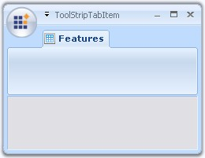{border="0"}

[]{style="COLOR: #15428b"} 

Figure 1321: ToolStripTabItem with above Text and Foreground Settings

**[]{style="COLOR: #15428b"}** 

See Also

[]{style="COLOR: #15428b"} 

[[Image Settings]{style="COLOR: windowtext; TEXT-DECORATION: none; text-underline: none"}](../../../../../../../../Documents%20and%20Settings/sylviap/Desktop/Tools%20-%20Part%202.docx#_Image_Settings)[, ]{style="COLOR: #15428b"}[[RibbonPanel]{style="COLOR: windowtext; TEXT-DECORATION: none; text-underline: none"}](../../../../../../../../Documents%20and%20Settings/sylviap/Desktop/Tools%20-%20Part%202.docx#_Ribbon_Panel)[, ]{style="COLOR: #15428b"}[[Appearance and Behavior Settings]{style="COLOR: windowtext; TEXT-DECORATION: none; text-underline: none"}](../../../../../../../../Documents%20and%20Settings/sylviap/Desktop/Tools%20-%20Part%202.docx#_Appearance_and_Behavior)[]{style="COLOR: black"}

 

 

3.15.1.2.3.2.2     Image Settings

[]{style="COLOR: #15428b"} 

The below properties controls the image settings for the ToolStripTabItem.

[]{style="COLOR: #15428b"} 

::: {align="center"}
  ----------------------- ----------------------------------------------------------------------------
  Property                Description
  Image                   Sets the image for the Tab item.
  ImageAlign              Specifies alignment of the image.
  ImageScaling            Specifies whether the image on the item will size to fit on the Toolstrip.
  ImageTransparentColor   Sets the transparent color on the items image.
  ----------------------- ----------------------------------------------------------------------------
:::

[]{style="COLOR: #15428b"} 

+-----------------------------------------------------------------------------------------------------------------------------------------------------------------------------------------------------------------------------------------------------+
| **[\[]{style="FONT-FAMILY: 'Courier New'; COLOR: black"}[C#\]]{style="FONT-FAMILY: 'Courier New'; COLOR: black"}[]{style="FONT-FAMILY: 'Courier New'; COLOR: black"}**                                                                              |
|                                                                                                                                                                                                                                                     |
| []{style="COLOR: #15428b"}                                                                                                                                                                                                                          |
|                                                                                                                                                                                                                                                     |
| [//Settings image properties]{style="FONT-FAMILY: 'Courier New'; COLOR: green"}                                                                                                                                                                     |
|                                                                                                                                                                                                                                                     |
| [this]{style="FONT-FAMILY: 'Courier New'; COLOR: blue"}[.toolStripTabItem1.Image = ((System.Drawing.[Image]{style="COLOR: teal"})(resources.GetObject([\"toolStripTabItem1.Image\"]{style="COLOR: maroon"})));]{style="FONT-FAMILY: 'Courier New'"} |
|                                                                                                                                                                                                                                                     |
| [this]{style="FONT-FAMILY: 'Courier New'; COLOR: blue"}[.toolStripTabItem1.ImageAlign = System.Drawing.[ContentAlignment]{style="COLOR: teal"}.MiddleRight;]{style="FONT-FAMILY: 'Courier New'"}                                                    |
|                                                                                                                                                                                                                                                     |
| [this]{style="FONT-FAMILY: 'Courier New'; COLOR: blue"}[.toolStripTabItem1.ImageScaling = System.Windows.Forms.[ToolStripItemImageScaling]{style="COLOR: teal"}.None;]{style="FONT-FAMILY: 'Courier New'"}                                          |
|                                                                                                                                                                                                                                                     |
| [this]{style="FONT-FAMILY: 'Courier New'; COLOR: blue"}[.toolStripTabItem1.ImageTransparentColor = System.Drawing.[Color]{style="COLOR: teal"}.FloralWhite;]{style="FONT-FAMILY: 'Courier New'"}[]{style="FONT-FAMILY: 'Courier New'"}              |
+-----------------------------------------------------------------------------------------------------------------------------------------------------------------------------------------------------------------------------------------------------+

[]{#p1110}[]{style="COLOR: #15428b"} 

+--------------------------------------------------------------------------------------------------------------------------------------------------------------------------------------------------------------------------------------------------+
| **[\[VB.NET\]]{style="FONT-FAMILY: 'Courier New'; COLOR: black"}**                                                                                                                                                                               |
|                                                                                                                                                                                                                                                  |
| []{style="COLOR: #15428b"}                                                                                                                                                                                                                       |
|                                                                                                                                                                                                                                                  |
| [\'Settings image properties]{style="FONT-FAMILY: 'Courier New'; COLOR: green"}                                                                                                                                                                  |
|                                                                                                                                                                                                                                                  |
| [Me]{style="FONT-FAMILY: 'Courier New'; COLOR: blue"}[.toolStripTabItem1.Image = ((System.Drawing.[Image]{style="COLOR: teal"})(resources.GetObject([\"toolStripTabItem1.Image\"]{style="COLOR: maroon"})))]{style="FONT-FAMILY: 'Courier New'"} |
|                                                                                                                                                                                                                                                  |
| [Me]{style="FONT-FAMILY: 'Courier New'; COLOR: blue"}[.toolStripTabItem1.ImageAlign = System.Drawing.[ContentAlignment]{style="COLOR: teal"}.MiddleRight]{style="FONT-FAMILY: 'Courier New'"}                                                    |
|                                                                                                                                                                                                                                                  |
| [Me]{style="FONT-FAMILY: 'Courier New'; COLOR: blue"}[.toolStripTabItem1.ImageScaling = System.Windows.Forms.[ToolStripItemImageScaling]{style="COLOR: teal"}.None]{style="FONT-FAMILY: 'Courier New'"}                                          |
|                                                                                                                                                                                                                                                  |
| [Me]{style="FONT-FAMILY: 'Courier New'; COLOR: blue"}[.toolStripTabItem1.ImageTransparentColor = System.Drawing.[Color]{style="COLOR: teal"}.FloralWhite]{style="FONT-FAMILY: 'Courier New'"}[]{style="FONT-FAMILY: 'Courier New'"}              |
+--------------------------------------------------------------------------------------------------------------------------------------------------------------------------------------------------------------------------------------------------+

[]{style="COLOR: #15428b"} 

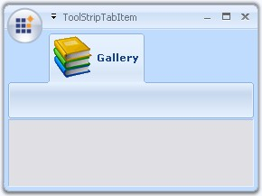{border="0"}

[]{style="COLOR: #15428b"} 

Figure 1322: ImageScaling = \"None\"; ImageAlign = \"MiddleRight\"

[]{style="COLOR: #15428b"} 

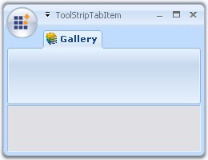{border="0"}

**[]{style="COLOR: #15428b"}** 

Figure 1323: ImageScaling = \"SizeToFit\"; ImageAlign = \"MiddleRight\"

**[]{style="COLOR: #15428b"}** 

See Also

[]{style="COLOR: #15428b"} 

[[Foreground Settings]{style="COLOR: windowtext; TEXT-DECORATION: none; text-underline: none"}](../../../../../../../../Documents%20and%20Settings/sylviap/Desktop/Tools%20-%20Part%202.docx#_Foreground_Settings)[, ]{style="COLOR: #15428b"}[[Ribbon Panel]{style="COLOR: windowtext; TEXT-DECORATION: none; text-underline: none"}](../../../../../../../../Documents%20and%20Settings/sylviap/Desktop/Tools%20-%20Part%202.docx#_Ribbon_Panel)[, ]{style="COLOR: #15428b"}[[Keyboard Shortcut]{style="COLOR: windowtext; TEXT-DECORATION: none; text-underline: none"}](../../../../../../../../Documents%20and%20Settings/sylviap/Desktop/Tools%20-%20Part%202.docx#_KeyBoard_Shortcut)[, ]{style="COLOR: #15428b"}[[Appearance and Behavior Settings]{style="COLOR: windowtext; TEXT-DECORATION: none; text-underline: none"}](../../../../../../../../Documents%20and%20Settings/sylviap/Desktop/Tools%20-%20Part%202.docx#_Appearance_and_Behavior)[]{style="COLOR: black"}

 

 

3.15.1.2.3.2.3     Appearance and Behavior Settings

**[]{style="COLOR: #15428b"}** 

Appearance Settings

 

The Padding property specifies the internal padding within the ToolStripTabItem.

[]{style="COLOR: #15428b"} 

+----------------------------------------------------------------------------------------------------------------------------------------------------------------------------------------------------------------------------------------------------+
| **[\[C#\]]{style="FONT-FAMILY: 'Courier New'; COLOR: black"}**                                                                                                                                                                                     |
|                                                                                                                                                                                                                                                    |
| []{style="COLOR: #15428b"}                                                                                                                                                                                                                         |
|                                                                                                                                                                                                                                                    |
| [this]{style="FONT-FAMILY: 'Courier New'; COLOR: blue"}[.toolStripTabItem2.Padding = [new]{style="COLOR: blue"} System.Windows.Forms.[Padding]{style="COLOR: teal"}(4);]{style="FONT-FAMILY: 'Courier New'"}[]{style="FONT-FAMILY: 'Courier New'"} |
+----------------------------------------------------------------------------------------------------------------------------------------------------------------------------------------------------------------------------------------------------+

[]{style="COLOR: #15428b"} 

+----------------------------------------------------------------------------------------------------------------------------------------------------------------------------------------------------------------------------------------------------------------+
| **[\[]{style="FONT-FAMILY: 'Courier New'; COLOR: black"}[VB.NET\]]{style="FONT-FAMILY: 'Courier New'; COLOR: black"}[]{style="FONT-FAMILY: 'Courier New'; COLOR: black"}**                                                                                     |
|                                                                                                                                                                                                                                                                |
| []{style="COLOR: #15428b"}                                                                                                                                                                                                                                     |
|                                                                                                                                                                                                                                                                |
| [Me]{style="FONT-FAMILY: 'Courier New'; COLOR: blue"}[.]{style="FONT-FAMILY: 'Courier New'; COLOR: black"}[toolStripTabItem2.Padding = [New]{style="COLOR: blue"} System.Windows.Forms.[Padding]{style="COLOR: black"}(4)]{style="FONT-FAMILY: 'Courier New'"} |
+----------------------------------------------------------------------------------------------------------------------------------------------------------------------------------------------------------------------------------------------------------------+

**[]{style="COLOR: #15428b"}** 

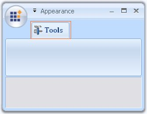{border="0"}

[]{style="COLOR: #15428b"} 

Figure 1324: ToolStripTabItem Padding = \"4\"

**[]{style="COLOR: #15428b"}** 

Behavior Settings

 

The below properties illustrates the behavior settings.

**[]{style="COLOR: #15428b"}** 

::: {align="center"}
  -------------------- -----------------------------------------------------------------------------------------------------------------------------
  Property             Description
  Enabled              Enables the Tab item.
  AutoSize             If set to true, ToolStripTabItem will automatically size itself based on the image and text. Default values is true.
  DoubleClickEnabled   Specifies whether the ToolStripTabItem can be activated by double clicking the tab item. This raises the DoubleClick event.
  Visible              Sets the visibility of the tab item.
  -------------------- -----------------------------------------------------------------------------------------------------------------------------
:::

[]{style="COLOR: #15428b"} 

ToolTips

[]{style="COLOR: #15428b"} 

AutoToolTip and ToolTipText properties are used for this purpose.

[]{style="COLOR: #15428b"} 

::: {align="center"}
  -------------------- --------------------------------------------------------------------------------------------------------------
  []{#p1111}Property   Description
  AutoToolTip          When set to false will display the text set in ToolTipText. When set to true will display the tab item text.
  ToolTipText          Sets the Tooltip text.
  -------------------- --------------------------------------------------------------------------------------------------------------
:::

 

 

[]{#_Ribbon_Panel}3.15.1.2.3.2.4     Ribbon Panel

[]{style="COLOR: #15428b"} 

[]{#p1112}A ribbon panel is automatically added when you add a ToolStripTabItem. [ToolStripEx ]{.UGHyperlink}can be added to the Ribbon panel using its smart tag.

[]{style="COLOR: #15428b"} 

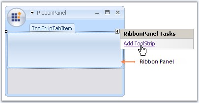{border="0"}

[]{style="COLOR: #15428b"} 

***[]{style="COLOR: #15428b"}*** 

Figure 1325: Adding ToolStripEx to the RibbonPanel

**[]{style="COLOR: #15428b"}** 

See Also

[ ]{.UGHyperlink}[[How to prevent the RibbonPanel of the RibbonControlAdv from collapsing?]{.UGHyperlink}](../../../../../../../../Documents%20and%20Settings/sylviap/Desktop/Tools%20-%20Part%202.docx#_How_to_prevent_1)[]{.UGHyperlink}

 

 

[]{#_OfficeColorScheme}3.15.1.2.3.2.4.1  OfficeColorScheme

 

The ribbon panel supports all the three office color schemes. Blue, black and silver schemes.

[]{style="COLOR: #15428b"} 

+--------------------------------------------------------------------------------------------------------------------------------------------------------------------------------------------------------------------------------------------------------------------------------------------+
| **[\[C#\]]{style="FONT-FAMILY: 'Courier New'; COLOR: black"}**                                                                                                                                                                                                                             |
|                                                                                                                                                                                                                                                                                            |
| []{style="COLOR: #15428b"}                                                                                                                                                                                                                                                                 |
|                                                                                                                                                                                                                                                                                            |
| [this]{style="FONT-FAMILY: 'Courier New'; COLOR: blue"}[.toolStripTabItem2.Panel.OfficeColorScheme = Syncfusion.Windows.Forms.Tools.[ToolStripEx]{style="COLOR: teal"}.[ColorScheme]{style="COLOR: teal"}.Blue;]{style="FONT-FAMILY: 'Courier New'"}[]{style="FONT-FAMILY: 'Courier New'"} |
+--------------------------------------------------------------------------------------------------------------------------------------------------------------------------------------------------------------------------------------------------------------------------------------------+

[]{#p1113}[]{style="COLOR: #15428b"} 

+-------------------------------------------------------------------------------------------------------------------------------------------------------------------------------------------------------------------------------------------------------------------+
| **[\[VB.NET\]]{style="FONT-FAMILY: 'Courier New'; COLOR: black"}**                                                                                                                                                                                                |
|                                                                                                                                                                                                                                                                   |
| []{style="COLOR: #15428b"}                                                                                                                                                                                                                                        |
|                                                                                                                                                                                                                                                                   |
| [Me]{style="FONT-FAMILY: 'Courier New'; COLOR: blue"}[.toolStripTabItem2.Panel.OfficeColorScheme = Syncfusion.Windows.Forms.Tools.[ToolStripEx.ColorScheme]{style="COLOR: black"}.Blue]{style="FONT-FAMILY: 'Courier New'"}[]{style="FONT-FAMILY: 'Courier New'"} |
+-------------------------------------------------------------------------------------------------------------------------------------------------------------------------------------------------------------------------------------------------------------------+

[]{style="COLOR: #15428b"} 

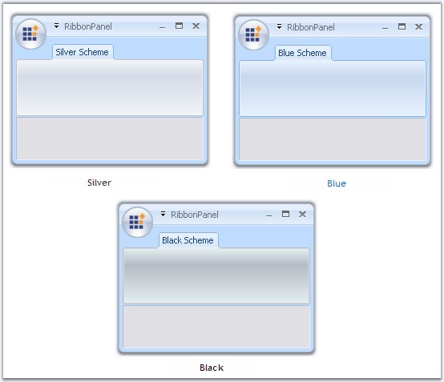{border="0"}

[]{style="COLOR: #15428b"} 

***[]{style="COLOR: #15428b"}*** 

Figure 1326: OfficeColorSchemes for RibbonPanel

 

3.15.1.2.3.2.4.2  Customizing ToolStripEx

 

RibbonControl has the following properties which customizes the ToolStripEx added to the Ribbon Panel.

 

**Caption** **Settings**

[]{#p1114}[]{style="COLOR: #15428b"} 

::: {align="center"}
+-----------------------------------+--------------------------------------------------------------------------------------------------------+
| Property                          | Description                                                                                            |
+-----------------------------------+--------------------------------------------------------------------------------------------------------+
| ShowCaption                       | Sets the visibility of the caption.                                                                    |
+-----------------------------------+--------------------------------------------------------------------------------------------------------+
| CaptionAlignment                  | Sets the alignment of the caption in the control.                                                      |
+-----------------------------------+--------------------------------------------------------------------------------------------------------+
| CaptionFont                       | Sets the font style for the caption.                                                                   |
+-----------------------------------+--------------------------------------------------------------------------------------------------------+
| CaptionMinHeight                  | Sets the minimum height of the caption.                                                                |
+-----------------------------------+--------------------------------------------------------------------------------------------------------+
| CaptionStyle                      | The caption can be placed at the top or bottom of the ToolStripEx using this property. The values are, |
|                                   |                                                                                                        |
|                                   |                                                                                                        |
|                                   |                                                                                                        |
|                                   | [·      ]{style="FONT-FAMILY: Symbol"}Top and                                                          |
|                                   |                                                                                                        |
|                                   | [·      ]{style="FONT-FAMILY: Symbol"}Bottom.                                                          |
+-----------------------------------+--------------------------------------------------------------------------------------------------------+
| CaptionTextStyle                  | Sets the text style for caption. The options are,                                                      |
|                                   |                                                                                                        |
|                                   |                                                                                                        |
|                                   |                                                                                                        |
|                                   | [·      ]{style="FONT-FAMILY: Symbol"}Plain,                                                           |
|                                   |                                                                                                        |
|                                   | [·      ]{style="FONT-FAMILY: Symbol"}Shadow and                                                       |
|                                   |                                                                                                        |
|                                   | [·      ]{style="FONT-FAMILY: Symbol"}Etched.                                                          |
+-----------------------------------+--------------------------------------------------------------------------------------------------------+
:::

[]{style="COLOR: #15428b"} 

Style Settings

[]{#p1115}[]{style="COLOR: #15428b"} 

::: {align="center"}
+-----------------------------------+-------------------------------------------------------------+
| Property                          | Description                                                 |
+-----------------------------------+-------------------------------------------------------------+
| ShowLauncher                      | Sets the visibility of the launcher.                        |
+-----------------------------------+-------------------------------------------------------------+
| BorderStyle                       | Sets the border style for the ToolStripEx. The options are, |
|                                   |                                                             |
|                                   |                                                             |
|                                   |                                                             |
|                                   | [·      ]{style="FONT-FAMILY: Symbol"}None,                 |
|                                   |                                                             |
|                                   | [·      ]{style="FONT-FAMILY: Symbol"}StaticEdge and        |
|                                   |                                                             |
|                                   | [·      ]{style="FONT-FAMILY: Symbol"}Etched (Default).     |
+-----------------------------------+-------------------------------------------------------------+
| LauncherStyle                     | Sets the style of the Launcher button. The options are,     |
|                                   |                                                             |
|                                   |                                                             |
|                                   |                                                             |
|                                   | [·      ]{style="FONT-FAMILY: Symbol"}Office2007 and        |
|                                   |                                                             |
|                                   | [·      ]{style="FONT-FAMILY: Symbol"}Office12.             |
+-----------------------------------+-------------------------------------------------------------+
:::

[]{style="COLOR: #15428b"} 

::: {style="BORDER-BOTTOM: windowtext 1pt solid; BORDER-LEFT: medium none; PADDING-BOTTOM: 1pt; MARGIN-TOP: 9pt; PADDING-LEFT: 0pt; PADDING-RIGHT: 0pt; MARGIN-BOTTOM: 9pt; BORDER-TOP: windowtext 1pt solid; BORDER-RIGHT: medium none; PADDING-TOP: 1pt"}
[{border="0"}]{style="COLOR: #15428b"}[ ]{style="COLOR: #15428b"}Note[: ]{style="COLOR: #15428b"}[These caption and style settings can be overridden by the individual ToolStripEx\'s ]{style="COLOR: #15428b"}[[caption]{.UGHyperlink}](../../../../../../../../Documents%20and%20Settings/sylviap/Desktop/Tools%20-%20Part%202.docx#_Caption_Settings)[ ]{.UGHyperlink}[and ]{style="COLOR: #15428b"}[[style settings.]{.UGHyperlink}](../../../../../../../../Documents%20and%20Settings/sylviap/Desktop/Tools%20-%20Part%202.docx#_Style_Settings)[ ]{style="COLOR: #15428b"}
:::

[]{style="COLOR: #15428b"} 

See Also

**[]{style="COLOR: #15428b"}** 

[ToolStripEx]{.UGHyperlink}

 

 

3.15.1.2.3.2.5     KeyBoard Shortcut

[]{style="COLOR: #15428b"} 

We can also set keyboard shortcut keys for RibbonControl components using **SetShortcut** method. To get the keyboard shortcut for a particular component, use **GetShortcut** method.

[]{style="COLOR: #15428b"} 

::: {align="center"}
+-----------------------------------+----------------------------------------------------------------------------------------------------------+
| Property                          | Description                                                                                              |
+-----------------------------------+----------------------------------------------------------------------------------------------------------+
| SetShortcut                       | Sets shortcut key. The parameters are,                                                                   |
|                                   |                                                                                                          |
|                                   |                                                                                                          |
|                                   |                                                                                                          |
|                                   | [·      ]{style="FONT-FAMILY: Symbol"}*Component* - Component of the RibbonForm.                         |
|                                   |                                                                                                          |
|                                   | [·      ]{style="FONT-FAMILY: Symbol"}*Value* - Represents the shortcut key for the component specified. |
+-----------------------------------+----------------------------------------------------------------------------------------------------------+
| GetShortcut                       | Gets shortcut key. The parameter is,                                                                     |
|                                   |                                                                                                          |
|                                   | [·      ]{style="FONT-FAMILY: Symbol"}*Component* - Component of the RibbonForm.                         |
+-----------------------------------+----------------------------------------------------------------------------------------------------------+
:::

[]{style="COLOR: #15428b"} 

+------------------------------------------------------------------------------------------------------------------------------------------------------------------------------------------------------------------------------------------------------------------------------------------------------------------------------------------------------------------------+
| **[\[C#\]]{style="FONT-FAMILY: 'Courier New'; COLOR: black"}**                                                                                                                                                                                                                                                                                                         |
|                                                                                                                                                                                                                                                                                                                                                                        |
| []{style="COLOR: #15428b"}                                                                                                                                                                                                                                                                                                                                             |
|                                                                                                                                                                                                                                                                                                                                                                        |
| [//Sets shortcut for toolstriptabitem1]{style="FONT-FAMILY: 'Courier New'; COLOR: green"}                                                                                                                                                                                                                                                                              |
|                                                                                                                                                                                                                                                                                                                                                                        |
| [this]{style="FONT-FAMILY: 'Courier New'; COLOR: blue"}[.SetShortcut(]{style="FONT-FAMILY: 'Courier New'; COLOR: black"}[this]{style="FONT-FAMILY: 'Courier New'; COLOR: blue"}[.toolStripTabItem1, ]{style="FONT-FAMILY: 'Courier New'; COLOR: black"}[Keys]{style="FONT-FAMILY: 'Courier New'; COLOR: teal"}[.T);]{style="FONT-FAMILY: 'Courier New'; COLOR: black"} |
|                                                                                                                                                                                                                                                                                                                                                                        |
| []{style="FONT-FAMILY: 'Courier New'; COLOR: black"}                                                                                                                                                                                                                                                                                                                   |
|                                                                                                                                                                                                                                                                                                                                                                        |
| [//Gets shortcut for toolstriptabitem1]{style="FONT-FAMILY: 'Courier New'; COLOR: green"}                                                                                                                                                                                                                                                                              |
|                                                                                                                                                                                                                                                                                                                                                                        |
| [this]{style="FONT-FAMILY: 'Courier New'; COLOR: blue"}[.GetShortcut(]{style="FONT-FAMILY: 'Courier New'; COLOR: black"}[this]{style="FONT-FAMILY: 'Courier New'; COLOR: blue"}[.toolStripTabItem1);]{style="FONT-FAMILY: 'Courier New'; COLOR: black"}[]{style="FONT-FAMILY: 'Courier New'; COLOR: black"}                                                            |
+------------------------------------------------------------------------------------------------------------------------------------------------------------------------------------------------------------------------------------------------------------------------------------------------------------------------------------------------------------------------+

[]{style="COLOR: #15428b"} 

+--------------------------------------------------------------------------------------------------------------------------------------------------------------------------------------------------------------------------------------------------------------------------------------------------------+
| **[\[VB.NET\]]{style="FONT-FAMILY: 'Courier New'; COLOR: black"}**                                                                                                                                                                                                                                     |
|                                                                                                                                                                                                                                                                                                        |
| []{style="COLOR: #15428b"}                                                                                                                                                                                                                                                                             |
|                                                                                                                                                                                                                                                                                                        |
| [\'Sets shortcut for toolstriptabitem1]{style="FONT-FAMILY: 'Courier New'; COLOR: green"}                                                                                                                                                                                                              |
|                                                                                                                                                                                                                                                                                                        |
| [Me]{style="FONT-FAMILY: 'Courier New'; COLOR: blue"}[.SetShortcut(]{style="FONT-FAMILY: 'Courier New'; COLOR: black"}[Me]{style="FONT-FAMILY: 'Courier New'; COLOR: blue"}[.toolStripTabItem1, Keys.T)]{style="FONT-FAMILY: 'Courier New'; COLOR: black"}                                             |
|                                                                                                                                                                                                                                                                                                        |
| []{style="FONT-FAMILY: 'Courier New'; COLOR: black"}                                                                                                                                                                                                                                                   |
|                                                                                                                                                                                                                                                                                                        |
| [\'Gets shortcut for toolstriptabitem1]{style="FONT-FAMILY: 'Courier New'; COLOR: green"}                                                                                                                                                                                                              |
|                                                                                                                                                                                                                                                                                                        |
| [Me]{style="FONT-FAMILY: 'Courier New'; COLOR: blue"}[.GetShortcut(]{style="FONT-FAMILY: 'Courier New'; COLOR: black"}[Me]{style="FONT-FAMILY: 'Courier New'; COLOR: blue"}[.toolStripTabItem1)]{style="FONT-FAMILY: 'Courier New'; COLOR: black"}[]{style="FONT-FAMILY: 'Courier New'; COLOR: black"} |
+--------------------------------------------------------------------------------------------------------------------------------------------------------------------------------------------------------------------------------------------------------------------------------------------------------+

 

 

 

###### []{#_ToolStripEx}3.15.1.2.3.3        ToolStripEx {#toolstripex style="tab-stops: 0pt"}

 

The ToolStrip family of controls provides common interfaces for producing user interface elements for Windows Forms. Essential Tools has come up with ToolStripEx which, exhibits advanced features.

 

Using the smart tag of the Ribbon panel or using \"Add ToolStrip\" verb in the property grid, we can add ToolStripEx controls. ToolStrip items can be added to this ToolStripEx easily.

[]{style="COLOR: #15428b"} 

::: {style="BORDER-BOTTOM: windowtext 1pt solid; BORDER-LEFT: medium none; PADDING-BOTTOM: 1pt; MARGIN: 9pt 0pt 9pt 18pt; PADDING-LEFT: 0pt; PADDING-RIGHT: 0pt; BORDER-TOP: windowtext 1pt solid; BORDER-RIGHT: medium none; PADDING-TOP: 1pt"}
 

{border="0"} Note: It is also possible to add ToolStripEx directly from the toolbox as it is also an individual control.
:::

[]{style="COLOR: #15428b"} 

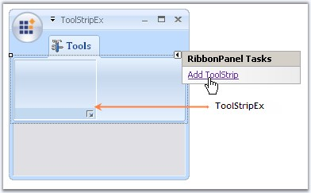{border="0"}

[]{style="COLOR: #15428b"} 

Figure 1327: Adding ToolStripEx Through RibbonPanel Smart Tag

**[]{style="COLOR: #15428b"}** 

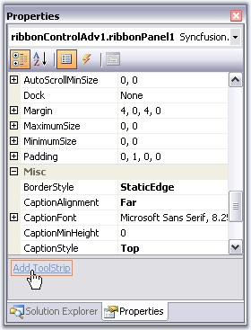{border="0"}

**[]{style="COLOR: #15428b"}** 

Figure 1328: Adding ToolStrip Through Properties Grid Verb

**[]{style="COLOR: #15428b"}** 

See Also

**[]{style="COLOR: #15428b"}** 

[[Adding Controls to ToolStripEx]{.UGHyperlink}](../../../../../../../../Documents%20and%20Settings/sylviap/Desktop/Tools%20-%20Part%202.docx#_Adding_Controls_to)[, ]{.UGHyperlink}[[Style Settings]{.UGHyperlink}](../../../../../../../../Documents%20and%20Settings/sylviap/Desktop/Tools%20-%20Part%202.docx#_Style_Settings)[, ]{.UGHyperlink}[[Appearance Settings]{.UGHyperlink}](../../../../../../../../Documents%20and%20Settings/sylviap/Desktop/Tools%20-%20Part%202.docx#_Appearance_Settings_1)[, ]{.UGHyperlink}[[DesignTime Features]{.UGHyperlink}](../../../../../../../../Documents%20and%20Settings/sylviap/Desktop/Tools%20-%20Part%202.docx#_DesignTime_Features_2)[, ]{.UGHyperlink}[[Caption Settings]{.UGHyperlink}](../../../../../../../../Documents%20and%20Settings/sylviap/Desktop/Tools%20-%20Part%202.docx#_Caption_Settings)[, ]{.UGHyperlink}[[Grouping Items,]{.UGHyperlink}](../../../../../../../../Documents%20and%20Settings/sylviap/Desktop/Tools%20-%20Part%202.docx#_Grouping_Items)[]{.UGHyperlink}

[[Collapsed State Settings]{.UGHyperlink}](../../../../../../../../Documents%20and%20Settings/sylviap/Desktop/Tools%20-%20Part%202.docx#_Collapsed_State_Settings)[, ]{.UGHyperlink}[[Events]{.UGHyperlink}](../../../../../../../../Documents%20and%20Settings/sylviap/Desktop/Tools%20-%20Part%202.docx#_Events_1)[]{.UGHyperlink}

 

 

[]{#_Adding_Controls_to}3.15.1.2.3.3.1     Adding Controls to ToolStripEx

[]{style="COLOR: #15428b"} 

To add controls to the ToolStripEx, click the icon in it, as in the image below.

[]{style="COLOR: #15428b"} 

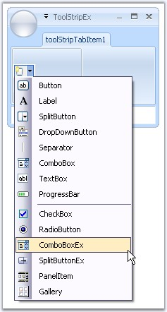{border="0"}

[]{style="COLOR: #15428b"} 

Figure 1329: ToolStrip items In Designer

 

You can also add the items through Items Collection Editor using the Edit Items verb in the properties grid or in the context menu of the control at design time or using Items Property.

[]{style="COLOR: #15428b"} 

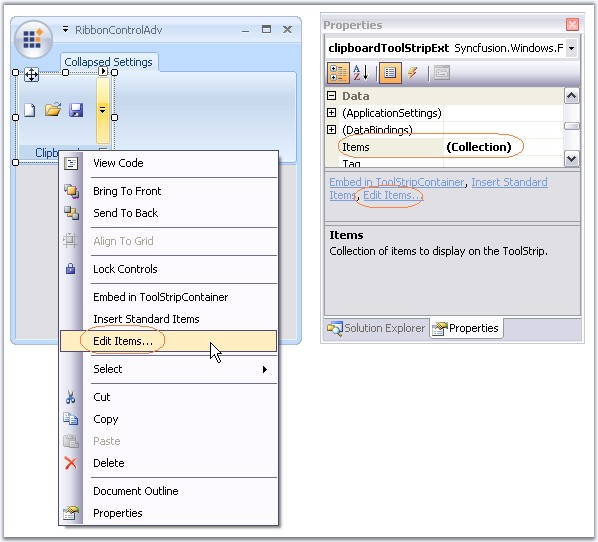{border="0"}

[]{style="COLOR: #15428b"} 

***[]{style="COLOR: #15428b"}*** 

Figure 1330: Image Highlighting the options in the Designer to invoke the Items Collection Editor

**[]{style="COLOR: #15428b"}** 

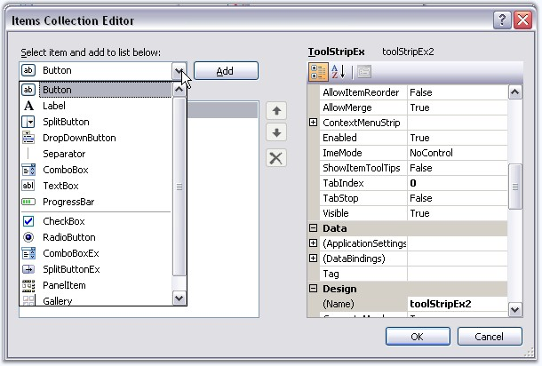{border="0"}

**[]{style="COLOR: #15428b"}** 

***[]{style="COLOR: #15428b"}*** 

Figure 1331: Items Collection Editor

 

**Adding Standard Items**

 

ToolStripEx comes with standard toolstrip items that can be added to the control through \"Insert Standard Items\" option in the smart tag. You can even add the items through context menu at design time.

[]{style="COLOR: #15428b"} 

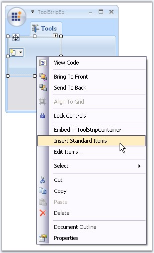{border="0"}

[]{style="COLOR: #15428b"} 

***[]{style="COLOR: #15428b"}*** 

Figure 1332: Inserting Standard Items Through Context Menu

**[]{style="COLOR: #15428b"}** 

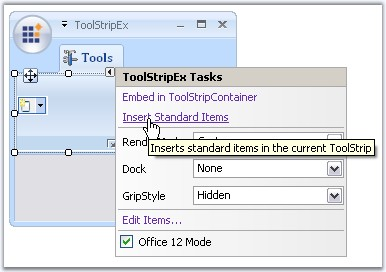{border="0"}

**[]{style="COLOR: #15428b"}** 

Figure 1333: Inserting Standard Items through Smart Tag

**[]{style="COLOR: #15428b"}** 

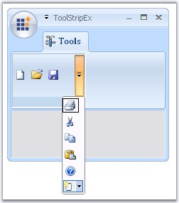{border="0"}

**[]{style="COLOR: #15428b"}** 

Figure 1334: ToolStripEx with Standard Items

 

**Adding ToolStrip Items Programmatically**

 

The ToolStripEx allows you to add standard ToolStripItems and other user interface elements such as labels, splitbutton, dropdownbutton, separator, combobox, textbox, progressbar and PanelItem.

[]{style="COLOR: #15428b"} 

+---------------------------------------------------------------------------------------------------------------------------------------------------------------------------------------------------------------------------------------------------------------------------------------------------------+
| **[\[C#\]]{style="FONT-FAMILY: 'Courier New'; COLOR: black"}**                                                                                                                                                                                                                                          |
|                                                                                                                                                                                                                                                                                                         |
| []{style="COLOR: #15428b"}                                                                                                                                                                                                                                                                              |
|                                                                                                                                                                                                                                                                                                         |
| [// Declare and initialize a ToolStripEx.]{style="FONT-FAMILY: 'Courier New'; COLOR: green"}                                                                                                                                                                                                            |
|                                                                                                                                                                                                                                                                                                         |
| [ToolStripEx paraToolStrip = ]{style="FONT-FAMILY: 'Courier New'; COLOR: black"}[new]{style="FONT-FAMILY: 'Courier New'; COLOR: blue"}[ ToolStripEx();]{style="FONT-FAMILY: 'Courier New'; COLOR: black"}                                                                                               |
|                                                                                                                                                                                                                                                                                                         |
| []{style="FONT-FAMILY: 'Courier New'; COLOR: black"}                                                                                                                                                                                                                                                    |
|                                                                                                                                                                                                                                                                                                         |
| [// Set]{style="FONT-FAMILY: 'Courier New'; COLOR: green"}[ the ]{style="FONT-FAMILY: 'Courier New'; COLOR: green"}[size.]{style="FONT-FAMILY: 'Courier New'; COLOR: green"}                                                                                                                            |
|                                                                                                                                                                                                                                                                                                         |
| [paraToolStrip.AutoSize = ]{style="FONT-FAMILY: 'Courier New'; COLOR: black"}[false]{style="FONT-FAMILY: 'Courier New'; COLOR: blue"}[;]{style="FONT-FAMILY: 'Courier New'; COLOR: black"}                                                                                                              |
|                                                                                                                                                                                                                                                                                                         |
| [paraToolStrip.Size = ]{style="FONT-FAMILY: 'Courier New'; COLOR: black"}[new]{style="FONT-FAMILY: 'Courier New'; COLOR: blue"}[ Size(100, 25);]{style="FONT-FAMILY: 'Courier New'; COLOR: black"}                                                                                                      |
|                                                                                                                                                                                                                                                                                                         |
| []{style="FONT-FAMILY: 'Courier New'; COLOR: green"}                                                                                                                                                                                                                                                    |
|                                                                                                                                                                                                                                                                                                         |
| [// Set the layout]{style="FONT-FAMILY: 'Courier New'; COLOR: green"}[ style]{style="FONT-FAMILY: 'Courier New'; COLOR: green"}[.]{style="FONT-FAMILY: 'Courier New'; COLOR: green"}                                                                                                                    |
|                                                                                                                                                                                                                                                                                                         |
| [paraToolStrip.LayoutStyle = ToolStripLayoutStyle.HorizontalStackWithOverflow;]{style="FONT-FAMILY: 'Courier New'; COLOR: black"}                                                                                                                                                                       |
|                                                                                                                                                                                                                                                                                                         |
| []{style="FONT-FAMILY: 'Courier New'; COLOR: green"}                                                                                                                                                                                                                                                    |
|                                                                                                                                                                                                                                                                                                         |
| [// Add]{style="FONT-FAMILY: 'Courier New'; COLOR: green"}[ the ]{style="FONT-FAMILY: 'Courier New'; COLOR: green"}[items to the ToolStripEx.]{style="FONT-FAMILY: 'Courier New'; COLOR: green"}                                                                                                        |
|                                                                                                                                                                                                                                                                                                         |
| [paraToolStrip.Items.Add(]{style="FONT-FAMILY: 'Courier New'; COLOR: black"}[new]{style="FONT-FAMILY: 'Courier New'; COLOR: blue"}[ ToolStripButton());]{style="FONT-FAMILY: 'Courier New'; COLOR: black"}                                                                                              |
|                                                                                                                                                                                                                                                                                                         |
| [paraToolStrip.Items.Add(]{style="FONT-FAMILY: 'Courier New'; COLOR: black"}[new]{style="FONT-FAMILY: 'Courier New'; COLOR: blue"}[ ToolStripDropDownButton());]{style="FONT-FAMILY: 'Courier New'; COLOR: black"}                                                                                      |
|                                                                                                                                                                                                                                                                                                         |
| [paraToolStrip.Items.Add(]{style="FONT-FAMILY: 'Courier New'; COLOR: black"}[new]{style="FONT-FAMILY: 'Courier New'; COLOR: blue"}[ ToolStripSplitButton());]{style="FONT-FAMILY: 'Courier New'; COLOR: black"}                                                                                         |
|                                                                                                                                                                                                                                                                                                         |
| []{style="FONT-FAMILY: 'Courier New'; COLOR: black"}                                                                                                                                                                                                                                                    |
|                                                                                                                                                                                                                                                                                                         |
| [paraToolStrip.GroupedButtons = ]{style="FONT-FAMILY: 'Courier New'; COLOR: black"}[true]{style="FONT-FAMILY: 'Courier New'; COLOR: blue"}[;]{style="FONT-FAMILY: 'Courier New'; COLOR: black"}                                                                                                         |
|                                                                                                                                                                                                                                                                                                         |
| []{style="FONT-FAMILY: 'Courier New'; COLOR: black"}                                                                                                                                                                                                                                                    |
|                                                                                                                                                                                                                                                                                                         |
| [// Set the]{style="FONT-FAMILY: 'Courier New'; COLOR: green"}[ text ]{style="FONT-FAMILY: 'Courier New'; COLOR: green"}[of]{style="FONT-FAMILY: 'Courier New'; COLOR: green"}[ the ]{style="FONT-FAMILY: 'Courier New'; COLOR: green"}[ToolStripEx.]{style="FONT-FAMILY: 'Courier New'; COLOR: green"} |
|                                                                                                                                                                                                                                                                                                         |
| [paraToolStrip.Text = \"Paragraph\";]{style="FONT-FAMILY: 'Courier New'; COLOR: black"}                                                                                                                                                                                                                 |
|                                                                                                                                                                                                                                                                                                         |
| []{style="FONT-FAMILY: 'Courier New'; COLOR: black"}                                                                                                                                                                                                                                                    |
|                                                                                                                                                                                                                                                                                                         |
| [// Add the ToolStripEx to the ToolStripTabItem.]{style="FONT-FAMILY: 'Courier New'; COLOR: green"}                                                                                                                                                                                                     |
|                                                                                                                                                                                                                                                                                                         |
| [this]{style="FONT-FAMILY: 'Courier New'; COLOR: blue"}[.toolStripTabItem1.Panel.Controls.Add(paraToolStrip);]{style="FONT-FAMILY: 'Courier New'; COLOR: black"}[]{style="FONT-FAMILY: 'Courier New'; COLOR: black"}                                                                                    |
+---------------------------------------------------------------------------------------------------------------------------------------------------------------------------------------------------------------------------------------------------------------------------------------------------------+

[]{style="COLOR: #15428b"} 

+-----------------------------------------------------------------------------------------------------------------------------------------------------------------------------------------------------------------------------------------------------------------------------------------------------------------------------------------------------------------------------+
| **[\[]{style="FONT-FAMILY: 'Courier New'; COLOR: black"}[VB.NET\]]{style="FONT-FAMILY: 'Courier New'; COLOR: black"}[]{style="FONT-FAMILY: 'Courier New'; COLOR: black"}**                                                                                                                                                                                                  |
|                                                                                                                                                                                                                                                                                                                                                                             |
| []{style="COLOR: #15428b"}                                                                                                                                                                                                                                                                                                                                                  |
|                                                                                                                                                                                                                                                                                                                                                                             |
| [\' Declare and initialize a ToolStripEx.]{style="FONT-FAMILY: 'Courier New'; COLOR: green"}                                                                                                                                                                                                                                                                                |
|                                                                                                                                                                                                                                                                                                                                                                             |
| [Dim]{style="FONT-FAMILY: 'Courier New'; COLOR: blue"}[ paraToolStrip ]{style="FONT-FAMILY: 'Courier New'; COLOR: black"}[As]{style="FONT-FAMILY: 'Courier New'; COLOR: blue"}[ ToolStripEx =  ]{style="FONT-FAMILY: 'Courier New'; COLOR: black"}[New]{style="FONT-FAMILY: 'Courier New'; COLOR: blue"}[ ToolStripEx() ]{style="FONT-FAMILY: 'Courier New'; COLOR: black"} |
|                                                                                                                                                                                                                                                                                                                                                                             |
| []{style="FONT-FAMILY: 'Courier New'; COLOR: black"}                                                                                                                                                                                                                                                                                                                        |
|                                                                                                                                                                                                                                                                                                                                                                             |
| [\' Set the size.]{style="FONT-FAMILY: 'Courier New'; COLOR: green"}                                                                                                                                                                                                                                                                                                        |
|                                                                                                                                                                                                                                                                                                                                                                             |
| [paraToolStrip.AutoSize = ]{style="FONT-FAMILY: 'Courier New'; COLOR: black"}[False]{style="FONT-FAMILY: 'Courier New'; COLOR: blue"}                                                                                                                                                                                                                                       |
|                                                                                                                                                                                                                                                                                                                                                                             |
| [paraToolStrip.Size = ]{style="FONT-FAMILY: 'Courier New'; COLOR: black"}[New]{style="FONT-FAMILY: 'Courier New'; COLOR: blue"}[ Size(100, 25)]{style="FONT-FAMILY: 'Courier New'; COLOR: black"}                                                                                                                                                                           |
|                                                                                                                                                                                                                                                                                                                                                                             |
| []{style="FONT-FAMILY: 'Courier New'; COLOR: black"}                                                                                                                                                                                                                                                                                                                        |
|                                                                                                                                                                                                                                                                                                                                                                             |
| [\' Set the layout style.]{style="FONT-FAMILY: 'Courier New'; COLOR: green"}                                                                                                                                                                                                                                                                                                |
|                                                                                                                                                                                                                                                                                                                                                                             |
| [paraToolStrip.LayoutStyle = ToolStripLayoutStyle.HorizontalStackWithOverflow]{style="FONT-FAMILY: 'Courier New'; COLOR: black"}                                                                                                                                                                                                                                            |
|                                                                                                                                                                                                                                                                                                                                                                             |
| []{style="FONT-FAMILY: 'Courier New'; COLOR: black"}                                                                                                                                                                                                                                                                                                                        |
|                                                                                                                                                                                                                                                                                                                                                                             |
| [\' Add the items to the ToolStripEx.]{style="FONT-FAMILY: 'Courier New'; COLOR: green"}                                                                                                                                                                                                                                                                                    |
|                                                                                                                                                                                                                                                                                                                                                                             |
| [paraToolStrip.Items.Add(]{style="FONT-FAMILY: 'Courier New'; COLOR: black"}[New]{style="FONT-FAMILY: 'Courier New'; COLOR: blue"}[ ToolStripButton())]{style="FONT-FAMILY: 'Courier New'; COLOR: black"}                                                                                                                                                                   |
|                                                                                                                                                                                                                                                                                                                                                                             |
| [paraToolStrip.Items.Add(]{style="FONT-FAMILY: 'Courier New'; COLOR: black"}[New]{style="FONT-FAMILY: 'Courier New'; COLOR: blue"}[ ToolStripDropDownButton())]{style="FONT-FAMILY: 'Courier New'; COLOR: black"}                                                                                                                                                           |
|                                                                                                                                                                                                                                                                                                                                                                             |
| [paraToolStrip.Items.Add(]{style="FONT-FAMILY: 'Courier New'; COLOR: black"}[New]{style="FONT-FAMILY: 'Courier New'; COLOR: blue"}[ ToolStripSplitButton())]{style="FONT-FAMILY: 'Courier New'; COLOR: black"}                                                                                                                                                              |
|                                                                                                                                                                                                                                                                                                                                                                             |
| []{style="FONT-FAMILY: 'Courier New'; COLOR: black"}                                                                                                                                                                                                                                                                                                                        |
|                                                                                                                                                                                                                                                                                                                                                                             |
| [paraToolStrip.GroupedButtons = ]{style="FONT-FAMILY: 'Courier New'; COLOR: black"}[True]{style="FONT-FAMILY: 'Courier New'; COLOR: blue"}                                                                                                                                                                                                                                  |
|                                                                                                                                                                                                                                                                                                                                                                             |
| []{style="FONT-FAMILY: 'Courier New'; COLOR: black"}                                                                                                                                                                                                                                                                                                                        |
|                                                                                                                                                                                                                                                                                                                                                                             |
| [\' Set the text of the ToolStripEx.]{style="FONT-FAMILY: 'Courier New'; COLOR: green"}                                                                                                                                                                                                                                                                                     |
|                                                                                                                                                                                                                                                                                                                                                                             |
| [paraToolStrip.Text = \"Paragraph\"]{style="FONT-FAMILY: 'Courier New'; COLOR: black"}                                                                                                                                                                                                                                                                                      |
|                                                                                                                                                                                                                                                                                                                                                                             |
| [    ]{style="FONT-FAMILY: 'Courier New'; COLOR: black"}                                                                                                                                                                                                                                                                                                                    |
|                                                                                                                                                                                                                                                                                                                                                                             |
| [\' Add the ToolStripEx to the ToolStripTabItem.]{style="FONT-FAMILY: 'Courier New'; COLOR: green"}                                                                                                                                                                                                                                                                         |
|                                                                                                                                                                                                                                                                                                                                                                             |
| [Me]{style="FONT-FAMILY: 'Courier New'; COLOR: blue"}[.toolStripTabItem1.Panel.Controls.Add(paraToolStrip)]{style="FONT-FAMILY: 'Courier New'; COLOR: black"}[]{style="FONT-FAMILY: 'Courier New'; COLOR: black"}                                                                                                                                                           |
+-----------------------------------------------------------------------------------------------------------------------------------------------------------------------------------------------------------------------------------------------------------------------------------------------------------------------------------------------------------------------------+

[]{style="COLOR: #15428b"} 

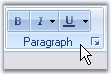{border="0"}

[]{style="COLOR: #15428b"} 

Figure 1335: ToolStripEx with Items Added Programmatically

 

[]{#_ToolStripItems}3.15.1.2.3.3.1.1  ToolStripItems

[]{style="COLOR: #15428b"} 

The following ToolStripItems can be added to a ToolStripEx through Designer, using **Items Collection Editor**.

 

[]{#_PanelItem}3.15.1.2.3.3.1.1.1 PanelItem

[]{style="COLOR: #15428b"} 

ToolStripPanelItem provides support for aligning the controls in multiple lines. It supports nesting of panels without any limitation on the level of nesting. Not only controls but, any number of panels can be added to a panel.

 

Using the **RowCount** property of ToolStripPanelItem, controls can be arranged in any number of rows inside a ToolStripPanelItem.

[]{style="COLOR: #15428b"} 

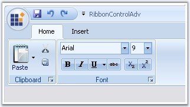{border="0"}

[]{style="COLOR: #15428b"} 

Figure 1336: ToolStripPanelItem

 

**Adding Controls to Panel Item**

 

Accessing ToolStripPanelItem.Items property, Items Collection Editor dialog pops-up. The item can be added and customized using this dialog.

[]{style="COLOR: #15428b"} 

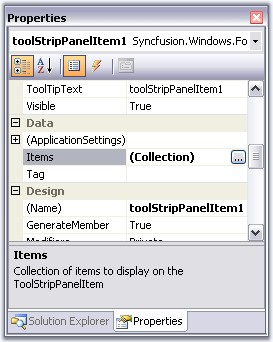{border="0"}

[]{style="COLOR: #15428b"} 

***[]{style="COLOR: #15428b"}*** 

Figure 1337: Accessing Items property to invoke Items Collection Editor

[]{style="COLOR: #15428b"} 

A simple code snippet which adds ToolStripItems in three rows.

[]{style="COLOR: #15428b"} 

+-----------------------------------------------------------------------------------------------------------------------------------------------------------------------------------------------------------------------------+
| **[\[]{style="FONT-FAMILY: 'Courier New'; COLOR: black"}[C#\]]{style="FONT-FAMILY: 'Courier New'; COLOR: black"}[]{style="FONT-FAMILY: 'Courier New'; COLOR: black"}**                                                      |
|                                                                                                                                                                                                                             |
| []{style="COLOR: #15428b"}                                                                                                                                                                                                  |
|                                                                                                                                                                                                                             |
| [this]{style="FONT-FAMILY: 'Courier New'; COLOR: blue"}[.toolStripPanelItem1.Items.AddRange([new]{style="COLOR: blue"} System.Windows.Forms.[ToolStripItem]{style="COLOR: teal"}\[\] {]{style="FONT-FAMILY: 'Courier New'"} |
|                                                                                                                                                                                                                             |
| [this]{style="FONT-FAMILY: 'Courier New'; COLOR: blue"}[.toolStripLabel1,]{style="FONT-FAMILY: 'Courier New'"}                                                                                                              |
|                                                                                                                                                                                                                             |
| [this]{style="FONT-FAMILY: 'Courier New'; COLOR: blue"}[.toolStripLabel2,]{style="FONT-FAMILY: 'Courier New'"}                                                                                                              |
|                                                                                                                                                                                                                             |
| [this]{style="FONT-FAMILY: 'Courier New'; COLOR: blue"}[.toolStripButton2});]{style="FONT-FAMILY: 'Courier New'"}                                                                                                           |
|                                                                                                                                                                                                                             |
| [this]{style="FONT-FAMILY: 'Courier New'; COLOR: blue"}[.toolStripPanelItem1.[RowCount = 3;]{style="COLOR: black"}]{style="FONT-FAMILY: 'Courier New'"}[]{style="FONT-FAMILY: 'Courier New'; COLOR: black"}                 |
+-----------------------------------------------------------------------------------------------------------------------------------------------------------------------------------------------------------------------------+

[]{#p1116}[]{style="COLOR: #15428b"} 

+--------------------------------------------------------------------------------------------------------------------------------------------------------------------------------------------------------------------------------------------------------------------------------------------------------------------------------------------------------------------------------------------------------------------------------------------------------------------------------------------------------------------+
| **[\[VB.NET\]]{style="FONT-FAMILY: 'Courier New'; COLOR: black"}**                                                                                                                                                                                                                                                                                                                                                                                                                                                 |
|                                                                                                                                                                                                                                                                                                                                                                                                                                                                                                                    |
| []{style="COLOR: #15428b"}                                                                                                                                                                                                                                                                                                                                                                                                                                                                                         |
|                                                                                                                                                                                                                                                                                                                                                                                                                                                                                                                    |
| [Dim]{style="FONT-FAMILY: 'Courier New'; COLOR: blue"}[ System.Windows.Forms.ToolStripItem() ]{style="FONT-FAMILY: 'Courier New'; COLOR: black"}[As]{style="FONT-FAMILY: 'Courier New'; COLOR: blue"}[ ]{style="FONT-FAMILY: 'Courier New'; COLOR: black"}[Me]{style="FONT-FAMILY: 'Courier New'; COLOR: blue"}[.toolStripPanelItem1.Items.AddRange(]{style="FONT-FAMILY: 'Courier New'; COLOR: black"}[New]{style="FONT-FAMILY: 'Courier New'; COLOR: blue"}[{]{style="FONT-FAMILY: 'Courier New'; COLOR: black"} |
|                                                                                                                                                                                                                                                                                                                                                                                                                                                                                                                    |
| [Me]{style="FONT-FAMILY: 'Courier New'; COLOR: blue"}[.toolStripLabel1,]{style="FONT-FAMILY: 'Courier New'"}                                                                                                                                                                                                                                                                                                                                                                                                       |
|                                                                                                                                                                                                                                                                                                                                                                                                                                                                                                                    |
| [Me]{style="FONT-FAMILY: 'Courier New'; COLOR: blue"}[.toolStripLabel2,]{style="FONT-FAMILY: 'Courier New'"}                                                                                                                                                                                                                                                                                                                                                                                                       |
|                                                                                                                                                                                                                                                                                                                                                                                                                                                                                                                    |
| [Me]{style="FONT-FAMILY: 'Courier New'; COLOR: blue"}[.toolStripButton2[})]{style="COLOR: black"}]{style="FONT-FAMILY: 'Courier New'"}                                                                                                                                                                                                                                                                                                                                                                             |
|                                                                                                                                                                                                                                                                                                                                                                                                                                                                                                                    |
| [Me]{style="FONT-FAMILY: 'Courier New'; COLOR: blue"}[.toolStripPanelItem1.RowCount = 3]{style="FONT-FAMILY: 'Courier New'; COLOR: black"}[]{style="FONT-FAMILY: 'Courier New'; COLOR: black"}                                                                                                                                                                                                                                                                                                                     |
+--------------------------------------------------------------------------------------------------------------------------------------------------------------------------------------------------------------------------------------------------------------------------------------------------------------------------------------------------------------------------------------------------------------------------------------------------------------------------------------------------------------------+

[]{style="COLOR: #15428b"} 

A complex arrangement of controls like in the below image, can be achieved using the ToolStripPanelItem.

[]{style="COLOR: #15428b"} 

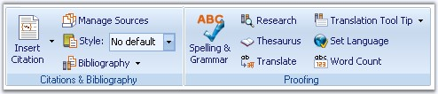{border="0"}

***[]{style="COLOR: #15428b"}*** 

Figure 1338: Controls added to ToolStripPanelItem

[]{style="COLOR: #15428b"} 

See Also

 

 

[]{#_Customizing_Panel_Item}3.15.1.2.3.3.1.1.2 Customizing Panel Item

[]{style="COLOR: #15428b"} 

Foreground Settings

[]{style="COLOR: #15428b"} 

::: {align="center"}
  ----------- -----------------------------------------------------
  Property    Description
  Font        Set Font Style for the display text in the control.
  ForeColor   Sets fore color for the display text in the panel.
  Text        Sets the text for the ToolStripPanelItem.
  ----------- -----------------------------------------------------
:::

[]{style="COLOR: #15428b"} 

+-----------------------------------------------------------------------------------------------------------------------------------------------------------------------------------------------------------------------------------------------------------------------------------------------------+
| **[\[C#\]]{style="FONT-FAMILY: 'Courier New'; COLOR: black"}**                                                                                                                                                                                                                                      |
|                                                                                                                                                                                                                                                                                                     |
| []{style="COLOR: #15428b"}                                                                                                                                                                                                                                                                          |
|                                                                                                                                                                                                                                                                                                     |
| [this]{style="FONT-FAMILY: 'Courier New'; COLOR: blue"}[.toolStripPanelItem12.Font = [new]{style="COLOR: blue"} System.Drawing.[Font]{style="COLOR: teal"}([\"Verdana\"]{style="COLOR: maroon"}, 8.25F, System.Drawing.[FontStyle]{style="COLOR: teal"}.Bold);]{style="FONT-FAMILY: 'Courier New'"} |
|                                                                                                                                                                                                                                                                                                     |
| [this]{style="FONT-FAMILY: 'Courier New'; COLOR: blue"}[.toolStripPanelItem12.ForeColor = System.Drawing.[Color]{style="COLOR: teal"}.Crimson;]{style="FONT-FAMILY: 'Courier New'"}                                                                                                                 |
+-----------------------------------------------------------------------------------------------------------------------------------------------------------------------------------------------------------------------------------------------------------------------------------------------------+

[]{style="COLOR: #15428b"} 

+----------------------------------------------------------------------------------------------------------------------------------------------------------------------------------------------------------------------------------------------------------------------------------------------------+
| **[\[VB.NET\]]{style="FONT-FAMILY: 'Courier New'; COLOR: black"}**                                                                                                                                                                                                                                 |
|                                                                                                                                                                                                                                                                                                    |
| []{style="COLOR: #15428b"}                                                                                                                                                                                                                                                                         |
|                                                                                                                                                                                                                                                                                                    |
| [Me]{style="FONT-FAMILY: 'Courier New'; COLOR: blue"}[.toolStripPanelItem12.Font = [New]{style="COLOR: blue"} System.Drawing.[Font]{style="COLOR: black"}([\"Verdana\"]{style="COLOR: maroon"}, 8.25F, System.Drawing.[FontStyle]{style="COLOR: black"}.Bold)]{style="FONT-FAMILY: 'Courier New'"} |
|                                                                                                                                                                                                                                                                                                    |
| [Me]{style="FONT-FAMILY: 'Courier New'; COLOR: blue"}[.toolStripPanelItem12.ForeColor = System.Drawing.]{style="FONT-FAMILY: 'Courier New'"}[Color]{style="FONT-FAMILY: 'Courier New'; COLOR: black"}[.Crimson]{style="FONT-FAMILY: 'Courier New'"}                                                |
+----------------------------------------------------------------------------------------------------------------------------------------------------------------------------------------------------------------------------------------------------------------------------------------------------+

[]{style="COLOR: #15428b"} 

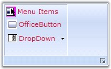{border="0"}

[]{style="COLOR: #15428b"} 

Figure 1339: Font = \"Verdana, 8, Bold\"; ForeColor = \"Crimson\"

[]{style="COLOR: #15428b"} 

Tooltip Settings

[]{style="COLOR: #15428b"} 

::: {align="center"}
+-----------------------------------+------------------------------------------------------------------------------------------+
| Property                          | Description                                                                              |
+-----------------------------------+------------------------------------------------------------------------------------------+
| ShowItemToolTips                  | Specifies whether to set tooltips or not.                                                |
+-----------------------------------+------------------------------------------------------------------------------------------+
| AutoToolTip                       | When set to true, will display the text set in the Text property as the item\'s tooltip. |
|                                   |                                                                                          |
|                                   | When set to false, will display the text set in the ToolTipText property.                |
+-----------------------------------+------------------------------------------------------------------------------------------+
| ToolTipText                       | Sets the text for the tooltip when AutoToolTip is set to false.                          |
+-----------------------------------+------------------------------------------------------------------------------------------+
:::

**[]{style="COLOR: #15428b"}** 

+-------------------------------------------------------------------------------------------------------------------------------------------------------------------------------------------+
| **[\[C#\]]{style="FONT-FAMILY: 'Courier New'; COLOR: black"}**                                                                                                                            |
|                                                                                                                                                                                           |
| []{style="COLOR: #15428b"}                                                                                                                                                                |
|                                                                                                                                                                                           |
| [this]{style="FONT-FAMILY: 'Courier New'; COLOR: blue"}[.toolStripPanelItem1.[ShowItemToolTips]{style="COLOR: black"} = [true]{style="COLOR: blue"};]{style="FONT-FAMILY: 'Courier New'"} |
|                                                                                                                                                                                           |
| [this]{style="FONT-FAMILY: 'Courier New'; COLOR: blue"}[.toolStripPanelItem1.AutoToolTip = [true]{style="COLOR: blue"};]{style="FONT-FAMILY: 'Courier New'"}                              |
|                                                                                                                                                                                           |
| [this]{style="FONT-FAMILY: 'Courier New'; COLOR: blue"}[.toolStripPanelItem1.ToolTipText = [\"New tooltip\"]{style="COLOR: maroon"};]{style="FONT-FAMILY: 'Courier New'"}                 |
+-------------------------------------------------------------------------------------------------------------------------------------------------------------------------------------------+

[]{style="COLOR: #15428b"} 

+-----------------------------------------------------------------------------------------------------------------------------------------------------------------------------------------------------------------------------+
| **[\[VB.NET\]]{style="FONT-FAMILY: 'Courier New'; COLOR: black"}**                                                                                                                                                          |
|                                                                                                                                                                                                                             |
| []{style="COLOR: #15428b"}                                                                                                                                                                                                  |
|                                                                                                                                                                                                                             |
| [Me]{style="FONT-FAMILY: 'Courier New'; COLOR: blue"}[.toolStripPanelItem1.[ShowItemToolTips]{style="COLOR: black"} = [True]{style="COLOR: blue"}]{style="FONT-FAMILY: 'Courier New'"}                                      |
|                                                                                                                                                                                                                             |
| [Me]{style="FONT-FAMILY: 'Courier New'; COLOR: blue"}[.toolStripPanelItem1.AutoToolTip = [True]{style="COLOR: blue"}]{style="FONT-FAMILY: 'Courier New'"}                                                                   |
|                                                                                                                                                                                                                             |
| [Me]{style="FONT-FAMILY: 'Courier New'; COLOR: blue"}[.toolStripPanelItem1.ToolTipText = [\"New tooltip\"]{style="COLOR: maroon"}]{style="FONT-FAMILY: 'Courier New'"}[]{style="FONT-FAMILY: 'Courier New'; COLOR: maroon"} |
+-----------------------------------------------------------------------------------------------------------------------------------------------------------------------------------------------------------------------------+

**[]{style="COLOR: #15428b"}** 

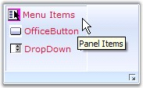{border="0"}

[]{style="COLOR: #15428b"} 

Figure 1340: ToolTipText for PanelItem

**[]{style="COLOR: #15428b"}** 

Layout of the Panel items

**[]{style="COLOR: #15428b"}** 

::: {align="center"}
+-----------------------------------+----------------------------------------------------------------------------------------------------------------------------------+
| Property                          | Description                                                                                                                      |
+-----------------------------------+----------------------------------------------------------------------------------------------------------------------------------+
| Alignment                         | Sets the alignment of the Panel item. The options are,                                                                           |
|                                   |                                                                                                                                  |
|                                   |                                                                                                                                  |
|                                   |                                                                                                                                  |
|                                   | [·      ]{style="FONT-FAMILY: Symbol"}Left and                                                                                   |
|                                   |                                                                                                                                  |
|                                   | [·      ]{style="FONT-FAMILY: Symbol"}Right.                                                                                     |
+-----------------------------------+----------------------------------------------------------------------------------------------------------------------------------+
| LayoutStyle                       | Sets the layout style for the items. The options are,                                                                            |
|                                   |                                                                                                                                  |
|                                   |                                                                                                                                  |
|                                   |                                                                                                                                  |
|                                   | [·      ]{style="FONT-FAMILY: Symbol"}*Flow* - Items flow horizontally or vertically as necessary.                               |
|                                   |                                                                                                                                  |
|                                   | [·      ]{style="FONT-FAMILY: Symbol"}*HorizontalStackWithOverflow* - Items are laid out horizontally and overflow as necessary. |
|                                   |                                                                                                                                  |
|                                   | [·      ]{style="FONT-FAMILY: Symbol"}*StackWithOverFlow* - Items are laid out automatically.                                    |
|                                   |                                                                                                                                  |
|                                   | [·      ]{style="FONT-FAMILY: Symbol"}*Table* - Items are laid out flush left.                                                   |
|                                   |                                                                                                                                  |
|                                   | [·      ]{style="FONT-FAMILY: Symbol"}*VerticalStackWithOverflow* - Items are laid out vertically and overflow as necessary.     |
+-----------------------------------+----------------------------------------------------------------------------------------------------------------------------------+
:::

[]{style="COLOR: #15428b"} 

Border Settings

[]{style="COLOR: #15428b"} 

::: {align="center"}
+-----------------------------------+---------------------------------------------------+
| Property                          | Description                                       |
+-----------------------------------+---------------------------------------------------+
| BorderStyle                       | Sets the border style for the panel items.        |
|                                   |                                                   |
|                                   |                                                   |
|                                   |                                                   |
|                                   | [·      ]{style="FONT-FAMILY: Symbol"}Etched and  |
|                                   |                                                   |
|                                   | [·      ]{style="FONT-FAMILY: Symbol"}StaticEdge. |
+-----------------------------------+---------------------------------------------------+
:::

[]{style="COLOR: #15428b"} 

RTL Support

**[]{style="COLOR: #15428b"}** 

::: {align="center"}
  ---------------------------- ---------------------------------------------------------------------------------
  Property                     Description
  RightToLeft                  Indicates whether the item should right to left for RTL languages.
  RightToLeftAutoMirrorImage   Specifies whether image should mirror when RightToLeft is enabled for the item.
  ---------------------------- ---------------------------------------------------------------------------------
:::

 

 

[]{#_Gallery}3.15.1.2.3.3.1.1.3 Gallery

[]{#p1117} 

Essential Tools RibbonControlAdv provides options to add a collection of items and store them into a gallery. A gallery can be added to a ToolStripTabItem using Items Collection Editor. Select the Gallery item in the dropdown and add it to the control.

[]{style="COLOR: #15428b"} 

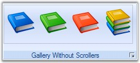{border="0"}

[]{style="COLOR: #15428b"} 

***[]{style="COLOR: #15428b"}*** 

Figure 1341: ToolStripGallery with items added to the ToolStripEx

 

**Adding Controls to the Gallery**

 

Using the **Gallery.Item** property, Items Collection Editor opens, which lets you add items to the gallery.

[]{style="COLOR: #15428b"} 

+-----------------------------------------------------------------------------------------------------------------------------------------------------------------------------------------+
| **[\[C#\]]{style="FONT-FAMILY: 'Courier New'; COLOR: black"}**                                                                                                                          |
|                                                                                                                                                                                         |
| []{style="FONT-FAMILY: 'Courier New'; COLOR: black"}                                                                                                                                    |
|                                                                                                                                                                                         |
| [this]{style="FONT-FAMILY: 'Courier New'; COLOR: blue"}[.toolStripGallery1.Items.Add(toolStripGalleryItem1);]{style="FONT-FAMILY: 'Courier New'"}                                       |
|                                                                                                                                                                                         |
| [this]{style="FONT-FAMILY: 'Courier New'; COLOR: blue"}[.toolStripGallery1.Items.Add(toolStripGalleryItem2);]{style="FONT-FAMILY: 'Courier New'"}                                       |
|                                                                                                                                                                                         |
| [this]{style="FONT-FAMILY: 'Courier New'; COLOR: blue"}[.toolStripGallery1.Items.Add(toolStripGalleryItem3);]{style="FONT-FAMILY: 'Courier New'"}[]{style="FONT-FAMILY: 'Courier New'"} |
+-----------------------------------------------------------------------------------------------------------------------------------------------------------------------------------------+

[]{style="COLOR: #15428b"} 

+------------------------------------------------------------------------------------------------------------------------------------------------+
| **[\[VB.NET\]]{style="FONT-FAMILY: 'Courier New'; COLOR: black"}**                                                                             |
|                                                                                                                                                |
| []{style="COLOR: black"}                                                                                                                       |
|                                                                                                                                                |
| [Me]{style="FONT-FAMILY: 'Courier New'; COLOR: blue"}[.toolStripGallery1.Items.Add(toolStripGalleryItem1)]{style="FONT-FAMILY: 'Courier New'"} |
|                                                                                                                                                |
| [Me]{style="FONT-FAMILY: 'Courier New'; COLOR: blue"}[.toolStripGallery1.Items.Add(toolStripGalleryItem2)]{style="FONT-FAMILY: 'Courier New'"} |
|                                                                                                                                                |
| [Me]{style="FONT-FAMILY: 'Courier New'; COLOR: blue"}[.toolStripGallery1.Items.Add(toolStripGalleryItem3)]{style="FONT-FAMILY: 'Courier New'"} |
+------------------------------------------------------------------------------------------------------------------------------------------------+

[]{style="COLOR: #15428b"} 

 

3.15.1.2.3.3.1.1.4 Appearance Settings

[]{style="COLOR: #15428b"} 

The ToolStripItems can be aligned to right or left using **Alignment** property.

[]{style="COLOR: #15428b"} 

+-------------------------------------------------------------------------------------------------------------------------------------------------------------------------------------------------------+
| **[\[C#\]]{style="FONT-FAMILY: 'Courier New'; COLOR: black"}**                                                                                                                                        |
|                                                                                                                                                                                                       |
| []{style="FONT-FAMILY: 'Courier New'; COLOR: black"}                                                                                                                                                  |
|                                                                                                                                                                                                       |
| [this]{style="FONT-FAMILY: 'Courier New'; COLOR: blue"}[.toolStripGallery1.Alignment = System.Windows.Forms.[ToolStripItemAlignment]{style="COLOR: teal"}.Right;]{style="FONT-FAMILY: 'Courier New'"} |
+-------------------------------------------------------------------------------------------------------------------------------------------------------------------------------------------------------+

[]{style="COLOR: #15428b"} 

+----------------------------------------------------------------------------------------------------------------------------------------------------------------------------------------------------+
| **[\[VB.NET\]]{style="FONT-FAMILY: 'Courier New'; COLOR: black"}**                                                                                                                                 |
|                                                                                                                                                                                                    |
| []{style="COLOR: black"}                                                                                                                                                                           |
|                                                                                                                                                                                                    |
| [Me]{style="FONT-FAMILY: 'Courier New'; COLOR: blue"}[.toolStripGallery1.Alignment = System.Windows.Forms.[ToolStripItemAlignment]{style="COLOR: teal"}.Right]{style="FONT-FAMILY: 'Courier New'"} |
+----------------------------------------------------------------------------------------------------------------------------------------------------------------------------------------------------+

[]{style="COLOR: #15428b"} 

Border Settings

[]{style="COLOR: #15428b"} 

::: {align="center"}
+-----------------------------------+------------------------------------------------------------------+
| Property                          | Description                                                      |
+-----------------------------------+------------------------------------------------------------------+
| BorderStyle                       | Sets the border style for the ToolStripGallery. The options are, |
|                                   |                                                                  |
|                                   |                                                                  |
|                                   |                                                                  |
|                                   | [·      ]{style="FONT-FAMILY: Symbol"}None (default) and         |
|                                   |                                                                  |
|                                   | [·      ]{style="FONT-FAMILY: Symbol"}Single.                    |
+-----------------------------------+------------------------------------------------------------------+
:::

[]{style="COLOR: #15428b"} 

+---------------------------------------------------------------------------------------------------------------------------------------------------------------------------------------------------------------------------------------------------------------+
| **[\[C#\]]{style="FONT-FAMILY: 'Courier New'; COLOR: black"}**                                                                                                                                                                                                |
|                                                                                                                                                                                                                                                               |
| []{style="FONT-FAMILY: 'Courier New'; COLOR: black"}                                                                                                                                                                                                          |
|                                                                                                                                                                                                                                                               |
| [this]{style="FONT-FAMILY: 'Courier New'; COLOR: blue"}[.toolStripGallery1.BorderStyle = Syncfusion.Windows.Forms.Tools.[ToolstripGalleryBorderStyle]{style="COLOR: teal"}.Single;]{style="FONT-FAMILY: 'Courier New'"}[]{style="FONT-FAMILY: 'Courier New'"} |
+---------------------------------------------------------------------------------------------------------------------------------------------------------------------------------------------------------------------------------------------------------------+

[]{style="COLOR: #15428b"} 

+---------------------------------------------------------------------------------------------------------------------------------------------------------------------------------------------------------------------------------------------------------------+
| **[\[VB.NET\]]{style="FONT-FAMILY: 'Courier New'; COLOR: black"}**                                                                                                                                                                                            |
|                                                                                                                                                                                                                                                               |
| []{style="COLOR: black"}                                                                                                                                                                                                                                      |
|                                                                                                                                                                                                                                                               |
| [this]{style="FONT-FAMILY: 'Courier New'; COLOR: blue"}[.toolStripGallery1.BorderStyle = Syncfusion.Windows.Forms.Tools.[ToolstripGalleryBorderStyle]{style="COLOR: teal"}.Single;]{style="FONT-FAMILY: 'Courier New'"}[]{style="FONT-FAMILY: 'Courier New'"} |
+---------------------------------------------------------------------------------------------------------------------------------------------------------------------------------------------------------------------------------------------------------------+

[]{style="COLOR: #15428b"} 

Foreground Settings[]{#p1118}

[]{style="COLOR: #15428b"} 

::: {align="center"}
  ----------- -------------------------------------------
  Property    Description
  Font        Sets the font style for the display text.
  ForeColor   Sets the fore color for the display text.
  ----------- -------------------------------------------
:::

[]{style="COLOR: #15428b"} 

Scroller Settings[]{#p1119}

[]{style="COLOR: #15428b"} 

::: {align="center"}
+-----------------------------------+------------------------------------------------------------------+
| Property                          | Description                                                      |
+-----------------------------------+------------------------------------------------------------------+
| ScrollerType                      | Sets the scroller type for the Gallery. The types available are, |
|                                   |                                                                  |
|                                   |                                                                  |
|                                   |                                                                  |
|                                   | [·      ]{style="FONT-FAMILY: Symbol"}StandardType and           |
|                                   |                                                                  |
|                                   | [·      ]{style="FONT-FAMILY: Symbol"}CompactType.               |
+-----------------------------------+------------------------------------------------------------------+
:::

[]{style="COLOR: #15428b"} 

The below image displays a gallery item display with both types of ScrollerType and with Caption text, BackColor, ItemDisplayStyle properties set.

[]{style="COLOR: #15428b"} 

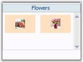{border="0"}

[]{style="COLOR: #15428b"} 

Figure 1342: Standard ScrollerType

[]{style="COLOR: #15428b"} 

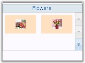{border="0"}

**[]{style="COLOR: #15428b"}** 

Figure 1343: Compact ScrollerType

**[]{style="COLOR: #15428b"}** 

RTL Support

**[]{style="COLOR: #15428b"}** 

::: {align="center"}
  ---------------------------- ---------------------------------------------------------------------------------
  Property                     Description
  RightToLeft                  Indicates whether the item should right to left for RTL languages.
  RightToLeftAutoMirrorImage   Specifies whether image should mirror when RightToLeft is enabled for the item.
  ---------------------------- ---------------------------------------------------------------------------------
:::

[]{style="COLOR: #15428b"} 

See Also

[]{style="COLOR: #15428b"} 

[[Caption Settings]{.UGHyperlink}](../../../../../../../../Documents%20and%20Settings/sylviap/Desktop/Tools%20-%20Part%202.docx#_Caption_Settings)[, ]{.UGHyperlink}[[Item Customization]{.UGHyperlink}](../../../../../../../../Documents%20and%20Settings/sylviap/Desktop/Tools%20-%20Part%202.docx#_Item_Customization)[, ]{.UGHyperlink}[[ToolTips]{.UGHyperlink}](../../../../../../../../Documents%20and%20Settings/sylviap/Desktop/Tools%20-%20Part%202.docx#_ToolTips_2)[, ]{.UGHyperlink}[[GalleryItemClick Event]{.UGHyperlink}](../../../../../../../../Documents%20and%20Settings/sylviap/Desktop/Tools%20-%20Part%202.docx#_GalleryItemClicked_Event)[]{.UGHyperlink}

 

 

 

 

[]{#_Caption_Settings_1}3.15.1.2.3.3.1.1.5 Caption Settings

[]{style="COLOR: #15428b"} 

Caption for a ToolStripGallery can be visible by settings the **ShowCaption** property to true.

[]{style="COLOR: #15428b"} 

::: {align="center"}
  ------------- -------------------------------------
  Property      Description
  ShowCaption   Sets the visibility of the caption.
  CaptionText   Sets the caption text.
  ------------- -------------------------------------
:::

[]{#p1120}[]{style="COLOR: #15428b"} 

+--------------------------------------------------------------------------------------------------------------------------------------------------------------------------------------------------+
| **[\[C#\]]{style="FONT-FAMILY: 'Courier New'; COLOR: black"}**                                                                                                                                   |
|                                                                                                                                                                                                  |
| []{style="FONT-FAMILY: 'Courier New'; COLOR: black"}                                                                                                                                             |
|                                                                                                                                                                                                  |
| [this]{style="FONT-FAMILY: 'Courier New'; COLOR: blue"}[.toolStripGallery1.CaptionText = [\"Buttons Gallery\"]{style="COLOR: maroon"};]{style="FONT-FAMILY: 'Courier New'"}                      |
|                                                                                                                                                                                                  |
| [this]{style="FONT-FAMILY: 'Courier New'; COLOR: blue"}[.toolStripGallery1.ShowCaption = [true]{style="COLOR: blue"};]{style="FONT-FAMILY: 'Courier New'"}[]{style="FONT-FAMILY: 'Courier New'"} |
+--------------------------------------------------------------------------------------------------------------------------------------------------------------------------------------------------+

[]{#p1121}[]{style="COLOR: #15428b"} 

+------------------------------------------------------------------------------------------------------------------------------------------------------------------------------------------------------------+
| **[\[VB.NET\]]{style="FONT-FAMILY: 'Courier New'; COLOR: black"}**                                                                                                                                         |
|                                                                                                                                                                                                            |
| []{style="COLOR: black"}                                                                                                                                                                                   |
|                                                                                                                                                                                                            |
| [Me]{style="FONT-FAMILY: 'Courier New'; COLOR: blue"}[.toolStripGallery1.CaptionText = [\"Buttons Gallery\"]{style="COLOR: maroon"} ]{style="FONT-FAMILY: 'Courier New'"}                                  |
|                                                                                                                                                                                                            |
| [Me]{style="FONT-FAMILY: 'Courier New'; COLOR: blue"}[.toolStripGallery1.ShowCaption = [True]{style="COLOR: blue"}]{style="FONT-FAMILY: 'Courier New'"}[]{style="FONT-FAMILY: 'Courier New'; COLOR: blue"} |
+------------------------------------------------------------------------------------------------------------------------------------------------------------------------------------------------------------+

[]{style="COLOR: #15428b"} 

See Also

[]{style="COLOR: #15428b"} 

[[Appearance Settings]{.UGHyperlink}](../../../../../../../../Documents%20and%20Settings/sylviap/Desktop/Tools%20-%20Part%202.docx#_Appearance_Settings_3)[, ]{.UGHyperlink}[[Item Customization]{.UGHyperlink}](../../../../../../../../Documents%20and%20Settings/sylviap/Desktop/Tools%20-%20Part%202.docx#_Item_Customization)[, ]{.UGHyperlink}[[ToolTips]{.UGHyperlink}](../../../../../../../../Documents%20and%20Settings/sylviap/Desktop/Tools%20-%20Part%202.docx#_ToolTips_2)[, ]{.UGHyperlink}[[GalleryItemClick Event]{.UGHyperlink}](../../../../../../../../Documents%20and%20Settings/sylviap/Desktop/Tools%20-%20Part%202.docx#_GalleryItemClicked_Event)[]{.UGHyperlink}

 

 

[]{#_Item_Customization}3.15.1.2.3.3.1.1.6 Item Customization

 

ToolStripGallery lets you customize the ToolStrip items added to the Gallery using the below properties.

[]{style="COLOR: #15428b"} 

Appearance Settings

[]{style="COLOR: #15428b"} 

::: {align="center"}
  --------------- ------------------------------------
  Property        Description
  ItemBackColor   Sets the back color for the items.
  --------------- ------------------------------------
:::

[]{style="COLOR: #15428b"} 

Style Settings

[]{style="COLOR: #15428b"} 

::: {align="center"}
+-----------------------------------+-------------------------------------------------------------+
| Property                          | Description                                                 |
+-----------------------------------+-------------------------------------------------------------+
| ItemDisplayStyle                  | Sets the display style of the items. The options are,       |
|                                   |                                                             |
|                                   |                                                             |
|                                   |                                                             |
|                                   | [·      ]{style="FONT-FAMILY: Symbol"}Text,                 |
|                                   |                                                             |
|                                   | [·      ]{style="FONT-FAMILY: Symbol"}Image and             |
|                                   |                                                             |
|                                   | [·      ]{style="FONT-FAMILY: Symbol"}ImageAndText.         |
+-----------------------------------+-------------------------------------------------------------+
| ItemTextImageRelation             | Sets the text image relation of the items. The options are, |
|                                   |                                                             |
|                                   |                                                             |
|                                   |                                                             |
|                                   | [·      ]{style="FONT-FAMILY: Symbol"}Overlay,              |
|                                   |                                                             |
|                                   | [·      ]{style="FONT-FAMILY: Symbol"}ImageAboveText,       |
|                                   |                                                             |
|                                   | [·      ]{style="FONT-FAMILY: Symbol"}TextAboveImage,       |
|                                   |                                                             |
|                                   | [·      ]{style="FONT-FAMILY: Symbol"}ImageBeforeText and   |
|                                   |                                                             |
|                                   | [·      ]{style="FONT-FAMILY: Symbol"}TextBeforeImage.      |
+-----------------------------------+-------------------------------------------------------------+
| ItemImageSize                     | Sets the image size for the items.                          |
+-----------------------------------+-------------------------------------------------------------+
| ItemMargin                        | Sets margin for the items.                                  |
+-----------------------------------+-------------------------------------------------------------+
| ItemPadding                       | Sets padding between the items.                             |
+-----------------------------------+-------------------------------------------------------------+
| ItemSize                          | Sets the Item size.                                         |
+-----------------------------------+-------------------------------------------------------------+
:::

[]{#p1122}[]{style="COLOR: #15428b"} 

+-------------------------------------------------------------------------------------------------------------------------------------------------------------------------------------------------------------------------------------------------+
| **[\[C#\]]{style="FONT-FAMILY: 'Courier New'; COLOR: black"}**                                                                                                                                                                                  |
|                                                                                                                                                                                                                                                 |
| []{style="FONT-FAMILY: 'Courier New'; COLOR: black"}                                                                                                                                                                                            |
|                                                                                                                                                                                                                                                 |
| [this]{style="FONT-FAMILY: 'Courier New'; COLOR: blue"}[.toolStripGallery1.ItemBackColor = System.Drawing.[Color]{style="COLOR: teal"}.SteelBlue;]{style="FONT-FAMILY: 'Courier New'"}                                                          |
|                                                                                                                                                                                                                                                 |
| [this]{style="FONT-FAMILY: 'Courier New'; COLOR: blue"}[.toolStripGallery1.ItemDisplayStyle = System.Windows.Forms.[ToolStripItemDisplayStyle]{style="COLOR: teal"}.Image;]{style="FONT-FAMILY: 'Courier New'"}                                 |
|                                                                                                                                                                                                                                                 |
| [this]{style="FONT-FAMILY: 'Courier New'; COLOR: blue"}[.toolStripGallery1.ItemImageSize = [new]{style="COLOR: blue"} System.Drawing.[Size]{style="COLOR: teal"}(25, 25);]{style="FONT-FAMILY: 'Courier New'"}                                  |
|                                                                                                                                                                                                                                                 |
| [this]{style="FONT-FAMILY: 'Courier New'; COLOR: blue"}[.toolStripGallery1.ItemMargin = [new]{style="COLOR: blue"} System.Windows.Forms.[Padding]{style="COLOR: teal"}(2);]{style="FONT-FAMILY: 'Courier New'"}                                 |
|                                                                                                                                                                                                                                                 |
| [this]{style="FONT-FAMILY: 'Courier New'; COLOR: blue"}[.toolStripGallery1.ItemPadding = [new]{style="COLOR: blue"} System.Windows.Forms.[Padding]{style="COLOR: teal"}(5);]{style="FONT-FAMILY: 'Courier New'"}                                |
|                                                                                                                                                                                                                                                 |
| [this]{style="FONT-FAMILY: 'Courier New'; COLOR: blue"}[.toolStripGallery1.ItemSize = [new]{style="COLOR: blue"} System.Drawing.[Size]{style="COLOR: teal"}(80, 46);]{style="FONT-FAMILY: 'Courier New'"}[]{style="FONT-FAMILY: 'Courier New'"} |
+-------------------------------------------------------------------------------------------------------------------------------------------------------------------------------------------------------------------------------------------------+

[]{style="COLOR: #15428b"} 

+-----------------------------------------------------------------------------------------------------------------------------------------------------------------------------------------------------------------------+
| **[\[]{style="FONT-FAMILY: 'Courier New'; COLOR: black"}[VB.NET\]]{style="FONT-FAMILY: 'Courier New'; COLOR: black"}[]{style="FONT-FAMILY: 'Courier New'; COLOR: black"}**                                            |
|                                                                                                                                                                                                                       |
| []{style="COLOR: black"}                                                                                                                                                                                              |
|                                                                                                                                                                                                                       |
| [Me]{style="FONT-FAMILY: 'Courier New'; COLOR: blue"}[.toolStripGallery1.ItemBackColor = System.Drawing.Color.SteelBlue]{style="FONT-FAMILY: 'Courier New'"}                                                          |
|                                                                                                                                                                                                                       |
| [Me]{style="FONT-FAMILY: 'Courier New'; COLOR: blue"}[.toolStripGallery1.ItemDisplayStyle = System.Windows.Forms.ToolStripItemDisplayStyle.Image ]{style="FONT-FAMILY: 'Courier New'"}                                |
|                                                                                                                                                                                                                       |
| [Me]{style="FONT-FAMILY: 'Courier New'; COLOR: blue"}[.toolStripGallery1.ItemImageSize = [New]{style="COLOR: blue"} System.Drawing.Size(25, 25) ]{style="FONT-FAMILY: 'Courier New'"}                                 |
|                                                                                                                                                                                                                       |
| [Me]{style="FONT-FAMILY: 'Courier New'; COLOR: blue"}[.toolStripGallery1.ItemMargin = [New]{style="COLOR: blue"} System.Windows.Forms.Padding(2) ]{style="FONT-FAMILY: 'Courier New'"}                                |
|                                                                                                                                                                                                                       |
| [Me]{style="FONT-FAMILY: 'Courier New'; COLOR: blue"}[.toolStripGallery1.ItemPadding = [New]{style="COLOR: blue"} System.Windows.Forms.Padding(5) ]{style="FONT-FAMILY: 'Courier New'"}                               |
|                                                                                                                                                                                                                       |
| [Me]{style="FONT-FAMILY: 'Courier New'; COLOR: blue"}[.toolStripGallery1.ItemSize = [New]{style="COLOR: blue"} System.Drawing.Size(80, 46)]{style="FONT-FAMILY: 'Courier New'"}[]{style="FONT-FAMILY: 'Courier New'"} |
+-----------------------------------------------------------------------------------------------------------------------------------------------------------------------------------------------------------------------+

[]{style="COLOR: #15428b"} 

See Also

**[]{style="COLOR: #15428b"}** 

[[Appearance Settings]{.UGHyperlink}](../../../../../../../../Documents%20and%20Settings/sylviap/Desktop/Tools%20-%20Part%202.docx#_Appearance_Settings_3)[, ]{.UGHyperlink}[[Caption Settings]{.UGHyperlink}](../../../../../../../../Documents%20and%20Settings/sylviap/Desktop/Tools%20-%20Part%202.docx#_Caption_Settings)[ , ]{.UGHyperlink}[[ToolTips]{.UGHyperlink}](../../../../../../../../Documents%20and%20Settings/sylviap/Desktop/Tools%20-%20Part%202.docx#_ToolTips_2)[, ]{.UGHyperlink}[[GalleryItemClick Event]{.UGHyperlink}](../../../../../../../../Documents%20and%20Settings/sylviap/Desktop/Tools%20-%20Part%202.docx#_GalleryItemClicked_Event)

[]{style="COLOR: #15428b"} 

 

 

 

 

[]{#_ToolTips_2}3.15.1.2.3.3.1.1.7 ToolTips

[]{style="COLOR: #15428b"} 

The Gallery can display a tooltip when the mouse is moved over the Gallery at runtime. This is enabled through **AutoToolTip** property. A default text will be displayed, which can be modified by providing the text in **ToolTipText** property.

[]{style="COLOR: #15428b"} 

+----------------------------------------------------------------------------------------------------------------------------------------------------------------------------------------------------------------------+
| **[\[]{style="FONT-FAMILY: 'Courier New'; COLOR: black"}[C#\]]{style="FONT-FAMILY: 'Courier New'; COLOR: black"}[]{style="FONT-FAMILY: 'Courier New'; COLOR: black"}**                                               |
|                                                                                                                                                                                                                      |
| []{style="FONT-FAMILY: 'Courier New'; COLOR: black"}                                                                                                                                                                 |
|                                                                                                                                                                                                                      |
| [//Enabling and setting the tooltip]{style="FONT-FAMILY: 'Courier New'; COLOR: green"}                                                                                                                               |
|                                                                                                                                                                                                                      |
| [this]{style="FONT-FAMILY: 'Courier New'; COLOR: blue"}[.toolStripGallery1.AutoToolTip = [true]{style="COLOR: blue"};]{style="FONT-FAMILY: 'Courier New'"}                                                           |
|                                                                                                                                                                                                                      |
| [this]{style="FONT-FAMILY: 'Courier New'; COLOR: blue"}[.toolStripGallery1.ToolTipText = [\"New ToolStrip text\"]{style="COLOR: maroon"};]{style="FONT-FAMILY: 'Courier New'"}[]{style="FONT-FAMILY: 'Courier New'"} |
+----------------------------------------------------------------------------------------------------------------------------------------------------------------------------------------------------------------------+

[]{#p1123}[]{style="COLOR: #15428b"} 

+----------------------------------------------------------------------------------------------------------------------------------------------------------------------------------------------------------------------------------+
| **[\[VB.NET\]]{style="FONT-FAMILY: 'Courier New'; COLOR: black"}**                                                                                                                                                               |
|                                                                                                                                                                                                                                  |
| []{style="FONT-FAMILY: 'Courier New'; COLOR: black"}                                                                                                                                                                             |
|                                                                                                                                                                                                                                  |
| [\'Enabling and setting the tooltip]{style="FONT-FAMILY: 'Courier New'; COLOR: green"}                                                                                                                                           |
|                                                                                                                                                                                                                                  |
| [Me]{style="FONT-FAMILY: 'Courier New'; COLOR: blue"}[.toolStripGallery1.AutoToolTip = [True]{style="COLOR: blue"}]{style="FONT-FAMILY: 'Courier New'"}                                                                          |
|                                                                                                                                                                                                                                  |
| [Me]{style="FONT-FAMILY: 'Courier New'; COLOR: blue"}[.toolStripGallery1.ToolTipText = [\"New ToolStrip text\"]{style="COLOR: maroon"}]{style="FONT-FAMILY: 'Courier New'"}[]{style="FONT-FAMILY: 'Courier New'; COLOR: maroon"} |
+----------------------------------------------------------------------------------------------------------------------------------------------------------------------------------------------------------------------------------+

[]{style="COLOR: #15428b"} 

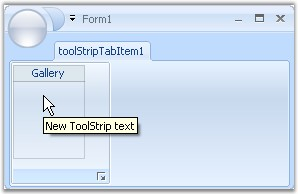{border="0"}

[]{style="COLOR: #15428b"} 

***[]{style="COLOR: #15428b"}*** 

Figure 1344: Gallery Showing the ToolTip

**[]{style="COLOR: #15428b"}** 

See Also

[]{style="COLOR: #15428b"} 

[[Appearance Settings]{style="COLOR: windowtext; TEXT-DECORATION: none; text-underline: none"}](../../../../../../../../Documents%20and%20Settings/sylviap/Desktop/Tools%20-%20Part%202.docx#_Appearance_Settings_3)[,]{style="COLOR: #15428b"}[ ]{style="COLOR: black"}[[Caption Settings]{style="COLOR: windowtext; TEXT-DECORATION: none; text-underline: none"}](../../../../../../../../Documents%20and%20Settings/sylviap/Desktop/Tools%20-%20Part%202.docx#_Caption_Settings)[ ,]{style="COLOR: #15428b"}[ ]{style="COLOR: black"}[[Item Customization]{style="COLOR: windowtext; TEXT-DECORATION: none; text-underline: none"}](../../../../../../../../Documents%20and%20Settings/sylviap/Desktop/Tools%20-%20Part%202.docx#_Item_Customization)[ ]{style="COLOR: black"}[, ]{style="COLOR: #15428b"}[[GalleryItemClick Event]{style="COLOR: windowtext; TEXT-DECORATION: none; text-underline: none"}](../../../../../../../../Documents%20and%20Settings/sylviap/Desktop/Tools%20-%20Part%202.docx#_GalleryItemClicked_Event)

 

[]{#_GalleryItemClicked_Event}3.15.1.2.3.3.1.1.8 GalleryItemClicked Event

[]{style="COLOR: #15428b"} 

[]{#p1124}GalleryItemClicked event will be triggered when a gallery item is clicked.

 

**Event Data**

 

The ToolStripGalleryItemEventHandler receives an argument of type ToolStripGalleryItemEventArgs containing data related to this event. The following ToolStripGalleryItemEventArgs member provide information specific to this event.

[]{style="COLOR: #15428b"} 

::: {align="center"}
  ------------- -----------------------------
  Member        Description
  GalleryItem   Indicates the gallery item.
  ------------- -----------------------------
:::

[]{style="COLOR: #15428b"} 

+--------------------------------------------------------------------------------------------------------------------------------------------------------------------------------------------------------------------------------------------------------------------------------------------------+
| **[\[C#\]]{style="FONT-FAMILY: 'Courier New'; COLOR: black"}**                                                                                                                                                                                                                                   |
|                                                                                                                                                                                                                                                                                                  |
| []{style="FONT-FAMILY: 'Courier New'; COLOR: black"}                                                                                                                                                                                                                                             |
|                                                                                                                                                                                                                                                                                                  |
| [this]{style="FONT-FAMILY: 'Courier New'; COLOR: blue"}[.toolStripGallery2.GalleryItemClicked += [new]{style="COLOR: blue"} Syncfusion.Windows.Forms.Tools.[ToolStripGalleryItemEventHandler]{style="COLOR: teal"}(toolStripGallery2_GalleryItemClicked);]{style="FONT-FAMILY: 'Courier New'"}   |
|                                                                                                                                                                                                                                                                                                  |
| []{style="FONT-FAMILY: 'Courier New'"}                                                                                                                                                                                                                                                           |
|                                                                                                                                                                                                                                                                                                  |
| [private]{style="FONT-FAMILY: 'Courier New'; COLOR: blue"}[ [void]{style="COLOR: blue"} toolStripGallery2_GalleryItemClicked([object]{style="COLOR: blue"} sender, Syncfusion.Windows.Forms.Tools.[ToolStripGalleryItemEventArgs]{style="COLOR: teal"} arg)]{style="FONT-FAMILY: 'Courier New'"} |
|                                                                                                                                                                                                                                                                                                  |
| [{]{style="FONT-FAMILY: 'Courier New'"}                                                                                                                                                                                                                                                          |
|                                                                                                                                                                                                                                                                                                  |
| [// You can see the below line in output window during runtime.]{style="FONT-FAMILY: 'Courier New'; COLOR: green"}                                                                                                                                                                               |
|                                                                                                                                                                                                                                                                                                  |
| [Console]{style="FONT-FAMILY: 'Courier New'; COLOR: teal"}[.WriteLine([\"GalleryItemClicked event is raised\"]{style="COLOR: maroon"});]{style="FONT-FAMILY: 'Courier New'"}                                                                                                                     |
|                                                                                                                                                                                                                                                                                                  |
| [//Display the GalleryItem]{style="FONT-FAMILY: 'Courier New'; COLOR: green"}                                                                                                                                                                                                                    |
|                                                                                                                                                                                                                                                                                                  |
| [Console]{style="FONT-FAMILY: 'Courier New'; COLOR: teal"}[.WriteLine([\"GalleryItem : \"]{style="COLOR: maroon"} + arg.GalleryItem.ToString());]{style="FONT-FAMILY: 'Courier New'"}                                                                                                            |
|                                                                                                                                                                                                                                                                                                  |
| [}]{style="FONT-FAMILY: 'Courier New'"}                                                                                                                                                                                                                                                          |
+--------------------------------------------------------------------------------------------------------------------------------------------------------------------------------------------------------------------------------------------------------------------------------------------------+

[]{style="COLOR: #15428b"} 

+------------------------------------------------------------------------------------------------------------------------------------------------------------------------------------------------------------------------------------------------------------------------------------------------------------------------------------------------------------------------------------------------------------------+
| **[\[VB.NET\]]{style="FONT-FAMILY: 'Courier New'; COLOR: black"}**                                                                                                                                                                                                                                                                                                                                               |
|                                                                                                                                                                                                                                                                                                                                                                                                                  |
| []{style="COLOR: black"}                                                                                                                                                                                                                                                                                                                                                                                         |
|                                                                                                                                                                                                                                                                                                                                                                                                                  |
| [Private]{style="FONT-FAMILY: 'Courier New'; COLOR: blue"}[ [Sub]{style="COLOR: blue"} toolStripGallery2_GalleryItemClicked([ByVal]{style="COLOR: blue"} sender [As]{style="COLOR: blue"} [Object]{style="COLOR: blue"}, [ByVal]{style="COLOR: blue"} arg [As]{style="COLOR: blue"} Syncfusion.Windows.Forms.Tools.[ToolStripGalleryItemEventHandler]{style="COLOR: teal"})]{style="FONT-FAMILY: 'Courier New'"} |
|                                                                                                                                                                                                                                                                                                                                                                                                                  |
| [\'You can see the below line in output window during runtime.]{style="FONT-FAMILY: 'Courier New'; COLOR: green"}                                                                                                                                                                                                                                                                                                |
|                                                                                                                                                                                                                                                                                                                                                                                                                  |
| [Console.WriteLine([\"GalleryItemClicked event is raised\"]{style="COLOR: maroon"})]{style="FONT-FAMILY: 'Courier New'"}                                                                                                                                                                                                                                                                                         |
|                                                                                                                                                                                                                                                                                                                                                                                                                  |
| [\'Display the GalleryItem]{style="FONT-FAMILY: 'Courier New'; COLOR: green"}                                                                                                                                                                                                                                                                                                                                    |
|                                                                                                                                                                                                                                                                                                                                                                                                                  |
| [Console.WriteLine([\"GalleryItem : \"]{style="COLOR: maroon"} + arg.GalleryItem.ToString)]{style="FONT-FAMILY: 'Courier New'"}                                                                                                                                                                                                                                                                                  |
|                                                                                                                                                                                                                                                                                                                                                                                                                  |
| [End]{style="FONT-FAMILY: 'Courier New'; COLOR: blue"}[ [Sub]{style="COLOR: blue"}]{style="FONT-FAMILY: 'Courier New'"}[]{style="FONT-FAMILY: 'Courier New'; COLOR: blue"}                                                                                                                                                                                                                                       |
+------------------------------------------------------------------------------------------------------------------------------------------------------------------------------------------------------------------------------------------------------------------------------------------------------------------------------------------------------------------------------------------------------------------+

[]{style="COLOR: #15428b"} 

See Also

[]{style="COLOR: #15428b"} 

[[Appearance Settings]{.UGHyperlink}](../../../../../../../../Documents%20and%20Settings/sylviap/Desktop/Tools%20-%20Part%202.docx#_Appearance_Settings_3)[, ]{.UGHyperlink}[[Item Customization]{.UGHyperlink}](../../../../../../../../Documents%20and%20Settings/sylviap/Desktop/Tools%20-%20Part%202.docx#_Item_Customization)[, ]{.UGHyperlink}[[ToolTips]{.UGHyperlink}](../../../../../../../../Documents%20and%20Settings/sylviap/Desktop/Tools%20-%20Part%202.docx#_ToolTips_2)[, ]{.UGHyperlink}[[Caption Settings]{.UGHyperlink}](../../../../../../../../Documents%20and%20Settings/sylviap/Desktop/Tools%20-%20Part%202.docx#_Caption_Settings)

 

3.15.1.2.3.3.1.1.9 Show ToolTips for individual Gallery Items

 

RibbonControlAdv now supports showing ToolTips for individual Gallery Item when moving the mouse over them. Earlier ToolTips were not supported for individual gallery items. Now you can specify the ToolTipText for individual Gallery Items on the ToolTipText property of the respective toolStripGallery Item.

+-------------------------------------------------------------------------------------------------------+
| **\[C#\]**                                                                                            |
|                                                                                                       |
| [//Add tooltip.]{style="FONT-FAMILY: 'Courier New'"}                                                  |
|                                                                                                       |
| [this.toolStripGallery1.Items\[0\].ToolTipText = \"No spacing\";]{style="FONT-FAMILY: 'Courier New'"} |
|                                                                                                       |
| [this.toolStripGallery1.Items\[1\].ToolTipText = \"Heading 1\";]{style="FONT-FAMILY: 'Courier New'"}  |
+-------------------------------------------------------------------------------------------------------+

[]{style="FONT-FAMILY: 'Calibri','sans-serif'; FONT-SIZE: 11pt"} 

+-------------------------------------------------------------------------------------------------------------------------------------------------------------------------------+
| **\[VB.NET\]**                                                                                                                                                                |
|                                                                                                                                                                               |
| [\'Add tooltip.]{style="FONT-FAMILY: 'Courier New'; COLOR: green"}[]{style="FONT-FAMILY: 'Courier New'"}                                                                      |
|                                                                                                                                                                               |
| [Me]{style="FONT-FAMILY: 'Courier New'; COLOR: blue"}[.toolStripGallery1.Items(0).ToolTipText = [\"No spacing\"]{style="COLOR: darkred"}]{style="FONT-FAMILY: 'Courier New'"} |
|                                                                                                                                                                               |
| [Me]{style="FONT-FAMILY: 'Courier New'; COLOR: blue"}[.toolStripGallery1.Items(1).ToolTipText = [\"Heading 1\"]{style="COLOR: darkred"}]{style="FONT-FAMILY: 'Courier New'"}  |
+-------------------------------------------------------------------------------------------------------------------------------------------------------------------------------+

 

[]{#_SplitButtonEx}3.15.1.2.3.3.1.1.10        SplitButtonEx

[]{#p1125}[]{style="COLOR: #15428b"} 

ToolStripSplitButtonEx can be added to a ToolStripEx directly or through a panel.

[]{style="COLOR: #15428b"} 

[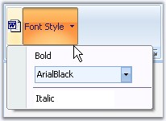{border="0"}]{style="COLOR: #15428b"}[]{style="COLOR: #15428b"}

[]{style="COLOR: #15428b"} 

Figure 1345: ToolStripSplitButtonEx with DropDownMenu Items

**[]{style="COLOR: #15428b"}** 

Programmatically, ToolStripSplitButtonEx can be added as follows.

**[]{style="COLOR: #15428b"}** 

+------------------------------------------------------------------------------------------------------------------------------------------------------------------------------------------------------------------------------------+
| **[\[C#\]]{style="FONT-FAMILY: 'Courier New'; COLOR: black"}**                                                                                                                                                                     |
|                                                                                                                                                                                                                                    |
| []{style="FONT-FAMILY: 'Courier New'; COLOR: black"}                                                                                                                                                                               |
|                                                                                                                                                                                                                                    |
| [private]{style="FONT-FAMILY: 'Courier New'; COLOR: blue"}[ [ToolStripSplitButtonEx]{style="COLOR: teal"} toolStripSplitButtonEx1;]{style="FONT-FAMILY: 'Courier New'"}                                                            |
|                                                                                                                                                                                                                                    |
| [this]{style="FONT-FAMILY: 'Courier New'; COLOR: blue"}[.toolStripSplitButtonEx1 = [new]{style="COLOR: blue"} Syncfusion.Windows.Forms.Tools.[ToolStripSplitButtonEx]{style="COLOR: teal"}();]{style="FONT-FAMILY: 'Courier New'"} |
|                                                                                                                                                                                                                                    |
| [this]{style="FONT-FAMILY: 'Courier New'; COLOR: blue"}[.toolStripEx1.Items.AddRange([new]{style="COLOR: blue"} System.Windows.Forms.[ToolStripItem]{style="COLOR: teal"}\[\] {]{style="FONT-FAMILY: 'Courier New'"}               |
|                                                                                                                                                                                                                                    |
| [this]{style="FONT-FAMILY: 'Courier New'; COLOR: blue"}[.toolStripSplitButtonEx1});]{style="FONT-FAMILY: 'Courier New'"}[]{style="FONT-FAMILY: 'Courier New'"}                                                                     |
+------------------------------------------------------------------------------------------------------------------------------------------------------------------------------------------------------------------------------------+

[]{style="COLOR: #15428b"} 

+-------------------------------------------------------------------------------------------------------------------------------------------------------------------------------------------------------------------------------------------------------------------------------------+
| **[\[]{style="FONT-FAMILY: 'Courier New'; COLOR: black"}[VB.NET\]]{style="FONT-FAMILY: 'Courier New'; COLOR: black"}[]{style="FONT-FAMILY: 'Courier New'; COLOR: black"}**                                                                                                          |
|                                                                                                                                                                                                                                                                                     |
| []{style="COLOR: black"}                                                                                                                                                                                                                                                            |
|                                                                                                                                                                                                                                                                                     |
| [Private]{style="FONT-FAMILY: 'Courier New'; COLOR: blue"}[ toolStripSplitButtonEx1 [As]{style="COLOR: blue"}[ ToolStripSplitButtonEx]{style="COLOR: black"}]{style="FONT-FAMILY: 'Courier New'"}                                                                                   |
|                                                                                                                                                                                                                                                                                     |
| []{style="FONT-FAMILY: 'Courier New'"}                                                                                                                                                                                                                                              |
|                                                                                                                                                                                                                                                                                     |
| [Me]{style="FONT-FAMILY: 'Courier New'; COLOR: blue"}[.toolStripSplitButtonEx1 = [New]{style="COLOR: blue"} Syncfusion.Windows.Forms.Tools.[ToolStripSplitButtonEx() ]{style="COLOR: black"}]{style="FONT-FAMILY: 'Courier New'"}                                                   |
|                                                                                                                                                                                                                                                                                     |
| [Me]{style="FONT-FAMILY: 'Courier New'; COLOR: blue"}[.toolStripEx1.Items.AddRange([New]{style="COLOR: blue"} System.Windows.Forms.ToolStripItem() {[Me]{style="COLOR: blue"}.toolStripSplitButtonEx1}) ]{style="FONT-FAMILY: 'Courier New'"}[]{style="FONT-FAMILY: 'Courier New'"} |
+-------------------------------------------------------------------------------------------------------------------------------------------------------------------------------------------------------------------------------------------------------------------------------------+

**[]{style="COLOR: #15428b"}** 

The properties of SplitButtonEx is similar to [[[SplitButton]{style="COLOR: windowtext"}]{.UGHyperlink}](../../../../../../../../Documents%20and%20Settings/sylviap/Desktop/Tools%20-%20Part%202.docx#_Split_Button) except **DropDownButtonWidth** property which is not available for SplitButtonEx control.

 

 

 

[]{#_ComboBoxEx}3.15.1.2.3.3.1.1.11        ComboBoxEx

[]{style="COLOR: #15428b"} 

ToolStripComboBoxEx can be added to a ToolStripEx directly or through a panel.

[]{style="COLOR: #15428b"} 

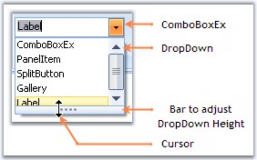{border="0"}

[]{style="COLOR: #15428b"} 

Figure 1346: ToolStripComboBoxEx

**[]{style="COLOR: #15428b"}** 

Programmatically adding ToolStripComboBoxEx,

**[]{style="COLOR: #15428b"}** 

+-------------------------------------------------------------------------------------------------------------------------------------------------------------------------------------------------------------------------------------------------------------------------------------------------------------------------------------------------------------------+
| **[\[]{style="FONT-FAMILY: 'Courier New'; COLOR: black"}[C#\]]{style="FONT-FAMILY: 'Courier New'; COLOR: black"}[]{style="FONT-FAMILY: 'Courier New'; COLOR: black"}**                                                                                                                                                                                            |
|                                                                                                                                                                                                                                                                                                                                                                   |
| []{style="FONT-FAMILY: 'Courier New'; COLOR: black"}                                                                                                                                                                                                                                                                                                              |
|                                                                                                                                                                                                                                                                                                                                                                   |
| [private]{style="FONT-FAMILY: 'Courier New'; COLOR: blue"}[ [ToolStripComboBoxEx]{style="COLOR: teal"} toolStripComboBoxEx1;]{style="FONT-FAMILY: 'Courier New'"}                                                                                                                                                                                                 |
|                                                                                                                                                                                                                                                                                                                                                                   |
| [this]{style="FONT-FAMILY: 'Courier New'; COLOR: blue"}[.toolStripComboBoxEx1 = [new]{style="COLOR: blue"} Syncfusion.Windows.Forms.Tools.[ToolStripComboBoxEx]{style="COLOR: teal"}();]{style="FONT-FAMILY: 'Courier New'"}                                                                                                                                      |
|                                                                                                                                                                                                                                                                                                                                                                   |
| [this]{style="FONT-FAMILY: 'Courier New'; COLOR: blue"}[.toolStripComboBoxEx2.Items.AddRange([new]{style="COLOR: blue"} [object]{style="COLOR: blue"}\[\] {[\"ComboBoxEx\"]{style="COLOR: maroon"}, [\"PanelItem\"]{style="COLOR: maroon"}, [\"SplitButton\"]{style="COLOR: maroon"}, [\"Gallery\"]{style="COLOR: maroon"}, ]{style="FONT-FAMILY: 'Courier New'"} |
|                                                                                                                                                                                                                                                                                                                                                                   |
| [            [\"Label\"]{style="COLOR: maroon"}});]{style="FONT-FAMILY: 'Courier New'"}                                                                                                                                                                                                                                                                           |
|                                                                                                                                                                                                                                                                                                                                                                   |
| [this]{style="FONT-FAMILY: 'Courier New'; COLOR: blue"}[.toolStripEx2.Items.AddRange([new]{style="COLOR: blue"} System.Windows.Forms.[ToolStripItem]{style="COLOR: teal"}\[\] {]{style="FONT-FAMILY: 'Courier New'"}                                                                                                                                              |
|                                                                                                                                                                                                                                                                                                                                                                   |
| [this]{style="FONT-FAMILY: 'Courier New'; COLOR: blue"}[.toolStripComboBoxEx2});]{style="FONT-FAMILY: 'Courier New'"}[]{style="FONT-FAMILY: 'Courier New'"}                                                                                                                                                                                                       |
+-------------------------------------------------------------------------------------------------------------------------------------------------------------------------------------------------------------------------------------------------------------------------------------------------------------------------------------------------------------------+

[]{#p1126}[]{style="COLOR: #15428b"} 

+----------------------------------------------------------------------------------------------------------------------------------------------------------------------------------------------------------------------------------------------------------------------------------------------------------------------------------------------------------------------------------------------------+
| **[\[VB.NET\]]{style="FONT-FAMILY: 'Courier New'; COLOR: black"}**                                                                                                                                                                                                                                                                                                                                 |
|                                                                                                                                                                                                                                                                                                                                                                                                    |
| []{style="COLOR: black"}                                                                                                                                                                                                                                                                                                                                                                           |
|                                                                                                                                                                                                                                                                                                                                                                                                    |
| [Private]{style="FONT-FAMILY: 'Courier New'; COLOR: blue"}[ toolStripComboBoxEx1 [As]{style="COLOR: blue"} ToolStripComboBoxEx ]{style="FONT-FAMILY: 'Courier New'"}                                                                                                                                                                                                                               |
|                                                                                                                                                                                                                                                                                                                                                                                                    |
| [Me]{style="FONT-FAMILY: 'Courier New'; COLOR: blue"}[.toolStripComboBoxEx1 = [New]{style="COLOR: blue"} Syncfusion.Windows.Forms.Tools.ToolStripComboBoxEx() ]{style="FONT-FAMILY: 'Courier New'"}                                                                                                                                                                                                |
|                                                                                                                                                                                                                                                                                                                                                                                                    |
| [Me]{style="FONT-FAMILY: 'Courier New'; COLOR: blue"}[.toolStripComboBoxEx2.Items.AddRange([New]{style="COLOR: blue"} [Object]{style="COLOR: blue"}() {[\"ComboBoxEx\"]{style="COLOR: maroon"}, [\"PanelItem\"]{style="COLOR: maroon"}, [\"SplitButton\"]{style="COLOR: maroon"}, [\"Gallery\"]{style="COLOR: maroon"}, [\"Label\"]{style="COLOR: maroon"}}) ]{style="FONT-FAMILY: 'Courier New'"} |
|                                                                                                                                                                                                                                                                                                                                                                                                    |
| [Me]{style="FONT-FAMILY: 'Courier New'; COLOR: blue"}[.toolStripEx2.Items.AddRange([New]{style="COLOR: blue"} System.Windows.Forms.ToolStripItem() {[Me]{style="COLOR: blue"}.toolStripComboBoxEx2}) ]{style="FONT-FAMILY: 'Courier New'"}[]{style="FONT-FAMILY: 'Courier New'"}                                                                                                                   |
+----------------------------------------------------------------------------------------------------------------------------------------------------------------------------------------------------------------------------------------------------------------------------------------------------------------------------------------------------------------------------------------------------+

**[]{style="COLOR: #15428b"}** 

DropDown Features at run time

[]{style="COLOR: #15428b"} 

The ComboBoxEx item by default comes with Office2007 look and feel. The items can be added to the dropdown popup using **Items** property similar to Windows ComboBox control. We can adjust the height of the dropdown at run time, by just moving the adjustable bar at the bottom of the popup. Automatic scrollbars will appear if all the dropdown items are not visible.

[]{style="COLOR: #15428b"} 

::: {style="BORDER-BOTTOM: windowtext 1pt solid; BORDER-LEFT: medium none; PADDING-BOTTOM: 1pt; MARGIN: 9pt 0pt 9pt 18pt; PADDING-LEFT: 0pt; PADDING-RIGHT: 0pt; BORDER-TOP: windowtext 1pt solid; BORDER-RIGHT: medium none; PADDING-TOP: 1pt"}
{border="0"} Note: We can set banner text for the ComboBoxEx control. Refer [[BannerTextProvider Component]{.UGHyperlink}](../../../../../../../../Documents%20and%20Settings/sylviap/Desktop/Tools%20-%20Part%202.docx#_BannerTextProvider_Component) topic for more details.
:::

 

 

[]{#_Button}3.15.1.2.3.3.1.1.12        Button

[]{style="COLOR: #15428b"} 

ToolStripButton can be added to a ToolStripEx directly or through a panel.

[]{style="COLOR: #15428b"} 

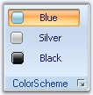{border="0"}

[]{style="COLOR: #15428b"} 

Figure 1347: ToolStripButtons Added to the ToolStripEx

**[]{style="COLOR: #15428b"}** 

The below properties controls the appearance and behavior of the ToolStripButton.

[]{style="COLOR: #15428b"} 

Foreground Settings

[]{style="COLOR: #15428b"} 

::: {align="center"}
+-----------------------------------+-----------------------------------------------------------------------------------------------------------------------+
| Property                          | Description                                                                                                           |
+-----------------------------------+-----------------------------------------------------------------------------------------------------------------------+
| Text                              | Sets the Text for the ToolStripButton. This text will be displayed, only if the DisplayStyle is Text or ImageAndText. |
+-----------------------------------+-----------------------------------------------------------------------------------------------------------------------+
| Font                              | Sets the font style for the display text.                                                                             |
+-----------------------------------+-----------------------------------------------------------------------------------------------------------------------+
| ForeColor                         | Sets the fore color for the display text.                                                                             |
+-----------------------------------+-----------------------------------------------------------------------------------------------------------------------+
| TextAlign                         | Specifies the alignment of the text in the item. The options are,                                                     |
|                                   |                                                                                                                       |
|                                   |                                                                                                                       |
|                                   |                                                                                                                       |
|                                   | [·      ]{style="FONT-FAMILY: Symbol"}TopLeft,                                                                        |
|                                   |                                                                                                                       |
|                                   | [·      ]{style="FONT-FAMILY: Symbol"}TopCenter,                                                                      |
|                                   |                                                                                                                       |
|                                   | [·      ]{style="FONT-FAMILY: Symbol"}TopRight,                                                                       |
|                                   |                                                                                                                       |
|                                   | [·      ]{style="FONT-FAMILY: Symbol"}MiddleLeft,                                                                     |
|                                   |                                                                                                                       |
|                                   | [·      ]{style="FONT-FAMILY: Symbol"}MiddleCenter,                                                                   |
|                                   |                                                                                                                       |
|                                   | [·      ]{style="FONT-FAMILY: Symbol"}MiddleRight,                                                                    |
|                                   |                                                                                                                       |
|                                   | [·      ]{style="FONT-FAMILY: Symbol"}BottomLeft,                                                                     |
|                                   |                                                                                                                       |
|                                   | [·      ]{style="FONT-FAMILY: Symbol"}BottomCenter and                                                                |
|                                   |                                                                                                                       |
|                                   | [·      ]{style="FONT-FAMILY: Symbol"}BottomRight.                                                                    |
+-----------------------------------+-----------------------------------------------------------------------------------------------------------------------+
| TextDirection                     | Specifies the direction of drawing the text. The direction are,                                                       |
|                                   |                                                                                                                       |
|                                   |                                                                                                                       |
|                                   |                                                                                                                       |
|                                   | [·      ]{style="FONT-FAMILY: Symbol"}*Horizontal* - Text is placed horizontally,                                     |
|                                   |                                                                                                                       |
|                                   | [·      ]{style="FONT-FAMILY: Symbol"}*Vertical90* - Text is placed vertically and                                    |
|                                   |                                                                                                                       |
|                                   | [·      ]{style="FONT-FAMILY: Symbol"}*Vertical270* - Text is placed vertically at 270 degrees.                       |
+-----------------------------------+-----------------------------------------------------------------------------------------------------------------------+
| TextImageRelation                 | Specifies the relative location of the image to the text on the item. The options are,                                |
|                                   |                                                                                                                       |
|                                   |                                                                                                                       |
|                                   |                                                                                                                       |
|                                   | [·      ]{style="FONT-FAMILY: Symbol"}*Overlay* - Image and text shares the same space in the control,                |
|                                   |                                                                                                                       |
|                                   | [·      ]{style="FONT-FAMILY: Symbol"}*ImageAboveText* - Image will be placed above the text,                         |
|                                   |                                                                                                                       |
|                                   | [·      ]{style="FONT-FAMILY: Symbol"}*TextAboveImage* - Text will be placed above the image,                         |
|                                   |                                                                                                                       |
|                                   | [·      ]{style="FONT-FAMILY: Symbol"}*ImageBeforeText* - Image will be placed before the text and                    |
|                                   |                                                                                                                       |
|                                   | [·      ]{style="FONT-FAMILY: Symbol"}*TextBeforeImage* - Text will be placed before the image.                       |
+-----------------------------------+-----------------------------------------------------------------------------------------------------------------------+
:::

[]{style="COLOR: #15428b"} 

Image Settings

[]{style="COLOR: #15428b"} 

::: {align="center"}
+-----------------------------------+----------------------------------------------------------------------------+
| Property                          | Description                                                                |
+-----------------------------------+----------------------------------------------------------------------------+
| Image                             | Sets the image for the item.                                               |
+-----------------------------------+----------------------------------------------------------------------------+
| ImageAlign                        | Specifies the alignment of the image. The options are,                     |
|                                   |                                                                            |
|                                   |                                                                            |
|                                   |                                                                            |
|                                   | [·      ]{style="FONT-FAMILY: Symbol"}TopLeft,                             |
|                                   |                                                                            |
|                                   | [·      ]{style="FONT-FAMILY: Symbol"}TopCenter,                           |
|                                   |                                                                            |
|                                   | [·      ]{style="FONT-FAMILY: Symbol"}TopRight,                            |
|                                   |                                                                            |
|                                   | [·      ]{style="FONT-FAMILY: Symbol"}MiddleLeft,                          |
|                                   |                                                                            |
|                                   | [·      ]{style="FONT-FAMILY: Symbol"}MiddleCenter,                        |
|                                   |                                                                            |
|                                   | [·      ]{style="FONT-FAMILY: Symbol"}MiddleRight,                         |
|                                   |                                                                            |
|                                   | [·      ]{style="FONT-FAMILY: Symbol"}BottomLeft,                          |
|                                   |                                                                            |
|                                   | [·      ]{style="FONT-FAMILY: Symbol"}BottomCenter and                     |
|                                   |                                                                            |
|                                   | [·      ]{style="FONT-FAMILY: Symbol"}BottomRight.                         |
+-----------------------------------+----------------------------------------------------------------------------+
| ImageScaling                      | Specifies whether the image on the item will size to fit on the ToolStrip. |
+-----------------------------------+----------------------------------------------------------------------------+
| ImageTransparentColor             | Sets the transparent color on the image, that supports transparency.       |
+-----------------------------------+----------------------------------------------------------------------------+
:::

[]{style="COLOR: #15428b"} 

Style Settings

[]{style="COLOR: #15428b"} 

::: {align="center"}
+-----------------------------------+---------------------------------------------------------------------------------------------------------------------------------------+
| Property                          | Description                                                                                                                           |
+-----------------------------------+---------------------------------------------------------------------------------------------------------------------------------------+
| DisplayStyle                      | Specifies how the image and text are rendered. The styles are,                                                                        |
|                                   |                                                                                                                                       |
|                                   |                                                                                                                                       |
|                                   |                                                                                                                                       |
|                                   | [·      ]{style="FONT-FAMILY: Symbol"}*Text* - Displays only text,                                                                    |
|                                   |                                                                                                                                       |
|                                   | [·      ]{style="FONT-FAMILY: Symbol"}*Image* - Displays only image,                                                                  |
|                                   |                                                                                                                                       |
|                                   | [·      ]{style="FONT-FAMILY: Symbol"}*ImageAndText* - Displays image and text.                                                       |
+-----------------------------------+---------------------------------------------------------------------------------------------------------------------------------------+
| Checked                           | Indicates whether button is checked when the application loads.                                                                       |
+-----------------------------------+---------------------------------------------------------------------------------------------------------------------------------------+
| CheckState                        | Specifies the check state. The different check states are,                                                                            |
|                                   |                                                                                                                                       |
|                                   |                                                                                                                                       |
|                                   |                                                                                                                                       |
|                                   | [·      ]{style="FONT-FAMILY: Symbol"}Checked,                                                                                        |
|                                   |                                                                                                                                       |
|                                   | [·      ]{style="FONT-FAMILY: Symbol"}Unchecked and                                                                                   |
|                                   |                                                                                                                                       |
|                                   | [·      ]{style="FONT-FAMILY: Symbol"}Indeterminate.                                                                                  |
+-----------------------------------+---------------------------------------------------------------------------------------------------------------------------------------+
| CheckOnClick                      | Indicates whether the item should change its selected state when clicked.                                                             |
+-----------------------------------+---------------------------------------------------------------------------------------------------------------------------------------+
| Enabled                           | Specifies whether the item is enabled.                                                                                                |
+-----------------------------------+---------------------------------------------------------------------------------------------------------------------------------------+
| Visible                           | Specifies whether the item is visible.                                                                                                |
+-----------------------------------+---------------------------------------------------------------------------------------------------------------------------------------+
| Alignment                         | Sets the alignment of the item within the ToolStripEx. They can be set to beginning (Left) or end (Right) of the ToolStripEx control. |
+-----------------------------------+---------------------------------------------------------------------------------------------------------------------------------------+
| AutoSize                          | Specifies whether the item should size itself based on its image and text.                                                            |
+-----------------------------------+---------------------------------------------------------------------------------------------------------------------------------------+
:::

[]{style="COLOR: #15428b"} 

ToolTip Settings

[]{style="COLOR: #15428b"} 

::: {align="center"}
+-----------------------------------+------------------------------------------------------------------------------------------+
| Property                          | Description                                                                              |
+-----------------------------------+------------------------------------------------------------------------------------------+
| AutoToolTip                       | When set to true, will display the text set in the Text property as the item\'s tooltip. |
|                                   |                                                                                          |
|                                   |                                                                                          |
|                                   |                                                                                          |
|                                   | When set to false, will display the text set in the ToolTipText property.                |
+-----------------------------------+------------------------------------------------------------------------------------------+
| ToolTipText                       | Sets the text for the tooltip when AutoToolTip is set to false.                          |
+-----------------------------------+------------------------------------------------------------------------------------------+
:::

[]{style="COLOR: #15428b"} 

RTL Support

**[]{style="COLOR: #15428b"}** 

::: {align="center"}
  ---------------------------- ---------------------------------------------------------------------------------
  Property                     Description
  RightToLeft                  Indicates whether the item should draw right to left for RTL languages.
  RightToLeftAutoMirrorImage   Specifies whether image should mirror when RightToLeft is enabled for the item.
  ---------------------------- ---------------------------------------------------------------------------------
:::

 

 

 

 

[]{#_Label}3.15.1.2.3.3.1.1.13        Label

[]{style="COLOR: #15428b"} 

ToolStripLabel can be added to a ToolStripEx directly or through a panel.

[]{style="COLOR: #15428b"} 

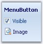{border="0"}

[]{style="COLOR: #15428b"} 

Figure 1348: ToolStripLabel.Text = \"MenuButton\" in a Panel

**[]{style="COLOR: #15428b"}** 

The below properties controls the appearance and behavior of the ToolStripLabel.

[]{style="COLOR: #15428b"} 

Foreground Settings

[]{style="COLOR: #15428b"} 

::: {align="center"}
+-----------------------------------+----------------------------------------------------------------------------------------------------------------------+
| Property                          | Description                                                                                                          |
+-----------------------------------+----------------------------------------------------------------------------------------------------------------------+
| Text                              | Sets the Text for the ToolStripLabel. This text will be displayed, only if the DisplayStyle is Text or ImageAndText. |
+-----------------------------------+----------------------------------------------------------------------------------------------------------------------+
| Font                              | Sets the font style for the display text.                                                                            |
+-----------------------------------+----------------------------------------------------------------------------------------------------------------------+
| ForeColor                         | Sets the fore color for the display text.                                                                            |
+-----------------------------------+----------------------------------------------------------------------------------------------------------------------+
| TextAlign                         | Specifies the alignment of the text in the item. The options are,                                                    |
|                                   |                                                                                                                      |
|                                   |                                                                                                                      |
|                                   |                                                                                                                      |
|                                   | [·      ]{style="FONT-FAMILY: Symbol"}TopLeft,                                                                       |
|                                   |                                                                                                                      |
|                                   | [·      ]{style="FONT-FAMILY: Symbol"}TopCenter,                                                                     |
|                                   |                                                                                                                      |
|                                   | [·      ]{style="FONT-FAMILY: Symbol"}TopRight,                                                                      |
|                                   |                                                                                                                      |
|                                   | [·      ]{style="FONT-FAMILY: Symbol"}MiddleLeft,                                                                    |
|                                   |                                                                                                                      |
|                                   | [·      ]{style="FONT-FAMILY: Symbol"}MiddleCenter,                                                                  |
|                                   |                                                                                                                      |
|                                   | [·      ]{style="FONT-FAMILY: Symbol"}MiddleRight,                                                                   |
|                                   |                                                                                                                      |
|                                   | [·      ]{style="FONT-FAMILY: Symbol"}BottomLeft,                                                                    |
|                                   |                                                                                                                      |
|                                   | [·      ]{style="FONT-FAMILY: Symbol"}BottomCenter and                                                               |
|                                   |                                                                                                                      |
|                                   | [·      ]{style="FONT-FAMILY: Symbol"}BottomRight.                                                                   |
+-----------------------------------+----------------------------------------------------------------------------------------------------------------------+
| TextDirection                     | Specifies the direction of drawing the text. The direction are,                                                      |
|                                   |                                                                                                                      |
|                                   |                                                                                                                      |
|                                   |                                                                                                                      |
|                                   | [·      ]{style="FONT-FAMILY: Symbol"}*Horizontal* - Text is placed horizontally,                                    |
|                                   |                                                                                                                      |
|                                   | [·      ]{style="FONT-FAMILY: Symbol"}*Vertical90* - Text is placed vertically and                                   |
|                                   |                                                                                                                      |
|                                   | [·      ]{style="FONT-FAMILY: Symbol"}*Vertical270* - Text is placed vertically at 270 degrees.                      |
+-----------------------------------+----------------------------------------------------------------------------------------------------------------------+
| TextImageRelation                 | Specifies the relative location of the image to the text on the item. The options are,                               |
|                                   |                                                                                                                      |
|                                   |                                                                                                                      |
|                                   |                                                                                                                      |
|                                   | [·      ]{style="FONT-FAMILY: Symbol"}*Overlay* - Image and text shares the same space in the control,               |
|                                   |                                                                                                                      |
|                                   | [·      ]{style="FONT-FAMILY: Symbol"}*ImageAboveText* - Image will be placed above the text,                        |
|                                   |                                                                                                                      |
|                                   | [·      ]{style="FONT-FAMILY: Symbol"}*TextAboveImage* - Text will be placed above the image,                        |
|                                   |                                                                                                                      |
|                                   | [·      ]{style="FONT-FAMILY: Symbol"}*ImageBeforeText* - Image will be placed before the text and                   |
|                                   |                                                                                                                      |
|                                   | [·      ]{style="FONT-FAMILY: Symbol"}*TextBeforeImage* - Text will be placed before the image.                      |
+-----------------------------------+----------------------------------------------------------------------------------------------------------------------+
:::

[]{style="COLOR: #15428b"} 

Image Settings

[]{style="COLOR: #15428b"} 

::: {align="center"}
+-----------------------------------+----------------------------------------------------------------------------+
| Property                          | Description                                                                |
+-----------------------------------+----------------------------------------------------------------------------+
| Image                             | Sets the image for the item.                                               |
+-----------------------------------+----------------------------------------------------------------------------+
| ImageAlign                        | Specifies the alignment of the image. The options are,                     |
|                                   |                                                                            |
|                                   |                                                                            |
|                                   |                                                                            |
|                                   | [·      ]{style="FONT-FAMILY: Symbol"}TopLeft,                             |
|                                   |                                                                            |
|                                   | [·      ]{style="FONT-FAMILY: Symbol"}TopCenter,                           |
|                                   |                                                                            |
|                                   | [·      ]{style="FONT-FAMILY: Symbol"}TopRight,                            |
|                                   |                                                                            |
|                                   | [·      ]{style="FONT-FAMILY: Symbol"}MiddleLeft,                          |
|                                   |                                                                            |
|                                   | [·      ]{style="FONT-FAMILY: Symbol"}MiddleCenter,                        |
|                                   |                                                                            |
|                                   | [·      ]{style="FONT-FAMILY: Symbol"}MiddleRight,                         |
|                                   |                                                                            |
|                                   | [·      ]{style="FONT-FAMILY: Symbol"}BottomLeft,                          |
|                                   |                                                                            |
|                                   | [·      ]{style="FONT-FAMILY: Symbol"}BottomCenter and                     |
|                                   |                                                                            |
|                                   | [·      ]{style="FONT-FAMILY: Symbol"}BottomRight.                         |
+-----------------------------------+----------------------------------------------------------------------------+
| ImageScaling                      | Specifies whether the image on the item will size to fit on the ToolStrip. |
+-----------------------------------+----------------------------------------------------------------------------+
| ImageTransparentColor             | Sets the transparent color on the image, that supports transparency.       |
+-----------------------------------+----------------------------------------------------------------------------+
:::

[]{style="COLOR: #15428b"} 

Link Settings

[]{style="COLOR: #15428b"} 

A ToolStripLabel can behave as a link at run time. The below properties controls the appearance and behavior of the links.

[]{style="COLOR: #15428b"} 

::: {align="center"}
+-----------------------------------+--------------------------------------------------------------------------------------------------------+
| Property                          | Description                                                                                            |
+-----------------------------------+--------------------------------------------------------------------------------------------------------+
| IsLink                            | Sets whether the label should behave like a link.                                                      |
+-----------------------------------+--------------------------------------------------------------------------------------------------------+
| LinkColor                         | Sets the color of the link.                                                                            |
+-----------------------------------+--------------------------------------------------------------------------------------------------------+
| ActiveLinkColor                   | Sets the color of the active link.                                                                     |
+-----------------------------------+--------------------------------------------------------------------------------------------------------+
| LinkVisited                       | Specifies whether the hyperlink should be rendered as visited when the application loads.              |
+-----------------------------------+--------------------------------------------------------------------------------------------------------+
| VisitedLinkColor                  | Sets the color of the link that is visited.                                                            |
+-----------------------------------+--------------------------------------------------------------------------------------------------------+
| LinkBehavior                      | Specifies the underlining behavior of the link. The options are,                                       |
|                                   |                                                                                                        |
|                                   |                                                                                                        |
|                                   |                                                                                                        |
|                                   | [·      ]{style="FONT-FAMILY: Symbol"}*SystemDefault* - Based on the system settings for the links,    |
|                                   |                                                                                                        |
|                                   | [·      ]{style="FONT-FAMILY: Symbol"}*AlwaysUnderline* - Underlines the link always,                  |
|                                   |                                                                                                        |
|                                   | [·      ]{style="FONT-FAMILY: Symbol"}*HoverUnderline* - Underlines the link when hovering over it and |
|                                   |                                                                                                        |
|                                   | [·      ]{style="FONT-FAMILY: Symbol"}*NeverUnderline* - Never underlines the links.                   |
+-----------------------------------+--------------------------------------------------------------------------------------------------------+
:::

[]{#p1127}**[]{style="COLOR: #15428b"}** 

+--------------------------------------------------------------------------------------------------------------------------------------------------------------------------------------------------------+
| **[\[C#\]]{style="FONT-FAMILY: 'Courier New'; COLOR: black"}**                                                                                                                                         |
|                                                                                                                                                                                                        |
| []{style="FONT-FAMILY: 'Courier New'; COLOR: black"}                                                                                                                                                   |
|                                                                                                                                                                                                        |
| [this]{style="FONT-FAMILY: 'Courier New'; COLOR: blue"}[.toolStripLabel26.IsLink = [true]{style="COLOR: blue"};]{style="FONT-FAMILY: 'Courier New'"}                                                   |
|                                                                                                                                                                                                        |
| [this]{style="FONT-FAMILY: 'Courier New'; COLOR: blue"}[.toolStripLabel26.LinkBehavior = System.Windows.Forms.[LinkBehavior]{style="COLOR: teal"}.HoverUnderline;]{style="FONT-FAMILY: 'Courier New'"} |
|                                                                                                                                                                                                        |
| [this]{style="FONT-FAMILY: 'Courier New'; COLOR: blue"}[.toolStripLabel26.LinkColor = [Color]{style="COLOR: teal"}.Blue;]{style="FONT-FAMILY: 'Courier New'"}[]{style="FONT-FAMILY: 'Courier New'"}    |
+--------------------------------------------------------------------------------------------------------------------------------------------------------------------------------------------------------+

[]{style="COLOR: #15428b"} 

+------------------------------------------------------------------------------------------------------------------------------------------------------------------------------------------------------+
| **[\[]{style="FONT-FAMILY: 'Courier New'; COLOR: black"}[VB.NET\]]{style="FONT-FAMILY: 'Courier New'; COLOR: black"}[]{style="FONT-FAMILY: 'Courier New'; COLOR: black"}**                           |
|                                                                                                                                                                                                      |
| []{style="COLOR: black"}                                                                                                                                                                             |
|                                                                                                                                                                                                      |
| [Me]{style="FONT-FAMILY: 'Courier New'; COLOR: blue"}[.toolStripLabel26.IsLink = [True]{style="COLOR: blue"}]{style="FONT-FAMILY: 'Courier New'"}                                                    |
|                                                                                                                                                                                                      |
| [Me]{style="FONT-FAMILY: 'Courier New'; COLOR: blue"}[.toolStripLabel26.LinkBehavior = System.Windows.Forms.[LinkBehavior]{style="COLOR: black"}.HoverUnderline]{style="FONT-FAMILY: 'Courier New'"} |
|                                                                                                                                                                                                      |
| [Me]{style="FONT-FAMILY: 'Courier New'; COLOR: blue"}[.toolStripLabel26.LinkColor = [Color]{style="COLOR: black"}.Blue]{style="FONT-FAMILY: 'Courier New'"}[]{style="FONT-FAMILY: 'Courier New'"}    |
+------------------------------------------------------------------------------------------------------------------------------------------------------------------------------------------------------+

[]{style="COLOR: #15428b"} 

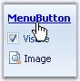{border="0"}

**[]{style="COLOR: #15428b"}** 

Figure 1349: ToolStripLabel as a Link at Run Time

[]{style="COLOR: #15428b"} 

Style Settings

[]{style="COLOR: #15428b"} 

::: {align="center"}
+-----------------------------------+---------------------------------------------------------------------------------------------------------------------------------------+
| Property                          | Description                                                                                                                           |
+-----------------------------------+---------------------------------------------------------------------------------------------------------------------------------------+
| DisplayStyle                      | Specifies how the image and text are rendered. The styles are,                                                                        |
|                                   |                                                                                                                                       |
|                                   |                                                                                                                                       |
|                                   |                                                                                                                                       |
|                                   | [·      ]{style="FONT-FAMILY: Symbol"}*Text* - Displays only text,                                                                    |
|                                   |                                                                                                                                       |
|                                   | [·      ]{style="FONT-FAMILY: Symbol"}*Image* - Displays only image,                                                                  |
|                                   |                                                                                                                                       |
|                                   | [·      ]{style="FONT-FAMILY: Symbol"}*ImageAndText* - Displays image and text.                                                       |
+-----------------------------------+---------------------------------------------------------------------------------------------------------------------------------------+
| Enabled                           | Specifies whether the item is enabled.                                                                                                |
+-----------------------------------+---------------------------------------------------------------------------------------------------------------------------------------+
| Visible                           | Specifies whether the item is visible.                                                                                                |
+-----------------------------------+---------------------------------------------------------------------------------------------------------------------------------------+
| Alignment                         | Sets the alignment of the item within the ToolStripEx. They can be set to beginning (Left) or end (Right) of the ToolStripEx control. |
+-----------------------------------+---------------------------------------------------------------------------------------------------------------------------------------+
| AutoSize                          | Specifies whether the item should size itself based on its image and text.                                                            |
+-----------------------------------+---------------------------------------------------------------------------------------------------------------------------------------+
:::

[]{style="COLOR: #15428b"} 

ToolTip Settings

[]{style="COLOR: #15428b"} 

The TooStripLabel can show tooltips during runtime, using the below properties.[]{#p1128}

[]{style="COLOR: #15428b"} 

::: {align="center"}
+-----------------------------------+------------------------------------------------------------------------------------------+
| Property                          | Description                                                                              |
+-----------------------------------+------------------------------------------------------------------------------------------+
| AutoToolTip                       | When set to true, will display the text set in the Text property as the item\'s tooltip. |
|                                   |                                                                                          |
|                                   |                                                                                          |
|                                   |                                                                                          |
|                                   | When set to false, will display the text set in the ToolTipText property.                |
+-----------------------------------+------------------------------------------------------------------------------------------+
| ToolTipText                       | Sets the text for the tooltip when AutoToolTip is set to false.                          |
+-----------------------------------+------------------------------------------------------------------------------------------+
:::

[]{style="COLOR: #15428b"} 

RTL Support[]{#p1129}

 

::: {align="center"}
  ---------------------------- ---------------------------------------------------------------------------------
  Property                     Description
  RightToLeft                  Indicates whether the item should draw right to left for RTL languages.
  RightToLeftAutoMirrorImage   Specifies whether image should mirror when RightToLeft is enabled for the item.
  ---------------------------- ---------------------------------------------------------------------------------
:::

 

 

 

 

[]{#_Split_Button}3.15.1.2.3.3.1.1.14        Split Button

[]{style="COLOR: #15428b"} 

ToolStripSplitButton can be added to a ToolStripEx directly or through a panel.

[]{style="COLOR: #15428b"} 

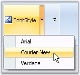{border="0"}

[]{style="COLOR: #15428b"} 

Figure 1350: ToolStripButtonsText = \"FontStyle\" with Drop-Down Items

**[]{style="COLOR: #15428b"}** 

Programmatically adding ToolStripSplitButton to ToolStripEx control,[]{#p1130}

**[]{style="COLOR: #15428b"}** 

+----------------------------------------------------------------------------------------------------------------------------------------------------------------------------------------------------------------------+
| **[\[C#\]]{style="FONT-FAMILY: 'Courier New'; COLOR: black"}**                                                                                                                                                       |
|                                                                                                                                                                                                                      |
| []{style="FONT-FAMILY: 'Courier New'; COLOR: black"}                                                                                                                                                                 |
|                                                                                                                                                                                                                      |
| [private]{style="FONT-FAMILY: 'Courier New'; COLOR: blue"}[ [ToolStripLabel]{style="COLOR: teal"} toolStripLabel1;]{style="FONT-FAMILY: 'Courier New'"}                                                              |
|                                                                                                                                                                                                                      |
| [this]{style="FONT-FAMILY: 'Courier New'; COLOR: blue"}[.toolStripLabel1 = [new]{style="COLOR: blue"} System.Windows.Forms.[ToolStripLabel]{style="COLOR: teal"}();]{style="FONT-FAMILY: 'Courier New'"}             |
|                                                                                                                                                                                                                      |
| [this]{style="FONT-FAMILY: 'Courier New'; COLOR: blue"}[.toolStripEx1.Items.AddRange([new]{style="COLOR: blue"} System.Windows.Forms.[ToolStripItem]{style="COLOR: teal"}\[\] {]{style="FONT-FAMILY: 'Courier New'"} |
|                                                                                                                                                                                                                      |
| [this]{style="FONT-FAMILY: 'Courier New'; COLOR: blue"}[.toolStripLabel1});]{style="FONT-FAMILY: 'Courier New'"}[]{style="FONT-FAMILY: 'Courier New'"}                                                               |
+----------------------------------------------------------------------------------------------------------------------------------------------------------------------------------------------------------------------+

[]{#p1131}[]{style="COLOR: #15428b"} 

+-----------------------------------------------------------------------------------------------------------------------------------------------------------------------------------------------------------------------------------------------------------------------------+
| **[\[VB.NET\]]{style="FONT-FAMILY: 'Courier New'; COLOR: black"}**                                                                                                                                                                                                          |
|                                                                                                                                                                                                                                                                             |
| []{style="COLOR: black"}                                                                                                                                                                                                                                                    |
|                                                                                                                                                                                                                                                                             |
| [Private]{style="FONT-FAMILY: 'Courier New'; COLOR: blue"}[ toolStripLabel1 [As]{style="COLOR: blue"} [ToolStripLabel]{style="COLOR: black"}]{style="FONT-FAMILY: 'Courier New'"}                                                                                           |
|                                                                                                                                                                                                                                                                             |
| [Me]{style="FONT-FAMILY: 'Courier New'; COLOR: blue"}[.toolStripLabel1 = [New]{style="COLOR: blue"} System.Windows.Forms.[ToolStripLabel]{style="COLOR: black"}() ]{style="FONT-FAMILY: 'Courier New'"}                                                                     |
|                                                                                                                                                                                                                                                                             |
| [Me]{style="FONT-FAMILY: 'Courier New'; COLOR: blue"}[.toolStripEx1.Items.AddRange([New]{style="COLOR: blue"} System.Windows.Forms.ToolStripItem() {[Me]{style="COLOR: blue"}.toolStripLabel1}) ]{style="FONT-FAMILY: 'Courier New'"}[]{style="FONT-FAMILY: 'Courier New'"} |
+-----------------------------------------------------------------------------------------------------------------------------------------------------------------------------------------------------------------------------------------------------------------------------+

[]{style="COLOR: #15428b"} 

The below properties controls the appearance and behavior of the ToolStripSplitButton.

[]{style="COLOR: #15428b"} 

Foreground Settings

[]{style="COLOR: #15428b"} 

::: {align="center"}
+-----------------------------------+----------------------------------------------------------------------------------------------------------------------------+
| Property                          | Description                                                                                                                |
+-----------------------------------+----------------------------------------------------------------------------------------------------------------------------+
| Text                              | Sets the Text for the ToolStripSplitButton. This text will be displayed, only if the DisplayStyle is Text or ImageAndText. |
+-----------------------------------+----------------------------------------------------------------------------------------------------------------------------+
| Font                              | Sets the font style for the display text.                                                                                  |
+-----------------------------------+----------------------------------------------------------------------------------------------------------------------------+
| ForeColor                         | Sets the fore color for the display text.                                                                                  |
+-----------------------------------+----------------------------------------------------------------------------------------------------------------------------+
| TextAlign                         | Specifies the alignment of the text in the item. The options are,                                                          |
|                                   |                                                                                                                            |
|                                   |                                                                                                                            |
|                                   |                                                                                                                            |
|                                   | [·      ]{style="FONT-FAMILY: Symbol"}TopLeft,                                                                             |
|                                   |                                                                                                                            |
|                                   | [·      ]{style="FONT-FAMILY: Symbol"}TopCenter,                                                                           |
|                                   |                                                                                                                            |
|                                   | [·      ]{style="FONT-FAMILY: Symbol"}TopRight,                                                                            |
|                                   |                                                                                                                            |
|                                   | [·      ]{style="FONT-FAMILY: Symbol"}MiddleLeft,                                                                          |
|                                   |                                                                                                                            |
|                                   | [·      ]{style="FONT-FAMILY: Symbol"}MiddleCenter,                                                                        |
|                                   |                                                                                                                            |
|                                   | [·      ]{style="FONT-FAMILY: Symbol"}MiddleRight,                                                                         |
|                                   |                                                                                                                            |
|                                   | [·      ]{style="FONT-FAMILY: Symbol"}BottomLeft,                                                                          |
|                                   |                                                                                                                            |
|                                   | [·      ]{style="FONT-FAMILY: Symbol"}BottomCenter and                                                                     |
|                                   |                                                                                                                            |
|                                   | [·      ]{style="FONT-FAMILY: Symbol"}BottomRight.                                                                         |
+-----------------------------------+----------------------------------------------------------------------------------------------------------------------------+
| TextDirection                     | Specifies the direction of drawing the text. The direction are,                                                            |
|                                   |                                                                                                                            |
|                                   |                                                                                                                            |
|                                   |                                                                                                                            |
|                                   | [·      ]{style="FONT-FAMILY: Symbol"}*Horizontal* - Text is placed horizontally,                                          |
|                                   |                                                                                                                            |
|                                   | [·      ]{style="FONT-FAMILY: Symbol"}*Vertical90* - Text is placed vertically and                                         |
|                                   |                                                                                                                            |
|                                   | [·      ]{style="FONT-FAMILY: Symbol"}*Vertical270* - Text is placed vertically at 270 degrees.                            |
+-----------------------------------+----------------------------------------------------------------------------------------------------------------------------+
| TextImageRelation                 | Specifies the relative location of the image to the text on the item. The options are,                                     |
|                                   |                                                                                                                            |
|                                   |                                                                                                                            |
|                                   |                                                                                                                            |
|                                   | [·      ]{style="FONT-FAMILY: Symbol"}*Overlay* - Image and text shares the same space in the control,                     |
|                                   |                                                                                                                            |
|                                   | [·      ]{style="FONT-FAMILY: Symbol"}*ImageAboveText* - Image will be placed above the text,                              |
|                                   |                                                                                                                            |
|                                   | [·      ]{style="FONT-FAMILY: Symbol"}*TextAboveImage* - Text will be placed above the image,                              |
|                                   |                                                                                                                            |
|                                   | [·      ]{style="FONT-FAMILY: Symbol"}*ImageBeforeText* - Image will be placed before the text and                         |
|                                   |                                                                                                                            |
|                                   | [·      ]{style="FONT-FAMILY: Symbol"}*TextBeforeImage* - Text will be placed before the image.                            |
+-----------------------------------+----------------------------------------------------------------------------------------------------------------------------+
:::

[]{style="COLOR: #15428b"} 

Image Settings

[]{style="COLOR: #15428b"} 

::: {align="center"}
+-----------------------------------+----------------------------------------------------------------------------+
| Property                          | Description                                                                |
+-----------------------------------+----------------------------------------------------------------------------+
| Image                             | Sets the image for the item.                                               |
+-----------------------------------+----------------------------------------------------------------------------+
| ImageAlign                        | Specifies the alignment of the image. The options are,                     |
|                                   |                                                                            |
|                                   |                                                                            |
|                                   |                                                                            |
|                                   | [·      ]{style="FONT-FAMILY: Symbol"}TopLeft,                             |
|                                   |                                                                            |
|                                   | [·      ]{style="FONT-FAMILY: Symbol"}TopCenter,                           |
|                                   |                                                                            |
|                                   | [·      ]{style="FONT-FAMILY: Symbol"}TopRight,                            |
|                                   |                                                                            |
|                                   | [·      ]{style="FONT-FAMILY: Symbol"}MiddleLeft,                          |
|                                   |                                                                            |
|                                   | [·      ]{style="FONT-FAMILY: Symbol"}MiddleCenter,                        |
|                                   |                                                                            |
|                                   | [·      ]{style="FONT-FAMILY: Symbol"}MiddleRight,                         |
|                                   |                                                                            |
|                                   | [·      ]{style="FONT-FAMILY: Symbol"}BottomLeft,                          |
|                                   |                                                                            |
|                                   | [·      ]{style="FONT-FAMILY: Symbol"}BottomCenter and                     |
|                                   |                                                                            |
|                                   | [·      ]{style="FONT-FAMILY: Symbol"}BottomRight.                         |
+-----------------------------------+----------------------------------------------------------------------------+
| ImageScaling                      | Specifies whether the image on the item will size to fit on the ToolStrip. |
+-----------------------------------+----------------------------------------------------------------------------+
| ImageTransparentColor             | Sets the transparent color on the image, that supports transparency.       |
+-----------------------------------+----------------------------------------------------------------------------+
:::

[]{style="COLOR: #15428b"} 

Style Settings

 

::: {align="center"}
+-----------------------------------+---------------------------------------------------------------------------------------------------------------------------------------+
| Property                          | Description                                                                                                                           |
+-----------------------------------+---------------------------------------------------------------------------------------------------------------------------------------+
| DisplayStyle                      | Specifies how the image and text are rendered. The styles are,                                                                        |
|                                   |                                                                                                                                       |
|                                   |                                                                                                                                       |
|                                   |                                                                                                                                       |
|                                   | [·      ]{style="FONT-FAMILY: Symbol"}*Text* - Displays only text,                                                                    |
|                                   |                                                                                                                                       |
|                                   | [·      ]{style="FONT-FAMILY: Symbol"}*Image* - Displays only image,                                                                  |
|                                   |                                                                                                                                       |
|                                   | [·      ]{style="FONT-FAMILY: Symbol"}*ImageAndText* - Displays image and text.                                                       |
+-----------------------------------+---------------------------------------------------------------------------------------------------------------------------------------+
| Enabled                           | Specifies whether the item is enabled.                                                                                                |
+-----------------------------------+---------------------------------------------------------------------------------------------------------------------------------------+
| Visible                           | Specifies whether the item is visible.                                                                                                |
+-----------------------------------+---------------------------------------------------------------------------------------------------------------------------------------+
| Alignment                         | Sets the alignment of the item within the ToolStripEx. They can be set to beginning (Left) or end (Right) of the ToolStripEx control. |
+-----------------------------------+---------------------------------------------------------------------------------------------------------------------------------------+
| AutoSize                          | Specifies whether the item should size itself based on its image and text.                                                            |
+-----------------------------------+---------------------------------------------------------------------------------------------------------------------------------------+
:::

[]{style="COLOR: #15428b"} 

ToolTip Settings

[]{style="COLOR: #15428b"} 

::: {align="center"}
+-----------------------------------+------------------------------------------------------------------------------------------+
| Property                          | Description                                                                              |
+-----------------------------------+------------------------------------------------------------------------------------------+
| AutoToolTip                       | When set to true, will display the text set in the Text property as the item\'s tooltip. |
|                                   |                                                                                          |
|                                   |                                                                                          |
|                                   |                                                                                          |
|                                   | When set to false, will display the text set in the ToolTipText property.                |
+-----------------------------------+------------------------------------------------------------------------------------------+
| ToolTipText                       | Sets the text for the tooltip when AutoToolTip is set to false.                          |
+-----------------------------------+------------------------------------------------------------------------------------------+
:::

[]{style="COLOR: #15428b"} 

RTL Support[]{#p1132}

**[]{style="COLOR: #15428b"}** 

::: {align="center"}
  ---------------------------- ---------------------------------------------------------------------------------
  Property                     Description
  RightToLeft                  Indicates whether the item should draw right to left for RTL languages.
  RightToLeftAutoMirrorImage   Specifies whether image should mirror when RightToLeft is enabled for the item.
  ---------------------------- ---------------------------------------------------------------------------------
:::

**[]{style="COLOR: #15428b"}** 

DropDown settings[]{#p1133}

**[]{style="COLOR: #15428b"}** 

::: {align="center"}
  --------------------- ---------------------------------------------------------------------------------------------------------------
  Property              Description
  DropDown              Specifies the ToolStripDropDown to be shown when the item is clicked.
  DropDownItems         Invokes the Items Collection Editor and lets you add ToolStripItems to be displayed when the item is clicked.
  DropDownButtonWidth   Specifies the width for the drop down.
  --------------------- ---------------------------------------------------------------------------------------------------------------
:::

 

 

 

 

[]{#_DropDownButton}3.15.1.2.3.3.1.1.15        DropDownButton

[]{style="COLOR: #15428b"} 

ToolStripDropDownButton can be added to a ToolStripEx directly or through a panel.

[]{style="COLOR: #15428b"} 

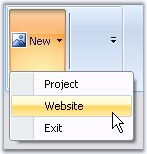{border="0"}

**[]{style="COLOR: #15428b"}** 

Figure 1351: ToolStripDropDownButton Text = \"New\" with Drop-Down Items

**[]{style="COLOR: #15428b"}** 

The below properties controls the appearance and behavior of the ToolStripDropDownButton.

 

**Foreground Settings**

[]{style="COLOR: #15428b"} 

::: {align="center"}
 
:::
:::::::::::::::::::::::::::::::::::::::::::::::::::::::

Property

Description

 

Text

Sets the Text for the ToolStripDropDownButton. This text will be displayed, only if the DisplayStyle is Text or ImageAndText.

 

Font

Sets the font style for the display text.

 

ForeColor

Sets the fore color for the display text.

 

TextAlign

Specifies the alignment of the text in the item. The options are,

 

[·      ]{style="FONT-FAMILY: Symbol"}TopLeft,

[·      ]{style="FONT-FAMILY: Symbol"}TopCenter,

[·      ]{style="FONT-FAMILY: Symbol"}TopRight,

[·      ]{style="FONT-FAMILY: Symbol"}MiddleLeft,

[·      ]{style="FONT-FAMILY: Symbol"}MiddleCenter,

[·      ]{style="FONT-FAMILY: Symbol"}MiddleRight,

[·      ]{style="FONT-FAMILY: Symbol"}BottomLeft,

[·      ]{style="FONT-FAMILY: Symbol"}BottomCenter and

[·      ]{style="FONT-FAMILY: Symbol"}BottomRight.

 

TextDirection

Specifies the direction of drawing the text. The direction are,

 

[·      ]{style="FONT-FAMILY: Symbol"}*Horizontal* - Text is placed horizontally,

[·      ]{style="FONT-FAMILY: Symbol"}*Vertical90* - Text is placed vertically and

[·      ]{style="FONT-FAMILY: Symbol"}*Vertical270* - Text is placed vertically at 270 degrees.

TextImageRelation

Specifies the relative location of the image to the text on the item. The options are,

 

[·      ]{style="FONT-FAMILY: Symbol"}*Overlay* - Image and text shares the same space in the control,

[·      ]{style="FONT-FAMILY: Symbol"}*ImageAboveText* - Image will be placed above the text,

[·      ]{style="FONT-FAMILY: Symbol"}*TextAboveImage* - Text will be placed above the image,

[·      ]{style="FONT-FAMILY: Symbol"}*ImageBeforeText* - Image will be placed before the text and

[·      ]{style="FONT-FAMILY: Symbol"}*TextBeforeImage* - Text will be placed before the image.

[]{style="COLOR: #15428b"} 

Image Settings

 

::: {align="center"}
+-----------------------------------+----------------------------------------------------------------------------+
| Property                          | Description                                                                |
+-----------------------------------+----------------------------------------------------------------------------+
| Image                             | Sets the image for the item.                                               |
+-----------------------------------+----------------------------------------------------------------------------+
| ImageAlign                        | Specifies the alignment of the image. The options are,                     |
|                                   |                                                                            |
|                                   |                                                                            |
|                                   |                                                                            |
|                                   | [·      ]{style="FONT-FAMILY: Symbol"}TopLeft,                             |
|                                   |                                                                            |
|                                   | [·      ]{style="FONT-FAMILY: Symbol"}TopCenter,                           |
|                                   |                                                                            |
|                                   | [·      ]{style="FONT-FAMILY: Symbol"}TopRight,                            |
|                                   |                                                                            |
|                                   | [·      ]{style="FONT-FAMILY: Symbol"}MiddleLeft,                          |
|                                   |                                                                            |
|                                   | [·      ]{style="FONT-FAMILY: Symbol"}MiddleCenter,                        |
|                                   |                                                                            |
|                                   | [·      ]{style="FONT-FAMILY: Symbol"}MiddleRight,                         |
|                                   |                                                                            |
|                                   | [·      ]{style="FONT-FAMILY: Symbol"}BottomLeft,                          |
|                                   |                                                                            |
|                                   | [·      ]{style="FONT-FAMILY: Symbol"}BottomCenter and                     |
|                                   |                                                                            |
|                                   | [·      ]{style="FONT-FAMILY: Symbol"}BottomRight.                         |
+-----------------------------------+----------------------------------------------------------------------------+
| ImageScaling                      | Specifies whether the image on the item will size to fit on the ToolStrip. |
+-----------------------------------+----------------------------------------------------------------------------+
| ImageTransparentColor             | Sets the transparent color on the image, that supports transparency.       |
+-----------------------------------+----------------------------------------------------------------------------+
:::

[]{style="COLOR: #15428b"} 

Style Settings

[]{style="COLOR: #15428b"} 

::: {align="center"}
+-----------------------------------+-------------------------------------------------------------------------------------------------------------------------------------+
| Property                          | Description                                                                                                                         |
+-----------------------------------+-------------------------------------------------------------------------------------------------------------------------------------+
| DisplayStyle                      | Specifies how the image and text are rendered. The styles are,                                                                      |
|                                   |                                                                                                                                     |
|                                   |                                                                                                                                     |
|                                   |                                                                                                                                     |
|                                   | [·      ]{style="FONT-FAMILY: Symbol"}*Text* - Displays only text,                                                                  |
|                                   |                                                                                                                                     |
|                                   | [·      ]{style="FONT-FAMILY: Symbol"}*Image* - Displays only image,                                                                |
|                                   |                                                                                                                                     |
|                                   | [·      ]{style="FONT-FAMILY: Symbol"}*ImageAndText* - Displays image and text.                                                     |
+-----------------------------------+-------------------------------------------------------------------------------------------------------------------------------------+
| Enabled                           | Specifies whether the item is enabled.                                                                                              |
+-----------------------------------+-------------------------------------------------------------------------------------------------------------------------------------+
| Visible                           | Specifies whether the item is visible.                                                                                              |
+-----------------------------------+-------------------------------------------------------------------------------------------------------------------------------------+
| Alignment                         | Sets the alignment of the item within the ToolStrip. They can be set to beginning (Left) or end (Right) of the ToolStripEx control. |
+-----------------------------------+-------------------------------------------------------------------------------------------------------------------------------------+
| AutoSize                          | Specifies whether the item should size itself based on its image and text.                                                          |
+-----------------------------------+-------------------------------------------------------------------------------------------------------------------------------------+
:::

[]{style="COLOR: #15428b"} 

ToolTip Settings

[]{style="COLOR: #15428b"} 

::: {align="center"}
+-----------------------------------+------------------------------------------------------------------------------------------+
| Property                          | Description                                                                              |
+-----------------------------------+------------------------------------------------------------------------------------------+
| AutoToolTip                       | When set to true, will display the text set in the Text property as the item\'s tooltip. |
|                                   |                                                                                          |
|                                   |                                                                                          |
|                                   |                                                                                          |
|                                   | When set to false, will display the text set in the ToolTipText property.                |
+-----------------------------------+------------------------------------------------------------------------------------------+
| ToolTipText                       | Sets the text for the tooltip when AutoToolTip is set to false.                          |
+-----------------------------------+------------------------------------------------------------------------------------------+
:::

[]{style="COLOR: #15428b"} 

RTL Support

**[]{style="COLOR: #15428b"}** 

::: {align="center"}
  ---------------------------- ---------------------------------------------------------------------------------
  Property                     Description
  RightToLeft                  Indicates whether the item should draw right to left for RTL languages.
  RightToLeftAutoMirrorImage   Specifies whether image should mirror when RightToLeft is enabled for the item.
  ---------------------------- ---------------------------------------------------------------------------------
:::

**[]{style="COLOR: #15428b"}** 

DropDown settings

**[]{style="COLOR: #15428b"}** 

::: {align="center"}
  ------------------- ---------------------------------------------------------------------------------------------------------------
  Property            Description
  DropDown            Specifies the ToolStripDropDown to be shown when the item is clicked.
  DropDownItems       Invokes the Items Collection Editor and lets you add ToolStripItems to be displayed when the item is clicked.
  ShowDropDownArrow   Specifies whether or not to show the drop down arrow on the ToolStripDropDown button.
  ------------------- ---------------------------------------------------------------------------------------------------------------
:::

 

 

[]{#_ComboBox}3.15.1.2.3.3.1.1.16        ComboBox

[]{style="COLOR: #15428b"} 

ToolStripComboBox can be added to a ToolStripEx directly or through a panel.

[]{style="COLOR: #15428b"} 

[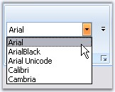{border="0"}]{style="COLOR: #15428b"}[]{style="COLOR: #15428b"}

[]{style="COLOR: #15428b"} 

Figure 1352: ComboBox with Drop-Down Items

**[]{style="COLOR: #15428b"}** 

The below properties controls the appearance and behavior of the ToolStripComboBox.

[]{style="COLOR: #15428b"} 

Foreground Settings

[]{style="COLOR: #15428b"} 

::: {align="center"}
  ----------- ---------------------------------------------
  Property    Description
  BackColor   Sets the back color for the combo box item.
  Font        Sets the font style for the display text.
  ForeColor   Sets the fore color for the display text.
  Text        Sets the text for the ComboBox item.
  ----------- ---------------------------------------------
:::

[]{style="COLOR: #15428b"} 

Style Settings

[]{style="COLOR: #15428b"} 

::: {align="center"}
+-----------------------------------+-------------------------------------------------------------------------------------------------------------------------------------+
| Property                          | Description                                                                                                                         |
+-----------------------------------+-------------------------------------------------------------------------------------------------------------------------------------+
| Enabled                           | Specifies whether the item is enabled.                                                                                              |
+-----------------------------------+-------------------------------------------------------------------------------------------------------------------------------------+
| Visible                           | Specifies whether the item is visible.                                                                                              |
+-----------------------------------+-------------------------------------------------------------------------------------------------------------------------------------+
| Alignment                         | Sets the alignment of the item within the ToolStrip. They can be set to beginning (Left) or end (Right) of the ToolStripEx control. |
+-----------------------------------+-------------------------------------------------------------------------------------------------------------------------------------+
| AutoSize                          | Specifies whether the item should size itself based on its image and text.                                                          |
+-----------------------------------+-------------------------------------------------------------------------------------------------------------------------------------+
| DropDownStyle                     | Specifies the dropdown style. The styles are,                                                                                       |
|                                   |                                                                                                                                     |
|                                   |                                                                                                                                     |
|                                   |                                                                                                                                     |
|                                   | [·      ]{style="FONT-FAMILY: Symbol"}Simple,                                                                                       |
|                                   |                                                                                                                                     |
|                                   | [·      ]{style="FONT-FAMILY: Symbol"}DropDown and                                                                                  |
|                                   |                                                                                                                                     |
|                                   | [·      ]{style="FONT-FAMILY: Symbol"}DropDownList.                                                                                 |
+-----------------------------------+-------------------------------------------------------------------------------------------------------------------------------------+
| FlatStyle                         | Sets the display style of the combobox. The styles are,                                                                             |
|                                   |                                                                                                                                     |
|                                   |                                                                                                                                     |
|                                   |                                                                                                                                     |
|                                   | [·      ]{style="FONT-FAMILY: Symbol"}Flat,                                                                                         |
|                                   |                                                                                                                                     |
|                                   | [·      ]{style="FONT-FAMILY: Symbol"}Popup,                                                                                        |
|                                   |                                                                                                                                     |
|                                   | [·      ]{style="FONT-FAMILY: Symbol"}Standard and                                                                                  |
|                                   |                                                                                                                                     |
|                                   | [·      ]{style="FONT-FAMILY: Symbol"}System.                                                                                       |
+-----------------------------------+-------------------------------------------------------------------------------------------------------------------------------------+
:::

[]{style="COLOR: #15428b"} 

ToolTip Settings[]{#p1134}

[]{style="COLOR: #15428b"} 

::: {align="center"}
+-----------------------------------+------------------------------------------------------------------------------------------+
| Property                          | Description                                                                              |
+-----------------------------------+------------------------------------------------------------------------------------------+
| AutoToolTip                       | When set to true, will display the text set in the Text property as the item\'s tooltip. |
|                                   |                                                                                          |
|                                   |                                                                                          |
|                                   |                                                                                          |
|                                   | When set to false, will display the text set in the ToolTipText property.                |
+-----------------------------------+------------------------------------------------------------------------------------------+
| ToolTipText                       | Sets the text for the tooltip when AutoToolTip is set to false.                          |
+-----------------------------------+------------------------------------------------------------------------------------------+
:::

[]{style="COLOR: #15428b"} 

RTL Support

**[]{style="COLOR: #15428b"}** 

::: {align="center"}
  ------------- -------------------------------------------------------------------------
  Property      Description
  RightToLeft   Indicates whether the item should draw right to left for RTL languages.
  ------------- -------------------------------------------------------------------------
:::

**[]{style="COLOR: #15428b"}** 

DropDown settings

**[]{style="COLOR: #15428b"}** 

::: {align="center"}
+-----------------------------------+-----------------------------------------------------------------------------------------------------------------------------------------------------------------------------------------------+
| Property                          | Description                                                                                                                                                                                   |
+-----------------------------------+-----------------------------------------------------------------------------------------------------------------------------------------------------------------------------------------------+
| Items                             | Invokes String Collection Editor which lets you add strings list to be displayed in the combobox.                                                                                             |
+-----------------------------------+-----------------------------------------------------------------------------------------------------------------------------------------------------------------------------------------------+
| MaxDropDownItems                  | Sets the maximum number of strings that should be displayed in the dropdown.                                                                                                                  |
+-----------------------------------+-----------------------------------------------------------------------------------------------------------------------------------------------------------------------------------------------+
| MaxLength                         | Specifies the maximum characters that can be entered into the combobox.                                                                                                                       |
+-----------------------------------+-----------------------------------------------------------------------------------------------------------------------------------------------------------------------------------------------+
| DropDownHeight                    | Sets the height for the DropDown.                                                                                                                                                             |
+-----------------------------------+-----------------------------------------------------------------------------------------------------------------------------------------------------------------------------------------------+
| DropDownWidth                     | Sets the width for the DropDown.                                                                                                                                                              |
+-----------------------------------+-----------------------------------------------------------------------------------------------------------------------------------------------------------------------------------------------+
| IntegralHeight                    | Indicate whether the combobox should resize to avoid showing partial items.                                                                                                                   |
+-----------------------------------+-----------------------------------------------------------------------------------------------------------------------------------------------------------------------------------------------+
| Sorted                            | Specifies whether the dropdown list should be sorted.                                                                                                                                         |
+-----------------------------------+-----------------------------------------------------------------------------------------------------------------------------------------------------------------------------------------------+
| AutoCompleteCustomSource          | Represents the custom source of string collection for the autocomplete feature, when AutoCompleteSource property is set to CustomSource.                                                      |
+-----------------------------------+-----------------------------------------------------------------------------------------------------------------------------------------------------------------------------------------------+
| AutoCompleteSource                | Represents the source of strings used for autocompletion. The sources can be,                                                                                                                 |
|                                   |                                                                                                                                                                                               |
|                                   |                                                                                                                                                                                               |
|                                   |                                                                                                                                                                                               |
|                                   | [·      ]{style="FONT-FAMILY: Symbol"}FileSystem,                                                                                                                                             |
|                                   |                                                                                                                                                                                               |
|                                   | [·      ]{style="FONT-FAMILY: Symbol"}AllSystemSources, (Default)                                                                                                                             |
|                                   |                                                                                                                                                                                               |
|                                   | [·      ]{style="FONT-FAMILY: Symbol"}AllUrl,                                                                                                                                                 |
|                                   |                                                                                                                                                                                               |
|                                   | [·      ]{style="FONT-FAMILY: Symbol"}CustomSource,                                                                                                                                           |
|                                   |                                                                                                                                                                                               |
|                                   | [·      ]{style="FONT-FAMILY: Symbol"}FileSystemDirectories,                                                                                                                                  |
|                                   |                                                                                                                                                                                               |
|                                   | [·      ]{style="FONT-FAMILY: Symbol"}HistoryList,                                                                                                                                            |
|                                   |                                                                                                                                                                                               |
|                                   | [·      ]{style="FONT-FAMILY: Symbol"}ListItems,                                                                                                                                              |
|                                   |                                                                                                                                                                                               |
|                                   | [·      ]{style="FONT-FAMILY: Symbol"}RecentlyUsedList and                                                                                                                                    |
|                                   |                                                                                                                                                                                               |
|                                   | [·      ]{style="FONT-FAMILY: Symbol"}None.                                                                                                                                                   |
+-----------------------------------+-----------------------------------------------------------------------------------------------------------------------------------------------------------------------------------------------+
| AutoCompleteMode                  | Indicates text completion behavior of the combo box. The modes are,                                                                                                                           |
|                                   |                                                                                                                                                                                               |
|                                   |                                                                                                                                                                                               |
|                                   |                                                                                                                                                                                               |
|                                   | [·      ]{style="FONT-FAMILY: Symbol"}*Suggest* - Displays the drop down list associated with the EditControl. This dropdown list is populated with one or more suggested completion strings, |
|                                   |                                                                                                                                                                                               |
|                                   | [·      ]{style="FONT-FAMILY: Symbol"}*Append* - Appends the reminder of the most likely candidate string to the existing character, highlighting the appended character, and                 |
|                                   |                                                                                                                                                                                               |
|                                   | [·      ]{style="FONT-FAMILY: Symbol"}*SuggestAppend* - Displays the drop down, also appends the highlighted string.                                                                          |
+-----------------------------------+-----------------------------------------------------------------------------------------------------------------------------------------------------------------------------------------------+
| ShortCut on Form1                 | Specifies the Keyboard shortcut to be used at run time to access this combobox.                                                                                                               |
+-----------------------------------+-----------------------------------------------------------------------------------------------------------------------------------------------------------------------------------------------+
:::

[]{style="COLOR: #15428b"} 

::: {style="BORDER-BOTTOM: windowtext 1pt solid; BORDER-LEFT: medium none; PADDING-BOTTOM: 1pt; MARGIN: 9pt 0pt 9pt 18pt; PADDING-LEFT: 0pt; PADDING-RIGHT: 0pt; BORDER-TOP: windowtext 1pt solid; BORDER-RIGHT: medium none; PADDING-TOP: 1pt"}
{border="0"} Note:[ ]{style="COLOR: black; FONT-SIZE: 8pt"}We can set banner text for the ComboBox control. Refer [BannerTextProvider Component]{.UGHyperlink} topic for more details.
:::

[]{style="COLOR: #15428b"} 

See Also

[]{style="COLOR: #15428b"} 

[[ComboBox]{.UGHyperlink}](../../../../../../../../Documents%20and%20Settings/sylviap/Desktop/Tools%20-%20Part%202.docx#_ToolStripItem_-_ComboBox)[]{.UGHyperlink}

 

 

3.15.1.2.3.3.1.1.17        TextBox

[]{style="COLOR: #15428b"} 

ToolStripTextBox item can be added to a ToolStripEx directly or through a panel.

[]{style="COLOR: #15428b"} 

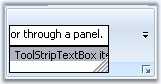{border="0"}

**[]{style="COLOR: #15428b"}** 

Figure 1353: ToolStripTextBox with AutoComplete Enabled

**[]{style="COLOR: #15428b"}** 

The below properties controls the appearance and behavior of the ToolStripTextBox Item.

[]{style="COLOR: #15428b"} 

Foreground Settings

[]{style="COLOR: #15428b"} 

::: {align="center"}
+-----------------------------------+--------------------------------------------------------------------------------------+
| Property                          | Description                                                                          |
+-----------------------------------+--------------------------------------------------------------------------------------+
| BackColor                         | Sets the back color for the textbox.                                                 |
+-----------------------------------+--------------------------------------------------------------------------------------+
| BorderStyle                       | Specifies the border style for the textbox. The options are as follows,              |
|                                   |                                                                                      |
|                                   |                                                                                      |
|                                   |                                                                                      |
|                                   | [·      ]{style="FONT-FAMILY: Symbol"}FixedSingle,                                   |
|                                   |                                                                                      |
|                                   | [·      ]{style="FONT-FAMILY: Symbol"}Fixed3D and                                    |
|                                   |                                                                                      |
|                                   | [·      ]{style="FONT-FAMILY: Symbol"}None.                                          |
+-----------------------------------+--------------------------------------------------------------------------------------+
| Text                              | Sets the Text for the ToolStripTextBox.                                              |
+-----------------------------------+--------------------------------------------------------------------------------------+
| Lines                             | Lets you open a String Collection Editor, using which multiline text can be entered. |
+-----------------------------------+--------------------------------------------------------------------------------------+
| Font                              | Sets the font style for the display text.                                            |
+-----------------------------------+--------------------------------------------------------------------------------------+
| ForeColor                         | Sets the fore color for the display text.                                            |
+-----------------------------------+--------------------------------------------------------------------------------------+
| TextBoxTextAlign                  | Specifies the alignment of the text in the item. The options are,                    |
|                                   |                                                                                      |
|                                   |                                                                                      |
|                                   |                                                                                      |
|                                   | [·      ]{style="FONT-FAMILY: Symbol"}Left,                                          |
|                                   |                                                                                      |
|                                   | [·      ]{style="FONT-FAMILY: Symbol"}Right and                                      |
|                                   |                                                                                      |
|                                   | [·      ]{style="FONT-FAMILY: Symbol"}Center.                                        |
+-----------------------------------+--------------------------------------------------------------------------------------+
:::

[]{style="COLOR: #15428b"} 

Style Settings[]{#p1135}

[]{style="COLOR: #15428b"} 

::: {align="center"}
  ----------- -------------------------------------------------------------------------------------------------------------------------------------
  Property    Description
  Enabled     Specifies whether the item is enabled.
  Visible     Specifies whether the item is visible.
  Alignment   Sets the alignment of the item within the ToolStrip. They can be set to beginning (Left) or end (Right) of the ToolStripEx control.
  AutoSize    Specifies whether the item should size itself based on its image and text.
  ----------- -------------------------------------------------------------------------------------------------------------------------------------
:::

[]{style="COLOR: #15428b"} 

ToolTip Settings

[]{#p1136}[]{style="COLOR: #15428b"} 

::: {align="center"}
+-----------------------------------+------------------------------------------------------------------------------------------+
| Property                          | Description                                                                              |
+-----------------------------------+------------------------------------------------------------------------------------------+
| AutoToolTip                       | When set to true, will display the text set in the Text property as the item\'s tooltip. |
|                                   |                                                                                          |
|                                   |                                                                                          |
|                                   |                                                                                          |
|                                   | When set to false, will display the text set in the ToolTipText property.                |
+-----------------------------------+------------------------------------------------------------------------------------------+
| ToolTipText                       | Sets the text for the tooltip when AutoToolTip is set to false.                          |
+-----------------------------------+------------------------------------------------------------------------------------------+
:::

[]{style="COLOR: #15428b"} 

RTL Support

**[]{style="COLOR: #15428b"}** 

::: {align="center"}
  ------------- --------------------------------------------------------------------
  Property      Description
  RightToLeft   Indicates whether the item should right to left for RTL languages.
  ------------- --------------------------------------------------------------------
:::

**[]{style="COLOR: #15428b"}** 

Behavior Settings

 

::: {align="center"}
  ------------------- ---------------------------------------------------------------------------------
  Property            Description
  AcceptsReturn       Indicates if return characters are accepted as input.
  AcceptsTab          Indicates if tab characters are accepted as input.
  CharacterCasing     Indicates if the characters should be Normal or in Upper Case or in Lower Case.
  HideSelection       Indicates whether the selection should be hidden when the control loses focus.
  MaxLength           Maximum number of characters that can be entered into the control.
  ReadOnly            Indicates whether the text in the textbox is read-only.
  ShortCutsEnabled    Specifies whether the keyboard shortcut can be specified for this textbox item.
  ShortCut on Form1   Specifies the Keyboard shortcut to be used at run time to access this combobox.
  ------------------- ---------------------------------------------------------------------------------
:::

**[]{style="COLOR: #15428b"}** 

AutoComplete Settings

**[]{style="COLOR: #15428b"}** 

::: {align="center"}
Property
:::

Description

AutoCompleteCustomSource

Represents the custom source of string collection for the autocomplete feature, when AutoCompleteSource property is set to CustomSource.

AutoCompleteSource

Represents the source of strings used for autocompletion. The sources can be,

 

[·      ]{style="FONT-FAMILY: Symbol"}FileSystem,

[·      ]{style="FONT-FAMILY: Symbol"}AllSystemSources, (Default)

[·      ]{style="FONT-FAMILY: Symbol"}AllUrl,

[·      ]{style="FONT-FAMILY: Symbol"}CustomSource,

[·      ]{style="FONT-FAMILY: Symbol"}FileSystemDirectories,

[·      ]{style="FONT-FAMILY: Symbol"}HistoryList,

[·      ]{style="FONT-FAMILY: Symbol"}ListItems,

[·      ]{style="FONT-FAMILY: Symbol"}RecentlyUsedList,

[·      ]{style="FONT-FAMILY: Symbol"}None.

 

AutoCompleteMode

Indicates text completion behavior of the combo box. The modes are,

 

*Suggest* - Displays the drop down list associated with the EditControl. This dropdown list is populated with one or more suggested completion strings,

*Append* - Appends the reminder of the most likely candidate string to the existing character, highlighting the appended character, and

*SuggestAppend* - Displays the drop down, also appends the highlighted string.

[]{style="COLOR: #15428b"} 

::: {style="BORDER-BOTTOM: windowtext 1pt solid; BORDER-LEFT: medium none; PADDING-BOTTOM: 1pt; MARGIN: 9pt 0pt 9pt 18pt; PADDING-LEFT: 0pt; PADDING-RIGHT: 0pt; BORDER-TOP: windowtext 1pt solid; BORDER-RIGHT: medium none; PADDING-TOP: 1pt"}
 

{border="0"} Note: We can set banner text for the TextBox control. Refer [[[BannerTextProvider Component]{style="COLOR: windowtext; FONT-SIZE: 9pt; TEXT-DECORATION: none; text-underline: none"}]{.UGHyperlink}](../../../../../../../../Documents%20and%20Settings/sylviap/Desktop/Tools%20-%20Part%202.docx#_BannerTextProvider_Component) topic for more details.
:::

 

 

[]{#_ProgressBar}3.15.1.2.3.3.1.1.18        ProgressBar

[]{style="COLOR: #15428b"} 

ToolStripProgressBar item can be added to a ToolStripEx directly or through a panel.

[]{style="COLOR: #15428b"} 

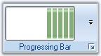{border="0"}

[]{style="COLOR: #15428b"} 

Figure 1354: ProgressBar added to ToolStripEx

**[]{style="COLOR: #15428b"}** 

The below properties controls the appearance and behavior of the ToolStripProgressBar Item.

[]{style="COLOR: #15428b"} 

Foreground Settings

[]{style="COLOR: #15428b"} 

::: {align="center"}
  ----------- -------------------------------------------
  Property    Description
  Font        Sets the font style for the display text.
  ForeColor   Sets the fore color for the display text.
  ----------- -------------------------------------------
:::

[]{style="COLOR: #15428b"} 

Style Settings[]{#p1137}

[]{style="COLOR: #15428b"} 

::: {align="center"}
+-----------------------------------+-------------------------------------------------------------------------------------------------------------------------------------------------------+
| Property                          | Description                                                                                                                                           |
+-----------------------------------+-------------------------------------------------------------------------------------------------------------------------------------------------------+
| Style                             | Specifies the style for ProgressBar. The style are,                                                                                                   |
|                                   |                                                                                                                                                       |
|                                   |                                                                                                                                                       |
|                                   |                                                                                                                                                       |
|                                   | [·      ]{style="FONT-FAMILY: Symbol"}Blocks - Indicates the progress, by increasing the number of segmented blocks in a ProgressBar,                 |
|                                   |                                                                                                                                                       |
|                                   | [·      ]{style="FONT-FAMILY: Symbol"}Continuous - Indicates the progress, by increasing the size of a smooth continuous bar,                         |
|                                   |                                                                                                                                                       |
|                                   | [·      ]{style="FONT-FAMILY: Symbol"}Marquee - Indicates the progress, by continuously scrolling a block across the ProgressBar in a Marque fashion. |
+-----------------------------------+-------------------------------------------------------------------------------------------------------------------------------------------------------+
| Enabled                           | Specifies whether the item is enabled.                                                                                                                |
+-----------------------------------+-------------------------------------------------------------------------------------------------------------------------------------------------------+
| Visible                           | Specifies whether the item is visible.                                                                                                                |
+-----------------------------------+-------------------------------------------------------------------------------------------------------------------------------------------------------+
| Alignment                         | Sets the alignment of the item within the ToolStripEx. They can be set to beginning (Left) or end (Right) of the ToolStripEx control.                 |
+-----------------------------------+-------------------------------------------------------------------------------------------------------------------------------------------------------+
| AutoSize                          | Specifies whether the item should size itself based on its image and text.                                                                            |
+-----------------------------------+-------------------------------------------------------------------------------------------------------------------------------------------------------+
| MarqueeAnimationSpeed             | Specifies the speed of the marquee animation in milliseconds. The default value is 100 Milliseconds.                                                  |
+-----------------------------------+-------------------------------------------------------------------------------------------------------------------------------------------------------+
| Maximum                           | UpperBound Range of the ProgressBar. Default value is 100.                                                                                            |
+-----------------------------------+-------------------------------------------------------------------------------------------------------------------------------------------------------+
| Minimum                           | LowerBound Range of the ProgressBar. Default value is 0.                                                                                              |
+-----------------------------------+-------------------------------------------------------------------------------------------------------------------------------------------------------+
| Step                              | The amount to increment the current value of the control when PerformStep() method is called. Default value is 10.                                    |
+-----------------------------------+-------------------------------------------------------------------------------------------------------------------------------------------------------+
| Value                             | The current value for the ProgressBar, in the range specified by the minimum and maximum properties. Default value is 0.                              |
+-----------------------------------+-------------------------------------------------------------------------------------------------------------------------------------------------------+
:::

[]{style="COLOR: #15428b"} 

::: {align="center"}
  --------------- ----------------------------------------------------------------------------------------------------------------
  Method          Description
  PerformStep()   Advances the current position of the progressbar by the value specified in ToolStripProgressBar.Step property.
  --------------- ----------------------------------------------------------------------------------------------------------------
:::

[]{style="COLOR: #15428b"} 

ToolTip Settings

[]{style="COLOR: #15428b"} 

::: {align="center"}
+-----------------------------------+------------------------------------------------------------------------------------------+
| Property                          | Description                                                                              |
+-----------------------------------+------------------------------------------------------------------------------------------+
| AutoToolTip                       | When set to true, will display the text set in the Text property as the item\'s tooltip. |
|                                   |                                                                                          |
|                                   |                                                                                          |
|                                   |                                                                                          |
|                                   | When set to false, will display the text set in the ToolTipText property.                |
+-----------------------------------+------------------------------------------------------------------------------------------+
| ToolTipText                       | Sets the text for the tooltip when AutoToolTip is set to false.                          |
+-----------------------------------+------------------------------------------------------------------------------------------+
:::

[]{style="COLOR: #15428b"} 

RTL Support

**[]{style="COLOR: #15428b"}** 

::: {align="center"}
  ------------------- -------------------------------------------------------------------------
  Property            Description
  RightToLeft         Indicates whether the item should draw right to left for RTL languages.
  RightToLeftLayout   Indicates whether the control layout is right to left.
  ------------------- -------------------------------------------------------------------------
:::

 

3.15.1.2.3.3.1.1.19        CheckBox

[]{style="COLOR: #15428b"} 

ToolStripCheckBox can be added to a ToolStripEx directly or through a panel.

[]{style="COLOR: #15428b"} 

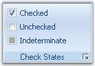{border="0"}

[]{style="COLOR: #15428b"} 

Figure 1355: ToolStripCheckBox illustrating the CheckStates

**[]{style="COLOR: #15428b"}** 

The below properties controls the appearance and behavior of the ToolStripCheckBox item.

[]{style="COLOR: #15428b"} 

Foreground Settings

[]{style="COLOR: #15428b"} 

::: {align="center"}
+-----------------------------------+-------------------------------------------------------------------+
| Property                          | Description                                                       |
+-----------------------------------+-------------------------------------------------------------------+
| Font                              | Sets the font style for the display text.                         |
+-----------------------------------+-------------------------------------------------------------------+
| Text                              | Sets the Text for the ToolStrip item.                             |
+-----------------------------------+-------------------------------------------------------------------+
| TextAlign                         | Specifies the alignment of the text in the item. The options are, |
|                                   |                                                                   |
|                                   |                                                                   |
|                                   |                                                                   |
|                                   | [·      ]{style="FONT-FAMILY: Symbol"}TopLeft,                    |
|                                   |                                                                   |
|                                   | [·      ]{style="FONT-FAMILY: Symbol"}TopCenter,                  |
|                                   |                                                                   |
|                                   | [·      ]{style="FONT-FAMILY: Symbol"}TopRight,                   |
|                                   |                                                                   |
|                                   | [·      ]{style="FONT-FAMILY: Symbol"}MiddleLeft,                 |
|                                   |                                                                   |
|                                   | [·      ]{style="FONT-FAMILY: Symbol"}MiddleCenter,               |
|                                   |                                                                   |
|                                   | [·      ]{style="FONT-FAMILY: Symbol"}MiddleRight,                |
|                                   |                                                                   |
|                                   | [·      ]{style="FONT-FAMILY: Symbol"}BottomLeft,                 |
|                                   |                                                                   |
|                                   | [·      ]{style="FONT-FAMILY: Symbol"}BottomCenter and            |
|                                   |                                                                   |
|                                   | [·      ]{style="FONT-FAMILY: Symbol"}BottomRight.                |
+-----------------------------------+-------------------------------------------------------------------+
:::

[]{style="COLOR: #15428b"} 

Style Settings

[]{style="COLOR: #15428b"} 

::: {align="center"}
+-----------------------------------+---------------------------------------------------------------------------------------------------------------------------------------+
| Property                          | Description                                                                                                                           |
+-----------------------------------+---------------------------------------------------------------------------------------------------------------------------------------+
| Checked                           | Indicates whether button is checked when the application loads.                                                                       |
+-----------------------------------+---------------------------------------------------------------------------------------------------------------------------------------+
| CheckAlign                        | Gets or sets the horizontal and vertical alignment of the check mark on a ToolStripCheckBox item. The options are,                    |
|                                   |                                                                                                                                       |
|                                   |                                                                                                                                       |
|                                   |                                                                                                                                       |
|                                   | [·      ]{style="FONT-FAMILY: Symbol"}TopLeft,                                                                                        |
|                                   |                                                                                                                                       |
|                                   | [·      ]{style="FONT-FAMILY: Symbol"}TopCenter,                                                                                      |
|                                   |                                                                                                                                       |
|                                   | [·      ]{style="FONT-FAMILY: Symbol"}TopRight,                                                                                       |
|                                   |                                                                                                                                       |
|                                   | [·      ]{style="FONT-FAMILY: Symbol"}MiddleLeft,                                                                                     |
|                                   |                                                                                                                                       |
|                                   | [·      ]{style="FONT-FAMILY: Symbol"}MiddleCenter,                                                                                   |
|                                   |                                                                                                                                       |
|                                   | [·      ]{style="FONT-FAMILY: Symbol"}MiddleRight,                                                                                    |
|                                   |                                                                                                                                       |
|                                   | [·      ]{style="FONT-FAMILY: Symbol"}BottomLeft,                                                                                     |
|                                   |                                                                                                                                       |
|                                   | [·      ]{style="FONT-FAMILY: Symbol"}BottomCenter and                                                                                |
|                                   |                                                                                                                                       |
|                                   | [·      ]{style="FONT-FAMILY: Symbol"}BottomRight.                                                                                    |
+-----------------------------------+---------------------------------------------------------------------------------------------------------------------------------------+
| CheckState                        | Specifies the check state. The different check states are,                                                                            |
|                                   |                                                                                                                                       |
|                                   |                                                                                                                                       |
|                                   |                                                                                                                                       |
|                                   | [·      ]{style="FONT-FAMILY: Symbol"}Checked,                                                                                        |
|                                   |                                                                                                                                       |
|                                   | [·      ]{style="FONT-FAMILY: Symbol"}Unchecked and                                                                                   |
|                                   |                                                                                                                                       |
|                                   | [·      ]{style="FONT-FAMILY: Symbol"}Indeterminate.                                                                                  |
+-----------------------------------+---------------------------------------------------------------------------------------------------------------------------------------+
| ThreeState                        | Indicates whether the check box can display all the three check states. i.e, Checked, Unchecked and Indeterminate.                    |
+-----------------------------------+---------------------------------------------------------------------------------------------------------------------------------------+
| Enabled                           | Specifies whether the item is enabled.                                                                                                |
+-----------------------------------+---------------------------------------------------------------------------------------------------------------------------------------+
| Visible                           | Specifies whether the item is visible.                                                                                                |
+-----------------------------------+---------------------------------------------------------------------------------------------------------------------------------------+
| Alignment                         | Sets the alignment of the item within the ToolStripEx. They can be set to beginning (Left) or end (Right) of the ToolStripEx control. |
+-----------------------------------+---------------------------------------------------------------------------------------------------------------------------------------+
| AutoSize                          | Specifies whether the item should size itself based on its image and text.                                                            |
+-----------------------------------+---------------------------------------------------------------------------------------------------------------------------------------+
:::

[]{style="COLOR: #15428b"} 

ToolTip Settings

[]{style="COLOR: #15428b"} 

::: {align="center"}
+-----------------------------------+------------------------------------------------------------------------------------------+
| Property                          | Description                                                                              |
+-----------------------------------+------------------------------------------------------------------------------------------+
| AutoToolTip                       | When set to true, will display the text set in the Text property as the item\'s tooltip. |
|                                   |                                                                                          |
|                                   |                                                                                          |
|                                   |                                                                                          |
|                                   | When set to false, will display the text set in the ToolTipText property.                |
+-----------------------------------+------------------------------------------------------------------------------------------+
| ToolTipText                       | Sets the text for the tooltip when AutoToolTip is set to false.                          |
+-----------------------------------+------------------------------------------------------------------------------------------+
:::

[]{style="COLOR: #15428b"} 

RTL Support[]{#p1138}

**[]{style="COLOR: #15428b"}** 

::: {align="center"}
  ------------- -------------------------------------------------------------------------
  Property      Description
  RightToLeft   Indicates whether the item should draw right to left for RTL languages.
  ------------- -------------------------------------------------------------------------
:::

 

 

 

 

[]{#_Radio_Button}3.15.1.2.3.3.1.1.20        Radio Button

[]{style="COLOR: #15428b"} 

ToolStripRadioButton can be added to a ToolStripEx directly or through a panel.

[]{style="COLOR: #15428b"} 

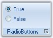{border="0"}

[]{style="COLOR: #15428b"} 

Figure 1356: ToolStripRadioButton

[]{style="COLOR: #15428b"} 

The below properties controls the appearance and behavior of the ToolStripRadioButton item.

 

**Foreground Settings**

[]{style="COLOR: #15428b"} 

::: {align="center"}
+-----------------------------------+-------------------------------------------------------------------+
| Property                          | Description                                                       |
+-----------------------------------+-------------------------------------------------------------------+
| Font                              | Sets the font style for the display text.                         |
+-----------------------------------+-------------------------------------------------------------------+
| Text                              | Sets the Text for the ToolStripRadioButton item.                  |
+-----------------------------------+-------------------------------------------------------------------+
| TextAlign                         | Specifies the alignment of the text in the item. The options are, |
|                                   |                                                                   |
|                                   |                                                                   |
|                                   |                                                                   |
|                                   | [·      ]{style="FONT-FAMILY: Symbol"}TopLeft,                    |
|                                   |                                                                   |
|                                   | [·      ]{style="FONT-FAMILY: Symbol"}TopCenter,                  |
|                                   |                                                                   |
|                                   | [·      ]{style="FONT-FAMILY: Symbol"}TopRight,                   |
|                                   |                                                                   |
|                                   | [·      ]{style="FONT-FAMILY: Symbol"}MiddleLeft,                 |
|                                   |                                                                   |
|                                   | [·      ]{style="FONT-FAMILY: Symbol"}MiddleCenter,               |
|                                   |                                                                   |
|                                   | [·      ]{style="FONT-FAMILY: Symbol"}MiddleRight,                |
|                                   |                                                                   |
|                                   | [·      ]{style="FONT-FAMILY: Symbol"}BottomLeft,                 |
|                                   |                                                                   |
|                                   | [·      ]{style="FONT-FAMILY: Symbol"}BottomCenter and            |
|                                   |                                                                   |
|                                   | [·      ]{style="FONT-FAMILY: Symbol"}BottomRight.                |
+-----------------------------------+-------------------------------------------------------------------+
:::

[]{style="COLOR: #15428b"} 

Style Settings

[]{style="COLOR: #15428b"} 

::: {align="center"}
+-----------------------------------+-------------------------------------------------------------------------------------------------------------------------------------+
| Property                          | Description                                                                                                                         |
+-----------------------------------+-------------------------------------------------------------------------------------------------------------------------------------+
| Checked                           | Indicates whether button is checked when the application loads.                                                                     |
+-----------------------------------+-------------------------------------------------------------------------------------------------------------------------------------+
| CheckAlign                        | Gets or sets the horizontal and vertical alignment of the check mark on a ToolStripRadioButton item. The options are,               |
|                                   |                                                                                                                                     |
|                                   |                                                                                                                                     |
|                                   |                                                                                                                                     |
|                                   | [·      ]{style="FONT-FAMILY: Symbol"}TopLeft,                                                                                      |
|                                   |                                                                                                                                     |
|                                   | [·      ]{style="FONT-FAMILY: Symbol"}TopCenter,                                                                                    |
|                                   |                                                                                                                                     |
|                                   | [·      ]{style="FONT-FAMILY: Symbol"}TopRight,                                                                                     |
|                                   |                                                                                                                                     |
|                                   | [·      ]{style="FONT-FAMILY: Symbol"}MiddleLeft,                                                                                   |
|                                   |                                                                                                                                     |
|                                   | [·      ]{style="FONT-FAMILY: Symbol"}MiddleCenter,                                                                                 |
|                                   |                                                                                                                                     |
|                                   | [·      ]{style="FONT-FAMILY: Symbol"}MiddleRight,                                                                                  |
|                                   |                                                                                                                                     |
|                                   | [·      ]{style="FONT-FAMILY: Symbol"}BottomLeft,                                                                                   |
|                                   |                                                                                                                                     |
|                                   | [·      ]{style="FONT-FAMILY: Symbol"}BottomCenter and                                                                              |
|                                   |                                                                                                                                     |
|                                   | [·      ]{style="FONT-FAMILY: Symbol"}BottomRight.                                                                                  |
+-----------------------------------+-------------------------------------------------------------------------------------------------------------------------------------+
| Enabled                           | Specifies whether the item is enabled.                                                                                              |
+-----------------------------------+-------------------------------------------------------------------------------------------------------------------------------------+
| Visible                           | Specifies whether the item is visible.                                                                                              |
+-----------------------------------+-------------------------------------------------------------------------------------------------------------------------------------+
| Alignment                         | Sets the alignment of the item within the ToolStrip. They can be set to beginning (Left) or end (Right) of the ToolStripEx control. |
+-----------------------------------+-------------------------------------------------------------------------------------------------------------------------------------+
| AutoSize                          | Specifies whether the item should size itself based on its image and text.                                                          |
+-----------------------------------+-------------------------------------------------------------------------------------------------------------------------------------+
| GroupID                           | Gets or Sets Group indicator which is used to create groups of ToolStripRadioButton controls on the same parent.                    |
+-----------------------------------+-------------------------------------------------------------------------------------------------------------------------------------+
:::

[]{style="COLOR: #15428b"} 

ToolTip Settings

[]{style="COLOR: #15428b"} 

::: {align="center"}
+-----------------------------------+------------------------------------------------------------------------------------------+
| Property                          | Description                                                                              |
+-----------------------------------+------------------------------------------------------------------------------------------+
| AutoToolTip                       | When set to true, will display the text set in the Text property as the item\'s tooltip. |
|                                   |                                                                                          |
|                                   |                                                                                          |
|                                   |                                                                                          |
|                                   | When set to false, will display the text set in the ToolTipText property.                |
+-----------------------------------+------------------------------------------------------------------------------------------+
| ToolTipText                       | Sets the text for the tooltip when AutoToolTip is set to false.                          |
+-----------------------------------+------------------------------------------------------------------------------------------+
:::

[]{style="COLOR: #15428b"} 

RTL Support

**[]{style="COLOR: #15428b"}** 

::: {align="center"}
  ------------- -------------------------------------------------------------------------
  Property      Description
  RightToLeft   Indicates whether the item should draw right to left for RTL languages.
  ------------- -------------------------------------------------------------------------
:::

 

3.15.1.2.3.3.2     Style Settings

[]{style="COLOR: #15428b"} 

This section will discuss the style settings available for the ToolStripEx.

 

**Border Settings**

**[]{style="COLOR: #15428b"}** 

::: {align="center"}
+-----------------------------------+---------------------------------------------------------+
| Property                          | Description                                             |
+-----------------------------------+---------------------------------------------------------+
| BorderStyle                       | Sets the border style for the control. The options are, |
|                                   |                                                         |
|                                   |                                                         |
|                                   |                                                         |
|                                   | [·      ]{style="FONT-FAMILY: Symbol"}None,             |
|                                   |                                                         |
|                                   | [·      ]{style="FONT-FAMILY: Symbol"}Etched and        |
|                                   |                                                         |
|                                   | [·      ]{style="FONT-FAMILY: Symbol"}StaticEdge.       |
+-----------------------------------+---------------------------------------------------------+
:::

[]{style="COLOR: #15428b"} 

+-------------------------------------------------------------------------------------------------------------------------------------------------------------------------------------------------------------------------+
| **[\[C#\]]{style="FONT-FAMILY: 'Courier New'; COLOR: black"}**                                                                                                                                                          |
|                                                                                                                                                                                                                         |
| []{style="FONT-FAMILY: 'Courier New'; COLOR: black"}                                                                                                                                                                    |
|                                                                                                                                                                                                                         |
| [this]{style="FONT-FAMILY: 'Courier New'; COLOR: blue"}[.toolStripEx1.BorderStyle = ToolStripBorderStyle.Etched;]{style="FONT-FAMILY: 'Courier New'; COLOR: black"}[]{style="FONT-FAMILY: 'Courier New'; COLOR: black"} |
+-------------------------------------------------------------------------------------------------------------------------------------------------------------------------------------------------------------------------+

[]{style="COLOR: #15428b"} 

+----------------------------------------------------------------------------------------------------------------------------------------------------+
| **[\[VB.NET\]]{style="FONT-FAMILY: 'Courier New'; COLOR: black"}**                                                                                 |
|                                                                                                                                                    |
| []{style="FONT-FAMILY: 'Courier New'; COLOR: black"}                                                                                               |
|                                                                                                                                                    |
| [Me]{style="FONT-FAMILY: 'Courier New'; COLOR: blue"}[.toolStripEx1.BorderStyle = ToolStripBorderStyle.Etched]{style="FONT-FAMILY: 'Courier New'"} |
+----------------------------------------------------------------------------------------------------------------------------------------------------+

[]{style="COLOR: #15428b"} 

{border="0"}

[]{style="COLOR: #15428b"} 

***[]{style="COLOR: #15428b"}*** 

***[]{style="COLOR: #15428b"}*** 

Figure 1357: MenuToolStripEx with BorderStyle Set

**[]{style="COLOR: #15428b"}** 

LauncherStyle

**[]{style="COLOR: #15428b"}** 

The below properties deals with the launcher settings.[]{#p1139}

**[]{style="COLOR: #15428b"}** 

::: {align="center"}
+-----------------------------------+----------------------------------------------------------+
| Property                          | Description                                              |
+-----------------------------------+----------------------------------------------------------+
| ShowLauncher                      | Specifies the visibility of the Launcher in the control. |
+-----------------------------------+----------------------------------------------------------+
| LauncherStyle                     | Sets the Style for the launcher. The styles are,         |
|                                   |                                                          |
|                                   |                                                          |
|                                   |                                                          |
|                                   | [·      ]{style="FONT-FAMILY: Symbol"}Office12,          |
|                                   |                                                          |
|                                   | [·      ]{style="FONT-FAMILY: Symbol"}Office2007         |
+-----------------------------------+----------------------------------------------------------+
:::

[]{style="COLOR: #15428b"} 

+------------------------------------------------------------------------------------------------------------------------------------------------------------------------------------------------------------------------------------------------------------+
| **[\[C#\]]{style="FONT-FAMILY: 'Courier New'; COLOR: black"}**                                                                                                                                                                                             |
|                                                                                                                                                                                                                                                            |
| []{style="COLOR: #15428b"}                                                                                                                                                                                                                                 |
|                                                                                                                                                                                                                                                            |
| [this]{style="FONT-FAMILY: 'Courier New'; COLOR: blue"}[.toolStripEx1.]{style="FONT-FAMILY: 'Courier New'; COLOR: black"}[ShowLauncher[ = ]{style="COLOR: black"}[true]{style="COLOR: blue"}[;]{style="COLOR: black"}]{style="FONT-FAMILY: 'Courier New'"} |
|                                                                                                                                                                                                                                                            |
| [this]{style="FONT-FAMILY: 'Courier New'; COLOR: blue"}[.toolStripEx1.LauncherStyle = LauncherStyle.Office2007;]{style="FONT-FAMILY: 'Courier New'; COLOR: black"}[]{style="FONT-FAMILY: 'Courier New'; COLOR: black"}                                     |
+------------------------------------------------------------------------------------------------------------------------------------------------------------------------------------------------------------------------------------------------------------+

[]{style="COLOR: #15428b"} 

+---------------------------------------------------------------------------------------------------------------------------------------------------------------------------------------------------------------------------------+
| **[\[VB.NET\]]{style="FONT-FAMILY: 'Courier New'; COLOR: black"}**                                                                                                                                                              |
|                                                                                                                                                                                                                                 |
| []{style="COLOR: #15428b"}                                                                                                                                                                                                      |
|                                                                                                                                                                                                                                 |
| [Me]{style="FONT-FAMILY: 'Courier New'; COLOR: blue"}[.toolStripEx1.]{style="FONT-FAMILY: 'Courier New'; COLOR: black"}[ShowLauncher[ = ]{style="COLOR: black"}[True]{style="COLOR: blue"}]{style="FONT-FAMILY: 'Courier New'"} |
|                                                                                                                                                                                                                                 |
| [Me]{style="FONT-FAMILY: 'Courier New'; COLOR: blue"}[.toolStripEx1.LauncherStyle = LauncherStyle.Office2007]{style="FONT-FAMILY: 'Courier New'; COLOR: black"}[]{style="FONT-FAMILY: 'Courier New'; COLOR: black"}             |
+---------------------------------------------------------------------------------------------------------------------------------------------------------------------------------------------------------------------------------+

[]{style="COLOR: #15428b"} 

{border="0"}

[]{style="COLOR: #15428b"} 

***[]{style="COLOR: #15428b"}*** 

Figure 1358: ToolStripEx controls illustrating LauncherStyles

 

Grip Style

 

The toolstrip can hold a grip, which can be visible by setting the GripStyle property. We can enable GripStyle easily, using the smart tag of the ToolStripEx control.

[]{style="COLOR: #15428b"} 

::: {align="center"}
  ------------ ------------------------------------------------------------------------------------------------------
  Property     Description
  GripStyle    Specifies whether or not to show the Gripper for the control. It can be hidden (default) or visible.
  GripMargin   Specifies the margin for the Gripper. Default is 2.
  ------------ ------------------------------------------------------------------------------------------------------
:::

[]{#p1140}[]{style="COLOR: #15428b"} 

+--------------------------------------------------------------------------------------------------------------------------------------------------------------------------------------------------------------------------------------------------+
| **[\[C#\]]{style="FONT-FAMILY: 'Courier New'; COLOR: black"}**                                                                                                                                                                                   |
|                                                                                                                                                                                                                                                  |
| []{style="COLOR: black"}                                                                                                                                                                                                                         |
|                                                                                                                                                                                                                                                  |
| [this]{style="FONT-FAMILY: 'Courier New'; COLOR: blue"}[.toolStripEx1.GripStyle = System.Windows.Forms.[ToolStripGripStyle]{style="COLOR: teal"}.Visible;]{style="FONT-FAMILY: 'Courier New'"}                                                   |
|                                                                                                                                                                                                                                                  |
| [this]{style="FONT-FAMILY: 'Courier New'; COLOR: blue"}[.toolStripEx1.GripMargin = [new]{style="COLOR: blue"} System.Windows.Forms.[Padding]{style="COLOR: teal"}(5);]{style="FONT-FAMILY: 'Courier New'"}[]{style="FONT-FAMILY: 'Courier New'"} |
+--------------------------------------------------------------------------------------------------------------------------------------------------------------------------------------------------------------------------------------------------+

[]{#p1141}[]{style="COLOR: #15428b"} 

+-----------------------------------------------------------------------------------------------------------------------------------------------------------------------------------------------------------------------------------------------+
| **[\[VB.NET\]]{style="FONT-FAMILY: 'Courier New'; COLOR: black"}**                                                                                                                                                                            |
|                                                                                                                                                                                                                                               |
| []{style="COLOR: black"}                                                                                                                                                                                                                      |
|                                                                                                                                                                                                                                               |
| [Me]{style="FONT-FAMILY: 'Courier New'; COLOR: blue"}[.toolStripEx1.GripStyle = System.Windows.Forms.[ToolStripGripStyle]{style="COLOR: teal"}.Visible]{style="FONT-FAMILY: 'Courier New'"}                                                   |
|                                                                                                                                                                                                                                               |
| [Me]{style="FONT-FAMILY: 'Courier New'; COLOR: blue"}[.toolStripEx1.GripMargin = [new]{style="COLOR: blue"} System.Windows.Forms.[Padding]{style="COLOR: teal"}(5)]{style="FONT-FAMILY: 'Courier New'"}[]{style="FONT-FAMILY: 'Courier New'"} |
+-----------------------------------------------------------------------------------------------------------------------------------------------------------------------------------------------------------------------------------------------+

[]{style="COLOR: #15428b"} 

{border="0"}

[]{style="COLOR: #15428b"} 

Figure 1359: ToolStripEx with GripStyle Enabled

**[]{style="COLOR: #15428b"}** 

See Also

**[]{style="COLOR: #15428b"}** 

[[Appearance Settings]{.UGHyperlink}](../../../../../../../../Documents%20and%20Settings/sylviap/Desktop/Tools%20-%20Part%202.docx#_Appearance_Settings_1)[, ]{.UGHyperlink}[[DesignTime Features]{.UGHyperlink}](../../../../../../../../Documents%20and%20Settings/sylviap/Desktop/Tools%20-%20Part%202.docx#_DesignTime_Features_2)[, ]{.UGHyperlink}[[Caption Settings]{.UGHyperlink}](../../../../../../../../Documents%20and%20Settings/sylviap/Desktop/Tools%20-%20Part%202.docx#_Caption_Settings_1)[, ]{.UGHyperlink}[[Grouping Items]{.UGHyperlink}](../../../../../../../../Documents%20and%20Settings/sylviap/Desktop/Tools%20-%20Part%202.docx#_Grouping_Items)[, ]{.UGHyperlink}[[Collapsed State Settings]{.UGHyperlink}](../../../../../../../../Documents%20and%20Settings/sylviap/Desktop/Tools%20-%20Part%202.docx#_Collapsed_State_Settings)[]{.UGHyperlink}

 

 

3.15.1.2.3.3.3     Appearance Settings

 

**Office12Mode**

 

ToolStripEx now supports Office12 modes in Ribbon. The properties which applies this mode are as follows.

[]{#p1142}[]{style="COLOR: #15428b"} 

::: {align="center"}
+-----------------------------------+------------------------------------------------------------------------------+
| Property                          | Description                                                                  |
+-----------------------------------+------------------------------------------------------------------------------+
| Office12Mode                      | When set to true, Office12Mode will be applied to the control.               |
|                                   |                                                                              |
|                                   |                                                                              |
|                                   |                                                                              |
|                                   | When set to false, Office2007 mode will be applied to the control. (Default) |
+-----------------------------------+------------------------------------------------------------------------------+
| RenderMode                        | Specifies the painting style of the ToolStripEx. Options are,                |
|                                   |                                                                              |
|                                   |                                                                              |
|                                   |                                                                              |
|                                   | [·      ]{style="FONT-FAMILY: Symbol"}System,                                |
|                                   |                                                                              |
|                                   | [·      ]{style="FONT-FAMILY: Symbol"}Professional and                       |
|                                   |                                                                              |
|                                   | [·      ]{style="FONT-FAMILY: Symbol"}ManagerRenderMode.(Default)            |
+-----------------------------------+------------------------------------------------------------------------------+
:::

[]{style="COLOR: #15428b"} 

::: {style="BORDER-BOTTOM: windowtext 1pt solid; BORDER-LEFT: medium none; PADDING-BOTTOM: 1pt; MARGIN: 9pt 0pt 9pt 18pt; PADDING-LEFT: 0pt; PADDING-RIGHT: 0pt; BORDER-TOP: windowtext 1pt solid; BORDER-RIGHT: medium none; PADDING-TOP: 1pt"}
{border="0"} Note: These properties can be easily set through Smart tag of the ToolStripEx. See SmartTag Options in [[[DesignTime Features]{style="COLOR: windowtext; FONT-SIZE: 9pt; TEXT-DECORATION: none; text-underline: none"}]{.UGHyperlink}](../../../../../../../../Documents%20and%20Settings/sylviap/Desktop/Tools%20-%20Part%202.docx#_DesignTime_Features_3).
:::

[]{style="COLOR: #15428b"} 

+--------------------------------------------------------------------------------------------------------------------------------------------------------------------------------------------------------------------------------------------------------------------------+
| []{#p1143}**[\[C#\]]{style="FONT-FAMILY: 'Courier New'; COLOR: black"}**                                                                                                                                                                                                 |
|                                                                                                                                                                                                                                                                          |
| []{style="COLOR: #15428b"}                                                                                                                                                                                                                                               |
|                                                                                                                                                                                                                                                                          |
| [this]{style="FONT-FAMILY: 'Courier New'; COLOR: blue"}[.toolStripEx1.Office12Mode = ]{style="FONT-FAMILY: 'Courier New'; COLOR: black"}[true]{style="FONT-FAMILY: 'Courier New'; COLOR: blue"}[;]{style="FONT-FAMILY: 'Courier New'; COLOR: black"}                     |
|                                                                                                                                                                                                                                                                          |
| [this]{style="FONT-FAMILY: 'Courier New'; COLOR: blue"}[.toolStripEx1.RenderMode = System.Windows.Forms.[ToolStripRenderMode]{style="COLOR: teal"}.[ManagerRenderMode]{style="COLOR: black"};]{style="FONT-FAMILY: 'Courier New'"}[]{style="FONT-FAMILY: 'Courier New'"} |
+--------------------------------------------------------------------------------------------------------------------------------------------------------------------------------------------------------------------------------------------------------------------------+

[]{#p1144}[]{style="COLOR: #15428b"} 

+-------------------------------------------------------------------------------------------------------------------------------------------------------------------------------------------------------------------------------------------------------------------------------------+
| **[\[VB.NET\]]{style="FONT-FAMILY: 'Courier New'; COLOR: black"}**                                                                                                                                                                                                                  |
|                                                                                                                                                                                                                                                                                     |
| []{style="COLOR: #15428b"}                                                                                                                                                                                                                                                          |
|                                                                                                                                                                                                                                                                                     |
| [Me]{style="FONT-FAMILY: 'Courier New'; COLOR: blue"}[.toolStripEx1.Office12Mode = ]{style="FONT-FAMILY: 'Courier New'; COLOR: black"}[True]{style="FONT-FAMILY: 'Courier New'; COLOR: blue"}                                                                                       |
|                                                                                                                                                                                                                                                                                     |
| [Me]{style="FONT-FAMILY: 'Courier New'; COLOR: blue"}[.toolStripEx1.RenderMode = System.Windows.Forms.[ToolStripRenderMode]{style="COLOR: teal"}.[ManagerRenderMode]{style="COLOR: black"}]{style="FONT-FAMILY: 'Courier New'"}[]{style="FONT-FAMILY: 'Courier New'; COLOR: black"} |
+-------------------------------------------------------------------------------------------------------------------------------------------------------------------------------------------------------------------------------------------------------------------------------------+

[]{style="COLOR: #15428b"} 

{border="0"}

[]{style="COLOR: #15428b"} 

Figure 1360: ToolStripEx in Office12Mode and ManagerRenderMode

 

**Office2007 Mode**

 

Disabling the Office12Mode property will automatically give the Ribbon control, Office2007 look and feel.

 

::: {align="center"}
  ------------------- -----------------------------------------------------------------------------------------------
  Property            Description
  OfficeColorScheme   Sets the office color schemes for the control. Blue, Black and Silver schemes can be applied.
  ------------------- -----------------------------------------------------------------------------------------------
:::

**[]{style="COLOR: #15428b"}** 

::: {style="BORDER-BOTTOM: windowtext 1pt solid; BORDER-LEFT: medium none; PADDING-BOTTOM: 1pt; MARGIN: 9pt 0pt 9pt 18pt; PADDING-LEFT: 0pt; PADDING-RIGHT: 0pt; BORDER-TOP: windowtext 1pt solid; BORDER-RIGHT: medium none; PADDING-TOP: 1pt"}
[]{style="COLOR: #15428b"} 

{border="0"} Note: This settings will overwrite the [[Panel.OfficeColorScheme]{style="COLOR: windowtext; TEXT-DECORATION: none; text-underline: none"}](../../../../../../../../Documents%20and%20Settings/sylviap/Desktop/Tools%20-%20Part%202.docx#_OfficeColorScheme) property[.]{style="COLOR: #15428b"}
:::

[]{style="COLOR: #15428b"} 

+-----------------------------------------------------------------------------------------------------------------------------------------------------------------------------------------------------------------------------------------------------------------------------------+
| []{#p1145}**[\[C#\]]{style="FONT-FAMILY: 'Courier New'; COLOR: black"}**                                                                                                                                                                                                          |
|                                                                                                                                                                                                                                                                                   |
| []{style="COLOR: #15428b"}                                                                                                                                                                                                                                                        |
|                                                                                                                                                                                                                                                                                   |
| [this]{style="FONT-FAMILY: 'Courier New'; COLOR: blue"}[.toolStripEx1.OfficeColorScheme = Syncfusion.Windows.Forms.Tools.[ToolStripEx]{style="COLOR: teal"}.[ColorScheme]{style="COLOR: teal"}.Silver;]{style="FONT-FAMILY: 'Courier New'"}[]{style="FONT-FAMILY: 'Courier New'"} |
+-----------------------------------------------------------------------------------------------------------------------------------------------------------------------------------------------------------------------------------------------------------------------------------+

[]{#p1146}[]{style="COLOR: #15428b"} 

+------------------------------------------------------------------------------------------------------------------------------------------------------------------------------------------------------------------------------------------+
| **[Interactive Features]{style="FONT-FAMILY: 'Courier New'; COLOR: #15428b"}[\[VB.NET\]]{style="FONT-FAMILY: 'Courier New'; COLOR: black"}**                                                                                             |
|                                                                                                                                                                                                                                          |
| []{style="FONT-FAMILY: 'Courier New'; COLOR: #15428b"}                                                                                                                                                                                   |
|                                                                                                                                                                                                                                          |
| [Me]{style="FONT-FAMILY: 'Courier New'; COLOR: blue"}[.toolStripEx1.OfficeColorScheme = Syncfusion.Windows.Forms.Tools.[ToolStripEx]{style="COLOR: teal"}.[ColorScheme]{style="COLOR: teal"}.Silver]{style="FONT-FAMILY: 'Courier New'"} |
+------------------------------------------------------------------------------------------------------------------------------------------------------------------------------------------------------------------------------------------+

[]{style="COLOR: #15428b"} 

{border="0"}

[]{style="COLOR: #15428b"} 

Figure 1361: ToolStripEx with ColorSchemes

**[]{style="COLOR: #15428b"}** 

AutoSizing of ToolStripEx

**[]{style="COLOR: #15428b"}** 

By enabling the **AutoSize** property of ToolStripEx, the toolstrip width will be resized automatically while adding controls to the toolstrip in the designer.

**[]{style="COLOR: #15428b"}** 

::: {align="center"}
  -------------------- -------------------------------------------------------------------------------------------
  []{#p1147}Property   Description
  AutoSize             Setting this to true, will automatically resize the toolstrip as the controls gets added.
  -------------------- -------------------------------------------------------------------------------------------
:::

[]{#p1148}**[]{style="COLOR: #15428b"}** 

+------------------------------------------------------------------------------------------------------------------------------------------------------------------------------------------+
| **[\[C#\]]{style="FONT-FAMILY: 'Courier New'; COLOR: black"}**                                                                                                                           |
|                                                                                                                                                                                          |
| []{style="COLOR: #15428b"}                                                                                                                                                               |
|                                                                                                                                                                                          |
| [this]{style="FONT-FAMILY: 'Courier New'; COLOR: blue"}[.toolStripEx1.AutoSize = [true]{style="COLOR: blue"};]{style="FONT-FAMILY: 'Courier New'"}[]{style="FONT-FAMILY: 'Courier New'"} |
+------------------------------------------------------------------------------------------------------------------------------------------------------------------------------------------+

[]{style="COLOR: #15428b"} 

+----------------------------------------------------------------------------------------------------------------------------------------------------------------------------------------------------+
| **[\[]{style="FONT-FAMILY: 'Courier New'; COLOR: black"}[VB.NET\]]{style="FONT-FAMILY: 'Courier New'; COLOR: black"}[]{style="FONT-FAMILY: 'Courier New'; COLOR: black"}**                         |
|                                                                                                                                                                                                    |
| []{style="COLOR: #15428b"}                                                                                                                                                                         |
|                                                                                                                                                                                                    |
| [Me]{style="FONT-FAMILY: 'Courier New'; COLOR: blue"}[.toolStripEx1.AutoSize = [True]{style="COLOR: blue"}]{style="FONT-FAMILY: 'Courier New'"}[]{style="FONT-FAMILY: 'Courier New'; COLOR: blue"} |
+----------------------------------------------------------------------------------------------------------------------------------------------------------------------------------------------------+

[]{style="COLOR: #15428b"} 

See Also

**[]{style="COLOR: #15428b"}** 

[[Style Settings]{.UGHyperlink}](../../../../../../../../Documents%20and%20Settings/sylviap/Desktop/Tools%20-%20Part%202.docx#_Style_Settings)[, ]{.UGHyperlink}[[Caption Settings]{.UGHyperlink}](../../../../../../../../Documents%20and%20Settings/sylviap/Desktop/Tools%20-%20Part%202.docx#_Caption_Settings)[, ]{.UGHyperlink}[[Collapsed State Settings]{.UGHyperlink}](../../../../../../../../Documents%20and%20Settings/sylviap/Desktop/Tools%20-%20Part%202.docx#_Collapsed_State_Settings)[]{.UGHyperlink}

 

 

[]{#_ToolTips_1}3.15.1.2.3.3.4     ToolTips

[]{#p1149}[]{style="COLOR: #15428b"} 

We can show tooltips over the ToolStrip items, by enabling the **ToolStripEx.ShowItemToolTips** property.

[]{style="COLOR: #15428b"} 

+--------------------------------------------------------------------------------------------------------------------------------------------------------------------------------------------------+
| **[\[C#\]]{style="FONT-FAMILY: 'Courier New'; COLOR: black"}**                                                                                                                                   |
|                                                                                                                                                                                                  |
| []{style="COLOR: #15428b"}                                                                                                                                                                       |
|                                                                                                                                                                                                  |
| [this]{style="FONT-FAMILY: 'Courier New'; COLOR: blue"}[.toolStripEx2.ShowItemToolTips = [true]{style="COLOR: blue"};]{style="FONT-FAMILY: 'Courier New'"}[]{style="FONT-FAMILY: 'Courier New'"} |
+--------------------------------------------------------------------------------------------------------------------------------------------------------------------------------------------------+

[]{style="COLOR: #15428b"} 

+------------------------------------------------------------------------------------------------------------------------------------------------------------------------------------------------------------+
| **[\[]{style="FONT-FAMILY: 'Courier New'; COLOR: black"}[VB.NET\]]{style="FONT-FAMILY: 'Courier New'; COLOR: black"}[]{style="FONT-FAMILY: 'Courier New'; COLOR: black"}**                                 |
|                                                                                                                                                                                                            |
| []{style="COLOR: #15428b"}                                                                                                                                                                                 |
|                                                                                                                                                                                                            |
| [Me]{style="FONT-FAMILY: 'Courier New'; COLOR: blue"}[.toolStripEx2.ShowItemToolTips = [True]{style="COLOR: blue"}]{style="FONT-FAMILY: 'Courier New'"}[]{style="FONT-FAMILY: 'Courier New'; COLOR: blue"} |
+------------------------------------------------------------------------------------------------------------------------------------------------------------------------------------------------------------+

[]{style="COLOR: #15428b"} 

::: {style="BORDER-BOTTOM: windowtext 1pt solid; BORDER-LEFT: medium none; PADDING-BOTTOM: 1pt; MARGIN: 9pt 0pt 9pt 18pt; PADDING-LEFT: 0pt; PADDING-RIGHT: 0pt; BORDER-TOP: windowtext 1pt solid; BORDER-RIGHT: medium none; PADDING-TOP: 1pt"}
{border="0"} Note: ToolTip text for the ToolStrip items can be specified using the respective \<Control\>.TooltipText properties. Ex, toolStripGallery1.ToolTipText property sets the tooltip for [[gallery]{style="COLOR: windowtext; TEXT-DECORATION: none; text-underline: none"}](../../../../../../../../Documents%20and%20Settings/sylviap/Desktop/Tools%20-%20Part%202.docx#_Gallery) item.
:::

[]{style="COLOR: #15428b"} 

See Also

[]{style="COLOR: #15428b"} 

[[ToolStripItems]{.UGHyperlink}](../../../../../../../../Documents%20and%20Settings/sylviap/Desktop/Tools%20-%20Part%202.docx#_ToolStripItems)[]{.UGHyperlink}

 

 

[]{#_DesignTime_Features_2}3.15.1.2.3.3.5     DesignTime Features

 

**Smart Tag**

 

Smart Tag of the ToolStripEx opens the Task Windows which lets you to set some important properties easily.

[]{style="COLOR: #15428b"} 

{border="0"}

[]{style="COLOR: #15428b"} 

***[]{style="COLOR: #15428b"}*** 

Figure 1362: ToolStripEx Tasks Window

[]{style="COLOR: #15428b"} 

[·      ]{style="FONT-FAMILY: Symbol"}Embed in ToolStripContainer - Lets you embed the ToolStrip in the ToolStripContainer.

[·      ]{style="FONT-FAMILY: Symbol"}[[Insert Standard Items]{.UGHyperlink}](../../../../../../../../Documents%20and%20Settings/sylviap/Desktop/Tools%20-%20Part%202.docx#_Adding_Controls_to) - Inserts standard items into the control.

[·      ]{style="FONT-FAMILY: Symbol"}[[RenderMode]{.UGHyperlink}](../../../../../../../../Documents%20and%20Settings/sylviap/Desktop/Tools%20-%20Part%202.docx#_Appearance_Settings_1) - Lets you set the rendering mode.

[·      ]{style="FONT-FAMILY: Symbol"}Dock - Docks the control.

[·      ]{style="FONT-FAMILY: Symbol"}[[GripStyle]{.UGHyperlink}](../../../../../../../../Documents%20and%20Settings/sylviap/Desktop/Tools%20-%20Part%202.docx#_Style_Settings) - Sets the grip style for the control.

[·      ]{style="FONT-FAMILY: Symbol"}EditItems - Opens the Items Collection Editor.

[·      ]{style="FONT-FAMILY: Symbol"}[[Office12Mode]{.UGHyperlink}](../../../../../../../../Documents%20and%20Settings/sylviap/Desktop/Tools%20-%20Part%202.docx#_Appearance_Settings_1)[ ]{.UGHyperlink}- Enables or Disables the Office12Mode.

[]{style="COLOR: #15428b"} 

Context Menu

[]{style="COLOR: #15428b"} 

The context menu on a toolstrip item provides advanced options which minimizes your time in customizing the ToolStrip container.

[]{style="COLOR: #15428b"} 

{border="0"}

**[]{style="COLOR: #15428b"}** 

Figure 1363: ContextMenu of a ToolStripItem

[]{style="COLOR: #15428b"} 

[·      ]{style="FONT-FAMILY: Symbol"}Set Image - This options lets you to modify the image for the particular toolstrip item.

[·      ]{style="FONT-FAMILY: Symbol"}Enabled - Specifies whether the item is enabled or not.

[·      ]{style="FONT-FAMILY: Symbol"}Alignment - Aligns the item to Left or Right.

[·      ]{style="FONT-FAMILY: Symbol"}DisplayStyle - Specifies the display style, whether None, Image, Text or ImageAndText.

[·      ]{style="FONT-FAMILY: Symbol"}ConvertTo - Provides options to convert the select item to another item.

[]{style="COLOR: #15428b"} 

{border="0"}

[]{style="COLOR: #15428b"} 

***[]{style="COLOR: #15428b"}*** 

Figure 1364: Displays the ToolStripItem for ConvertTo Option

[]{style="COLOR: #15428b"} 

[·      ]{style="FONT-FAMILY: Symbol"}Insert - Lets you to insert ToolStripItems.

[·      ]{style="FONT-FAMILY: Symbol"}Select - Facilitates you to select a particular control.

[]{style="COLOR: #15428b"} 

{border="0"}

**[]{style="COLOR: #15428b"}** 

***[]{style="COLOR: #15428b"}*** 

Figure 1365: Selecting ToolStripEx control using Select Option

 

[]{#_Caption_Settings}3.15.1.2.3.3.6     Caption Settings

[]{style="COLOR: #15428b"} 

Caption for a ToolStripEx can be enabled using **ShowCaption** property. Text for the Caption is set using **Text** property.

[]{style="COLOR: #15428b"} 

+-------------------------------------------------------------------------------------------------------------------------------------------------------------------------------------------------------------------------------------------------------------------------------------------------------------------+
| **[\[C#\]]{style="FONT-FAMILY: 'Courier New'; COLOR: black"}**                                                                                                                                                                                                                                                    |
|                                                                                                                                                                                                                                                                                                                   |
| []{style="COLOR: #15428b"}                                                                                                                                                                                                                                                                                        |
|                                                                                                                                                                                                                                                                                                                   |
| [this]{style="FONT-FAMILY: 'Courier New'; COLOR: blue"}[.toolStripEx1.ShowCaption = ]{style="FONT-FAMILY: 'Courier New'; COLOR: black"}[true]{style="FONT-FAMILY: 'Courier New'; COLOR: blue"}[;]{style="FONT-FAMILY: 'Courier New'; COLOR: black"}                                                               |
|                                                                                                                                                                                                                                                                                                                   |
| [this]{style="FONT-FAMILY: 'Courier New'; COLOR: blue"}[.toolStripEx1.Text = \"]{style="FONT-FAMILY: 'Courier New'; COLOR: black"}[Standard Items]{style="FONT-FAMILY: 'Courier New'; COLOR: #993300"}[\";]{style="FONT-FAMILY: 'Courier New'; COLOR: black"}[]{style="FONT-FAMILY: 'Courier New'; COLOR: black"} |
+-------------------------------------------------------------------------------------------------------------------------------------------------------------------------------------------------------------------------------------------------------------------------------------------------------------------+

[]{#p1150}[]{style="COLOR: #15428b"} 

+----------------------------------------------------------------------------------------------------------------------------------------------------------------------------------------------------------------------------------------------------------------------------------------------------------------+
| **[\[VB.NET\]]{style="FONT-FAMILY: 'Courier New'; COLOR: black"}**                                                                                                                                                                                                                                             |
|                                                                                                                                                                                                                                                                                                                |
| []{style="COLOR: #15428b"}                                                                                                                                                                                                                                                                                     |
|                                                                                                                                                                                                                                                                                                                |
| [Me]{style="FONT-FAMILY: 'Courier New'; COLOR: blue"}[.toolStripEx1.ShowCaption = ]{style="FONT-FAMILY: 'Courier New'; COLOR: black"}[True]{style="FONT-FAMILY: 'Courier New'; COLOR: blue"}                                                                                                                   |
|                                                                                                                                                                                                                                                                                                                |
| [Me]{style="FONT-FAMILY: 'Courier New'; COLOR: blue"}[.toolStripEx1.Text = \"]{style="FONT-FAMILY: 'Courier New'; COLOR: black"}[Standard Items]{style="FONT-FAMILY: 'Courier New'; COLOR: #993300"}[\"]{style="FONT-FAMILY: 'Courier New'; COLOR: black"}[]{style="FONT-FAMILY: 'Courier New'; COLOR: black"} |
+----------------------------------------------------------------------------------------------------------------------------------------------------------------------------------------------------------------------------------------------------------------------------------------------------------------+

[]{style="COLOR: #15428b"} 

{border="0"}

[]{style="COLOR: #15428b"} 

Figure 1366: ClipboardToolStripEx with Caption Turned Off

**[]{style="COLOR: #15428b"}** 

Customizing the Caption

[]{style="COLOR: #15428b"} 

The below properties lets you customize caption for the control.

[]{style="COLOR: #15428b"} 

::: {align="center"}
+-----------------------------------+--------------------------------------------------------------------------------------+
| Property                          | Description                                                                          |
+-----------------------------------+--------------------------------------------------------------------------------------+
| CaptionFont                       | Sets the FontStyle for the caption.                                                  |
+-----------------------------------+--------------------------------------------------------------------------------------+
| CaptionTextStyle                  | Sets the text style for the caption. The options are,                                |
|                                   |                                                                                      |
|                                   |                                                                                      |
|                                   |                                                                                      |
|                                   | [·      ]{style="FONT-FAMILY: Symbol"}Plain,                                         |
|                                   |                                                                                      |
|                                   | [·      ]{style="FONT-FAMILY: Symbol"}Etched and                                     |
|                                   |                                                                                      |
|                                   | [·      ]{style="FONT-FAMILY: Symbol"}Shadow.                                        |
+-----------------------------------+--------------------------------------------------------------------------------------+
| CaptionAlignment                  | Sets the alignment of the caption. The Alignment can be,                             |
|                                   |                                                                                      |
|                                   |                                                                                      |
|                                   |                                                                                      |
|                                   | [·      ]{style="FONT-FAMILY: Symbol"}Near,                                          |
|                                   |                                                                                      |
|                                   | [·      ]{style="FONT-FAMILY: Symbol"}Center and                                     |
|                                   |                                                                                      |
|                                   | [·      ]{style="FONT-FAMILY: Symbol"}Far.                                           |
+-----------------------------------+--------------------------------------------------------------------------------------+
| CaptionStyle                      | Specifies whether to align the caption text to the top or bottom of the ToolStripEx. |
|                                   |                                                                                      |
|                                   |                                                                                      |
|                                   |                                                                                      |
|                                   | Default alignment is Top.                                                            |
+-----------------------------------+--------------------------------------------------------------------------------------+
| CaptionMinHeight                  | Sets the minimum height for the caption.                                             |
+-----------------------------------+--------------------------------------------------------------------------------------+
:::

[]{#p1151}[]{style="COLOR: #15428b"} 

+-------------------------------------------------------------------------------------------------------------------------------------------------------------------------------------------------------------------------------------------------------------------------+
| **[\[C#\]]{style="FONT-FAMILY: 'Courier New'; COLOR: black"}**                                                                                                                                                                                                          |
|                                                                                                                                                                                                                                                                         |
| []{style="COLOR: #15428b"}                                                                                                                                                                                                                                              |
|                                                                                                                                                                                                                                                                         |
| [this]{style="FONT-FAMILY: 'Courier New'; COLOR: blue"}[.toolStripEx1.CaptionFont = ]{style="FONT-FAMILY: 'Courier New'; COLOR: black"}[new]{style="FONT-FAMILY: 'Courier New'; COLOR: blue"}[ Font(\"Verdana\", 8);]{style="FONT-FAMILY: 'Courier New'; COLOR: black"} |
|                                                                                                                                                                                                                                                                         |
| [this]{style="FONT-FAMILY: 'Courier New'; COLOR: blue"}[.toolStripEx1.CaptionTextStyle = CaptionTextStyle.Shadow;]{style="FONT-FAMILY: 'Courier New'; COLOR: black"}                                                                                                    |
|                                                                                                                                                                                                                                                                         |
| [this]{style="FONT-FAMILY: 'Courier New'; COLOR: blue"}[.toolStripEx1.CaptionAlignment = CaptionAlignment.Center;]{style="FONT-FAMILY: 'Courier New'; COLOR: black"}                                                                                                    |
|                                                                                                                                                                                                                                                                         |
| [this]{style="FONT-FAMILY: 'Courier New'; COLOR: blue"}[.toolStripEx1.CaptionStyle = CaptionStyle.Bottom;]{style="FONT-FAMILY: 'Courier New'; COLOR: black"}                                                                                                            |
|                                                                                                                                                                                                                                                                         |
| [this]{style="FONT-FAMILY: 'Courier New'; COLOR: blue"}[.ribbonControlAdv1.CaptionMinHeight = 20;]{style="FONT-FAMILY: 'Courier New'"}[]{style="FONT-FAMILY: 'Courier New'"}                                                                                            |
+-------------------------------------------------------------------------------------------------------------------------------------------------------------------------------------------------------------------------------------------------------------------------+

[]{style="COLOR: #15428b"} 

+----------------------------------------------------------------------------------------------------------------------------------------------------------------------------------------------------------------------------------------------------------------------+
| **[\[]{style="FONT-FAMILY: 'Courier New'; COLOR: black"}[VB.NET\]]{style="FONT-FAMILY: 'Courier New'; COLOR: black"}[]{style="FONT-FAMILY: 'Courier New'; COLOR: black"}**                                                                                           |
|                                                                                                                                                                                                                                                                      |
| []{style="COLOR: #15428b"}                                                                                                                                                                                                                                           |
|                                                                                                                                                                                                                                                                      |
| [Me]{style="FONT-FAMILY: 'Courier New'; COLOR: blue"}[.toolStripEx1.CaptionFont = ]{style="FONT-FAMILY: 'Courier New'; COLOR: black"}[New]{style="FONT-FAMILY: 'Courier New'; COLOR: blue"}[ Font(\"Verdana\", 8)]{style="FONT-FAMILY: 'Courier New'; COLOR: black"} |
|                                                                                                                                                                                                                                                                      |
| [Me]{style="FONT-FAMILY: 'Courier New'; COLOR: blue"}[.toolStripEx1.CaptionTextStyle = CaptionTextStyle.Shadow]{style="FONT-FAMILY: 'Courier New'; COLOR: black"}                                                                                                    |
|                                                                                                                                                                                                                                                                      |
| [Me]{style="FONT-FAMILY: 'Courier New'; COLOR: blue"}[.toolStripEx1.CaptionAlignment = CaptionAlignment.Center]{style="FONT-FAMILY: 'Courier New'"}                                                                                                                  |
|                                                                                                                                                                                                                                                                      |
| [Me]{style="FONT-FAMILY: 'Courier New'; COLOR: blue"}[.toolStripEx1.CaptionStyle = CaptionStyle.[Bottom]{style="COLOR: black"}]{style="FONT-FAMILY: 'Courier New'"}                                                                                                  |
|                                                                                                                                                                                                                                                                      |
| [Me]{style="FONT-FAMILY: 'Courier New'; COLOR: blue"}[.ribbonControlAdv1.CaptionMinHeight = 20]{style="FONT-FAMILY: 'Courier New'"}                                                                                                                                  |
+----------------------------------------------------------------------------------------------------------------------------------------------------------------------------------------------------------------------------------------------------------------------+

[]{style="COLOR: #15428b"} 

{border="0"}

[]{style="COLOR: #15428b"} 

Figure 1367: CaptionFont = \"Verdana 8\"; TextStyle = \"Shadow\";

Alignment = \"Center\"; Style = \"Bottom\"; MinHeight = \"20\"

**[]{style="COLOR: #15428b"}** 

See Also

**[]{style="COLOR: #15428b"}** 

[[Style Settings]{.UGHyperlink}](../../../../../../../../Documents%20and%20Settings/sylviap/Desktop/Tools%20-%20Part%202.docx#_Style_Settings)[, ]{.UGHyperlink}[[Appearance Settings]{.UGHyperlink}](../../../../../../../../Documents%20and%20Settings/sylviap/Desktop/Tools%20-%20Part%202.docx#_Appearance_Settings_1)[]{.UGHyperlink}

 

 

 

 

[]{#_Grouping_Items}3.15.1.2.3.3.7     Grouping Items

[]{style="COLOR: #15428b"} 

ToolStripItems can be grouped inside a ToolStripEx using the **GroupedButtons** property.

[]{style="COLOR: #15428b"} 

+------------------------------------------------------------------------------------------------------------------------------------------------------------------------------------------------------------------------------------------------------------------------------------------------------------+
| **[\[C#\]]{style="FONT-FAMILY: 'Courier New'; COLOR: black"}**                                                                                                                                                                                                                                             |
|                                                                                                                                                                                                                                                                                                            |
| []{style="COLOR: #15428b"}                                                                                                                                                                                                                                                                                 |
|                                                                                                                                                                                                                                                                                                            |
| [this]{style="FONT-FAMILY: 'Courier New'; COLOR: blue"}[.toolStripEx1.GroupedButtons = ]{style="FONT-FAMILY: 'Courier New'; COLOR: black"}[true]{style="FONT-FAMILY: 'Courier New'; COLOR: blue"}[;]{style="FONT-FAMILY: 'Courier New'; COLOR: black"}[]{style="FONT-FAMILY: 'Courier New'; COLOR: black"} |
+------------------------------------------------------------------------------------------------------------------------------------------------------------------------------------------------------------------------------------------------------------------------------------------------------------+

[]{#p1152}[]{style="COLOR: #15428b"} 

+----------------------------------------------------------------------------------------------------------------------------------------------------------------------------------------------------------------------------------------------------+
| **[\[VB.NET\]]{style="FONT-FAMILY: 'Courier New'; COLOR: black"}**                                                                                                                                                                                 |
|                                                                                                                                                                                                                                                    |
| []{style="COLOR: #15428b"}                                                                                                                                                                                                                         |
|                                                                                                                                                                                                                                                    |
| [Me]{style="FONT-FAMILY: 'Courier New'; COLOR: blue"}[.toolStripEx1.GroupedButtons = ]{style="FONT-FAMILY: 'Courier New'; COLOR: black"}[True]{style="FONT-FAMILY: 'Courier New'; COLOR: blue"}[]{style="FONT-FAMILY: 'Courier New'; COLOR: blue"} |
+----------------------------------------------------------------------------------------------------------------------------------------------------------------------------------------------------------------------------------------------------+

[]{style="COLOR: #15428b"} 

{border="0"}

[]{style="COLOR: #15428b"} 

Figure 1368: ToolStripEx with GroupedButtons

 

[]{#_Collapsed_State_Settings}3.15.1.2.3.3.8     Collapsed State Settings

[]{style="COLOR: #15428b"} 

When the ToolStripEx is collapsed at run time, it will collapse all the items and display a dropdown button like the image given below.

**[]{style="COLOR: #15428b"}** 

{border="0"}

**[]{style="COLOR: #15428b"}** 

Figure 1369: Collapsed ToolStripEx with items in DropDown

**[]{style="COLOR: #15428b"}** 

Instead of showing a blank ToolStripEx when collapsed, we can display a text and an image using the below properties.

[]{style="COLOR: #15428b"} 

::: {align="center"}
  ------------------------------ --------------------------------------------------------------
  Property                       Description
  CollapsedDropDownButtonImage   Gets/sets the image of the collapsed state drop down button.
  CollapsedDropDownButtonText    Gets/sets the text of the collapsed state drop down button.
  ------------------------------ --------------------------------------------------------------
:::

[]{style="COLOR: #15428b"} 

+---------------------------------------------------------------------------------------------------------------------------------------------------------------------------------------------------------------------------------+
| **[\[C#\]]{style="FONT-FAMILY: 'Courier New'; COLOR: black"}**                                                                                                                                                                  |
|                                                                                                                                                                                                                                 |
| []{style="FONT-FAMILY: 'Courier New'; COLOR: blue"}                                                                                                                                                                             |
|                                                                                                                                                                                                                                 |
| [Image img = Image.FromFile(Application.StartupPath +@\"\\image.png\");]{style="FONT-FAMILY: 'Courier New'; COLOR: black"}                                                                                                      |
|                                                                                                                                                                                                                                 |
| [this]{style="FONT-FAMILY: 'Courier New'; COLOR: blue"}[.toolStripEx1.CollapsedDropDownButtonImage = img;]{style="FONT-FAMILY: 'Courier New'; COLOR: black"}                                                                    |
|                                                                                                                                                                                                                                 |
| [this]{style="FONT-FAMILY: 'Courier New'; COLOR: blue"}[.toolStripEx1.CollapsedDropDownButtonText = \"Clipboard Items\";]{style="FONT-FAMILY: 'Courier New'; COLOR: black"}[]{style="FONT-FAMILY: 'Courier New'; COLOR: black"} |
+---------------------------------------------------------------------------------------------------------------------------------------------------------------------------------------------------------------------------------+

[]{#p1153}[]{style="COLOR: #15428b"} 

+---------------------------------------------------------------------------------------------------------------------------------------------------------------------------------------------------------------------------------------------------------------------------------------------+
| **[\[VB.NET\]]{style="FONT-FAMILY: 'Courier New'; COLOR: black"}**                                                                                                                                                                                                                          |
|                                                                                                                                                                                                                                                                                             |
| []{style="FONT-FAMILY: 'Courier New'; COLOR: blue"}                                                                                                                                                                                                                                         |
|                                                                                                                                                                                                                                                                                             |
| [Dim]{style="FONT-FAMILY: 'Courier New'; COLOR: blue"}[ img ]{style="FONT-FAMILY: 'Courier New'; COLOR: black"}[As]{style="FONT-FAMILY: 'Courier New'; COLOR: blue"}[ Image =  Image.FromFile(Application.StartupPath +\"\\image.png\") ]{style="FONT-FAMILY: 'Courier New'; COLOR: black"} |
|                                                                                                                                                                                                                                                                                             |
| [Me]{style="FONT-FAMILY: 'Courier New'; COLOR: blue"}[.toolStripEx1.CollapsedDropDownButtonImage = img]{style="FONT-FAMILY: 'Courier New'; COLOR: black"}                                                                                                                                   |
|                                                                                                                                                                                                                                                                                             |
| [Me.]{style="FONT-FAMILY: 'Courier New'; COLOR: blue"}[toolStripEx1.CollapsedDropDownButtonText = \"Clipboard Items\"]{style="FONT-FAMILY: 'Courier New'; COLOR: black"}[]{style="FONT-FAMILY: 'Courier New'; COLOR: black"}                                                                |
+---------------------------------------------------------------------------------------------------------------------------------------------------------------------------------------------------------------------------------------------------------------------------------------------+

[]{style="COLOR: #15428b"} 

{border="0"}

[]{style="COLOR: #15428b"} 

Figure 1370: ToolStripEx with Collapsed image and text at Run Time

 

[]{#_Events_1}3.15.1.2.3.3.9     Events

[]{style="COLOR: #15428b"} 

LauncherClick

[]{style="COLOR: #15428b"} 

This event is raised when the launcher button is clicked.

[]{style="COLOR: #15428b"} 

+-----------------------------------------------------------------------------------------------------------------------------------------------------------------------------------------------------------------------------------------------------------------------------------+
| **[\[C#\]]{style="FONT-FAMILY: 'Courier New'; COLOR: black"}**                                                                                                                                                                                                                    |
|                                                                                                                                                                                                                                                                                   |
| []{style="COLOR: #15428b"}                                                                                                                                                                                                                                                        |
|                                                                                                                                                                                                                                                                                   |
| [private void]{style="FONT-FAMILY: 'Courier New'; COLOR: blue"}[ toolStripEx1_LauncherClick(]{style="FONT-FAMILY: 'Courier New'; COLOR: black"}[object]{style="FONT-FAMILY: 'Courier New'; COLOR: blue"}[ sender, EventArgs e)]{style="FONT-FAMILY: 'Courier New'; COLOR: black"} |
|                                                                                                                                                                                                                                                                                   |
| [{]{style="FONT-FAMILY: 'Courier New'; COLOR: black"}                                                                                                                                                                                                                             |
|                                                                                                                                                                                                                                                                                   |
| [     Form fontDialog = ]{style="FONT-FAMILY: 'Courier New'; COLOR: black"}[new]{style="FONT-FAMILY: 'Courier New'; COLOR: blue"}[ Form2();]{style="FONT-FAMILY: 'Courier New'; COLOR: black"}                                                                                    |
|                                                                                                                                                                                                                                                                                   |
| [     fontDialog.ShowDialog();]{style="FONT-FAMILY: 'Courier New'; COLOR: black"}                                                                                                                                                                                                 |
|                                                                                                                                                                                                                                                                                   |
| [}]{style="FONT-FAMILY: 'Courier New'; COLOR: black"}[]{style="FONT-FAMILY: 'Courier New'; COLOR: black"}                                                                                                                                                                         |
+-----------------------------------------------------------------------------------------------------------------------------------------------------------------------------------------------------------------------------------------------------------------------------------+

[]{#p1154}[]{style="COLOR: #15428b"} 

+---------------------------------------------------------------------------------------------------------------------------------------------------------------------------------------------------------------------------------------------------------------------------------------------------------------------------------------------------------------------------------------------------------------------------------------------------------------------------------------------------------------------------------------------------------------------------------------------------------------------------------------------------------------------------------------------------------------------------------+
| **[\[VB.NET\]]{style="FONT-FAMILY: 'Courier New'; COLOR: black"}**                                                                                                                                                                                                                                                                                                                                                                                                                                                                                                                                                                                                                                                              |
|                                                                                                                                                                                                                                                                                                                                                                                                                                                                                                                                                                                                                                                                                                                                 |
| []{style="COLOR: #15428b"}                                                                                                                                                                                                                                                                                                                                                                                                                                                                                                                                                                                                                                                                                                      |
|                                                                                                                                                                                                                                                                                                                                                                                                                                                                                                                                                                                                                                                                                                                                 |
| [Private]{style="FONT-FAMILY: 'Courier New'; COLOR: blue"}[  ]{style="FONT-FAMILY: 'Courier New'; COLOR: black"}[Sub]{style="FONT-FAMILY: 'Courier New'; COLOR: blue"}[ toolStripEx1_LauncherClick(]{style="FONT-FAMILY: 'Courier New'; COLOR: black"}[ByVal]{style="FONT-FAMILY: 'Courier New'; COLOR: blue"}[ sender]{style="FONT-FAMILY: 'Courier New'; COLOR: black"}[ As Object]{style="FONT-FAMILY: 'Courier New'; COLOR: blue"}[, ]{style="FONT-FAMILY: 'Courier New'; COLOR: black"}[ByVal]{style="FONT-FAMILY: 'Courier New'; COLOR: blue"}[ e ]{style="FONT-FAMILY: 'Courier New'; COLOR: black"}[As]{style="FONT-FAMILY: 'Courier New'; COLOR: blue"}[ EventArgs)]{style="FONT-FAMILY: 'Courier New'; COLOR: black"} |
|                                                                                                                                                                                                                                                                                                                                                                                                                                                                                                                                                                                                                                                                                                                                 |
| [     ]{style="FONT-FAMILY: 'Courier New'; COLOR: black"}[Dim]{style="FONT-FAMILY: 'Courier New'; COLOR: blue"}[ fontDialog ]{style="FONT-FAMILY: 'Courier New'; COLOR: black"}[As]{style="FONT-FAMILY: 'Courier New'; COLOR: blue"}[ Form =  ]{style="FONT-FAMILY: 'Courier New'; COLOR: black"}[New]{style="FONT-FAMILY: 'Courier New'; COLOR: blue"}[ Form2() ]{style="FONT-FAMILY: 'Courier New'; COLOR: black"}                                                                                                                                                                                                                                                                                                            |
|                                                                                                                                                                                                                                                                                                                                                                                                                                                                                                                                                                                                                                                                                                                                 |
| [     fontDialog.ShowDialog()]{style="FONT-FAMILY: 'Courier New'; COLOR: black"}                                                                                                                                                                                                                                                                                                                                                                                                                                                                                                                                                                                                                                                |
|                                                                                                                                                                                                                                                                                                                                                                                                                                                                                                                                                                                                                                                                                                                                 |
| [End Sub]{style="FONT-FAMILY: 'Courier New'; COLOR: blue"}[]{style="FONT-FAMILY: 'Courier New'; COLOR: blue"}                                                                                                                                                                                                                                                                                                                                                                                                                                                                                                                                                                                                                   |
+---------------------------------------------------------------------------------------------------------------------------------------------------------------------------------------------------------------------------------------------------------------------------------------------------------------------------------------------------------------------------------------------------------------------------------------------------------------------------------------------------------------------------------------------------------------------------------------------------------------------------------------------------------------------------------------------------------------------------------+

[]{style="COLOR: #15428b"} 

{border="0"}

[]{style="COLOR: #15428b"} 

***[]{style="COLOR: #15428b"}*** 

Figure 1371: Font Dialog box is displayed when the Launcher of FontToolStripEx is Clicked

**[]{style="COLOR: #15428b"}** 

See Also

**[]{style="COLOR: #15428b"}** 

[[ItemClicked Event]{.UGHyperlink}](../../../../../../../../Documents%20and%20Settings/sylviap/Desktop/Tools%20-%20Part%202.docx#_How_to_assign)[]{.UGHyperlink}

 

 

 

###### []{#_Quick_Access_Toolbar}3.15.1.2.3.4        Quick Access Toolbar {#quick-access-toolbar style="tab-stops: 0pt"}

**[]{style="COLOR: #15428b"}** 

The quick access toolbar provides easy access to the controls that are used in the Office 2007 controls. The visibility of this toolbar can be controlled using **RibbonControlAdv.QuickPanelVisible** property.

[]{style="COLOR: #15428b"} 

+------------------------------------------------------------------------------------------------------------------------------------------------------------------+
| **[\[C#\]]{style="FONT-FAMILY: 'Courier New'; COLOR: black"}**                                                                                                   |
|                                                                                                                                                                  |
| []{style="FONT-FAMILY: 'Courier New'; COLOR: blue"}                                                                                                              |
|                                                                                                                                                                  |
| [this]{style="FONT-FAMILY: 'Courier New'; COLOR: blue"}[.ribbonControlAdv1.QuickPanelVisible = [true]{style="COLOR: blue"};]{style="FONT-FAMILY: 'Courier New'"} |
+------------------------------------------------------------------------------------------------------------------------------------------------------------------+

[]{style="COLOR: #15428b"} 

+------------------------------------------------------------------------------------------------------------------------------------------------------------------------------------------------------------------+
| **[\[]{style="FONT-FAMILY: 'Courier New'; COLOR: black"}[VB.NET\]]{style="FONT-FAMILY: 'Courier New'; COLOR: black"}[]{style="FONT-FAMILY: 'Courier New'; COLOR: black"}**                                       |
|                                                                                                                                                                                                                  |
| []{style="FONT-FAMILY: 'Courier New'; COLOR: black"}                                                                                                                                                             |
|                                                                                                                                                                                                                  |
| [Me]{style="FONT-FAMILY: 'Courier New'; COLOR: blue"}[.ribbonControlAdv1.QuickPanelVisible = [True]{style="COLOR: blue"}]{style="FONT-FAMILY: 'Courier New'"}[]{style="FONT-FAMILY: 'Courier New'; COLOR: blue"} |
+------------------------------------------------------------------------------------------------------------------------------------------------------------------------------------------------------------------+

**[]{style="COLOR: #15428b"}** 

Adding Controls to QuickAccessToolbar

 

Items / controls can be added to the QuickAccessToolbar by clicking on the Edit quick items Button link in the smart tag of the RibbonControlAdv control. This opens Customize Quick Access Toolbar Dialog which displays the existing toolstrip items. You can add the required items to the Quick Access Toolbar.

 

The dialog comes with Office2007 look and feel.

[]{style="COLOR: #15428b"} 

{border="0"}

[]{style="COLOR: #15428b"} 

***[]{style="COLOR: #15428b"}*** 

Figure 1372: Accessing Customize Quick Access Toolbar Dialog using RibbonControlAdv Smart Tag

**[]{style="COLOR: #15428b"}** 

{border="0"}

**[]{style="COLOR: #15428b"}** 

Figure 1373: Editing Quick Access Toolbar Items

**[]{style="COLOR: #15428b"}** 

::: {style="BORDER-BOTTOM: windowtext 1pt solid; BORDER-LEFT: medium none; PADDING-BOTTOM: 1pt; MARGIN: 9pt 0pt 9pt 18pt; PADDING-LEFT: 0pt; PADDING-RIGHT: 0pt; BORDER-TOP: windowtext 1pt solid; BORDER-RIGHT: medium none; PADDING-TOP: 1pt"}
 

{border="0"} Note: You can also add items to the Quick Access Toolbar by enabling the UseInQuickAccessMenu On RibbonControl1 extended property for any control in the designer.

 

{border="0"} Note: Ribbon provides option to edit the items at run time also. See [[RunTime Customization]{.UGHyperlink}](../../../../../../../../Documents%20and%20Settings/sylviap/Desktop/Tools%20-%20Part%202.docx#_RunTime_Customization) for more details.
:::

[]{#p1155}[]{style="COLOR: #15428b"} 

A sample code snippet which adds a ToolStripButton named \"File\" to the QuickAccessToolbar through code. To know about other controls, refer [[ToolStripItems]{.UGHyperlink}](../../../../../../../../Documents%20and%20Settings/sylviap/Desktop/Tools%20-%20Part%202.docx#_ToolStripItems) topic.

[]{style="COLOR: #15428b"} 

+--------------------------------------------------------------------------------------------------------------------------------------------------------------------------------------------------------------------------------------------------------------------------------------------------------------------------------------+
| **[\[C#\]]{style="FONT-FAMILY: 'Courier New'; COLOR: black"}**                                                                                                                                                                                                                                                                       |
|                                                                                                                                                                                                                                                                                                                                      |
| []{style="COLOR: #15428b"}                                                                                                                                                                                                                                                                                                           |
|                                                                                                                                                                                                                                                                                                                                      |
| [// Declare and initialize the toolstripbutton.]{style="FONT-FAMILY: 'Courier New'; COLOR: green"}                                                                                                                                                                                                                                   |
|                                                                                                                                                                                                                                                                                                                                      |
| [private]{style="FONT-FAMILY: 'Courier New'; COLOR: blue"}[ System.Windows.Forms.ToolStripButton toolStripButton1;]{style="FONT-FAMILY: 'Courier New'; COLOR: black"}                                                                                                                                                                |
|                                                                                                                                                                                                                                                                                                                                      |
| [this]{style="FONT-FAMILY: 'Courier New'; COLOR: blue"}[.toolStripButton1 = ]{style="FONT-FAMILY: 'Courier New'; COLOR: black"}[new]{style="FONT-FAMILY: 'Courier New'; COLOR: blue"}[ System.Windows.Forms.ToolStripButton();]{style="FONT-FAMILY: 'Courier New'; COLOR: black"}                                                    |
|                                                                                                                                                                                                                                                                                                                                      |
| []{style="FONT-FAMILY: 'Courier New'; COLOR: black"}                                                                                                                                                                                                                                                                                 |
|                                                                                                                                                                                                                                                                                                                                      |
| [// Set the text and DisplayStyle property.]{style="FONT-FAMILY: 'Courier New'; COLOR: green"}                                                                                                                                                                                                                                       |
|                                                                                                                                                                                                                                                                                                                                      |
| [this]{style="FONT-FAMILY: 'Courier New'; COLOR: blue"}[.toolStripButton1.Text = \"File\";]{style="FONT-FAMILY: 'Courier New'; COLOR: black"}                                                                                                                                                                                        |
|                                                                                                                                                                                                                                                                                                                                      |
| [this]{style="FONT-FAMILY: 'Courier New'; COLOR: blue"}[.toolStripButton1.DisplayStyle = System.Windows.Forms.ToolStripItemDisplayStyle.Text;]{style="FONT-FAMILY: 'Courier New'; COLOR: black"}                                                                                                                                     |
|                                                                                                                                                                                                                                                                                                                                      |
| []{style="FONT-FAMILY: 'Courier New'; COLOR: black"}                                                                                                                                                                                                                                                                                 |
|                                                                                                                                                                                                                                                                                                                                      |
| [// Add the toolstripbutton in the header of the RibbonControlAdv.]{style="FONT-FAMILY: 'Courier New'; COLOR: green"}                                                                                                                                                                                                                |
|                                                                                                                                                                                                                                                                                                                                      |
| [this]{style="FONT-FAMILY: 'Courier New'; COLOR: blue"}[.ribbonControlAdv1.Header.AddQuickItem(]{style="FONT-FAMILY: 'Courier New'; COLOR: black"}[this]{style="FONT-FAMILY: 'Courier New'; COLOR: blue"}[.toolStripButton1);]{style="FONT-FAMILY: 'Courier New'; COLOR: black"}[]{style="FONT-FAMILY: 'Courier New'; COLOR: black"} |
+--------------------------------------------------------------------------------------------------------------------------------------------------------------------------------------------------------------------------------------------------------------------------------------------------------------------------------------+

[]{style="COLOR: #15428b"} 

+----------------------------------------------------------------------------------------------------------------------------------------------------------------------------------------------------------------------------------------------------------------------------------------------------------------------------------+
| **[\[]{style="FONT-FAMILY: 'Courier New'; COLOR: black"}[VB.NET\]]{style="FONT-FAMILY: 'Courier New'; COLOR: black"}[]{style="FONT-FAMILY: 'Courier New'; COLOR: black"}**                                                                                                                                                       |
|                                                                                                                                                                                                                                                                                                                                  |
| []{style="COLOR: #15428b"}                                                                                                                                                                                                                                                                                                       |
|                                                                                                                                                                                                                                                                                                                                  |
| [\' Declare and initialize the toolstripbutton.]{style="FONT-FAMILY: 'Courier New'; COLOR: green"}                                                                                                                                                                                                                               |
|                                                                                                                                                                                                                                                                                                                                  |
| [Private]{style="FONT-FAMILY: 'Courier New'; COLOR: blue"}[ toolStripButton1 ]{style="FONT-FAMILY: 'Courier New'; COLOR: black"}[As]{style="FONT-FAMILY: 'Courier New'; COLOR: blue"}[ System.Windows.Forms.ToolStripButton]{style="FONT-FAMILY: 'Courier New'; COLOR: black"}                                                   |
|                                                                                                                                                                                                                                                                                                                                  |
| [Me]{style="FONT-FAMILY: 'Courier New'; COLOR: blue"}[.toolStripButton1 = ]{style="FONT-FAMILY: 'Courier New'; COLOR: black"}[New]{style="FONT-FAMILY: 'Courier New'; COLOR: blue"}[ System.Windows.Forms.ToolStripButton()]{style="FONT-FAMILY: 'Courier New'; COLOR: black"}                                                   |
|                                                                                                                                                                                                                                                                                                                                  |
| []{style="FONT-FAMILY: 'Courier New'; COLOR: black"}                                                                                                                                                                                                                                                                             |
|                                                                                                                                                                                                                                                                                                                                  |
| [\' Set the text and DisplayStyle property.]{style="FONT-FAMILY: 'Courier New'; COLOR: green"}                                                                                                                                                                                                                                   |
|                                                                                                                                                                                                                                                                                                                                  |
| [Me]{style="FONT-FAMILY: 'Courier New'; COLOR: blue"}[.toolStripButton1.Text = \"File\"]{style="FONT-FAMILY: 'Courier New'; COLOR: black"}                                                                                                                                                                                       |
|                                                                                                                                                                                                                                                                                                                                  |
| [Me]{style="FONT-FAMILY: 'Courier New'; COLOR: blue"}[.toolStripButton1.DisplayStyle = System.Windows.Forms.ToolStripItemDisplayStyle.Text]{style="FONT-FAMILY: 'Courier New'; COLOR: black"}                                                                                                                                    |
|                                                                                                                                                                                                                                                                                                                                  |
| []{style="FONT-FAMILY: 'Courier New'; COLOR: black"}                                                                                                                                                                                                                                                                             |
|                                                                                                                                                                                                                                                                                                                                  |
| [\' Add the toolstripbutton in the header of the RibbonControlAdv.]{style="FONT-FAMILY: 'Courier New'; COLOR: green"}                                                                                                                                                                                                            |
|                                                                                                                                                                                                                                                                                                                                  |
| [Me]{style="FONT-FAMILY: 'Courier New'; COLOR: blue"}[.ribbonControlAdv1.Header.AddQuickItem (]{style="FONT-FAMILY: 'Courier New'; COLOR: black"}[Me]{style="FONT-FAMILY: 'Courier New'; COLOR: blue"}[.toolStripButton1)]{style="FONT-FAMILY: 'Courier New'; COLOR: black"}[]{style="FONT-FAMILY: 'Courier New'; COLOR: black"} |
+----------------------------------------------------------------------------------------------------------------------------------------------------------------------------------------------------------------------------------------------------------------------------------------------------------------------------------+

**[]{style="COLOR: #15428b"}** 

See Also

[]{style="COLOR: #15428b"} 

[[How to add a component in the QuickAccessMenu programmatically?,]{.UGHyperlink}](../../../../../../../../Documents%20and%20Settings/sylviap/Desktop/Tools%20-%20Part%202.docx#_How_to_add)[]{.UGHyperlink}

[[How to show a Customize Quick Access Toolbar programmatically at run time?]{.UGHyperlink}](../../../../../../../../Documents%20and%20Settings/sylviap/Desktop/Tools%20-%20Part%202.docx#_How_to_show)[, ]{.UGHyperlink}[[How to set the description on RibbonControlAdv?]{.UGHyperlink}](../../../../../../../../Documents%20and%20Settings/sylviap/Desktop/Tools%20-%20Part%202.docx#_How_to_get)[]{.UGHyperlink}

 

 

[]{#_RunTime_Customization}3.15.1.2.3.4.1     RunTime Customization

[]{#p1156}**[]{style="COLOR: #15428b"}** 

At run time, when you click the drop-down button of the Quick Access Toolbar, \"Customize Quick Access Toolbar\" option will be displayed.

 

Clicking the option will open the Customize Quick Access Toolbar Editor dialog which lets you do the following.

[]{style="COLOR: #15428b"} 

[·      ]{style="FONT-FAMILY: Symbol"}Add new items,

[·      ]{style="FONT-FAMILY: Symbol"}Remove the existing items or

[·      ]{style="FONT-FAMILY: Symbol"}Change the order of the items.

[]{style="COLOR: #15428b"} 

Show/Hide ToolStrip Items from Custom Quick Access Toolbar Dialog

[]{style="COLOR: #15428b"} 

The user can now show/hide ToolStrip Items on Quick Access Toolbar dialog. This can be achieved by setting RibbonControlAdv.SetUseInCustomQuickAccessDialog which allows user to show or hide the ToolStrip Item. It also allows show/hide Ribbon component from the Quick Access Toolbar dialog. By default, all the item values are set to true and will be displayed in the dialog.

[]{style="COLOR: #15428b"} 

+----------------------------------------------------------------------------------------------------------------------------------------------------------------------------+
| **[\[C#\]]{style="FONT-FAMILY: 'Courier New'; COLOR: black"}**                                                                                                             |
|                                                                                                                                                                            |
| []{style="COLOR: #15428b"}                                                                                                                                                 |
|                                                                                                                                                                            |
| [RibbonControlAdv.SetUseInCustomQuickAccessDialog(Component, [bool]{style="COLOR: blue"} show);]{style="FONT-FAMILY: 'Courier New'"}[]{style="FONT-FAMILY: 'Courier New'"} |
+----------------------------------------------------------------------------------------------------------------------------------------------------------------------------+

[]{style="COLOR: #15428b"} 

The following code snippet illustrates the same.

[]{style="COLOR: #15428b"} 

+-------------------------------------------------------------------------------------------------------------------------------------------------------------------------------------------------------------------------------+
| **[\[C#\]]{style="FONT-FAMILY: 'Courier New'; COLOR: black"}**                                                                                                                                                                |
|                                                                                                                                                                                                                               |
| []{style="COLOR: #15428b"}                                                                                                                                                                                                    |
|                                                                                                                                                                                                                               |
| [this]{style="FONT-FAMILY: 'Courier New'; COLOR: blue"}[.ribbonControlAdv1.SetUseInCustomQuickAccessDialog([this]{style="COLOR: blue"}.toolStripTabItem1, [false]{style="COLOR: blue"});]{style="FONT-FAMILY: 'Courier New'"} |
+-------------------------------------------------------------------------------------------------------------------------------------------------------------------------------------------------------------------------------+

[]{style="COLOR: #15428b"} 

{border="0"}

Figure 1374: Quick Access Toolbar Dialog

***[]{style="COLOR: #15428b"}*** 

{border="0"}

***[]{style="COLOR: #15428b"}*** 

***[]{style="COLOR: #15428b"}*** 

Figure 1375: Customizing Quick Access Toolbar dialog

[]{style="COLOR: #15428b"} 

See Also

[]{style="COLOR: #15428b"} 

[[Placing QAT]{style="COLOR: windowtext; TEXT-DECORATION: none; text-underline: none"}](../../../../../../../../Documents%20and%20Settings/sylviap/Desktop/Tools%20-%20Part%202.docx#_Placing_QAT)[, ]{style="COLOR: #15428b"}[[How to add a component in the QuickAccessMenu programmatically,]{style="COLOR: windowtext; TEXT-DECORATION: none; text-underline: none"}](../../../../../../../../Documents%20and%20Settings/sylviap/Desktop/Tools%20-%20Part%202.docx#_How_to_add)[]{style="COLOR: #15428b"}

[[How to show a Customize Quick Access Toolbar programmatically at run time]{style="COLOR: windowtext; TEXT-DECORATION: none; text-underline: none"}](../../../../../../../../Documents%20and%20Settings/sylviap/Desktop/Tools%20-%20Part%202.docx#_How_to_show)[, ]{style="COLOR: #15428b"}[[How to set the description on RibbonControlAdv]{style="COLOR: windowtext; TEXT-DECORATION: none; text-underline: none"}](../../../../../../../../Documents%20and%20Settings/sylviap/Desktop/Tools%20-%20Part%202.docx#_How_to_get)[]{style="COLOR: black"}

 

 

[]{#_Placing_QAT}3.15.1.2.3.4.2     Placing QAT

**[]{style="COLOR: #15428b"}** 

DesignTime

**[]{style="COLOR: #15428b"}** 

By default Quick panel is placed at the top of the control. It can also be placed below the ribbon by enabling the **ShowQuickPanelBelowRibbon** property. This property can also be enabled by using the smart tag of Ribbon.

[]{style="COLOR: #15428b"} 

{border="0"}

[]{style="COLOR: #15428b"} 

***[]{style="COLOR: #15428b"}*** 

Figure 1376: Accessing ShowQuickPanelBelowRibbon property using Smart Tag

[]{style="COLOR: #15428b"} 

+--------------------------------------------------------------------------------------------------------------------------------------------------------------------------+
| **[\[C#\]]{style="FONT-FAMILY: 'Courier New'; COLOR: black"}**                                                                                                           |
|                                                                                                                                                                          |
| []{style="FONT-FAMILY: 'Courier New'; COLOR: blue"}                                                                                                                      |
|                                                                                                                                                                          |
| [this]{style="FONT-FAMILY: 'Courier New'; COLOR: blue"}[.ribbonControlAdv1.QuickPanelVisible = [true]{style="COLOR: blue"};]{style="FONT-FAMILY: 'Courier New'"}         |
|                                                                                                                                                                          |
| [this]{style="FONT-FAMILY: 'Courier New'; COLOR: blue"}[.ribbonControlAdv1.ShowQuickPanelBelowRibbon = [true]{style="COLOR: blue"};]{style="FONT-FAMILY: 'Courier New'"} |
+--------------------------------------------------------------------------------------------------------------------------------------------------------------------------+

[]{#p1157}[]{style="COLOR: #15428b"} 

+--------------------------------------------------------------------------------------------------------------------------------------------------------------------------------------------------------------------------+
| **[\[VB.NET\]]{style="FONT-FAMILY: 'Courier New'; COLOR: black"}**                                                                                                                                                       |
|                                                                                                                                                                                                                          |
| []{style="FONT-FAMILY: 'Courier New'; COLOR: black"}                                                                                                                                                                     |
|                                                                                                                                                                                                                          |
| [Me]{style="FONT-FAMILY: 'Courier New'; COLOR: blue"}[.ribbonControlAdv1.QuickPanelVisible = [True]{style="COLOR: blue"}]{style="FONT-FAMILY: 'Courier New'"}                                                            |
|                                                                                                                                                                                                                          |
| [Me]{style="FONT-FAMILY: 'Courier New'; COLOR: blue"}[.ribbonControlAdv1.ShowQuickPanelBelowRibbon = [True]{style="COLOR: blue"}]{style="FONT-FAMILY: 'Courier New'"}[]{style="FONT-FAMILY: 'Courier New'; COLOR: blue"} |
+--------------------------------------------------------------------------------------------------------------------------------------------------------------------------------------------------------------------------+

**[]{style="COLOR: #15428b"}** 

**[]{style="COLOR: #15428b"}** 

RunTime

[]{style="COLOR: #15428b"} 

You can also align the QAT, above or below the ribbon using the options provided at run time.

[]{style="COLOR: #15428b"} 

{border="0"}

[]{style="COLOR: #15428b"} 

***[]{style="COLOR: #15428b"}*** 

Figure 1377: QAT placed below Ribbon at Run Time

 

3.15.1.2.3.4.3     QuickAccessToolBar Events

[]{style="COLOR: #15428b"} 

This section comprises the below events:

[]{style="COLOR: #15428b"} 

 

[]{#_BeforeAddItem_and_BeforeRemoveItem}3.15.1.2.3.4.3.1  BeforeAddItem and BeforeRemoveItem Events

[]{style="COLOR: #15428b"} 

**BeforeAddItem** event is handled, just before the item gets added to the Quick Access Toolbar. **BeforeRemoveItem** event is handled, just before an item is removed from the Quick Access Toolbar.

[]{style="COLOR: #15428b"} 

+----------------------------------------------------------------------------------------------------------------------------------------------------------------------------------------------------------------------------------------------+
| **[\[C#\]]{style="FONT-FAMILY: 'Courier New'; COLOR: black"}**                                                                                                                                                                               |
|                                                                                                                                                                                                                                              |
| []{style="FONT-FAMILY: 'Courier New'; COLOR: blue"}                                                                                                                                                                                          |
|                                                                                                                                                                                                                                              |
| [private]{style="FONT-FAMILY: 'Courier New'; COLOR: blue"}[ [void]{style="COLOR: blue"} QuickItems_BeforeAddItem([object]{style="COLOR: blue"} sender, [RibbonItemEventArgs]{style="COLOR: teal"} e)]{style="FONT-FAMILY: 'Courier New'"}    |
|                                                                                                                                                                                                                                              |
| [{]{style="FONT-FAMILY: 'Courier New'"}                                                                                                                                                                                                      |
|                                                                                                                                                                                                                                              |
| [//Gets the item that is going to be added]{style="FONT-FAMILY: 'Courier New'; COLOR: green"}                                                                                                                                                |
|                                                                                                                                                                                                                                              |
| [    [MessageBox]{style="COLOR: teal"}.Show(e.Item.Text.ToString() + [\" Item is Added\"]{style="COLOR: maroon"});]{style="FONT-FAMILY: 'Courier New'"}                                                                                      |
|                                                                                                                                                                                                                                              |
| [}]{style="FONT-FAMILY: 'Courier New'"}                                                                                                                                                                                                      |
|                                                                                                                                                                                                                                              |
| []{style="FONT-FAMILY: 'Courier New'"}                                                                                                                                                                                                       |
|                                                                                                                                                                                                                                              |
| [private]{style="FONT-FAMILY: 'Courier New'; COLOR: blue"}[ [void]{style="COLOR: blue"} QuickItems_BeforeRemoveItem([object]{style="COLOR: blue"} sender, [RibbonItemEventArgs]{style="COLOR: teal"} e)]{style="FONT-FAMILY: 'Courier New'"} |
|                                                                                                                                                                                                                                              |
| [{]{style="FONT-FAMILY: 'Courier New'"}                                                                                                                                                                                                      |
|                                                                                                                                                                                                                                              |
| [//Gets the item that is going to be Removed]{style="FONT-FAMILY: 'Courier New'; COLOR: green"}                                                                                                                                              |
|                                                                                                                                                                                                                                              |
| [MessageBox]{style="FONT-FAMILY: 'Courier New'; COLOR: teal"}[.Show(e.Item.Text.ToString() + [\" Item is Removed\"]{style="COLOR: maroon"});]{style="FONT-FAMILY: 'Courier New'"}                                                            |
|                                                                                                                                                                                                                                              |
| [}]{style="FONT-FAMILY: 'Courier New'"}                                                                                                                                                                                                      |
+----------------------------------------------------------------------------------------------------------------------------------------------------------------------------------------------------------------------------------------------+

[]{#p1158}[]{style="COLOR: #15428b"} 

+------------------------------------------------------------------------------------------------------------------------------------------------------------------------------------------------------------------------------------------------------------------------------------------------------------------------------------+
| **[\[VB.NET\]]{style="FONT-FAMILY: 'Courier New'; COLOR: black"}**                                                                                                                                                                                                                                                                 |
|                                                                                                                                                                                                                                                                                                                                    |
| []{style="FONT-FAMILY: 'Courier New'; COLOR: black"}                                                                                                                                                                                                                                                                               |
|                                                                                                                                                                                                                                                                                                                                    |
| [Private]{style="FONT-FAMILY: 'Courier New'; COLOR: blue"}[ [Sub]{style="COLOR: blue"} QuickItems_BeforeAddItem([ByVal]{style="COLOR: blue"} sender [As]{style="COLOR: blue"} [Object]{style="COLOR: blue"}, [ByVal]{style="COLOR: blue"} e [As]{style="COLOR: blue"} RibbonItemEventArgs)]{style="FONT-FAMILY: 'Courier New'"}    |
|                                                                                                                                                                                                                                                                                                                                    |
| [    [\'Gets the item that is going to be added ]{style="COLOR: green"}]{style="FONT-FAMILY: 'Courier New'"}                                                                                                                                                                                                                       |
|                                                                                                                                                                                                                                                                                                                                    |
| [    MessageBox.Show(e.Item.Text.ToString() + [\" Item is Added\"]{style="COLOR: maroon"})]{style="FONT-FAMILY: 'Courier New'"}                                                                                                                                                                                                    |
|                                                                                                                                                                                                                                                                                                                                    |
| [End]{style="FONT-FAMILY: 'Courier New'; COLOR: blue"}[ [Sub]{style="COLOR: blue"}]{style="FONT-FAMILY: 'Courier New'"}                                                                                                                                                                                                            |
|                                                                                                                                                                                                                                                                                                                                    |
| []{style="FONT-FAMILY: 'Courier New'; COLOR: blue"}                                                                                                                                                                                                                                                                                |
|                                                                                                                                                                                                                                                                                                                                    |
| [Private]{style="FONT-FAMILY: 'Courier New'; COLOR: blue"}[ [Sub]{style="COLOR: blue"} QuickItems_BeforeRemoveItem([ByVal]{style="COLOR: blue"} sender [As]{style="COLOR: blue"} [Object]{style="COLOR: blue"}, [ByVal]{style="COLOR: blue"} e [As]{style="COLOR: blue"} RibbonItemEventArgs)]{style="FONT-FAMILY: 'Courier New'"} |
|                                                                                                                                                                                                                                                                                                                                    |
| [    [\'Gets the item that is going to be Removed ]{style="COLOR: green"}]{style="FONT-FAMILY: 'Courier New'"}                                                                                                                                                                                                                     |
|                                                                                                                                                                                                                                                                                                                                    |
| [    MessageBox.Show(e.Item.Text.ToString() + [\" Item is Removed\"]{style="COLOR: maroon"})]{style="FONT-FAMILY: 'Courier New'"}                                                                                                                                                                                                  |
|                                                                                                                                                                                                                                                                                                                                    |
| [End]{style="FONT-FAMILY: 'Courier New'; COLOR: blue"}[ [Sub]{style="COLOR: blue"}]{style="FONT-FAMILY: 'Courier New'"}[]{style="FONT-FAMILY: 'Courier New'; COLOR: blue"}                                                                                                                                                         |
+------------------------------------------------------------------------------------------------------------------------------------------------------------------------------------------------------------------------------------------------------------------------------------------------------------------------------------+

**[]{style="COLOR: #15428b"}** 

{border="0"}

**[]{style="COLOR: #15428b"}** 

Figure 1378: \"Paste\" Item is added to the QAT and the BeforeAddItem Event is Handled just before adding the Item

 

[]{#_QuickItemAdded_and_QuickItemRemoved}3.15.1.2.3.4.3.2  QuickItemAdded and QuickItemRemoved Events

[]{style="COLOR: #15428b"} 

When the QuickAccessToolBar items are added, RibbonControlAdv.Header.**QuickItemAdded** event will be handled. Similarly when the QuickAccessToolBar items are removed, RibbonControlAdv.Header.**QuickItemRemoved** event will be handled.

[]{style="COLOR: #15428b"} 

+---------------------------------------------------------------------------------------------------------------------------------------------------------------------------------------------------------------------------------------------------+
| **[\[C#\]]{style="FONT-FAMILY: 'Courier New'; COLOR: black"}**                                                                                                                                                                                    |
|                                                                                                                                                                                                                                                   |
| []{style="FONT-FAMILY: 'Courier New'; COLOR: blue"}                                                                                                                                                                                               |
|                                                                                                                                                                                                                                                   |
| [this]{style="FONT-FAMILY: 'Courier New'; COLOR: blue"}[.ribbonControlAdv1.Header.QuickItemAdded += [new]{style="COLOR: blue"} [ToolStripItemEventHandler]{style="COLOR: teal"}(Header_QuickItemAdded);]{style="FONT-FAMILY: 'Courier New'"}      |
|                                                                                                                                                                                                                                                   |
| [this]{style="FONT-FAMILY: 'Courier New'; COLOR: blue"}[.ribbonControlAdv1.Header.QuickItemRemoved += [new]{style="COLOR: blue"} [ToolStripItemEventHandler]{style="COLOR: teal"}(Header_QuickItemRemoved); ]{style="FONT-FAMILY: 'Courier New'"} |
|                                                                                                                                                                                                                                                   |
| []{style="FONT-FAMILY: 'Courier New'"}                                                                                                                                                                                                            |
|                                                                                                                                                                                                                                                   |
| [private]{style="FONT-FAMILY: 'Courier New'; COLOR: blue"}[ [void]{style="COLOR: blue"} Header_QuickItemAdded([object]{style="COLOR: blue"} sender, [ToolStripItemEventArgs]{style="COLOR: teal"} e)]{style="FONT-FAMILY: 'Courier New'"}         |
|                                                                                                                                                                                                                                                   |
| [{]{style="FONT-FAMILY: 'Courier New'"}                                                                                                                                                                                                           |
|                                                                                                                                                                                                                                                   |
| [    [MessageBox]{style="COLOR: teal"}.Show(e.Item.Text);]{style="FONT-FAMILY: 'Courier New'"}                                                                                                                                                    |
|                                                                                                                                                                                                                                                   |
| [}]{style="FONT-FAMILY: 'Courier New'"}                                                                                                                                                                                                           |
|                                                                                                                                                                                                                                                   |
| [private]{style="FONT-FAMILY: 'Courier New'; COLOR: blue"}[ [void]{style="COLOR: blue"} Header_QuickItemRemoved([object]{style="COLOR: blue"} sender, [ToolStripItemEventArgs]{style="COLOR: teal"} e)]{style="FONT-FAMILY: 'Courier New'"}       |
|                                                                                                                                                                                                                                                   |
| [{]{style="FONT-FAMILY: 'Courier New'"}                                                                                                                                                                                                           |
|                                                                                                                                                                                                                                                   |
| [    [MessageBox]{style="COLOR: teal"}.Show(e.Item.Text);]{style="FONT-FAMILY: 'Courier New'"}                                                                                                                                                    |
|                                                                                                                                                                                                                                                   |
| [} ]{style="FONT-FAMILY: 'Courier New'"}                                                                                                                                                                                                          |
+---------------------------------------------------------------------------------------------------------------------------------------------------------------------------------------------------------------------------------------------------+

[]{#p1159}[]{style="COLOR: #15428b"} 

+-----------------------------------------------------------------------------------------------------------------------------------------------------------------------------------------------------------------------------------------------------------------------------------------------------------------------------------+
| **[\[VB.NET\]]{style="FONT-FAMILY: 'Courier New'; COLOR: black"}**                                                                                                                                                                                                                                                                |
|                                                                                                                                                                                                                                                                                                                                   |
| []{style="FONT-FAMILY: 'Courier New'; COLOR: black"}                                                                                                                                                                                                                                                                              |
|                                                                                                                                                                                                                                                                                                                                   |
| [AddHandler]{style="FONT-FAMILY: 'Courier New'; COLOR: blue"}[ ribbonControlAdv1.Header.QuickItemAdded, [AddressOf]{style="COLOR: blue"} Header_QuickItemAdded ]{style="FONT-FAMILY: 'Courier New'"}                                                                                                                              |
|                                                                                                                                                                                                                                                                                                                                   |
| [AddHandler]{style="FONT-FAMILY: 'Courier New'; COLOR: blue"}[ ribbonControlAdv1.Header.QuickItemRemoved, [AddressOf]{style="COLOR: blue"} Header_QuickItemRemoved ]{style="FONT-FAMILY: 'Courier New'"}                                                                                                                          |
|                                                                                                                                                                                                                                                                                                                                   |
| []{style="FONT-FAMILY: 'Courier New'"}                                                                                                                                                                                                                                                                                            |
|                                                                                                                                                                                                                                                                                                                                   |
| [Private]{style="FONT-FAMILY: 'Courier New'; COLOR: blue"}[ [Sub]{style="COLOR: blue"} Header_QuickItemAdded([ByVal]{style="COLOR: blue"} sender [As]{style="COLOR: blue"} [Object]{style="COLOR: blue"}, [ByVal]{style="COLOR: blue"} e [As]{style="COLOR: blue"} ToolStripItemEventArgs)]{style="FONT-FAMILY: 'Courier New'"}   |
|                                                                                                                                                                                                                                                                                                                                   |
| [    MessageBox.Show(e.Item.Text)]{style="FONT-FAMILY: 'Courier New'"}                                                                                                                                                                                                                                                            |
|                                                                                                                                                                                                                                                                                                                                   |
| []{style="FONT-FAMILY: 'Courier New'"}                                                                                                                                                                                                                                                                                            |
|                                                                                                                                                                                                                                                                                                                                   |
| [End]{style="FONT-FAMILY: 'Courier New'; COLOR: blue"}[ [Sub]{style="COLOR: blue"}]{style="FONT-FAMILY: 'Courier New'"}                                                                                                                                                                                                           |
|                                                                                                                                                                                                                                                                                                                                   |
| [Private]{style="FONT-FAMILY: 'Courier New'; COLOR: blue"}[ [Sub]{style="COLOR: blue"} Header_QuickItemRemoved([ByVal]{style="COLOR: blue"} sender [As]{style="COLOR: blue"} [Object]{style="COLOR: blue"}, [ByVal]{style="COLOR: blue"} e [As]{style="COLOR: blue"} ToolStripItemEventArgs)]{style="FONT-FAMILY: 'Courier New'"} |
|                                                                                                                                                                                                                                                                                                                                   |
| [    MessageBox.Show(e.Item.Text)]{style="FONT-FAMILY: 'Courier New'"}                                                                                                                                                                                                                                                            |
|                                                                                                                                                                                                                                                                                                                                   |
| [End]{style="FONT-FAMILY: 'Courier New'; COLOR: blue"}[ [Sub]{style="COLOR: blue"}]{style="FONT-FAMILY: 'Courier New'"}[]{style="FONT-FAMILY: 'Courier New'; COLOR: blue"}                                                                                                                                                        |
+-----------------------------------------------------------------------------------------------------------------------------------------------------------------------------------------------------------------------------------------------------------------------------------------------------------------------------------+

 

###### []{#_Enable/Disable_Gallery_Item}3.15.1.2.3.5        Enable/Disable Gallery Item {#enabledisable-gallery-item style="tab-stops: 0pt"}

[]{style="COLOR: #15428b"} 

This feature disables/ enables particular gallery item in the gallery.

Users cannot select the gallery item when it is disabled.

 

**Enable/Disable Gallery Item**

[ ]{style="FONT-FAMILY: 'Calibri','sans-serif'"}Enable/disable gallery item, by using the following code.

::: {style="BORDER-BOTTOM: windowtext 1pt solid; BORDER-LEFT: medium none; PADDING-BOTTOM: 1pt; MARGIN: 9pt 0pt 9pt 18pt; PADDING-LEFT: 0pt; PADDING-RIGHT: 0pt; BORDER-TOP: windowtext 1pt solid; BORDER-RIGHT: medium none; PADDING-TOP: 1pt"}
{border="0"}Note: Third item in the gallery is disabled in this example[. ]{style="FONT-FAMILY: 'Calibri','sans-serif'"}[]{style="FONT-FAMILY: 'Calibri','sans-serif'; FONT-SIZE: 11pt"}
:::

[]{style="FONT-FAMILY: 'Calibri','sans-serif'"} 

+-------------------------------------------------------------------------------------------------------------------------------------------+
| **[\[C#\]]{style="FONT-FAMILY: 'Courier New'"}**                                                                                          |
|                                                                                                                                           |
| **[]{style="FONT-FAMILY: 'Courier New'"}**                                                                                                |
|                                                                                                                                           |
| [toolStripGalleryItem3.Enabled = [false]{style="COLOR: blue"};]{style="FONT-FAMILY: 'Courier New'"}[]{style="FONT-FAMILY: 'Courier New'"} |
+-------------------------------------------------------------------------------------------------------------------------------------------+

[]{style="FONT-FAMILY: 'Times New Roman','serif'; FONT-SIZE: 11pt"} 

+---------------------------------------------------------------------------------------------------------------------------------------------------------+
| **[\[]{style="FONT-FAMILY: 'Calibri','sans-serif'"}[VB\]]{style="FONT-FAMILY: 'Calibri','sans-serif'"}[]{style="FONT-FAMILY: 'Calibri','sans-serif'"}** |
|                                                                                                                                                         |
| **[]{style="FONT-FAMILY: 'Calibri','sans-serif'"}**                                                                                                     |
|                                                                                                                                                         |
| [toolStripGalleryItem3.Enabled = [False]{style="COLOR: blue"}]{style="FONT-FAMILY: 'Courier New'"}[]{style="FONT-FAMILY: 'Courier New'; COLOR: blue"}   |
+---------------------------------------------------------------------------------------------------------------------------------------------------------+

[]{style="FONT-FAMILY: 'Times New Roman','serif'; FONT-SIZE: 11pt"} 

{border="0"}

***[]{style="COLOR: #15428b"}*** 

Figure 1379: Gallery Item Disabled

[]{style="COLOR: #15428b"} 

[]{style="COLOR: #15428b"} 

Property Details

The following table contains the property details.

 

::: {align="center"}
+--------------------------------+------------------------------------------+----------------------+------------------+-------------------------------------------------------------------------------------------------------------------------------------+----------+
| []{#p1160}Name of the Property | Description                              | Type of the Property | Value It Accepts | Property Syntax                                                                                                                                |
+--------------------------------+------------------------------------------+----------------------+------------------+-------------------------------------------------------------------------------------------------------------------------------------+----------+
| Enabled                        | Gets/sets gallery item enabled/disabled. | Normal               | Boolean          | [public]{style="FONT-FAMILY: 'Courier New'; COLOR: blue"}[ [bool]{style="COLOR: blue"} Enabled]{style="FONT-FAMILY: 'Courier New'"} |          |
+--------------------------------+------------------------------------------+----------------------+------------------+-------------------------------------------------------------------------------------------------------------------------------------+----------+
:::

 

[]{#related-topics}
