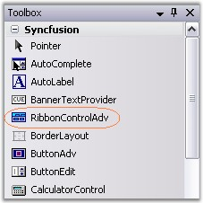
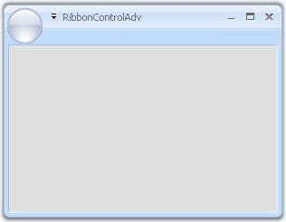
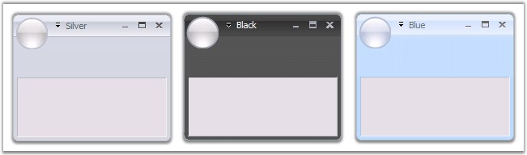
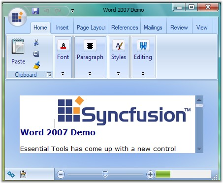
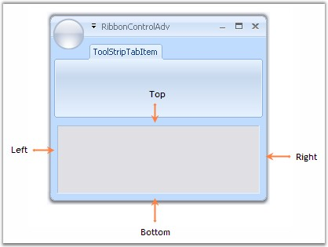
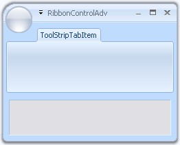

::: {style="DISPLAY: none"}
{#d2h_url_template}{#d2h_package_url style="WIDTH: 0px; DISPLAY: none; HEIGHT: 0px"}
:::

::::: {.d2h_secondary_topic style="PADDING-BOTTOM: 10pt; MARGIN: 0pt; PADDING-LEFT: 0pt; PADDING-RIGHT: 0pt; PADDING-TOP: 0pt"}
##### Ribbon Form {#ribbon-form style="tab-stops: 0pt"}

[]{style="COLOR: #15428b"} 

EssentialStudio now gives a similar look and feel of MS Office 2007, to its Office 2007 controls, using RibbonControlAdv which comes with rounded corners. This section will guide you in creating a Ribbon form using RibbonControlAdv.

[]{style="COLOR: #15428b"} 

Creating Ribbon Form

**[]{style="COLOR: #15428b"}** 

1.   Drag and drop the RibbonControlAdv on to the form.

[]{style="COLOR: #15428b"} 

{border="0"}

[]{style="COLOR: #15428b"} 

Figure 1300: RibbonControlAdv in the Toolbox

[]{style="COLOR: #15428b"} 

2.   To convert an ordinary form to Ribbon form, do the following.

[]{style="COLOR: #15428b"} 

The forms in the application by default will extend to the Form class. Add the respective namespace and programmatically change it as RibbonForm class.

[]{style="COLOR: #15428b"} 

+---------------------------------------------------------------------------------------------------------------------------------------------------------------------------------------------------------------------------------------------------------------------+
| **[\[C#\]]{style="FONT-FAMILY: 'Courier New'; COLOR: black"}**                                                                                                                                                                                                      |
|                                                                                                                                                                                                                                                                     |
| **[]{style="FONT-FAMILY: 'Courier New'; COLOR: black"}**                                                                                                                                                                                                            |
|                                                                                                                                                                                                                                                                     |
| [using]{style="FONT-FAMILY: 'Courier New'; COLOR: blue"}[ Syncfusion.Windows.Forms.Tools;]{style="FONT-FAMILY: 'Courier New'"}                                                                                                                                      |
|                                                                                                                                                                                                                                                                     |
| [public]{style="FONT-FAMILY: 'Courier New'; COLOR: blue"}[ [partial]{style="COLOR: blue"} [class]{style="COLOR: blue"} [Form1]{style="COLOR: teal"} : [RibbonForm]{style="COLOR: teal"} ]{style="FONT-FAMILY: 'Courier New'"}[]{style="FONT-FAMILY: 'Courier New'"} |
+---------------------------------------------------------------------------------------------------------------------------------------------------------------------------------------------------------------------------------------------------------------------+

[]{#p1100}[]{style="COLOR: #15428b"} 

+-------------------------------------------------------------------------------------------------------------------------------------------------------------------+
| **[\[VB.NET\]]{style="FONT-FAMILY: 'Courier New'; COLOR: black"}**                                                                                                |
|                                                                                                                                                                   |
| **[]{style="FONT-FAMILY: 'Courier New'; COLOR: black"}**                                                                                                          |
|                                                                                                                                                                   |
| [Imports]{style="FONT-FAMILY: 'Courier New'; COLOR: blue"}[ Syncfusion.Windows.Forms.Tools]{style="FONT-FAMILY: 'Courier New'"}                                   |
|                                                                                                                                                                   |
| [Partial]{style="FONT-FAMILY: 'Courier New'; COLOR: blue"}[ [Public]{style="COLOR: blue"} [Class]{style="COLOR: blue"} Form1]{style="FONT-FAMILY: 'Courier New'"} |
|                                                                                                                                                                   |
| [Inherits]{style="FONT-FAMILY: 'Courier New'; COLOR: blue"}[ RibbonForm]{style="FONT-FAMILY: 'Courier New'"}[]{style="FONT-FAMILY: 'Courier New'"}                |
+-------------------------------------------------------------------------------------------------------------------------------------------------------------------+

[]{style="COLOR: #15428b"} 

{border="0"}

[]{style="COLOR: #15428b"} 

Figure 1301: Windows Form Converted to Ribbon Form

 

###### []{#_Appearance_Settings_5}3.15.1.2.2.1        Appearance Settings {#appearance-settings style="tab-stops: 0pt"}

[]{style="COLOR: #15428b"} 

This section discusses various appearance and behavior settings of the Ribbon form.

 

**Appearance Settings**

 

The appearance of the ribbon form can be controlled using the below properties.

[]{style="COLOR: #15428b"} 

::: {align="center"}
+-----------------------------------+------------------------------------------------------------------------------+
| []{#p1101}Property                | Description                                                                  |
+-----------------------------------+------------------------------------------------------------------------------+
| Appearance                        | Sets the appearance of the form. The values are,                             |
|                                   |                                                                              |
|                                   |                                                                              |
|                                   |                                                                              |
|                                   | [·      ]{style="FONT-FAMILY: Symbol"}Normal and                             |
|                                   |                                                                              |
|                                   | [·      ]{style="FONT-FAMILY: Symbol"}Office2007 (Default)                   |
|                                   |                                                                              |
|                                   | [·      ]{style="FONT-FAMILY: Symbol"}Office 2010                            |
+-----------------------------------+------------------------------------------------------------------------------+
| ColorScheme                       | Specifies the office color scheme of the Ribbon form. The color schemes are, |
|                                   |                                                                              |
|                                   |                                                                              |
|                                   |                                                                              |
|                                   | [·      ]{style="FONT-FAMILY: Symbol"}Blue,                                  |
|                                   |                                                                              |
|                                   | [·      ]{style="FONT-FAMILY: Symbol"}Black,                                 |
|                                   |                                                                              |
|                                   | [·      ]{style="FONT-FAMILY: Symbol"}Silver and                             |
|                                   |                                                                              |
|                                   | [·      ]{style="FONT-FAMILY: Symbol"}Managed (Default).                     |
+-----------------------------------+------------------------------------------------------------------------------+
:::

[]{#p1102}[]{style="COLOR: #15428b"} 

+-----------------------------------------------------------------------------------------------------------------------------------------------------------------------------------------------------+
| **[\[C#\]]{style="FONT-FAMILY: 'Courier New'; COLOR: black"}**                                                                                                                                      |
|                                                                                                                                                                                                     |
| []{style="COLOR: #15428b"}                                                                                                                                                                          |
|                                                                                                                                                                                                     |
| [this]{style="FONT-FAMILY: 'Courier New'; COLOR: blue"}[.Appearance = AppearanceType.Office2007;]{style="FONT-FAMILY: 'Courier New'; COLOR: black"}                                                 |
|                                                                                                                                                                                                     |
| [this]{style="FONT-FAMILY: 'Courier New'; COLOR: blue"}[.ColorScheme = ColorSchemeType.Blue;]{style="FONT-FAMILY: 'Courier New'; COLOR: black"}[]{style="FONT-FAMILY: 'Courier New'; COLOR: black"} |
+-----------------------------------------------------------------------------------------------------------------------------------------------------------------------------------------------------+

[]{style="COLOR: #15428b"} 

+--------------------------------------------------------------------------------------------------------------------------------------------------------------------------------------------------+
| **[\[VB.NET\]]{style="FONT-FAMILY: 'Courier New'; COLOR: black"}**                                                                                                                               |
|                                                                                                                                                                                                  |
| []{style="COLOR: #15428b"}                                                                                                                                                                       |
|                                                                                                                                                                                                  |
| [Me]{style="FONT-FAMILY: 'Courier New'; COLOR: blue"}[.Appearance = AppearanceType.Office2007]{style="FONT-FAMILY: 'Courier New'; COLOR: black"}                                                 |
|                                                                                                                                                                                                  |
| [Me]{style="FONT-FAMILY: 'Courier New'; COLOR: blue"}[.ColorScheme = ColorSchemeType.Blue]{style="FONT-FAMILY: 'Courier New'; COLOR: black"}[]{style="FONT-FAMILY: 'Courier New'; COLOR: black"} |
+--------------------------------------------------------------------------------------------------------------------------------------------------------------------------------------------------+

**[]{style="COLOR: #15428b"}** 

{border="0"}

**[]{style="COLOR: #15428b"}** 

Figure 1302: Silver, Black and Blue Color Schemes applied to Office2007Style Ribbon Forms

 

Vista Aero Theme

 

Vista Aero theme support is available for Ribbon Form when used in Vista machine.

[]{style="COLOR: #15428b"} 

{border="0"}

***[]{style="COLOR: #15428b"}*** 

Figure 1303: Vista Aero Theme for Ribbon Form

 

###### []{#_Customization}3.15.1.2.2.2        Customization {#customization style="tab-stops: 0pt"}

[]{style="COLOR: #15428b"} 

The property which lets you set borders for the Office2007Style form is as follows.

[]{style="COLOR: #15428b"} 

::: {align="center"}
  ---------- ---------------------------------------------------------------------------------------------------------------------------
  Property   Description
  Borders    Gets/sets the border values of an Office 2007 style form. Sets borders for Left, Top, Right and Bottom sides of the form.
  ---------- ---------------------------------------------------------------------------------------------------------------------------
:::

[]{#p1103}[]{style="COLOR: #15428b"} 

+-----------------------------------------------------------------------------------------------------------------------------------------------------------------------------------------------------------------------------------+
| **[\[C#\]]{style="FONT-FAMILY: 'Courier New'; COLOR: black"}**                                                                                                                                                                    |
|                                                                                                                                                                                                                                   |
| []{style="COLOR: #15428b"}                                                                                                                                                                                                        |
|                                                                                                                                                                                                                                   |
| [this]{style="FONT-FAMILY: 'Courier New'; COLOR: blue"}[.Borders = [new]{style="COLOR: blue"} System.Windows.Forms.[Padding]{style="COLOR: teal"}(10);]{style="FONT-FAMILY: 'Courier New'"}[]{style="FONT-FAMILY: 'Courier New'"} |
+-----------------------------------------------------------------------------------------------------------------------------------------------------------------------------------------------------------------------------------+

[]{#p1104}[]{style="COLOR: #15428b"} 

+---------------------------------------------------------------------------------------------------------------------------------------------------------------------------------------------------------------------------------+
| **[\[VB.NET\]]{style="FONT-FAMILY: 'Courier New'; COLOR: black"}**                                                                                                                                                              |
|                                                                                                                                                                                                                                 |
| []{style="COLOR: #15428b"}                                                                                                                                                                                                      |
|                                                                                                                                                                                                                                 |
| [Me]{style="FONT-FAMILY: 'Courier New'; COLOR: blue"}[.Borders = [New]{style="COLOR: blue"} System.Windows.Forms.[Padding(]{style="COLOR: black"}10)]{style="FONT-FAMILY: 'Courier New'"}[]{style="FONT-FAMILY: 'Courier New'"} |
+---------------------------------------------------------------------------------------------------------------------------------------------------------------------------------------------------------------------------------+

[]{style="COLOR: #15428b"} 

{border="0"}

[]{style="COLOR: #15428b"} 

Figure 1304: Left, Top, Right and Bottom Sides set with Border = \"10\"

**[]{style="COLOR: #15428b"}** 

Customizing the Top Left Edge

**[]{style="COLOR: #15428b"}** 

This **TopLeftRadius** property gets/sets the curved radius of the top left edge of the form. Default is 8.

[]{style="COLOR: #15428b"} 

+-------------------------------------------------------------------------------------------------------------------------------------------------------------------------------------+
| **[\[C#\]]{style="FONT-FAMILY: 'Courier New'; COLOR: black"}**                                                                                                                      |
|                                                                                                                                                                                     |
| []{style="COLOR: #15428b"}                                                                                                                                                          |
|                                                                                                                                                                                     |
| [this]{style="FONT-FAMILY: 'Courier New'; COLOR: blue"}[.TopLeftRadius = 20;]{style="FONT-FAMILY: 'Courier New'; COLOR: black"}[]{style="FONT-FAMILY: 'Courier New'; COLOR: black"} |
+-------------------------------------------------------------------------------------------------------------------------------------------------------------------------------------+

[]{style="COLOR: #15428b"} 

+----------------------------------------------------------------------------------------------------------------------------------------------------------------------------------+
| **[\[VB.NET\]]{style="FONT-FAMILY: 'Courier New'; COLOR: black"}**                                                                                                               |
|                                                                                                                                                                                  |
| []{style="COLOR: #15428b"}                                                                                                                                                       |
|                                                                                                                                                                                  |
| [Me]{style="FONT-FAMILY: 'Courier New'; COLOR: blue"}[.TopLeftRadius = 20]{style="FONT-FAMILY: 'Courier New'; COLOR: black"}[]{style="FONT-FAMILY: 'Courier New'; COLOR: black"} |
+----------------------------------------------------------------------------------------------------------------------------------------------------------------------------------+

[]{style="COLOR: #15428b"} 

{border="0"}

[]{style="COLOR: #15428b"} 

***[]{style="COLOR: #15428b"}*** 

Figure 1305: Top-Left Edge Curved to Radius \"20\"

 

[]{#related-topics}
:::::
