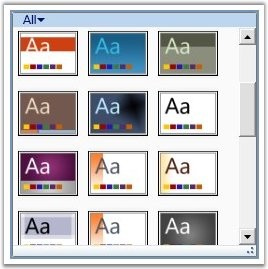

::: {style="DISPLAY: none"}
{#d2h_url_template}{#d2h_package_url style="WIDTH: 0px; DISPLAY: none; HEIGHT: 0px"}
:::

::: {.d2h_secondary_topic style="PADDING-BOTTOM: 10pt; MARGIN: 0pt; PADDING-LEFT: 0pt; PADDING-RIGHT: 0pt; PADDING-TOP: 0pt"}
#### RibbonGallery {#ribbongallery style="tab-stops: 0pt"}

[]{style="FONT-FAMILY: 'Trebuchet MS','sans-serif'; FONT-SIZE: 9pt"} 

Ribbon instance now allows the users to add a Gallery control in both Ribbon, as well as in Ribbon window. Using the Gallery control in Ribbon, items are displayed with good look and feel and it also enables the users to classify the items as groups for easy navigation.

[]{style="FONT-FAMILY: 'Trebuchet MS','sans-serif'; COLOR: #15428b; FONT-SIZE: 9pt"} 

{border="0"}

[]{style="FONT-FAMILY: 'Trebuchet MS','sans-serif'; COLOR: #15428b; FONT-SIZE: 9pt"} 

Figure 864: RibbonGallery

**[]{style="FONT-FAMILY: 'Trebuchet MS','sans-serif'; COLOR: #15428b; FONT-SIZE: 9pt"}** 

See Also

[]{style="FONT-FAMILY: 'Trebuchet MS','sans-serif'; COLOR: #15428b; FONT-SIZE: 9pt"} 

[[RibbonGalleryGroup]{.UGHyperlink}](ms-xhelp:///?Id=32fe1a32-0b03-4fc6-a52f-a2ef70d33820)[, ]{style="FONT-FAMILY: 'Trebuchet MS','sans-serif'; COLOR: #15428b; FONT-SIZE: 9pt"}[[GalleryFilter]{.UGHyperlink}](ms-xhelp:///?Id=cf73910b-fb0c-4422-a44b-698101587853)[]{style="FONT-FAMILY: 'Trebuchet MS','sans-serif'; COLOR: black; FONT-SIZE: 9pt"}

 

[]{#p462} 

More:

[ ]{#related-topics}

[{border="0" align="absMiddle"}Visual Modes](ms-xhelp:///?Id=e4a9e4d6-cd31-4ea9-81b0-37adab10031e){style="TEXT-DECORATION: none"}

[{border="0" align="absMiddle"}Ribbon Gallery Items](ms-xhelp:///?Id=03df9531-e8b0-4ee8-b0b8-567e26bc00c6){style="TEXT-DECORATION: none"}

[{border="0" align="absMiddle"}Ribbon Gallery Groups](ms-xhelp:///?Id=32fe1a32-0b03-4fc6-a52f-a2ef70d33820){style="TEXT-DECORATION: none"}

[{border="0" align="absMiddle"}GalleryFilter](ms-xhelp:///?Id=cf73910b-fb0c-4422-a44b-698101587853){style="TEXT-DECORATION: none"}

[{border="0" align="absMiddle"}Adding Custom Menu Items](ms-xhelp:///?Id=8a95fbc6-ea23-405b-a98c-2d4ae6585b1f){style="TEXT-DECORATION: none"}
:::
