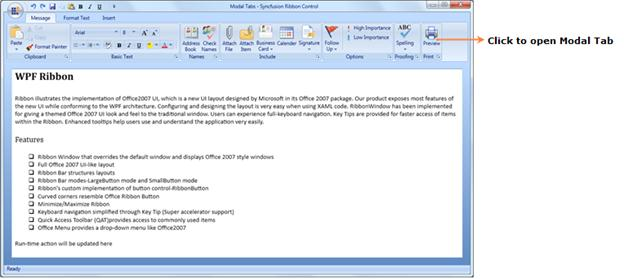
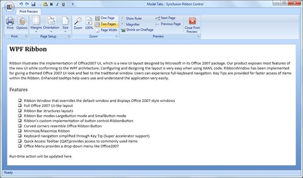

::: {style="DISPLAY: none"}
{#d2h_url_template}{#d2h_package_url style="WIDTH: 0px; DISPLAY: none; HEIGHT: 0px"}
:::

::::: {.d2h_secondary_topic style="PADDING-BOTTOM: 10pt; MARGIN: 0pt; PADDING-LEFT: 0pt; PADDING-RIGHT: 0pt; PADDING-TOP: 0pt"}
#### Ribbon Modal Tabs {#ribbon-modal-tabs style="tab-stops: 0pt"}

[]{style="COLOR: black"} 

Modal Tab in Ribbon Control displays a collection of commands that will be used only in a temporary mode. At this point, the core tabs will be disabled.

**[]{style="FONT-FAMILY: 'Trebuchet MS','sans-serif'; COLOR: #15428b; FONT-SIZE: 9pt"}** 

Use Case Scenarios

[    ]{style="FONT-FAMILY: 'Trebuchet MS','sans-serif'; COLOR: #15428b; FONT-SIZE: 9pt"}

Print Preview is a Modal Tab which displays Print Preview related commands until you close the Modal Tab.

 

{border="0"}

 

Figure 875: Ribbon with Core Tabs

 

 

{border="0"}

 

Figure 876: Ribbon with Modal Tab

 

Adding Modal Tabs to an Application

You can add the Modal Tab in an application by adding Ribbon Tabs in ModalTabCollection property in Ribbon. You can also add all Ribbon Tabs that you want to use as Modal Tab into ModalTabCollection property.

This is illustrated in the code given below.

**** 

+------------------------------------------------------------------------------------------------------------------------------------------------------------------------------------------------------------------------------------------------------------------------------------------------------------------------------------------------------------------------------------------------------------------------------------------------------------------------------------------------------------------------------------------------------------+
| **[\[XAML\]]{style="FONT-FAMILY: 'Courier New'"}**[]{style="FONT-FAMILY: 'Courier New'"}                                                                                                                                                                                                                                                                                                                                                                                                                                                                   |
|                                                                                                                                                                                                                                                                                                                                                                                                                                                                                                                                                            |
| [            ]{style="FONT-FAMILY: 'Courier New'; COLOR: #a31515"}[\<]{style="FONT-FAMILY: 'Courier New'; COLOR: blue"}[syncfusion]{style="FONT-FAMILY: 'Courier New'; COLOR: #a31515"}[:]{style="FONT-FAMILY: 'Courier New'; COLOR: blue"}[Ribbon.ModalTabCollection]{style="FONT-FAMILY: 'Courier New'; COLOR: #a31515"}[ \>]{style="FONT-FAMILY: 'Courier New'; COLOR: blue"}[]{style="FONT-FAMILY: 'Courier New'"}                                                                                                                                     |
|                                                                                                                                                                                                                                                                                                                                                                                                                                                                                                                                                            |
| [                ]{style="FONT-FAMILY: 'Courier New'; COLOR: #a31515"}[\<]{style="FONT-FAMILY: 'Courier New'; COLOR: blue"}[syncfusion]{style="FONT-FAMILY: 'Courier New'; COLOR: #a31515"}[:]{style="FONT-FAMILY: 'Courier New'; COLOR: blue"}[ModalTabCollection]{style="FONT-FAMILY: 'Courier New'; COLOR: #a31515"}[ \>]{style="FONT-FAMILY: 'Courier New'; COLOR: blue"}[]{style="FONT-FAMILY: 'Courier New'"}                                                                                                                                        |
|                                                                                                                                                                                                                                                                                                                                                                                                                                                                                                                                                            |
| [                    ]{style="FONT-FAMILY: 'Courier New'; COLOR: #a31515"}[\<]{style="FONT-FAMILY: 'Courier New'; COLOR: blue"}[syncfusion]{style="FONT-FAMILY: 'Courier New'; COLOR: #a31515"}[:]{style="FONT-FAMILY: 'Courier New'; COLOR: blue"}[RibbonTab]{style="FONT-FAMILY: 'Courier New'; COLOR: #a31515"}[ Caption]{style="FONT-FAMILY: 'Courier New'; COLOR: red"}[=\"Print Preview\"]{style="FONT-FAMILY: 'Courier New'; COLOR: blue"}[ ]{style="FONT-FAMILY: 'Courier New'; COLOR: red"}                                                       |
|                                                                                                                                                                                                                                                                                                                                                                                                                                                                                                                                                            |
| [                                                 Name]{style="FONT-FAMILY: 'Courier New'; COLOR: red"}[=\"printpreviewtab\"\>]{style="FONT-FAMILY: 'Courier New'; COLOR: blue"}[]{style="FONT-FAMILY: 'Courier New'"}                                                                                                                                                                                                                                                                                                                                     |
|                                                                                                                                                                                                                                                                                                                                                                                                                                                                                                                                                            |
| [                        ]{style="FONT-FAMILY: 'Courier New'; COLOR: #a31515"}[\<]{style="FONT-FAMILY: 'Courier New'; COLOR: blue"}[syncfusion]{style="FONT-FAMILY: 'Courier New'; COLOR: #a31515"}[:]{style="FONT-FAMILY: 'Courier New'; COLOR: blue"}[RibbonBar]{style="FONT-FAMILY: 'Courier New'; COLOR: #a31515"}[ Header]{style="FONT-FAMILY: 'Courier New'; COLOR: red"}[=\"Sample Bar\"\>]{style="FONT-FAMILY: 'Courier New'; COLOR: blue"}[]{style="FONT-FAMILY: 'Courier New'"}                                                                  |
|                                                                                                                                                                                                                                                                                                                                                                                                                                                                                                                                                            |
| [                            ]{style="FONT-FAMILY: 'Courier New'; COLOR: #a31515"}[\<]{style="FONT-FAMILY: 'Courier New'; COLOR: blue"}[syncfusion]{style="FONT-FAMILY: 'Courier New'; COLOR: #a31515"}[:]{style="FONT-FAMILY: 'Courier New'; COLOR: blue"}[RibbonButton]{style="FONT-FAMILY: 'Courier New'; COLOR: #a31515"}[ Label]{style="FONT-FAMILY: 'Courier New'; COLOR: red"}[=\"Close Tab\"]{style="FONT-FAMILY: 'Courier New'; COLOR: blue"}[                                                  ]{style="FONT-FAMILY: 'Courier New'; COLOR: red"} |
|                                                                                                                                                                                                                                                                                                                                                                                                                                                                                                                                                            |
| [                                         Click]{style="FONT-FAMILY: 'Courier New'; COLOR: red"}[=\"CloseModalTab_Click\"/\>]{style="FONT-FAMILY: 'Courier New'; COLOR: blue"}[]{style="FONT-FAMILY: 'Courier New'"}                                                                                                                                                                                                                                                                                                                                       |
|                                                                                                                                                                                                                                                                                                                                                                                                                                                                                                                                                            |
| [                        ]{style="FONT-FAMILY: 'Courier New'; COLOR: #a31515"}[\</]{style="FONT-FAMILY: 'Courier New'; COLOR: blue"}[syncfusion]{style="FONT-FAMILY: 'Courier New'; COLOR: #a31515"}[:]{style="FONT-FAMILY: 'Courier New'; COLOR: blue"}[RibbonBar]{style="FONT-FAMILY: 'Courier New'; COLOR: #a31515"}[\>]{style="FONT-FAMILY: 'Courier New'; COLOR: blue"}[]{style="FONT-FAMILY: 'Courier New'"}                                                                                                                                         |
|                                                                                                                                                                                                                                                                                                                                                                                                                                                                                                                                                            |
| [                    ]{style="FONT-FAMILY: 'Courier New'; COLOR: #a31515"}[\</]{style="FONT-FAMILY: 'Courier New'; COLOR: blue"}[syncfusion]{style="FONT-FAMILY: 'Courier New'; COLOR: #a31515"}[:]{style="FONT-FAMILY: 'Courier New'; COLOR: blue"}[RibbonTab]{style="FONT-FAMILY: 'Courier New'; COLOR: #a31515"}[\>]{style="FONT-FAMILY: 'Courier New'; COLOR: blue"}[]{style="FONT-FAMILY: 'Courier New'"}                                                                                                                                             |
|                                                                                                                                                                                                                                                                                                                                                                                                                                                                                                                                                            |
| [                ]{style="FONT-FAMILY: 'Courier New'; COLOR: #a31515"}[\</]{style="FONT-FAMILY: 'Courier New'; COLOR: blue"}[syncfusion]{style="FONT-FAMILY: 'Courier New'; COLOR: #a31515"}[:]{style="FONT-FAMILY: 'Courier New'; COLOR: blue"}[ModalTabCollection]{style="FONT-FAMILY: 'Courier New'; COLOR: #a31515"}[\>]{style="FONT-FAMILY: 'Courier New'; COLOR: blue"}[]{style="FONT-FAMILY: 'Courier New'"}                                                                                                                                        |
|                                                                                                                                                                                                                                                                                                                                                                                                                                                                                                                                                            |
| [            ]{style="FONT-FAMILY: 'Courier New'; COLOR: #a31515"}[\</]{style="FONT-FAMILY: 'Courier New'; COLOR: blue"}[syncfusion]{style="FONT-FAMILY: 'Courier New'; COLOR: #a31515"}[:]{style="FONT-FAMILY: 'Courier New'; COLOR: blue"}[Ribbon.ModalTabCollection]{style="FONT-FAMILY: 'Courier New'; COLOR: #a31515"}[\>]{style="FONT-FAMILY: 'Courier New'; COLOR: blue"}                                                                                                                                                                           |
|                                                                                                                                                                                                                                                                                                                                                                                                                                                                                                                                                            |
|                                                                                                                                                                                                                                                                                                                                                                                                                                                                                                                                                            |
+------------------------------------------------------------------------------------------------------------------------------------------------------------------------------------------------------------------------------------------------------------------------------------------------------------------------------------------------------------------------------------------------------------------------------------------------------------------------------------------------------------------------------------------------------------+

 

After adding this collection in Ribbon, you can then handle the Modal Tab visibility by using the following methods at any time.

[]{style="FONT-FAMILY: 'Trebuchet MS','sans-serif'; COLOR: #15428b; FONT-SIZE: 9pt"} 

[]{style="FONT-FAMILY: 'Trebuchet MS','sans-serif'; COLOR: #15428b; FONT-SIZE: 9pt"} 

Tables for properties, methods

 

Properties

**[]{style="FONT-FAMILY: 'Myriad Pro','sans-serif'"}** 

Table 22: ModalTabCollection Table

**[]{style="FONT-FAMILY: 'Myriad Pro','sans-serif'"}** 

  -------------------- ----------------------------------------------------------------------- ---------------------- --------------------- -----------------
  Property             Description                                                             Type                   Data Type             Default Value
  ModalTabCollection   Used to store the collection of Ribbon Tabs as Modal Tabs Collection.    Dependency Property   ModalTabsCollection   Null Collection
  -------------------- ----------------------------------------------------------------------- ---------------------- --------------------- -----------------

[]{style="FONT-FAMILY: 'Calibri','sans-serif'; COLOR: black"} 

Methods

**[]{style="FONT-FAMILY: 'Myriad Pro','sans-serif'"}** 

Table 23: ShowModalTab Table

**[]{style="FONT-FAMILY: 'Myriad Pro','sans-serif'"}** 

::: {align="center"}
+--------------+-------------------------------------------------------------------------------------+-------------------------------------------------------------------------------------+-------------+------------------------------------------------------------------------------------------------------------------------------------+
| Method       | Description                                                                         | Parameters                                                                          | Return Type | Reference links                                                                                                                    |
+--------------+-------------------------------------------------------------------------------------+-------------------------------------------------------------------------------------+-------------+------------------------------------------------------------------------------------------------------------------------------------+
| ShowModalTab | This method will show the specific Modal Tab in the Ribbon from ModalTabCollection. | (string arg1)                                                                       | bool        | [[How to Show a ModalTab?]{style="COLOR: windowtext; TEXT-DECORATION: none; text-underline: none"}](#HowtohandleModalTabsinRibbon) |
|              |                                                                                     |                                                                                     |             |                                                                                                                                    |
|              |                                                                                     |                                                                                     |             |                                                                                                                                    |
|              |                                                                                     |                                                                                     |             |                                                                                                                                    |
|              |                                                                                     |  arg1- Name of the Ribbon Tab to be displayed as Modal Tab from ModalTabCollection. |             |                                                                                                                                    |
+==============+=====================================================================================+=====================================================================================+=============+====================================================================================================================================+
:::

[]{style="FONT-FAMILY: 'Calibri','sans-serif'; COLOR: black"} 

Table 24: CloseModalTabs Table

::: {align="center"}
  Method           Description                                                                 Parameters   Return Type   Reference links
  ---------------- --------------------------------------------------------------------------- ------------ ------------- -----------------------------------------------------------------------------------------------------------------------------------------------------------------------------------------------------------------------------------------------
  CloseModalTabs   CloseModalTabs method will close the opened Modal Tabs in Ribbon control.    No Params   bool           [[[How to close ModalTabs?]{style="COLOR: windowtext; TEXT-DECORATION: none; text-underline: none"}]{.UGHyperlink}](#HowtohandleModalTabsinRibbon)[[]{style="COLOR: windowtext; TEXT-DECORATION: none; text-underline: none"}]{.UGHyperlink}
:::

[]{#_How_to_handle} 

[How to handle Modal Tabs in Ribbon?]{#HowtohandleModalTabsinRibbon}

You can add Ribbon Tabs that you want to display as Modal Tabs to ModalTabCollection property in the Ribbon Control. The ShowModalTab and CloseModalTabs methods handle Modal Tabs in the Ribbon control. You can display any Modal Tab from the ModalTabCollection property whenever required.

 

You can call ShowModalTab method to show the specific Modal Tab in Ribbon. This can be done from any event of core Ribbon Tab element.

This is illustrated in the code given below.

[]{style="FONT-FAMILY: 'Trebuchet MS','sans-serif'; COLOR: #15428b; FONT-SIZE: 9pt"} 

+---------------------------------------------------------------------------------------------------------------------------------------------------------------------------------------------------------------------------------------+
| **[\[C#\]]{style="FONT-FAMILY: 'Courier New'"}**                                                                                                                                                                                      |
|                                                                                                                                                                                                                                       |
| []{style="FONT-FAMILY: 'Courier New'"}                                                                                                                                                                                                |
|                                                                                                                                                                                                                                       |
| [private]{style="FONT-FAMILY: 'Courier New'; COLOR: blue"}[ [void]{style="COLOR: blue"} ShowModalTabBtn_Click([object]{style="COLOR: blue"} sender, [RoutedEventArgs]{style="COLOR: #2b91af"} e)]{style="FONT-FAMILY: 'Courier New'"} |
|                                                                                                                                                                                                                                       |
| [        {]{style="FONT-FAMILY: 'Courier New'"}                                                                                                                                                                                       |
|                                                                                                                                                                                                                                       |
| [            [this]{style="COLOR: blue"}.MyRibbon.ShowModalTab([\"printpreviewtab\"]{style="COLOR: #a31515"});]{style="FONT-FAMILY: 'Courier New'"}                                                                                   |
|                                                                                                                                                                                                                                       |
| [        }]{style="FONT-FAMILY: 'Courier New'"}                                                                                                                                                                                       |
|                                                                                                                                                                                                                                       |
|                                                                                                                                                                                                                                       |
+---------------------------------------------------------------------------------------------------------------------------------------------------------------------------------------------------------------------------------------+

 

CloseModalTabs method will close the currently opened Modal Tab in Ribbon control. This method should be called in any event of currently displaying Modal Tab element.

This is illustrated in the code given below.

 

+----------------------------------------------------------------------------------------------------------------------------------------------------------------------------------------------------------------------------------------+
| **[\[C#\]]{style="FONT-FAMILY: 'Courier New'"}**                                                                                                                                                                                       |
|                                                                                                                                                                                                                                        |
| []{style="FONT-FAMILY: 'Courier New'; COLOR: blue"}                                                                                                                                                                                    |
|                                                                                                                                                                                                                                        |
| [private]{style="FONT-FAMILY: 'Courier New'; COLOR: blue"}[ [void]{style="COLOR: blue"} CloseModalTabBtn_Click([object]{style="COLOR: blue"} sender, [RoutedEventArgs]{style="COLOR: #2b91af"} e)]{style="FONT-FAMILY: 'Courier New'"} |
|                                                                                                                                                                                                                                        |
| [        {]{style="FONT-FAMILY: 'Courier New'"}                                                                                                                                                                                        |
|                                                                                                                                                                                                                                        |
| [            [this]{style="COLOR: blue"}.MyRibbon.CloseModalTabs();]{style="FONT-FAMILY: 'Courier New'"}                                                                                                                               |
|                                                                                                                                                                                                                                        |
| [        }]{style="FONT-FAMILY: 'Courier New'"}                                                                                                                                                                                        |
|                                                                                                                                                                                                                                        |
|                                                                                                                                                                                                                                        |
+----------------------------------------------------------------------------------------------------------------------------------------------------------------------------------------------------------------------------------------+

[]{style="FONT-FAMILY: 'Calibri','sans-serif'; COLOR: black"} 

[]{style="COLOR: #c00000"} 

Sample Link

Tools [à]{style="FONT-FAMILY: Wingdings"} Ribbon  [à]{style="FONT-FAMILY: Wingdings"} Modal Tabs

 

[]{#related-topics}
:::::
