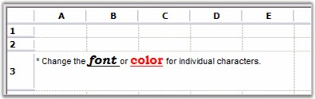

::: {style="DISPLAY: none"}
{#d2h_url_template}{#d2h_package_url style="WIDTH: 0px; DISPLAY: none; HEIGHT: 0px"}
:::

::: {.d2h_secondary_topic style="PADDING-BOTTOM: 10pt; MARGIN: 0pt; PADDING-LEFT: 0pt; PADDING-RIGHT: 0pt; PADDING-TOP: 0pt"}
##### Rich Text {#rich-text style="tab-stops: 0pt"}

[]{style="FONT-FAMILY: 'Trebuchet MS','sans-serif'; COLOR: #15428b; FONT-SIZE: 9pt"} 

The **Rich Text** control will allow you to display and edit Rich Text in grid cells. The control enables you to optionally drop down an editable Rich Text window using which you can modify the Rich Text in the cell.

 

The following code example illustrates how to set the cell type to RichText.

[]{style="FONT-FAMILY: 'Courier New'; COLOR: #15428b"} 

+---------------------------------------------------------------------------------------------------------------------------------------------------------------------+
| **[\[C#\]]{style="FONT-FAMILY: 'Courier New'; COLOR: black"}**                                                                                                      |
|                                                                                                                                                                     |
| []{style="FONT-FAMILY: 'Courier New'; COLOR: black"}                                                                                                                |
|                                                                                                                                                                     |
| [// Create a Rich Text Format.]{style="FONT-FAMILY: 'Courier New'; COLOR: green"}                                                                                   |
|                                                                                                                                                                     |
| [string]{style="FONT-FAMILY: 'Courier New'; COLOR: blue"}[ rtf = ]{style="FONT-FAMILY: 'Courier New'"}                                                              |
|                                                                                                                                                                     |
| [@\"{\"]{style="FONT-FAMILY: 'Courier New'; COLOR: #a31515"}[ +]{style="FONT-FAMILY: 'Courier New'"}                                                                |
|                                                                                                                                                                     |
| [@\"\\rtf1\\ansi\\deff0\\deftab720\"]{style="FONT-FAMILY: 'Courier New'; COLOR: #a31515"}[ +]{style="FONT-FAMILY: 'Courier New'"}                                   |
|                                                                                                                                                                     |
| [@\"{\"]{style="FONT-FAMILY: 'Courier New'; COLOR: #a31515"}[ +]{style="FONT-FAMILY: 'Courier New'"}                                                                |
|                                                                                                                                                                     |
| [@\"\\fonttbl\"]{style="FONT-FAMILY: 'Courier New'; COLOR: #a31515"}[ +]{style="FONT-FAMILY: 'Courier New'"}                                                        |
|                                                                                                                                                                     |
| [@\"{\\f0\\fswiss MS Sans Serif;}\"]{style="FONT-FAMILY: 'Courier New'; COLOR: #a31515"}[ +]{style="FONT-FAMILY: 'Courier New'"}                                    |
|                                                                                                                                                                     |
| [@\"{\\f1\\froman\\fcharset2 Symbol;}\"]{style="FONT-FAMILY: 'Courier New'; COLOR: #a31515"}[ +]{style="FONT-FAMILY: 'Courier New'"}                                |
|                                                                                                                                                                     |
| [@\"{\\f2\\fswiss\\fprq2 System;}\"]{style="FONT-FAMILY: 'Courier New'; COLOR: #a31515"}[ +]{style="FONT-FAMILY: 'Courier New'"}                                    |
|                                                                                                                                                                     |
| [@\"{\\f3\\fswiss\\fprq2 Arial;}\"]{style="FONT-FAMILY: 'Courier New'; COLOR: #a31515"}[ +]{style="FONT-FAMILY: 'Courier New'"}                                     |
|                                                                                                                                                                     |
| [@\"{\\f4\\froman Bookman Old Style;}\"]{style="FONT-FAMILY: 'Courier New'; COLOR: #a31515"}[ +]{style="FONT-FAMILY: 'Courier New'"}                                |
|                                                                                                                                                                     |
| [@\"}\"]{style="FONT-FAMILY: 'Courier New'; COLOR: #a31515"}[ +]{style="FONT-FAMILY: 'Courier New'"}                                                                |
|                                                                                                                                                                     |
| [@\"{\\colortbl\\red0\\green0\\blue0;\\red255\\green0\\blue0;}\"]{style="FONT-FAMILY: 'Courier New'; COLOR: #a31515"}[ +]{style="FONT-FAMILY: 'Courier New'"}       |
|                                                                                                                                                                     |
| [@\"\\deflang1033\\cfpat1\\pard\\plain\\f3\\fs16\\cf0 \* Change the \"]{style="FONT-FAMILY: 'Courier New'; COLOR: #a31515"}[ +]{style="FONT-FAMILY: 'Courier New'"} |
|                                                                                                                                                                     |
| [@\"\\plain\\f4\\fs24\\cf0\\b\\i\\ul font \\plain\\f3\\fs16\\cf0 or \"]{style="FONT-FAMILY: 'Courier New'; COLOR: #a31515"}[ +]{style="FONT-FAMILY: 'Courier New'"} |
|                                                                                                                                                                     |
| [@\"\\plain\\f4\\fs24\\cf1\\b\\ul color\\plain\\f3\\fs16\\cf0  \"]{style="FONT-FAMILY: 'Courier New'; COLOR: #a31515"}[ +]{style="FONT-FAMILY: 'Courier New'"}      |
|                                                                                                                                                                     |
| [@\"for individual characters.\\par \"]{style="FONT-FAMILY: 'Courier New'; COLOR: #a31515"}[ +]{style="FONT-FAMILY: 'Courier New'"}                                 |
|                                                                                                                                                                     |
| [\" }\"]{style="FONT-FAMILY: 'Courier New'; COLOR: #a31515"}                                                                                                        |
|                                                                                                                                                                     |
| [;]{style="FONT-FAMILY: 'Courier New'"}                                                                                                                             |
|                                                                                                                                                                     |
| []{style="FONT-FAMILY: 'Courier New'"}                                                                                                                              |
|                                                                                                                                                                     |
| [// Set up a Rich Text Cell.]{style="FONT-FAMILY: 'Courier New'; COLOR: green"}                                                                                     |
|                                                                                                                                                                     |
| [gridControl1\[rowIndex, 1\].CellType = [\"RichText\"]{style="COLOR: #a31515"};]{style="FONT-FAMILY: 'Courier New'"}                                                |
|                                                                                                                                                                     |
| [gridControl1\[rowIndex, 1\].Text = rtf;]{style="FONT-FAMILY: 'Courier New'"}                                                                                       |
|                                                                                                                                                                     |
| [gridControl1.RowHeights\[rowIndex\] = 50;]{style="FONT-FAMILY: 'Courier New'"}                                                                                     |
|                                                                                                                                                                     |
| [gridControl1.CoveredRanges.Add([GridRangeInfo]{style="COLOR: #2b91af"}.Cells(rowIndex, 1, rowIndex, 5));]{style="FONT-FAMILY: 'Courier New'"}                      |
+---------------------------------------------------------------------------------------------------------------------------------------------------------------------+

[]{style="FONT-FAMILY: 'Trebuchet MS','sans-serif'; COLOR: #15428b; FONT-SIZE: 9pt"} 

+-------------------------------------------------------------------------------------------------------------------------------------------------------------------------------------------------+
| **[\[VB.NET\]]{style="FONT-FAMILY: 'Courier New'; COLOR: black"}**                                                                                                                              |
|                                                                                                                                                                                                 |
| []{style="FONT-FAMILY: 'Courier New'; COLOR: black"}                                                                                                                                            |
|                                                                                                                                                                                                 |
| [\' Create a Rich Text Format.]{style="FONT-FAMILY: 'Courier New'; COLOR: green"}                                                                                                               |
|                                                                                                                                                                                                 |
| [Dim]{style="FONT-FAMILY: 'Courier New'; COLOR: blue"}[ rtf [As]{style="COLOR: blue"} [String]{style="COLOR: blue"} = [\"{\"]{style="COLOR: #a31515"} + \_]{style="FONT-FAMILY: 'Courier New'"} |
|                                                                                                                                                                                                 |
| [\"\\rtf1\\ansi\\deff0\\deftab720\"]{style="FONT-FAMILY: 'Courier New'; COLOR: #a31515"}[ + \_]{style="FONT-FAMILY: 'Courier New'"}                                                             |
|                                                                                                                                                                                                 |
| [\"{\"]{style="FONT-FAMILY: 'Courier New'; COLOR: #a31515"}[ + \_]{style="FONT-FAMILY: 'Courier New'"}                                                                                          |
|                                                                                                                                                                                                 |
| [\"\\fonttbl\"]{style="FONT-FAMILY: 'Courier New'; COLOR: #a31515"}[ + \_]{style="FONT-FAMILY: 'Courier New'"}                                                                                  |
|                                                                                                                                                                                                 |
| [\"{\\f0\\fswiss MS Sans Serif;}\"]{style="FONT-FAMILY: 'Courier New'; COLOR: #a31515"}[ + \_]{style="FONT-FAMILY: 'Courier New'"}                                                              |
|                                                                                                                                                                                                 |
| [\"{\\f1\\froman\\fcharset2 Symbol;}\"]{style="FONT-FAMILY: 'Courier New'; COLOR: #a31515"}[ + \_]{style="FONT-FAMILY: 'Courier New'"}                                                          |
|                                                                                                                                                                                                 |
| [\"{\\f2\\fswiss\\fprq2 System;}\"]{style="FONT-FAMILY: 'Courier New'; COLOR: #a31515"}[ + \_]{style="FONT-FAMILY: 'Courier New'"}                                                              |
|                                                                                                                                                                                                 |
| [\"{\\f3\\fswiss\\fprq2 Arial;}\"]{style="FONT-FAMILY: 'Courier New'; COLOR: #a31515"}[ + \_]{style="FONT-FAMILY: 'Courier New'"}                                                               |
|                                                                                                                                                                                                 |
| [\"{\\f4\\froman Bookman Old Style;}\"]{style="FONT-FAMILY: 'Courier New'; COLOR: #a31515"}[ + \_]{style="FONT-FAMILY: 'Courier New'"}                                                          |
|                                                                                                                                                                                                 |
| [\"}\"]{style="FONT-FAMILY: 'Courier New'; COLOR: #a31515"}[ + \_]{style="FONT-FAMILY: 'Courier New'"}                                                                                          |
|                                                                                                                                                                                                 |
| [\"{\\colortbl\\red0\\green0\\blue0;\\red255\\green0\\blue0;}\"]{style="FONT-FAMILY: 'Courier New'; COLOR: #a31515"}[ + \_]{style="FONT-FAMILY: 'Courier New'"}                                 |
|                                                                                                                                                                                                 |
| [\"\\deflang1033\\cfpat1\\pard\\plain\\f3\\fs16\\cf0 \* Change the \"]{style="FONT-FAMILY: 'Courier New'; COLOR: #a31515"}[ + \_]{style="FONT-FAMILY: 'Courier New'"}                           |
|                                                                                                                                                                                                 |
| [\"\\plain\\f4\\fs24\\cf0\\b\\i\\ul font \\plain\\f3\\fs16\\cf0 or \"]{style="FONT-FAMILY: 'Courier New'; COLOR: #a31515"}[ + \_]{style="FONT-FAMILY: 'Courier New'"}                           |
|                                                                                                                                                                                                 |
| [\"\\plain\\f4\\fs24\\cf1\\b\\ul color\\plain\\f3\\fs16\\cf0  \"]{style="FONT-FAMILY: 'Courier New'; COLOR: #a31515"}[ + \_]{style="FONT-FAMILY: 'Courier New'"}                                |
|                                                                                                                                                                                                 |
| [\"for individual characters.\\par \"]{style="FONT-FAMILY: 'Courier New'; COLOR: #a31515"}[ + \_]{style="FONT-FAMILY: 'Courier New'"}                                                           |
|                                                                                                                                                                                                 |
| [\" }\"]{style="FONT-FAMILY: 'Courier New'; COLOR: #a31515"}                                                                                                                                    |
|                                                                                                                                                                                                 |
| []{style="FONT-FAMILY: 'Courier New'; COLOR: #a31515"}                                                                                                                                          |
|                                                                                                                                                                                                 |
| [\' Set up a Rich Text Cell. ]{style="FONT-FAMILY: 'Courier New'; COLOR: green"}                                                                                                                |
|                                                                                                                                                                                                 |
| [gridControl1(rowIndex, 1).CellType = [\"RichText\"]{style="COLOR: #a31515"}]{style="FONT-FAMILY: 'Courier New'"}                                                                               |
|                                                                                                                                                                                                 |
| [gridControl1(rowIndex, 1).Text = rtf]{style="FONT-FAMILY: 'Courier New'"}                                                                                                                      |
|                                                                                                                                                                                                 |
| [gridControl1.RowHeights(rowIndex) = 50]{style="FONT-FAMILY: 'Courier New'"}                                                                                                                    |
|                                                                                                                                                                                                 |
| [gridControl1.CoveredRanges.Add(GridRangeInfo.Cells(rowIndex, 1, rowIndex, 5))]{style="FONT-FAMILY: 'Courier New'"}                                                                             |
+-------------------------------------------------------------------------------------------------------------------------------------------------------------------------------------------------+

[]{style="FONT-FAMILY: 'Trebuchet MS','sans-serif'; COLOR: #15428b; FONT-SIZE: 9pt"} 

{border="0"}

[]{style="FONT-FAMILY: 'Trebuchet MS','sans-serif'; COLOR: #15428b; FONT-SIZE: 9pt"} 

*[Figure ]{style="FONT-SIZE: 9pt"}[88]{style="FONT-SIZE: 9pt"}[: Rich Text Cells]{style="FONT-SIZE: 9pt"}*

 

[]{#p64} 

 

[]{#related-topics}
:::
