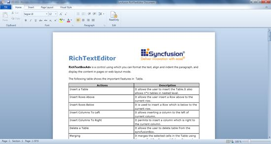

::: {style="DISPLAY: none"}
{#d2h_url_template}{#d2h_package_url style="WIDTH: 0px; DISPLAY: none; HEIGHT: 0px"}
:::

::::: {#nsbanner .d2h_main_nsbanner style="BORDER-BOTTOM: #999999 1px solid; POSITION: relative; PADDING-BOTTOM: 0px; BACKGROUND-COLOR: transparent; PADDING-LEFT: 0px; PADDING-RIGHT: 0px; DISPLAY: none; BORDER-TOP: #999999 1px solid; PADDING-TOP: 0px; LEFT: 0px"}
:::: {#TitleRow .d2h_main_titlerow style="PADDING-BOTTOM: 4px; BACKGROUND-COLOR: transparent; PADDING-LEFT: 22px; WIDTH: 100%; PADDING-RIGHT: 10px; DISPLAY: none; PADDING-TOP: 4px"}
::: {#ienav .d2h_main_ienav style="DISPLAY: none"}
{#D2HPrevious .D2HPreviousEnabled}  {#D2HNext .D2HNextEnabled}
:::
::::
:::::

:::: {#nstext .d2h_main_nstext style="PADDING-BOTTOM: 10px; BACKGROUND-COLOR: transparent; PADDING-LEFT: 22px; PADDING-RIGHT: 10px; HEIGHT: 100%; OVERFLOW: auto; PADDING-TOP: 5px" hasuserbackground="true" valign="bottom"}
::: {#d2h_breadcrumbs .d2h_breadcrumbs}
[Essential Studio User Guide Documentation](ms-xhelp:///?Id=12457748-09e3-4d74-a240-8e049cedf030){.d2h_breadcrumbsNormal}[ \> ]{.d2h_breadcrumbsLinkSeparator}[User Interface Edition](ms-xhelp:///?Id=c29296b7-531c-413b-a0ec-488ca1f7f669){.d2h_breadcrumbsNormal}[ \> ]{.d2h_breadcrumbsLinkSeparator}[Essential WPF](ms-xhelp:///?Id=7f4f82c5-151c-4262-94d0-75c4626c77bc){.d2h_breadcrumbsNormal}[ \> ]{.d2h_breadcrumbsLinkSeparator}[Essential Tools]{.d2h_breadcrumbsContentsOnly}[ \> ]{.d2h_breadcrumbsLinkSeparator}[Tools WPF Controls](ms-xhelp:///?Id=2ea58a12-9426-4a63-96b4-89eb80232c2c){.d2h_breadcrumbsNormal}
:::

## RichTextBoxAdv Control {#richtextboxadv-control style="tab-stops: 0pt"}

RichTextBoxAdv is a control for formatting text, such as aligning and indenting paragraphs, and displaying the content in pages or in a Web layout mode.

 

{border="0"}

 

The features of the RichTextBoxAdv control include:

1.  [Clipboard support]{style="FONT-FAMILY: 'Arial','sans-serif'"}

2.  [Text formatting]{style="FONT-FAMILY: 'Arial','sans-serif'"}

3.  [Paragraph alignment and indentation features like text alignment, line spacing, left indent, right indent, before spacing, and after spacing]{style="FONT-FAMILY: 'Arial','sans-serif'"}

4.  [Command support]{style="FONT-FAMILY: 'Arial','sans-serif'"}

5.  [Insert an image or UIElement into RichTextBoxAdv]{style="FONT-FAMILY: 'Arial','sans-serif'"}

6.  [Page layout]{style="FONT-FAMILY: 'Arial','sans-serif'"}

7.  [Import and export feature for .doc, .docx, .html, .xaml, and .txt file formats]{style="FONT-FAMILY: 'Arial','sans-serif'"}

8.  [Printing and zooming]{style="FONT-FAMILY: 'Arial','sans-serif'"}

9.  [Keyboard shortcuts]{style="FONT-FAMILY: 'Arial','sans-serif'"}

10\. [Undo and redo support]{style="FONT-FAMILY: 'Arial','sans-serif'"}

11\. [Disable editing using the **IsReadOnly** property]{style="FONT-FAMILY: 'Arial','sans-serif'"}

Use Case Scenarios

This control helps users with rich text formatting such as bold, italic, highlighting, aligning, indenting paragraphs, and so on. It can also be used in forums, blogs, and so on.

1.  It can be used like MS Word in rich content applications.

2.  It can be used as an HTML editor control as it has the HTML export feature.

3.  The built-in commands help to create customized toolbar applications.

Sample Link

The access the samples:

1.  Select **Start** \> **Programs** \> **Syncfusion** \> **Essential Studio x.x.x.x** \> **Dashboard**.

2.  Select **Run Locally Installed Samples**.

3.  Now expand the **RichTextBoxAdv** item in the sample browser.

4.  Choose the **OfficeUI Demo**.

More:

[ ]{#related-topics}

[{border="0" align="absMiddle"}Adding RichTextBoxAdv to an Application](ms-xhelp:///?Id=33f472cb-c1c4-443a-b36f-06f4a06c22bb){style="TEXT-DECORATION: none"}

[{border="0" align="absMiddle"}Appearance](ms-xhelp:///?Id=4b8fed3f-3d9c-42c9-a42c-09db4f7741fb){style="TEXT-DECORATION: none"}

[{border="0" align="absMiddle"}Features](ms-xhelp:///?Id=1c85664d-494f-4e10-a514-997b8745076b){style="TEXT-DECORATION: none"}
::::
