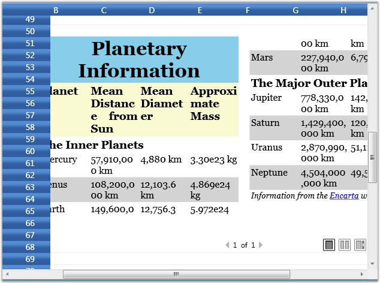

::: {style="DISPLAY: none"}
{#d2h_url_template}{#d2h_package_url style="WIDTH: 0px; DISPLAY: none; HEIGHT: 0px"}
:::

::: {.d2h_secondary_topic style="PADDING-BOTTOM: 10pt; MARGIN: 0pt; PADDING-LEFT: 0pt; PADDING-RIGHT: 0pt; PADDING-TOP: 0pt"}
##### Rich Text Box Cells {#rich-text-box-cells style="tab-stops: 0pt"}

The Rich Text control will allow you to display and edit rich text in grid cells. The control will allow you to modify the rich text through in-place editing.

 

Example

 

It can be built by hosting the Rich Text Box control in grid cells. To host this control, the cellrenderer must be derived from GridVirtualizingCellRenderer, whose OnIntializeContent should be overridden to provide the content (as Flow Document) for the rich text box.

 

CellModel class

**[]{style="COLOR: #15428b"}** 

+------------------------------------------------------------------------------------------------------------------------------------------------------------------------------------------------------------------------+
| [\[C#\]]{style="FONT-FAMILY: 'Courier New'; COLOR: black"}                                                                                                                                                             |
|                                                                                                                                                                                                                        |
| []{style="FONT-FAMILY: 'Courier New'; COLOR: blue"}                                                                                                                                                                    |
|                                                                                                                                                                                                                        |
| [public]{style="FONT-FAMILY: 'Courier New'; COLOR: blue"}[ [class]{style="COLOR: blue"} [RichTextBoxCellModel]{style="COLOR: #2b91af"} : GridCellModel\<RichTextBoxCellRenderer\>]{style="FONT-FAMILY: 'Courier New'"} |
|                                                                                                                                                                                                                        |
| [{]{style="FONT-FAMILY: 'Courier New'"}                                                                                                                                                                                |
|                                                                                                                                                                                                                        |
| [}]{style="FONT-FAMILY: 'Courier New'"}                                                                                                                                                                                |
+------------------------------------------------------------------------------------------------------------------------------------------------------------------------------------------------------------------------+

[]{style="COLOR: #15428b"} 

CellRenderer class

[]{style="COLOR: #15428b"} 

+--------------------------------------------------------------------------------------------------------------------------------------------------------------------------------------------------------------------------------------------------------+
| [\[C#\]]{style="FONT-FAMILY: 'Courier New'; COLOR: black"}                                                                                                                                                                                             |
|                                                                                                                                                                                                                                                        |
| []{style="FONT-FAMILY: 'Courier New'; COLOR: blue"}                                                                                                                                                                                                    |
|                                                                                                                                                                                                                                                        |
| [public]{style="FONT-FAMILY: 'Courier New'; COLOR: blue"}[ [class]{style="COLOR: blue"} [RichTextBoxCellRenderer]{style="COLOR: #2b91af"} : GridVirtualizingCellRenderer\<[RichTextBox]{style="COLOR: #2b91af"}\>]{style="FONT-FAMILY: 'Courier New'"} |
|                                                                                                                                                                                                                                                        |
| [{]{style="FONT-FAMILY: 'Courier New'"}                                                                                                                                                                                                                |
|                                                                                                                                                                                                                                                        |
| [    [public]{style="COLOR: blue"} RichTextBoxCellRenderer()]{style="FONT-FAMILY: 'Courier New'"}                                                                                                                                                      |
|                                                                                                                                                                                                                                                        |
| [    {]{style="FONT-FAMILY: 'Courier New'"}                                                                                                                                                                                                            |
|                                                                                                                                                                                                                                                        |
| [        IsControlTextShown = [false]{style="COLOR: blue"};]{style="FONT-FAMILY: 'Courier New'"}                                                                                                                                                       |
|                                                                                                                                                                                                                                                        |
| [        IsFocusable = [true]{style="COLOR: blue"};]{style="FONT-FAMILY: 'Courier New'"}                                                                                                                                                               |
|                                                                                                                                                                                                                                                        |
| [    }]{style="FONT-FAMILY: 'Courier New'"}                                                                                                                                                                                                            |
|                                                                                                                                                                                                                                                        |
| []{style="FONT-FAMILY: 'Courier New'"}                                                                                                                                                                                                                 |
|                                                                                                                                                                                                                                                        |
| [    [public]{style="COLOR: blue"} [override]{style="COLOR: blue"} [void]{style="COLOR: blue"} OnInitializeContent([RichTextBox]{style="COLOR: #2b91af"} textBox, GridRenderStyleInfo style)]{style="FONT-FAMILY: 'Courier New'"}                      |
|                                                                                                                                                                                                                                                        |
| [    {]{style="FONT-FAMILY: 'Courier New'"}                                                                                                                                                                                                            |
|                                                                                                                                                                                                                                                        |
| [        textBox.Padding = [new]{style="COLOR: blue"} [Thickness]{style="COLOR: #2b91af"}(0);]{style="FONT-FAMILY: 'Courier New'"}                                                                                                                     |
|                                                                                                                                                                                                                                                        |
| []{style="FONT-FAMILY: 'Courier New'"}                                                                                                                                                                                                                 |
|                                                                                                                                                                                                                                                        |
| [        [FlowDocument]{style="COLOR: #2b91af"} document = GetControlValue(style) [as]{style="COLOR: blue"} [FlowDocument]{style="COLOR: #2b91af"};]{style="FONT-FAMILY: 'Courier New'"}                                                               |
|                                                                                                                                                                                                                                                        |
| [        [if]{style="COLOR: blue"} (document == [null]{style="COLOR: blue"})]{style="FONT-FAMILY: 'Courier New'"}                                                                                                                                      |
|                                                                                                                                                                                                                                                        |
| [            textBox.Document = [new]{style="COLOR: blue"} [FlowDocument]{style="COLOR: #2b91af"}();]{style="FONT-FAMILY: 'Courier New'"}                                                                                                              |
|                                                                                                                                                                                                                                                        |
| [        [if]{style="COLOR: blue"} (document.Parent != [null]{style="COLOR: blue"})]{style="FONT-FAMILY: 'Courier New'"}                                                                                                                               |
|                                                                                                                                                                                                                                                        |
| [        {]{style="FONT-FAMILY: 'Courier New'"}                                                                                                                                                                                                        |
|                                                                                                                                                                                                                                                        |
| [            [var]{style="COLOR: blue"} parentTextBox = document.Parent [as]{style="COLOR: blue"} [RichTextBox]{style="COLOR: #2b91af"};]{style="FONT-FAMILY: 'Courier New'"}                                                                          |
|                                                                                                                                                                                                                                                        |
| [            parentTextBox.Document = [new]{style="COLOR: blue"} [FlowDocument]{style="COLOR: #2b91af"}();]{style="FONT-FAMILY: 'Courier New'"}                                                                                                        |
|                                                                                                                                                                                                                                                        |
| [        }]{style="FONT-FAMILY: 'Courier New'"}                                                                                                                                                                                                        |
|                                                                                                                                                                                                                                                        |
| [        textBox.Document = document;]{style="FONT-FAMILY: 'Courier New'"}                                                                                                                                                                             |
|                                                                                                                                                                                                                                                        |
| [        VirtualizingCellsControl.SetWantsMouseInput(textBox, [true]{style="COLOR: blue"});]{style="FONT-FAMILY: 'Courier New'"}                                                                                                                       |
|                                                                                                                                                                                                                                                        |
| [    }]{style="FONT-FAMILY: 'Courier New'"}                                                                                                                                                                                                            |
|                                                                                                                                                                                                                                                        |
| []{style="FONT-FAMILY: 'Courier New'"}                                                                                                                                                                                                                 |
|                                                                                                                                                                                                                                                        |
| [    [protected]{style="COLOR: blue"} [override]{style="COLOR: blue"} [void]{style="COLOR: blue"} OnUnwireUIElement([RichTextBox]{style="COLOR: #2b91af"} uiElement)]{style="FONT-FAMILY: 'Courier New'"}                                              |
|                                                                                                                                                                                                                                                        |
| [    {]{style="FONT-FAMILY: 'Courier New'"}                                                                                                                                                                                                            |
|                                                                                                                                                                                                                                                        |
| [        uiElement.Document = [new]{style="COLOR: blue"} [FlowDocument]{style="COLOR: #2b91af"}();]{style="FONT-FAMILY: 'Courier New'"}                                                                                                                |
|                                                                                                                                                                                                                                                        |
| [        [base]{style="COLOR: blue"}.OnUnwireUIElement(uiElement);]{style="FONT-FAMILY: 'Courier New'"}                                                                                                                                                |
|                                                                                                                                                                                                                                                        |
| [    }]{style="FONT-FAMILY: 'Courier New'"}                                                                                                                                                                                                            |
|                                                                                                                                                                                                                                                        |
| []{style="FONT-FAMILY: 'Courier New'"}                                                                                                                                                                                                                 |
|                                                                                                                                                                                                                                                        |
| [    [protected]{style="COLOR: blue"} [override]{style="COLOR: blue"} [object]{style="COLOR: blue"} GetControlValueFromEditorCore([RichTextBox]{style="COLOR: #2b91af"} uiElement)]{style="FONT-FAMILY: 'Courier New'"}                                |
|                                                                                                                                                                                                                                                        |
| [    {]{style="FONT-FAMILY: 'Courier New'"}                                                                                                                                                                                                            |
|                                                                                                                                                                                                                                                        |
| [        [return]{style="COLOR: blue"} uiElement.Document;]{style="FONT-FAMILY: 'Courier New'"}                                                                                                                                                        |
|                                                                                                                                                                                                                                                        |
| [    }]{style="FONT-FAMILY: 'Courier New'"}                                                                                                                                                                                                            |
|                                                                                                                                                                                                                                                        |
| []{style="FONT-FAMILY: 'Courier New'"}                                                                                                                                                                                                                 |
|                                                                                                                                                                                                                                                        |
| [    [protected]{style="COLOR: blue"} [override]{style="COLOR: blue"} [void]{style="COLOR: blue"} OnGridPreviewTextInput([TextCompositionEventArgs]{style="COLOR: #2b91af"} e)]{style="FONT-FAMILY: 'Courier New'"}                                    |
|                                                                                                                                                                                                                                                        |
| [    {]{style="FONT-FAMILY: 'Courier New'"}                                                                                                                                                                                                            |
|                                                                                                                                                                                                                                                        |
| [        CurrentCell.ScrollInView();]{style="FONT-FAMILY: 'Courier New'"}                                                                                                                                                                              |
|                                                                                                                                                                                                                                                        |
| [        CurrentCell.BeginEdit([true]{style="COLOR: blue"});]{style="FONT-FAMILY: 'Courier New'"}                                                                                                                                                      |
|                                                                                                                                                                                                                                                        |
| [    }]{style="FONT-FAMILY: 'Courier New'"}                                                                                                                                                                                                            |
|                                                                                                                                                                                                                                                        |
| []{style="FONT-FAMILY: 'Courier New'"}                                                                                                                                                                                                                 |
|                                                                                                                                                                                                                                                        |
| [    [protected]{style="COLOR: blue"} [override]{style="COLOR: blue"} [bool]{style="COLOR: blue"} ShouldGridTryToHandlePreviewKeyDown([KeyEventArgs]{style="COLOR: #2b91af"} e)]{style="FONT-FAMILY: 'Courier New'"}                                   |
|                                                                                                                                                                                                                                                        |
| [    {]{style="FONT-FAMILY: 'Courier New'"}                                                                                                                                                                                                            |
|                                                                                                                                                                                                                                                        |
| [        [if]{style="COLOR: blue"} (CurrentCellUIElement.IsFocused && e.Key != [Key]{style="COLOR: #2b91af"}.Escape)]{style="FONT-FAMILY: 'Courier New'"}                                                                                              |
|                                                                                                                                                                                                                                                        |
| [            [return]{style="COLOR: blue"} [false]{style="COLOR: blue"};]{style="FONT-FAMILY: 'Courier New'"}                                                                                                                                          |
|                                                                                                                                                                                                                                                        |
| []{style="FONT-FAMILY: 'Courier New'"}                                                                                                                                                                                                                 |
|                                                                                                                                                                                                                                                        |
| [        [return]{style="COLOR: blue"} [true]{style="COLOR: blue"};]{style="FONT-FAMILY: 'Courier New'"}                                                                                                                                               |
|                                                                                                                                                                                                                                                        |
| [    }]{style="FONT-FAMILY: 'Courier New'"}                                                                                                                                                                                                            |
|                                                                                                                                                                                                                                                        |
| [}]{style="FONT-FAMILY: 'Courier New'"}                                                                                                                                                                                                                |
+--------------------------------------------------------------------------------------------------------------------------------------------------------------------------------------------------------------------------------------------------------+

[]{style="COLOR: #15428b"} 

Setting up Rich Text Box Cell

**[]{style="COLOR: #15428b"}** 

+-------------------------------------------------------------------------------------------------------------------------------------------------------------------------------------------------+
| [\[C#\]]{style="FONT-FAMILY: 'Courier New'; COLOR: black"}                                                                                                                                      |
|                                                                                                                                                                                                 |
| []{style="FONT-FAMILY: 'Courier New'"}                                                                                                                                                          |
|                                                                                                                                                                                                 |
| [grid.Model.CellModels.Add([\"RichText\"]{style="COLOR: #a31515"}, [new]{style="COLOR: blue"} RichTextBoxCellModel());]{style="FONT-FAMILY: 'Courier New'"}                                     |
|                                                                                                                                                                                                 |
| [grid.Model.CellModels.Add([\"FlowDocumentReader\"]{style="COLOR: #a31515"}, [new]{style="COLOR: blue"} FlowDocumentReaderCellModel());]{style="FONT-FAMILY: 'Courier New'"}                    |
|                                                                                                                                                                                                 |
| [{]{style="FONT-FAMILY: 'Courier New'"}                                                                                                                                                         |
|                                                                                                                                                                                                 |
| [// Create a FlowDocument to contain content for the RichTextBox.]{style="FONT-FAMILY: 'Courier New'; COLOR: green"}                                                                            |
|                                                                                                                                                                                                 |
| [FlowDocument myFlowDoc = [new]{style="COLOR: blue"} FlowDocument();]{style="FONT-FAMILY: 'Courier New'"}                                                                                       |
|                                                                                                                                                                                                 |
| []{style="FONT-FAMILY: 'Courier New'"}                                                                                                                                                          |
|                                                                                                                                                                                                 |
| [// Add paragraphs to the FlowDocument.]{style="FONT-FAMILY: 'Courier New'; COLOR: green"}                                                                                                      |
|                                                                                                                                                                                                 |
| [myFlowDoc.Blocks.Add([new]{style="COLOR: blue"} Paragraph([new]{style="COLOR: blue"} Run([\"Paragraph 1\"]{style="COLOR: #a31515"})));]{style="FONT-FAMILY: 'Courier New'"}                    |
|                                                                                                                                                                                                 |
| [myFlowDoc.Blocks.Add([new]{style="COLOR: blue"} Paragraph([new]{style="COLOR: blue"} Run([\"Paragraph 2\"]{style="COLOR: #a31515"})));]{style="FONT-FAMILY: 'Courier New'"}                    |
|                                                                                                                                                                                                 |
| [myFlowDoc.Blocks.Add([new]{style="COLOR: blue"} Paragraph([new]{style="COLOR: blue"} Run([\"Paragraph 3\"]{style="COLOR: #a31515"})));]{style="FONT-FAMILY: 'Courier New'"}                    |
|                                                                                                                                                                                                 |
| []{style="FONT-FAMILY: 'Courier New'"}                                                                                                                                                          |
|                                                                                                                                                                                                 |
| [grid.Model\[2, 2\].CellType = [\"RichText\"]{style="COLOR: #a31515"};]{style="FONT-FAMILY: 'Courier New'"}                                                                                     |
|                                                                                                                                                                                                 |
| [grid.Model\[2, 2\].CellValue = myFlowDoc;]{style="FONT-FAMILY: 'Courier New'"}                                                                                                                 |
|                                                                                                                                                                                                 |
| [grid.Model.CoveredCells.Add([new]{style="COLOR: blue"} CoveredCellInfo(2, 2, 8, 8));]{style="FONT-FAMILY: 'Courier New'"}                                                                      |
|                                                                                                                                                                                                 |
| [}]{style="FONT-FAMILY: 'Courier New'"}                                                                                                                                                         |
|                                                                                                                                                                                                 |
| []{style="FONT-FAMILY: 'Courier New'"}                                                                                                                                                          |
|                                                                                                                                                                                                 |
| [{]{style="FONT-FAMILY: 'Courier New'"}                                                                                                                                                         |
|                                                                                                                                                                                                 |
| [Paragraph myParagraph = [new]{style="COLOR: blue"} Paragraph();]{style="FONT-FAMILY: 'Courier New'"}                                                                                           |
|                                                                                                                                                                                                 |
| []{style="FONT-FAMILY: 'Courier New'"}                                                                                                                                                          |
|                                                                                                                                                                                                 |
| [// Add some Bold text to the paragraph]{style="FONT-FAMILY: 'Courier New'; COLOR: green"}                                                                                                      |
|                                                                                                                                                                                                 |
| [myParagraph.Inlines.Add([new]{style="COLOR: blue"} Bold([new]{style="COLOR: blue"} Run([\"Some bold text in the paragraph.\"]{style="COLOR: #a31515"})));]{style="FONT-FAMILY: 'Courier New'"} |
|                                                                                                                                                                                                 |
| []{style="FONT-FAMILY: 'Courier New'"}                                                                                                                                                          |
|                                                                                                                                                                                                 |
| [// Add some plain text to the paragraph]{style="FONT-FAMILY: 'Courier New'; COLOR: green"}                                                                                                     |
|                                                                                                                                                                                                 |
| [myParagraph.Inlines.Add([new]{style="COLOR: blue"} Run([\" Some text that is not bold.\"]{style="COLOR: #a31515"}));]{style="FONT-FAMILY: 'Courier New'"}                                      |
|                                                                                                                                                                                                 |
| []{style="FONT-FAMILY: 'Courier New'"}                                                                                                                                                          |
|                                                                                                                                                                                                 |
| [// Create a List and populate with three list items.]{style="FONT-FAMILY: 'Courier New'; COLOR: green"}                                                                                        |
|                                                                                                                                                                                                 |
| [List myList = [new]{style="COLOR: blue"} List();]{style="FONT-FAMILY: 'Courier New'"}                                                                                                          |
|                                                                                                                                                                                                 |
| []{style="FONT-FAMILY: 'Courier New'"}                                                                                                                                                          |
|                                                                                                                                                                                                 |
| [// First create paragraphs to go into the list item.]{style="FONT-FAMILY: 'Courier New'; COLOR: green"}                                                                                        |
|                                                                                                                                                                                                 |
| [Paragraph paragraphListItem1 = [new]{style="COLOR: blue"} Paragraph([new]{style="COLOR: blue"} Run([\"ListItem 1\"]{style="COLOR: #a31515"}));]{style="FONT-FAMILY: 'Courier New'"}            |
|                                                                                                                                                                                                 |
| [Paragraph paragraphListItem2 = [new]{style="COLOR: blue"} Paragraph([new]{style="COLOR: blue"} Run([\"ListItem 2\"]{style="COLOR: #a31515"}));]{style="FONT-FAMILY: 'Courier New'"}            |
|                                                                                                                                                                                                 |
| [Paragraph paragraphListItem3 = [new]{style="COLOR: blue"} Paragraph([new]{style="COLOR: blue"} Run([\"ListItem 3\"]{style="COLOR: #a31515"}));]{style="FONT-FAMILY: 'Courier New'"}            |
|                                                                                                                                                                                                 |
| []{style="FONT-FAMILY: 'Courier New'"}                                                                                                                                                          |
|                                                                                                                                                                                                 |
| [// Add ListItems with paragraphs in them.]{style="FONT-FAMILY: 'Courier New'; COLOR: green"}                                                                                                   |
|                                                                                                                                                                                                 |
| [myList.ListItems.Add([new]{style="COLOR: blue"} ListItem(paragraphListItem1));]{style="FONT-FAMILY: 'Courier New'"}                                                                            |
|                                                                                                                                                                                                 |
| [myList.ListItems.Add([new]{style="COLOR: blue"} ListItem(paragraphListItem2));]{style="FONT-FAMILY: 'Courier New'"}                                                                            |
|                                                                                                                                                                                                 |
| [myList.ListItems.Add([new]{style="COLOR: blue"} ListItem(paragraphListItem3));]{style="FONT-FAMILY: 'Courier New'"}                                                                            |
|                                                                                                                                                                                                 |
| []{style="FONT-FAMILY: 'Courier New'"}                                                                                                                                                          |
|                                                                                                                                                                                                 |
| [// Create a FlowDocument with the paragraph and list.]{style="FONT-FAMILY: 'Courier New'; COLOR: green"}                                                                                       |
|                                                                                                                                                                                                 |
| [FlowDocument myFlowDocument = [new]{style="COLOR: blue"} FlowDocument();]{style="FONT-FAMILY: 'Courier New'"}                                                                                  |
|                                                                                                                                                                                                 |
| [myFlowDocument.Blocks.Add(myParagraph);]{style="FONT-FAMILY: 'Courier New'"}                                                                                                                   |
|                                                                                                                                                                                                 |
| [myFlowDocument.Blocks.Add(myList);]{style="FONT-FAMILY: 'Courier New'"}                                                                                                                        |
|                                                                                                                                                                                                 |
| []{style="FONT-FAMILY: 'Courier New'"}                                                                                                                                                          |
|                                                                                                                                                                                                 |
| [grid.Model\[10, 2\].CellType = [\"RichText\"]{style="COLOR: #a31515"};]{style="FONT-FAMILY: 'Courier New'"}                                                                                    |
|                                                                                                                                                                                                 |
| [grid.Model\[10, 2\].CellValue = myFlowDocument]{style="FONT-FAMILY: 'Courier New'"}[;]{style="FONT-FAMILY: 'Courier New'"}                                                                     |
|                                                                                                                                                                                                 |
| [}]{style="FONT-FAMILY: 'Courier New'"}                                                                                                                                                         |
+-------------------------------------------------------------------------------------------------------------------------------------------------------------------------------------------------+

 

Output

 

The following output is generated using the code above.

[]{style="COLOR: #15428b"} 

{border="0"}

Figure 42: Rich Text Box Cell

[]{#related-topics}
:::
