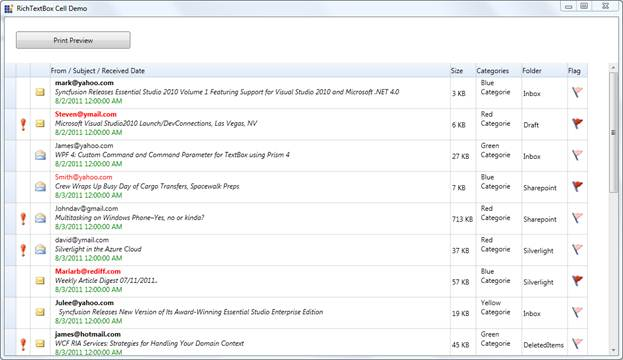

::: {style="DISPLAY: none"}
{#d2h_url_template}{#d2h_package_url style="WIDTH: 0px; DISPLAY: none; HEIGHT: 0px"}
:::

::: {.d2h_secondary_topic style="PADDING-BOTTOM: 10pt; MARGIN: 0pt; PADDING-LEFT: 0pt; PADDING-RIGHT: 0pt; PADDING-TOP: 0pt"}
##### RichTextBox CellType {#richtextbox-celltype style="tab-stops: 0pt"}

RichTextBox CellType is used to format the cells, where each character, word or a line can be given different formats. RichTextBox cell type also supports Printing, Importing and Exporting.

RichTextBox CellType can be defined in the Grid using the following code snippet:

 

+--------------------------------------------------------------------------------------------------------------------------------------------------------------------------------------------------------------------------------------------------------------------------------------------------------------------------------------+
| [ ]{style="FONT-FAMILY: 'Courier New'; COLOR: black"}[//Cell type as RichText and Cell Value as FlowDocument]{style="FONT-FAMILY: 'Courier New'; COLOR: green"}[]{style="FONT-FAMILY: 'Courier New'; COLOR: black"}                                                                                                                  |
|                                                                                                                                                                                                                                                                                                                                      |
| [ ]{style="FONT-FAMILY: 'Courier New'; COLOR: black"}[this]{style="FONT-FAMILY: 'Courier New'; COLOR: blue"}[.grid.Model\[rowIndex, colIndex\].CellType = ]{style="FONT-FAMILY: 'Courier New'; COLOR: black"}[\"RichText\"]{style="FONT-FAMILY: 'Courier New'; COLOR: #a31515"}[;]{style="FONT-FAMILY: 'Courier New'; COLOR: black"} |
|                                                                                                                                                                                                                                                                                                                                      |
| [ ]{style="FONT-FAMILY: 'Courier New'; COLOR: black"}[this]{style="FONT-FAMILY: 'Courier New'; COLOR: blue"}[.grid.Model\[rowIndex, colIndex\].CellValue = \_flowDocument;]{style="FONT-FAMILY: 'Courier New'; COLOR: black"}                                                                                                        |
|                                                                                                                                                                                                                                                                                                                                      |
| []{style="FONT-FAMILY: 'Courier New'"}                                                                                                                                                                                                                                                                                               |
+--------------------------------------------------------------------------------------------------------------------------------------------------------------------------------------------------------------------------------------------------------------------------------------------------------------------------------------+

 

The Cell Value for RichTextBox must be in FlowDocument as shown below.

+------------------------------------------------------------------------------------------------------------------------------------------------------------------------------------------------------------------------------------------------------------------------------------------------------------------------------------------------------------------------------------------------------------------------------------------------+
| []{style="FONT-FAMILY: 'Courier New'; COLOR: black"}                                                                                                                                                                                                                                                                                                                                                                                           |
|                                                                                                                                                                                                                                                                                                                                                                                                                                                |
| [              ]{style="FONT-FAMILY: 'Courier New'; COLOR: black"}[// Flow document type is supported for Rich Text Cell Type.]{style="FONT-FAMILY: 'Courier New'; COLOR: green"}[]{style="FONT-FAMILY: 'Courier New'; COLOR: black"}                                                                                                                                                                                                          |
|                                                                                                                                                                                                                                                                                                                                                                                                                                                |
| [              ]{style="FONT-FAMILY: 'Courier New'; COLOR: black"}[FlowDocument]{style="FONT-FAMILY: 'Courier New'; COLOR: #2b91af"}[ \_flowDocument = ]{style="FONT-FAMILY: 'Courier New'; COLOR: black"}[new]{style="FONT-FAMILY: 'Courier New'; COLOR: blue"}[ ]{style="FONT-FAMILY: 'Courier New'; COLOR: black"}[FlowDocument]{style="FONT-FAMILY: 'Courier New'; COLOR: #2b91af"}[();]{style="FONT-FAMILY: 'Courier New'; COLOR: black"} |
|                                                                                                                                                                                                                                                                                                                                                                                                                                                |
| []{style="FONT-FAMILY: 'Courier New'; COLOR: black"}                                                                                                                                                                                                                                                                                                                                                                                           |
|                                                                                                                                                                                                                                                                                                                                                                                                                                                |
| [              ]{style="FONT-FAMILY: 'Courier New'; COLOR: black"}[Paragraph]{style="FONT-FAMILY: 'Courier New'; COLOR: #2b91af"}[ \_paragraph = ]{style="FONT-FAMILY: 'Courier New'; COLOR: black"}[new]{style="FONT-FAMILY: 'Courier New'; COLOR: blue"}[ ]{style="FONT-FAMILY: 'Courier New'; COLOR: black"}[Paragraph]{style="FONT-FAMILY: 'Courier New'; COLOR: #2b91af"}[();]{style="FONT-FAMILY: 'Courier New'; COLOR: black"}          |
|                                                                                                                                                                                                                                                                                                                                                                                                                                                |
| []{style="FONT-FAMILY: 'Courier New'; COLOR: black"}                                                                                                                                                                                                                                                                                                                                                                                           |
|                                                                                                                                                                                                                                                                                                                                                                                                                                                |
| [              ]{style="FONT-FAMILY: 'Courier New'; COLOR: black"}[Run]{style="FONT-FAMILY: 'Courier New'; COLOR: #2b91af"}[ \_run1 = ]{style="FONT-FAMILY: 'Courier New'; COLOR: black"}[new]{style="FONT-FAMILY: 'Courier New'; COLOR: blue"}[ ]{style="FONT-FAMILY: 'Courier New'; COLOR: black"}[Run]{style="FONT-FAMILY: 'Courier New'; COLOR: #2b91af"}[();]{style="FONT-FAMILY: 'Courier New'; COLOR: black"}                           |
|                                                                                                                                                                                                                                                                                                                                                                                                                                                |
| [              \_run1.Text = ]{style="FONT-FAMILY: 'Courier New'; COLOR: black"}[\"This is RichText box Cell Type\"]{style="FONT-FAMILY: 'Courier New'; COLOR: #a31515"}[;]{style="FONT-FAMILY: 'Courier New'; COLOR: black"}                                                                                                                                                                                                                  |
|                                                                                                                                                                                                                                                                                                                                                                                                                                                |
| [              \_run1.TextDecorations = ]{style="FONT-FAMILY: 'Courier New'; COLOR: black"}[TextDecorations]{style="FONT-FAMILY: 'Courier New'; COLOR: #2b91af"}[.Underline;]{style="FONT-FAMILY: 'Courier New'; COLOR: black"}                                                                                                                                                                                                                |
|                                                                                                                                                                                                                                                                                                                                                                                                                                                |
| []{style="FONT-FAMILY: 'Courier New'; COLOR: black"}                                                                                                                                                                                                                                                                                                                                                                                           |
|                                                                                                                                                                                                                                                                                                                                                                                                                                                |
| [              ]{style="FONT-FAMILY: 'Courier New'; COLOR: black"}[Run]{style="FONT-FAMILY: 'Courier New'; COLOR: #2b91af"}[ \_run2 = ]{style="FONT-FAMILY: 'Courier New'; COLOR: black"}[new]{style="FONT-FAMILY: 'Courier New'; COLOR: blue"}[ ]{style="FONT-FAMILY: 'Courier New'; COLOR: black"}[Run]{style="FONT-FAMILY: 'Courier New'; COLOR: #2b91af"}[();]{style="FONT-FAMILY: 'Courier New'; COLOR: black"}                           |
|                                                                                                                                                                                                                                                                                                                                                                                                                                                |
| [              \_run2.Text = ]{style="FONT-FAMILY: 'Courier New'; COLOR: black"}[\"Various formatting can be done in Single Cell.\"]{style="FONT-FAMILY: 'Courier New'; COLOR: #a31515"}[;]{style="FONT-FAMILY: 'Courier New'; COLOR: black"}                                                                                                                                                                                                  |
|                                                                                                                                                                                                                                                                                                                                                                                                                                                |
| [              \_run1.FontWeight = ]{style="FONT-FAMILY: 'Courier New'; COLOR: black"}[FontWeights]{style="FONT-FAMILY: 'Courier New'; COLOR: #2b91af"}[.Bold;]{style="FONT-FAMILY: 'Courier New'; COLOR: black"}                                                                                                                                                                                                                              |
|                                                                                                                                                                                                                                                                                                                                                                                                                                                |
| [              \_run2.Foreground = ]{style="FONT-FAMILY: 'Courier New'; COLOR: black"}[Brushes]{style="FONT-FAMILY: 'Courier New'; COLOR: #2b91af"}[.Green;]{style="FONT-FAMILY: 'Courier New'; COLOR: black"}                                                                                                                                                                                                                                 |
|                                                                                                                                                                                                                                                                                                                                                                                                                                                |
| []{style="FONT-FAMILY: 'Courier New'; COLOR: black"}                                                                                                                                                                                                                                                                                                                                                                                           |
|                                                                                                                                                                                                                                                                                                                                                                                                                                                |
| [              ]{style="FONT-FAMILY: 'Courier New'; COLOR: black"}[Run]{style="FONT-FAMILY: 'Courier New'; COLOR: #2b91af"}[ \_run3 = ]{style="FONT-FAMILY: 'Courier New'; COLOR: black"}[new]{style="FONT-FAMILY: 'Courier New'; COLOR: blue"}[ ]{style="FONT-FAMILY: 'Courier New'; COLOR: black"}[Run]{style="FONT-FAMILY: 'Courier New'; COLOR: #2b91af"}[();]{style="FONT-FAMILY: 'Courier New'; COLOR: black"}                           |
|                                                                                                                                                                                                                                                                                                                                                                                                                                                |
| [              \_run3.Text = ]{style="FONT-FAMILY: 'Courier New'; COLOR: black"}[\"Rich Text cell type also supports Images\"]{style="FONT-FAMILY: 'Courier New'; COLOR: #a31515"}[;]{style="FONT-FAMILY: 'Courier New'; COLOR: black"}                                                                                                                                                                                                        |
|                                                                                                                                                                                                                                                                                                                                                                                                                                                |
| [              \_run3.FontSize = 16;]{style="FONT-FAMILY: 'Courier New'; COLOR: black"}                                                                                                                                                                                                                                                                                                                                                        |
|                                                                                                                                                                                                                                                                                                                                                                                                                                                |
| [              \_run3.FontStyle = ]{style="FONT-FAMILY: 'Courier New'; COLOR: black"}[FontStyles]{style="FONT-FAMILY: 'Courier New'; COLOR: #2b91af"}[.Italic;]{style="FONT-FAMILY: 'Courier New'; COLOR: black"}                                                                                                                                                                                                                              |
|                                                                                                                                                                                                                                                                                                                                                                                                                                                |
| []{style="FONT-FAMILY: 'Courier New'; COLOR: black"}                                                                                                                                                                                                                                                                                                                                                                                           |
|                                                                                                                                                                                                                                                                                                                                                                                                                                                |
| [              \_paragraph.Inlines.Add(\_run1);]{style="FONT-FAMILY: 'Courier New'; COLOR: black"}                                                                                                                                                                                                                                                                                                                                             |
|                                                                                                                                                                                                                                                                                                                                                                                                                                                |
| [              \_paragraph.Inlines.Add(\_run2);]{style="FONT-FAMILY: 'Courier New'; COLOR: black"}                                                                                                                                                                                                                                                                                                                                             |
|                                                                                                                                                                                                                                                                                                                                                                                                                                                |
| [              \_paragraph.Inlines.Add(\_run3);]{style="FONT-FAMILY: 'Courier New'; COLOR: black"}                                                                                                                                                                                                                                                                                                                                             |
|                                                                                                                                                                                                                                                                                                                                                                                                                                                |
| []{style="FONT-FAMILY: 'Courier New'; COLOR: black"}                                                                                                                                                                                                                                                                                                                                                                                           |
|                                                                                                                                                                                                                                                                                                                                                                                                                                                |
| [              \_flowDocument.Blocks.Add(\_paragraph);]{style="FONT-FAMILY: 'Courier New'; COLOR: black"}                                                                                                                                                                                                                                                                                                                                      |
|                                                                                                                                                                                                                                                                                                                                                                                                                                                |
| [              ]{style="FONT-FAMILY: 'Courier New'; COLOR: black"}                                                                                                                                                                                                                                                                                                                                                                             |
|                                                                                                                                                                                                                                                                                                                                                                                                                                                |
| [              ]{style="FONT-FAMILY: 'Courier New'; COLOR: black"}[//Cell type as RichText and Cell Value as FlowDocument]{style="FONT-FAMILY: 'Courier New'; COLOR: green"}[]{style="FONT-FAMILY: 'Courier New'; COLOR: black"}                                                                                                                                                                                                               |
|                                                                                                                                                                                                                                                                                                                                                                                                                                                |
| [              ]{style="FONT-FAMILY: 'Courier New'; COLOR: black"}[this]{style="FONT-FAMILY: 'Courier New'; COLOR: blue"}[.grid.Model\[rowIndex, colIndex\].CellType = ]{style="FONT-FAMILY: 'Courier New'; COLOR: black"}[\"RichText\"]{style="FONT-FAMILY: 'Courier New'; COLOR: #a31515"}[;]{style="FONT-FAMILY: 'Courier New'; COLOR: black"}                                                                                              |
|                                                                                                                                                                                                                                                                                                                                                                                                                                                |
| [              ]{style="FONT-FAMILY: 'Courier New'; COLOR: black"}[this]{style="FONT-FAMILY: 'Courier New'; COLOR: blue"}[.grid.Model\[rowIndex, colIndex\].CellValue = \_flowDocument;]{style="FONT-FAMILY: 'Courier New'; COLOR: black"}                                                                                                                                                                                                     |
|                                                                                                                                                                                                                                                                                                                                                                                                                                                |
| []{style="FONT-FAMILY: 'Courier New'"}                                                                                                                                                                                                                                                                                                                                                                                                         |
+------------------------------------------------------------------------------------------------------------------------------------------------------------------------------------------------------------------------------------------------------------------------------------------------------------------------------------------------------------------------------------------------------------------------------------------------+

 

 

 

 

{border="0"}

Figure 33: RichTextBox CellType

 

[]{#related-topics}
:::
