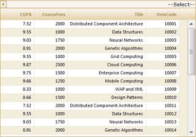
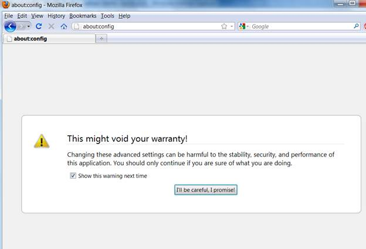
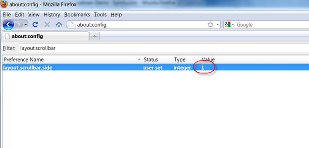
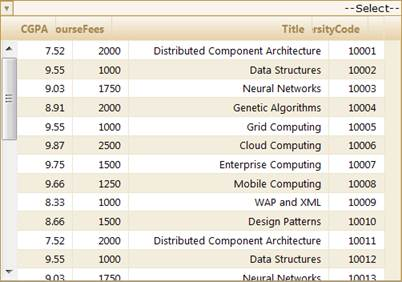
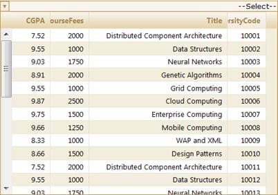

::: {style="DISPLAY: none"}
{#d2h_url_template}{#d2h_package_url style="WIDTH: 0px; DISPLAY: none; HEIGHT: 0px"}
:::

::::: {#nsbanner .d2h_main_nsbanner style="BORDER-BOTTOM: #999999 1px solid; POSITION: relative; PADDING-BOTTOM: 0px; BACKGROUND-COLOR: transparent; PADDING-LEFT: 0px; PADDING-RIGHT: 0px; DISPLAY: none; BORDER-TOP: #999999 1px solid; PADDING-TOP: 0px; LEFT: 0px"}
:::: {#TitleRow .d2h_main_titlerow style="PADDING-BOTTOM: 4px; BACKGROUND-COLOR: transparent; PADDING-LEFT: 22px; WIDTH: 100%; PADDING-RIGHT: 10px; DISPLAY: none; PADDING-TOP: 4px"}
::: {#ienav .d2h_main_ienav style="DISPLAY: none"}
{#D2HPrevious .D2HPreviousEnabled}  {#D2HNext .D2HNextEnabled}
:::
::::
:::::

:::::: {#nstext .d2h_main_nstext style="PADDING-BOTTOM: 10px; BACKGROUND-COLOR: transparent; PADDING-LEFT: 22px; PADDING-RIGHT: 10px; HEIGHT: 100%; OVERFLOW: auto; PADDING-TOP: 5px" hasuserbackground="true" valign="bottom"}
::: {#d2h_breadcrumbs .d2h_breadcrumbs}
[Essential Studio User Guide Documentation](ms-xhelp:///?Id=12457748-09e3-4d74-a240-8e049cedf030){.d2h_breadcrumbsNormal}[ \> ]{.d2h_breadcrumbsLinkSeparator}[User Interface Edition](ms-xhelp:///?Id=c29296b7-531c-413b-a0ec-488ca1f7f669){.d2h_breadcrumbsNormal}[ \> ]{.d2h_breadcrumbsLinkSeparator}[Essential ASP.NET MVC](ms-xhelp:///?Id=4b14e7d1-65c4-4f67-b1aa-2c37709905a5){.d2h_breadcrumbsNormal}[ \> ]{.d2h_breadcrumbsLinkSeparator}[Essential Grid]{.d2h_breadcrumbsContentsOnly}[ \> ]{.d2h_breadcrumbsLinkSeparator}[Getting Started](ms-xhelp:///?Id=c7ed3902-b25b-4170-be58-1d3d0b57748a){.d2h_breadcrumbsNormal}[ \> ]{.d2h_breadcrumbsLinkSeparator}[Feature Summary](ms-xhelp:///?Id=1923e679-441a-44e0-9bca-e0e50988a857){.d2h_breadcrumbsNormal}[ \> ]{.d2h_breadcrumbsLinkSeparator}[Concepts and Features](ms-xhelp:///?Id=4a1657fa-4756-42b9-9153-aebf5dcfc503){.d2h_breadcrumbsNormal}[ \> ]{.d2h_breadcrumbsLinkSeparator}[MultiColumnDropDown](ms-xhelp:///?Id=cf0e6254-8964-4a67-b141-e26bc6e4f04a){.d2h_breadcrumbsNormal}
:::

### RightToLeft {#righttoleft style="tab-stops: 0pt"}

The MultiColumnDropDown  control now supports a full-fledged right-to-left mode which aligns content in the control from right to left.

Use Case Scenarios

The **RightToLeft** property is used for international applications where the language is written from right to left, such as Hebrew or Arabic. When this property is set to **True**, the MultiColumnDropDown control will be displayed from right to left.

 

Adding Right-To-Left Support to MultiColumnDropDown Control

Enabling right-to-left support can be done in two ways:

[·      ]{style="FONT-FAMILY: Symbol"}Builder

[·      ]{style="FONT-FAMILY: Symbol"}MultiColumnDropDownModel

 

Through Builder

To enable right-to-left support using **Builder**:

Create a model in the application. Refer to [[Getting Started\>]{style="COLOR: blue"}]{.underline}[[Adding a Model to the Application]{style="COLOR: blue"}]{.underline}.

In the view, create the **MultiColumnDropDown** control and configure its properties.

 

+------------------------------------------------------------------------------------------------------------------------------------------------------------------------------------------------------------------------------------------------------------------------------------------------------------------------------------------------------------------+
| **[View ]{style="FONT-FAMILY: 'Courier New'"}[\[ASPX\]]{style="FONT-FAMILY: 'Courier New'"}**                                                                                                                                                                                                                                                                    |
|                                                                                                                                                                                                                                                                                                                                                                  |
| []{style="FONT-FAMILY: 'Courier New'"}                                                                                                                                                                                                                                                                                                                           |
|                                                                                                                                                                                                                                                                                                                                                                  |
| [\<%]{style="FONT-FAMILY: 'Courier New'; BACKGROUND: yellow"}[=]{style="FONT-FAMILY: 'Courier New'; COLOR: blue"}[Html.]{style="FONT-FAMILY: 'Courier New'"}[Syncfusion().]{style="FONT-FAMILY: 'Courier New'"}[MultiColumnDropDown\<[Student]{style="COLOR: #2b91af"}\>([\"MultiColumnDropDown\"]{style="COLOR: #a31515"})]{style="FONT-FAMILY: 'Courier New'"} |
|                                                                                                                                                                                                                                                                                                                                                                  |
| [.Datasource(([IEnumerable]{style="COLOR: #2b91af"}) ViewData\[[\"data\"]{style="COLOR: #a31515"}\])]{style="FONT-FAMILY: 'Courier New'"}                                                                                                                                                                                                                        |
|                                                                                                                                                                                                                                                                                                                                                                  |
| [.DisplayExpression([new]{style="COLOR: blue"} [int]{style="COLOR: blue"}\[\] {2, 3, 5})]{style="FONT-FAMILY: 'Courier New'"}                                                                                                                                                                                                                                    |
|                                                                                                                                                                                                                                                                                                                                                                  |
| [.Width(500)]{style="FONT-FAMILY: 'Courier New'"}                                                                                                                                                                                                                                                                                                                |
|                                                                                                                                                                                                                                                                                                                                                                  |
| [.Text([\"\--Select\--\"]{style="COLOR: #a31515"})]{style="FONT-FAMILY: 'Courier New'"}                                                                                                                                                                                                                                                                          |
|                                                                                                                                                                                                                                                                                                                                                                  |
| [%\>]{style="FONT-FAMILY: 'Courier New'; BACKGROUND: yellow"}[]{style="FONT-FAMILY: 'Courier New'"}                                                                                                                                                                                                                                                              |
|                                                                                                                                                                                                                                                                                                                                                                  |
| []{style="FONT-FAMILY: 'Courier New'"}                                                                                                                                                                                                                                                                                                                           |
+------------------------------------------------------------------------------------------------------------------------------------------------------------------------------------------------------------------------------------------------------------------------------------------------------------------------------------------------------------------+

 

 

+--------------------------------------------------------------------------------------------------------------------------------------------------------------------------------------------------------------------------------------------------------------------------------------------------------------------------------------------------------------------------------------------------------------------------------------------------------------------------------------+
| **[View ]{style="FONT-FAMILY: 'Courier New'"}[\[cshtml\]]{style="FONT-FAMILY: 'Courier New'"}**                                                                                                                                                                                                                                                                                                                                                                                      |
|                                                                                                                                                                                                                                                                                                                                                                                                                                                                                      |
| []{style="FONT-FAMILY: 'Courier New'; COLOR: black"}                                                                                                                                                                                                                                                                                                                                                                                                                                 |
|                                                                                                                                                                                                                                                                                                                                                                                                                                                                                      |
| [@(]{style="FONT-FAMILY: Consolas; BACKGROUND: yellow; FONT-SIZE: 9.5pt"}[new]{style="FONT-FAMILY: Consolas; COLOR: blue; FONT-SIZE: 9.5pt"}[ [HtmlString]{style="COLOR: #2b91af"}(]{style="FONT-FAMILY: Consolas; FONT-SIZE: 9.5pt"}[Html.]{style="FONT-FAMILY: 'Courier New'"}[Syncfusion().]{style="FONT-FAMILY: 'Courier New'"}[MultiColumnDropDown\<[Student]{style="COLOR: #2b91af"}\>([\"MultiColumnDropDown\"]{style="COLOR: #a31515"})]{style="FONT-FAMILY: 'Courier New'"} |
|                                                                                                                                                                                                                                                                                                                                                                                                                                                                                      |
| [.Datasource(([IEnumerable]{style="COLOR: #2b91af"}) ViewData\[[\"data\"]{style="COLOR: #a31515"}\])]{style="FONT-FAMILY: 'Courier New'"}                                                                                                                                                                                                                                                                                                                                            |
|                                                                                                                                                                                                                                                                                                                                                                                                                                                                                      |
| [.DisplayExpression([new]{style="COLOR: blue"} [int]{style="COLOR: blue"}\[\] {2, 3, 5})]{style="FONT-FAMILY: 'Courier New'"}                                                                                                                                                                                                                                                                                                                                                        |
|                                                                                                                                                                                                                                                                                                                                                                                                                                                                                      |
| [.Width(500)]{style="FONT-FAMILY: 'Courier New'"}                                                                                                                                                                                                                                                                                                                                                                                                                                    |
|                                                                                                                                                                                                                                                                                                                                                                                                                                                                                      |
| [.Text([\"\--Select\--\"]{style="COLOR: #a31515"})]{style="FONT-FAMILY: 'Courier New'"}[]{style="FONT-FAMILY: 'Courier New'"}                                                                                                                                                                                                                                                                                                                                                        |
|                                                                                                                                                                                                                                                                                                                                                                                                                                                                                      |
| [.ToString())[)]{style="BACKGROUND: yellow"}]{style="FONT-FAMILY: Consolas; FONT-SIZE: 9.5pt"}                                                                                                                                                                                                                                                                                                                                                                                       |
|                                                                                                                                                                                                                                                                                                                                                                                                                                                                                      |
| []{style="FONT-FAMILY: 'Courier New'"}                                                                                                                                                                                                                                                                                                                                                                                                                                               |
+--------------------------------------------------------------------------------------------------------------------------------------------------------------------------------------------------------------------------------------------------------------------------------------------------------------------------------------------------------------------------------------------------------------------------------------------------------------------------------------+

 

Enable/disable right-to-left mode using the **RightToLeft()** method.

 

+------------------------------------------------------------------------------------------------------------------------------------------------------------------------------------------------------------------------------------------------------------------------------------------------------------------------------------------------------------------+
| **[View ]{style="FONT-FAMILY: 'Courier New'"}[\[ASPX\]]{style="FONT-FAMILY: 'Courier New'"}**                                                                                                                                                                                                                                                                    |
|                                                                                                                                                                                                                                                                                                                                                                  |
|                                                                                                                                                                                                                                                                                                                                                                  |
|                                                                                                                                                                                                                                                                                                                                                                  |
| [\<%]{style="FONT-FAMILY: 'Courier New'; BACKGROUND: yellow"}[=]{style="FONT-FAMILY: 'Courier New'; COLOR: blue"}[Html.]{style="FONT-FAMILY: 'Courier New'"}[Syncfusion().]{style="FONT-FAMILY: 'Courier New'"}[MultiColumnDropDown\<[Student]{style="COLOR: #2b91af"}\>([\"MultiColumnDropDown\"]{style="COLOR: #a31515"})]{style="FONT-FAMILY: 'Courier New'"} |
|                                                                                                                                                                                                                                                                                                                                                                  |
| [.Datasource(([IEnumerable]{style="COLOR: #2b91af"}) ViewData\[[\"data\"]{style="COLOR: #a31515"}\])]{style="FONT-FAMILY: 'Courier New'"}                                                                                                                                                                                                                        |
|                                                                                                                                                                                                                                                                                                                                                                  |
| [.DisplayExpression([new]{style="COLOR: blue"} [int]{style="COLOR: blue"}\[\] {2, 3, 5})]{style="FONT-FAMILY: 'Courier New'"}                                                                                                                                                                                                                                    |
|                                                                                                                                                                                                                                                                                                                                                                  |
| [.Width(500)]{style="FONT-FAMILY: 'Courier New'"}                                                                                                                                                                                                                                                                                                                |
|                                                                                                                                                                                                                                                                                                                                                                  |
| **[.RightToLeft(]{style="FONT-FAMILY: 'Courier New'"}**[true]{style="FONT-FAMILY: 'Courier New'; COLOR: blue"}**[)]{style="FONT-FAMILY: 'Courier New'"}**                                                                                                                                                                                                        |
|                                                                                                                                                                                                                                                                                                                                                                  |
| [.Text([\"\--Select\--\"]{style="COLOR: #a31515"})]{style="FONT-FAMILY: 'Courier New'"}                                                                                                                                                                                                                                                                          |
|                                                                                                                                                                                                                                                                                                                                                                  |
| [%\>]{style="FONT-FAMILY: 'Courier New'; BACKGROUND: yellow"}[]{style="FONT-FAMILY: Consolas; FONT-SIZE: 9.5pt"}                                                                                                                                                                                                                                                 |
|                                                                                                                                                                                                                                                                                                                                                                  |
|                                                                                                                                                                                                                                                                                                                                                                  |
+------------------------------------------------------------------------------------------------------------------------------------------------------------------------------------------------------------------------------------------------------------------------------------------------------------------------------------------------------------------+

 

 

 

 

 

+--------------------------------------------------------------------------------------------------------------------------------------------------------------------------------------------------------------------------------------------------------------------------------------------------------------------------------------------------------------------------------------------------------------------------------------------------------------------------------------+
| **[View ]{style="FONT-FAMILY: 'Courier New'"}[\[cshtml\]]{style="FONT-FAMILY: 'Courier New'"}**                                                                                                                                                                                                                                                                                                                                                                                      |
|                                                                                                                                                                                                                                                                                                                                                                                                                                                                                      |
| []{style="FONT-FAMILY: 'Courier New'; COLOR: black"}                                                                                                                                                                                                                                                                                                                                                                                                                                 |
|                                                                                                                                                                                                                                                                                                                                                                                                                                                                                      |
| [@(]{style="FONT-FAMILY: Consolas; BACKGROUND: yellow; FONT-SIZE: 9.5pt"}[new]{style="FONT-FAMILY: Consolas; COLOR: blue; FONT-SIZE: 9.5pt"}[ [HtmlString]{style="COLOR: #2b91af"}(]{style="FONT-FAMILY: Consolas; FONT-SIZE: 9.5pt"}[Html.]{style="FONT-FAMILY: 'Courier New'"}[Syncfusion().]{style="FONT-FAMILY: 'Courier New'"}[MultiColumnDropDown\<[Student]{style="COLOR: #2b91af"}\>([\"MultiColumnDropDown\"]{style="COLOR: #a31515"})]{style="FONT-FAMILY: 'Courier New'"} |
|                                                                                                                                                                                                                                                                                                                                                                                                                                                                                      |
| [.Datasource(([IEnumerable]{style="COLOR: #2b91af"}) ViewData\[[\"data\"]{style="COLOR: #a31515"}\])]{style="FONT-FAMILY: 'Courier New'"}                                                                                                                                                                                                                                                                                                                                            |
|                                                                                                                                                                                                                                                                                                                                                                                                                                                                                      |
| [.DisplayExpression([new]{style="COLOR: blue"} [int]{style="COLOR: blue"}\[\] {2, 3, 5})]{style="FONT-FAMILY: 'Courier New'"}                                                                                                                                                                                                                                                                                                                                                        |
|                                                                                                                                                                                                                                                                                                                                                                                                                                                                                      |
| [.Width(500)]{style="FONT-FAMILY: 'Courier New'"}                                                                                                                                                                                                                                                                                                                                                                                                                                    |
|                                                                                                                                                                                                                                                                                                                                                                                                                                                                                      |
| **[.RightToLeft(]{style="FONT-FAMILY: 'Courier New'"}**[true]{style="FONT-FAMILY: 'Courier New'; COLOR: blue"}**[)]{style="FONT-FAMILY: 'Courier New'"}**                                                                                                                                                                                                                                                                                                                            |
|                                                                                                                                                                                                                                                                                                                                                                                                                                                                                      |
| [.Text([\"\--Select\--\"]{style="COLOR: #a31515"})]{style="FONT-FAMILY: 'Courier New'"}[]{style="FONT-FAMILY: 'Courier New'"}                                                                                                                                                                                                                                                                                                                                                        |
|                                                                                                                                                                                                                                                                                                                                                                                                                                                                                      |
| [.ToString())[)]{style="BACKGROUND: yellow"}]{style="FONT-FAMILY: Consolas; FONT-SIZE: 9.5pt"}                                                                                                                                                                                                                                                                                                                                                                                       |
|                                                                                                                                                                                                                                                                                                                                                                                                                                                                                      |
|                                                                                                                                                                                                                                                                                                                                                                                                                                                                                      |
+--------------------------------------------------------------------------------------------------------------------------------------------------------------------------------------------------------------------------------------------------------------------------------------------------------------------------------------------------------------------------------------------------------------------------------------------------------------------------------------+

 

Set its data source and render the view.

 

+-----------------------------------------------------------------------------------------------------------------------------------------------------------------------------------------------------------------------------------------------+
| **[Controller]{style="FONT-FAMILY: 'Courier New'"}[]{style="FONT-FAMILY: 'Courier New'"}**                                                                                                                                                    |
|                                                                                                                                                                                                                                               |
| []{style="FONT-FAMILY: 'Courier New'"}                                                                                                                                                                                                        |
|                                                                                                                                                                                                                                               |
| [ [///]{style="COLOR: gray"}[ ]{style="COLOR: green"}[\<summary\>]{style="COLOR: gray"}]{style="FONT-FAMILY: 'Courier New'"}                                                                                                                  |
|                                                                                                                                                                                                                                               |
| [       [///]{style="COLOR: gray"}[ Used for rendering the MultiColumnDropDown initially.]{style="COLOR: green"}]{style="FONT-FAMILY: 'Courier New'"}                                                                                         |
|                                                                                                                                                                                                                                               |
| [       [///]{style="COLOR: gray"}[ ]{style="COLOR: green"}[\</summary\>]{style="COLOR: gray"}]{style="FONT-FAMILY: 'Courier New'"}                                                                                                           |
|                                                                                                                                                                                                                                               |
| [       [///]{style="COLOR: gray"}[ ]{style="COLOR: green"}[\<returns\>]{style="COLOR: gray"}[View page; it displays the  MultiColumnDropDown.]{style="COLOR: green"}[\</returns\>]{style="COLOR: gray"}]{style="FONT-FAMILY: 'Courier New'"} |
|                                                                                                                                                                                                                                               |
| [       [public]{style="COLOR: blue"} [ActionResult]{style="COLOR: #2b91af"} Index()]{style="FONT-FAMILY: 'Courier New'"}                                                                                                                     |
|                                                                                                                                                                                                                                               |
| [       {]{style="FONT-FAMILY: 'Courier New'"}                                                                                                                                                                                                |
|                                                                                                                                                                                                                                               |
| []{style="FONT-FAMILY: 'Courier New'"}                                                                                                                                                                                                        |
|                                                                                                                                                                                                                                               |
| [            [var]{style="COLOR: blue"} Data = [new]{style="COLOR: blue"} [StudentDataContext]{style="COLOR: #2b91af"}().AutoFormatStudent.Take(200);]{style="FONT-FAMILY: 'Courier New'"}                                                    |
|                                                                                                                                                                                                                                               |
| [           ]{style="FONT-FAMILY: 'Courier New'"}[ ViewData\[[\"data\"]{style="COLOR: #a31515"}\] = Data;]{style="FONT-FAMILY: 'Courier New'"}[]{style="FONT-FAMILY: 'Courier New'"}                                                          |
|                                                                                                                                                                                                                                               |
| [           [return]{style="COLOR: blue"} View(Data);   ]{style="FONT-FAMILY: 'Courier New'"}                                                                                                                                                 |
|                                                                                                                                                                                                                                               |
| [       }]{style="FONT-FAMILY: 'Courier New'"}                                                                                                                                                                                                |
+-----------------------------------------------------------------------------------------------------------------------------------------------------------------------------------------------------------------------------------------------+

 

Run the application. The **MultiColumnDropDown** will appear as shown below.

 

 

{border="0"}

Figure 308: Right-To-Left Enabled MultiColumnDropDown Control

***[]{style="COLOR: gray"}*** 

Through MultiColumnDropDownModel

To enable right-to-left support using **MultiColumnDropDownModel**:

Create a model in the application. Refer to [[Getting Started\>]{style="COLOR: blue"}]{.underline}[[Adding a Model to the Application]{style="COLOR: blue"}]{.underline}.[[]{style="COLOR: blue"}]{.underline}

Create the MultiColumnDropDown control in the view.

 

+------------------------------------------------------------------------------------------------------------------------------------------------------------------------------------------------------------------------------------------------------------------------------------------------------------------------------------------------------------------------------------------------------------------------------------------------------------------------------------------------------+
| **[View ]{style="FONT-FAMILY: 'Courier New'"}[\[ASPX\]]{style="FONT-FAMILY: 'Courier New'"}**                                                                                                                                                                                                                                                                                                                                                                                                        |
|                                                                                                                                                                                                                                                                                                                                                                                                                                                                                                      |
|                                                                                                                                                                                                                                                                                                                                                                                                                                                                                                      |
|                                                                                                                                                                                                                                                                                                                                                                                                                                                                                                      |
| [\<%]{style="FONT-FAMILY: 'Courier New'; BACKGROUND: yellow"}[=]{style="FONT-FAMILY: 'Courier New'; COLOR: blue"}[Html.]{style="FONT-FAMILY: 'Courier New'"}[Syncfusion().]{style="FONT-FAMILY: 'Courier New'"}[MultiColumnDropDown\<[Student]{style="COLOR: #2b91af"}\>([\"Multidropdown\"]{style="COLOR: #a31515"},([MultiColumnDropDownModel]{style="COLOR: #2b91af"}) ViewData\[[\"dropdown\"]{style="COLOR: #a31515"}\]) [%\>]{style="BACKGROUND: yellow"}]{style="FONT-FAMILY: 'Courier New'"} |
+------------------------------------------------------------------------------------------------------------------------------------------------------------------------------------------------------------------------------------------------------------------------------------------------------------------------------------------------------------------------------------------------------------------------------------------------------------------------------------------------------+

 

+------------------------------------------------------------------------------------------------------------------------------------------------------------------------------------------------------------------------------------------------------------------------------------------------------------------------------------------------------------------------------------------------------------------------------------------------------------------------------------------------------------------------------------------------------------------------------------------------------------------------------------------------+
| **[View \[cshtml\]]{style="FONT-FAMILY: 'Courier New'"}[]{style="FONT-FAMILY: 'Courier New'"}**                                                                                                                                                                                                                                                                                                                                                                                                                                                                                                                                                |
|                                                                                                                                                                                                                                                                                                                                                                                                                                                                                                                                                                                                                                                |
| [@(]{style="FONT-FAMILY: Consolas; BACKGROUND: yellow; FONT-SIZE: 9.5pt"}[new]{style="FONT-FAMILY: Consolas; COLOR: blue; FONT-SIZE: 9.5pt"}[ [HtmlString]{style="COLOR: #2b91af"}(]{style="FONT-FAMILY: Consolas; FONT-SIZE: 9.5pt"}[Html.Syncfusion().MultiColumnDropDown\<[Student]{style="COLOR: #2b91af"}\>([\"Multidropdown\"]{style="COLOR: #a31515"},([MultiColumnDropDownModel]{style="COLOR: #2b91af"}) ViewData\[[\"dropdown\"]{style="COLOR: #a31515"}\])]{style="FONT-FAMILY: 'Courier New'"}[.]{style="FONT-FAMILY: 'Courier New'"}[ToString())[)]{style="BACKGROUND: yellow"}]{style="FONT-FAMILY: Consolas; FONT-SIZE: 9.5pt"} |
+------------------------------------------------------------------------------------------------------------------------------------------------------------------------------------------------------------------------------------------------------------------------------------------------------------------------------------------------------------------------------------------------------------------------------------------------------------------------------------------------------------------------------------------------------------------------------------------------------------------------------------------------+

 

 

Create an instance for **MultiColumnDropDownModel** and assign **Datasource** to the model.

***[]{style="COLOR: #4f81bd"}*** 

+-------------------------------------------------------------------------------------------------------------------------------------------------------------------------------------------------+
| **[Controller]{style="FONT-FAMILY: 'Courier New'"}[]{style="FONT-FAMILY: 'Courier New'"}**                                                                                                      |
|                                                                                                                                                                                                 |
| [// Create instance to MultiColumnDropDown model and assign properties.]{style="FONT-FAMILY: 'Courier New'; COLOR: green"}[]{style="FONT-FAMILY: 'Courier New'"}                                |
|                                                                                                                                                                                                 |
| [            [MultiColumnDropDownModel]{style="COLOR: #2b91af"} dropdown = [new]{style="COLOR: blue"} [MultiColumnDropDownModel]{style="COLOR: #2b91af"}()]{style="FONT-FAMILY: 'Courier New'"} |
|                                                                                                                                                                                                 |
| [            {]{style="FONT-FAMILY: 'Courier New'"}                                                                                                                                             |
|                                                                                                                                                                                                 |
| [                Datasource = [new]{style="COLOR: blue"} [StudentDataContext]{style="COLOR: #2b91af"}().JSONStudent.Skip(0).Take(30).ToList(),]{style="FONT-FAMILY: 'Courier New'"}             |
|                                                                                                                                                                                                 |
| [                Text = [\"\--Select\--\"]{style="COLOR: #a31515"},]{style="FONT-FAMILY: 'Courier New'"}                                                                                        |
|                                                                                                                                                                                                 |
| [                DisplayExpression = [new]{style="COLOR: blue"} [int]{style="COLOR: blue"}\[3\] { 2, 3, 5 },]{style="FONT-FAMILY: 'Courier New'"}                                               |
|                                                                                                                                                                                                 |
| [                Width = 500]{style="FONT-FAMILY: 'Courier New'"}                                                                                                                               |
|                                                                                                                                                                                                 |
| [            };]{style="FONT-FAMILY: 'Courier New'"}                                                                                                                                            |
|                                                                                                                                                                                                 |
|                                                                                                                                                                                                 |
+-------------------------------------------------------------------------------------------------------------------------------------------------------------------------------------------------+

 

 

Enable/disable right-to-left mode using the **RightToLeft** property.

***[]{style="COLOR: #4f81bd"}*** 

+-------------------------------------------------------------------------------------------------------------------------------------------------------------------------------------------------+
| **[Controller]{style="FONT-FAMILY: 'Courier New'"}[]{style="FONT-FAMILY: 'Courier New'"}**                                                                                                      |
|                                                                                                                                                                                                 |
| []{style="FONT-FAMILY: 'Courier New'"}                                                                                                                                                          |
|                                                                                                                                                                                                 |
| [// Create instance to MultiColumnDropDownMmodel and assign properties.]{style="FONT-FAMILY: 'Courier New'; COLOR: green"}[]{style="FONT-FAMILY: 'Courier New'"}                                |
|                                                                                                                                                                                                 |
| [            [MultiColumnDropDownModel]{style="COLOR: #2b91af"} dropdown = [new]{style="COLOR: blue"} [MultiColumnDropDownModel]{style="COLOR: #2b91af"}()]{style="FONT-FAMILY: 'Courier New'"} |
|                                                                                                                                                                                                 |
| [            {]{style="FONT-FAMILY: 'Courier New'"}                                                                                                                                             |
|                                                                                                                                                                                                 |
| [                Datasource = [new]{style="COLOR: blue"} [StudentDataContext]{style="COLOR: #2b91af"}().JSONStudent.Skip(0).Take(30).ToList(),]{style="FONT-FAMILY: 'Courier New'"}             |
|                                                                                                                                                                                                 |
| [                Text = [\"\--Select\--\"]{style="COLOR: #a31515"},]{style="FONT-FAMILY: 'Courier New'"}                                                                                        |
|                                                                                                                                                                                                 |
| [                DisplayExpression = [new]{style="COLOR: blue"} [int]{style="COLOR: blue"}\[3\] { 2, 3, 5 },]{style="FONT-FAMILY: 'Courier New'"}                                               |
|                                                                                                                                                                                                 |
| [                Width = 500,]{style="FONT-FAMILY: 'Courier New'"}                                                                                                                              |
|                                                                                                                                                                                                 |
| **[                RightToLeft = ]{style="FONT-FAMILY: 'Courier New'"}**[true]{style="FONT-FAMILY: 'Courier New'; COLOR: blue"}**[]{style="FONT-FAMILY: 'Courier New'"}**                       |
|                                                                                                                                                                                                 |
| [            };]{style="FONT-FAMILY: 'Courier New'"}                                                                                                                                            |
|                                                                                                                                                                                                 |
|                                                                                                                                                                                                 |
+-------------------------------------------------------------------------------------------------------------------------------------------------------------------------------------------------+

 

 

Pass the model to the view using **ViewData()**.

 

+---------------------------------------------------------------------------------------------------------------------------------------------------------+
| **[Controller]{style="FONT-FAMILY: 'Courier New'"}[]{style="FONT-FAMILY: 'Courier New'"}**                                                              |
|                                                                                                                                                         |
| [// Pass the MultiColumnDropDownModel to view using ViewData()]{style="FONT-FAMILY: 'Courier New'; COLOR: green"}[]{style="FONT-FAMILY: 'Courier New'"} |
|                                                                                                                                                         |
| [            ViewData\[[\"dropdown\"]{style="COLOR: #a31515"}\] = dropdown;]{style="FONT-FAMILY: 'Courier New'"}                                        |
+---------------------------------------------------------------------------------------------------------------------------------------------------------+

 

Run the application. The **MultiColumnDropDown** will appear as shown below.

 

 

 

{border="0"}

Figure 309: Right-To-Left Enabled MultiColumnDropDown Control

 

[]{#_MozillaLayoutScrollbarSide_1}Mozilla Layout Scrollbar Side

 

In the Mozilla browser, the side the scroll bar appears on can be configured in right-to-left (RTL) and left-to-right (LTR) modes. The following are the options to configure **ScrollbarSide**. Presently, the MultiColumnDropDown control supports both sides of the scrollbar in RTL mode using the **MozillaLayoutScrollbarSide** property.

 

[·      ]{style="FONT-FAMILY: Symbol"}0---In RTL, right-side scroll bar. In LTR, right-side scroll bar.

[·      ]{style="FONT-FAMILY: Symbol"}1---In RTL, left-side scroll bar. In LTR, right-side scroll bar.

[·      ]{style="FONT-FAMILY: Symbol"}2---In RTL, right-side scroll bar. In LTR, left-side scroll bar

 

The following steps are necessary to configure the scroll bar side in the Mozilla browser.

1.   Type the URL **about:config** in the Mozilla browser and press ENTER to configure the settings of the Mozilla browser.

 

 

{border="0"}

Figure 310: about:config

 

2.   Type **layout.scrollbar** in the **Filter:** text box and set the value to **1**. The default value is **0**.

 

{border="0"}

Figure 311: Setting Scroll Bar Side

**[]{style="FONT-FAMILY: 'Myriad Pro','sans-serif'"}** 

3.   Now **MultiColumnDropDown** alignment issue will rise as shown in the following screenshot.

 

 

{border="0"}

Figure 312: Alignment Issue

 

Now set the **MozillaLayoutScrollbarSide** to **LayoutScrollbarSide.Left**. Then **MultiColumnDropDown** will look as shown in the following screenshot.

 

{border="0"}

Figure 313: Alignment Issue Fixed

 

 

Properties

 

::: {align="center"}
+----------------------------+------------------------------------------------------------+------------+-----------------------------------------------+-----------------------------------------------------+--------------------------------------------------+
| Property                   | Description                                                | Type       | Type of the property                          | Value it accepts                                    | Any other dependencies/sub-properties associated |
+----------------------------+------------------------------------------------------------+------------+-----------------------------------------------+-----------------------------------------------------+--------------------------------------------------+
| RightToLeft                | Used to enable the RightToLeft mode in MultiColumnDropDown | ServerSide | Boolean                                       | True/false                                          | NA                                               |
+----------------------------+------------------------------------------------------------+------------+-----------------------------------------------+-----------------------------------------------------+--------------------------------------------------+
| MozillaLayoutScrollbarSide | Used to set the Layout scrollbarside of Mozilla browser.   | ServerSide | [LayoutScrollbarSide]{style="COLOR: #2b91af"} | [LayoutScrollbarSide]{style="COLOR: #2b91af"}.Left  | RightToLeft                                      |
|                            |                                                            |            |                                               |                                                     |                                                  |
|                            |                                                            |            |                                               | [LayoutScrollbarSide]{style="COLOR: #2b91af"}.Right |                                                  |
+----------------------------+------------------------------------------------------------+------------+-----------------------------------------------+-----------------------------------------------------+--------------------------------------------------+
:::

 

Methods

 

::: {align="center"}
+---------------------------------------------------------------------------+-----------------------------------------------+-----------------------------+------------------------------------------------------------+----------------------------------------------------------------+
| Method                                                                    | Arguments                                     | Return type                 | Description                                                | Reference links                                                |
+---------------------------------------------------------------------------+-----------------------------------------------+-----------------------------+------------------------------------------------------------+----------------------------------------------------------------+
| RightToLeft(Boolean)****                                                  | Boolean                                       | IMultiColumnDropDownBuilder | Used to enable the RightToLeft mode in MultiColumnDropDown | NA                                                             |
|                                                                           |                                               |                             |                                                            |                                                                |
|                                                                           |                                               |                             |                                                            |                                                                |
+---------------------------------------------------------------------------+-----------------------------------------------+-----------------------------+------------------------------------------------------------+----------------------------------------------------------------+
| MozillaLayoutScrollbarSide([LayoutScrollbarSide]{style="COLOR: #2b91af"}) | [LayoutScrollbarSide]{style="COLOR: #2b91af"} | IMultiColumnDropDownBuilder | Used to set the Layout scrollbarside of Mozilla browser.   | [[MozillaLayoutScrollbarSide]{.UGHyperlink}]()[]{.UGHyperlink} |
|                                                                           |                                               |                             |                                                            |                                                                |
|                                                                           |                                               |                             |                                                            |                                                                |
+---------------------------------------------------------------------------+-----------------------------------------------+-----------------------------+------------------------------------------------------------+----------------------------------------------------------------+
:::

 

 

Sample Link

To access the sample link:

1.   Go to **Grid MVC Demos** in the Sample Browser (Refer to Installation and Deployment\>Samples and Location).

2.   Select the **MultiColumnDropDown** on the left side **Accordion**.

3.   Select the **Localization** demo to view the **MultiColumnDropDown** full-fledged demo.

 

**[]{style="COLOR: black"}** 

[]{#related-topics}
::::::
