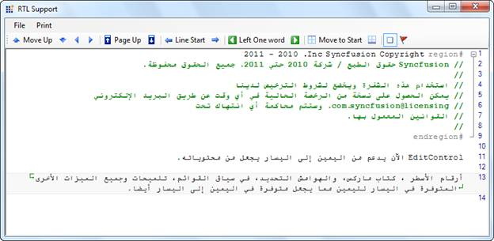

::: {style="DISPLAY: none"}
{#d2h_url_template}{#d2h_package_url style="WIDTH: 0px; DISPLAY: none; HEIGHT: 0px"}
:::

::::: {#nsbanner .d2h_main_nsbanner style="BORDER-BOTTOM: #999999 1px solid; POSITION: relative; PADDING-BOTTOM: 0px; BACKGROUND-COLOR: transparent; PADDING-LEFT: 0px; PADDING-RIGHT: 0px; DISPLAY: none; BORDER-TOP: #999999 1px solid; PADDING-TOP: 0px; LEFT: 0px"}
:::: {#TitleRow .d2h_main_titlerow style="PADDING-BOTTOM: 4px; BACKGROUND-COLOR: transparent; PADDING-LEFT: 22px; WIDTH: 100%; PADDING-RIGHT: 10px; DISPLAY: none; PADDING-TOP: 4px"}
::: {#ienav .d2h_main_ienav style="DISPLAY: none"}
{#D2HPrevious .D2HPreviousEnabled}  {#D2HNext .D2HNextEnabled}
:::
::::
:::::

::::: {#nstext .d2h_main_nstext style="PADDING-BOTTOM: 10px; BACKGROUND-COLOR: transparent; PADDING-LEFT: 22px; PADDING-RIGHT: 10px; HEIGHT: 100%; OVERFLOW: auto; PADDING-TOP: 5px" hasuserbackground="true" valign="bottom"}
::: {#d2h_breadcrumbs .d2h_breadcrumbs}
[Essential Studio User Guide Documentation](ms-xhelp:///?Id=12457748-09e3-4d74-a240-8e049cedf030){.d2h_breadcrumbsNormal}[ \> ]{.d2h_breadcrumbsLinkSeparator}[User Interface Edition](ms-xhelp:///?Id=c29296b7-531c-413b-a0ec-488ca1f7f669){.d2h_breadcrumbsNormal}[ \> ]{.d2h_breadcrumbsLinkSeparator}[Essential Windows](ms-xhelp:///?Id=e60759d8-47a4-4570-9d7a-16a68d63f2ea){.d2h_breadcrumbsNormal}[ \> ]{.d2h_breadcrumbsLinkSeparator}[Essential Edit]{.d2h_breadcrumbsContentsOnly}[ \> ]{.d2h_breadcrumbsLinkSeparator}[Concepts And Features](ms-xhelp:///?Id=7c39cee6-8434-4711-a18e-efaba8ac85c0){.d2h_breadcrumbsNormal}[ \> ]{.d2h_breadcrumbsLinkSeparator}[Editing Features](ms-xhelp:///?Id=09b6fb4f-a916-4433-9bd6-4b72b9546754){.d2h_breadcrumbsNormal}
:::

### Right-To-Left (RTL) Support {#right-to-left-rtl-support style="tab-stops: 0pt"}

 

Right-To-Left Support for EditControl

EditControl supports rendering content in Right-To-Left (RTL) layout.

 

The following features that are present in Left-To-Right layout are also supported in Right-To-Left layout:

 

[·      ]{style="FONT-FAMILY: Symbol"}Line numbers, Book Marks and Selection margins

[·      ]{style="FONT-FAMILY: Symbol"}Context Menus, ToolTips and Dialogs

[·      ]{style="FONT-FAMILY: Symbol"}Printing and print preview

[·      ]{style="FONT-FAMILY: Symbol"}Line borders, Underline and Text Range customization

[          ]{style="FONT-WEIGHT: normal"}

Use Case Scenarios

With RTL support, you can use EditControl, to render content in Right-To-left layout for languages such as Arabic. This is depicted in the screenshot below:

 

{border="0"}

Figure 11: Right-To-Left Layout of Arabic

 

Properties

*[Table ]{style="LINE-HEIGHT: 115%; FONT-SIZE: 9pt"}[1]{style="LINE-HEIGHT: 115%; FONT-SIZE: 9pt"}[: Property Table]{style="LINE-HEIGHT: 115%; FONT-SIZE: 9pt"}*

::: {align="center"}
  ------------------- ----------------------------------------------------------------------------------------------------- --------- ----------- -----------------
  Property            Description                                                                                           Type      Data Type   Reference links
  RenderRightToLeft   Gets or sets a value indicating whether to render the content of the control in RightToLeft layout.   Boolean   Boolean     
  ------------------- ----------------------------------------------------------------------------------------------------- --------- ----------- -----------------
:::

[]{style="FONT-FAMILY: 'Calibri','sans-serif'; COLOR: black"} 

Enabling Right-To-Left in EditControl

RTL can be enabled in EditControl with the Application Programming Interface (API) **RenderRightToLeft** as given in the following codes:

**** 

+-------------------------------------------------------------------------------------------------------------------------------------------------------------+
| **[\[C#\]]{style="FONT-FAMILY: 'Courier New'"}**                                                                                                            |
|                                                                                                                                                             |
| [this]{style="FONT-FAMILY: 'Courier New'; COLOR: blue"}[.editControl1.RenderRightToLeft = [true]{style="COLOR: blue"};]{style="FONT-FAMILY: 'Courier New'"} |
+-------------------------------------------------------------------------------------------------------------------------------------------------------------+

**** 

+----------------------------------------------------------------------------------------------------------------------------------------------------------+
| **[\[VB NET\]]{style="FONT-FAMILY: 'Courier New'"}**                                                                                                     |
|                                                                                                                                                          |
| [Me]{style="FONT-FAMILY: 'Courier New'; COLOR: blue"}[.editControl1.RenderRightToLeft = [True]{style="COLOR: blue"}]{style="FONT-FAMILY: 'Courier New'"} |
+----------------------------------------------------------------------------------------------------------------------------------------------------------+

 

Sample Link

 

To view a sample:

1.   Open the WPF sample browser from the dashboard.

2.   Navigate to **WPF Edit** -\> **Advanced Editor Functions** -\> **Right-To-Left Demo.**

 

 

 

[]{#related-topics}
:::::
