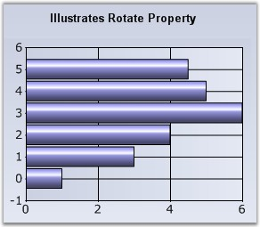

::: {style="DISPLAY: none"}
{#d2h_url_template}{#d2h_package_url style="WIDTH: 0px; DISPLAY: none; HEIGHT: 0px"}
:::

:::: {.d2h_secondary_topic style="PADDING-BOTTOM: 10pt; MARGIN: 0pt; PADDING-LEFT: 0pt; PADDING-RIGHT: 0pt; PADDING-TOP: 0pt"}
#### Rotate {#rotate style="tab-stops: 0pt"}

**[]{style="FONT-FAMILY: 'Trebuchet MS','sans-serif'; FONT-SIZE: 9pt"}** 

Indicates whether the x and y axis should be rotated for this series.

[]{style="FONT-FAMILY: 'Trebuchet MS','sans-serif'; FONT-SIZE: 9pt"} 

::: {align="center"}
+-------------------------------------+-------------------------------------------------------------------------------------------------------------------------------------------------------------------------+
| Details                                                                                                                                                                                                       |
+-------------------------------------+-------------------------------------------------------------------------------------------------------------------------------------------------------------------------+
| Possible Values                     | True -  Enable the Rotate property                                                                                                                                      |
|                                     |                                                                                                                                                                         |
|                                     | False - Disable the Rotate property                                                                                                                                     |
+-------------------------------------+-------------------------------------------------------------------------------------------------------------------------------------------------------------------------+
| Default Value                       | False                                                                                                                                                                   |
+-------------------------------------+-------------------------------------------------------------------------------------------------------------------------------------------------------------------------+
| 2D / 3D Limitations                 | No                                                                                                                                                                      |
+-------------------------------------+-------------------------------------------------------------------------------------------------------------------------------------------------------------------------+
| Applies to Chart Element            | Any Series                                                                                                                                                              |
+-------------------------------------+-------------------------------------------------------------------------------------------------------------------------------------------------------------------------+
| Applies to Chart Types              | Column Charts, Bar Charts, Area charts, Line Chart, Spline Chart, Stepline Chart, BoxandWhisker chart, Histogram chart, Polar and Radar Chart, Bubble And Scatter Chart |
+-------------------------------------+-------------------------------------------------------------------------------------------------------------------------------------------------------------------------+
:::

**[]{style="FONT-FAMILY: 'Trebuchet MS','sans-serif'; FONT-SIZE: 9pt"}** 

Here is sample code snippet using Rotate in Column Chart.

[]{style="FONT-FAMILY: 'Trebuchet MS','sans-serif'; FONT-SIZE: 9pt"} 

+----------------------------------------------------------------------------------------------------------------------------------------------------------------------------------------------------------------------------------------------------------------+
| **[\[C#\]]{style="FONT-FAMILY: 'Courier New'; COLOR: black"}**                                                                                                                                                                                                 |
|                                                                                                                                                                                                                                                                |
| **[]{style="FONT-FAMILY: 'Courier New'; COLOR: black"}**                                                                                                                                                                                                       |
|                                                                                                                                                                                                                                                                |
| [this]{style="FONT-FAMILY: 'Courier New'; COLOR: blue"}[.ChartWebControl1.Series\[0\].Rotate = ]{style="FONT-FAMILY: 'Courier New'; COLOR: black"}[true]{style="FONT-FAMILY: 'Courier New'; COLOR: blue"}[;]{style="FONT-FAMILY: 'Courier New'; COLOR: black"} |
+----------------------------------------------------------------------------------------------------------------------------------------------------------------------------------------------------------------------------------------------------------------+

[]{style="FONT-FAMILY: 'Trebuchet MS','sans-serif'; FONT-SIZE: 9pt"} 

+---------------------------------------------------------------------------------------------------------------------------------------------------------------------------------------------------------------+
| **[\[VB.NET\]]{style="FONT-FAMILY: 'Courier New'; COLOR: black"}**                                                                                                                                            |
|                                                                                                                                                                                                               |
| **[]{style="FONT-FAMILY: 'Courier New'; COLOR: black"}**                                                                                                                                                      |
|                                                                                                                                                                                                               |
| [Private Me]{style="FONT-FAMILY: 'Courier New'; COLOR: blue"}[.ChartWebControl1.Series(0).Rotate = ]{style="FONT-FAMILY: 'Courier New'; COLOR: black"}[True]{style="FONT-FAMILY: 'Courier New'; COLOR: blue"} |
+---------------------------------------------------------------------------------------------------------------------------------------------------------------------------------------------------------------+

**[]{style="FONT-FAMILY: 'Trebuchet MS','sans-serif'; FONT-SIZE: 9pt"}** 

{border="0"}

**[]{style="FONT-FAMILY: 'Trebuchet MS','sans-serif'; FONT-SIZE: 9pt"}** 

Figure 181: Column Chart

**[]{style="FONT-FAMILY: 'Trebuchet MS','sans-serif'; FONT-SIZE: 9pt"}** 

{border="0"}

**[]{style="FONT-FAMILY: 'Trebuchet MS','sans-serif'; FONT-SIZE: 9pt"}** 

Figure 182: Rotated Column Chart

 

See Also

 

[]{#p141}[[Column Charts]{style="COLOR: blue"}, ]{.UGHyperlink}[Bar Charts]{.UGHyperlink}[, ]{.UGHyperlink}[Area Charts]{.UGHyperlink}[,]{.UGHyperlink}[Histogram Chart]{.UGHyperlink}[, ]{.UGHyperlink}[Tornado Chart]{.UGHyperlink}[, ]{.UGHyperlink}[Polar and Radar Chart]{.UGHyperlink}[, ]{.UGHyperlink}[Pie Chart]{.UGHyperlink}[, ]{.UGHyperlink}[Three Line Break Chart]{.UGHyperlink}[, ]{.UGHyperlink}[Box and Whisker Chart]{.UGHyperlink}[, ]{.UGHyperlink}[Renko chart]{.UGHyperlink}[, ]{.UGHyperlink}[Line Chart]{.UGHyperlink}[, ]{.UGHyperlink}[Spline Chart]{.UGHyperlink}[, ]{.UGHyperlink}[Step line Chart]{.UGHyperlink}[, ]{.UGHyperlink}[Kagi Chart]{.UGHyperlink}[, ]{.UGHyperlink}[Bubble And Scatter Chart]{.UGHyperlink}[]{.UGHyperlink}

 

 

[]{#related-topics}
::::
