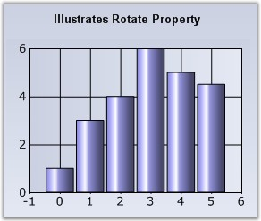

::: {style="DISPLAY: none"}
{#d2h_url_template}{#d2h_package_url style="WIDTH: 0px; DISPLAY: none; HEIGHT: 0px"}
:::

:::: {.d2h_secondary_topic style="PADDING-BOTTOM: 10pt; MARGIN: 0pt; PADDING-LEFT: 0pt; PADDING-RIGHT: 0pt; PADDING-TOP: 0pt"}
#### Rotate {#rotate style="tab-stops: 0pt"}

 

Indicates whether the x and y axis should be rotated for this series.

 

::: {align="center"}
+-------------------------------------+-------------------------------------------------------------------------------------------------------------------------------------------------------------------------+
|                                                                                                                                                                                                               |
|                                                                                                                                                                                                               |
| Details                                                                                                                                                                                                       |
+-------------------------------------+-------------------------------------------------------------------------------------------------------------------------------------------------------------------------+
| Possible Values                     | True -  Enable the Rotate property                                                                                                                                      |
|                                     |                                                                                                                                                                         |
|                                     | False - Disable the Rotate property                                                                                                                                     |
+-------------------------------------+-------------------------------------------------------------------------------------------------------------------------------------------------------------------------+
| Default Value                       | False                                                                                                                                                                   |
+-------------------------------------+-------------------------------------------------------------------------------------------------------------------------------------------------------------------------+
| 2D / 3D Limitations                 | No                                                                                                                                                                      |
+-------------------------------------+-------------------------------------------------------------------------------------------------------------------------------------------------------------------------+
| Applies to Chart Element            | Any Series                                                                                                                                                              |
+-------------------------------------+-------------------------------------------------------------------------------------------------------------------------------------------------------------------------+
| Applies to Chart Types              | Column Charts, Bar Charts, Area charts, Line Chart, Spline Chart, Stepline Chart, BoxandWhisker chart, Histogram chart, Polar and Radar Chart, Bubble And Scatter Chart |
+-------------------------------------+-------------------------------------------------------------------------------------------------------------------------------------------------------------------------+
:::

 

Here is sample code snippet using Rotate in Column Chart.

 

+-------------------------------------------------------------------------------------------------------------------------------------------------------------------------------------------------------------------------------------------------------------+
| **[\[C#\]]{style="FONT-FAMILY: 'Courier New'; COLOR: black"}**                                                                                                                                                                                              |
|                                                                                                                                                                                                                                                             |
| **[]{style="FONT-FAMILY: 'Courier New'; COLOR: black"}**                                                                                                                                                                                                    |
|                                                                                                                                                                                                                                                             |
| [this]{style="FONT-FAMILY: 'Courier New'; COLOR: blue"}[.chartControl1.Series\[0\].Rotate = ]{style="FONT-FAMILY: 'Courier New'; COLOR: black"}[true]{style="FONT-FAMILY: 'Courier New'; COLOR: blue"}[;]{style="FONT-FAMILY: 'Courier New'; COLOR: black"} |
+-------------------------------------------------------------------------------------------------------------------------------------------------------------------------------------------------------------------------------------------------------------+

 

+------------------------------------------------------------------------------------------------------------------------------------------------------------------------------------------------------------+
| **[\[VB.NET\]]{style="FONT-FAMILY: 'Courier New'; COLOR: black"}**                                                                                                                                         |
|                                                                                                                                                                                                            |
| **[]{style="FONT-FAMILY: 'Courier New'; COLOR: black"}**                                                                                                                                                   |
|                                                                                                                                                                                                            |
| [Private Me]{style="FONT-FAMILY: 'Courier New'; COLOR: blue"}[.chartControl1.Series(0).Rotate = ]{style="FONT-FAMILY: 'Courier New'; COLOR: black"}[True]{style="FONT-FAMILY: 'Courier New'; COLOR: blue"} |
+------------------------------------------------------------------------------------------------------------------------------------------------------------------------------------------------------------+

 

{border="0"}

 

Figure 187: Column Chart

 

{border="0"}

 

Figure 188: Rotated Column Chart

 

See Also

 

[Column Charts]{.UGHyperlink}, [Bar Charts]{.UGHyperlink}, [Area charts]{.UGHyperlink}, [Line Chart]{.UGHyperlink}, [Spline Chart]{.UGHyperlink}, [Stepline Chart]{.UGHyperlink}, [Kagi Chart]{.UGHyperlink}, [BoxandWhisker chart]{.UGHyperlink}, [Histogram chart]{.UGHyperlink}, [Polar and Radar Chart]{.UGHyperlink}, [Bubble And Scatter Chart]{.UGHyperlink}[]{style="COLOR: black"}

 

[]{#p140} 

[]{#related-topics}
::::
