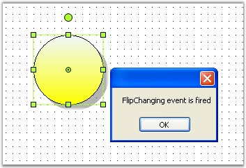
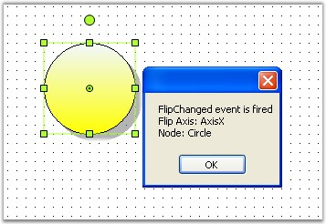
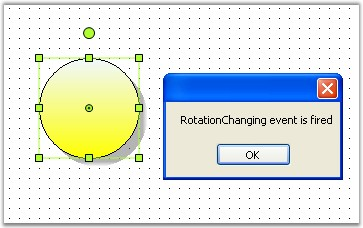
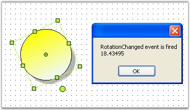

::: {style="DISPLAY: none"}
{#d2h_url_template}{#d2h_package_url style="WIDTH: 0px; DISPLAY: none; HEIGHT: 0px"}
:::

:::::: {.d2h_secondary_topic style="PADDING-BOTTOM: 10pt; MARGIN: 0pt; PADDING-LEFT: 0pt; PADDING-RIGHT: 0pt; PADDING-TOP: 0pt"}
##### Rotation Events {#rotation-events style="tab-stops: 0pt"}

[]{style="FONT-FAMILY: 'Trebuchet MS','sans-serif'; COLOR: #15428b; FONT-SIZE: 9pt"} 

When the control is rotated horizontally or vertically, the rotation events will be fired displaying the rotation offsets.

 

The below table discusses the available rotation events with descriptions.

 

::: {align="center"}
  ------------------- ----------------------------------------------------------
  DocumentEventSink   Description
  FlipChanged         Triggered after the node is rotated using Flip property.
  FlipChanging        Triggered when the node is rotated using Flip property.
  RotationChanged     Triggered after the node is rotated.
  RotationChanging    Triggered on rotating the node in any direction.
  ------------------- ----------------------------------------------------------
:::

[]{style="FONT-FAMILY: 'Trebuchet MS','sans-serif'; COLOR: #15428b; FONT-SIZE: 9pt"} 

Data can be retrieved or set using the following members.

[]{style="FONT-FAMILY: 'Trebuchet MS','sans-serif'; COLOR: #15428b; FONT-SIZE: 9pt"} 

::: {align="center"}
  --------------------------- ----------------------------------------------------------
  Rotation EventArgs Member   Description
  NodeAffected                Returns the node\'s name by which the node was affected.
  RotationOffset              Returns the angle by which the node was rotated.
  --------------------------- ----------------------------------------------------------
:::

[]{style="FONT-FAMILY: 'Times New Roman','serif'; FONT-SIZE: 12pt"} 

::: {align="center"}
  ----------------------- ----------------------------------------------------------
  Flip EventArgs Member   Description
  Cancel                  Cancels the FlipChanging event.
  FlipAxis                Returns the axis around which the node was rotated.
  FlipValue               Returns the boolean value of the **Flip** property.
  NodeAffected            Returns the node\'s name by which the node was affected.
  ----------------------- ----------------------------------------------------------
:::

[]{style="FONT-FAMILY: 'Trebuchet MS','sans-serif'; COLOR: #15428b; FONT-SIZE: 9pt"} 

Programmatically, the events are written as follows:

[]{style="FONT-FAMILY: 'Trebuchet MS','sans-serif'; COLOR: #15428b; FONT-SIZE: 9pt"} 

+-----------------------------------------------------------------------------------------------------------------------------------------------------------------------------------------------------------------------------------------------------------------------------------------------------------------------------------------------------------------------+
| **[\[C#\]]{style="FONT-FAMILY: 'Courier New'; COLOR: black"}**                                                                                                                                                                                                                                                                                                        |
|                                                                                                                                                                                                                                                                                                                                                                       |
| []{style="FONT-FAMILY: 'Courier New'"}                                                                                                                                                                                                                                                                                                                                |
|                                                                                                                                                                                                                                                                                                                                                                       |
| [public]{style="FONT-FAMILY: 'Courier New'; COLOR: blue"}[ [void]{style="COLOR: blue"} Form1_Load([object]{style="COLOR: blue"} sender, [EventArgs]{style="COLOR: teal"} e)]{style="FONT-FAMILY: 'Courier New'"}                                                                                                                                                      |
|                                                                                                                                                                                                                                                                                                                                                                       |
| [{]{style="FONT-FAMILY: 'Courier New'"}                                                                                                                                                                                                                                                                                                                               |
|                                                                                                                                                                                                                                                                                                                                                                       |
| [    ((DocumentEventSink)model1.EventSink).FlipChanged += [new]{style="COLOR: blue"} FlipChangedEventHandler(Form1_FlipChanged);]{style="FONT-FAMILY: 'Courier New'"}                                                                                                                                                                                                 |
|                                                                                                                                                                                                                                                                                                                                                                       |
| [    ((DocumentEventSink)model1.EventSink).FlipChanging += [new]{style="COLOR: blue"} FlipChangingEventHandler(Form1_FlipChanging);]{style="FONT-FAMILY: 'Courier New'"}                                                                                                                                                                                              |
|                                                                                                                                                                                                                                                                                                                                                                       |
| [    ((DocumentEventSink)model1.EventSink).RotationChanged += [new]{style="COLOR: blue"} RotationChangedEventHandler(Form1_RotationChanged);]{style="FONT-FAMILY: 'Courier New'"}                                                                                                                                                                                     |
|                                                                                                                                                                                                                                                                                                                                                                       |
| [    ((DocumentEventSink)model1.EventSink).RotationChanging += [new]{style="COLOR: blue"} RotationChangingEventHandler(Form1_RotationChanging);]{style="FONT-FAMILY: 'Courier New'"}                                                                                                                                                                                  |
|                                                                                                                                                                                                                                                                                                                                                                       |
| [    [// Circle]{style="COLOR: green"}]{style="FONT-FAMILY: 'Courier New'"}                                                                                                                                                                                                                                                                                           |
|                                                                                                                                                                                                                                                                                                                                                                       |
| [    Syncfusion.Windows.Forms.Diagram.Ellipse circle = [new]{style="COLOR: blue"} Syncfusion.Windows.Forms.Diagram.Ellipse(0, 0, 96, 72);]{style="FONT-FAMILY: 'Courier New'"}                                                                                                                                                                                        |
|                                                                                                                                                                                                                                                                                                                                                                       |
| [    circle.Name = [\"Circle\"]{style="COLOR: maroon"};]{style="FONT-FAMILY: 'Courier New'"}                                                                                                                                                                                                                                                                          |
|                                                                                                                                                                                                                                                                                                                                                                       |
| [    circle.FillStyle.Type = FillStyleType.LinearGradient;]{style="FONT-FAMILY: 'Courier New'"}                                                                                                                                                                                                                                                                       |
|                                                                                                                                                                                                                                                                                                                                                                       |
| [    circle.FillStyle.ForeColor = [Color]{style="COLOR: teal"}.AliceBlue;]{style="FONT-FAMILY: 'Courier New'"}                                                                                                                                                                                                                                                        |
|                                                                                                                                                                                                                                                                                                                                                                       |
| [    circle.ShadowStyle.Visible = [true]{style="COLOR: blue"};]{style="FONT-FAMILY: 'Courier New'"}                                                                                                                                                                                                                                                                   |
|                                                                                                                                                                                                                                                                                                                                                                       |
| [    model4.AppendChild(circle);]{style="FONT-FAMILY: 'Courier New'"}                                                                                                                                                                                                                                                                                                 |
|                                                                                                                                                                                                                                                                                                                                                                       |
| [}]{style="FONT-FAMILY: 'Courier New'"}                                                                                                                                                                                                                                                                                                                               |
|                                                                                                                                                                                                                                                                                                                                                                       |
| [void]{style="FONT-FAMILY: 'Courier New'; COLOR: blue"}[ Form1_RotationChanged(RotationChangedEventArgs evtArgs)]{style="FONT-FAMILY: 'Courier New'"}                                                                                                                                                                                                                 |
|                                                                                                                                                                                                                                                                                                                                                                       |
| [{]{style="FONT-FAMILY: 'Courier New'"}                                                                                                                                                                                                                                                                                                                               |
|                                                                                                                                                                                                                                                                                                                                                                       |
| [    [MessageBox]{style="COLOR: teal"}.Show([\"RotationChanged event is fired\"]{style="COLOR: maroon"} + [\"\\n\"]{style="COLOR: maroon"} + evtArgs.RotationOffset.ToString());]{style="FONT-FAMILY: 'Courier New'"}                                                                                                                                                 |
|                                                                                                                                                                                                                                                                                                                                                                       |
| [}]{style="FONT-FAMILY: 'Courier New'"}                                                                                                                                                                                                                                                                                                                               |
|                                                                                                                                                                                                                                                                                                                                                                       |
| [void]{style="FONT-FAMILY: 'Courier New'; COLOR: blue"}[ Form1_FlipChanging(FlipChangingEventArgs evtArgs)]{style="FONT-FAMILY: 'Courier New'"}                                                                                                                                                                                                                       |
|                                                                                                                                                                                                                                                                                                                                                                       |
| [{]{style="FONT-FAMILY: 'Courier New'"}                                                                                                                                                                                                                                                                                                                               |
|                                                                                                                                                                                                                                                                                                                                                                       |
| [    [MessageBox]{style="COLOR: teal"}.Show([\"FlipChanging event is fired\"]{style="COLOR: maroon"});]{style="FONT-FAMILY: 'Courier New'"}                                                                                                                                                                                                                           |
|                                                                                                                                                                                                                                                                                                                                                                       |
| [    textBox1.Text = evtArgs.NodeAffected.BoundingRectangle.ToString();]{style="FONT-FAMILY: 'Courier New'"}                                                                                                                                                                                                                                                          |
|                                                                                                                                                                                                                                                                                                                                                                       |
| [}]{style="FONT-FAMILY: 'Courier New'"}                                                                                                                                                                                                                                                                                                                               |
|                                                                                                                                                                                                                                                                                                                                                                       |
| [void]{style="FONT-FAMILY: 'Courier New'; COLOR: blue"}[ Form1_FlipChanged(FlipChangedEventArgs evtArgs)]{style="FONT-FAMILY: 'Courier New'"}                                                                                                                                                                                                                         |
|                                                                                                                                                                                                                                                                                                                                                                       |
| [{]{style="FONT-FAMILY: 'Courier New'"}                                                                                                                                                                                                                                                                                                                               |
|                                                                                                                                                                                                                                                                                                                                                                       |
| [    [MessageBox]{style="COLOR: teal"}.Show([\"FlipChanged event is fired\"]{style="COLOR: maroon"} + [\"\\n\"]{style="COLOR: maroon"} + [\"Flip Axis:\"]{style="COLOR: maroon"} + evtArgs.FlipAxis.ToString() + [\"\\n\"]{style="COLOR: maroon"} + [\"Node: \"]{style="COLOR: maroon"} + evtArgs.NodeAffected.Name.ToString());]{style="FONT-FAMILY: 'Courier New'"} |
|                                                                                                                                                                                                                                                                                                                                                                       |
| [    evtArgs.NodeAffected.EditStyle.Enabled = [false]{style="COLOR: blue"};]{style="FONT-FAMILY: 'Courier New'"}                                                                                                                                                                                                                                                      |
|                                                                                                                                                                                                                                                                                                                                                                       |
| [}]{style="FONT-FAMILY: 'Courier New'"}                                                                                                                                                                                                                                                                                                                               |
+-----------------------------------------------------------------------------------------------------------------------------------------------------------------------------------------------------------------------------------------------------------------------------------------------------------------------------------------------------------------------+

[]{style="FONT-FAMILY: 'Courier New'"} 

+--------------------------------------------------------------------------------------------------------------------------------------------------------------------------------------------------------------------------------------------------------------------------------------------------------+
| **[\[VB\]]{style="FONT-FAMILY: 'Courier New'; COLOR: black"}**                                                                                                                                                                                                                                         |
|                                                                                                                                                                                                                                                                                                        |
| []{style="FONT-FAMILY: 'Courier New'; COLOR: blue"}                                                                                                                                                                                                                                                    |
|                                                                                                                                                                                                                                                                                                        |
| [Public]{style="FONT-FAMILY: 'Courier New'; COLOR: blue"}[ [Sub]{style="COLOR: blue"} Form1_Load([ByVal]{style="COLOR: blue"} sender [As]{style="COLOR: blue"} [Object]{style="COLOR: blue"}, [ByVal]{style="COLOR: blue"} e [As]{style="COLOR: blue"} EventArgs)]{style="FONT-FAMILY: 'Courier New'"} |
|                                                                                                                                                                                                                                                                                                        |
| [    [AddHandler]{style="COLOR: blue"} [DirectCast]{style="COLOR: blue"}(model1.EventSink, DocumentEventSink).FlipChanged, [AddressOf]{style="COLOR: blue"} Form1_FlipChanged]{style="FONT-FAMILY: 'Courier New'"}                                                                                     |
|                                                                                                                                                                                                                                                                                                        |
| [    [AddHandler]{style="COLOR: blue"} [DirectCast]{style="COLOR: blue"}(model1.EventSink, DocumentEventSink).FlipChanging, [AddressOf]{style="COLOR: blue"} Form1_FlipChanging]{style="FONT-FAMILY: 'Courier New'"}                                                                                   |
|                                                                                                                                                                                                                                                                                                        |
| [    [AddHandler]{style="COLOR: blue"} [DirectCast]{style="COLOR: blue"}(model1.EventSink, DocumentEventSink).RotationChanged, [AddressOf]{style="COLOR: blue"} Form1_RotationChanged]{style="FONT-FAMILY: 'Courier New'"}                                                                             |
|                                                                                                                                                                                                                                                                                                        |
| [    [AddHandler]{style="COLOR: blue"} [DirectCast]{style="COLOR: blue"}(model1.EventSink, DocumentEventSink).RotationChanging, [AddressOf]{style="COLOR: blue"} Form1_RotationChanging]{style="FONT-FAMILY: 'Courier New'"}                                                                           |
|                                                                                                                                                                                                                                                                                                        |
| [    [\' Circle]{style="COLOR: green"}]{style="FONT-FAMILY: 'Courier New'"}                                                                                                                                                                                                                            |
|                                                                                                                                                                                                                                                                                                        |
| [    [Dim]{style="COLOR: blue"} circle [As]{style="COLOR: blue"} [New]{style="COLOR: blue"} Syncfusion.Windows.Forms.Diagram.Ellipse(0, 0, 96, 72)]{style="FONT-FAMILY: 'Courier New'"}                                                                                                                |
|                                                                                                                                                                                                                                                                                                        |
| [    circle.Name = [\"Circle\"]{style="COLOR: maroon"}]{style="FONT-FAMILY: 'Courier New'"}                                                                                                                                                                                                            |
|                                                                                                                                                                                                                                                                                                        |
| [    circle.FillStyle.Type = FillStyleType.LinearGradient]{style="FONT-FAMILY: 'Courier New'"}                                                                                                                                                                                                         |
|                                                                                                                                                                                                                                                                                                        |
| [    circle.FillStyle.ForeColor = Color.AliceBlue]{style="FONT-FAMILY: 'Courier New'"}                                                                                                                                                                                                                 |
|                                                                                                                                                                                                                                                                                                        |
| [    circle.ShadowStyle.Visible = [True]{style="COLOR: blue"}]{style="FONT-FAMILY: 'Courier New'"}                                                                                                                                                                                                     |
|                                                                                                                                                                                                                                                                                                        |
| [    model4.AppendChild(circle)]{style="FONT-FAMILY: 'Courier New'"}                                                                                                                                                                                                                                   |
|                                                                                                                                                                                                                                                                                                        |
| [End]{style="FONT-FAMILY: 'Courier New'; COLOR: blue"}[ [Sub]{style="COLOR: blue"}]{style="FONT-FAMILY: 'Courier New'"}                                                                                                                                                                                |
|                                                                                                                                                                                                                                                                                                        |
| [Private]{style="FONT-FAMILY: 'Courier New'; COLOR: blue"}[ [Sub]{style="COLOR: blue"} Form1_RotationChanged([ByVal]{style="COLOR: blue"} evtArgs [As]{style="COLOR: blue"} RotationChangedEventArgs)]{style="FONT-FAMILY: 'Courier New'"}                                                             |
|                                                                                                                                                                                                                                                                                                        |
| [    MessageBox.Show(([\"RotationChanged event is fired\"]{style="COLOR: maroon"} & vbLf) + evtArgs.RotationOffset.ToString())]{style="FONT-FAMILY: 'Courier New'"}                                                                                                                                    |
|                                                                                                                                                                                                                                                                                                        |
| [End]{style="FONT-FAMILY: 'Courier New'; COLOR: blue"}[ [Sub]{style="COLOR: blue"}]{style="FONT-FAMILY: 'Courier New'"}                                                                                                                                                                                |
|                                                                                                                                                                                                                                                                                                        |
| [Private]{style="FONT-FAMILY: 'Courier New'; COLOR: blue"}[ [Sub]{style="COLOR: blue"} Form1_FlipChanging([ByVal]{style="COLOR: blue"} evtArgs [As]{style="COLOR: blue"} FlipChangingEventArgs)]{style="FONT-FAMILY: 'Courier New'"}                                                                   |
|                                                                                                                                                                                                                                                                                                        |
| [    MessageBox.Show([\"FlipChanging event is fired\"]{style="COLOR: maroon"})]{style="FONT-FAMILY: 'Courier New'"}                                                                                                                                                                                    |
|                                                                                                                                                                                                                                                                                                        |
| [    textBox1.Text = evtArgs.NodeAffected.BoundingRectangle.ToString()]{style="FONT-FAMILY: 'Courier New'"}                                                                                                                                                                                            |
|                                                                                                                                                                                                                                                                                                        |
| [End]{style="FONT-FAMILY: 'Courier New'; COLOR: blue"}[ [Sub]{style="COLOR: blue"}]{style="FONT-FAMILY: 'Courier New'"}                                                                                                                                                                                |
|                                                                                                                                                                                                                                                                                                        |
| [Private]{style="FONT-FAMILY: 'Courier New'; COLOR: blue"}[ [Sub]{style="COLOR: blue"} Form1_FlipChanged([ByVal]{style="COLOR: blue"} evtArgs [As]{style="COLOR: blue"} FlipChangedEventArgs)]{style="FONT-FAMILY: 'Courier New'"}                                                                     |
|                                                                                                                                                                                                                                                                                                        |
| [    MessageBox.Show((([\"FlipChanged event is fired\"]{style="COLOR: maroon"} & vbLf & [\"Flip Axis:\"]{style="COLOR: maroon"}) + evtArgs.FlipAxis.ToString() & vbLf & [\"Node: \"]{style="COLOR: maroon"}) + evtArgs.NodeAffected.Name.ToString())]{style="FONT-FAMILY: 'Courier New'"}              |
|                                                                                                                                                                                                                                                                                                        |
| [    evtArgs.NodeAffected.EditStyle.Enabled = [False]{style="COLOR: blue"}]{style="FONT-FAMILY: 'Courier New'"}                                                                                                                                                                                        |
|                                                                                                                                                                                                                                                                                                        |
| [End]{style="FONT-FAMILY: 'Courier New'; COLOR: blue"}[ [Sub]{style="COLOR: blue"}]{style="FONT-FAMILY: 'Courier New'"}                                                                                                                                                                                |
+--------------------------------------------------------------------------------------------------------------------------------------------------------------------------------------------------------------------------------------------------------------------------------------------------------+

[]{style="FONT-FAMILY: 'Trebuchet MS','sans-serif'; COLOR: #15428b; FONT-SIZE: 9pt"} 

Sample diagrams are as follows:

[]{style="FONT-FAMILY: 'Trebuchet MS','sans-serif'; COLOR: #15428b; FONT-SIZE: 9pt"} 

{border="0"}

**[]{style="FONT-FAMILY: 'Trebuchet MS','sans-serif'; COLOR: #15428b; FONT-SIZE: 9pt"}** 

Figure 107: Flip Changing Event

**[]{style="FONT-FAMILY: 'Trebuchet MS','sans-serif'; COLOR: #15428b; FONT-SIZE: 9pt"}** 

{border="0"}

**[]{style="FONT-FAMILY: 'Trebuchet MS','sans-serif'; COLOR: #15428b; FONT-SIZE: 9pt"}** 

Figure 108: Flip Changed Event

**[]{style="FONT-FAMILY: 'Trebuchet MS','sans-serif'; COLOR: #15428b; FONT-SIZE: 9pt"}** 

{border="0"}

**[]{style="FONT-FAMILY: 'Trebuchet MS','sans-serif'; COLOR: #15428b; FONT-SIZE: 9pt"}** 

Figure 109: Rotation Changing Event

**[]{style="FONT-FAMILY: 'Trebuchet MS','sans-serif'; COLOR: #15428b; FONT-SIZE: 9pt"}** 

{border="0"}

**[]{style="FONT-FAMILY: 'Trebuchet MS','sans-serif'; COLOR: #15428b; FONT-SIZE: 9pt"}** 

Figure 110: Rotation Changed Event

 

[]{#p64} 

 

[]{#related-topics}
::::::
