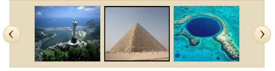
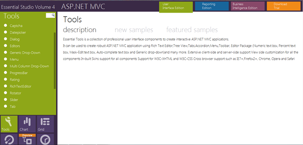

::: {style="DISPLAY: none"}
{#d2h_url_template}{#d2h_package_url style="WIDTH: 0px; DISPLAY: none; HEIGHT: 0px"}
:::

::::: {#nsbanner .d2h_main_nsbanner style="BORDER-BOTTOM: #999999 1px solid; POSITION: relative; PADDING-BOTTOM: 0px; BACKGROUND-COLOR: transparent; PADDING-LEFT: 0px; PADDING-RIGHT: 0px; DISPLAY: none; BORDER-TOP: #999999 1px solid; PADDING-TOP: 0px; LEFT: 0px"}
:::: {#TitleRow .d2h_main_titlerow style="PADDING-BOTTOM: 4px; BACKGROUND-COLOR: transparent; PADDING-LEFT: 22px; WIDTH: 100%; PADDING-RIGHT: 10px; DISPLAY: none; PADDING-TOP: 4px"}
::: {#ienav .d2h_main_ienav style="DISPLAY: none"}
{#D2HPrevious .D2HPreviousEnabled}  {#D2HNext .D2HNextEnabled}
:::
::::
:::::

:::: {#nstext .d2h_main_nstext style="PADDING-BOTTOM: 10px; BACKGROUND-COLOR: transparent; PADDING-LEFT: 22px; PADDING-RIGHT: 10px; HEIGHT: 100%; OVERFLOW: auto; PADDING-TOP: 5px" hasuserbackground="true" valign="bottom"}
::: {#d2h_breadcrumbs .d2h_breadcrumbs}
[Essential Studio User Guide Documentation](ms-xhelp:///?Id=12457748-09e3-4d74-a240-8e049cedf030){.d2h_breadcrumbsNormal}[ \> ]{.d2h_breadcrumbsLinkSeparator}[User Interface Edition](ms-xhelp:///?Id=c29296b7-531c-413b-a0ec-488ca1f7f669){.d2h_breadcrumbsNormal}[ \> ]{.d2h_breadcrumbsLinkSeparator}[Essential ASP.NET MVC](ms-xhelp:///?Id=4b14e7d1-65c4-4f67-b1aa-2c37709905a5){.d2h_breadcrumbsNormal}[ \> ]{.d2h_breadcrumbsLinkSeparator}[Essential Tools]{.d2h_breadcrumbsContentsOnly}[ \> ]{.d2h_breadcrumbsLinkSeparator}[Controls and Components](ms-xhelp:///?Id=f0af2fff-6f00-4ca4-85a6-54e41ac5dc96){.d2h_breadcrumbsNormal}
:::

## Rotator Control {#rotator-control style="tab-stops: 0pt"}

The Essential Tools Rotator control for MVC allows users to scroll through, and view items in a list, or gallery, with ease, and possibly to select one of them.

[]{style="COLOR: black"} 

Use Case Scenarios[]{style="COLOR: #4f81bd"}

The user can-

[·      ]{style="FONT-FAMILY: Symbol"}Concentrate on a few items at a time instead of going through a large collection one at a time

[·      ]{style="FONT-FAMILY: Symbol"}Use this option when there isn't enough space to display all the items required.

[·      ]{style="FONT-FAMILY: Symbol"}Display highly visual objects such as pictures, photos, posters, etc. using this control.

 

Appearance and Structure[]{style="COLOR: #4f81bd"}

The following figure gives you a basic idea of the structure and appearance of the Rotator control in MVC Tools-

{border="0"}

Figure 223: Rotator Control with ButtonMode enabled

[]{style="FONT-FAMILY: 'Calibri','sans-serif'; FONT-SIZE: 11pt"} 

Where do I find Installed samples?

To view the samples:

1.   Click **Dashboard.** **The Essential Studio Enterprise Edition** window is displayed, and the User Interface Edition panel is displayed by default.

2.   Click the **Run Locally Installed Samples** link. The Essential Studio MVC Edition sample browser is displayed.

3.   Select **Tools** from the drop-down.

 

{border="0"}

Figure 224: MVC Tools Sample Browser

 

4.   Select any sample from the Rotator tab provided and browse through the features.

 

 

Source Code Location

The full source code of the Rotator Control will be available on the purchase of the product.

The default location of the Essential Tools MVC source code is:

***\[System Drive\]:\\Program Files\\Syncfusion\\Essential Studio\\\[Version Number\]\\MVC\\Tools.MVC\\Src***

**** 

**** 

 

More:

[ ]{#related-topics}

[{border="0" align="absMiddle"}Concepts and Features of the Rotator control](ms-xhelp:///?Id=3b88a186-d38d-4869-9af5-d620bd52c3eb){style="TEXT-DECORATION: none"}

[{border="0" align="absMiddle"}Adding Rotator control to MVC Tools](ms-xhelp:///?Id=d59aa359-d359-4cda-ad16-3c118a09c4e5){style="TEXT-DECORATION: none"}

[{border="0" align="absMiddle"}How to bind data to the Rotator control?](ms-xhelp:///?Id=64458498-3f1a-4a8b-941f-01692abe8368){style="TEXT-DECORATION: none"}
::::
